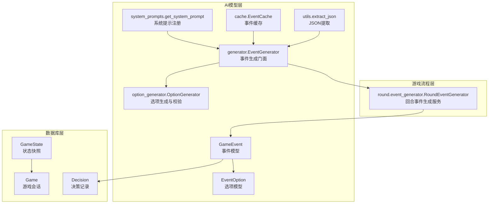
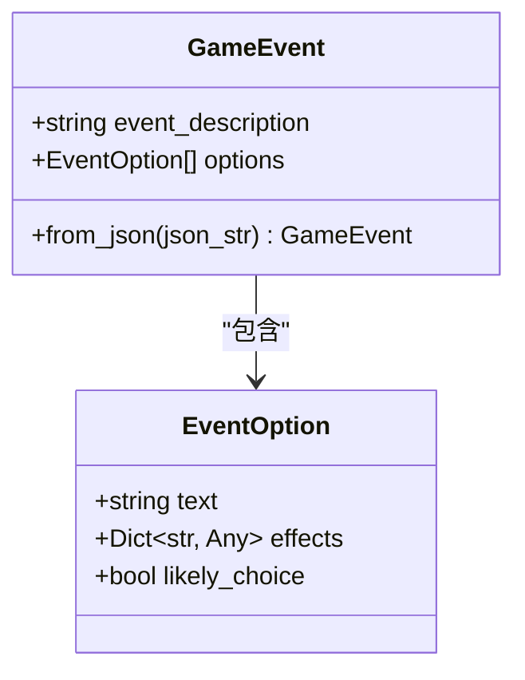
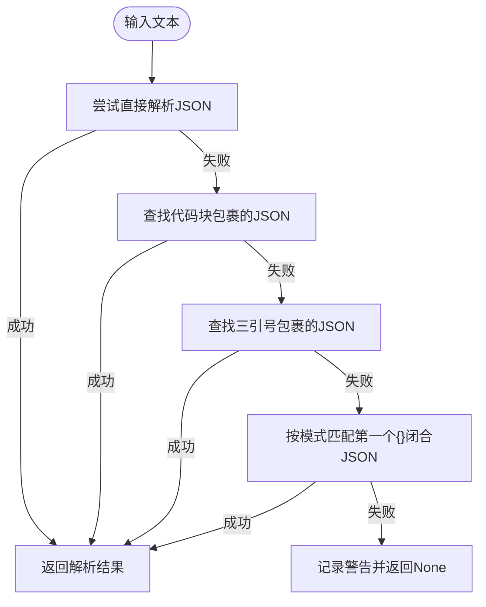
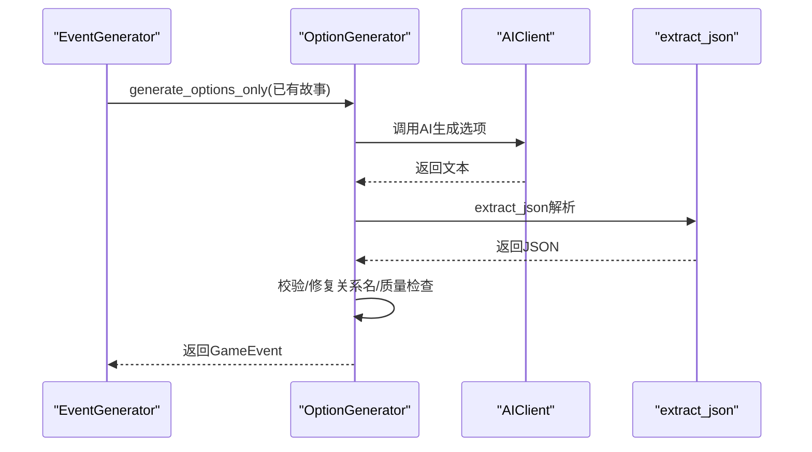
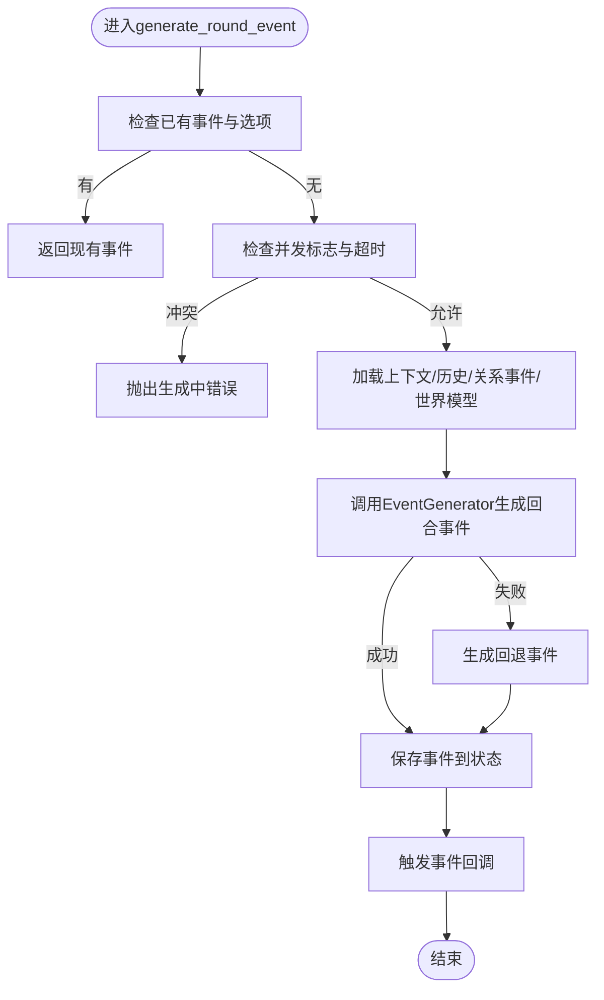
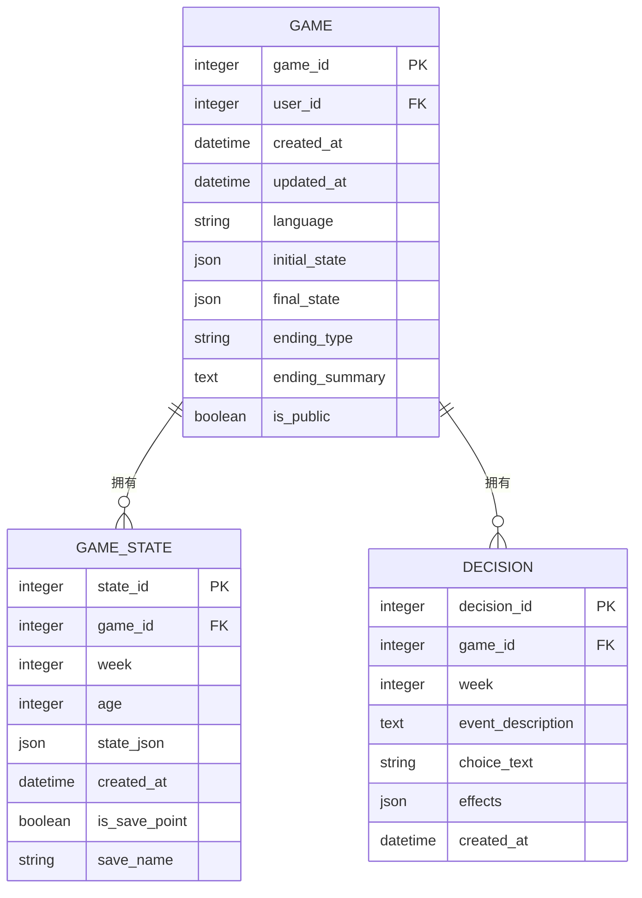
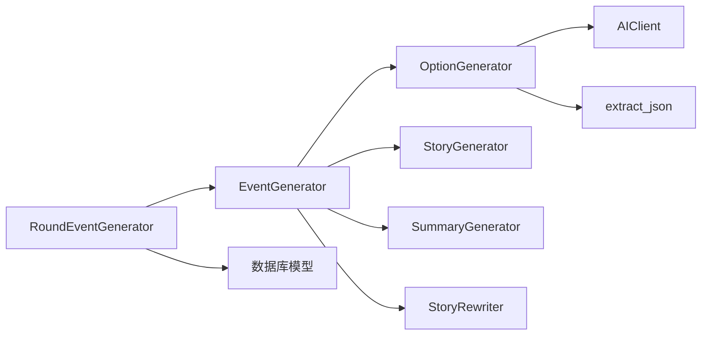

# AI模型定义

<cite>
**本文引用的文件**
- [src/ai/models.py](file://src/ai/models.py)
- [src/ai/utils.py](file://src/ai/utils.py)
- [src/ai/cache.py](file://src/ai/cache.py)
- [src/ai/generator.py](file://src/ai/generator.py)
- [src/ai/option_generator.py](file://src/ai/option_generator.py)
- [src/ai/system_prompts.py](file://src/ai/system_prompts.py)
- [src/game/round/event_generator.py](file://src/game/round/event_generator.py)
- [src/database/models.py](file://src/database/models.py)
- [data/presets/events.json](file://data/presets/events.json)
- [data/cache/events_cache.json](file://data/cache/events_cache.json)
- [tests/test_events.py](file://tests/test_events.py)
</cite>

## 目录
1. [简介](#简介)
2. [项目结构](#项目结构)
3. [核心组件](#核心组件)
4. [架构总览](#架构总览)
5. [详细组件分析](#详细组件分析)
6. [依赖分析](#依赖分析)
7. [性能考量](#性能考量)
8. [故障排查指南](#故障排查指南)
9. [结论](#结论)
10. [附录](#附录)

## 简介
本文件面向AI模型定义模块，聚焦于GameEvent与EventOption两大核心数据模型的设计与实现，系统阐述字段定义、数据类型约束与验证规则，以及序列化/反序列化机制（含JSON转换与数据完整性保障）、工具函数（JSON提取、文本清理、数据格式化）、与数据库映射关系与ORM配置，并提供模型使用示例、最佳实践、扩展与自定义指导，以及版本管理与向后兼容策略。

## 项目结构
AI模型定义位于src/ai目录，围绕GameEvent与EventOption两类Pydantic模型构建，配合工具函数、缓存、系统提示与生成器，形成从AI生成到持久化的闭环。数据库模型位于src/database/models.py，其中与事件直接相关的是Game、GameState、Decision等，用于保存游戏状态、决策与结局等。



图表来源
- [src/ai/models.py](file://src/ai/models.py#L7-L27)
- [src/ai/utils.py](file://src/ai/utils.py#L10-L77)
- [src/ai/cache.py](file://src/ai/cache.py#L13-L139)
- [src/ai/generator.py](file://src/ai/generator.py#L30-L497)
- [src/ai/option_generator.py](file://src/ai/option_generator.py#L17-L264)
- [src/ai/system_prompts.py](file://src/ai/system_prompts.py#L242-L279)
- [src/game/round/event_generator.py](file://src/game/round/event_generator.py#L16-L521)
- [src/database/models.py](file://src/database/models.py#L70-L127)

章节来源
- [src/ai/models.py](file://src/ai/models.py#L1-L27)
- [src/database/models.py](file://src/database/models.py#L1-L295)

## 核心组件
- GameEvent：完整事件对象，包含事件描述与选项集合，支持从JSON字符串构造。
- EventOption：单个事件选项，包含文本与效果字典，支持“是否倾向选择”的标记。
- 工具函数extract_json：从AI响应中提取JSON，兼容多种包裹形式与嵌入模式。
- 缓存EventCache：基于玩家状态签名的事件缓存，降低API调用成本。
- 生成器EventGenerator：事件生成门面，协调故事生成、选项生成与摘要生成。
- 选项生成器OptionGenerator：生成并校验事件选项，修复关系名，质量检查。
- 系统提示system_prompts：集中管理各类AI系统提示，确保KV缓存前缀稳定与行为一致。
- 回合事件生成服务RoundEventGenerator：封装回合事件生成流程，含超时与并发控制、预定事件与回退事件生成。

章节来源
- [src/ai/models.py](file://src/ai/models.py#L7-L27)
- [src/ai/utils.py](file://src/ai/utils.py#L10-L77)
- [src/ai/cache.py](file://src/ai/cache.py#L13-L139)
- [src/ai/generator.py](file://src/ai/generator.py#L30-L497)
- [src/ai/option_generator.py](file://src/ai/option_generator.py#L17-L264)
- [src/ai/system_prompts.py](file://src/ai/system_prompts.py#L242-L279)
- [src/game/round/event_generator.py](file://src/game/round/event_generator.py#L16-L521)

## 架构总览
AI模型定义模块采用分层设计：
- 数据模型层：Pydantic模型定义字段与约束，提供from_json构造器与自动验证。
- 工具与服务层：JSON提取、缓存、系统提示、生成器与选项校验。
- 游戏流程层：回合事件生成服务，串联AI生成与业务流程。
- 数据持久化层：数据库模型保存游戏状态、决策与结局。

```mermaid
sequenceDiagram
participant FE as "前端/调用方"
participant REG as "回合事件生成服务"
participant GEN as "事件生成门面"
participant OPT as "选项生成器"
participant AI as "AIClient"
participant DB as "数据库"
FE->>REG : 请求生成回合事件
REG->>GEN : generate_round_event(...)
GEN->>OPT : generate_options_only(已有故事)
OPT->>AI : 调用AI生成选项(系统提示)
AI-->>OPT : 返回JSON字符串
OPT->>OPT : extract_json解析
OPT->>OPT : 校验与修复关系名/质量检查
OPT-->>GEN : 返回GameEvent(含选项)
GEN-->>REG : 返回GameEvent
REG->>DB : 保存当前事件到状态
REG-->>FE : 返回GameEvent
```

图表来源
- [src/game/round/event_generator.py](file://src/game/round/event_generator.py#L75-L261)
- [src/ai/generator.py](file://src/ai/generator.py#L270-L314)
- [src/ai/option_generator.py](file://src/ai/option_generator.py#L25-L133)
- [src/ai/utils.py](file://src/ai/utils.py#L10-L77)
- [src/database/models.py](file://src/database/models.py#L94-L127)

## 详细组件分析

### GameEvent与EventOption数据模型
- 字段与约束
  - GameEvent
    - event_description：字符串，最大长度约10000字符，用于长故事描述。
    - options：列表，至少2项且至多4项，元素为EventOption。
    - from_json：类方法，从JSON字符串创建GameEvent，内置JSON解析与验证错误处理。
  - EventOption
    - text：字符串，最大长度约200字符，用于选项文本。
    - effects：字典，包含数值型影响项（如energy、mood、knowledge、wealth、action_points），以及可选的relationships映射。
    - likely_choice：布尔，默认False，标记是否为角色倾向选择。
- 验证与序列化
  - Pydantic自动验证字段类型与长度约束。
  - from_json提供容错的JSON解析与错误包装，便于上层捕获无效格式。
  - 与数据库交互时，可通过model_dump()导出字典，再写入JSON列或缓存。



图表来源
- [src/ai/models.py](file://src/ai/models.py#L7-L27)

章节来源
- [src/ai/models.py](file://src/ai/models.py#L7-L27)
- [tests/test_events.py](file://tests/test_events.py#L11-L45)

### JSON提取与文本清理工具
- extract_json
  - 处理纯JSON、代码块包裹（```json...```、```...```、'''json...'''、''''...''''）与嵌入JSON的多种模式。
  - 匹配首个花括号闭合的JSON对象，避免非JSON前缀干扰。
  - 记录失败日志，便于定位AI输出格式问题。
- 文本清理与格式化
  - 生成器侧通过系统提示与重试机制减少格式偏差。
  - 选项生成器在解析失败时提供回退选项，保证可用性。



图表来源
- [src/ai/utils.py](file://src/ai/utils.py#L10-L77)

章节来源
- [src/ai/utils.py](file://src/ai/utils.py#L10-L77)

### 事件生成与选项校验
- 事件生成门面
  - EventGenerator聚合StoryGenerator、OptionGenerator、SummaryGenerator与StoryRewriter，提供统一接口。
  - 支持预设里程碑事件、缓存命中、重试与流式输出。
- 选项生成与校验
  - OptionGenerator基于系统提示生成选项，使用extract_json解析AI响应。
  - validate_and_fix_relationships：修复关系名（大小写、角色名匹配、非key_people保留），确保关系目标合法。
  - validate_event_quality：检查选项数量、action_points默认值、数值合理性与权衡性。



图表来源
- [src/ai/generator.py](file://src/ai/generator.py#L30-L497)
- [src/ai/option_generator.py](file://src/ai/option_generator.py#L25-L133)
- [src/ai/utils.py](file://src/ai/utils.py#L10-L77)

章节来源
- [src/ai/generator.py](file://src/ai/generator.py#L30-L497)
- [src/ai/option_generator.py](file://src/ai/option_generator.py#L17-L264)

### 回合事件生成与回退机制
- 并发与超时控制：防止重复生成，超时自动重置标志位。
- 预定事件：检测并强制生成承诺事件，确保叙事一致性。
- 回退事件：AI生成失败时生成简单事件，保证体验连续性。



图表来源
- [src/game/round/event_generator.py](file://src/game/round/event_generator.py#L75-L261)

章节来源
- [src/game/round/event_generator.py](file://src/game/round/event_generator.py#L16-L521)

### 数据库映射与ORM配置
- 与事件直接相关的数据库模型
  - Game：游戏会话，包含initial_state、final_state、ending_type、ending_summary等JSON字段。
  - GameState：状态快照，state_json为JSON列，is_save_point与save_name用于存档管理。
  - Decision：决策记录，包含event_description、choice_text、effects(JSON)等。
- ORM特性
  - 使用SQLAlchemy声明式基类，支持关系映射与级联删除。
  - JSON列用于存储复杂结构（如initial_state、final_state、effects），便于灵活扩展。
  - 会话管理with_db_session装饰器与get_db上下文管理器，确保会话生命周期与资源释放。



图表来源
- [src/database/models.py](file://src/database/models.py#L70-L127)

章节来源
- [src/database/models.py](file://src/database/models.py#L1-L295)

### 序列化与反序列化机制
- Pydantic模型
  - 自动序列化为Python字典（model_dump），适合写入JSON列或缓存。
  - from_json类方法提供从JSON字符串反序列化，内置错误处理。
- 缓存系统
  - EventCache基于玩家状态签名生成MD5键，定期保存至events_cache.json。
  - 读取时随机30%概率命中缓存，平衡稳定性与多样性。
- 预设与缓存数据
  - data/presets/events.json提供里程碑与特殊事件预设。
  - data/cache/events_cache.json为运行期缓存样本，展示事件结构。

章节来源
- [src/ai/models.py](file://src/ai/models.py#L19-L27)
- [src/ai/cache.py](file://src/ai/cache.py#L78-L128)
- [data/presets/events.json](file://data/presets/events.json#L1-L239)
- [data/cache/events_cache.json](file://data/cache/events_cache.json#L1-L800)

### 模型使用示例与最佳实践
- 创建GameEvent
  - 从JSON字符串：使用GameEvent.from_json(json_str)。
  - 手动构造：传入event_description与options列表。
- 生成选项
  - 使用OptionGenerator.generate_options_only(已有故事)生成选项。
  - 通过validate_and_fix_relationships修复关系名，validate_event_quality进行质量检查。
- 缓存与预设
  - EventGenerator默认启用缓存（settings.CACHE_EVENTS），可按需关闭。
  - 预设里程碑事件优先于AI生成，提高关键节点一致性。
- 错误处理
  - extract_json失败时记录警告，OptionGenerator回退生成默认选项。
  - RoundEventGenerator在AI失败时生成回退事件，保证流程不中断。

章节来源
- [src/ai/generator.py](file://src/ai/generator.py#L211-L268)
- [src/ai/option_generator.py](file://src/ai/option_generator.py#L25-L133)
- [src/ai/utils.py](file://src/ai/utils.py#L10-L77)
- [src/game/round/event_generator.py](file://src/game/round/event_generator.py#L262-L288)

### 模型扩展与自定义
- 扩展字段
  - 在GameEvent或EventOption中新增字段时，需同步更新from_json与缓存序列化逻辑。
  - 新增字段建议提供默认值与约束，确保向后兼容。
- 自定义系统提示
  - 通过system_prompts注册新的提示键，确保KV缓存前缀稳定。
- 选项校验增强
  - 可在validate_event_quality中增加更多约束（如最小/最大影响范围、关系名白名单）。
- 缓存策略
  - 调整签名策略（如加入更多状态维度）以提升命中率。
  - 控制随机命中概率以平衡多样性与稳定性。

章节来源
- [src/ai/system_prompts.py](file://src/ai/system_prompts.py#L242-L279)
- [src/ai/option_generator.py](file://src/ai/option_generator.py#L226-L264)
- [src/ai/cache.py](file://src/ai/cache.py#L47-L77)

### 版本管理与向后兼容
- 字段演进
  - 新增可选字段并提供默认值，避免破坏既有JSON。
  - 对必填字段变更采用迁移脚本或双轨并行。
- JSON解析健壮性
  - from_json与extract_json均具备容错能力，降低格式漂移带来的失败率。
- 缓存兼容
  - 缓存键基于状态签名，字段变更需谨慎，必要时清理旧缓存。
- 预设与回退
  - 预设事件与回退事件作为兼容层，确保旧客户端仍能获得有效事件。

章节来源
- [src/ai/models.py](file://src/ai/models.py#L19-L27)
- [src/ai/utils.py](file://src/ai/utils.py#L10-L77)
- [src/ai/cache.py](file://src/ai/cache.py#L78-L101)

## 依赖分析
- 组件耦合
  - EventGenerator依赖OptionGenerator、StoryGenerator、SummaryGenerator与AIClient。
  - OptionGenerator依赖AIClient与extract_json。
  - RoundEventGenerator依赖EventGenerator与数据库模型（通过状态持久化）。
- 外部依赖
  - OpenAI客户端（通过AIClient抽象）。
  - SQLAlchemy（数据库ORM）。
  - JSON与哈希库（缓存与序列化）。



图表来源
- [src/ai/generator.py](file://src/ai/generator.py#L30-L66)
- [src/ai/option_generator.py](file://src/ai/option_generator.py#L17-L22)
- [src/game/round/event_generator.py](file://src/game/round/event_generator.py#L16-L52)

章节来源
- [src/ai/generator.py](file://src/ai/generator.py#L30-L66)
- [src/ai/option_generator.py](file://src/ai/option_generator.py#L17-L22)
- [src/game/round/event_generator.py](file://src/game/round/event_generator.py#L16-L52)

## 性能考量
- 缓存命中率：EventCache按状态签名生成键，随机30%命中以平衡稳定性与多样性。
- API调用控制：EventGenerator支持重试与流式输出，减少一次性长对话带来的延迟。
- 数据库写入：JSON列适合动态结构，但需注意查询与索引策略，避免大字段频繁扫描。
- 并发与超时：RoundEventGenerator防止重复生成与长时间阻塞，提升系统鲁棒性。

## 故障排查指南
- JSON解析失败
  - 检查AI响应是否包含代码块包裹或非JSON前缀，使用extract_json进行提取。
  - 查看日志警告，定位响应格式问题。
- 选项生成异常
  - OptionGenerator在多次重试后仍失败时，会回退生成默认选项，检查系统提示与重试参数。
- 事件生成冲突
  - RoundEventGenerator检测并发标志与超时，避免重复生成；若出现“生成中，请等待”，稍后再试。
- 数据持久化问题
  - 确认JSON列写入前已通过model_dump()导出，检查数据库连接与事务提交。

章节来源
- [src/ai/utils.py](file://src/ai/utils.py#L10-L77)
- [src/ai/option_generator.py](file://src/ai/option_generator.py#L114-L133)
- [src/game/round/event_generator.py](file://src/game/round/event_generator.py#L100-L115)
- [src/database/models.py](file://src/database/models.py#L70-L127)

## 结论
AI模型定义模块以Pydantic模型为核心，结合工具函数、缓存与生成器，实现了高可靠、可扩展的事件生成体系。通过系统提示集中管理、严格的字段约束与验证、以及完善的回退与缓存策略，既保证了数据完整性与用户体验，也为后续扩展与版本演进提供了清晰路径。

## 附录
- 预设事件样例：参见data/presets/events.json。
- 运行期缓存样例：参见data/cache/events_cache.json。
- 单元测试参考：参见tests/test_events.py。