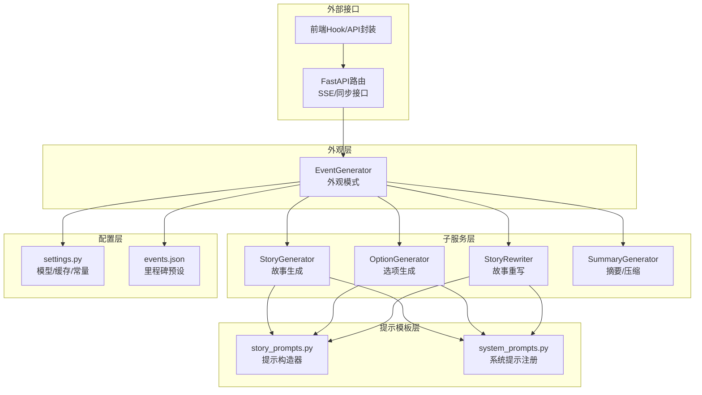
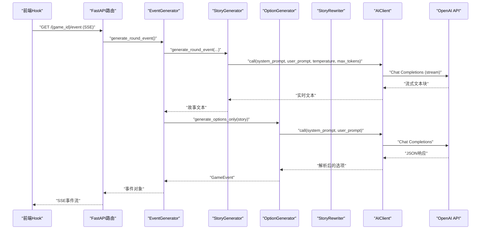
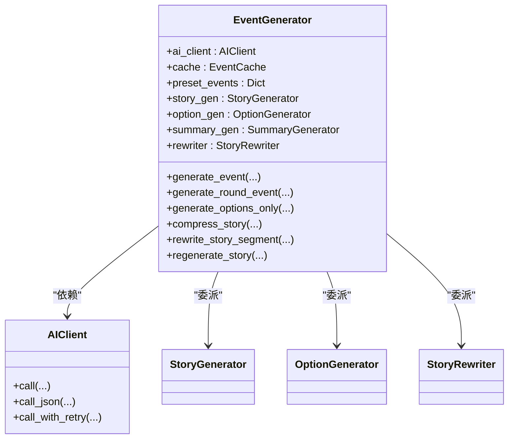
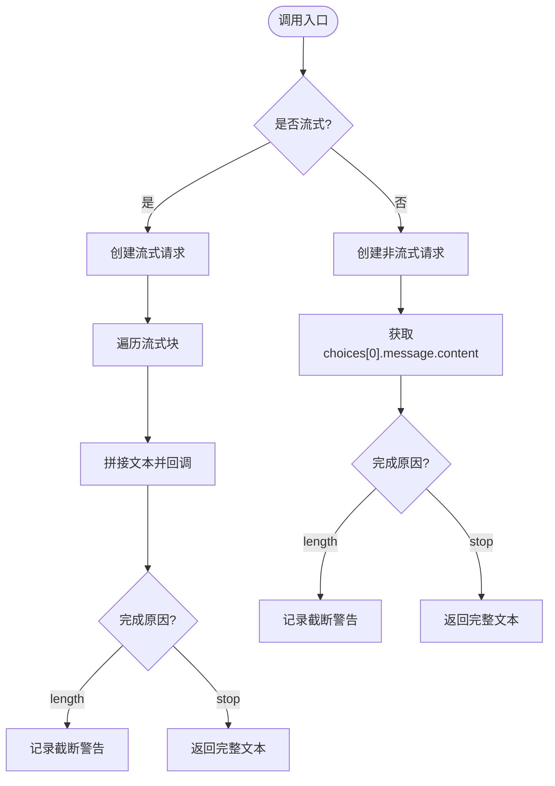
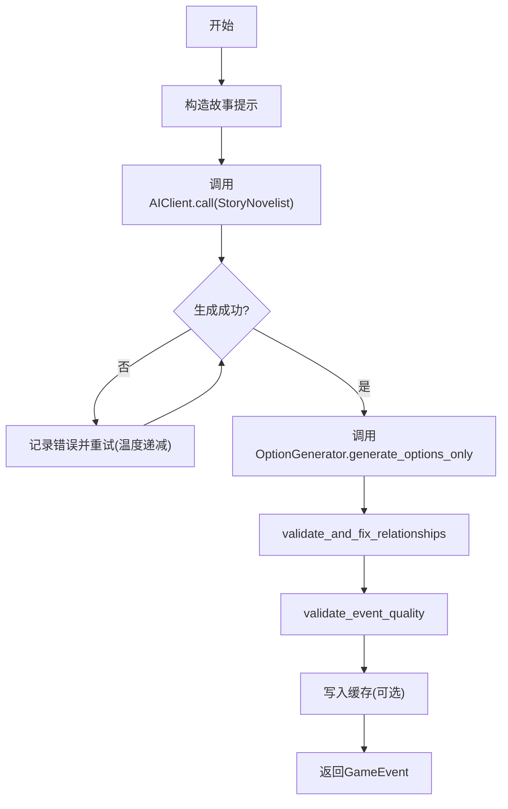
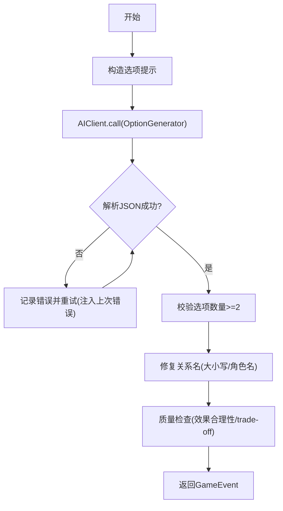
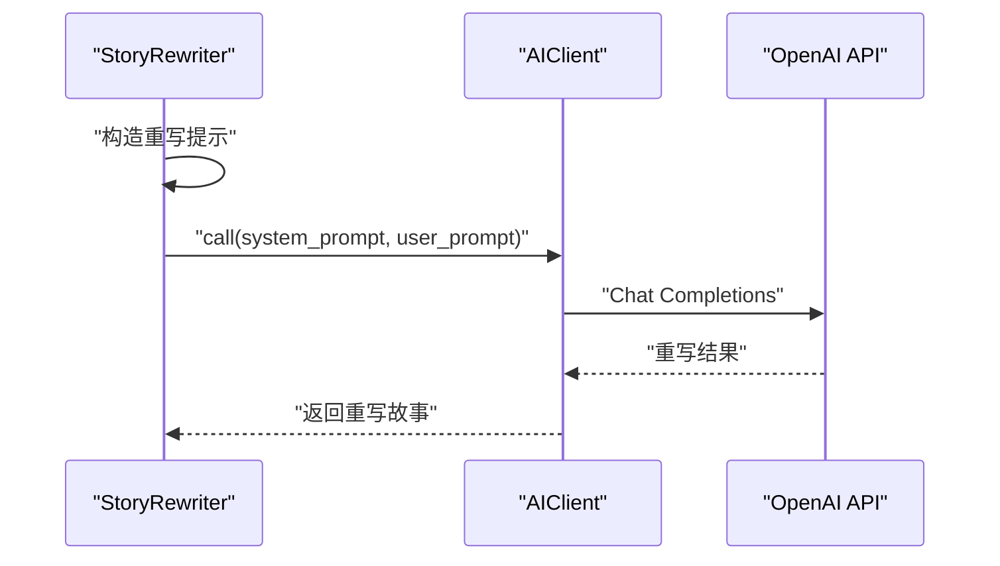
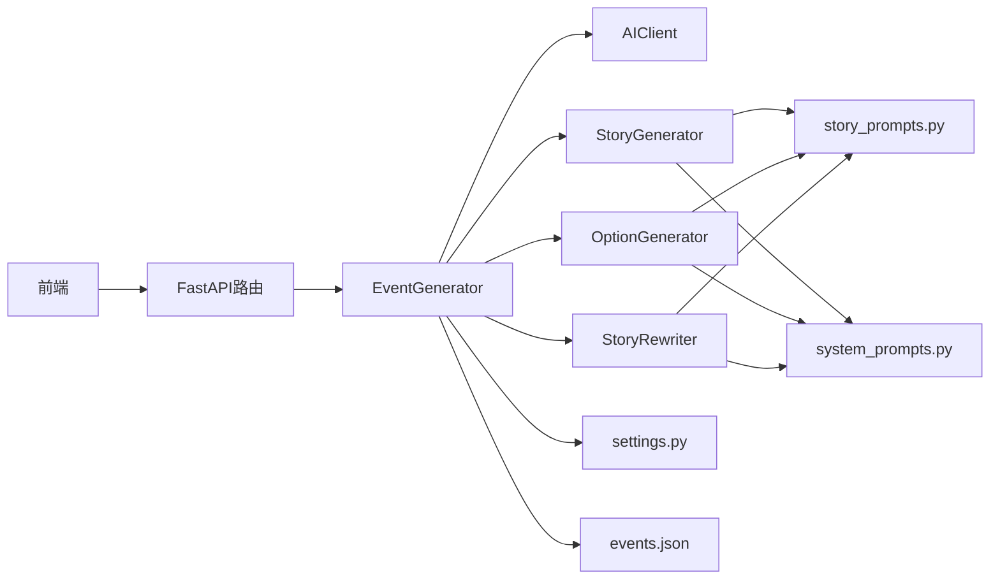

# AI生成系统

<cite>
**本文引用的文件**
- [src/ai/generator.py](file://src/ai/generator.py)
- [src/ai/client.py](file://src/ai/client.py)
- [src/ai/system_prompts.py](file://src/ai/system_prompts.py)
- [src/ai/story_generator.py](file://src/ai/story_generator.py)
- [src/ai/option_generator.py](file://src/ai/option_generator.py)
- [src/ai/story_rewriter.py](file://src/ai/story_rewriter.py)
- [src/ai/models.py](file://src/ai/models.py)
- [config/prompts/story_prompts.py](file://config/prompts/story_prompts.py)
- [config/settings.py](file://config/settings.py)
- [data/presets/events.json](file://data/presets/events.json)
- [frontend/src/hooks/game/useEventGenerator.ts](file://frontend/src/hooks/game/useEventGenerator.ts)
- [frontend/src/lib/api.ts](file://frontend/src/lib/api.ts)
- [src/api/routers/gameplay/events.py](file://src/api/routers/gameplay/events.py)
</cite>

## 目录
1. [简介](#简介)
2. [项目结构](#项目结构)
3. [核心组件](#核心组件)
4. [架构总览](#架构总览)
5. [详细组件分析](#详细组件分析)
6. [依赖关系分析](#依赖关系分析)
7. [性能考量](#性能考量)
8. [故障排除指南](#故障排除指南)
9. [结论](#结论)
10. [附录](#附录)

## 简介
本技术文档面向AI生成系统，重点阐述EventGenerator外观模式的设计与实现，以及围绕“故事生成—选项生成—重写与再生”的完整流水线。文档覆盖：
- 外观模式（Facade）如何统一AI服务入口，屏蔽底层复杂性
- 提示模板设计、参数配置与响应处理
- 选项生成器的算法与质量保障策略
- 故事重写器的功能与一致性保证
- AI模型配置、提示工程与响应解析机制
- API调用模式与错误处理策略
- 与OpenAI API的集成方式与性能优化技巧
- 故障排除指南与最佳实践

## 项目结构
系统采用“外观层 + 子服务层 + 提示模板层 + 配置层”的分层组织：
- 外观层：EventGenerator统一调度各子服务
- 子服务层：StoryGenerator、OptionGenerator、StoryRewriter、SummaryGenerator
- 提示模板层：config/prompts 下的各类提示构造器
- 配置层：config/settings.py 中的模型与运行参数
- 前端：SSE驱动的事件生成与回放，同步回退方案

图表来源
- [src/ai/generator.py](file://src/ai/generator.py#L30-L66)
- [src/ai/story_generator.py](file://src/ai/story_generator.py#L24-L29)
- [src/ai/option_generator.py](file://src/ai/option_generator.py#L17-L22)
- [src/ai/story_rewriter.py](file://src/ai/story_rewriter.py#L16-L21)
- [config/prompts/story_prompts.py](file://config/prompts/story_prompts.py#L21-L61)
- [src/ai/system_prompts.py](file://src/ai/system_prompts.py#L242-L279)
- [config/settings.py](file://config/settings.py#L27-L168)
- [data/presets/events.json](file://data/presets/events.json#L1-L239)
- [src/api/routers/gameplay/events.py](file://src/api/routers/gameplay/events.py#L48-L164)
- [frontend/src/hooks/game/useEventGenerator.ts](file://frontend/src/hooks/game/useEventGenerator.ts#L80-L217)

章节来源
- [src/ai/generator.py](file://src/ai/generator.py#L30-L66)
- [src/ai/story_generator.py](file://src/ai/story_generator.py#L24-L29)
- [src/ai/option_generator.py](file://src/ai/option_generator.py#L17-L22)
- [src/ai/story_rewriter.py](file://src/ai/story_rewriter.py#L16-L21)
- [config/prompts/story_prompts.py](file://config/prompts/story_prompts.py#L21-L61)
- [src/ai/system_prompts.py](file://src/ai/system_prompts.py#L242-L279)
- [config/settings.py](file://config/settings.py#L27-L168)
- [data/presets/events.json](file://data/presets/events.json#L1-L239)
- [src/api/routers/gameplay/events.py](file://src/api/routers/gameplay/events.py#L48-L164)
- [frontend/src/hooks/game/useEventGenerator.ts](file://frontend/src/hooks/game/useEventGenerator.ts#L80-L217)

## 核心组件
- EventGenerator（外观模式）：统一入口，协调AI客户端、缓存、子服务与预设事件
- AIClient（统一AI调用抽象层）：封装OpenAI SDK调用、流式回调、重试与错误反馈注入
- StoryGenerator（故事生成）：两阶段流水线第一步，生成故事文本并触发选项生成
- OptionGenerator（选项生成）：基于故事生成选项，进行关系名修复与质量校验
- StoryRewriter（故事重写）：段落级重写与整篇再生，维持一致性
- 提示模板与系统提示：集中化管理，确保KV缓存前缀稳定与行为一致
- 配置与预设：模型参数、缓存开关、里程碑事件预设

章节来源
- [src/ai/generator.py](file://src/ai/generator.py#L30-L66)
- [src/ai/client.py](file://src/ai/client.py#L22-L48)
- [src/ai/story_generator.py](file://src/ai/story_generator.py#L24-L29)
- [src/ai/option_generator.py](file://src/ai/option_generator.py#L17-L22)
- [src/ai/story_rewriter.py](file://src/ai/story_rewriter.py#L16-L21)
- [src/ai/system_prompts.py](file://src/ai/system_prompts.py#L242-L279)
- [config/settings.py](file://config/settings.py#L27-L168)
- [data/presets/events.json](file://data/presets/events.json#L1-L239)

## 架构总览
EventGenerator作为外观层，将“故事生成—选项生成—重写与再生”串联为统一流程，所有AI调用经由AIClient，确保：
- 单一控制点：统一错误处理、重试与流式回调
- 一致性：系统提示集中注册，KV缓存前缀稳定
- 可扩展：新增子服务只需接入外观层方法签名

图表来源
- [frontend/src/hooks/game/useEventGenerator.ts](file://frontend/src/hooks/game/useEventGenerator.ts#L112-L216)
- [src/api/routers/gameplay/events.py](file://src/api/routers/gameplay/events.py#L48-L164)
- [src/ai/generator.py](file://src/ai/generator.py#L270-L314)
- [src/ai/story_generator.py](file://src/ai/story_generator.py#L192-L310)
- [src/ai/option_generator.py](file://src/ai/option_generator.py#L25-L132)
- [src/ai/client.py](file://src/ai/client.py#L51-L124)

## 详细组件分析

### EventGenerator 外观模式
- 统一入口职责
  - 初始化AIClient、缓存、预设事件
  - 提供公共方法：generate_event、generate_round_event、generate_options_only、压缩/摘要、重写/再生
  - 向上兼容旧接口：generate_completion、generate_completion_json、generate_stream
- 缓存与预设
  - 使用EventCache按玩家状态缓存事件，force可绕过
  - 加载data/presets/events.json中的里程碑事件，按周数优先返回
- 子服务委派
  - 故事生成：StoryGenerator
  - 选项生成：OptionGenerator
  - 重写/再生：StoryRewriter
  - 摘要/压缩：SummaryGenerator

图表来源
- [src/ai/generator.py](file://src/ai/generator.py#L30-L66)
- [src/ai/client.py](file://src/ai/client.py#L22-L48)

章节来源
- [src/ai/generator.py](file://src/ai/generator.py#L30-L66)
- [data/presets/events.json](file://data/presets/events.json#L1-L239)

### AIClient 统一AI调用抽象层
- 职责
  - 封装openai.OpenAI客户端初始化与调用
  - 支持流式回调与非流式两种模式
  - 提供call_json解析JSON响应
  - 提供call_with_retry带错误反馈注入的重试机制
- 错误处理
  - 截断警告：max_tokens限制导致的截断会记录warning
  - 重试策略：将上次错误注入提示，引导模型避免重复错误
- 配置来源
  - OPENAI_API_KEY、OPENAI_MODEL、OPENAI_BASE_URL来自config.settings.settings

图表来源
- [src/ai/client.py](file://src/ai/client.py#L51-L124)
- [src/ai/client.py](file://src/ai/client.py#L159-L232)

章节来源
- [src/ai/client.py](file://src/ai/client.py#L22-L48)
- [src/ai/client.py](file://src/ai/client.py#L51-L124)
- [src/ai/client.py](file://src/ai/client.py#L127-L156)
- [src/ai/client.py](file://src/ai/client.py#L159-L232)
- [config/settings.py](file://config/settings.py#L30-L34)

### StoryGenerator 两阶段故事生成
- 两阶段流水线
  - Step 1：生成故事文本（纯叙事，无JSON）
  - Step 2：基于故事生成选项（OptionGenerator）
- 一致性校验与重试
  - 若提供world_model，生成后进行一致性验证
  - 仅对“关键问题”触发一次性重试，温度固定为0.7
- 温度策略
  - 初次生成：0.85；重试：0.7；逐步保守，降低幻觉风险
- 输出
  - GameEvent（event_description + options）

图表来源
- [src/ai/story_generator.py](file://src/ai/story_generator.py#L32-L190)
- [src/ai/story_generator.py](file://src/ai/story_generator.py#L278-L425)

章节来源
- [src/ai/story_generator.py](file://src/ai/story_generator.py#L32-L190)
- [src/ai/story_generator.py](file://src/ai/story_generator.py#L278-L425)

### OptionGenerator 选项生成与质量保障
- 输入：已有故事文本、玩家状态、角色设定
- 输出：GameEvent（保留原文，注入选项）
- 质量保障
  - 关系名修复：基于key_people与family成员列表，支持大小写匹配与角色名匹配
  - 选项质量校验：至少2个选项、包含action_points、效果值合理性检查
- 失败回退
  - 生成失败时返回默认选项（积极面对/保持平常心）

图表来源
- [src/ai/option_generator.py](file://src/ai/option_generator.py#L25-L132)
- [src/ai/option_generator.py](file://src/ai/option_generator.py#L136-L225)
- [src/ai/option_generator.py](file://src/ai/option_generator.py#L226-L264)

章节来源
- [src/ai/option_generator.py](file://src/ai/option_generator.py#L25-L132)
- [src/ai/option_generator.py](file://src/ai/option_generator.py#L136-L225)
- [src/ai/option_generator.py](file://src/ai/option_generator.py#L226-L264)

### StoryRewriter 故事重写与再生
- 段落级重写
  - 接收完整故事、待替换段落、用户指令、角色设定、上下文
  - 返回重写后的完整故事
- 整篇再生
  - 基于玩家状态、角色设定、先前故事上下文生成全新故事
  - 重试失败时返回友好提示

图表来源
- [src/ai/story_rewriter.py](file://src/ai/story_rewriter.py#L24-L117)
- [src/ai/story_rewriter.py](file://src/ai/story_rewriter.py#L118-L201)

章节来源
- [src/ai/story_rewriter.py](file://src/ai/story_rewriter.py#L24-L117)
- [src/ai/story_rewriter.py](file://src/ai/story_rewriter.py#L118-L201)

### 提示模板与系统提示
- 系统提示集中注册：get_system_prompt(key, language)返回对应语言的系统提示
- 提示模板：get_story_only_prompt、get_options_only_prompt、get_event_generation_prompt等
- 一致性保障：KV缓存前缀稳定，便于LLM侧缓存命中

章节来源
- [src/ai/system_prompts.py](file://src/ai/system_prompts.py#L242-L279)
- [config/prompts/story_prompts.py](file://config/prompts/story_prompts.py#L612-L800)

### 数据模型
- GameEvent：包含event_description与options列表
- EventOption：text、effects、likely_choice
- Pydantic校验：字段长度与类型约束，from_json反序列化

章节来源
- [src/ai/models.py](file://src/ai/models.py#L7-L27)

## 依赖关系分析
- 外观层依赖统一AI客户端，避免直接依赖第三方SDK
- 子服务共享AIClient，确保一致的错误处理与重试策略
- 提示模板与系统提示集中管理，避免分散配置
- 前端通过SSE与同步接口访问后端，后端通过外观层调度AI服务

图表来源
- [frontend/src/lib/api.ts](file://frontend/src/lib/api.ts#L329-L377)
- [src/api/routers/gameplay/events.py](file://src/api/routers/gameplay/events.py#L48-L164)
- [src/ai/generator.py](file://src/ai/generator.py#L30-L66)
- [src/ai/client.py](file://src/ai/client.py#L22-L48)
- [config/prompts/story_prompts.py](file://config/prompts/story_prompts.py#L21-L61)
- [src/ai/system_prompts.py](file://src/ai/system_prompts.py#L242-L279)
- [config/settings.py](file://config/settings.py#L27-L168)
- [data/presets/events.json](file://data/presets/events.json#L1-L239)

章节来源
- [frontend/src/lib/api.ts](file://frontend/src/lib/api.ts#L329-L377)
- [src/api/routers/gameplay/events.py](file://src/api/routers/gameplay/events.py#L48-L164)
- [src/ai/generator.py](file://src/ai/generator.py#L30-L66)
- [src/ai/client.py](file://src/ai/client.py#L22-L48)
- [config/prompts/story_prompts.py](file://config/prompts/story_prompts.py#L21-L61)
- [src/ai/system_prompts.py](file://src/ai/system_prompts.py#L242-L279)
- [config/settings.py](file://config/settings.py#L27-L168)
- [data/presets/events.json](file://data/presets/events.json#L1-L239)

## 性能考量
- 流式输出：前端SSE与AIClient流式回调，降低首屏延迟
- 温度递减：故事生成采用渐进式温度策略，提升一致性
- 一致性重试：仅对关键问题重试，避免不必要的重复计算
- 缓存：EventCache按玩家状态缓存事件，减少重复生成
- 超时与并发控制：后端使用asyncio.Lock与生成标志位防止并发与卡死
- 最大令牌限制：warn截断，必要时增加max_tokens

章节来源
- [src/ai/story_generator.py](file://src/ai/story_generator.py#L106-L135)
- [src/ai/client.py](file://src/ai/client.py#L99-L121)
- [src/api/routers/gameplay/events.py](file://src/api/routers/gameplay/events.py#L89-L120)

## 故障排除指南
- SSE连接中断
  - 前端回退到轮询：最大轮询时间120秒，间隔3秒
  - 后端检测生成标志位超时（60秒）并强制重置
- 404/会话失效
  - 前端尝试恢复会话并重试生成
- 选项生成失败
  - 注入上次错误反馈，引导模型修正格式
  - 回退到默认选项
- 截断警告
  - max_tokens不足，适当增大max_tokens
- 并发冲突
  - 后端使用锁与生成标志位，避免重复生成

章节来源
- [frontend/src/hooks/game/useEventGenerator.ts](file://frontend/src/hooks/game/useEventGenerator.ts#L127-L213)
- [src/api/routers/gameplay/events.py](file://src/api/routers/gameplay/events.py#L89-L120)
- [src/ai/client.py](file://src/ai/client.py#L99-L121)
- [src/ai/option_generator.py](file://src/ai/option_generator.py#L114-L132)

## 结论
本系统通过EventGenerator外观模式实现了AI服务的统一入口与抽象层设计，结合集中化的提示模板与系统提示，确保了生成质量与一致性。两阶段故事生成与选项生成流程、段落重写与整篇再生能力，以及完善的错误处理与性能优化策略，共同构成了稳定可靠的AI生成体系。建议在生产环境中持续监控生成耗时与截断率，动态调整max_tokens与温度策略，并定期更新提示模板以适配业务演进。

## 附录

### API调用模式与错误处理策略
- SSE流式生成
  - 前端：useEventGenerator.ts通过streamGameEvent订阅事件
  - 后端：events.py提供SSE端点，支持Last-Event-ID重连
  - 错误：SSE错误时回退到轮询，最大120秒
- 同步回退
  - 前端：移动端使用generateEventSync
  - 后端：events.py提供event-sync端点，阻塞执行
- 错误处理
  - 前端：parseSSEError解析错误消息，区分404与未知错误
  - 后端：生成标志位超时强制重置，避免卡死

章节来源
- [frontend/src/hooks/game/useEventGenerator.ts](file://frontend/src/hooks/game/useEventGenerator.ts#L80-L217)
- [frontend/src/lib/api.ts](file://frontend/src/lib/api.ts#L354-L377)
- [src/api/routers/gameplay/events.py](file://src/api/routers/gameplay/events.py#L48-L164)

### 配置示例与最佳实践
- 模型与基础URL
  - OPENAI_API_KEY、OPENAI_MODEL、OPENAI_BASE_URL来自环境变量
- 缓存开关
  - CACHE_EVENTS=true启用事件缓存
- 里程碑事件
  - 在data/presets/events.json中配置周数与多语言事件
- 提示工程
  - 使用system_prompts.py集中管理系统提示
  - 使用story_prompts.py构造上下文与约束
- 最佳实践
  - 保持系统提示稳定，确保KV缓存前缀一致
  - 适度增大max_tokens，避免截断
  - 使用温度递减策略提升一致性
  - 对关键问题进行重试，一般问题直接返回

章节来源
- [config/settings.py](file://config/settings.py#L30-L34)
- [config/settings.py](file://config/settings.py#L72-L73)
- [data/presets/events.json](file://data/presets/events.json#L1-L239)
- [src/ai/system_prompts.py](file://src/ai/system_prompts.py#L242-L279)
- [config/prompts/story_prompts.py](file://config/prompts/story_prompts.py#L21-L61)