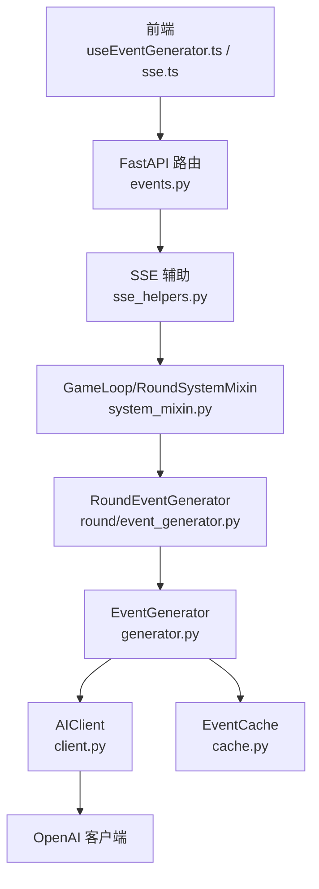
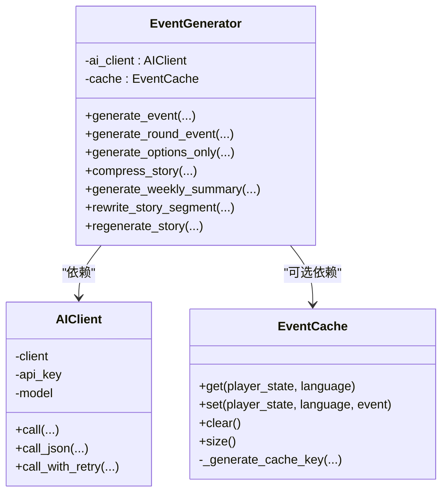
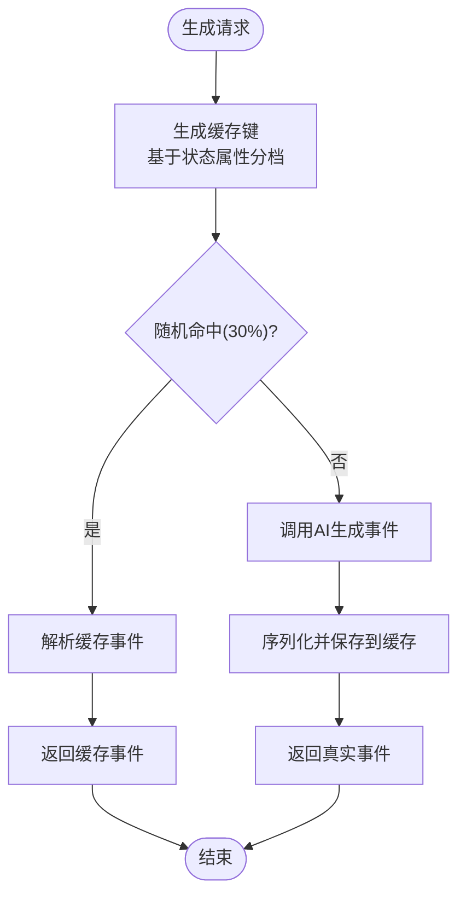
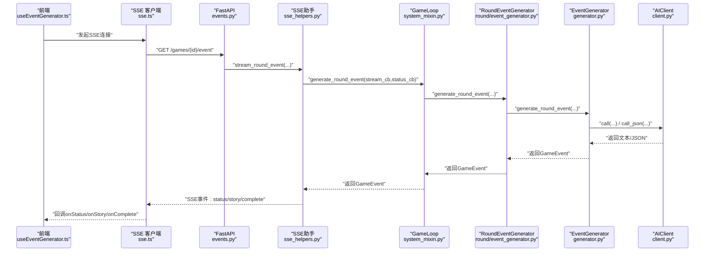
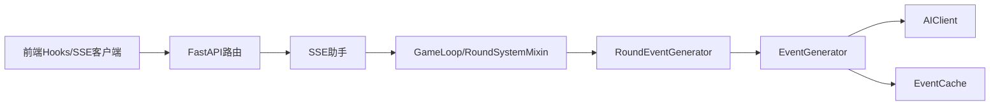

# 事件生成器外观模式

<cite>
**本文档引用的文件**
- [src/ai/generator.py](file://src/ai/generator.py)
- [src/ai/client.py](file://src/ai/client.py)
- [src/ai/cache.py](file://src/ai/cache.py)
- [src/game/round/event_generator.py](file://src/game/round/event_generator.py)
- [src/game/round/system_mixin.py](file://src/game/round/system_mixin.py)
- [src/api/routers/gameplay/events.py](file://src/api/routers/gameplay/events.py)
- [src/api/routers/gameplay/sse_helpers.py](file://src/api/routers/gameplay/sse_helpers.py)
- [frontend/src/hooks/game/useEventGenerator.ts](file://frontend/src/hooks/game/useEventGenerator.ts)
- [frontend/src/lib/sse.ts](file://frontend/src/lib/sse.ts)
- [config/settings.py](file://config/settings.py)
- [tests/test_events.py](file://tests/test_events.py)
</cite>

## 目录
1. [简介](#简介)
2. [项目结构](#项目结构)
3. [核心组件](#核心组件)
4. [架构总览](#架构总览)
5. [详细组件分析](#详细组件分析)
6. [依赖关系分析](#依赖关系分析)
7. [性能考虑](#性能考虑)
8. [故障排除指南](#故障排除指南)
9. [结论](#结论)
10. [附录](#附录)

## 简介
本文件系统化阐述事件生成器外观模式的设计与实现，重点围绕以下目标：
- EventGenerator 类作为外观模式的职责边界与对外统一接口设计
- AIClient 抽象层在API密钥管理、模型配置与错误处理方面的优势
- 事件缓存系统的工作原理、命中率优化与失效机制
- 外观模式如何简化客户端调用并提供向后兼容性
- 初始化参数配置、API调用示例与性能优化建议
- 故障排除指南与最佳实践

## 项目结构
事件生成相关模块分布于后端AI子系统与前端交互层，形成“外观层 → 子服务层 → 抽象层”的清晰分层：
- 外观层：EventGenerator（统一入口）
- 子服务层：StoryGenerator、OptionGenerator、SummaryGenerator、StoryRewriter
- 抽象层：AIClient（统一AI调用）
- 缓存层：EventCache（事件缓存）
- 协议层：SSE流式传输与同步回退
- 前端：React Hooks与SSE客户端

图表来源
- [src/api/routers/gameplay/events.py](file://src/api/routers/gameplay/events.py#L48-L212)
- [src/api/routers/gameplay/sse_helpers.py](file://src/api/routers/gameplay/sse_helpers.py#L137-L268)
- [src/game/round/system_mixin.py](file://src/game/round/system_mixin.py#L101-L112)
- [src/game/round/event_generator.py](file://src/game/round/event_generator.py#L75-L260)
- [src/ai/generator.py](file://src/ai/generator.py#L30-L175)
- [src/ai/client.py](file://src/ai/client.py#L22-L124)
- [src/ai/cache.py](file://src/ai/cache.py#L13-L139)

章节来源
- [src/ai/generator.py](file://src/ai/generator.py#L1-L497)
- [src/ai/client.py](file://src/ai/client.py#L1-L233)
- [src/ai/cache.py](file://src/ai/cache.py#L1-L139)
- [src/game/round/event_generator.py](file://src/game/round/event_generator.py#L1-L521)
- [src/game/round/system_mixin.py](file://src/game/round/system_mixin.py#L90-L255)
- [src/api/routers/gameplay/events.py](file://src/api/routers/gameplay/events.py#L1-L212)
- [src/api/routers/gameplay/sse_helpers.py](file://src/api/routers/gameplay/sse_helpers.py#L1-L562)
- [frontend/src/hooks/game/useEventGenerator.ts](file://frontend/src/hooks/game/useEventGenerator.ts#L1-L302)
- [frontend/src/lib/sse.ts](file://frontend/src/lib/sse.ts#L1-L520)
- [config/settings.py](file://config/settings.py#L1-L168)

## 核心组件
- EventGenerator（外观层）
  - 聚合AI子服务：故事生成、选项生成、摘要生成、重写
  - 对外提供统一接口，保留向后兼容签名
  - 通过AIClient封装所有AI调用，支持重试与JSON解析
- AIClient（抽象层）
  - 统一OpenAI客户端接入，集中管理API密钥、模型与基础URL
  - 提供流式与非流式调用，支持重试与错误反馈注入
- EventCache（缓存层）
  - 基于关键状态属性生成稳定缓存键，降低重复API调用
  - 随机命中策略提升多样性，定期持久化至events_cache.json
- RoundEventGenerator（回合事件生成器）
  - 封装回合上下文、历史摘要、关系事件与世界模型
  - 提供并发控制、超时重置与预定事件强制生成
- SSE与API路由（协议层）
  - FastAPI提供SSE与同步回退端点，支持断点续传与并发锁
  - 前端SSE客户端具备自动重连、指数退避与Last-Event-ID续传

章节来源
- [src/ai/generator.py](file://src/ai/generator.py#L30-L497)
- [src/ai/client.py](file://src/ai/client.py#L22-L233)
- [src/ai/cache.py](file://src/ai/cache.py#L13-L139)
- [src/game/round/event_generator.py](file://src/game/round/event_generator.py#L16-L260)
- [src/api/routers/gameplay/events.py](file://src/api/routers/gameplay/events.py#L48-L212)
- [src/api/routers/gameplay/sse_helpers.py](file://src/api/routers/gameplay/sse_helpers.py#L137-L268)

## 架构总览
外观模式通过EventGenerator将复杂AI服务调用封装为简洁统一接口，同时保留原有公共方法签名，确保向后兼容。AIClient作为抽象层隔离具体AI提供商细节，EventCache减少API调用成本，SSE与API路由保障流式体验与断点续传。

图表来源
- [src/ai/generator.py](file://src/ai/generator.py#L30-L175)
- [src/ai/client.py](file://src/ai/client.py#L22-L124)
- [src/ai/cache.py](file://src/ai/cache.py#L13-L139)

## 详细组件分析

### EventGenerator 外观模式详解
- 设计理念
  - 将多阶段两阶段故事生成、选项生成、摘要压缩与重写等复杂流程封装为统一入口
  - 保持旧版公共方法签名，确保现有调用方无需修改
- 关键能力
  - generate_event/generate_round_event：按回合/周生成事件
  - generate_options_only：对既有故事追加选项
  - compress_story/generate_weekly_summary：压缩与汇总
  - rewrite_story_segment/regenerate_story：段落重写与整轮重生成
  - generate_stream：直接返回流对象，便于UI实时渲染
- 与AIClient协作
  - 所有AI调用经由AIClient，统一错误处理与重试逻辑
  - call_with_retry在重试时注入上次错误反馈，提升输出质量

章节来源
- [src/ai/generator.py](file://src/ai/generator.py#L30-L497)

### AIClient 抽象层设计与优势
- API密钥与模型配置
  - 从全局settings读取OPENAI_API_KEY、OPENAI_MODEL、OPENAI_BASE_URL
  - 支持运行时覆盖model参数，灵活切换模型
- 错误处理与重试
  - call_with_retry在多次尝试失败后抛出明确异常
  - 重试时将上次错误注入提示词，帮助模型避免重复错误
- 流式与非流式调用
  - 流式：逐块推送文本，前端可实时渲染
  - 非流式：一次性返回完整文本
- JSON解析
  - call_json自动解析JSON并返回字典，简化结构化输出处理

章节来源
- [src/ai/client.py](file://src/ai/client.py#L22-L233)
- [config/settings.py](file://config/settings.py#L30-L34)

### 事件缓存系统工作原理
- 缓存键生成策略
  - 基于年龄、能量、心情、知识、财富、周数、决策历史长度与语言生成MD5键
  - 对连续型属性进行分档（如能量/10取整），降低微小波动导致的缓存失效
- 命中率优化
  - 仅30%概率命中缓存，其余70%触发真实生成，平衡稳定性与多样性
- 失效与持久化
  - clear()清空缓存并持久化
  - 事件序列化为字典后保存至events_cache.json，重启后可继续使用

图表来源
- [src/ai/cache.py](file://src/ai/cache.py#L47-L128)

章节来源
- [src/ai/cache.py](file://src/ai/cache.py#L13-L139)

### 回合事件生成器（RoundEventGenerator）
- 上下文构建
  - 从玩家状态提取周数、回合数、历史摘要、关系事件、世界模型等
  - 新人物引入与待引入队列管理
- 并发与超时控制
  - 生成标志位与起始时间戳，超过阈值自动重置
  - 防止并发生成，避免资源竞争
- 预定事件强制生成
  - 合并多个预定事件描述与提示，构建强制事件提示词
  - 调用AIClient生成，解析JSON并构造GameEvent
  - 失败时回退为简单预定事件

章节来源
- [src/game/round/event_generator.py](file://src/game/round/event_generator.py#L75-L521)

### SSE与API路由集成
- SSE端点
  - GET /{game_id}/event：流式事件生成，支持Last-Event-ID断点续传
  - POST /{game_id}/event-sync：移动端非流式回退
- 并发与超时
  - asyncio.Lock确保单实例生成
  - 生成标志位与超时检测，自动清理卡住状态
- 前端SSE客户端
  - 自动重连、指数退避、Last-Event-ID续传
  - onStatus/onStory/onComplete/onError回调解耦UI更新

图表来源
- [frontend/src/hooks/game/useEventGenerator.ts](file://frontend/src/hooks/game/useEventGenerator.ts#L80-L217)
- [frontend/src/lib/sse.ts](file://frontend/src/lib/sse.ts#L446-L452)
- [src/api/routers/gameplay/events.py](file://src/api/routers/gameplay/events.py#L48-L164)
- [src/api/routers/gameplay/sse_helpers.py](file://src/api/routers/gameplay/sse_helpers.py#L137-L268)
- [src/game/round/system_mixin.py](file://src/game/round/system_mixin.py#L101-L112)
- [src/game/round/event_generator.py](file://src/game/round/event_generator.py#L201-L221)
- [src/ai/generator.py](file://src/ai/generator.py#L293-L314)
- [src/ai/client.py](file://src/ai/client.py#L51-L124)

## 依赖关系分析
- 外观层依赖
  - EventGenerator依赖AIClient与EventCache，聚合多个子服务
- 服务层依赖
  - 子服务均依赖AIClient进行实际AI调用
- 协议层依赖
  - API路由依赖SSE助手与GameLoop，后者依赖外观层
- 前端依赖
  - 前端Hooks与SSE客户端依赖后端SSE端点

图表来源
- [src/api/routers/gameplay/events.py](file://src/api/routers/gameplay/events.py#L48-L212)
- [src/api/routers/gameplay/sse_helpers.py](file://src/api/routers/gameplay/sse_helpers.py#L137-L268)
- [src/game/round/system_mixin.py](file://src/game/round/system_mixin.py#L101-L112)
- [src/game/round/event_generator.py](file://src/game/round/event_generator.py#L75-L260)
- [src/ai/generator.py](file://src/ai/generator.py#L30-L175)
- [src/ai/client.py](file://src/ai/client.py#L22-L124)
- [src/ai/cache.py](file://src/ai/cache.py#L13-L139)

章节来源
- [src/ai/generator.py](file://src/ai/generator.py#L30-L175)
- [src/ai/client.py](file://src/ai/client.py#L22-L124)
- [src/ai/cache.py](file://src/ai/cache.py#L13-L139)
- [src/game/round/event_generator.py](file://src/game/round/event_generator.py#L16-L260)
- [src/game/round/system_mixin.py](file://src/game/round/system_mixin.py#L90-L112)
- [src/api/routers/gameplay/events.py](file://src/api/routers/gameplay/events.py#L48-L164)
- [src/api/routers/gameplay/sse_helpers.py](file://src/api/routers/gameplay/sse_helpers.py#L137-L268)
- [frontend/src/hooks/game/useEventGenerator.ts](file://frontend/src/hooks/game/useEventGenerator.ts#L80-L217)
- [frontend/src/lib/sse.ts](file://frontend/src/lib/sse.ts#L446-L452)

## 性能考虑
- 缓存命中率优化
  - 采用30%随机命中策略，在稳定性与多样性间取得平衡
  - 对连续型状态属性进行分档，降低微小波动导致的缓存失效
- 并发与超时
  - 生成标志位与超时阈值（默认60秒）自动清理卡住状态，避免资源泄漏
  - asyncio.Lock确保单实例生成，减少重复计算
- 流式传输
  - SSE边生成边推送，显著降低首屏延迟
  - 前端Last-Event-ID续传减少重复传输
- 模型与令牌限制
  - AIClient在响应被截断时发出警告，提示适当提高max_tokens
- 建议
  - 在高并发场景下，合理设置max_tokens与温度参数
  - 结合历史摘要与世界模型，减少重复上下文传输
  - 使用预设里程碑事件降低高频生成压力

[本节为通用性能指导，无需特定文件引用]

## 故障排除指南
- 常见错误与定位
  - “事件生成已在进行”：检查生成标志位与超时逻辑，确认是否卡住
  - “会话过期/不存在”：前端检测404并触发会话恢复流程
  - “连接中断/超时”：前端SSE客户端自动重连，必要时回退到同步端点
  - “缓存解析失败”：缓存损坏时自动忽略，触发真实生成
- 排查步骤
  - 检查OPENAI_API_KEY与OPENAI_MODEL配置
  - 查看SSE日志与事件ID，确认断点续传是否生效
  - 验证EventCache文件是否存在且可读写
  - 在测试中使用mock验证EventGenerator行为
- 相关实现参考
  - 会话恢复与错误处理：前端useEventGenerator.ts
  - SSE错误与重连：frontend/src/lib/sse.ts
  - 服务端并发与超时：src/api/routers/gameplay/events.py
  - 缓存加载与保存：src/ai/cache.py

章节来源
- [frontend/src/hooks/game/useEventGenerator.ts](file://frontend/src/hooks/game/useEventGenerator.ts#L127-L213)
- [frontend/src/lib/sse.ts](file://frontend/src/lib/sse.ts#L344-L439)
- [src/api/routers/gameplay/events.py](file://src/api/routers/gameplay/events.py#L88-L147)
- [src/ai/cache.py](file://src/ai/cache.py#L28-L45)

## 结论
通过EventGenerator外观模式，项目实现了：
- 统一的对外接口与向后兼容性
- 明确的职责分离与可扩展性
- 稳健的并发控制与断点续传能力
- 可配置的缓存与重试机制
配合AIClient抽象层与SSE协议，整体系统在复杂AI服务调用之上提供了简洁、可靠、高性能的事件生成体验。

[本节为总结性内容，无需特定文件引用]

## 附录

### 初始化参数配置
- EventGenerator
  - api_key：OpenAI API密钥（可从settings读取）
  - model：模型名称（可从settings读取）
  - use_cache：是否启用事件缓存（受settings.CACHE_EVENTS影响）
- AIClient
  - api_key/model：从settings读取，支持运行时覆盖
- settings
  - OPENAI_API_KEY、OPENAI_MODEL、OPENAI_BASE_URL
  - CACHE_EVENTS：是否启用事件缓存
  - DEFAULT_LANGUAGE：默认语言
  - GENERATION_TIMEOUT：生成超时阈值

章节来源
- [src/ai/generator.py](file://src/ai/generator.py#L37-L66)
- [src/ai/client.py](file://src/ai/client.py#L25-L47)
- [config/settings.py](file://config/settings.py#L30-L73)
- [config/settings.py](file://config/settings.py#L104-L106)

### API调用示例（路径参考）
- 前端SSE流式生成
  - 路径：/api/games/{game_id}/event
  - 函数：streamGameEvent（frontend/src/lib/sse.ts）
  - 回调：onStory/onStatus/onComplete/onError
- 同步回退
  - 路径：/api/games/{game_id}/event-sync
  - 方法：POST
- 选项处理与自定义选择
  - 路径：/api/games/{game_id}/choice、/api/games/{game_id}/custom-choice
  - 函数：streamChoice/streamCustomChoice（frontend/src/lib/sse.ts）

章节来源
- [frontend/src/lib/sse.ts](file://frontend/src/lib/sse.ts#L446-L484)
- [src/api/routers/gameplay/events.py](file://src/api/routers/gameplay/events.py#L167-L212)

### 测试与验证
- 单元测试
  - 测试EventOption与GameEvent模型
  - 使用mock验证EventGenerator生成流程
- 测试文件路径：tests/test_events.py

章节来源
- [tests/test_events.py](file://tests/test_events.py#L1-L81)