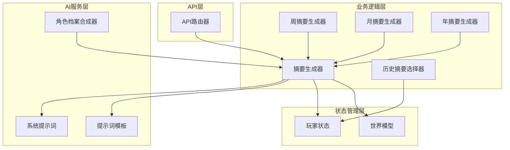
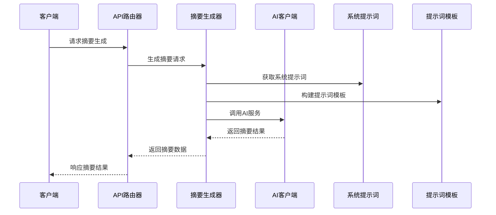
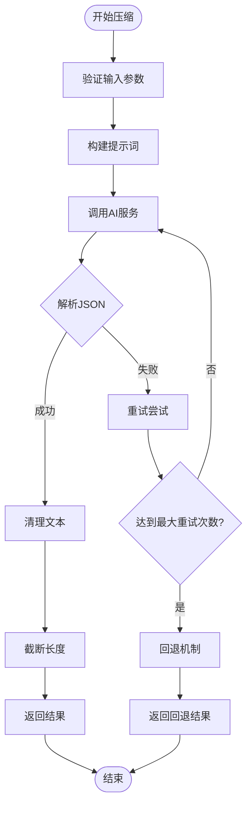
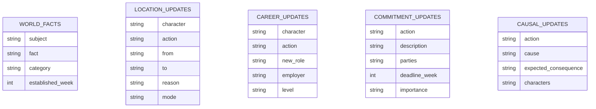
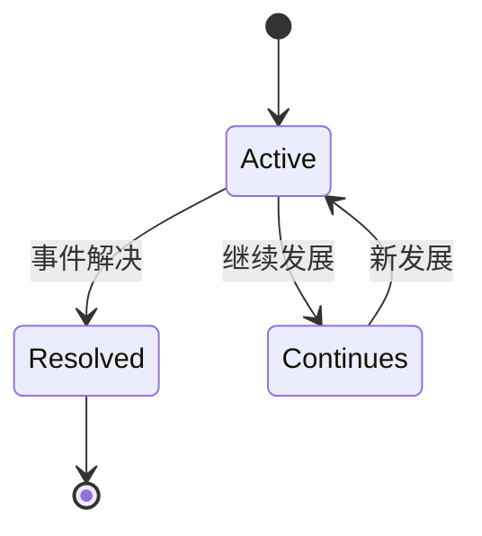
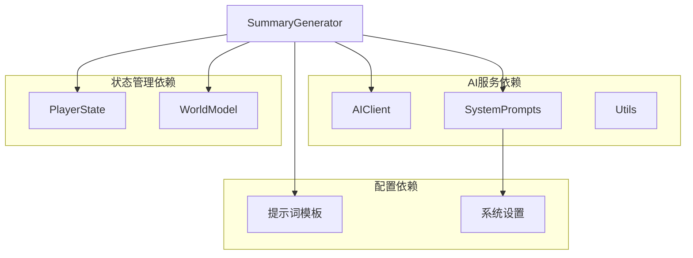
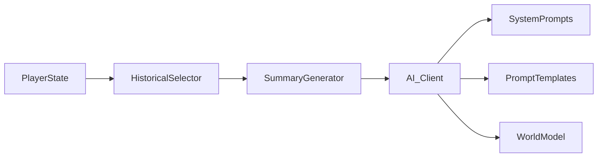

# 摘要生成器

<cite>
**本文档引用的文件**
- [src/ai/summary_generator.py](file://src/ai/summary_generator.py)
- [config/prompts/summary_prompts.py](file://config/prompts/summary_prompts.py)
- [src/ai/system_prompts.py](file://src/ai/system_prompts.py)
- [src/game/state/player_state.py](file://src/game/state/player_state.py)
- [src/game/historical_summary_selector.py](file://src/game/historical_summary_selector.py)
- [src/game/weekly_summary.py](file://src/game/weekly_summary.py)
- [src/game/monthly_summary.py](file://src/game/monthly_summary.py)
- [src/game/yearly_summary.py](file://src/game/yearly_summary.py)
- [src/api/routers/gameplay/summary.py](file://src/api/routers/gameplay/summary.py)
- [src/ai/profile_synthesizer.py](file://src/ai/profile_synthesizer.py)
- [src/game/world_model.py](file://src/game/world_model.py)
- [config/settings.py](file://config/settings.py)
</cite>

## 目录
1. [简介](#简介)
2. [项目结构](#项目结构)
3. [核心组件](#核心组件)
4. [架构概览](#架构概览)
5. [详细组件分析](#详细组件分析)
6. [依赖分析](#依赖分析)
7. [性能考虑](#性能考虑)
8. [故障排除指南](#故障排除指南)
9. [结论](#结论)
10. [附录](#附录)

## 简介

摘要生成器模块是故事驱动游戏中负责多层次文本压缩和总结的核心组件。该模块实现了从单轮事件到周、月、年多层次的摘要生成系统，包括智能的文本压缩算法、角色档案合成器、剧情线索跟踪机制和世界状态提取功能。

该系统支持多种摘要策略：
- **周总结**：基于多轮事件的综合性周度总结
- **四周期总结**：季度级别的摘要聚合
- **年总结**：年度回顾和里程碑总结

## 项目结构

摘要生成器模块采用分层架构设计，主要包含以下层次：



**图表来源**
- [src/ai/summary_generator.py](file://src/ai/summary_generator.py#L17-L589)
- [src/game/weekly_summary.py](file://src/game/weekly_summary.py#L11-L120)
- [src/game/monthly_summary.py](file://src/game/monthly_summary.py#L11-L139)
- [src/game/yearly_summary.py](file://src/game/yearly_summary.py#L11-L171)

**章节来源**
- [src/ai/summary_generator.py](file://src/ai/summary_generator.py#L1-L589)
- [src/game/weekly_summary.py](file://src/game/weekly_summary.py#L1-L120)
- [src/game/monthly_summary.py](file://src/game/monthly_summary.py#L1-L139)
- [src/game/yearly_summary.py](file://src/game/yearly_summary.py#L1-L171)

## 核心组件

### 摘要生成器 (SummaryGenerator)

摘要生成器是整个系统的核心，提供了多种摘要生成策略：

#### 主要功能
- **故事压缩**：将长篇故事压缩为500字符以内的摘要
- **多轮摘要**：支持周、月、年的多层次摘要生成
- **世界状态提取**：从故事中提取环境和背景信息
- **剧情线索管理**：跟踪未完结的剧情线和已建立的事实

#### 关键方法
- `compress_story()`: 完整的故事压缩和世界状态提取
- `compress_narrative()`: 仅进行叙事压缩（并行执行）
- `extract_world_updates()`: 仅提取世界状态更新（并行执行）
- `generate_weekly_summary()`: 生成周度总结
- `generate_four_week_summary()`: 生成季度摘要
- `generate_yearly_summary()`: 生成年度总结

**章节来源**
- [src/ai/summary_generator.py](file://src/ai/summary_generator.py#L17-L589)

### 历史摘要选择器 (HistoricalSummarySelector)

负责从历史摘要中选择最相关的上下文，支持基于关键词的相关性评分和随机回退机制。

#### 核心算法
- **关键词提取**：从当前状态中提取相关关键词
- **相关性评分**：基于关键词匹配和时间衰减计算
- **随机回退**：当无关键词时使用概率衰减选择

**章节来源**
- [src/game/historical_summary_selector.py](file://src/game/historical_summary_selector.py#L14-L206)

### 角色档案合成器 (ProfileSynthesizer)

从行为证据中合成角色的深层性格模式，支持AI驱动的角色理解。

#### 功能特性
- **行为证据分析**：从多轮故事中提取行为模式
- **性格特征归纳**：识别行为特征、言语风格、决策模式
- **边界条件定义**：确定角色不会表现出的行为
- **证据计数机制**：跟踪合成证据的数量和可靠性

**章节来源**
- [src/ai/profile_synthesizer.py](file://src/ai/profile_synthesizer.py#L16-L85)

## 架构概览

摘要生成器采用模块化设计，各组件职责清晰分离：



**图表来源**
- [src/api/routers/gameplay/summary.py](file://src/api/routers/gameplay/summary.py#L85-L173)
- [src/ai/summary_generator.py](file://src/ai/summary_generator.py#L25-L140)

## 详细组件分析

### 文本压缩算法

#### 压缩策略
1. **JSON结构化输出**：确保AI输出符合预期格式
2. **多轮重试机制**：失败时自动重试并提供反馈
3. **安全清理**：移除代码块标记和JSON结构残留
4. **长度限制**：自动截断超过长度限制的摘要

#### 压缩流程



**图表来源**
- [src/ai/summary_generator.py](file://src/ai/summary_generator.py#L25-L140)

#### 失败处理策略
- **JSON解析失败**：尝试提取摘要文本
- **AI调用异常**：使用系统默认摘要
- **长度超限**：自动截断至安全长度
- **重试机制**：最多2次重试机会

**章节来源**
- [src/ai/summary_generator.py](file://src/ai/summary_generator.py#L25-L140)

### 周总结生成器

#### 生成策略
- **多轮事件聚合**：整合一周内所有轮次的事件
- **属性变化分析**：计算能量、情绪、知识、财富的变化
- **关键决策提取**：识别本周的重要决策
- **奖励效果评估**：生成额外的游戏效果

#### 输出格式
```json
{
  "summary": "周总结文本",
  "bonus_effects": {
    "energy": 0,
    "mood": 0,
    "knowledge": 0,
    "wealth": 0
  }
}
```

**章节来源**
- [src/game/weekly_summary.py](file://src/game/weekly_summary.py#L25-L64)

### 四周期总结生成器

#### 聚合策略
- **季度事件汇总**：整合4周的事件和决策
- **趋势分析**：识别重要事件的发展趋势
- **成就总结**：突出本季度的主要成就
- **未来展望**：为下一季度提供方向指引

**章节来源**
- [src/ai/summary_generator.py](file://src/ai/summary_generator.py#L393-L436)

### 年度总结生成器

#### 综合分析
- **全年回顾**：整合12个月的摘要内容
- **成长轨迹**：展示角色的长期发展变化
- **关键转折**：识别本年度的重要转折点
- **里程碑总结**：突出年度达成的重要成就

**章节来源**
- [src/game/yearly_summary.py](file://src/game/yearly_summary.py#L25-L83)

### 世界状态提取机制

#### 提取维度
1. **地理位置更新**：人物位置变化和确认
2. **职业轨迹追踪**：工作职位和职责变化
3. **承诺关系管理**：未履行承诺的状态跟踪
4. **因果链分析**：行为后果的长期影响
5. **习惯模式识别**：角色行为模式的演化

#### 数据结构


**图表来源**
- [config/prompts/summary_prompts.py](file://config/prompts/summary_prompts.py#L276-L327)

**章节来源**
- [config/prompts/summary_prompts.py](file://config/prompts/summary_prompts.py#L122-L452)

### 剧情线索跟踪系统

#### 线索管理
- **未完结剧情线**：跟踪需要继续发展的故事线
- **重要性分级**：区分高重要性和中重要性剧情线
- **相关人物关联**：记录剧情线涉及的关键人物
- **时间追踪**：记录剧情线的创建和最后提及时间

#### 状态转换


**图表来源**
- [src/game/state/player_state.py](file://src/game/state/player_state.py#L70-L73)

**章节来源**
- [src/game/state/player_state.py](file://src/game/state/player_state.py#L70-L103)

### 伏笔回响系统

#### 机制设计
- **隐蔽度控制**：从明显到极度隐蔽的多层次设计
- **回收方式分类**：揭示、验证、讽刺性反转、升级、呼应
- **叙事权重分配**：次要、支线索、主要的影响程度
- **时间延迟机制**：通过时间间隔实现延迟满足

#### 回响策略
- **低隐蔽度**：直接的因果关联
- **中隐蔽度**：自然的巧合和重逢
- **高隐蔽度**：微妙的呼应和似曾相识

**章节来源**
- [config/prompts/_helpers.py](file://config/prompts/_helpers.py#L399-L554)

## 依赖分析

### 外部依赖关系



**图表来源**
- [src/ai/summary_generator.py](file://src/ai/summary_generator.py#L10-L12)
- [src/ai/system_prompts.py](file://src/ai/system_prompts.py#L242-L279)

### 内部耦合关系

#### 组件交互
- **摘要生成器**与**系统提示词**：通过统一的提示词注册表管理
- **历史摘要选择器**与**玩家状态**：直接访问状态数据进行相关性计算
- **角色档案合成器**与**AI服务层**：独立的AI服务调用机制

#### 数据流向


**图表来源**
- [src/game/historical_summary_selector.py](file://src/game/historical_summary_selector.py#L29-L84)
- [src/ai/summary_generator.py](file://src/ai/summary_generator.py#L49-L58)

**章节来源**
- [src/ai/summary_generator.py](file://src/ai/summary_generator.py#L1-L589)
- [src/game/historical_summary_selector.py](file://src/game/historical_summary_selector.py#L1-L206)

## 性能考虑

### 并行处理优化

#### 并行执行策略
- **故事压缩并行化**：`compress_narrative()` 和 `extract_world_updates()` 可以并行执行
- **令牌限制控制**：合理设置 `max_tokens` 参数避免超限
- **温度参数优化**：不同场景使用不同的温度值平衡创造性和稳定性

#### 内存管理
- **状态序列化**：定期保存玩家状态避免内存泄漏
- **缓存机制**：利用KV缓存提高重复提示词的命中率
- **资源限制**：设置合理的资源上限防止过度消耗

### 质量保证机制

#### 输出验证
- **JSON格式验证**：确保AI输出符合预期结构
- **内容完整性检查**：验证关键字段的存在性
- **逻辑一致性校验**：检查摘要内容的合理性

#### 错误恢复
- **渐进式回退**：从复杂到简单的回退策略
- **错误日志记录**：详细记录失败原因便于调试
- **自动重试机制**：智能的重试策略避免无限循环

## 故障排除指南

### 常见问题诊断

#### AI输出问题
1. **JSON解析失败**
   - 检查系统提示词是否正确
   - 验证AI模型的输出格式
   - 确认温度参数设置合理

2. **摘要长度异常**
   - 检查截断逻辑是否正常工作
   - 验证输入文本长度限制
   - 确认清理算法的正确性

#### 状态管理问题
1. **历史摘要选择失败**
   - 检查关键词提取逻辑
   - 验证相关性评分算法
   - 确认时间衰减参数设置

2. **世界状态不一致**
   - 检查世界模型数据结构
   - 验证约束文本生成逻辑
   - 确认数据同步机制

### 调试工具

#### 日志分析
- **详细日志级别**：启用DEBUG级别获取完整执行流程
- **性能监控**：监控AI调用时间和资源消耗
- **错误追踪**：记录详细的错误堆栈信息

#### 测试策略
- **单元测试**：针对关键算法的独立测试
- **集成测试**：验证组件间的协作功能
- **回归测试**：确保修改不影响现有功能

**章节来源**
- [src/ai/summary_generator.py](file://src/ai/summary_generator.py#L60-L130)
- [src/game/historical_summary_selector.py](file://src/game/historical_summary_selector.py#L114-L151)

## 结论

摘要生成器模块通过精心设计的多层次摘要策略、智能的文本压缩算法和完善的错误处理机制，为故事驱动游戏提供了强大的内容生成能力。该系统不仅能够高效地处理大量的故事数据，还能保持内容的质量和一致性。

### 核心优势
- **模块化设计**：清晰的职责分离便于维护和扩展
- **智能算法**：基于AI的文本压缩和分析技术
- **容错机制**：完善的错误处理和回退策略
- **性能优化**：并行处理和缓存机制提升效率

### 应用前景
该模块为游戏开发提供了可扩展的摘要生成框架，可以轻松适配不同类型的故事驱动游戏，为玩家提供丰富的叙事体验。

## 附录

### 配置参数说明

#### 系统设置
- `DEFAULT_LANGUAGE`: 默认语言设置（zh/en）
- `TOTAL_WEEKS`: 游戏总周数（默认96周）
- `ROUNDS_PER_WEEK`: 每周轮次数（默认3轮）
- `GENERATION_TIMEOUT`: AI生成超时时间（秒）

#### AI模型配置
- `OPENAI_MODEL`: 主要AI模型名称
- `IMAGE_MODEL`: 图像生成模型名称
- `SCENE_ANALYZER_MODEL`: 场景分析模型名称

### API接口规范

#### 摘要生成接口
- **路径**: `POST /{game_id}/summary`
- **请求体**: `GenerateSummaryRequest`
- **响应**: `GenerateSummaryResponse`
- **认证**: 支持用户认证和匿名访问

#### 状态查询接口
- **路径**: `GET /{game_id}/state`
- **响应**: `GameStateResponse`
- **用途**: 获取当前游戏状态和进度信息

**章节来源**
- [config/settings.py](file://config/settings.py#L70-L167)
- [src/api/routers/gameplay/summary.py](file://src/api/routers/gameplay/summary.py#L18-L23)