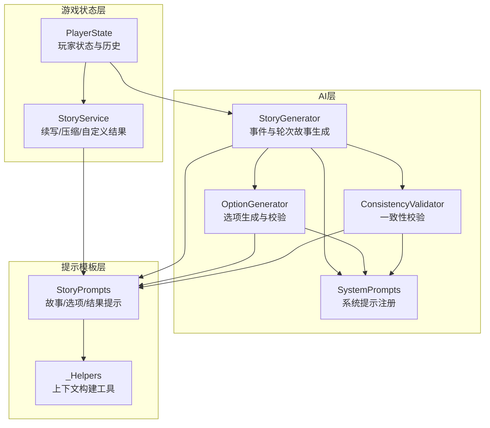
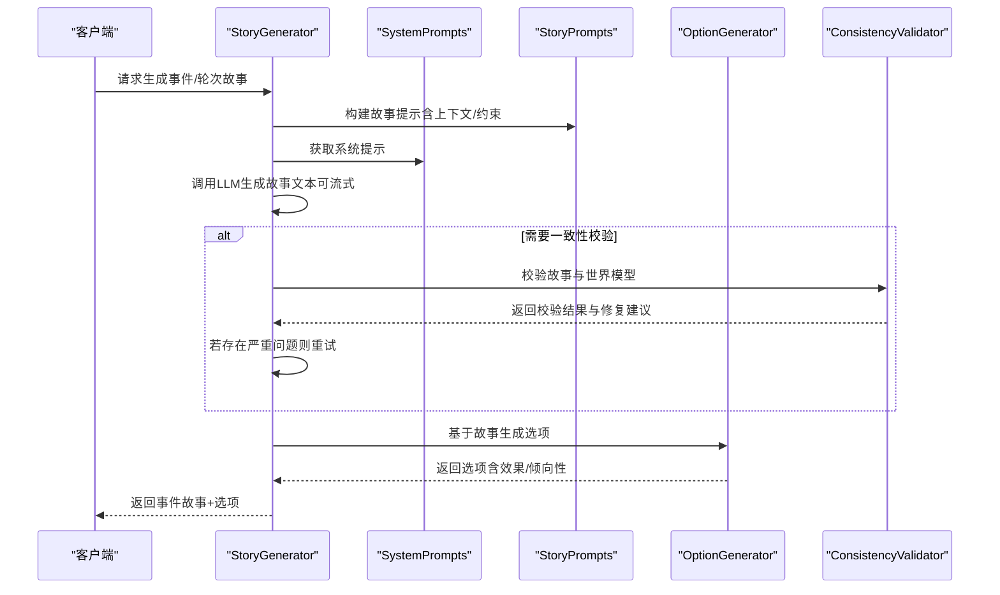
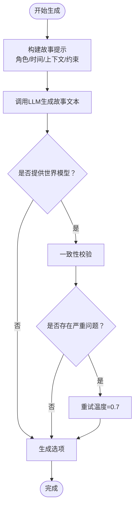
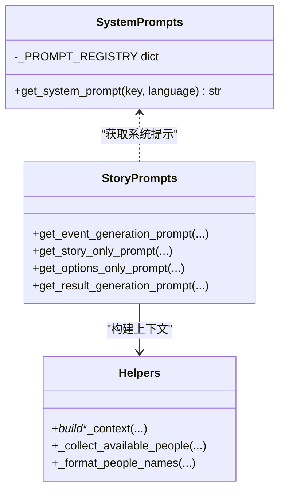
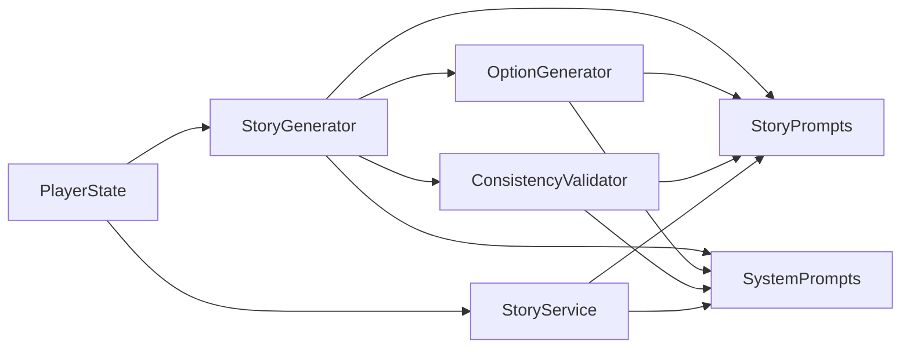

# 故事生成器

<cite>
**本文档引用的文件**
- [src/ai/story_generator.py](file://src/ai/story_generator.py)
- [config/prompts/story_prompts.py](file://config/prompts/story_prompts.py)
- [src/ai/system_prompts.py](file://src/ai/system_prompts.py)
- [src/ai/option_generator.py](file://src/ai/option_generator.py)
- [src/game/story_service.py](file://src/game/story_service.py)
- [src/ai/consistency_validator.py](file://src/ai/consistency_validator.py)
- [src/game/state/player_state.py](file://src/game/state/player_state.py)
- [config/prompts/_helpers.py](file://config/prompts/_helpers.py)
</cite>

## 目录
1. [简介](#简介)
2. [项目结构](#项目结构)
3. [核心组件](#核心组件)
4. [架构总览](#架构总览)
5. [详细组件分析](#详细组件分析)
6. [依赖关系分析](#依赖关系分析)
7. [性能考虑](#性能考虑)
8. [故障排除指南](#故障排除指南)
9. [结论](#结论)
10. [附录](#附录)

## 简介
本文件为故事生成器模块的技术文档，面向开发者与产品人员，系统阐述两阶段生成管道的设计理念、提示模板系统的组合策略、个性化内容生成机制、故事结构设计原则、多语言支持与本地化策略、配置参数与调用示例，以及质量评估与一致性保障机制。通过对核心模块的深入分析，帮助读者快速理解并高效扩展故事生成能力。

## 项目结构
故事生成器位于后端服务层，围绕“事件生成”和“轮次故事生成”两条主线展开，配合选项生成、一致性校验与系统提示模板，形成完整的叙事闭环。

图表来源
- [src/ai/story_generator.py](file://src/ai/story_generator.py#L24-L190)
- [src/ai/option_generator.py](file://src/ai/option_generator.py#L17-L133)
- [src/ai/consistency_validator.py](file://src/ai/consistency_validator.py#L42-L122)
- [src/ai/system_prompts.py](file://src/ai/system_prompts.py#L242-L279)
- [config/prompts/story_prompts.py](file://config/prompts/story_prompts.py#L21-L629)
- [config/prompts/_helpers.py](file://config/prompts/_helpers.py#L5-L800)
- [src/game/story_service.py](file://src/game/story_service.py#L11-L142)
- [src/game/state/player_state.py](file://src/game/state/player_state.py#L15-L150)

章节来源
- [src/ai/story_generator.py](file://src/ai/story_generator.py#L1-L439)
- [config/prompts/story_prompts.py](file://config/prompts/story_prompts.py#L1-L1099)
- [src/ai/system_prompts.py](file://src/ai/system_prompts.py#L1-L279)
- [src/ai/option_generator.py](file://src/ai/option_generator.py#L1-L264)
- [src/game/story_service.py](file://src/game/story_service.py#L1-L312)
- [src/ai/consistency_validator.py](file://src/ai/consistency_validator.py#L1-L404)
- [src/game/state/player_state.py](file://src/game/state/player_state.py#L1-L590)
- [config/prompts/_helpers.py](file://config/prompts/_helpers.py#L1-L814)

## 核心组件
- 故事生成器（StoryGenerator）：负责两阶段生成管道的第一阶段（故事文本生成），并可选地进行一致性校验与重试。
- 选项生成器（OptionGenerator）：在已有故事基础上生成选项，进行关系名修复与质量校验。
- 一致性校验器（ConsistencyValidator）：基于世界模型与历史记录，对故事进行多维度一致性检查，必要时提供修复建议并触发重试。
- 系统提示注册（SystemPrompts）：集中管理各类系统提示，确保KV缓存前缀稳定、便于审计与维护。
- 提示模板（StoryPrompts）：构建事件生成、轮次故事生成、选项生成与结果续写所需的上下文与约束。
- 游戏状态（PlayerState）：承载玩家状态、历史、世界模型数据与叙事元数据，驱动个性化生成。
- 故事服务（StoryService）：负责故事续写、压缩与自定义选择结果生成。

章节来源
- [src/ai/story_generator.py](file://src/ai/story_generator.py#L24-L190)
- [src/ai/option_generator.py](file://src/ai/option_generator.py#L17-L133)
- [src/ai/consistency_validator.py](file://src/ai/consistency_validator.py#L42-L122)
- [src/ai/system_prompts.py](file://src/ai/system_prompts.py#L242-L279)
- [config/prompts/story_prompts.py](file://config/prompts/story_prompts.py#L21-L629)
- [src/game/state/player_state.py](file://src/game/state/player_state.py#L15-L150)
- [src/game/story_service.py](file://src/game/story_service.py#L11-L142)

## 架构总览
两阶段生成管道的设计目标是：先产出高质量、沉浸式的纯文本故事，再基于故事生成贴合情境的选项，确保叙事连贯与可玩性。

图表来源
- [src/ai/story_generator.py](file://src/ai/story_generator.py#L32-L190)
- [src/ai/option_generator.py](file://src/ai/option_generator.py#L25-L133)
- [src/ai/consistency_validator.py](file://src/ai/consistency_validator.py#L60-L122)
- [src/ai/system_prompts.py](file://src/ai/system_prompts.py#L264-L279)
- [config/prompts/story_prompts.py](file://config/prompts/story_prompts.py#L612-L799)

## 详细组件分析

### 故事生成器（StoryGenerator）
- 两阶段生成流程
  - 阶段一：生成纯故事文本（Step 1），支持流式回调与重试策略。
  - 阶段二：基于故事生成选项（Step 2），交由 OptionGenerator 处理。
- 一致性校验与重试
  - 在提供世界模型时，对生成故事进行一致性校验。
  - 仅对“严重问题”触发重试，使用固定保守温度（0.7）确保约束满足。
  - 通过状态回调通知前端“重试中”，并在重试前清空故事缓存。
- 生命周期阶段判定
  - 根据周数划分“早期职场/立业/成长/稳定”四个阶段，驱动叙事风格与主题侧重。

图表来源
- [src/ai/story_generator.py](file://src/ai/story_generator.py#L332-L426)

章节来源
- [src/ai/story_generator.py](file://src/ai/story_generator.py#L32-L190)
- [src/ai/story_generator.py](file://src/ai/story_generator.py#L192-L331)
- [src/ai/story_generator.py](file://src/ai/story_generator.py#L332-L426)

### 提示模板系统
- 系统提示注册
  - 统一管理“小说家/选项生成/压缩/续写/重写/一致性校验/分析/画像/世界构建/关系设计/叙事/属性生成/总结”等角色提示。
  - 中英文双语映射，确保KV缓存前缀稳定。
- 故事提示构建
  - 事件生成提示：包含角色设定、可用人物、时间、历史、剧情线、已建立事实、世界模型约束、逻辑一致性要求等。
  - 轮次故事提示：在事件提示基础上，加入上一轮故事续写、四/年度总结、伏笔回响、人物习惯等。
  - 选项生成提示：基于故事结尾的决策点生成贴合情境的选项，严格限制可用人物与效果范围。
  - 结果续写提示：在选择后生成500-800字的沉浸式续写，保持第二人称视角。
- 上下文构建工具
  - 收集可用人物、格式化人物列表、构建时间/剧情线/事实/世界模型/逻辑/人物习惯/伏笔回响/新人物引入等上下文段落。

图表来源
- [src/ai/system_prompts.py](file://src/ai/system_prompts.py#L242-L279)
- [config/prompts/story_prompts.py](file://config/prompts/story_prompts.py#L21-L629)
- [config/prompts/_helpers.py](file://config/prompts/_helpers.py#L5-L800)

章节来源
- [src/ai/system_prompts.py](file://src/ai/system_prompts.py#L1-L279)
- [config/prompts/story_prompts.py](file://config/prompts/story_prompts.py#L21-L629)
- [config/prompts/_helpers.py](file://config/prompts/_helpers.py#L5-L800)

### 选项生成器（OptionGenerator）
- 选项生成
  - 基于故事结尾的决策点生成2-4个贴合情境的选项。
  - 严格校验效果字段，确保至少两项状态变化，避免明显最优选项。
- 关系名修复
  - 优先精确匹配可用人物名单；其次大小写不敏感匹配；再次按角色特征匹配；最后保留原名（允许非关键人物关系变化）。
- 质量校验
  - 检查选项数量、效果合理性与权衡性，防止极端数值与无差异选项。

章节来源
- [src/ai/option_generator.py](file://src/ai/option_generator.py#L17-L133)
- [src/ai/option_generator.py](file://src/ai/option_generator.py#L134-L264)

### 一致性校验器（ConsistencyValidator）
- 多维度校验
  - 地理位置、职业轨迹、个性特征、时间逻辑、承诺事项、因果链条、虚构事实等七个维度。
- AI主导判断
  - 完全依赖AI对校验结果的判断，不再内置硬性升级逻辑。
  - 输出包含问题清单、严重级别、修复建议与是否重试的指示。
- 历史交叉验证
  - 结合数据库历史故事与动态事实，检测过往事件是否可溯源、重要事实是否遗漏、因果是否连贯。

章节来源
- [src/ai/consistency_validator.py](file://src/ai/consistency_validator.py#L42-L122)
- [src/ai/consistency_validator.py](file://src/ai/consistency_validator.py#L240-L404)

### 故事服务（StoryService）
- 故事续写
  - 基于事件描述与选择效果生成500-800字的沉浸式续写，支持流式回调。
  - 失败时提供降级续写，确保体验连续性。
- 故事压缩与世界抽取
  - 生成100字左右的周总结，评估剧情线状态，提取/更新世界事实与人物习惯。
- 自定义选择处理
  - 生成自定义选择的属性变化与结果，提供可配置的降级策略。

章节来源
- [src/game/story_service.py](file://src/game/story_service.py#L11-L142)
- [src/game/story_service.py](file://src/game/story_service.py#L143-L312)

### 玩家状态与个性化生成
- 状态要素
  - 核心属性：精力、情绪、学识、财富。
  - 关系网络：人物亲密度与角色系统。
  - 时间与阶段：周数、年龄、季节与生命阶段。
  - 历史与上下文：决策历史、四/年度总结、剧情线、已建立事实、世界模型、伏笔回响、人物习惯。
- 个性化驱动
  - 角色设定（时代、身份、性格、世界观、家庭背景、可用人物）直接影响事件与选项的可信度与贴合度。
  - 世界模型与历史事实确保跨轮次一致性，避免前后矛盾。
  - 伏笔回响与人物习惯为长期叙事提供纵深与连贯性。

章节来源
- [src/game/state/player_state.py](file://src/game/state/player_state.py#L15-L150)
- [src/game/state/player_state.py](file://src/game/state/player_state.py#L239-L383)

## 依赖关系分析
- 模块耦合
  - StoryGenerator 依赖 StoryPrompts 与 SystemPrompts 构建提示，依赖 OptionGenerator 生成选项，依赖 ConsistencyValidator 进行一致性校验。
  - OptionGenerator 依赖 StoryPrompts 与 SystemPrompts，依赖 PlayerState 的可用人物与关系信息。
  - ConsistencyValidator 依赖 StoryPrompts 与 SystemPrompts，读取 PlayerState 的世界模型与历史。
  - StoryService 依赖 StoryPrompts 与 SystemPrompts，协调续写与压缩。
- 外部依赖
  - LLM调用接口（AIClient）：统一温度、最大令牌数与流式回调。
  - JSON解析工具：从AI响应中提取结构化数据。

图表来源
- [src/ai/story_generator.py](file://src/ai/story_generator.py#L12-L20)
- [src/ai/option_generator.py](file://src/ai/option_generator.py#L9-L12)
- [src/ai/consistency_validator.py](file://src/ai/consistency_validator.py#L7-L9)
- [src/game/story_service.py](file://src/game/story_service.py#L5-L6)

章节来源
- [src/ai/story_generator.py](file://src/ai/story_generator.py#L12-L20)
- [src/ai/option_generator.py](file://src/ai/option_generator.py#L9-L12)
- [src/ai/consistency_validator.py](file://src/ai/consistency_validator.py#L7-L9)
- [src/game/story_service.py](file://src/game/story_service.py#L5-L6)

## 性能考虑
- 温度与令牌优化
  - 初始生成采用渐进式温度衰减策略，降低幻觉风险并提升准确性。
  - 一致性重试使用固定保守温度，确保严格遵守约束。
  - 合理设置 max_tokens，避免截断与重复生成。
- 流式输出
  - 首次生成支持流式回调，提升交互体验；重试时不重复流式，避免前端显示不完整。
- 上下文裁剪
  - 上一轮故事在续写时按需截断，避免冗余上下文增加token消耗。
- 重试策略
  - 仅对“严重问题”触发重试，减少不必要的二次调用成本。

章节来源
- [src/ai/story_generator.py](file://src/ai/story_generator.py#L106-L135)
- [src/ai/story_generator.py](file://src/ai/story_generator.py#L386-L421)
- [config/prompts/_helpers.py](file://config/prompts/_helpers.py#L270-L340)

## 故障排除指南
- 生成失败重试
  - 事件生成与选项生成均具备重试机制，失败原因会追加到提示中，帮助LLM规避同类错误。
- 一致性校验失败
  - 若AI判定存在严重问题，将自动重试并注入修复建议；若仍失败，系统会记录日志并返回原故事。
- 降级策略
  - 故事续写失败时返回简要降级文本；自定义选择效果解析失败时返回默认效果。
- 日志与可观测性
  - 关键步骤均输出详细日志，包括故事长度、选项数量、校验结果与重试原因，便于定位问题。

章节来源
- [src/ai/story_generator.py](file://src/ai/story_generator.py#L174-L190)
- [src/ai/option_generator.py](file://src/ai/option_generator.py#L114-L133)
- [src/ai/consistency_validator.py](file://src/ai/consistency_validator.py#L222-L234)
- [src/game/story_service.py](file://src/game/story_service.py#L67-L74)
- [src/game/story_service.py](file://src/game/story_service.py#L193-L227)

## 结论
故事生成器通过两阶段生成管道、完善的提示模板系统、一致性校验与重试机制，实现了高质量、个性化、可扩展的叙事生成。模块化设计与集中化的系统提示管理，使得功能演进与维护更加高效。结合玩家状态、世界模型与历史事实，系统能够在长期内保持叙事一致性与沉浸感。

## 附录

### 配置参数与调用示例
- 事件生成（两阶段）
  - 参数要点：语言、角色设定、时间信息、历史摘要、剧情线、已建立事实、世界模型、上一轮故事、人物习惯、伏笔回响等。
  - 调用路径：StoryGenerator.generate_event(...) → OptionGenerator.generate_options_only(...)
- 轮次故事生成
  - 参数要点：轮次编号、轮次上下文、关系事件、历史周/年摘要、时间信息、剧情线、已建立事实、上一轮完结状态、世界模型、新人物引入等。
  - 调用路径：StoryGenerator.generate_round_event(...) → OptionGenerator.generate_options_only(...)
- 选项生成（仅选项）
  - 参数要点：故事文本、玩家状态、角色设定、语言。
  - 调用路径：OptionGenerator.generate_options_only(...)
- 故事续写
  - 参数要点：事件描述、选择文本、效果、角色设定、语言。
  - 调用路径：StoryService.generate_story_continuation(...)
- 一致性校验
  - 参数要点：故事文本、世界模型、玩家状态字典、角色设定、语言、历史故事（可选）。
  - 调用路径：ConsistencyValidator.validate_story(...)

章节来源
- [src/ai/story_generator.py](file://src/ai/story_generator.py#L32-L190)
- [src/ai/story_generator.py](file://src/ai/story_generator.py#L192-L331)
- [src/ai/option_generator.py](file://src/ai/option_generator.py#L25-L133)
- [src/game/story_service.py](file://src/game/story_service.py#L18-L117)
- [src/ai/consistency_validator.py](file://src/ai/consistency_validator.py#L60-L122)

### 多语言支持与本地化策略
- 中英文双语提示
  - 系统提示与故事提示分别提供中英文版本，通过 get_system_prompt 与提示模板函数自动切换。
- 本地化上下文
  - 时间信息、人物列表、约束描述等均按语言动态生成，确保术语与表达一致。
- 前端集成
  - 前端通过状态回调与流式输出适配不同语言的渲染与交互。

章节来源
- [src/ai/system_prompts.py](file://src/ai/system_prompts.py#L264-L279)
- [config/prompts/story_prompts.py](file://config/prompts/story_prompts.py#L55-L58)
- [config/prompts/_helpers.py](file://config/prompts/_helpers.py#L130-L167)

### 故事结构设计
- 开头引入
  - 通过“开场故事/上周故事”与“近期总结/年度回顾”构建叙事锚点，确保读者快速进入情境。
- 冲突发展
  - 基于角色设定与可用人物，围绕决策点展开三至五轮对话与情境变化，突出权衡与不确定性。
- 高潮与结局
  - 故事结尾必须落在“具体、明确的决策点”，避免纯情感收尾；轮次故事通过“必须续写/承上启下”规则确保连贯性。

章节来源
- [config/prompts/story_prompts.py](file://config/prompts/story_prompts.py#L276-L361)
- [config/prompts/story_prompts.py](file://config/prompts/story_prompts.py#L749-L799)
- [config/prompts/_helpers.py](file://config/prompts/_helpers.py#L270-L340)

### 质量评估与一致性保证机制
- 质量评估
  - 选项数量≥2、效果字段齐全、权衡合理、无极端数值。
- 一致性保证
  - 世界模型约束（地理/职业/承诺/因果/身体状态）、已建立事实、剧情线、人物习惯、伏笔回响与历史交叉验证共同构成多维一致性网。
  - AI主导的校验与修复建议，确保严重问题被及时纠正。

章节来源
- [src/ai/option_generator.py](file://src/ai/option_generator.py#L226-L264)
- [src/ai/consistency_validator.py](file://src/ai/consistency_validator.py#L123-L238)
- [src/ai/consistency_validator.py](file://src/ai/consistency_validator.py#L240-L404)