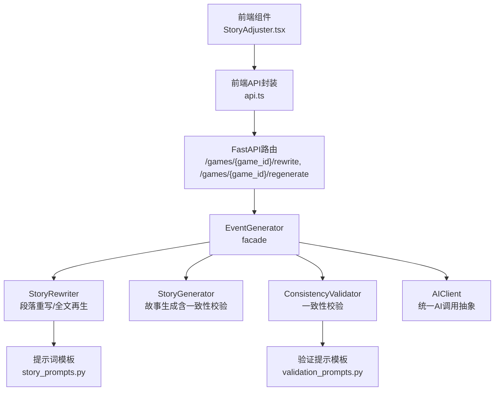
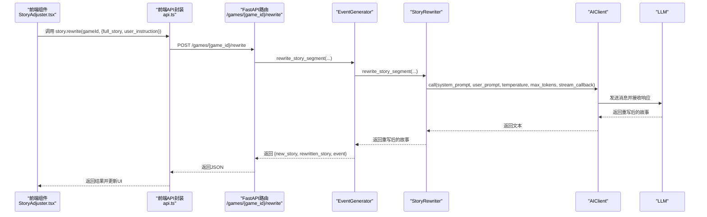
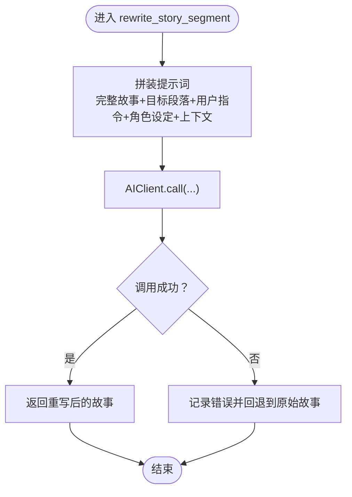
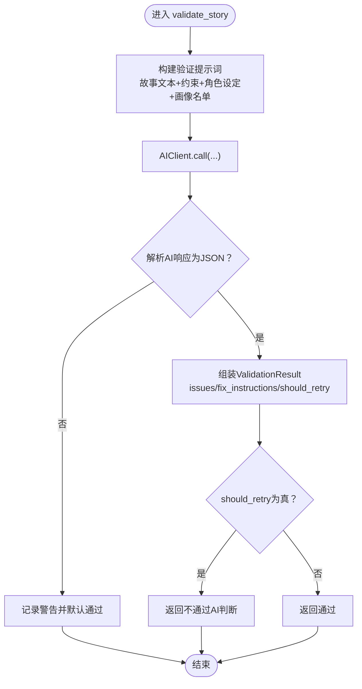
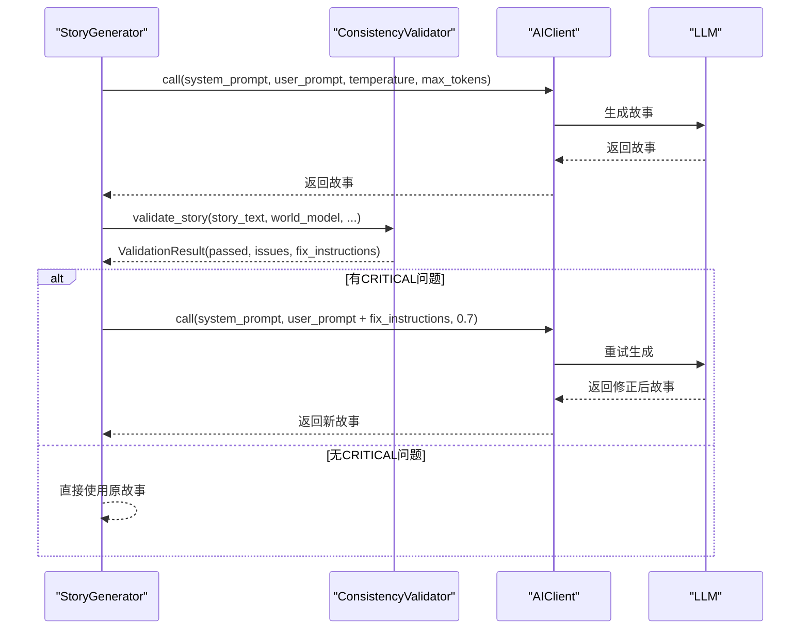
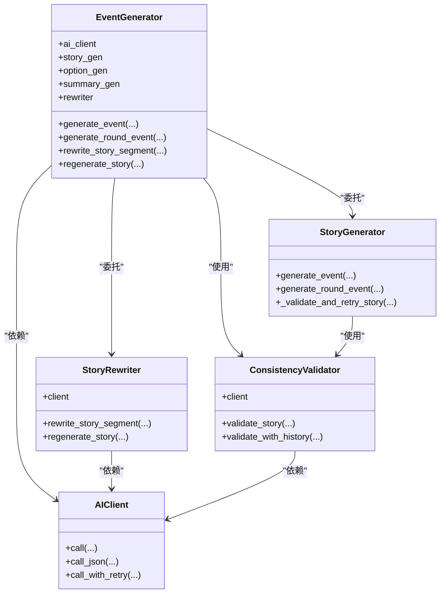

# 故事重写器

<cite>
**本文引用的文件**
- [src/ai/story_rewriter.py](file://src/ai/story_rewriter.py)
- [src/ai/consistency_validator.py](file://src/ai/consistency_validator.py)
- [src/ai/story_generator.py](file://src/ai/story_generator.py)
- [src/ai/generator.py](file://src/ai/generator.py)
- [config/prompts/story_prompts.py](file://config/prompts/story_prompts.py)
- [config/prompts/validation_prompts.py](file://config/prompts/validation_prompts.py)
- [src/api/routers/story.py](file://src/api/routers/story.py)
- [frontend/src/lib/api.ts](file://frontend/src/lib/api.ts)
- [frontend/src/components/game/StoryAdjuster.tsx](file://frontend/src/components/game/StoryAdjuster.tsx)
- [src/ai/client.py](file://src/ai/client.py)
</cite>

## 目录
1. [简介](#简介)
2. [项目结构](#项目结构)
3. [核心组件](#核心组件)
4. [架构总览](#架构总览)
5. [详细组件分析](#详细组件分析)
6. [依赖关系分析](#依赖关系分析)
7. [性能考量](#性能考量)
8. [故障排查指南](#故障排查指南)
9. [结论](#结论)
10. [附录](#附录)

## 简介
本技术文档围绕“故事重写器”模块展开，系统阐述其在故事生成流水线中的职责与实现：包括段落级重写与全文再生机制、一致性验证器的工作原理与策略、重写算法的设计思路（上下文理解、语义保持、风格统一）、长文本重写挑战下的内存与性能优化、用户指令解析与执行机制、重写流程示例、参数配置与质量评估方法、失败处理与错误恢复策略，以及与AI生成器其他模块的协作关系。

## 项目结构
故事重写器位于AI子系统中，采用分层设计：
- 顶层门面：EventGenerator（facade），聚合StoryGenerator、OptionGenerator、SummaryGenerator、StoryRewriter等子服务
- 重写器：StoryRewriter，负责段落重写与全文再生
- 一致性验证：ConsistencyValidator，对生成故事进行跨维度一致性校验
- 提示词工程：config/prompts，提供故事生成、选项生成、一致性校验等提示模板
- API路由：FastAPI路由，暴露重写与再生接口，支持SSE流式再生
- 前端集成：StoryAdjuster组件与api.ts封装，提供用户交互入口

图表来源
- [src/api/routers/story.py](file://src/api/routers/story.py#L26-L155)
- [src/ai/generator.py](file://src/ai/generator.py#L30-L66)
- [src/ai/story_rewriter.py](file://src/ai/story_rewriter.py#L16-L201)
- [src/ai/consistency_validator.py](file://src/ai/consistency_validator.py#L42-L122)
- [config/prompts/story_prompts.py](file://config/prompts/story_prompts.py#L612-L780)
- [config/prompts/validation_prompts.py](file://config/prompts/validation_prompts.py#L203-L410)
- [src/ai/client.py](file://src/ai/client.py#L22-L124)

章节来源
- [src/ai/generator.py](file://src/ai/generator.py#L30-L66)
- [src/ai/story_rewriter.py](file://src/ai/story_rewriter.py#L16-L201)
- [src/ai/consistency_validator.py](file://src/ai/consistency_validator.py#L42-L122)
- [config/prompts/story_prompts.py](file://config/prompts/story_prompts.py#L612-L780)
- [config/prompts/validation_prompts.py](file://config/prompts/validation_prompts.py#L203-L410)
- [src/api/routers/story.py](file://src/api/routers/story.py#L26-L155)
- [frontend/src/lib/api.ts](file://frontend/src/lib/api.ts#L381-L399)
- [frontend/src/components/game/StoryAdjuster.tsx](file://frontend/src/components/game/StoryAdjuster.tsx#L3594-L3618)

## 核心组件
- StoryRewriter：提供段落重写与全文再生两大能力，基于提示词模板与AIClient调用LLM，支持流式回调与错误回退
- ConsistencyValidator：对生成故事进行七维一致性校验（地理、职业、性格、时间、承诺、因果、编造），并产出修复建议与重试判断
- EventGenerator：门面层，聚合各子服务，暴露统一接口，便于前端调用
- AIClient：统一AI调用抽象，支持流式、JSON解析、重试与错误反馈注入
- FastAPI路由：提供/rewrite与/regenerate接口，后者支持SSE流式输出
- 前端StoryAdjuster：用户交互组件，发起重写请求并接收结果

章节来源
- [src/ai/story_rewriter.py](file://src/ai/story_rewriter.py#L16-L201)
- [src/ai/consistency_validator.py](file://src/ai/consistency_validator.py#L42-L122)
- [src/ai/generator.py](file://src/ai/generator.py#L30-L66)
- [src/ai/client.py](file://src/ai/client.py#L22-L124)
- [src/api/routers/story.py](file://src/api/routers/story.py#L26-L155)
- [frontend/src/components/game/StoryAdjuster.tsx](file://frontend/src/components/game/StoryAdjuster.tsx#L3594-L3618)

## 架构总览
故事重写器在整体流水线中的位置如下：
- 用户在前端点击“改写故事”，通过api.ts调用后端路由
- 后端路由获取会话与玩家状态，构造“故事上下文”（最近回合摘要）
- 调用EventGenerator.rewrite_story_segment，委托StoryRewriter执行
- StoryRewriter基于提示词模板与AIClient调用LLM，返回重写后的故事
- 前端接收结果并更新UI

图表来源
- [frontend/src/components/game/StoryAdjuster.tsx](file://frontend/src/components/game/StoryAdjuster.tsx#L3594-L3618)
- [frontend/src/lib/api.ts](file://frontend/src/lib/api.ts#L381-L399)
- [src/api/routers/story.py](file://src/api/routers/story.py#L26-L66)
- [src/ai/generator.py](file://src/ai/generator.py#L435-L454)
- [src/ai/story_rewriter.py](file://src/ai/story_rewriter.py#L24-L117)
- [src/ai/client.py](file://src/ai/client.py#L51-L124)

## 详细组件分析

### StoryRewriter：段落重写与全文再生
- 段落重写（rewrite_story_segment）
  - 输入：完整故事、需替换的段落、用户指令、角色设定、故事上下文、语言
  - 处理：拼装提示词（包含完整故事、目标段落、用户指令、角色设定、上下文），调用AIClient.call，支持流式回调
  - 输出：返回重写后的完整故事；异常时回退到原始故事
- 全文再生（regenerate_story）
  - 输入：玩家状态、角色设定、故事上下文、语言、可选开场故事与上次事件描述
  - 处理：推断生命阶段，构造“故事仅提示词”（get_story_only_prompt），拼接“之前的故事脉络”，调用AIClient.call生成新故事
  - 输出：返回新生成的故事；异常时返回本地化错误提示

图表来源
- [src/ai/story_rewriter.py](file://src/ai/story_rewriter.py#L24-L117)

章节来源
- [src/ai/story_rewriter.py](file://src/ai/story_rewriter.py#L16-L201)
- [config/prompts/story_prompts.py](file://config/prompts/story_prompts.py#L612-L780)
- [src/ai/client.py](file://src/ai/client.py#L51-L124)

### ConsistencyValidator：一致性验证器
- 核心职责
  - 对生成故事进行七维一致性检查：地理、职业、性格、时间、承诺、因果、编造
  - 基于世界模型约束与角色设定，AI判断严重级别与修复建议
  - 产出should_retry与retry_reason，驱动重试策略
- 关键流程
  - 构建验证提示词（get_consistency_validation_prompt），包含世界模型约束、角色性格、已建立行为画像的角色名单
  - 调用AIClient.call获取AI响应，解析JSON并组装ValidationResult
  - 若AI未返回should_retry，则按是否存在CRITICAL问题决定是否重试
- 历史交叉验证（validate_with_history）
  - 结合历史故事摘要与已提取关键事实，检测“编造过往事件”“事实遗漏”“因果断裂”

图表来源
- [src/ai/consistency_validator.py](file://src/ai/consistency_validator.py#L60-L122)
- [config/prompts/validation_prompts.py](file://config/prompts/validation_prompts.py#L203-L410)
- [src/ai/client.py](file://src/ai/client.py#L51-L124)

章节来源
- [src/ai/consistency_validator.py](file://src/ai/consistency_validator.py#L42-L404)
- [config/prompts/validation_prompts.py](file://config/prompts/validation_prompts.py#L203-L410)

### 与StoryGenerator的协作与一致性校验
- StoryGenerator在生成故事后，可调用ConsistencyValidator进行一致性校验
- 若存在CRITICAL问题，StoryGenerator会追加修复指令并以更低温度重试，确保故事与世界模型一致
- 该策略在“全文再生”路径中同样适用，保证新生成故事的质量

图表来源
- [src/ai/story_generator.py](file://src/ai/story_generator.py#L334-L426)
- [src/ai/consistency_validator.py](file://src/ai/consistency_validator.py#L60-L122)
- [src/ai/client.py](file://src/ai/client.py#L51-L124)

章节来源
- [src/ai/story_generator.py](file://src/ai/story_generator.py#L24-L439)
- [src/ai/consistency_validator.py](file://src/ai/consistency_validator.py#L42-L404)

### 用户指令解析与执行机制
- 前端StoryAdjuster收集用户指令，调用api.story.rewrite
- 后端路由将用户指令与当前完整故事、角色设定、故事上下文拼装为提示词
- 调用EventGenerator.rewrite_story_segment，最终由StoryRewriter与AIClient完成LLM调用
- 成功后返回new_story/rewritten_story，前端更新UI

章节来源
- [frontend/src/components/game/StoryAdjuster.tsx](file://frontend/src/components/game/StoryAdjuster.tsx#L3594-L3618)
- [frontend/src/lib/api.ts](file://frontend/src/lib/api.ts#L381-L399)
- [src/api/routers/story.py](file://src/api/routers/story.py#L26-L66)
- [src/ai/generator.py](file://src/ai/generator.py#L435-L454)
- [src/ai/story_rewriter.py](file://src/ai/story_rewriter.py#L24-L117)

### 重写流程示例与参数配置
- 段落重写
  - 输入参数：full_story、segment_to_replace、user_instruction、character_settings、story_context、language
  - 输出：rewritten_story/new_story
- 全文再生
  - 输入参数：player_state、character_settings、story_context、language、opening_story、last_event_description
  - 输出：new_story/event
- 提示词模板
  - get_story_only_prompt：用于全文再生的纯故事生成提示
  - get_consistency_validation_prompt：用于一致性校验的验证提示

章节来源
- [src/ai/story_rewriter.py](file://src/ai/story_rewriter.py#L24-L201)
- [config/prompts/story_prompts.py](file://config/prompts/story_prompts.py#L612-L780)
- [config/prompts/validation_prompts.py](file://config/prompts/validation_prompts.py#L203-L410)

### 质量评估方法
- 一致性校验：通过ConsistencyValidator的七维检查与should_retry判断
- 重试策略：仅对CRITICAL问题触发重试，避免过度干预
- 历史交叉验证：validate_with_history检测“编造过往事件”“事实遗漏”“因果断裂”
- 前端反馈：成功/失败提示与错误日志记录

章节来源
- [src/ai/consistency_validator.py](file://src/ai/consistency_validator.py#L240-L404)
- [src/ai/story_generator.py](file://src/ai/story_generator.py#L334-L426)

### 失败处理与错误恢复
- 重写失败回退：StoryRewriter捕获异常并返回原始完整故事
- 再生失败回退：StoryRewriter返回本地化错误提示
- 一致性校验失败：ConsistencyValidator默认通过（pass-through），避免阻断生成
- API层：后端路由捕获异常并返回HTTP 500，前端捕获并提示

章节来源
- [src/ai/story_rewriter.py](file://src/ai/story_rewriter.py#L113-L201)
- [src/ai/consistency_validator.py](file://src/ai/consistency_validator.py#L118-L122)
- [src/api/routers/story.py](file://src/api/routers/story.py#L64-L114)

## 依赖关系分析

图表来源
- [src/ai/generator.py](file://src/ai/generator.py#L30-L66)
- [src/ai/story_rewriter.py](file://src/ai/story_rewriter.py#L16-L201)
- [src/ai/consistency_validator.py](file://src/ai/consistency_validator.py#L42-L122)
- [src/ai/story_generator.py](file://src/ai/story_generator.py#L24-L439)
- [src/ai/client.py](file://src/ai/client.py#L22-L124)

章节来源
- [src/ai/generator.py](file://src/ai/generator.py#L30-L66)
- [src/ai/story_rewriter.py](file://src/ai/story_rewriter.py#L16-L201)
- [src/ai/consistency_validator.py](file://src/ai/consistency_validator.py#L42-L122)
- [src/ai/story_generator.py](file://src/ai/story_generator.py#L24-L439)
- [src/ai/client.py](file://src/ai/client.py#L22-L124)

## 性能考量
- 流式输出：AIClient支持流式回调，前端可逐步渲染，提升交互体验
- Token上限：当达到max_tokens时记录警告，建议适当增大以避免截断
- 重试与温度衰减：StoryGenerator在多次重试中逐步降低温度，提高输出稳定性
- 缓存与并发：EventGenerator支持事件缓存，避免重复生成；路由层在再生时清理缓存，确保一致性
- 长文本处理：提示词模板与调用参数均支持较大max_tokens，结合流式输出避免一次性加载过多文本

章节来源
- [src/ai/client.py](file://src/ai/client.py#L51-L124)
- [src/ai/story_generator.py](file://src/ai/story_generator.py#L106-L135)
- [src/api/routers/story.py](file://src/api/routers/story.py#L143-L155)

## 故障排查指南
- 重写失败
  - 现象：返回原始完整故事或本地化错误提示
  - 排查：查看后端日志与前端错误提示；确认网络与API可达性
- 再生失败
  - 现象：返回HTTP 500或错误详情
  - 排查：检查会话有效性、玩家状态与角色设定；确认世界模型与一致性约束
- 一致性校验不通过
  - 现象：should_retry为真，前端提示需要修正
  - 排查：根据fix_instructions逐项修正；必要时手动调整角色设定或上下文
- 流式输出中断
  - 现象：前端未收到完整故事
  - 排查：检查AIClient流式回调与网络连接；适当增大max_tokens

章节来源
- [src/ai/story_rewriter.py](file://src/ai/story_rewriter.py#L113-L201)
- [src/ai/consistency_validator.py](file://src/ai/consistency_validator.py#L118-L122)
- [src/api/routers/story.py](file://src/api/routers/story.py#L64-L114)
- [frontend/src/lib/api.ts](file://frontend/src/lib/api.ts#L100-L124)

## 结论
故事重写器通过清晰的分层设计与严格的提示词工程，实现了段落级重写与全文再生的高可控性；配合一致性验证器的七维校验与重试策略，确保生成故事在逻辑连贯性与事实准确性方面保持稳定；前端与后端的紧密协作提供了良好的用户体验。在长文本与大规模生成场景下，流式输出与缓存机制进一步提升了性能与可靠性。

## 附录
- API端点
  - POST /games/{game_id}/rewrite：段落重写
  - POST /games/{game_id}/regenerate：全文再生（非流式）
  - GET /games/{game_id}/regenerate-stream：全文再生（SSE流式）
- 前端调用
  - story.rewrite(gameId, {full_story, user_instruction})
  - story.regenerate(gameId, {optional params})
- 关键提示词模板
  - get_story_only_prompt：全文再生提示
  - get_consistency_validation_prompt：一致性校验提示

章节来源
- [src/api/routers/story.py](file://src/api/routers/story.py#L26-L155)
- [frontend/src/lib/api.ts](file://frontend/src/lib/api.ts#L381-L399)
- [config/prompts/story_prompts.py](file://config/prompts/story_prompts.py#L612-L780)
- [config/prompts/validation_prompts.py](file://config/prompts/validation_prompts.py#L203-L410)