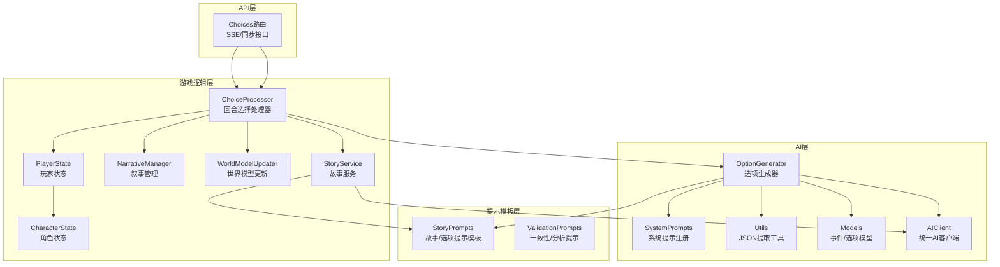
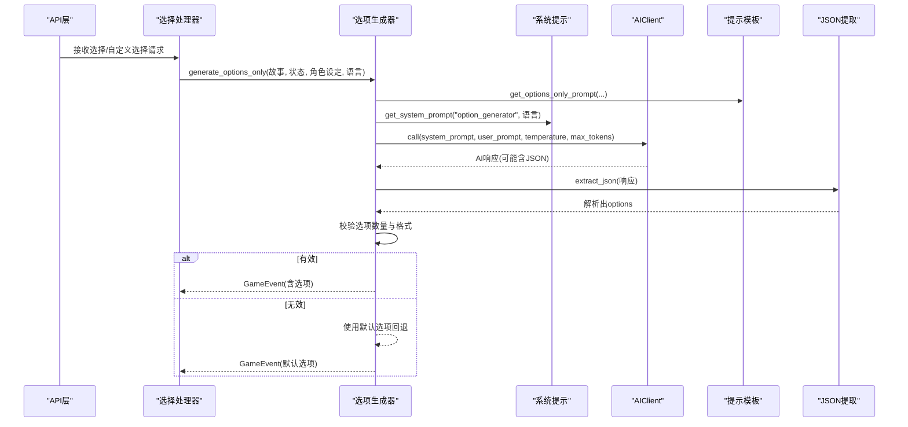
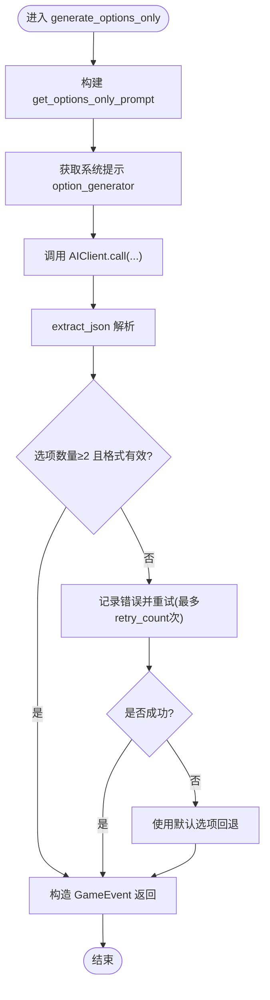
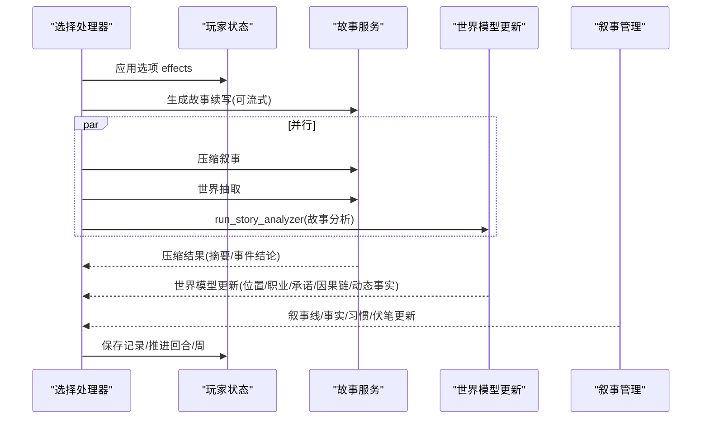
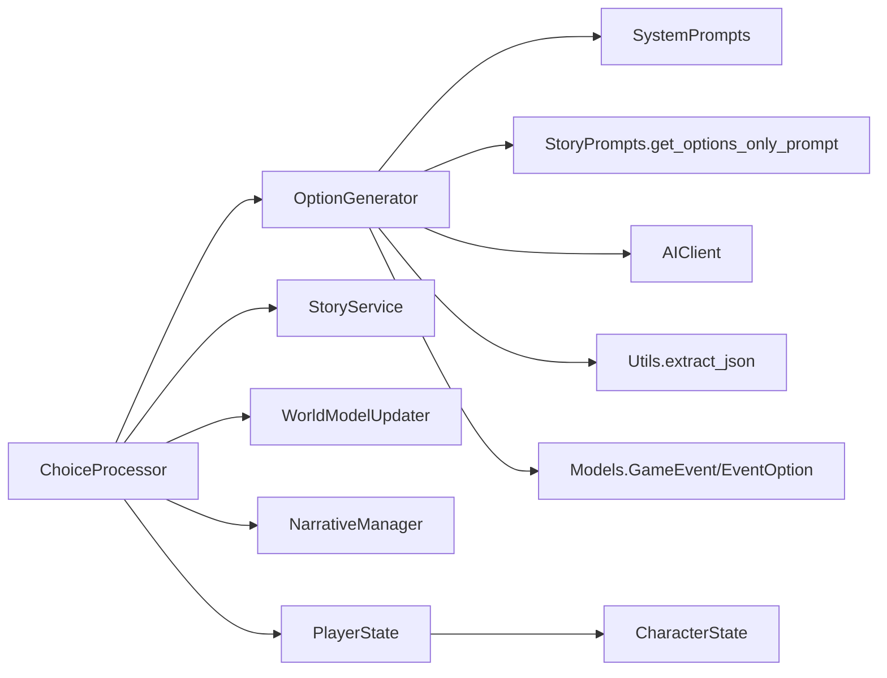

# 选项生成器

<cite>
**本文档引用的文件**
- [src/ai/option_generator.py](file://src/ai/option_generator.py)
- [src/ai/system_prompts.py](file://src/ai/system_prompts.py)
- [src/ai/utils.py](file://src/ai/utils.py)
- [config/prompts/story_prompts.py](file://config/prompts/story_prompts.py)
- [config/prompts/validation_prompts.py](file://config/prompts/validation_prompts.py)
- [src/game/round/choice_processor.py](file://src/game/round/choice_processor.py)
- [src/api/routers/gameplay/choices.py](file://src/api/routers/gameplay/choices.py)
- [src/ai/models.py](file://src/ai/models.py)
- [src/game/state/player_state.py](file://src/game/state/player_state.py)
- [src/game/state/character_state.py](file://src/game/state/character_state.py)
- [src/game/narrative_manager.py](file://src/game/narrative_manager.py)
- [src/game/world_model_updater.py](file://src/game/world_model_updater.py)
- [src/game/story_service.py](file://src/game/story_service.py)
- [src/ai/client.py](file://src/ai/client.py)
- [config/settings.py](file://config/settings.py)
</cite>

## 目录
1. [简介](#简介)
2. [项目结构](#项目结构)
3. [核心组件](#核心组件)
4. [架构总览](#架构总览)
5. [详细组件分析](#详细组件分析)
6. [依赖关系分析](#依赖关系分析)
7. [性能考量](#性能考量)
8. [故障排查指南](#故障排查指南)
9. [结论](#结论)
10. [附录](#附录)

## 简介
本文件为“选项生成器”模块的详细技术文档，面向开发者与产品人员，系统阐述选项生成的算法与逻辑设计、验证机制、多样性保障策略、个性化生成、权重计算与排序、配置参数、生成流程示例、质量控制机制以及失败处理与回退方案。文档还解释了选项生成器与故事生成器、选择处理器、世界模型与叙事管理的协作机制及数据传递方式。

## 项目结构
选项生成器位于 AI 层，负责从既有故事中抽取有意义的选择点并生成选项，随后进行关系名校正与事件质量检查。其上游依赖系统提示与提示模板，下游接入选择处理器与世界模型更新。

图表来源
- [src/ai/option_generator.py](file://src/ai/option_generator.py#L17-L132)
- [src/ai/system_prompts.py](file://src/ai/system_prompts.py#L242-L279)
- [src/ai/utils.py](file://src/ai/utils.py#L10-L77)
- [config/prompts/story_prompts.py](file://config/prompts/story_prompts.py#L440-L610)
- [config/prompts/validation_prompts.py](file://config/prompts/validation_prompts.py#L12-L410)
- [src/game/round/choice_processor.py](file://src/game/round/choice_processor.py#L16-L381)
- [src/game/story_service.py](file://src/game/story_service.py#L11-L312)
- [src/game/narrative_manager.py](file://src/game/narrative_manager.py#L15-L584)
- [src/game/world_model_updater.py](file://src/game/world_model_updater.py#L15-L712)
- [src/ai/client.py](file://src/ai/client.py#L22-L233)
- [src/ai/models.py](file://src/ai/models.py#L7-L27)
- [src/game/state/player_state.py](file://src/game/state/player_state.py#L15-L590)
- [src/game/state/character_state.py](file://src/game/state/character_state.py#L13-L243)
- [src/api/routers/gameplay/choices.py](file://src/api/routers/gameplay/choices.py#L26-L224)

章节来源
- [src/ai/option_generator.py](file://src/ai/option_generator.py#L1-L264)
- [src/ai/system_prompts.py](file://src/ai/system_prompts.py#L1-L279)
- [config/prompts/story_prompts.py](file://config/prompts/story_prompts.py#L440-L610)
- [src/game/round/choice_processor.py](file://src/game/round/choice_processor.py#L1-L381)
- [src/api/routers/gameplay/choices.py](file://src/api/routers/gameplay/choices.py#L1-L224)

## 核心组件
- 选项生成器（OptionGenerator）
  - 负责基于已有故事生成选项，校正关系名，进行事件质量检查。
  - 支持重试与回退策略，确保鲁棒性。
- 系统提示（SystemPrompts）
  - 注册“选项生成器”专用系统提示，保证提示稳定性与一致性。
- 提示模板（StoryPrompts）
  - 提供“仅生成选项”的提示模板，限定选项必须与故事结尾情境直接相关。
- JSON提取工具（Utils.extract_json）
  - 从模型输出中稳健提取 JSON，兼容多种包裹形式。
- 事件/选项模型（Models.GameEvent/EventOption）
  - 定义事件与选项的数据结构，约束长度与字段。
- 统一AI客户端（AIClient）
  - 封装 OpenAI 调用，支持流式与非流式、重试与错误反馈注入。
- 选择处理器（ChoiceProcessor）
  - 处理玩家选择，应用效果，生成续写，驱动叙事与世界模型更新。
- 故事服务（StoryService）
  - 生成续写、压缩叙事、提取世界更新、生成自定义选择的效果。
- 世界模型与叙事管理（WorldModelUpdater/NarrativeManager）
  - 更新位置/职业/承诺/因果链/动态事实，维护故事线、习惯与伏笔。
- 玩家与角色状态（PlayerState/CharacterState）
  - 管理玩家属性、关系、角色画像、计划事件等。

章节来源
- [src/ai/option_generator.py](file://src/ai/option_generator.py#L17-L132)
- [src/ai/system_prompts.py](file://src/ai/system_prompts.py#L242-L279)
- [config/prompts/story_prompts.py](file://config/prompts/story_prompts.py#L440-L610)
- [src/ai/utils.py](file://src/ai/utils.py#L10-L77)
- [src/ai/models.py](file://src/ai/models.py#L7-L27)
- [src/ai/client.py](file://src/ai/client.py#L22-L233)
- [src/game/round/choice_processor.py](file://src/game/round/choice_processor.py#L16-L381)
- [src/game/story_service.py](file://src/game/story_service.py#L11-L312)
- [src/game/narrative_manager.py](file://src/game/narrative_manager.py#L15-L584)
- [src/game/world_model_updater.py](file://src/game/world_model_updater.py#L15-L712)
- [src/game/state/player_state.py](file://src/game/state/player_state.py#L15-L590)
- [src/game/state/character_state.py](file://src/game/state/character_state.py#L13-L243)

## 架构总览
选项生成器采用“两阶段流水线”的第二阶段：在已有故事基础上生成选项。其核心流程如下：
- 输入：已有故事文本、玩家状态、角色设定、语言。
- 生成：构造“仅生成选项”提示，调用系统提示，请求模型生成 JSON。
- 解析：提取 JSON，构造 GameEvent。
- 校验：关系名修复、事件质量检查。
- 回退：若选项数不足或格式异常，使用默认选项回退。

图表来源
- [src/ai/option_generator.py](file://src/ai/option_generator.py#L25-L132)
- [src/ai/system_prompts.py](file://src/ai/system_prompts.py#L264-L279)
- [src/ai/client.py](file://src/ai/client.py#L51-L124)
- [config/prompts/story_prompts.py](file://config/prompts/story_prompts.py#L440-L610)
- [src/ai/utils.py](file://src/ai/utils.py#L10-L77)

## 详细组件分析

### 选项生成器（OptionGenerator）
- 公共接口
  - generate_options_only：基于已有故事生成选项，支持重试与错误反馈注入，最终构造 GameEvent。
- 关键流程
  - 构建提示：调用 get_options_only_prompt，结合角色设定与可用人物列表。
  - 调用模型：使用系统提示与提示模板，温度 0.8，最大令牌 1000。
  - 解析与校验：extract_json 提取 JSON，校验选项数量≥2，否则重试或回退。
  - 回退策略：若多次失败，返回默认选项（积极面对/保持平常心）。
- 关系名修复（validate_and_fix_relationships）
  - 依据角色设定中的 key_people 与 family 成员，对选项 effects 中的 relationships 名称进行修复：
    - 精确匹配（大小写不敏感）
    - 角色身份匹配（role 包含/被包含）
    - 非 key_people 人物允许关系变化，保留原名
- 事件质量检查（validate_event_quality）
  - 至少两条选项
  - 每个选项补全 action_points（默认 -1）
  - 效果合理性检查（能量程过大警告）
  - 选项间权衡差异需足够显著（避免“明显最优”）

图表来源
- [src/ai/option_generator.py](file://src/ai/option_generator.py#L25-L132)
- [src/ai/utils.py](file://src/ai/utils.py#L10-L77)
- [src/ai/client.py](file://src/ai/client.py#L51-L124)
- [src/ai/system_prompts.py](file://src/ai/system_prompts.py#L264-L279)
- [config/prompts/story_prompts.py](file://config/prompts/story_prompts.py#L440-L610)

章节来源
- [src/ai/option_generator.py](file://src/ai/option_generator.py#L17-L132)
- [config/prompts/story_prompts.py](file://config/prompts/story_prompts.py#L440-L610)
- [src/ai/utils.py](file://src/ai/utils.py#L10-L77)

### 关系名修复与事件质量检查
- 关系名修复策略
  - 优先使用角色设定中的 key_people 与 family 成员作为合法名称集合。
  - 依次尝试：精确匹配（大小写不敏感）、角色身份匹配（role 包含/被包含）、保留原名（非 key_people 允许关系变化）。
- 事件质量检查
  - 行为一致性：至少两条选项，每项补全 action_points。
  - 数值合理性：对能量程过大进行警告。
  - 权衡一致性：选项间差异需足够显著，避免明显最优选项。

章节来源
- [src/ai/option_generator.py](file://src/ai/option_generator.py#L136-L264)

### 与选择处理器的协作
- 选择处理器在处理选择时：
  - 应用选项 effects 到玩家状态
  - 生成故事续写（可流式）
  - 并行执行：叙事压缩、世界抽取、故事分析
  - 更新叙事线、事实、习惯、伏笔、世界模型（位置/职业/承诺/因果链）
  - 保存记录并推进回合/周
- 选项生成器与选择处理器的衔接点：
  - 选项生成器输出 GameEvent（含 options），选择处理器据此应用效果与生成续写。

图表来源
- [src/game/round/choice_processor.py](file://src/game/round/choice_processor.py#L203-L347)
- [src/game/story_service.py](file://src/game/story_service.py#L11-L312)
- [src/game/world_model_updater.py](file://src/game/world_model_updater.py#L295-L386)
- [src/game/narrative_manager.py](file://src/game/narrative_manager.py#L22-L95)

章节来源
- [src/game/round/choice_processor.py](file://src/game/round/choice_processor.py#L66-L347)
- [src/game/story_service.py](file://src/game/story_service.py#L18-L142)
- [src/game/world_model_updater.py](file://src/game/world_model_updater.py#L295-L386)
- [src/game/narrative_manager.py](file://src/game/narrative_manager.py#L22-L95)

### 与API层的集成
- Choices 路由提供：
  - SSE 流式选择处理
  - 同步回退（移动端）
  - 自定义选择（SSE/同步）
- 会话恢复与事件恢复：若 current_event 为空，尝试从数据库恢复，避免重复处理。

章节来源
- [src/api/routers/gameplay/choices.py](file://src/api/routers/gameplay/choices.py#L26-L224)

### 数据模型与约束
- 事件与选项模型
  - GameEvent：event_description（上限）、options（2-4个）
  - EventOption：text（上限）、effects（含能量程/关系变化/行动点等）、likely_choice
- 玩家状态与角色状态
  - 玩家状态：能量、情绪、学识、财富、关系、角色画像、计划事件等
  - 角色状态：性格、气质、关系属性、事件触发阈值等

章节来源
- [src/ai/models.py](file://src/ai/models.py#L7-L27)
- [src/game/state/player_state.py](file://src/game/state/player_state.py#L15-L590)
- [src/game/state/character_state.py](file://src/game/state/character_state.py#L13-L243)

## 依赖关系分析
- OptionGenerator 依赖
  - 系统提示注册：确保提示稳定性
  - 提示模板：仅生成选项模板
  - JSON提取工具：稳健解析模型输出
  - AIClient：统一调用入口
  - 模型定义：GameEvent/EventOption
- 与选择处理器/故事服务/世界模型/叙事管理的耦合
  - 通过 GameEvent 与 effects 解耦
  - 通过并行执行与回调机制降低耦合度

图表来源
- [src/ai/option_generator.py](file://src/ai/option_generator.py#L17-L132)
- [src/ai/system_prompts.py](file://src/ai/system_prompts.py#L242-L279)
- [config/prompts/story_prompts.py](file://config/prompts/story_prompts.py#L440-L610)
- [src/ai/utils.py](file://src/ai/utils.py#L10-L77)
- [src/ai/client.py](file://src/ai/client.py#L22-L233)
- [src/ai/models.py](file://src/ai/models.py#L7-L27)
- [src/game/round/choice_processor.py](file://src/game/round/choice_processor.py#L16-L381)
- [src/game/story_service.py](file://src/game/story_service.py#L11-L312)
- [src/game/world_model_updater.py](file://src/game/world_model_updater.py#L15-L712)
- [src/game/narrative_manager.py](file://src/game/narrative_manager.py#L15-L584)
- [src/game/state/player_state.py](file://src/game/state/player_state.py#L15-L590)
- [src/game/state/character_state.py](file://src/game/state/character_state.py#L13-L243)

## 性能考量
- 重试与回退
  - 选项生成失败时自动重试，注入上次错误原因，提升成功率。
  - 回退使用默认选项，保证用户体验连续性。
- 并行处理
  - 选择处理器在生成续写后并行执行叙事压缩、世界抽取与故事分析，缩短总延迟。
- 令牌与温度
  - 选项生成使用温度 0.8、最大令牌 1000，平衡创造性与稳定性。
- 世界模型与叙事管理的限流
  - 事实/种子/习惯等均有限制与清理策略，避免无限增长导致性能下降。

章节来源
- [src/ai/option_generator.py](file://src/ai/option_generator.py#L64-L132)
- [src/game/round/choice_processor.py](file://src/game/round/choice_processor.py#L229-L246)
- [src/game/world_model_updater.py](file://src/game/world_model_updater.py#L363-L376)
- [src/game/narrative_manager.py](file://src/game/narrative_manager.py#L175-L182)

## 故障排查指南
- 选项生成失败
  - 现象：选项数量不足或 JSON 格式异常
  - 排查：检查提示模板是否正确传入可用人物列表与角色背景；确认系统提示与模型输出格式
  - 处理：启用重试与错误反馈注入；必要时使用默认选项回退
- 关系名不一致
  - 现象：选项 effects 中的关系名不在合法名单内
  - 排查：核对角色设定中的 key_people 与 family；确认修复策略是否按预期执行
  - 处理：启用关系名修复；对非 key_people 人物允许关系变化
- 事件质量差
  - 现象：选项无权衡、数值异常、action_points 缺失
  - 排查：检查 validate_event_quality 的各项校验
  - 处理：调整提示模板，引导模型生成真实权衡与合理数值

章节来源
- [src/ai/option_generator.py](file://src/ai/option_generator.py#L64-L132)
- [src/ai/option_generator.py](file://src/ai/option_generator.py#L136-L264)
- [config/prompts/validation_prompts.py](file://config/prompts/validation_prompts.py#L203-L410)

## 结论
选项生成器通过严格的提示约束、稳健的 JSON 解析、关系名修复与事件质量检查，确保从既有故事中生成高质量、个性化且逻辑一致的选项。配合选择处理器的并行化与世界模型/叙事管理的增量更新，形成高效稳定的两阶段流水线。在失败场景下，重试与回退策略保障了系统的鲁棒性与用户体验。

## 附录

### 配置参数与设置
- 默认语言与游戏常量
  - DEFAULT_LANGUAGE、EVENTS_PER_WEEK、ROUNDS_PER_WEEK、MIN/MAX_RESOURCE、MAX_WEALTH 等
- API/模型配置
  - OPENAI_API_KEY、OPENAI_MODEL、OPENAI_BASE_URL
- 图像/场景分析配置
  - IMAGE_*、SCENE_ANALYZER_*（与选项生成器间接相关）

章节来源
- [config/settings.py](file://config/settings.py#L27-L168)

### 生成流程示例（不含代码）
- 步骤
  - 准备：已有故事文本、玩家状态、角色设定、语言
  - 构建提示：get_options_only_prompt（含可用人物列表与角色背景）
  - 获取系统提示：option_generator
  - 调用模型：AIClient.call（温度 0.8，最大令牌 1000）
  - 解析：extract_json
  - 校验：选项数量≥2、格式有效
  - 回退：若失败，使用默认选项
  - 输出：GameEvent（含 options）

章节来源
- [config/prompts/story_prompts.py](file://config/prompts/story_prompts.py#L440-L610)
- [src/ai/system_prompts.py](file://src/ai/system_prompts.py#L264-L279)
- [src/ai/client.py](file://src/ai/client.py#L51-L124)
- [src/ai/utils.py](file://src/ai/utils.py#L10-L77)
- [src/ai/option_generator.py](file://src/ai/option_generator.py#L25-L132)