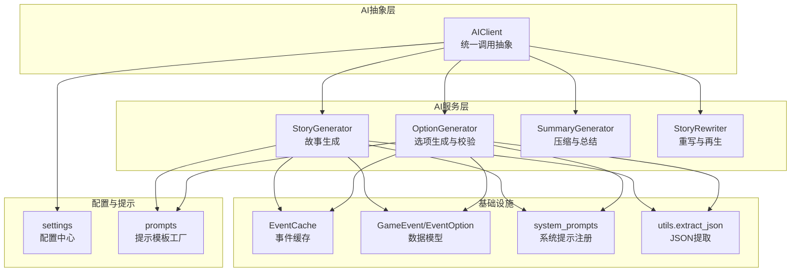
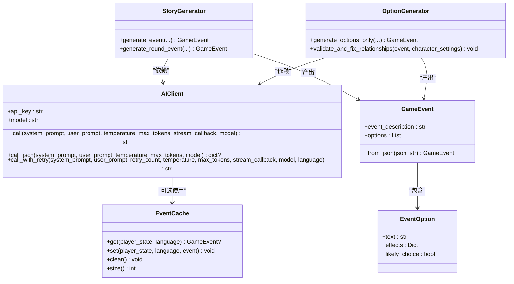
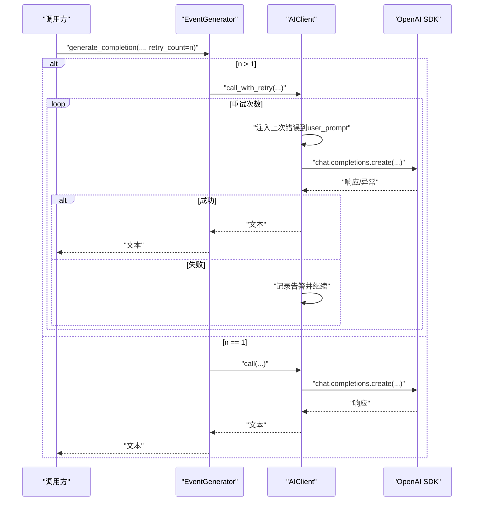
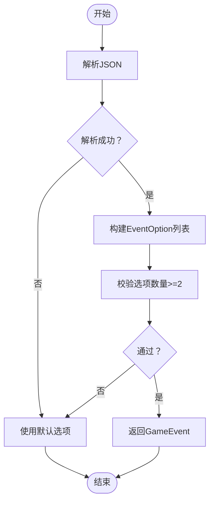
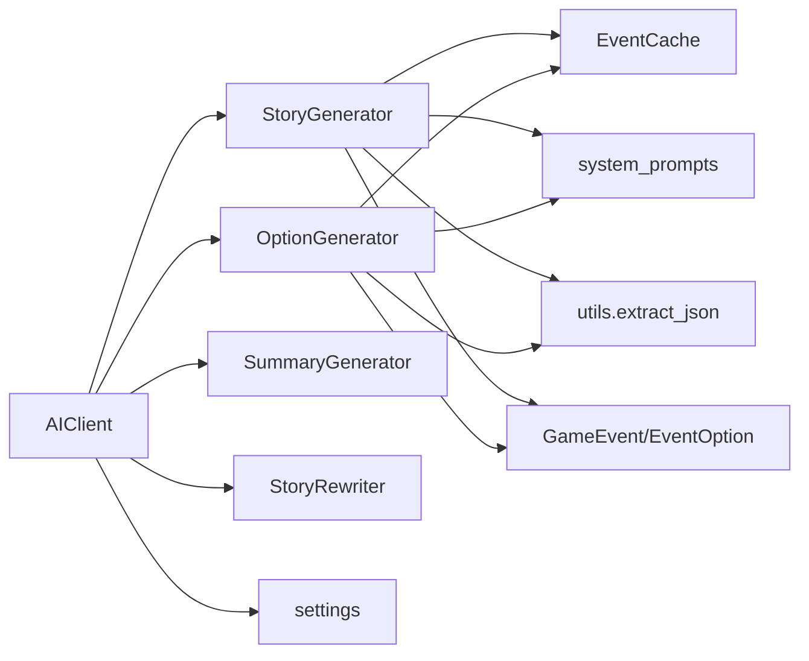

# AI客户端服务

<cite>
**本文档引用的文件**
- [src/ai/client.py](file://src/ai/client.py)
- [src/ai/models.py](file://src/ai/models.py)
- [src/ai/utils.py](file://src/ai/utils.py)
- [src/ai/cache.py](file://src/ai/cache.py)
- [src/ai/system_prompts.py](file://src/ai/system_prompts.py)
- [src/ai/generator.py](file://src/ai/generator.py)
- [src/ai/story_generator.py](file://src/ai/story_generator.py)
- [src/ai/option_generator.py](file://src/ai/option_generator.py)
- [config/settings.py](file://config/settings.py)
- [config/prompts.py](file://config/prompts.py)
- [config/logging_config.py](file://config/logging_config.py)
- [tests/test_ai_modules.py](file://tests/test_ai_modules.py)
</cite>

## 目录
1. [简介](#简介)
2. [项目结构](#项目结构)
3. [核心组件](#核心组件)
4. [架构总览](#架构总览)
5. [详细组件分析](#详细组件分析)
6. [依赖关系分析](#依赖关系分析)
7. [性能考量](#性能考量)
8. [故障排查指南](#故障排查指南)
9. [结论](#结论)
10. [附录](#附录)

## 简介
本文件面向AI客户端服务的技术文档，聚焦于AIClient类的设计架构与统一AI调用抽象实现。内容涵盖：
- OpenAI API的初始化配置、连接管理与错误处理机制
- API密钥管理、请求重试策略与超时处理
- 客户端与不同AI服务的适配器模式实现
- 请求响应的数据模型定义与类型验证
- 监控指标、性能优化与故障恢复策略
- 扩展支持其他大语言模型服务提供商的方法

## 项目结构
AI相关模块位于src/ai目录，采用分层与职责分离设计：
- 抽象层：AIClient提供统一调用接口，屏蔽底层SDK差异
- 服务层：StoryGenerator、OptionGenerator、SummaryGenerator、StoryRewriter等按功能拆分
- 基础设施：EventCache缓存、Event/Option数据模型、系统提示注册表、JSON提取工具
- 配置与提示：config/settings.py集中配置，config/prompts.py与system_prompts.py提供提示模板



**图表来源**
- [src/ai/client.py](file://src/ai/client.py#L22-L214)
- [src/ai/story_generator.py](file://src/ai/story_generator.py#L24-L176)
- [src/ai/option_generator.py](file://src/ai/option_generator.py#L17-L133)
- [src/ai/cache.py](file://src/ai/cache.py#L13-L139)
- [src/ai/models.py](file://src/ai/models.py#L7-L27)
- [src/ai/system_prompts.py](file://src/ai/system_prompts.py#L14-L226)
- [src/ai/utils.py](file://src/ai/utils.py#L10-L77)
- [config/settings.py](file://config/settings.py#L30-L100)
- [config/prompts.py](file://config/prompts.py#L674-L712)

**章节来源**
- [src/ai/__init__.py](file://src/ai/__init__.py#L1-L18)
- [src/ai/client.py](file://src/ai/client.py#L1-L214)
- [src/ai/generator.py](file://src/ai/generator.py#L30-L66)

## 核心组件
- AIClient：统一AI调用抽象，封装OpenAI SDK初始化、聊天补全调用、流式回调、JSON解析与重试机制
- EventCache：事件级缓存，降低重复API调用成本
- GameEvent/EventOption：Pydantic模型，定义事件与选项的数据结构与校验规则
- system_prompts：系统提示注册表，提供多任务提示模板
- utils.extract_json：鲁棒的JSON提取工具，兼容多种AI输出格式
- EventGenerator（门面）：向后兼容的高层接口，协调各子服务

**章节来源**
- [src/ai/client.py](file://src/ai/client.py#L22-L214)
- [src/ai/cache.py](file://src/ai/cache.py#L13-L139)
- [src/ai/models.py](file://src/ai/models.py#L7-L27)
- [src/ai/system_prompts.py](file://src/ai/system_prompts.py#L196-L226)
- [src/ai/utils.py](file://src/ai/utils.py#L10-L77)
- [src/ai/generator.py](file://src/ai/generator.py#L30-L66)

## 架构总览
AIClient作为单一真实来源，向上提供三类方法：
- call：标准聊天补全，支持流式回调
- call_json：自动提取JSON并解析为字典
- call_with_retry：带错误反馈注入的重试调用



**图表来源**
- [src/ai/client.py](file://src/ai/client.py#L22-L214)
- [src/ai/cache.py](file://src/ai/cache.py#L13-L139)
- [src/ai/models.py](file://src/ai/models.py#L7-L27)
- [src/ai/story_generator.py](file://src/ai/story_generator.py#L24-L176)
- [src/ai/option_generator.py](file://src/ai/option_generator.py#L17-L133)

## 详细组件分析

### AIClient：统一AI调用抽象
- 初始化与配置
  - 从配置中心读取API密钥与模型；支持自定义覆盖
  - 支持自定义基础URL（便于代理或兼容其他服务）
  - 运行期校验API密钥必填
- 核心调用
  - call：构造messages，支持流式与非流式两种路径
  - call_json：在call基础上调用utils.extract_json进行鲁棒解析
- 重试与错误反馈
  - call_with_retry：循环尝试，将上次错误注入用户提示，提升模型自我修复能力
  - 首次尝试保留流式回调，后续重试去除流式以稳定格式
- 错误处理
  - 捕获异常并记录告警，最终抛出聚合错误



**图表来源**
- [src/ai/generator.py](file://src/ai/generator.py#L88-L129)
- [src/ai/client.py](file://src/ai/client.py#L140-L213)

**章节来源**
- [src/ai/client.py](file://src/ai/client.py#L25-L47)
- [src/ai/client.py](file://src/ai/client.py#L51-L104)
- [src/ai/client.py](file://src/ai/client.py#L108-L136)
- [src/ai/client.py](file://src/ai/client.py#L140-L213)

### OpenAI API初始化与连接管理
- 配置来源：config/settings.py
  - OPENAI_API_KEY：必填
  - OPENAI_MODEL：默认模型
  - OPENAI_BASE_URL：可选，用于替换默认基础URL
- 连接对象：AIClient内部创建openai.OpenAI实例，传入api_key与base_url
- 环境集成：.env文件或环境变量加载，支持Streamlit等UI层集成

**章节来源**
- [config/settings.py](file://config/settings.py#L34-L36)
- [config/settings.py](file://config/settings.py#L84-L90)
- [src/ai/client.py](file://src/ai/client.py#L37-L47)

### API密钥管理、请求重试与超时
- 密钥管理
  - 优先使用AIClient构造参数，其次使用配置中心
  - 配置中心在运行期校验密钥存在性
- 重试策略
  - call_with_retry：指数退避式重试（由循环控制），每次将上次错误注入提示
  - 首次尝试保留流式回调，后续重试关闭流式以保证稳定性
- 超时处理
  - 当前实现未显式设置超时参数；可在调用侧或SDK层补充

**章节来源**
- [src/ai/client.py](file://src/ai/client.py#L37-L47)
- [config/settings.py](file://config/settings.py#L84-L90)
- [src/ai/client.py](file://src/ai/client.py#L175-L213)

### 适配器模式：扩展支持其他大模型服务
- 设计原则
  - AIClient作为抽象接口，屏蔽底层SDK差异
  - 通过替换初始化参数（如base_url）即可对接兼容OpenAI协议的服务
- 实施建议
  - 新增Adapter类，实现与AIClient相同的接口签名
  - 在配置中心新增对应项（如OPENAI_BASE_URL、MODEL别名等）
  - 在上层通过工厂或配置切换选择具体实现

**章节来源**
- [src/ai/client.py](file://src/ai/client.py#L43-L47)
- [config/settings.py](file://config/settings.py#L34-L36)

### 数据模型与类型验证
- GameEvent/EventOption
  - 使用Pydantic定义字段长度、最小/最大选项数等约束
  - from_json提供容错解析，捕获JSON与校验异常
- OptionGenerator在生成选项后进行关系名称校验与修复，确保仅使用合法人物名



**图表来源**
- [src/ai/option_generator.py](file://src/ai/option_generator.py#L25-L133)
- [src/ai/models.py](file://src/ai/models.py#L19-L27)

**章节来源**
- [src/ai/models.py](file://src/ai/models.py#L7-L27)
- [src/ai/option_generator.py](file://src/ai/option_generator.py#L136-L200)

### JSON提取与鲁棒性
- extract_json支持多种常见AI输出格式：
  - 纯JSON
  - 包含```json...```的代码块
  - 包含```...```的代码块
  - 包含'''json...'''的代码块
  - 包含'''...'''的代码块
  - 正则匹配第一个{}包裹的对象
- 失败时记录告警并返回None，便于上层降级

**章节来源**
- [src/ai/utils.py](file://src/ai/utils.py#L10-L77)

### 事件缓存与性能优化
- EventCache
  - 基于玩家状态签名生成MD5键，减少重复生成
  - 仅30%概率命中缓存，保证多样性
  - 异常时记录告警并忽略缓存项
- 性能建议
  - 合理设置max_tokens与temperature
  - 对高频调用场景启用缓存
  - 将流式回调限制在首次尝试

**章节来源**
- [src/ai/cache.py](file://src/ai/cache.py#L13-L139)

### 监控指标与日志
- 日志配置
  - 生产环境使用RotatingFileHandler，控制单文件大小与备份数量
  - 第三方库日志级别抑制，避免噪声
- 建议指标
  - API调用次数、成功率、平均响应时间、重试次数、缓存命中率
  - 错误分类统计（网络、格式、校验）

**章节来源**
- [config/logging_config.py](file://config/logging_config.py#L12-L69)

## 依赖关系分析
- 模块耦合
  - AIClient被各服务依赖，形成清晰的单向依赖
  - EventCache与EventGenerator耦合，用于事件级缓存
  - system_prompts与config/prompts共同提供提示模板
- 可能的循环依赖
  - 当前结构未见循环导入；若新增跨模块引用需谨慎



**图表来源**
- [src/ai/generator.py](file://src/ai/generator.py#L30-L66)
- [src/ai/story_generator.py](file://src/ai/story_generator.py#L24-L176)
- [src/ai/option_generator.py](file://src/ai/option_generator.py#L17-L133)
- [src/ai/cache.py](file://src/ai/cache.py#L13-L139)
- [src/ai/system_prompts.py](file://src/ai/system_prompts.py#L196-L226)
- [src/ai/utils.py](file://src/ai/utils.py#L10-L77)
- [src/ai/models.py](file://src/ai/models.py#L7-L27)
- [config/settings.py](file://config/settings.py#L30-L100)

**章节来源**
- [src/ai/generator.py](file://src/ai/generator.py#L30-L66)

## 性能考量
- 流式输出：仅在首次尝试启用，后续重试关闭，减少格式不稳定风险
- 缓存策略：30%随机命中，兼顾多样性与成本
- Token与温度：根据任务调整max_tokens与temperature，平衡质量与成本
- 超时与并发：建议在调用侧增加超时与并发限制，避免阻塞

## 故障排查指南
- 常见问题
  - API密钥缺失：配置中心校验失败，启动即报错
  - JSON解析失败：extract_json返回None，OptionGenerator回退默认选项
  - 缓存损坏：EventCache记录告警并忽略该项
  - 重试耗尽：call_with_retry最终抛出聚合错误
- 排查步骤
  - 检查OPENAI_API_KEY与OPENAI_BASE_URL
  - 查看日志文件定位错误位置
  - 临时禁用缓存复现问题
  - 减少重试次数快速定位

**章节来源**
- [config/settings.py](file://config/settings.py#L84-L90)
- [src/ai/utils.py](file://src/ai/utils.py#L75-L77)
- [src/ai/cache.py](file://src/ai/cache.py#L34-L45)
- [src/ai/client.py](file://src/ai/client.py#L203-L213)

## 结论
AIClient通过统一抽象与稳健的重试机制，有效屏蔽底层差异并提升可靠性。结合事件缓存、数据模型校验与系统提示注册表，形成了可扩展、可观测、可维护的AI服务架构。建议在现有基础上补充超时控制、指标采集与更丰富的适配器实现，以进一步增强生产环境的稳定性与可运维性。

## 附录

### 配置清单
- OPENAI_API_KEY：必填
- OPENAI_MODEL：默认模型
- OPENAI_BASE_URL：可选，兼容其他服务
- CACHE_EVENTS：是否启用事件缓存
- DEFAULT_LANGUAGE：默认语言
- DEBUG_MODE：调试模式

**章节来源**
- [config/settings.py](file://config/settings.py#L34-L41)
- [config/settings.py](file://config/settings.py#L84-L90)

### 测试要点
- JSON提取：纯JSON、代码块、嵌入文本、空输入、无效输入
- 数据模型：最小/最大选项数、额外字段、非法JSON
- 系统提示：中英双语、键存在性、异常键

**章节来源**
- [tests/test_ai_modules.py](file://tests/test_ai_modules.py#L18-L73)
- [tests/test_ai_modules.py](file://tests/test_ai_modules.py#L77-L111)
- [tests/test_ai_modules.py](file://tests/test_ai_modules.py#L115-L155)