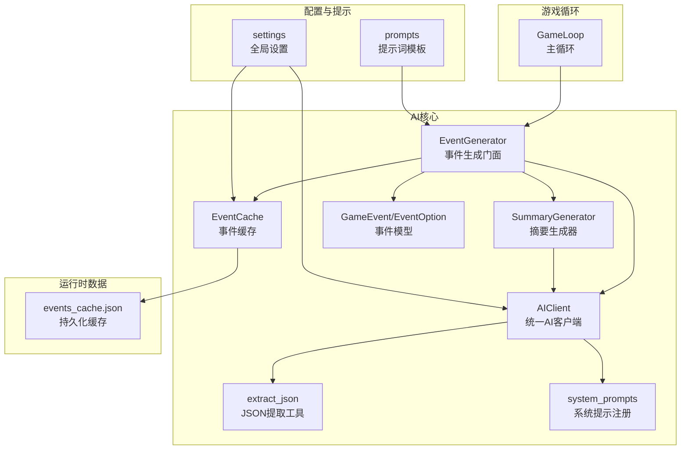
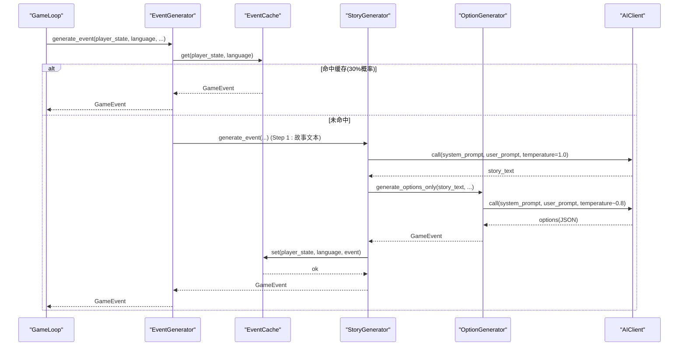
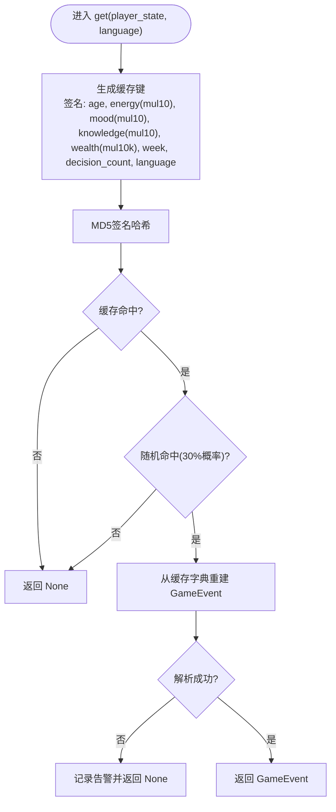
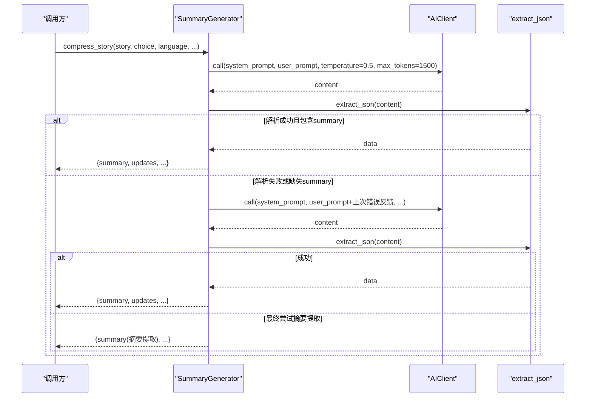
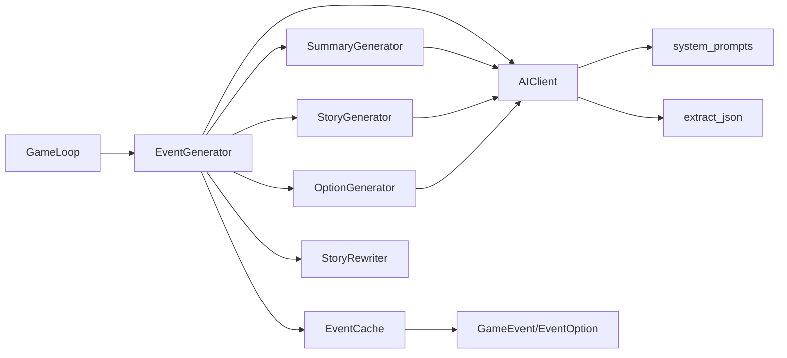

# AI缓存系统

<cite>
**本文档引用的文件**
- [src/ai/cache.py](file://src/ai/cache.py)
- [src/ai/summary_generator.py](file://src/ai/summary_generator.py)
- [src/ai/generator.py](file://src/ai/generator.py)
- [src/ai/models.py](file://src/ai/models.py)
- [src/ai/client.py](file://src/ai/client.py)
- [src/ai/utils.py](file://src/ai/utils.py)
- [src/ai/system_prompts.py](file://src/ai/system_prompts.py)
- [config/settings.py](file://config/settings.py)
- [config/prompts.py](file://config/prompts.py)
- [src/game/game_loop.py](file://src/game/game_loop.py)
- [data/cache/events_cache.json](file://data/cache/events_cache.json)
</cite>

## 目录
1. [简介](#简介)
2. [项目结构](#项目结构)
3. [核心组件](#核心组件)
4. [架构总览](#架构总览)
5. [详细组件分析](#详细组件分析)
6. [依赖关系分析](#依赖关系分析)
7. [性能考虑](#性能考虑)
8. [故障排查指南](#故障排查指南)
9. [结论](#结论)
10. [附录](#附录)

## 简介
本文件面向AI缓存系统与压缩摘要功能的技术文档，聚焦事件缓存机制的设计与实现、缓存策略选择原则、过期与内存管理、命中率优化与热点处理、缓存穿透防护；同时阐述SummaryGenerator的摘要生成算法、信息保留与压缩比控制策略，并给出缓存监控指标、性能分析与容量规划建议，以及缓存失效策略、数据一致性保障与故障恢复机制，最后讨论如何扩展缓存类型以适配不同数据特征。

## 项目结构
AI缓存系统位于src/ai目录下，围绕事件缓存、摘要生成、AI客户端与系统提示等模块协同工作，配置与提示词模板位于config目录，运行时缓存持久化于data/cache/events_cache.json。

图表来源
- [src/ai/cache.py](file://src/ai/cache.py#L13-L139)
- [src/ai/summary_generator.py](file://src/ai/summary_generator.py#L17-L429)
- [src/ai/generator.py](file://src/ai/generator.py#L30-L431)
- [src/ai/models.py](file://src/ai/models.py#L7-L27)
- [src/ai/client.py](file://src/ai/client.py#L22-L214)
- [src/ai/utils.py](file://src/ai/utils.py#L10-L77)
- [src/ai/system_prompts.py](file://src/ai/system_prompts.py#L196-L226)
- [config/settings.py](file://config/settings.py#L16-L41)
- [config/prompts.py](file://config/prompts.py#L674-L712)
- [src/game/game_loop.py](file://src/game/game_loop.py#L153-L256)
- [data/cache/events_cache.json](file://data/cache/events_cache.json#L1-L100)

章节来源
- [src/ai/cache.py](file://src/ai/cache.py#L1-L139)
- [src/ai/summary_generator.py](file://src/ai/summary_generator.py#L1-L429)
- [src/ai/generator.py](file://src/ai/generator.py#L1-L431)
- [src/ai/models.py](file://src/ai/models.py#L1-L27)
- [src/ai/client.py](file://src/ai/client.py#L1-L214)
- [src/ai/utils.py](file://src/ai/utils.py#L1-L77)
- [src/ai/system_prompts.py](file://src/ai/system_prompts.py#L1-L226)
- [config/settings.py](file://config/settings.py#L1-L100)
- [config/prompts.py](file://config/prompts.py#L1-L800)
- [src/game/game_loop.py](file://src/game/game_loop.py#L1-L800)
- [data/cache/events_cache.json](file://data/cache/events_cache.json#L1-L1792)

## 核心组件
- 事件缓存(EventCache)：基于玩家状态与语言生成稳定哈希键，将GameEvent序列化为字典持久化存储，支持按30%概率随机命中读取，避免完全固化导致体验单一。
- 摘要生成器(SummaryGenerator)：提供故事压缩、周/四周/年总结生成，具备多轮重试与错误反馈注入、JSON提取与清洗、长度限制与回退策略。
- 事件生成门面(EventGenerator)：聚合StoryGenerator、OptionGenerator、SummaryGenerator、StoryRewriter，协调缓存与AI客户端，对外提供统一接口。
- AI客户端(AIClient)：封装OpenAI调用，统一错误处理、重试与流式回调，支持注入错误反馈以提升后续生成质量。
- 事件模型(GameEvent/EventOption)：Pydantic模型，约束事件描述长度、选项数量与字段结构，提供from_json解析与校验。
- JSON提取工具(extract_json)：从AI非结构化响应中提取JSON对象，兼容多种代码块包装与嵌入式JSON。
- 系统提示(system_prompts)：集中管理各类系统提示，确保KV缓存前缀稳定，便于LLM侧缓存复用。
- 配置(settings)：提供缓存开关、数据目录、语言等全局配置，驱动缓存与AI客户端初始化。

章节来源
- [src/ai/cache.py](file://src/ai/cache.py#L13-L139)
- [src/ai/summary_generator.py](file://src/ai/summary_generator.py#L17-L429)
- [src/ai/generator.py](file://src/ai/generator.py#L30-L431)
- [src/ai/client.py](file://src/ai/client.py#L22-L214)
- [src/ai/models.py](file://src/ai/models.py#L7-L27)
- [src/ai/utils.py](file://src/ai/utils.py#L10-L77)
- [src/ai/system_prompts.py](file://src/ai/system_prompts.py#L196-L226)
- [config/settings.py](file://config/settings.py#L16-L41)

## 架构总览
事件生成流程：GameLoop调用EventGenerator.generate_event，后者优先检查缓存，未命中则委托StoryGenerator生成故事文本，再由OptionGenerator生成选项并进行一致性校验与修复，随后将完整GameEvent写入缓存。摘要生成贯穿周/月/年的多粒度总结，使用AIClient调用并结合extract_json与清洗逻辑确保输出稳定性。

图表来源
- [src/game/game_loop.py](file://src/game/game_loop.py#L153-L256)
- [src/ai/generator.py](file://src/ai/generator.py#L183-L238)
- [src/ai/cache.py](file://src/ai/cache.py#L78-L128)
- [src/ai/story_generator.py](file://src/ai/story_generator.py#L32-L175)
- [src/ai/client.py](file://src/ai/client.py#L51-L104)

## 详细组件分析

### 事件缓存机制(EventCache)
- 键生成策略：从玩家状态抽取age、energy、mood、knowledge、wealth、week、decision_history长度与language，对连续型数值按步长取整以降低微小波动导致的缓存抖动；最终对排序后的签名进行MD5哈希得到固定长度键。
- 命中策略：每次查询以30%概率随机命中缓存，其余70%绕过缓存强制生成，平衡多样性与成本。
- 序列化与持久化：将GameEvent拆解为event_description与options数组，写入data/cache/events_cache.json，异常时记录告警并继续运行。
- 大小统计：提供size()返回缓存项数量，便于监控与容量规划。

图表来源
- [src/ai/cache.py](file://src/ai/cache.py#L47-L101)
- [src/ai/models.py](file://src/ai/models.py#L19-L27)

章节来源
- [src/ai/cache.py](file://src/ai/cache.py#L13-L139)
- [src/ai/models.py](file://src/ai/models.py#L7-L27)
- [data/cache/events_cache.json](file://data/cache/events_cache.json#L1-L100)

### 摘要生成器(SummaryGenerator)
- 故事压缩(compress_story)：构造压缩提示，调用AIClient.call，尝试extract_json解析；若首次失败，注入上次错误反馈进行二次尝试；仍失败则进行摘要-only提取或回退截断，确保稳定输出。
- 周总结(generate_weekly_summary)：对一周回合记录生成总结与奖励效果，限定奖励字段范围与数值区间，清洗无效值，缺失时回退到默认文案。
- 四周总结(generate_four_week_summary)：对过去四周故事与决策生成简洁总结，使用call_with_retry进行重试。
- 年总结(generate_yearly_summary)：对12个四周总结生成年度回顾，同样使用重试机制。
- 文本清洗(_clean_summary_text/_extract_summary_from_raw)：移除代码块标记、JSON前缀/后缀、多余引号与结构符号，保留可读摘要文本；对异常响应进行启发式提取与长度限制。

图表来源
- [src/ai/summary_generator.py](file://src/ai/summary_generator.py#L25-L140)
- [src/ai/client.py](file://src/ai/client.py#L51-L104)
- [src/ai/utils.py](file://src/ai/utils.py#L10-L77)

章节来源
- [src/ai/summary_generator.py](file://src/ai/summary_generator.py#L17-L429)
- [src/ai/client.py](file://src/ai/client.py#L1-L214)
- [src/ai/utils.py](file://src/ai/utils.py#L1-L77)

### 事件生成门面(EventGenerator)
- 初始化：装配AIClient、EventCache（受settings.CACHE_EVENTS控制）、预设事件加载、子服务（StoryGenerator、OptionGenerator、SummaryGenerator、StoryRewriter）。
- generate_event：优先检查preset里程碑事件，再检查缓存（force=true时绕过），否则委派StoryGenerator两阶段生成（故事+选项），完成后写入缓存。
- 代理方法：将压缩、周/四周/年总结等能力代理给SummaryGenerator，保持对外接口一致。

章节来源
- [src/ai/generator.py](file://src/ai/generator.py#L30-L431)
- [config/settings.py](file://config/settings.py#L30-L41)

### AI客户端与系统提示
- AIClient：封装OpenAI调用，支持流式回调、温度与max_tokens控制、统一错误处理与重试；call_with_retry在重试时注入上次错误反馈，提升模型学习与稳定性。
- system_prompts：集中管理各类系统提示，确保相同提示词产生一致KV前缀，利于LLM侧缓存复用与行为一致性。

章节来源
- [src/ai/client.py](file://src/ai/client.py#L22-L214)
- [src/ai/system_prompts.py](file://src/ai/system_prompts.py#L196-L226)

### 事件模型与JSON提取
- GameEvent/EventOption：Pydantic模型，约束长度与数量，提供from_json解析与校验，保证缓存与传输的数据结构一致性。
- extract_json：多策略提取JSON，兼容代码块包裹与嵌入式JSON，失败时记录告警。

章节来源
- [src/ai/models.py](file://src/ai/models.py#L7-L27)
- [src/ai/utils.py](file://src/ai/utils.py#L10-L77)

## 依赖关系分析
- EventGenerator依赖EventCache、AIClient、SummaryGenerator、StoryGenerator、OptionGenerator、StoryRewriter，形成清晰的门面模式，降低耦合。
- EventCache依赖GameEvent模型与配置settings，持久化于data/cache/events_cache.json。
- SummaryGenerator依赖AIClient与extract_json，系统提示来自system_prompts。
- GameLoop依赖EventGenerator与多个服务，驱动事件生成与总结流程。

图表来源
- [src/ai/generator.py](file://src/ai/generator.py#L17-L66)
- [src/ai/cache.py](file://src/ai/cache.py#L7-L8)
- [src/ai/summary_generator.py](file://src/ai/summary_generator.py#L10-L12)
- [src/ai/client.py](file://src/ai/client.py#L14-L17)
- [src/ai/system_prompts.py](file://src/ai/system_prompts.py#L196-L208)
- [src/ai/utils.py](file://src/ai/utils.py#L10-L17)
- [src/game/game_loop.py](file://src/game/game_loop.py#L8-L18)

章节来源
- [src/ai/generator.py](file://src/ai/generator.py#L17-L66)
- [src/ai/cache.py](file://src/ai/cache.py#L7-L8)
- [src/ai/summary_generator.py](file://src/ai/summary_generator.py#L10-L12)
- [src/ai/client.py](file://src/ai/client.py#L14-L17)
- [src/ai/system_prompts.py](file://src/ai/system_prompts.py#L196-L208)
- [src/ai/utils.py](file://src/ai/utils.py#L10-L17)
- [src/game/game_loop.py](file://src/game/game_loop.py#L8-L18)

## 性能考虑
- 缓存命中率优化
  - 键设计：对连续型状态变量按步长取整，减少微小波动导致的缓存抖动；加入决策历史长度与周数，提升键区分度。
  - 命中概率：30%随机命中，70%强制生成，平衡成本与多样性。
  - 建议：在高频相近状态场景下，可考虑动态调整命中率或引入LRU淘汰策略以提升命中率。
- 热点数据处理
  - 对高重复状态组合（如低能量/低情绪）可增加键的扰动维度（如加入随机噪声或时间戳片段）以分散热点。
- 缓存穿透防护
  - 当前未见显式布隆过滤器或空值缓存；可在get前增加“空结果占位”或短时缓存空值，防止同一键反复穿透。
- 内存管理
  - EventCache在内存中维护字典，size()返回缓存项数；建议定期清理或设置上限阈值，避免无限增长。
- 摘要生成性能
  - compress_story与weekly/四/年总结均使用AIClient.call_with_retry，合理设置temperature与max_tokens，避免超长输出；清洗与截断逻辑确保输出可控。

[本节为通用性能建议，不直接分析特定文件]

## 故障排查指南
- 缓存读取失败
  - 现象：日志出现“Failed to parse cached event”告警。
  - 排查：检查events_cache.json完整性与GameEvent.from_json解析路径；必要时清空缓存后重试。
- 摘要生成失败
  - 现象：compress_story/weekly_summary等返回回退结果或告警。
  - 排查：查看extract_json是否成功提取JSON；确认system_prompt与user_prompt构造是否正确；检查AIClient重试与错误反馈注入逻辑。
- AI调用异常
  - 现象：call_with_retry抛出异常或返回空。
  - 排查：检查OPENAI_API_KEY与OPENAI_BASE_URL配置；确认网络连通性与限流情况；查看错误反馈注入是否生效。

章节来源
- [src/ai/cache.py](file://src/ai/cache.py#L96-L98)
- [src/ai/summary_generator.py](file://src/ai/summary_generator.py#L107-L130)
- [src/ai/client.py](file://src/ai/client.py#L173-L212)
- [config/settings.py](file://config/settings.py#L34-L41)

## 结论
本AI缓存系统通过稳定的键生成策略与随机命中机制，在保证成本可控的同时维持内容多样性；摘要生成器以多轮重试与错误反馈注入为核心，结合JSON提取与文本清洗，确保输出稳定性与可消费性。建议在热点场景引入空值占位与容量上限、在键设计中增加扰动维度以进一步提升命中率，并持续监控缓存大小与命中率指标以指导容量规划。

[本节为总结性内容，不直接分析特定文件]

## 附录

### 缓存监控指标与容量规划
- 指标建议
  - 命中率：命中次数/(命中次数+未命中次数)
  - 命中概率：实际命中比例与期望30%的偏差
  - 缓存大小：events_cache.json条目数与平均事件体积
  - 读写延迟：get/set耗时分布
  - 错误率：解析失败与AI调用失败比率
- 容量规划
  - 基于最大周数与状态空间估算键空间规模，结合命中率与存储成本制定缓存上限；
  - 定期清理长期未访问键或引入LRU策略，避免无限增长。

[本节为通用建议，不直接分析特定文件]

### 扩展缓存类型与数据特征适配
- 事件缓存：适用于高重复状态与相近决策历史的场景，键设计已考虑状态离散化与扰动。
- 其他缓存类型建议
  - 提示词模板缓存：基于prompt签名与模型参数生成键，适合KV缓存前缀稳定场景。
  - 摘要缓存：对固定输入（如固定周数窗口）可缓存摘要结果，减少重复计算。
  - 关系事件缓存：对触发条件明确的关系事件可缓存“已触发/未触发”状态，避免重复检测。

[本节为概念性扩展建议，不直接分析特定文件]