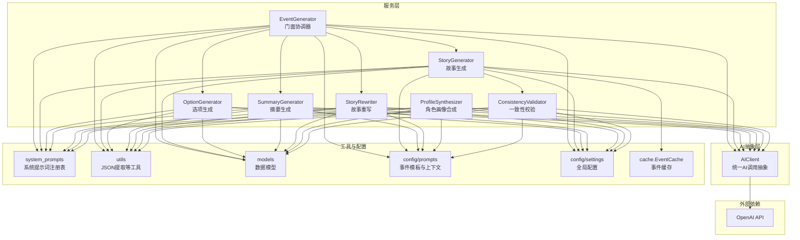
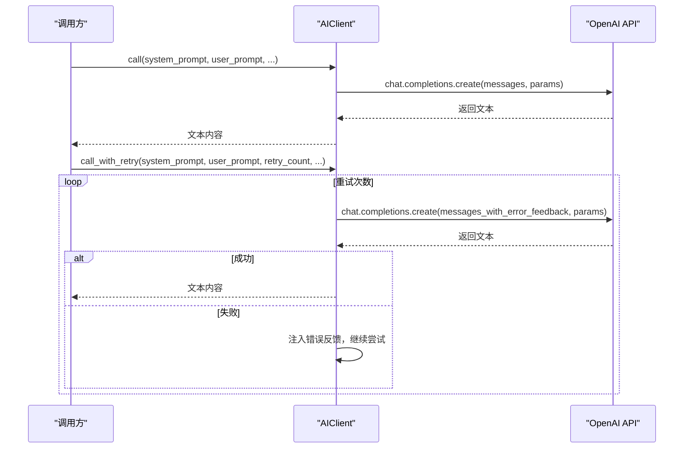
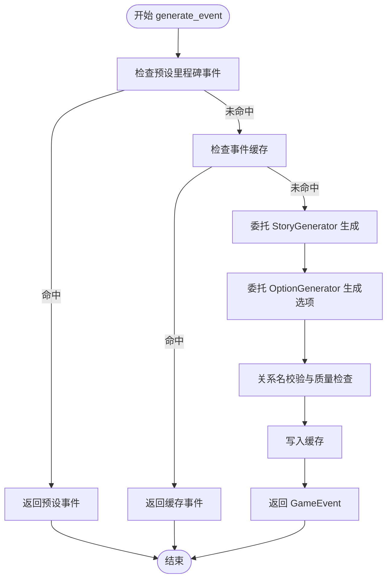
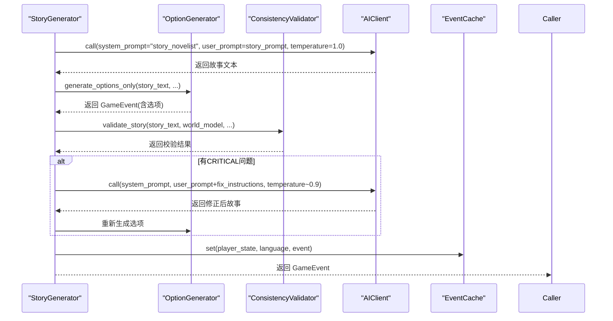
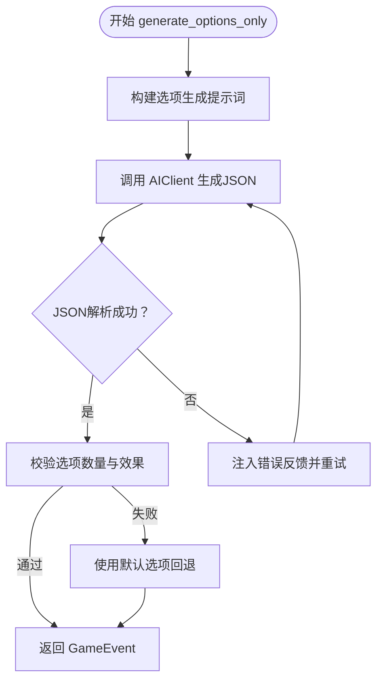
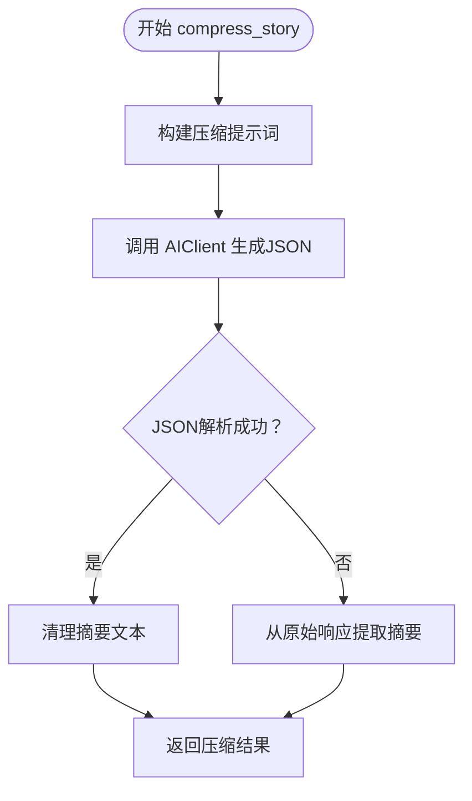
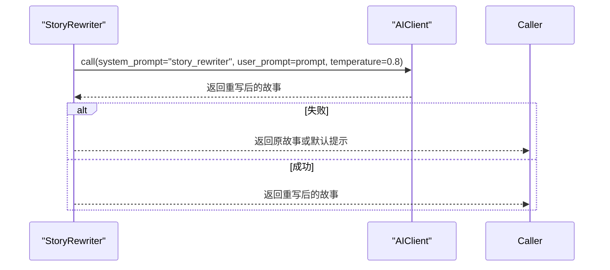
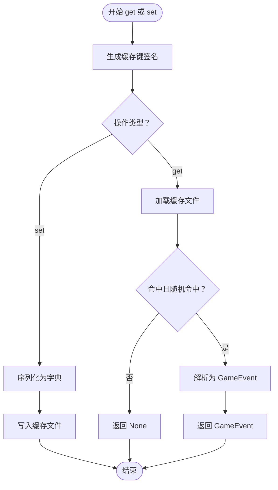
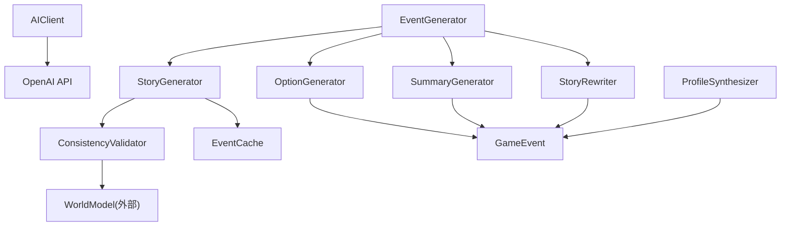

# AI集成系统

<cite>
**本文档引用的文件**
- [src/ai/__init__.py](file://src/ai/__init__.py)
- [src/ai/client.py](file://src/ai/client.py)
- [src/ai/generator.py](file://src/ai/generator.py)
- [src/ai/story_generator.py](file://src/ai/story_generator.py)
- [src/ai/option_generator.py](file://src/ai/option_generator.py)
- [src/ai/summary_generator.py](file://src/ai/summary_generator.py)
- [src/ai/story_rewriter.py](file://src/ai/story_rewriter.py)
- [src/ai/profile_synthesizer.py](file://src/ai/profile_synthesizer.py)
- [src/ai/consistency_validator.py](file://src/ai/consistency_validator.py)
- [src/ai/cache.py](file://src/ai/cache.py)
- [src/ai/models.py](file://src/ai/models.py)
- [src/ai/system_prompts.py](file://src/ai/system_prompts.py)
- [src/ai/utils.py](file://src/ai/utils.py)
- [config/prompts.py](file://config/prompts.py)
- [config/settings.py](file://config/settings.py)
- [data/cache/events_cache.json](file://data/cache/events_cache.json)
</cite>

## 目录
1. [简介](#简介)
2. [项目结构](#项目结构)
3. [核心组件](#核心组件)
4. [架构总览](#架构总览)
5. [详细组件分析](#详细组件分析)
6. [依赖关系分析](#依赖关系分析)
7. [性能考虑](#性能考虑)
8. [故障排除指南](#故障排除指南)
9. [结论](#结论)
10. [附录](#附录)

## 简介
本项目是一个面向人生模拟游戏的AI集成系统，围绕OpenAI API构建了统一的AI调用抽象层，并实现了事件生成器、故事生成器、选项生成器、摘要生成器、故事重写器、角色画像合成器等模块。系统通过集中化的系统提示词注册表、完善的错误处理与重试机制、以及事件级缓存策略，确保生成内容的质量、一致性与性能。

## 项目结构
AI相关代码位于src/ai目录，配置与提示词位于config目录，数据缓存位于data/cache目录。整体采用按职责分层的模块化设计：
- 抽象层：AIClient提供统一的AI调用接口，封装OpenAI SDK调用、流式回调、JSON解析与重试逻辑
- 服务层：EventGenerator作为门面，协调StoryGenerator、OptionGenerator、SummaryGenerator、StoryRewriter等子服务
- 工具层：system_prompts集中管理各类系统提示词；utils提供JSON提取等通用工具；models定义数据结构
- 配置层：settings集中管理API密钥、模型、缓存开关等配置；prompts提供事件生成的模板与上下文拼装

图表来源
- [src/ai/client.py](file://src/ai/client.py#L22-L214)
- [src/ai/generator.py](file://src/ai/generator.py#L30-L407)
- [src/ai/story_generator.py](file://src/ai/story_generator.py#L24-L387)
- [src/ai/option_generator.py](file://src/ai/option_generator.py#L17-L248)
- [src/ai/summary_generator.py](file://src/ai/summary_generator.py#L17-L393)
- [src/ai/story_rewriter.py](file://src/ai/story_rewriter.py#L16-L201)
- [src/ai/profile_synthesizer.py](file://src/ai/profile_synthesizer.py#L16-L85)
- [src/ai/consistency_validator.py](file://src/ai/consistency_validator.py#L42-L231)
- [src/ai/cache.py](file://src/ai/cache.py#L13-L139)
- [src/ai/system_prompts.py](file://src/ai/system_prompts.py#L1-L226)
- [src/ai/utils.py](file://src/ai/utils.py#L10-L77)
- [src/ai/models.py](file://src/ai/models.py#L7-L27)
- [config/prompts.py](file://config/prompts.py#L1-L800)
- [config/settings.py](file://config/settings.py#L30-L100)

章节来源
- [src/ai/__init__.py](file://src/ai/__init__.py#L1-L18)

## 核心组件
- AIClient：统一的AI调用抽象，封装OpenAI SDK调用、流式回调、JSON解析与重试逻辑，支持自定义模型与基础URL
- EventGenerator：门面协调器，负责加载预设事件、缓存、调用StoryGenerator与OptionGenerator等子服务
- StoryGenerator：两阶段流水线的第一阶段，生成纯故事文本，随后调用OptionGenerator生成选项
- OptionGenerator：生成选项并进行关系名校验与事件质量检查
- SummaryGenerator：故事压缩、周/四周期/年总结生成
- StoryRewriter：段落级重写与整段故事再生
- ProfileSynthesizer：基于行为证据合成角色行为画像
- ConsistencyValidator：基于世界模型进行一致性校验
- EventCache：事件级缓存，降低API调用成本
- system_prompts：集中式系统提示词注册表
- utils：JSON提取等通用工具
- models：GameEvent与EventOption数据模型

章节来源
- [src/ai/client.py](file://src/ai/client.py#L22-L214)
- [src/ai/generator.py](file://src/ai/generator.py#L30-L407)
- [src/ai/story_generator.py](file://src/ai/story_generator.py#L24-L387)
- [src/ai/option_generator.py](file://src/ai/option_generator.py#L17-L248)
- [src/ai/summary_generator.py](file://src/ai/summary_generator.py#L17-L393)
- [src/ai/story_rewriter.py](file://src/ai/story_rewriter.py#L16-L201)
- [src/ai/profile_synthesizer.py](file://src/ai/profile_synthesizer.py#L16-L85)
- [src/ai/consistency_validator.py](file://src/ai/consistency_validator.py#L42-L231)
- [src/ai/cache.py](file://src/ai/cache.py#L13-L139)
- [src/ai/system_prompts.py](file://src/ai/system_prompts.py#L1-L226)
- [src/ai/utils.py](file://src/ai/utils.py#L10-L77)
- [src/ai/models.py](file://src/ai/models.py#L7-L27)

## 架构总览
系统采用“抽象层-服务层-工具层-配置层”的分层架构。AIClient作为单一入口，屏蔽底层Provider差异；EventGenerator作为门面协调多个子服务；system_prompts与prompts提供稳定的提示词与上下文；utils与models提供通用能力与数据契约；settings集中管理配置。

```mermaid
classDiagram
class AIClient {
+api_key : str
+model : str
+call(system_prompt, user_prompt, temperature, max_tokens, stream_callback, model) str
+call_json(system_prompt, user_prompt, temperature, max_tokens, model) Dict
+call_with_retry(system_prompt, user_prompt, retry_count, temperature, max_tokens, stream_callback, model, language) str
}
class EventGenerator {
-ai_client : AIClient
-cache : EventCache
+generate_event(player_state, language, retry_count, ...) GameEvent
+generate_round_event(...) GameEvent
+generate_options_only(story_description, player_state, ...) GameEvent
+compress_story(story, choice, language, ...) Dict
+generate_weekly_summary(rounds, character_settings, language, ...) Dict
+generate_four_week_summary(stories, decisions, ...) str
+generate_yearly_summary(four_week_summaries, ...) str
+rewrite_story_segment(full_story, segment, instruction, ...) str
+regenerate_story(player_state, character_settings, story_context, ...) str
}
class StoryGenerator {
+generate_event(player_state, language, retry_count, ...) GameEvent
+generate_round_event(...) GameEvent
-_validate_and_retry_story(story_text, world_model, ...) str
-_get_phase_from_state(player_state) str
}
class OptionGenerator {
+generate_options_only(story_description, player_state, language, retry_count) GameEvent
+validate_and_fix_relationships(event, character_settings) void
+validate_event_quality(event) void
}
class SummaryGenerator {
+compress_story(story, choice, language, ...) Dict
+generate_weekly_summary(rounds, character_settings, language, ...) Dict
+generate_four_week_summary(stories, decisions, language, ...) str
+generate_yearly_summary(four_week_summaries, ...) str
-_clean_summary_text(summary) str
-_extract_summary_from_raw(content, original_story, language) str
}
class StoryRewriter {
+rewrite_story_segment(full_story, segment, instruction, ...) str
+regenerate_story(player_state, character_settings, story_context, ...) str
}
class ProfileSynthesizer {
+synthesize(char_name, traits, evidence, existing_profile, language) Dict
}
class ConsistencyValidator {
+validate_story(story_text, world_model, player_state_dict, character_settings, language) ValidationResult
-_parse_validation_response(response, language, profiled_characters) ValidationResult
}
class EventCache {
+get(player_state, language) GameEvent
+set(player_state, language, event) void
+clear() void
+size() int
}
class GameEvent {
+event_description : str
+options : List[EventOption]
+from_json(json_str) GameEvent
}
class EventOption {
+text : str
+effects : Dict
+likely_choice : bool
}
EventGenerator --> AIClient : "依赖"
StoryGenerator --> AIClient : "依赖"
OptionGenerator --> AIClient : "依赖"
SummaryGenerator --> AIClient : "依赖"
StoryRewriter --> AIClient : "依赖"
ProfileSynthesizer --> AIClient : "依赖"
ConsistencyValidator --> AIClient : "依赖"
EventGenerator --> StoryGenerator : "协调"
EventGenerator --> OptionGenerator : "协调"
EventGenerator --> SummaryGenerator : "协调"
EventGenerator --> StoryRewriter : "协调"
StoryGenerator --> ConsistencyValidator : "使用"
StoryGenerator --> EventCache : "缓存"
EventGenerator --> EventCache : "缓存"
OptionGenerator --> GameEvent : "生成"
SummaryGenerator --> GameEvent : "消费"
StoryRewriter --> GameEvent : "消费"
ProfileSynthesizer --> GameEvent : "消费"
```

图表来源
- [src/ai/client.py](file://src/ai/client.py#L22-L214)
- [src/ai/generator.py](file://src/ai/generator.py#L30-L407)
- [src/ai/story_generator.py](file://src/ai/story_generator.py#L24-L387)
- [src/ai/option_generator.py](file://src/ai/option_generator.py#L17-L248)
- [src/ai/summary_generator.py](file://src/ai/summary_generator.py#L17-L393)
- [src/ai/story_rewriter.py](file://src/ai/story_rewriter.py#L16-L201)
- [src/ai/profile_synthesizer.py](file://src/ai/profile_synthesizer.py#L16-L85)
- [src/ai/consistency_validator.py](file://src/ai/consistency_validator.py#L42-L231)
- [src/ai/cache.py](file://src/ai/cache.py#L13-L139)
- [src/ai/models.py](file://src/ai/models.py#L7-L27)

## 详细组件分析

### AIClient：统一AI调用抽象
- 职责：封装OpenAI SDK调用，提供同步与流式两种调用方式，支持JSON解析与带错误反馈的重试
- 关键特性：
  - call：构造messages并调用chat.completions.create，支持流式回调
  - call_json：在call基础上解析JSON，兼容多种代码块包裹与嵌入格式
  - call_with_retry：在每次重试时将上次错误注入用户提示，帮助模型避免重复错误
- 配置：从settings读取OPENAI_API_KEY、OPENAI_MODEL、OPENAI_BASE_URL

图表来源
- [src/ai/client.py](file://src/ai/client.py#L51-L214)

章节来源
- [src/ai/client.py](file://src/ai/client.py#L22-L214)
- [config/settings.py](file://config/settings.py#L30-L42)

### EventGenerator：事件生成门面
- 职责：对外提供统一接口，内部协调StoryGenerator与OptionGenerator，支持预设事件、缓存与回退
- 关键流程：
  - generate_event：优先检查预设里程碑事件，再检查缓存，最后委托StoryGenerator生成
  - generate_round_event：生成单轮故事与选项
  - generate_options_only：为已有故事生成选项
  - 摘要与重写：压缩故事、生成周/四周期/年总结、重写段落、再生故事
- 向下依赖：AIClient、EventCache、各子生成器

图表来源
- [src/ai/generator.py](file://src/ai/generator.py#L159-L214)
- [src/ai/story_generator.py](file://src/ai/story_generator.py#L32-L175)
- [src/ai/option_generator.py](file://src/ai/option_generator.py#L25-L132)
- [src/ai/cache.py](file://src/ai/cache.py#L78-L128)

章节来源
- [src/ai/generator.py](file://src/ai/generator.py#L30-L407)

### StoryGenerator：故事生成器（两阶段流水线）
- 职责：第一阶段生成纯故事文本，第二阶段委托OptionGenerator生成选项
- 关键特性：
  - 两阶段：先生成故事，再生成选项，确保选项与故事强相关
  - 一致性校验：可选地使用ConsistencyValidator进行CRITICAL级别校验，必要时重试
  - 错误反馈：重试时注入上次错误，提升成功率
  - 缓存：成功生成后写入EventCache
- 参数与温度：故事生成使用较高temperature以增强创造性

图表来源
- [src/ai/story_generator.py](file://src/ai/story_generator.py#L32-L387)
- [src/ai/option_generator.py](file://src/ai/option_generator.py#L25-L132)
- [src/ai/consistency_validator.py](file://src/ai/consistency_validator.py#L60-L231)
- [src/ai/cache.py](file://src/ai/cache.py#L103-L128)

章节来源
- [src/ai/story_generator.py](file://src/ai/story_generator.py#L24-L387)

### OptionGenerator：选项生成器与校验
- 职责：从现有故事生成选项，进行关系名修复与事件质量检查
- 关键特性：
  - JSON提取：使用utils.extract_json从AI响应中提取结构化选项
  - 关系名修复：确保选项中的关系名来自角色设定的key_people列表，支持大小写与角色身份匹配
  - 质量检查：确保至少两个选项、动作点存在、效果数值合理、存在真实权衡
  - 回退策略：若多次失败，返回默认选项集合

图表来源
- [src/ai/option_generator.py](file://src/ai/option_generator.py#L25-L132)
- [src/ai/utils.py](file://src/ai/utils.py#L10-L77)

章节来源
- [src/ai/option_generator.py](file://src/ai/option_generator.py#L17-L248)

### SummaryGenerator：摘要生成器
- 职责：压缩长故事、生成周/四周期/年总结
- 关键特性：
  - 压缩：返回summary与storyline_updates、fact_updates、event_concluded、foreshadowing_seeds、habit_updates
  - 周/四周期/年总结：返回结构化JSON或纯文本摘要
  - 安全清理：提供_clean_summary_text与_extract_summary_from_raw两层清理策略，保证输出整洁

图表来源
- [src/ai/summary_generator.py](file://src/ai/summary_generator.py#L25-L125)
- [src/ai/utils.py](file://src/ai/utils.py#L10-L77)

章节来源
- [src/ai/summary_generator.py](file://src/ai/summary_generator.py#L17-L393)

### StoryRewriter：故事重写器
- 职责：支持段落级重写与整段故事再生
- 关键特性：
  - 段落重写：接收完整故事、待替换段落与用户指令，返回重写后的完整故事
  - 整段再生：基于玩家状态与先前故事上下文，生成全新故事
  - 回退策略：失败时返回原故事或默认提示

图表来源
- [src/ai/story_rewriter.py](file://src/ai/story_rewriter.py#L24-L117)

章节来源
- [src/ai/story_rewriter.py](file://src/ai/story_rewriter.py#L16-L201)

### ProfileSynthesizer：角色画像合成器
- 职责：基于行为证据与既有画像，合成角色行为特征、言谈风格、决策模式、情感倾向与行为边界
- 关键特性：
  - 使用较低temperature以稳定输出
  - 将证据计数累加，便于追踪画像演化

章节来源
- [src/ai/profile_synthesizer.py](file://src/ai/profile_synthesizer.py#L16-L85)

### ConsistencyValidator：一致性校验器
- 职责：基于世界模型约束，检查故事在地理、职业、个性、时间、承诺、因果六个维度上的一致性
- 关键特性：
  - 解析AI响应为ValidationResult，支持CRITICAL与WARNING两类问题
  - 对涉及已建立行为画像的角色，个性问题自动升级为CRITICAL
  - 生成修复指令，用于重试时注入到用户提示

章节来源
- [src/ai/consistency_validator.py](file://src/ai/consistency_validator.py#L42-L231)

### EventCache：事件缓存
- 职责：基于玩家状态签名缓存GameEvent，减少重复API调用
- 关键特性：
  - 签名：包含年龄、能量、情绪、知识、财富、周数、决策历史长度与语言，对连续值做分档以降低抖动
  - 命中策略：随机30%概率命中，保证多样性
  - 持久化：事件序列化为JSON写入data/cache/events_cache.json

图表来源
- [src/ai/cache.py](file://src/ai/cache.py#L47-L139)
- [data/cache/events_cache.json](file://data/cache/events_cache.json)

章节来源
- [src/ai/cache.py](file://src/ai/cache.py#L13-L139)

### system_prompts：系统提示词注册表
- 职责：集中管理各类系统提示词，确保KV缓存稳定性与跨调用一致性
- 覆盖范围：故事作家、选项生成器、摘要压缩、周/四周期/年总结、故事续写、故事重写、一致性校验、故事分析、画像合成等

章节来源
- [src/ai/system_prompts.py](file://src/ai/system_prompts.py#L1-L226)

### utils：通用工具
- extract_json：从AI响应中提取JSON，兼容多种包裹与嵌入格式

章节来源
- [src/ai/utils.py](file://src/ai/utils.py#L10-L77)

### models：数据模型
- GameEvent：事件描述与选项列表
- EventOption：选项文本、效果字典与倾向标记

章节来源
- [src/ai/models.py](file://src/ai/models.py#L7-L27)

## 依赖关系分析
- 组件耦合：EventGenerator聚合多个子服务，降低对外部调用方的复杂度
- 依赖方向：子服务均依赖AIClient，避免直接依赖OpenAI SDK
- 循环依赖：未见循环依赖，模块职责清晰
- 外部依赖：OpenAI API、文件系统（缓存）、环境变量（配置）

图表来源
- [src/ai/client.py](file://src/ai/client.py#L14-L47)
- [src/ai/generator.py](file://src/ai/generator.py#L62-L65)
- [src/ai/story_generator.py](file://src/ai/story_generator.py#L27-L28)
- [src/ai/option_generator.py](file://src/ai/option_generator.py#L21)
- [src/ai/summary_generator.py](file://src/ai/summary_generator.py#L21)
- [src/ai/story_rewriter.py](file://src/ai/story_rewriter.py#L20)
- [src/ai/profile_synthesizer.py](file://src/ai/profile_synthesizer.py#L20)
- [src/ai/consistency_validator.py](file://src/ai/consistency_validator.py#L51)

章节来源
- [src/ai/generator.py](file://src/ai/generator.py#L62-L65)
- [src/ai/story_generator.py](file://src/ai/story_generator.py#L27-L28)
- [src/ai/option_generator.py](file://src/ai/option_generator.py#L21)
- [src/ai/summary_generator.py](file://src/ai/summary_generator.py#L21)
- [src/ai/story_rewriter.py](file://src/ai/story_rewriter.py#L20)
- [src/ai/profile_synthesizer.py](file://src/ai/profile_synthesizer.py#L20)
- [src/ai/consistency_validator.py](file://src/ai/consistency_validator.py#L51)

## 性能考虑
- 缓存策略：EventCache对玩家状态签名进行缓存，随机30%命中率平衡稳定性与多样性，显著降低API调用次数
- 提示词稳定性：system_prompts集中管理，相同提示词可获得KV缓存收益，减少LLM侧token消耗
- 流式输出：AIClient支持流式回调，UI可渐进展示，改善用户体验
- 重试与回退：call_with_retry与各生成器的回退策略，提高成功率并减少失败重试成本
- 温度与令牌：不同阶段采用不同temperature与max_tokens，平衡创造性与可控性

[本节为一般性指导，无需特定文件分析]

## 故障排除指南
- API密钥缺失：settings校验OPENAI_API_KEY，缺失时抛出异常
- 重试失败：call_with_retry最多重试指定次数，最终仍失败时抛出异常
- JSON解析失败：utils.extract_json提供多策略提取，失败时记录告警
- 一致性校验失败：ConsistencyValidator在解析失败时回退为通过，不影响主流程
- 缓存读写失败：EventCache在加载/保存失败时记录告警并降级

章节来源
- [config/settings.py](file://config/settings.py#L84-L90)
- [src/ai/client.py](file://src/ai/client.py#L140-L214)
- [src/ai/utils.py](file://src/ai/utils.py#L10-L77)
- [src/ai/consistency_validator.py](file://src/ai/consistency_validator.py#L114-L117)
- [src/ai/cache.py](file://src/ai/cache.py#L29-L45)

## 结论
该AI集成系统通过统一的AIClient抽象、模块化的服务层、集中的提示词与缓存策略，实现了高质量、可扩展、可维护的事件生成与故事编排能力。系统在错误处理、重试与一致性校验方面具备稳健设计，适合在生产环境中持续演进与扩展。

[本节为总结性内容，无需特定文件分析]

## 附录

### 系统提示词设计思路
- 明确角色定位：故事作家、选项生成器、摘要压缩、一致性校验等角色职责清晰
- 语言一致性：同一功能在中英文场景下保持一致的约束与输出格式
- KV缓存友好：提示词稳定不变，利于LLM侧KV缓存命中

章节来源
- [src/ai/system_prompts.py](file://src/ai/system_prompts.py#L1-L226)

### 参数配置
- OPENAI_API_KEY：必填，从环境变量读取
- OPENAI_MODEL：默认模型名称
- OPENAI_BASE_URL：可选，支持自定义代理或兼容服务
- CACHE_EVENTS：是否启用事件缓存
- DEFAULT_LANGUAGE：默认语言

章节来源
- [config/settings.py](file://config/settings.py#L30-L42)

### 扩展与替换大模型服务
- 替换路径：只需实现与AIClient相同的接口（call、call_json、call_with_retry），即可无缝替换底层Provider
- 接口契约：messages构造、流式回调、JSON解析与重试逻辑保持一致

章节来源
- [src/ai/client.py](file://src/ai/client.py#L22-L214)