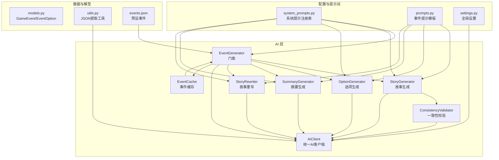
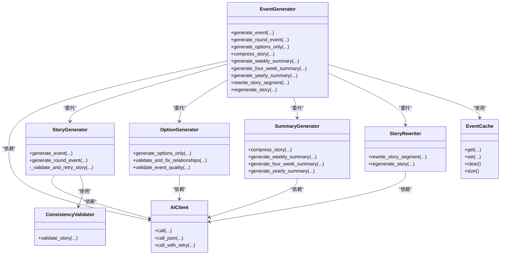

# 事件生成系统

<cite>
**本文档引用的文件**
- [src/ai/generator.py](file://src/ai/generator.py)
- [src/ai/system_prompts.py](file://src/ai/system_prompts.py)
- [src/ai/consistency_validator.py](file://src/ai/consistency_validator.py)
- [src/ai/models.py](file://src/ai/models.py)
- [src/ai/client.py](file://src/ai/client.py)
- [src/ai/story_generator.py](file://src/ai/story_generator.py)
- [src/ai/option_generator.py](file://src/ai/option_generator.py)
- [src/ai/summary_generator.py](file://src/ai/summary_generator.py)
- [src/ai/story_rewriter.py](file://src/ai/story_rewriter.py)
- [config/prompts.py](file://config/prompts.py)
- [config/settings.py](file://config/settings.py)
- [src/ai/cache.py](file://src/ai/cache.py)
- [src/ai/utils.py](file://src/ai/utils.py)
- [data/presets/events.json](file://data/presets/events.json)
- [tests/test_events.py](file://tests/test_events.py)
</cite>

## 目录
1. [简介](#简介)
2. [项目结构](#项目结构)
3. [核心组件](#核心组件)
4. [架构总览](#架构总览)
5. [详细组件分析](#详细组件分析)
6. [依赖关系分析](#依赖关系分析)
7. [性能考虑](#性能考虑)
8. [故障排除指南](#故障排除指南)
9. [结论](#结论)
10. [附录](#附录)

## 简介
本文件面向事件生成系统的开发者与维护者，系统性阐述基于门面模式的 EventGenerator 设计理念与实现架构，覆盖从系统提示词构建、LLM 调用、结果解析与验证，到一致性校验与故事连贯性检查的完整流程。文档还解释事件类型的分类体系与生成规则、事件质量评估标准与人工审核流程、性能监控与错误处理重试机制，以及如何自定义事件模板与扩展事件类型。

## 项目结构
事件生成系统采用模块化分层设计，核心位于 src/ai 目录，配置与提示词位于 config 目录，测试位于 tests 目录，预设事件位于 data/presets 目录。整体结构如下：



图表来源
- [src/ai/generator.py](file://src/ai/generator.py#L30-L66)
- [src/ai/story_generator.py](file://src/ai/story_generator.py#L24-L28)
- [src/ai/option_generator.py](file://src/ai/option_generator.py#L17-L21)
- [src/ai/summary_generator.py](file://src/ai/summary_generator.py#L17-L21)
- [src/ai/story_rewriter.py](file://src/ai/story_rewriter.py#L16-L20)
- [src/ai/consistency_validator.py](file://src/ai/consistency_validator.py#L42-L58)
- [src/ai/client.py](file://src/ai/client.py#L22-L47)
- [src/ai/cache.py](file://src/ai/cache.py#L13-L26)
- [src/ai/system_prompts.py](file://src/ai/system_prompts.py#L196-L226)
- [config/prompts.py](file://config/prompts.py#L674-L712)
- [config/settings.py](file://config/settings.py#L30-L100)
- [src/ai/models.py](file://src/ai/models.py#L7-L27)
- [src/ai/utils.py](file://src/ai/utils.py#L10-L77)
- [data/presets/events.json](file://data/presets/events.json#L1-L239)

章节来源
- [src/ai/generator.py](file://src/ai/generator.py#L30-L66)
- [config/settings.py](file://config/settings.py#L13-L100)

## 核心组件
- EventGenerator（门面）：对外暴露统一接口，内部委托给 StoryGenerator、OptionGenerator、SummaryGenerator、StoryRewriter 等子服务；集中管理缓存与 AIClient。
- AIClient：统一的 LLM 调用抽象层，封装 OpenAI SDK，提供普通文本生成、JSON 解析与带错误反馈的重试机制。
- StoryGenerator：两阶段流水线第一步，负责故事文本生成；支持一致性校验与自动重试；负责派生选项生成。
- OptionGenerator：两阶段流水线第二步，基于已有故事生成选项；进行关系名校验与修复、事件质量检查。
- ConsistencyValidator：基于二次 LLM 调用的跨维度一致性校验（地理、职业、个性、时间、承诺、因果）。
- SummaryGenerator：故事压缩、周/四周期/年总结生成。
- StoryRewriter：段落级重写与整段重生成。
- EventCache：基于玩家状态签名的事件缓存，降低重复调用成本。
- system_prompts.py：系统提示词注册表，保证 KV 缓存前缀稳定与跨调用一致性。
- prompts.py：事件生成提示模板工厂，动态拼装上下文（时间、人物、剧情线、世界事实、伏笔等）。
- models.py：GameEvent/EventOption 数据模型与校验。
- utils.py：JSON 提取工具，兼容多种模型输出包裹形式。

章节来源
- [src/ai/generator.py](file://src/ai/generator.py#L30-L66)
- [src/ai/client.py](file://src/ai/client.py#L22-L105)
- [src/ai/story_generator.py](file://src/ai/story_generator.py#L24-L86)
- [src/ai/option_generator.py](file://src/ai/option_generator.py#L17-L133)
- [src/ai/consistency_validator.py](file://src/ai/consistency_validator.py#L42-L118)
- [src/ai/summary_generator.py](file://src/ai/summary_generator.py#L17-L141)
- [src/ai/story_rewriter.py](file://src/ai/story_rewriter.py#L16-L127)
- [src/ai/cache.py](file://src/ai/cache.py#L13-L139)
- [src/ai/system_prompts.py](file://src/ai/system_prompts.py#L196-L226)
- [config/prompts.py](file://config/prompts.py#L674-L712)
- [src/ai/models.py](file://src/ai/models.py#L7-L27)
- [src/ai/utils.py](file://src/ai/utils.py#L10-L77)

## 架构总览
事件生成系统采用门面模式，EventGenerator 作为统一入口，协调各子服务完成“故事生成 + 选项生成 + 一致性校验”的闭环。系统提示词集中管理，确保跨调用稳定性；提示模板工厂按上下文动态组装；缓存与重试策略提升性能与鲁棒性。

```mermaid
sequenceDiagram
participant Caller as "调用方"
participant Gen as "EventGenerator"
participant Cache as "EventCache"
participant Story as "StoryGenerator"
participant Opt as "OptionGenerator"
participant AI as "AIClient"
participant CV as "ConsistencyValidator"
Caller->>Gen : "generate_event(player_state, ...)"
Gen->>Cache : "get(player_state, language)"
alt 命中缓存
Cache-->>Gen : "GameEvent"
Gen-->>Caller : "返回缓存事件"
else 未命中缓存
Gen->>Story : "generate_event(...)"
Story->>AI : "call(system_prompt, user_prompt)"
AI-->>Story : "故事文本"
Story->>Opt : "generate_options_only(story)"
Opt->>AI : "call_json(system_prompt, user_prompt)"
AI-->>Opt : "JSON 选项"
Opt-->>Story : "GameEvent"
Story->>CV : "validate_story(story, world_model)"
CV-->>Story : "ValidationResult"
alt 有严重问题
Story->>AI : "call_with_retry(附加修正要求)"
AI-->>Story : "修正后故事"
end
Story-->>Gen : "GameEvent"
Gen->>Cache : "set(player_state, language, event)"
Gen-->>Caller : "返回事件"
end
```

图表来源
- [src/ai/generator.py](file://src/ai/generator.py#L183-L238)
- [src/ai/cache.py](file://src/ai/cache.py#L78-L101)
- [src/ai/story_generator.py](file://src/ai/story_generator.py#L32-L175)
- [src/ai/option_generator.py](file://src/ai/option_generator.py#L25-L132)
- [src/ai/consistency_validator.py](file://src/ai/consistency_validator.py#L60-L117)
- [src/ai/client.py](file://src/ai/client.py#L140-L213)

## 详细组件分析

### EventGenerator（门面模式）
- 职责：统一对外接口，维持向后兼容；聚合子服务；管理缓存与 AIClient。
- 关键方法：
  - generate_event：主流程入口，先查预设/缓存，再委托 StoryGenerator；必要时写入缓存。
  - generate_round_event：单轮事件生成，支持世界模型一致性校验与自动重试。
  - generate_options_only：仅生成选项（用于已有故事）。
  - compress_story / generate_weekly_summary / generate_four_week_summary / generate_yearly_summary：摘要与总结。
  - rewrite_story_segment / regenerate_story：段落重写与整段重生成。
- 向后兼容：保留旧版调用风格，新增 call_with_retry/call_json 等能力。

章节来源
- [src/ai/generator.py](file://src/ai/generator.py#L30-L66)
- [src/ai/generator.py](file://src/ai/generator.py#L183-L431)

### AIClient（统一AI客户端）
- 职责：封装 OpenAI SDK，提供统一调用、流式回调、JSON 解析与带错误反馈的重试。
- 关键能力：
  - call：支持流式与非流式两种模式。
  - call_json：自动提取 JSON。
  - call_with_retry：多轮重试，将上次错误反馈注入提示词，帮助模型避免重复错误。

章节来源
- [src/ai/client.py](file://src/ai/client.py#L22-L214)

### StoryGenerator（故事生成）
- 两阶段流水线：
  - 第一阶段：生成纯故事文本（novelist 系统提示）。
  - 第二阶段：基于故事生成选项（option_generator 系统提示）。
- 一致性校验与重试：若提供 world_model，对生成故事进行一致性校验；仅当出现严重问题时触发一次重试，将修正要求注入提示词。
- 关键辅助：从玩家状态推断生命阶段，用于提示词与生成策略。

章节来源
- [src/ai/story_generator.py](file://src/ai/story_generator.py#L24-L387)

### OptionGenerator（选项生成与校验）
- 生成：基于现有故事生成选项，限制为 2-4 个，要求输出 JSON。
- 校验与修复：
  - 关系名校验与修复：确保选项 effects 中的关系名来自角色设定的 key_people 列表，支持大小写与角色身份模糊匹配。
  - 事件质量检查：确保每个选项都有 effects，至少有一个选项具备行动点消耗，避免“无取舍”。
- 失败回退：若多次尝试失败，返回默认选项集合。

章节来源
- [src/ai/option_generator.py](file://src/ai/option_generator.py#L17-L248)

### ConsistencyValidator（一致性校验）
- 维度：地理、职业、个性、时间、承诺、因果。
- 流程：构造校验提示词（包含世界模型约束与角色设定），调用 LLM 获取 JSON 结果；解析为 ValidationResult。
- 升级策略：若涉及“已建立行为画像”的人物，个性问题从 WARNING 升级为 CRITICAL。
- 修正注入：将严重问题的修正要求拼接到提示词中，触发 StoryGenerator 的自动重试。

章节来源
- [src/ai/consistency_validator.py](file://src/ai/consistency_validator.py#L42-L231)

### SummaryGenerator（摘要与总结）
- 压缩：将完整故事压缩为 500 字以内摘要，同时评估剧情线状态、事实更新、事件是否完结、伏笔种子、习惯变更。
- 周/四周期/年总结：生成周/四周期/年总结，带奖励效果。
- 容错：JSON 解析失败时，尝试从原始响应中提取摘要文本，最后回退为截断。

章节来源
- [src/ai/summary_generator.py](file://src/ai/summary_generator.py#L17-L429)

### StoryRewriter（故事重写）
- 段落重写：根据用户指令重写指定段落，保持与前后文的逻辑一致性与角色设定一致。
- 全段重生成：基于上下文生成全新故事，确保与之前的故事保持逻辑一致性。

章节来源
- [src/ai/story_rewriter.py](file://src/ai/story_rewriter.py#L16-L201)

### EventCache（事件缓存）
- 策略：基于玩家状态签名（年龄、资源、周数、决策数量等）生成哈希键，30% 概率命中缓存。
- 持久化：事件序列化为字典后保存至 events_cache.json。
- 清理：支持清空缓存与统计容量。

章节来源
- [src/ai/cache.py](file://src/ai/cache.py#L13-L139)

### system_prompts.py（系统提示注册表）
- 价值：KV 缓存前缀稳定、统一审计与维护、跨调用一致行为。
- 覆盖：故事生成、选项生成、压缩、周/四周期/年总结、续写、重写、一致性校验、故事分析、人物画像合成、自定义选择模板等。

章节来源
- [src/ai/system_prompts.py](file://src/ai/system_prompts.py#L1-L226)

### prompts.py（提示模板工厂）
- 动态拼装：时间上下文、可用人物列表、未完结剧情线、世界事实、逻辑约束、人物习惯、伏笔回响、决策历史等。
- 英汉双语：根据语言参数返回对应提示词。
- 生成入口：get_event_generation_prompt、get_options_only_prompt、get_story_compression_prompt、get_weekly_summary_prompt、get_four_week_summary_prompt、get_yearly_summary_prompt、get_round_event_prompt。

章节来源
- [config/prompts.py](file://config/prompts.py#L1-L800)

### models.py（数据模型）
- GameEvent：事件描述 + 选项列表（2-4 个）。
- EventOption：选项文本、效果映射、是否倾向选择。
- from_json：从 JSON 字符串创建对象，异常时抛出清晰错误。

章节来源
- [src/ai/models.py](file://src/ai/models.py#L7-L27)

### utils.py（工具函数）
- extract_json：从可能包含非 JSON 文本的响应中提取 JSON 对象，兼容多种包裹形式与嵌入模式。

章节来源
- [src/ai/utils.py](file://src/ai/utils.py#L10-L77)

### 预设事件（events.json）
- 周里程碑事件：在特定周提供固定事件与选项，优先于常规生成。
- 特殊事件：额外的特殊事件模板，可用于随机触发。

章节来源
- [data/presets/events.json](file://data/presets/events.json#L1-L239)

## 依赖关系分析



图表来源
- [src/ai/generator.py](file://src/ai/generator.py#L30-L66)
- [src/ai/story_generator.py](file://src/ai/story_generator.py#L24-L28)
- [src/ai/option_generator.py](file://src/ai/option_generator.py#L17-L21)
- [src/ai/summary_generator.py](file://src/ai/summary_generator.py#L17-L21)
- [src/ai/story_rewriter.py](file://src/ai/story_rewriter.py#L16-L20)
- [src/ai/consistency_validator.py](file://src/ai/consistency_validator.py#L42-L58)
- [src/ai/client.py](file://src/ai/client.py#L22-L47)
- [src/ai/cache.py](file://src/ai/cache.py#L13-L26)

## 性能考虑
- 缓存策略：EventCache 使用状态签名与概率命中，显著减少重复调用；缓存文件持久化，重启后可复用。
- 提示词稳定性：system_prompts 注册表确保相同提示词命中 KV 缓存，降低 Token 成本。
- 重试与容错：AIClient 的 call_with_retry 将错误反馈注入提示词，提高成功率；各生成器均内置 JSON 解析与回退策略。
- 流式输出：AIClient 支持流式回调，改善前端交互体验。
- 令牌上限：各生成器设置合理的 max_tokens，避免超长输出带来的成本与延迟。

章节来源
- [src/ai/cache.py](file://src/ai/cache.py#L78-L101)
- [src/ai/client.py](file://src/ai/client.py#L140-L213)
- [src/ai/system_prompts.py](file://src/ai/system_prompts.py#L1-L11)
- [src/ai/summary_generator.py](file://src/ai/summary_generator.py#L25-L141)

## 故障排除指南
- JSON 解析失败：
  - 现象：选项生成或摘要生成返回无效 JSON。
  - 处理：使用 extract_json 的多策略提取；必要时回退为截断或默认选项。
- 一致性校验失败：
  - 现象：ConsistencyValidator 报告严重问题。
  - 处理：StoryGenerator 自动追加修正要求并重试一次；若仍失败，保留原故事并记录日志。
- API 调用异常：
  - 现象：网络波动或模型返回异常。
  - 处理：AIClient 的 call_with_retry 进行多轮重试，并注入错误反馈；超过重试次数抛出明确错误。
- 关系名不匹配：
  - 现象：选项 effects 中的关系名不在角色设定列表内。
  - 处理：OptionGenerator 进行大小写与角色身份模糊匹配修复；无法匹配时使用首个有效名称回退。
- 缓存异常：
  - 现象：缓存文件损坏或解析失败。
  - 处理：EventCache 记录警告并忽略该条目；可执行 clear 清空缓存。

章节来源
- [src/ai/utils.py](file://src/ai/utils.py#L10-L77)
- [src/ai/consistency_validator.py](file://src/ai/consistency_validator.py#L114-L231)
- [src/ai/client.py](file://src/ai/client.py#L140-L213)
- [src/ai/option_generator.py](file://src/ai/option_generator.py#L136-L209)
- [src/ai/cache.py](file://src/ai/cache.py#L28-L46)

## 结论
事件生成系统通过门面模式将复杂流程封装为简洁接口，结合统一的系统提示词、动态提示模板工厂、一致性校验与缓存重试机制，在保证生成质量的同时兼顾性能与可维护性。该架构便于扩展新事件类型、定制模板与接入新的世界模型约束，适合长期演进与规模化应用。

## 附录

### 事件类型分类与生成规则
- 分类体系：
  - 周里程碑事件：固定周数触发，优先于常规生成。
  - 特殊事件：随机触发，涵盖继承、健康危机等情境。
- 生成规则：
  - 事件必须与角色设定高度相关（时代、身份、家庭背景、个性）。
  - 事件需与至少两个状态值（能量、情绪、知识、财富、关系）产生关联。
  - 选项数量 2-4 个，呈现真实取舍，避免明显优劣。
  - 人物必须来自“可用人物列表”，关系效果必须在列表中。

章节来源
- [data/presets/events.json](file://data/presets/events.json#L1-L239)
- [config/prompts.py](file://config/prompts.py#L674-L800)

### 事件质量评估标准
- 选项完整性：每个选项必须包含 effects 映射，默认补全行动点消耗。
- 取舍合理性：各选项在能量、情绪、知识、财富上的总贡献差异应足够明显。
- 数值合理性：对异常大数值进行警告，防止极端效果。
- 关系一致性：仅允许使用角色设定中的有效姓名或角色身份模糊匹配。

章节来源
- [src/ai/option_generator.py](file://src/ai/option_generator.py#L210-L248)

### 人工审核流程建议
- 审核节点：一致性校验报告严重问题时、摘要生成缺失关键字段时、关系名修复后。
- 审核内容：逻辑一致性、人物行为一致性、取舍平衡、语言表达与文化适配。
- 审核工具：利用 ConsistencyValidator 的 ValidationResult 与 SummaryGenerator 的返回字段辅助判断。

章节来源
- [src/ai/consistency_validator.py](file://src/ai/consistency_validator.py#L60-L118)
- [src/ai/summary_generator.py](file://src/ai/summary_generator.py#L25-L141)

### 性能监控与错误处理重试机制
- 监控指标：API 调用次数、平均响应时间、缓存命中率、一致性校验通过率、JSON 解析成功率。
- 错误处理：AIClient 的 call_with_retry 在多轮失败后抛出明确错误；各生成器在关键步骤记录警告与错误日志。
- 重试策略：仅在严重一致性问题触发一次自动重试；选项生成与摘要生成在 JSON 解析失败时进行回退。

章节来源
- [src/ai/client.py](file://src/ai/client.py#L140-L213)
- [src/ai/summary_generator.py](file://src/ai/summary_generator.py#L25-L141)
- [src/ai/consistency_validator.py](file://src/ai/consistency_validator.py#L320-L373)

### 自定义事件模板与扩展事件类型
- 自定义模板：
  - 新增系统提示：在 system_prompts.py 中添加新键与提示词，遵循现有语言规范。
  - 扩展提示模板：在 prompts.py 中新增模板函数，按需拼装上下文。
- 扩展事件类型：
  - 预设事件：在 events.json 中添加新的里程碑或特殊事件条目。
  - 动态事件：通过 EventGenerator 的 preset 与 cache 机制无缝集成。
- 最佳实践：
  - 保持系统提示词键名稳定，避免破坏 KV 缓存。
  - 为新模板提供清晰的 JSON 输出约束与示例。
  - 为新事件类型设计合理的选项取舍与状态影响范围。

章节来源
- [src/ai/system_prompts.py](file://src/ai/system_prompts.py#L196-L226)
- [config/prompts.py](file://config/prompts.py#L674-L712)
- [data/presets/events.json](file://data/presets/events.json#L1-L239)