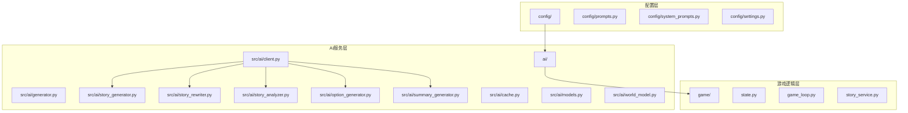
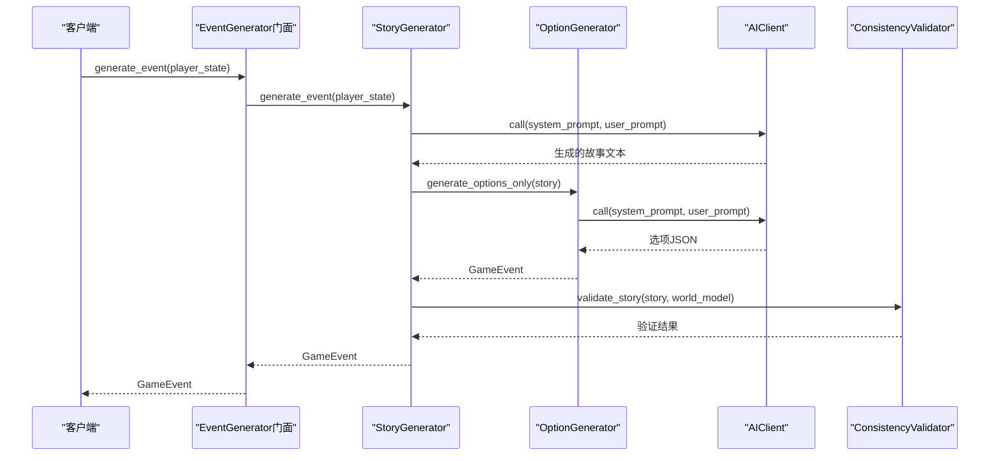
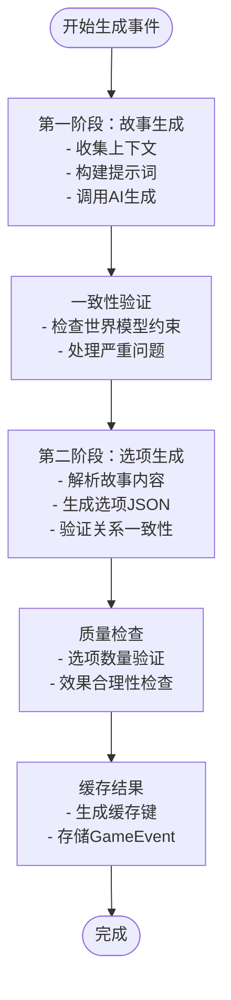
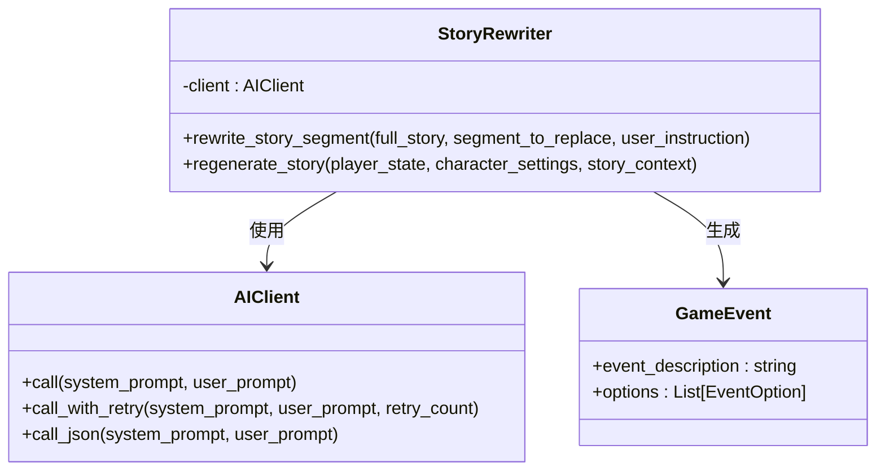
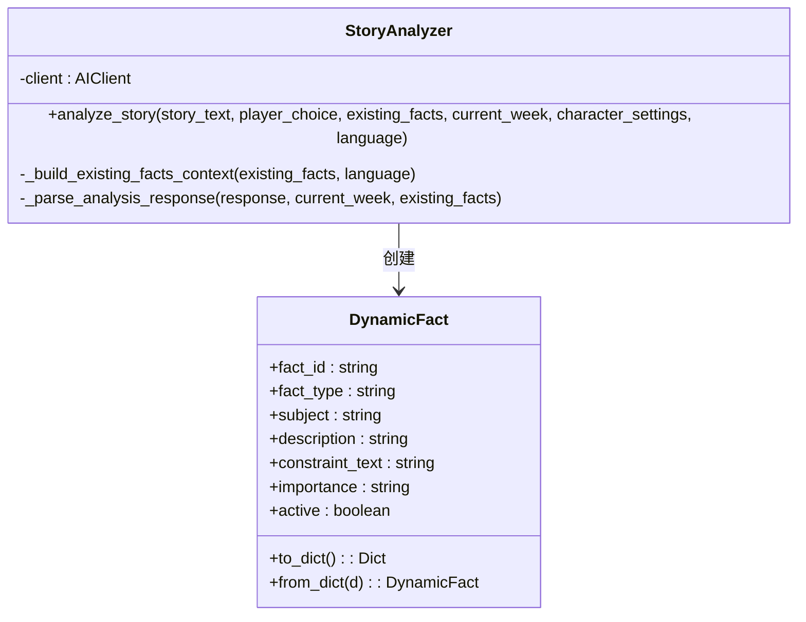
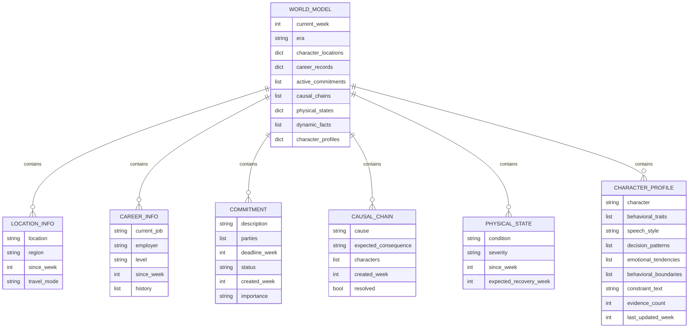
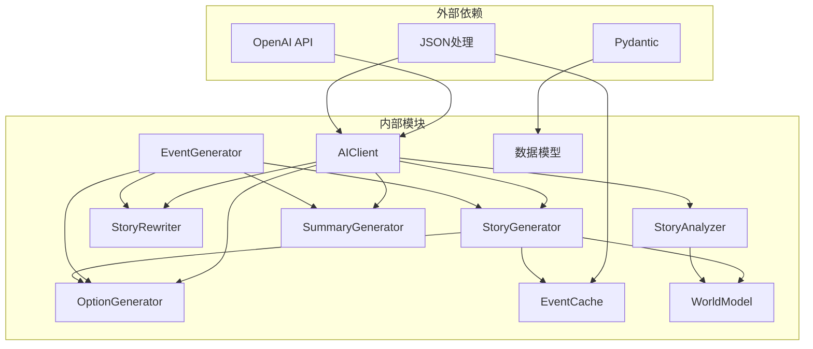

# 故事生成系统

<cite>
**本文档引用的文件**
- [README.md](file://README.md)
- [config/settings.py](file://config/settings.py)
- [config/prompts.py](file://config/prompts.py)
- [config/system_prompts.py](file://config/system_prompts.py)
- [src/ai/client.py](file://src/ai/client.py)
- [src/ai/models.py](file://src/ai/models.py)
- [src/ai/cache.py](file://src/ai/cache.py)
- [src/ai/generator.py](file://src/ai/generator.py)
- [src/ai/story_generator.py](file://src/ai/story_generator.py)
- [src/ai/story_rewriter.py](file://src/ai/story_rewriter.py)
- [src/ai/story_analyzer.py](file://src/ai/story_analyzer.py)
- [src/ai/option_generator.py](file://src/ai/option_generator.py)
- [src/ai/summary_generator.py](file://src/ai/summary_generator.py)
- [src/ai/world_model.py](file://src/ai/world_model.py)
</cite>

## 目录
1. [简介](#简介)
2. [项目结构](#项目结构)
3. [核心组件](#核心组件)
4. [架构概览](#架构概览)
5. [详细组件分析](#详细组件分析)
6. [依赖关系分析](#依赖关系分析)
7. [性能考虑](#性能考虑)
8. [故障排除指南](#故障排除指南)
9. [结论](#结论)
10. [附录](#附录)

## 简介

故事生成系统是一个基于AI的文本生成引擎，专为人生模拟游戏设计。该系统通过两阶段管道实现高质量的故事文本生成，结合智能重写优化、动态事实提取和世界模型一致性验证，为用户提供沉浸式的故事体验。

系统的核心特性包括：
- **双阶段故事生成**：先生成纯文本故事，再生成选项
- **智能重写优化**：支持段落级重写和全文再生
- **动态事实提取**：AI自主识别关键事实并建立约束
- **世界模型一致性**：多维度约束验证确保故事连贯性
- **多语言支持**：中英文双语故事生成
- **缓存优化**：智能事件缓存减少API调用

## 项目结构

项目采用模块化架构，按功能域组织代码：

**图表来源**
- [config/prompts.py](file://config/prompts.py#L1-L800)
- [src/ai/client.py](file://src/ai/client.py#L1-L214)
- [src/ai/generator.py](file://src/ai/generator.py#L1-L431)

**章节来源**
- [README.md](file://README.md#L61-L73)
- [config/settings.py](file://config/settings.py#L1-L100)

## 核心组件

### AI客户端抽象层
统一的AI调用接口，提供：
- 标准化的聊天补全调用
- JSON解析和错误处理
- 重试机制和错误反馈注入
- 流式回调支持

### 事件生成器门面
事件生成器作为门面模式实现，协调多个专门服务：
- StoryGenerator：故事文本生成
- OptionGenerator：选项生成和验证
- SummaryGenerator：故事压缩和摘要生成
- StoryRewriter：故事重写优化

### 缓存系统
智能事件缓存机制：
- 基于玩家状态签名的缓存键生成
- MD5哈希确保唯一性
- 随机缓存命中率避免重复
- 文件持久化存储

**章节来源**
- [src/ai/client.py](file://src/ai/client.py#L22-L214)
- [src/ai/generator.py](file://src/ai/generator.py#L30-L130)
- [src/ai/cache.py](file://src/ai/cache.py#L13-L139)

## 架构概览

系统采用分层架构，通过门面模式简化对外接口：

**图表来源**
- [src/ai/generator.py](file://src/ai/generator.py#L183-L280)
- [src/ai/story_generator.py](file://src/ai/story_generator.py#L32-L175)
- [src/ai/option_generator.py](file://src/ai/option_generator.py#L25-L132)

## 详细组件分析

### StoryGenerator：故事生成器

StoryGenerator实现了两阶段故事生成管道：

#### 第一阶段：故事文本生成
- 基于玩家状态和上下文生成纯文本故事
- 支持流式输出和错误重试
- 自动推断生命阶段（青年、建立、成长、巩固）

#### 第二阶段：选项生成
- 基于生成的故事内容创建相关选项
- 验证关系名称一致性
- 执行事件质量检查

**图表来源**
- [src/ai/story_generator.py](file://src/ai/story_generator.py#L32-L175)
- [src/ai/option_generator.py](file://src/ai/option_generator.py#L25-L132)

**章节来源**
- [src/ai/story_generator.py](file://src/ai/story_generator.py#L24-L175)
- [src/ai/option_generator.py](file://src/ai/option_generator.py#L17-L132)

### StoryRewriter：故事重写器

支持两种重写模式：

#### 段落级重写
- 精确替换指定段落
- 保持与上下文的逻辑一致性
- 维护角色设定一致性

#### 全文再生
- 基于玩家状态和历史上下文重新生成
- 确保与之前故事的逻辑一致性
- 支持用户自定义重写要求

**图表来源**
- [src/ai/story_rewriter.py](file://src/ai/story_rewriter.py#L16-L201)
- [src/ai/client.py](file://src/ai/client.py#L22-L214)

**章节来源**
- [src/ai/story_rewriter.py](file://src/ai/story_rewriter.py#L16-L201)

### StoryAnalyzer：动态事实提取器

AI驱动的事实提取系统，能够：
- 自主识别故事中的关键事实
- 将非结构化信息转换为约束文本
- 管理事实的生命周期（重要性、过期、替代）

**图表来源**
- [src/ai/story_analyzer.py](file://src/ai/story_analyzer.py#L94-L318)

**章节来源**
- [src/ai/story_analyzer.py](file://src/ai/story_analyzer.py#L94-L318)

### WorldModel：世界模型

结构化的世界状态管理：
- 地理位置约束
- 职业发展限制
- 承诺和因果链
- 身体状态跟踪
- 动态事实和角色画像

**图表来源**
- [src/ai/world_model.py](file://src/ai/world_model.py#L185-L665)

**章节来源**
- [src/ai/world_model.py](file://src/ai/world_model.py#L185-L665)

### SummaryGenerator：摘要生成器

提供多层次的摘要功能：
- 故事压缩：将长故事压缩为500字符以内的摘要
- 周度总结：生成每周总结和奖励效果
- 四周总结：基于四周故事生成综合摘要
- 年度总结：整合年度各周期总结

**章节来源**
- [src/ai/summary_generator.py](file://src/ai/summary_generator.py#L17-L429)

## 依赖关系分析

系统采用松耦合设计，通过接口和抽象层实现模块间通信：

**图表来源**
- [src/ai/client.py](file://src/ai/client.py#L14-L47)
- [src/ai/generator.py](file://src/ai/generator.py#L17-L65)

**章节来源**
- [src/ai/client.py](file://src/ai/client.py#L1-L214)
- [src/ai/generator.py](file://src/ai/generator.py#L1-L431)

## 性能考虑

### 缓存策略
- **智能缓存键生成**：基于玩家状态的关键属性计算哈希
- **随机命中率**：30%命中率平衡新鲜度和性能
- **内存管理**：定期清理过期缓存项

### 错误处理和重试
- **指数退避重试**：最多3次重试机会
- **错误反馈注入**：向AI提供上次失败原因
- **降级策略**：失败时返回默认选项

### 资源优化
- **令牌限制**：合理设置最大生成令牌数
- **温度参数调优**：不同任务使用不同创造性参数
- **流式处理**：支持实时进度反馈

## 故障排除指南

### 常见问题诊断

#### AI调用失败
- 检查API密钥配置
- 验证网络连接
- 查看错误日志获取详细信息

#### 事件生成异常
- 确认玩家状态完整性
- 检查缓存文件权限
- 验证提示词模板有效性

#### 一致性验证失败
- 检查世界模型数据完整性
- 验证动态事实约束
- 确认角色画像更新

**章节来源**
- [src/ai/client.py](file://src/ai/client.py#L140-L213)
- [src/ai/cache.py](file://src/ai/cache.py#L28-L45)

## 结论

故事生成系统通过模块化设计和智能优化，在保证故事质量的同时实现了高效的运行性能。系统的核心优势包括：

1. **双阶段生成管道**确保故事质量和选项的相关性
2. **动态事实提取**提供灵活的世界状态管理
3. **多维度一致性验证**保证故事连贯性
4. **智能缓存机制**显著降低API成本
5. **可扩展架构**支持功能模块化演进

该系统为文本驱动的生活模拟游戏提供了坚实的技术基础，能够支持复杂的叙事需求和多样化的用户体验。

## 附录

### 配置选项

系统支持多种配置选项：
- **OPENAI_API_KEY**：OpenAI API密钥
- **OPENAI_MODEL**：使用的AI模型
- **DEFAULT_LANGUAGE**：默认语言设置
- **CACHE_EVENTS**：是否启用事件缓存

### 开发最佳实践

- 使用门面模式简化复杂接口
- 实施适当的错误处理和重试机制
- 保持模块间的松耦合设计
- 定期清理和优化缓存数据
- 监控API使用成本和性能指标