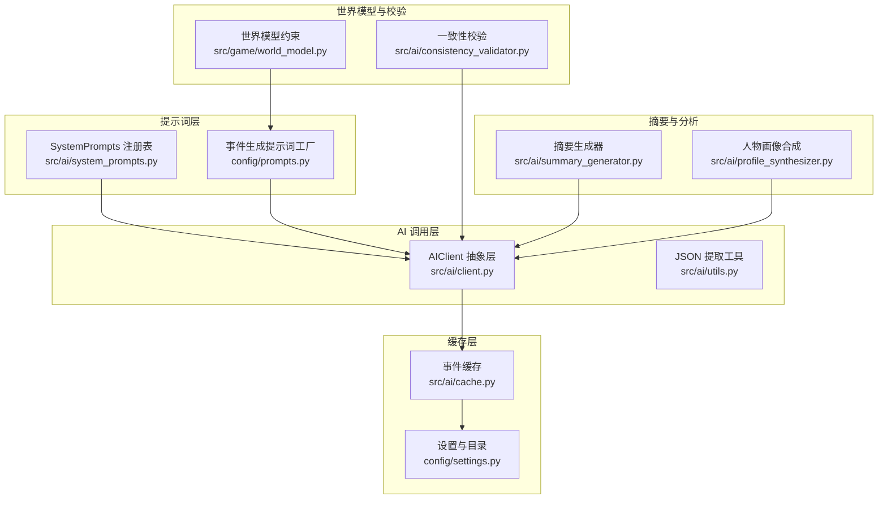
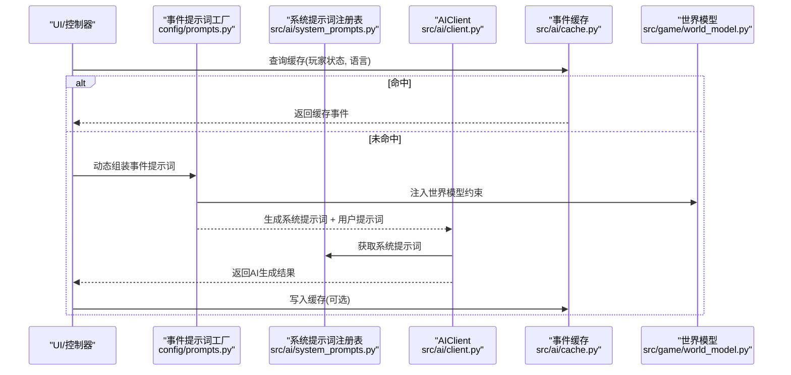
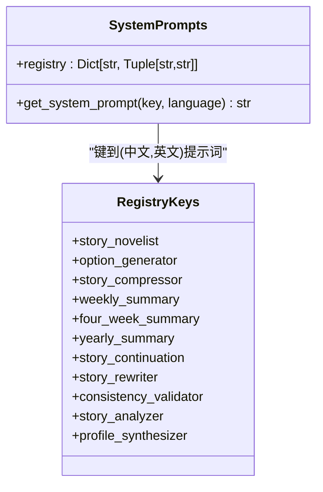
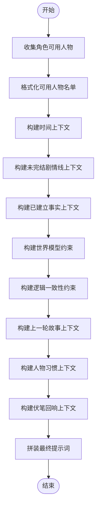
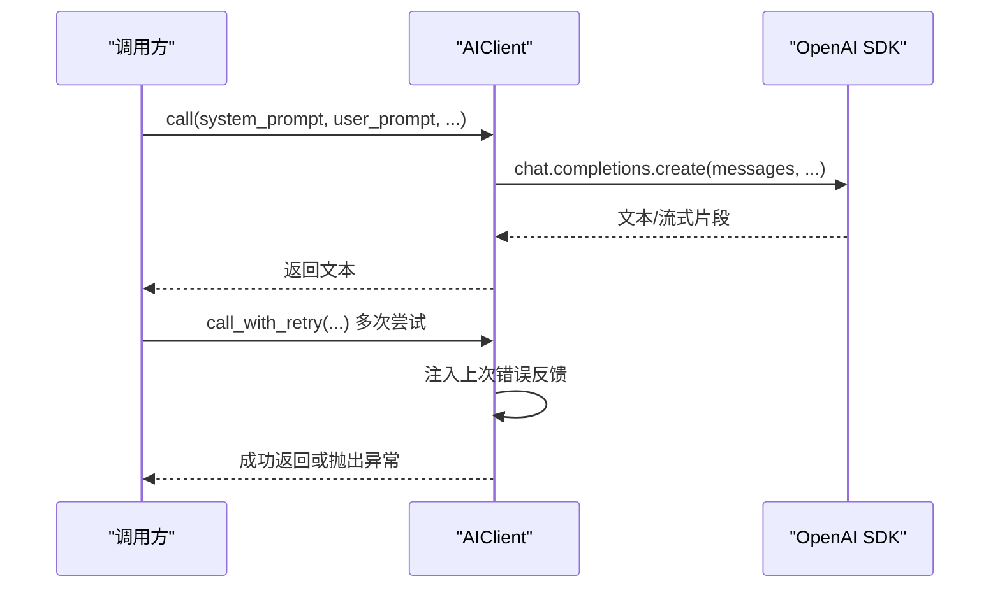
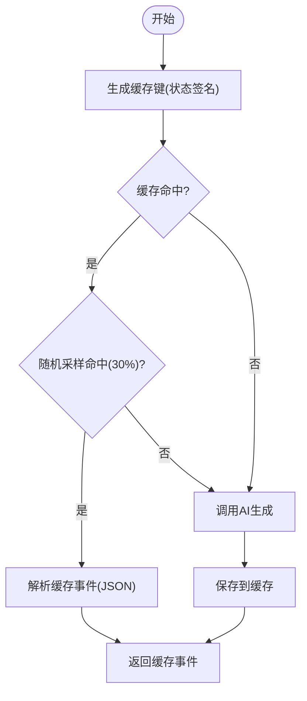
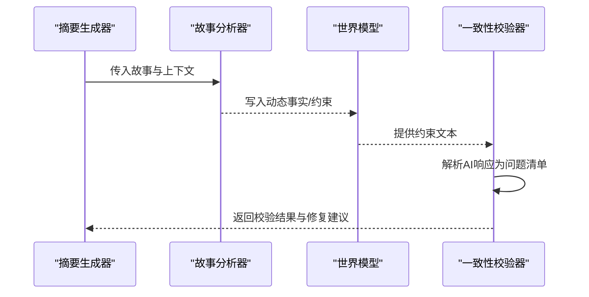
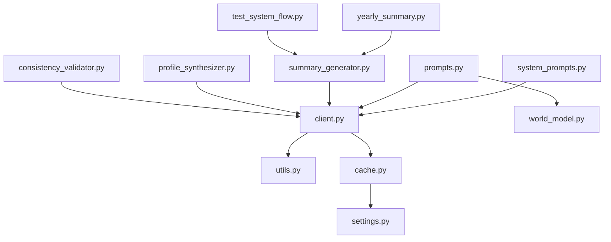

# 系统提示词管理

<cite>
**本文档引用的文件**
- [src/ai/system_prompts.py](file://src/ai/system_prompts.py)
- [config/prompts.py](file://config/prompts.py)
- [src/ai/cache.py](file://src/ai/cache.py)
- [config/settings.py](file://config/settings.py)
- [src/ai/client.py](file://src/ai/client.py)
- [src/ai/utils.py](file://src/ai/utils.py)
- [src/ai/models.py](file://src/ai/models.py)
- [src/ai/summary_generator.py](file://src/ai/summary_generator.py)
- [src/ai/profile_synthesizer.py](file://src/ai/profile_synthesizer.py)
- [src/ai/consistency_validator.py](file://src/ai/consistency_validator.py)
- [src/game/world_model.py](file://src/game/world_model.py)
- [src/game/world_model_updater.py](file://src/game/world_model_updater.py)
- [src/game/narrative_manager.py](file://src/game/narrative_manager.py)
- [src/game/yearly_summary.py](file://src/game/yearly_summary.py)
- [tests/test_system_flow.py](file://tests/test_system_flow.py)
</cite>

## 目录
1. [简介](#简介)
2. [项目结构](#项目结构)
3. [核心组件](#核心组件)
4. [架构总览](#架构总览)
5. [详细组件分析](#详细组件分析)
6. [依赖关系分析](#依赖关系分析)
7. [性能考量](#性能考量)
8. [故障排查指南](#故障排查指南)
9. [结论](#结论)
10. [附录](#附录)

## 简介
本文件系统化阐述该代码库中的“系统提示词管理”设计与实现，重点包括：
- SystemPrompts 的集中化注册表设计与 KV 缓存稳定性保障
- 提示词模板的分类体系、参数化设计与动态组装算法
- 提示词优化策略、效果评估与版本管理
- 在不同 AI 服务中的适配与转换机制
- 提示词的安全审查、合规检查与内容过滤
- A/B 测试、性能监控与持续改进流程
- 如何扩展提示词库以适应新的应用场景

## 项目结构
系统提示词管理涉及多个层次：
- 系统级提示词注册表：集中管理所有系统提示词，保证跨模块一致性与 KV 缓存稳定性
- 事件生成提示词工厂：按语言与上下文动态拼装事件生成提示词
- AI 客户端抽象层：统一调用、错误反馈注入与重试
- 缓存层：事件级缓存，降低重复调用成本
- 世界模型与一致性校验：动态约束注入与逻辑一致性保障
- 摘要与分析：故事压缩、要点抽取与动态事实注入
- UI 与统计：结果渲染与对比统计

**图表来源**
- [src/ai/system_prompts.py](file://src/ai/system_prompts.py#L1-L226)
- [config/prompts.py](file://config/prompts.py#L674-L712)
- [src/ai/client.py](file://src/ai/client.py#L22-L214)
- [src/ai/utils.py](file://src/ai/utils.py#L10-L77)
- [src/ai/cache.py](file://src/ai/cache.py#L13-L139)
- [config/settings.py](file://config/settings.py#L16-L42)
- [src/game/world_model.py](file://src/game/world_model.py#L381-L565)
- [src/ai/consistency_validator.py](file://src/ai/consistency_validator.py#L113-L146)
- [src/ai/summary_generator.py](file://src/ai/summary_generator.py#L17-L429)
- [src/ai/profile_synthesizer.py](file://src/ai/profile_synthesizer.py#L16-L85)

**章节来源**
- [src/ai/system_prompts.py](file://src/ai/system_prompts.py#L1-L226)
- [config/prompts.py](file://config/prompts.py#L674-L712)
- [src/ai/cache.py](file://src/ai/cache.py#L13-L139)
- [config/settings.py](file://config/settings.py#L16-L42)
- [src/ai/client.py](file://src/ai/client.py#L22-L214)
- [src/ai/utils.py](file://src/ai/utils.py#L10-L77)
- [src/ai/summary_generator.py](file://src/ai/summary_generator.py#L17-L429)
- [src/ai/profile_synthesizer.py](file://src/ai/profile_synthesizer.py#L16-L85)
- [src/ai/consistency_validator.py](file://src/ai/consistency_validator.py#L113-L146)
- [src/game/world_model.py](file://src/game/world_model.py#L381-L565)

## 核心组件
- 系统提示词注册表：集中存放各类系统提示词（小说家、选项生成、压缩、周/年总结、续写、重写、一致性校验、叙事分析、画像合成等），提供按键与语言检索接口，确保相同提示词在不同调用点获得一致的 KV 缓存命中率。
- 事件生成提示词工厂：根据玩家状态、语言、角色设定、时间、未完结剧情线、已建立事实、世界模型等上下文动态拼装提示词；提供中英文版本与多类上下文注入函数。
- AI 客户端抽象层：统一系统/用户消息构造、调用、JSON 解析与重试；支持流式回调与错误反馈注入，提升鲁棒性。
- 事件缓存：基于玩家状态签名的事件缓存，降低重复请求成本，同时引入随机采样以维持多样性。
- 世界模型与一致性校验：动态构建约束文本并注入提示词，AI 自主抽取动态事实并纳入世界模型，一致性校验器据此进行逻辑冲突检测与修复建议。
- 摘要与分析：故事压缩、周/四/年总结生成，以及动态事实与伏笔种子的提取与注入。

**章节来源**
- [src/ai/system_prompts.py](file://src/ai/system_prompts.py#L196-L226)
- [config/prompts.py](file://config/prompts.py#L674-L712)
- [src/ai/client.py](file://src/ai/client.py#L51-L137)
- [src/ai/cache.py](file://src/ai/cache.py#L47-L102)
- [src/game/world_model.py](file://src/game/world_model.py#L381-L565)
- [src/ai/consistency_validator.py](file://src/ai/consistency_validator.py#L113-L146)
- [src/ai/summary_generator.py](file://src/ai/summary_generator.py#L25-L140)

## 架构总览
系统提示词管理贯穿“提示词生成—AI调用—缓存—世界模型—评估”的闭环：

**图表来源**
- [config/prompts.py](file://config/prompts.py#L674-L712)
- [src/ai/system_prompts.py](file://src/ai/system_prompts.py#L211-L226)
- [src/ai/client.py](file://src/ai/client.py#L51-L137)
- [src/ai/cache.py](file://src/ai/cache.py#L78-L102)
- [src/game/world_model.py](file://src/game/world_model.py#L381-L565)

## 详细组件分析

### 系统提示词注册表（SystemPrompts）
- 设计目标：单一可信来源，确保 KV 缓存前缀稳定、便于审计与维护、跨调用点行为一致
- 结构：键值对映射，键为用途标识（如 story_novelist、option_generator、story_compressor 等），值为 (中文, 英文) 元组
- 使用方式：通过 get_system_prompt(key, language) 获取对应语言的系统提示词

**图表来源**
- [src/ai/system_prompts.py](file://src/ai/system_prompts.py#L196-L226)

**章节来源**
- [src/ai/system_prompts.py](file://src/ai/system_prompts.py#L1-L226)

### 事件生成提示词工厂（动态组装）
- 参数化设计：接收玩家状态、语言、当前阶段、角色设定、开场故事、上一轮事件、4周/年总结、时间信息、未完结剧情线、已建立事实、世界模型等
- 动态组装算法：
  - 角色上下文：收集可用人物、格式化名单、构建时代/家庭/关系/特质等上下文
  - 时间上下文：注入当前周数、年龄、季节等
  - 未完结剧情线：区分高/中重要性，给出强制/建议性约束
  - 已建立事实与世界模型：构建地理、职业、承诺、因果链、身体状态等约束
  - 逻辑一致性：时间线、动机、因果、目标一致性
  - 上一轮故事上下文：未完结时强制续写，已完结时保持叙事连贯
  - 人物习惯：按角色分组，体现一致性与变化
  - 伏笔回响：根据隐蔽度与回收方式注入自然回响
- 中英文版本：分别构建提示词文本，确保语言一致性

**图表来源**
- [config/prompts.py](file://config/prompts.py#L7-L671)

**章节来源**
- [config/prompts.py](file://config/prompts.py#L674-L712)
- [config/prompts.py](file://config/prompts.py#L7-L671)

### AI 客户端抽象层（统一调用与重试）
- 统一消息构造：system/user messages
- JSON 解析与提取：内置多种提取策略，兼容不同模型输出
- 错误反馈注入：重试时将上次错误注入用户提示词，帮助模型学习
- 流式回调：支持流式输出
- 模型覆盖：允许按调用点覆盖默认模型

**图表来源**
- [src/ai/client.py](file://src/ai/client.py#L51-L213)
- [src/ai/utils.py](file://src/ai/utils.py#L10-L77)

**章节来源**
- [src/ai/client.py](file://src/ai/client.py#L22-L214)
- [src/ai/utils.py](file://src/ai/utils.py#L10-L77)

### 事件缓存机制（KV 缓存稳定性与多样性）
- 缓存键生成：基于年龄、能量、情绪、学识、财富、周数、决策历史长度、语言等关键状态，进行分箱/取整以减少抖动
- 命中策略：仅以一定概率（例如 30%）使用缓存，其余时间强制调用以保证多样性
- 序列化：事件对象转为字典后持久化，失败时记录告警
- 清理与统计：提供清空与大小查询

**图表来源**
- [src/ai/cache.py](file://src/ai/cache.py#L47-L102)

**章节来源**
- [src/ai/cache.py](file://src/ai/cache.py#L13-L139)
- [config/settings.py](file://config/settings.py#L16-L42)

### 世界模型与一致性校验（动态约束与逻辑一致性）
- 世界模型约束：按地理、职业、承诺、因果链、身体状态、动态事实等维度构建约束文本，注入到提示词中
- 动态事实：AI 分析器从故事中抽取关键事实，形成可直接注入的约束文本
- 一致性校验：AI 对故事进行逻辑一致性检查，输出问题清单与修复建议，严重问题升级处理

**图表来源**
- [src/ai/summary_generator.py](file://src/ai/summary_generator.py#L25-L140)
- [src/ai/consistency_validator.py](file://src/ai/consistency_validator.py#L113-L146)
- [src/game/world_model.py](file://src/game/world_model.py#L381-L565)

**章节来源**
- [src/ai/summary_generator.py](file://src/ai/summary_generator.py#L17-L429)
- [src/ai/consistency_validator.py](file://src/ai/consistency_validator.py#L113-L146)
- [src/game/world_model.py](file://src/game/world_model.py#L381-L565)

### 提示词优化策略、效果评估与版本管理
- 优化策略
  - KV 缓存稳定性：系统提示词集中化，避免微小差异导致缓存失效
  - 重试与错误反馈：call_with_retry 将上次错误反馈注入提示词，提升质量
  - JSON 提取健壮性：多策略提取，降低格式漂移影响
- 效果评估
  - 一致性校验：自动检测逻辑矛盾与行为不一致，输出修复建议
  - 摘要与动态事实：通过压缩与分析提炼关键信息，驱动世界模型演进
  - 统计对比：UI 层可比较不同运行结果的平均状态变化
- 版本管理
  - 注册表键名即版本标识，新增/修改通过替换对应键值实现
  - 事件缓存键包含状态签名，变更状态即触发新缓存键，避免污染

**章节来源**
- [src/ai/client.py](file://src/ai/client.py#L140-L213)
- [src/ai/utils.py](file://src/ai/utils.py#L10-L77)
- [src/ai/consistency_validator.py](file://src/ai/consistency_validator.py#L191-L217)
- [src/ai/summary_generator.py](file://src/ai/summary_generator.py#L329-L429)
- [src/ui/stats.py](file://src/ui/stats.py#L172-L182)

### 在不同 AI 服务中的适配与转换机制
- 统一抽象：AIClient 封装底层 SDK 差异，支持 base_url 覆盖与模型切换
- 系统提示词适配：通过 get_system_prompt(key, language) 返回对应语言版本
- 输出解析：extract_json 兼容多种包裹与嵌入格式，提升跨模型兼容性

**章节来源**
- [src/ai/client.py](file://src/ai/client.py#L25-L47)
- [src/ai/system_prompts.py](file://src/ai/system_prompts.py#L211-L226)
- [src/ai/utils.py](file://src/ai/utils.py#L10-L77)

### 安全审查、合规检查与内容过滤
- 系统提示词层面：明确禁止第四面墙、元信息与不当内容，确保叙事沉浸性与合规性
- 一致性校验：自动检测与提示潜在违规或不一致内容
- JSON 提取：严格解析，避免注入风险

**章节来源**
- [src/ai/system_prompts.py](file://src/ai/system_prompts.py#L16-L30)
- [src/ai/consistency_validator.py](file://src/ai/consistency_validator.py#L113-L146)
- [src/ai/utils.py](file://src/ai/utils.py#L10-L77)

### A/B 测试、性能监控与持续改进流程
- A/B 测试：通过系统提示词键名区分不同版本（如 story_novelist_v1/v2），在调用侧切换
- 性能监控：缓存命中率、AI 调用耗时、错误率、重试次数、摘要长度分布等
- 持续改进：基于一致性校验与统计对比，迭代提示词与上下文注入策略

**章节来源**
- [src/ai/system_prompts.py](file://src/ai/system_prompts.py#L196-L226)
- [src/ai/cache.py](file://src/ai/cache.py#L78-L102)
- [src/ai/client.py](file://src/ai/client.py#L140-L213)
- [src/ui/stats.py](file://src/ui/stats.py#L172-L182)

### 扩展提示词库与适应新场景
- 新增提示词：在注册表中添加键值对，提供中英文版本
- 场景适配：通过事件提示词工厂的上下文注入函数扩展新维度（如新增世界模型约束、动态事实类别）
- 世界模型演进：通过分析器与更新器扩展动态事实类型与生命周期管理

**章节来源**
- [src/ai/system_prompts.py](file://src/ai/system_prompts.py#L196-L226)
- [config/prompts.py](file://config/prompts.py#L556-L578)
- [src/game/world_model.py](file://src/game/world_model.py#L381-L565)
- [src/game/world_model_updater.py](file://src/game/world_model_updater.py#L174-L208)
- [src/game/narrative_manager.py](file://src/game/narrative_manager.py#L295-L336)

## 依赖关系分析

**图表来源**
- [src/ai/system_prompts.py](file://src/ai/system_prompts.py#L211-L226)
- [config/prompts.py](file://config/prompts.py#L674-L712)
- [src/ai/client.py](file://src/ai/client.py#L51-L137)
- [src/ai/utils.py](file://src/ai/utils.py#L10-L77)
- [src/ai/cache.py](file://src/ai/cache.py#L13-L139)
- [config/settings.py](file://config/settings.py#L16-L42)
- [src/ai/summary_generator.py](file://src/ai/summary_generator.py#L25-L140)
- [src/ai/profile_synthesizer.py](file://src/ai/profile_synthesizer.py#L22-L51)
- [src/ai/consistency_validator.py](file://src/ai/consistency_validator.py#L113-L146)
- [src/game/yearly_summary.py](file://src/game/yearly_summary.py#L47-L90)
- [tests/test_system_flow.py](file://tests/test_system_flow.py#L286-L320)

**章节来源**
- [src/ai/system_prompts.py](file://src/ai/system_prompts.py#L1-L226)
- [config/prompts.py](file://config/prompts.py#L674-L712)
- [src/ai/client.py](file://src/ai/client.py#L22-L214)
- [src/ai/utils.py](file://src/ai/utils.py#L10-L77)
- [src/ai/cache.py](file://src/ai/cache.py#L13-L139)
- [config/settings.py](file://config/settings.py#L16-L42)
- [src/ai/summary_generator.py](file://src/ai/summary_generator.py#L17-L429)
- [src/ai/profile_synthesizer.py](file://src/ai/profile_synthesizer.py#L16-L85)
- [src/ai/consistency_validator.py](file://src/ai/consistency_validator.py#L113-L146)
- [src/game/world_model.py](file://src/game/world_model.py#L381-L565)
- [src/game/world_model_updater.py](file://src/game/world_model_updater.py#L174-L208)
- [src/game/narrative_manager.py](file://src/game/narrative_manager.py#L295-L336)
- [src/game/yearly_summary.py](file://src/game/yearly_summary.py#L47-L90)
- [tests/test_system_flow.py](file://tests/test_system_flow.py#L286-L320)

## 性能考量
- KV 缓存稳定性：系统提示词集中化与状态签名分箱，显著提升缓存命中率
- 事件缓存采样：30% 命中率平衡稳定性与多样性
- JSON 提取健壮性：多策略提取降低格式漂移带来的失败率
- 重试与错误反馈：减少重复错误，提升成功率与质量
- 世界模型约束注入：将动态约束文本注入提示词，减少后续校验成本

[本节为通用性能讨论，无需特定文件来源]

## 故障排查指南
- JSON 解析失败：检查 extract_json 的多种提取策略是否覆盖当前模型输出
- 一致性校验失败：查看校验器输出的问题清单与修复建议，必要时放宽或调整约束
- 缓存异常：确认缓存文件可读写、键生成逻辑与状态签名一致
- 重试仍失败：检查错误反馈注入是否生效，逐步缩小问题范围

**章节来源**
- [src/ai/utils.py](file://src/ai/utils.py#L10-L77)
- [src/ai/consistency_validator.py](file://src/ai/consistency_validator.py#L191-L217)
- [src/ai/cache.py](file://src/ai/cache.py#L28-L46)
- [src/ai/client.py](file://src/ai/client.py#L140-L213)

## 结论
该系统通过“集中化系统提示词注册表 + 动态事件提示词工厂 + 统一 AI 客户端抽象 + 事件缓存 + 世界模型与一致性校验”的组合，实现了提示词的稳定性、可维护性与可扩展性。结合 JSON 提取健壮性、错误反馈注入与统计对比，形成了从质量到性能的闭环保障。未来可在注册表版本化、动态提示词 A/B 测试与更丰富的世界模型动态事实类型方面持续演进。

[本节为总结性内容，无需特定文件来源]

## 附录
- 提示词键名建议：按功能域命名（如 story_novelist、option_generator、story_compressor、weekly_summary、four_week_summary、yearly_summary、story_continuation、story_rewriter、consistency_validator、story_analyzer、profile_synthesizer）
- 上下文注入函数：可用人物收集与格式化、时间上下文、未完结剧情线、已建立事实、世界模型约束、逻辑一致性、上一轮故事、人物习惯、伏笔回响等
- 世界模型扩展：新增动态事实类别与生命周期管理，配合分析器与更新器

[本节为概念性补充，无需特定文件来源]