# 选项生成系统

<cite>
**本文档引用的文件**
- [src/ai/option_generator.py](file://src/ai/option_generator.py)
- [src/ai/profile_synthesizer.py](file://src/ai/profile_synthesizer.py)
- [src/ai/generator.py](file://src/ai/generator.py)
- [src/ai/consistency_validator.py](file://src/ai/consistency_validator.py)
- [src/ai/models.py](file://src/ai/models.py)
- [src/ai/client.py](file://src/ai/client.py)
- [src/ai/utils.py](file://src/ai/utils.py)
- [src/ai/system_prompts.py](file://src/ai/system_prompts.py)
- [src/ai/cache.py](file://src/ai/cache.py)
- [src/game/character_creation.py](file://src/game/character_creation.py)
- [src/game/world_model.py](file://src/game/world_model.py)
- [config/prompts.py](file://config/prompts.py)
- [config/settings.py](file://config/settings.py)
</cite>

## 目录
1. [简介](#简介)
2. [项目结构](#项目结构)
3. [核心组件](#核心组件)
4. [架构概览](#架构概览)
5. [详细组件分析](#详细组件分析)
6. [依赖关系分析](#依赖关系分析)
7. [性能考虑](#性能考虑)
8. [故障排除指南](#故障排除指南)
9. [结论](#结论)
10. [附录](#附录)

## 简介
选项生成系统是本项目AI驱动的叙事引擎的核心组成部分，负责为游戏事件生成高质量的可选行动选项。该系统通过两阶段管道实现：第一阶段生成故事文本，第二阶段为现有故事生成选项并进行验证。系统集成了角色行为画像合成、一致性验证、缓存机制等多个功能模块，确保生成内容既符合叙事逻辑又具有足够的多样性和可玩性。

## 项目结构
选项生成系统位于AI层，与游戏逻辑层分离，采用模块化设计：

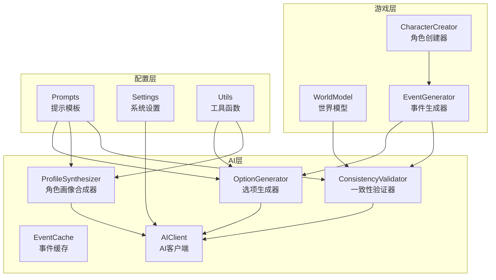

**图表来源**
- [src/ai/option_generator.py](file://src/ai/option_generator.py#L17-L248)
- [src/ai/profile_synthesizer.py](file://src/ai/profile_synthesizer.py#L16-L85)
- [src/ai/generator.py](file://src/ai/generator.py#L30-L431)

**章节来源**
- [src/ai/option_generator.py](file://src/ai/option_generator.py#L1-L248)
- [src/ai/profile_synthesizer.py](file://src/ai/profile_synthesizer.py#L1-L85)
- [src/ai/generator.py](file://src/ai/generator.py#L1-L431)

## 核心组件
选项生成系统包含以下核心组件：

### OptionGenerator（选项生成器）
负责为现有故事生成选项，包含以下关键功能：
- 选项生成与验证
- 关系名称验证与修复
- 事件质量验证
- 错误处理与回退机制

### ProfileSynthesizer（角色画像合成器）
从行为证据中提取AI驱动的角色画像，包含：
- 行为特征合成
- 决策模式分析
- 情感倾向识别
- 行为边界约束

### EventGenerator（事件生成器）
作为门面模式的协调器，管理多个AI服务：
- 事件生成管道
- 缓存管理
- 预设事件处理
- 服务委托

**章节来源**
- [src/ai/option_generator.py](file://src/ai/option_generator.py#L17-L248)
- [src/ai/profile_synthesizer.py](file://src/ai/profile_synthesizer.py#L16-L85)
- [src/ai/generator.py](file://src/ai/generator.py#L30-L431)

## 架构概览
系统采用分层架构设计，实现了关注点分离和职责单一化：

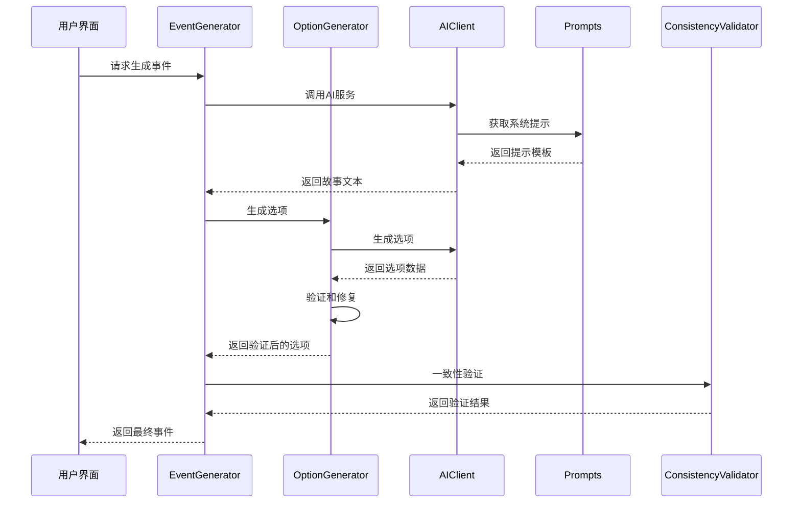

**图表来源**
- [src/ai/generator.py](file://src/ai/generator.py#L183-L238)
- [src/ai/option_generator.py](file://src/ai/option_generator.py#L25-L132)
- [src/ai/consistency_validator.py](file://src/ai/consistency_validator.py#L60-L118)

## 详细组件分析

### OptionGenerator 选项生成算法

#### 核心算法流程
选项生成采用两阶段验证机制：

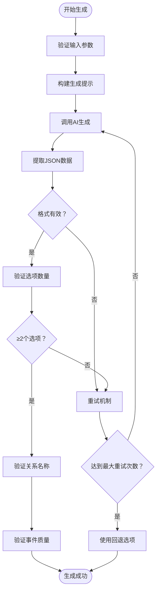

**图表来源**
- [src/ai/option_generator.py](file://src/ai/option_generator.py#L25-L132)

#### 关系名称验证机制
系统实现了智能的关系名称匹配和修复：

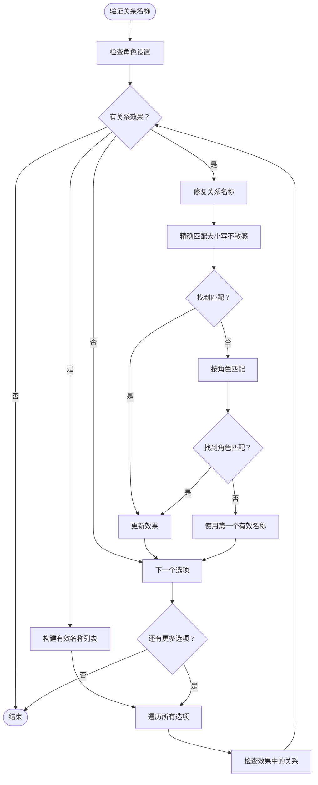

**图表来源**
- [src/ai/option_generator.py](file://src/ai/option_generator.py#L136-L209)

#### 事件质量验证算法
验证算法确保选项具有合理的权衡和一致性：

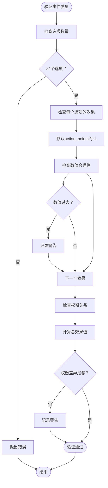

**图表来源**
- [src/ai/option_generator.py](file://src/ai/option_generator.py#L210-L248)

**章节来源**
- [src/ai/option_generator.py](file://src/ai/option_generator.py#L17-L248)

### ProfileSynthesizer 角色画像合成机制

#### 合成算法流程
角色画像合成为AI驱动的特征提取过程：

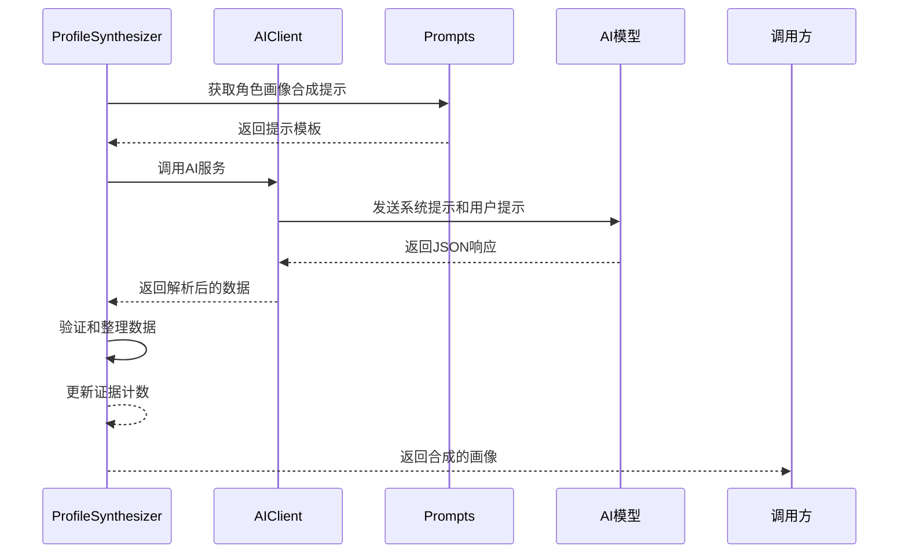

**图表来源**
- [src/ai/profile_synthesizer.py](file://src/ai/profile_synthesizer.py#L22-L85)

#### 特征抽取与属性生成
画像合成器从行为证据中提取关键特征：

| 特征类别 | 描述 | 示例 |
|---------|------|------|
| 行为特征 | 角色的典型行为模式 | "冲突回避型"、"善于倾听" |
| 说话风格 | 角色的语言表达方式 | "说话直接、偶尔带自嘲式幽默" |
| 决策模式 | 角色的决策偏好 | "倾向妥协"、"重视关系胜过利益" |
| 情感倾向 | 角色的情绪表达方式 | "压抑情绪"、"独处时才释放" |
| 行为边界 | 角色绝对不会做的事情 | "绝不在公开场合发怒"、"不会背叛朋友" |

**章节来源**
- [src/ai/profile_synthesizer.py](file://src/ai/profile_synthesizer.py#L16-L85)

### ConsistencyValidator 一致性验证机制

#### 验证维度体系
系统采用六维一致性验证：

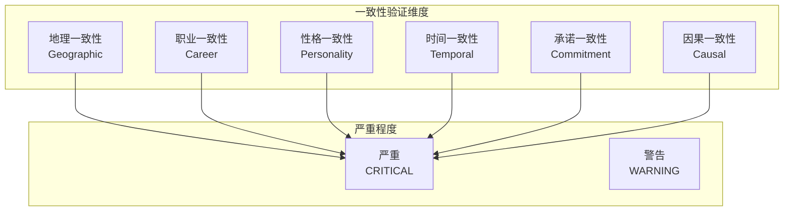

**图表来源**
- [src/ai/consistency_validator.py](file://src/ai/consistency_validator.py#L13-L40)

#### 验证流程
一致性验证采用AI辅助的审查机制：

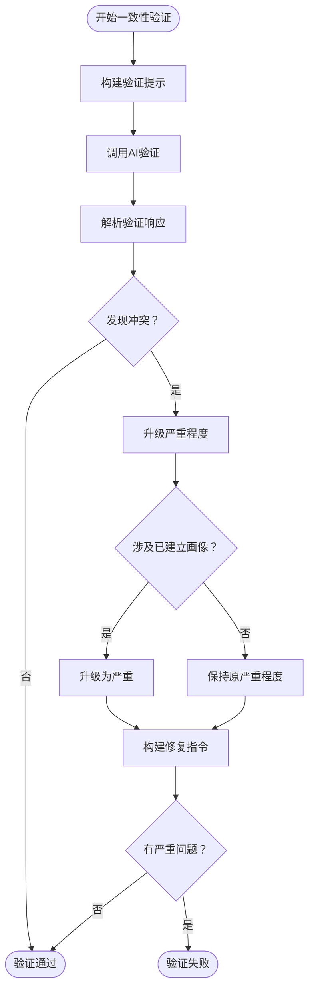

**图表来源**
- [src/ai/consistency_validator.py](file://src/ai/consistency_validator.py#L60-L231)

**章节来源**
- [src/ai/consistency_validator.py](file://src/ai/consistency_validator.py#L42-L231)

### EventGenerator 事件生成协调器

#### 服务委托模式
EventGenerator采用门面模式协调多个AI服务：

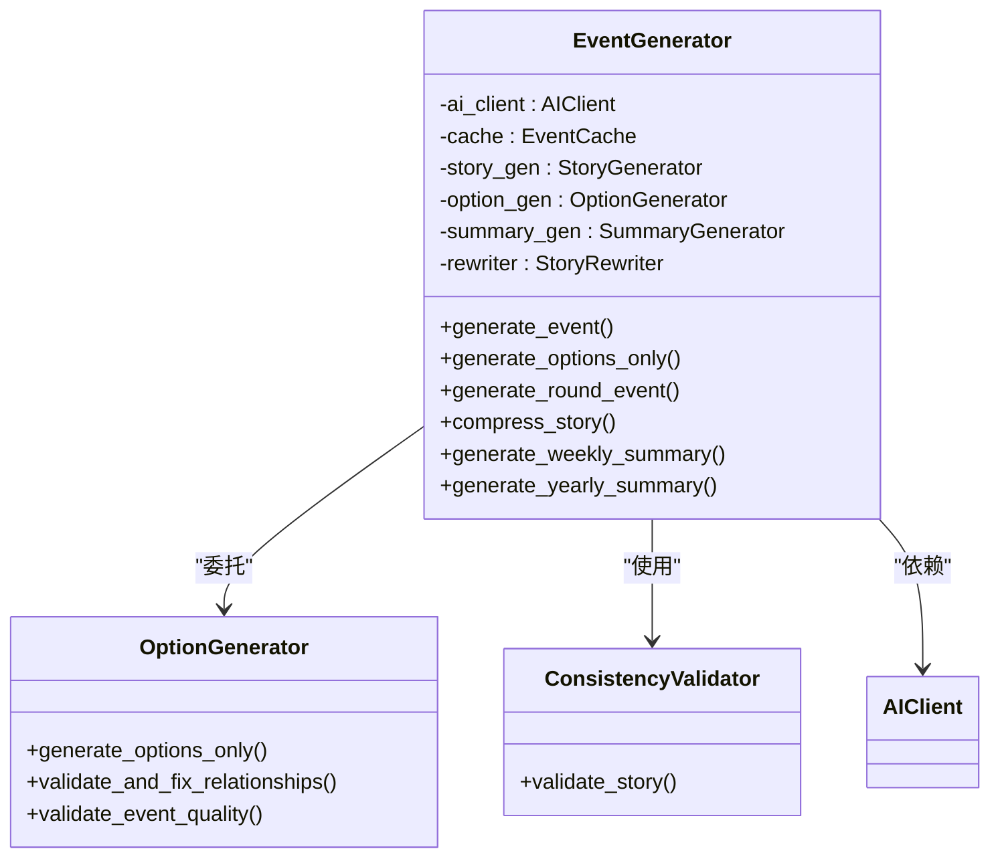

**图表来源**
- [src/ai/generator.py](file://src/ai/generator.py#L30-L66)

**章节来源**
- [src/ai/generator.py](file://src/ai/generator.py#L30-L431)

## 依赖关系分析

### 核心依赖图
系统依赖关系呈现清晰的分层结构：

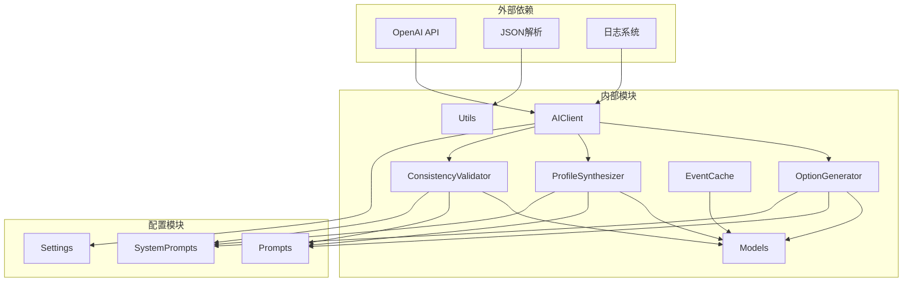

**图表来源**
- [src/ai/client.py](file://src/ai/client.py#L22-L47)
- [src/ai/models.py](file://src/ai/models.py#L7-L27)

### 数据流分析
系统采用双向数据流设计：

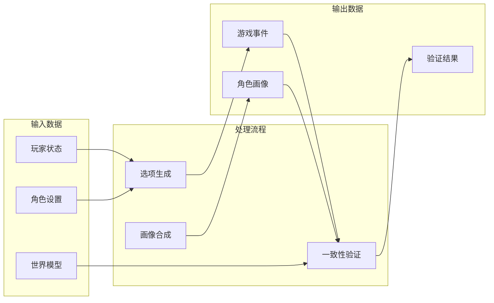

**图表来源**
- [src/ai/generator.py](file://src/ai/generator.py#L183-L238)
- [src/ai/option_generator.py](file://src/ai/option_generator.py#L25-L132)

**章节来源**
- [src/ai/client.py](file://src/ai/client.py#L1-L214)
- [src/ai/utils.py](file://src/ai/utils.py#L1-L77)
- [src/ai/models.py](file://src/ai/models.py#L1-L27)

## 性能考虑

### 缓存策略
系统实现了智能的事件缓存机制：

| 缓存特性 | 实现方式 | 效果 |
|---------|----------|------|
| 缓存命中率 | 30%随机命中 | 平衡新鲜度和性能 |
| 缓存键生成 | 基于状态签名 | 减少缓存失效 |
| 缓存持久化 | JSON文件存储 | 支持重启后恢复 |
| 缓存清理 | 手动清理接口 | 管理缓存空间 |

### 重试机制
系统采用渐进式重试策略：

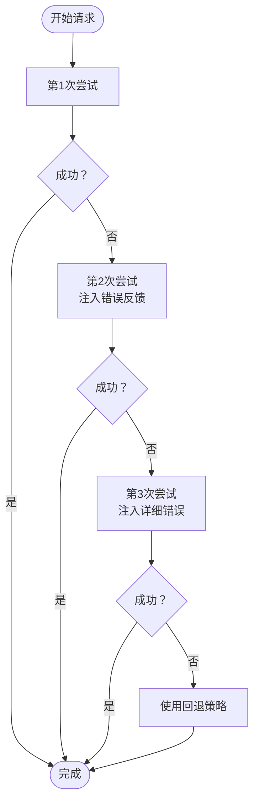

**图表来源**
- [src/ai/client.py](file://src/ai/client.py#L140-L213)

### 资源管理
系统实现了资源限制和保护机制：

| 资源类型 | 限制值 | 作用 |
|---------|--------|------|
| 最大令牌数 | 2000 | 控制API成本 |
| 温度系数 | 0.8 | 平衡创造性与稳定性 |
| 重试次数 | 3次 | 防止无限重试 |
| 缓存容量 | 无限制 | 支持长期使用 |

## 故障排除指南

### 常见问题诊断

#### 选项生成失败
**症状**：选项数量少于2个或格式无效
**诊断步骤**：
1. 检查AI响应是否包含JSON格式
2. 验证提示模板是否正确构建
3. 确认重试机制是否正常工作
4. 查看回退选项是否被触发

#### 关系名称不匹配
**症状**：选项中的关系名称与角色设置不符
**解决方案**：
1. 检查角色设置中的可用人物列表
2. 验证名称匹配算法（精确匹配→角色匹配→回退）
3. 确认大小写处理逻辑
4. 验证角色角色匹配机制

#### 一致性验证失败
**症状**：验证结果显示严重问题
**处理流程**：
1. 检查严重程度升级逻辑（画像角色特殊处理）
2. 验证修复指令构建
3. 确认AI验证响应解析
4. 查看日志中的具体问题描述

### 性能优化建议

#### 缓存优化
- 调整缓存命中率以平衡新鲜度
- 优化缓存键生成算法
- 实施缓存清理策略

#### API调用优化
- 实现连接池复用
- 优化提示模板长度
- 使用批量处理减少API调用次数

**章节来源**
- [src/ai/option_generator.py](file://src/ai/option_generator.py#L114-L132)
- [src/ai/consistency_validator.py](file://src/ai/consistency_validator.py#L114-L118)

## 结论
选项生成系统通过模块化设计和分层架构，实现了高质量的AI驱动选项生成。系统的核心优势包括：

1. **算法严谨性**：采用两阶段验证机制确保选项质量和一致性
2. **智能修复**：关系名称自动匹配和修复功能提升用户体验
3. **可扩展性**：模块化设计便于功能扩展和维护
4. **性能优化**：缓存机制和重试策略平衡性能与可靠性
5. **质量保证**：多重验证机制确保生成内容符合叙事逻辑

该系统为游戏提供了丰富的可选行动路径，同时保持了叙事的一致性和角色的可信度。

## 附录

### 配置参数说明

#### 系统设置
| 参数名 | 默认值 | 说明 |
|--------|--------|------|
| OPENAI_API_KEY | 环境变量 | OpenAI API密钥 |
| OPENAI_MODEL | gpt-4 | 使用的AI模型 |
| CACHE_EVENTS | true | 是否启用事件缓存 |
| DEFAULT_LANGUAGE | zh | 默认语言设置 |

#### 游戏常量
| 参数名 | 默认值 | 说明 |
|--------|--------|------|
| STARTING_AGE | 22 | 游戏开始年龄 |
| TOTAL_WEEKS | 96 | 游戏总周数 |
| INITIAL_ENERGY | 70 | 初始精力值 |
| MAX_RESOURCE | 100 | 资源最大值 |

### API接口规范

#### 选项生成接口
- **方法**：`generate_options_only()`
- **输入**：故事描述、玩家状态、角色设置
- **输出**：GameEvent对象
- **验证**：选项数量≥2，关系名称匹配，事件质量检查

#### 角色画像合成接口
- **方法**：`synthesize()`
- **输入**：角色名称、特征列表、行为证据
- **输出**：角色画像字典
- **验证**：JSON格式解析，特征完整性检查

**章节来源**
- [config/settings.py](file://config/settings.py#L30-L100)
- [src/ai/models.py](file://src/ai/models.py#L7-L27)