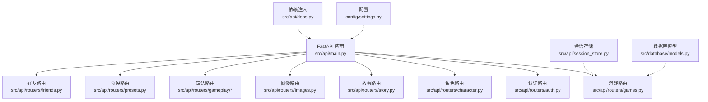
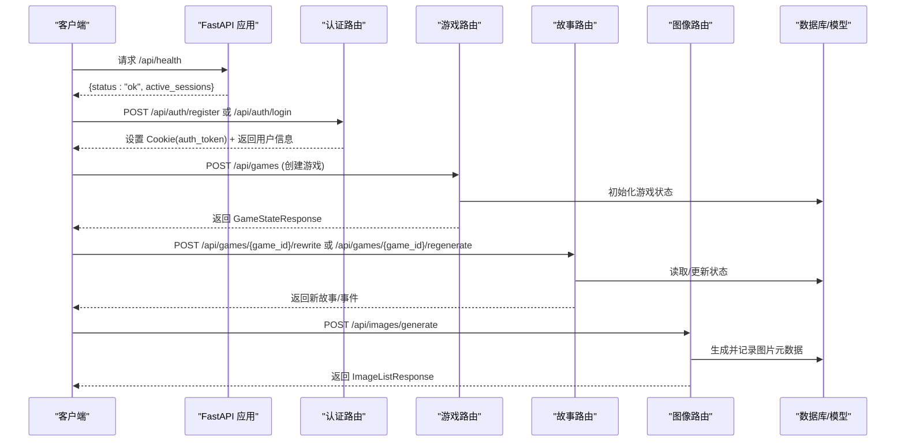
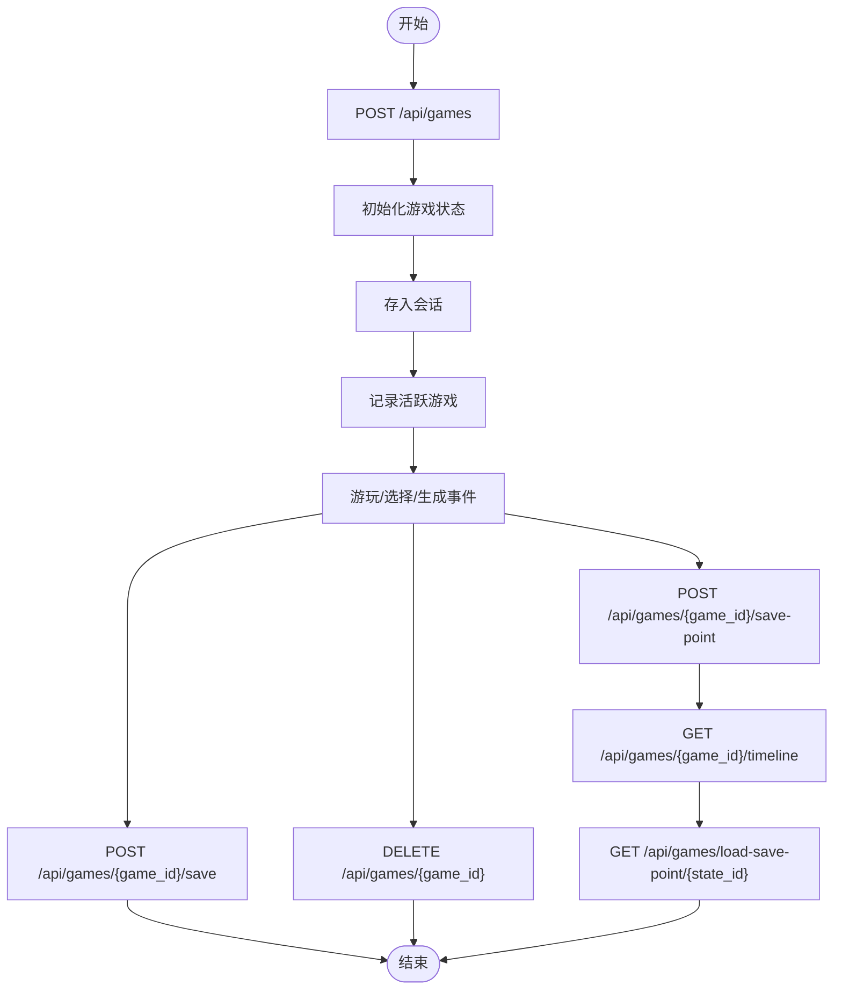
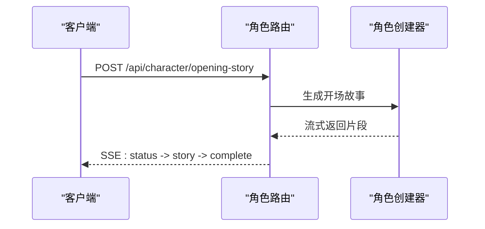
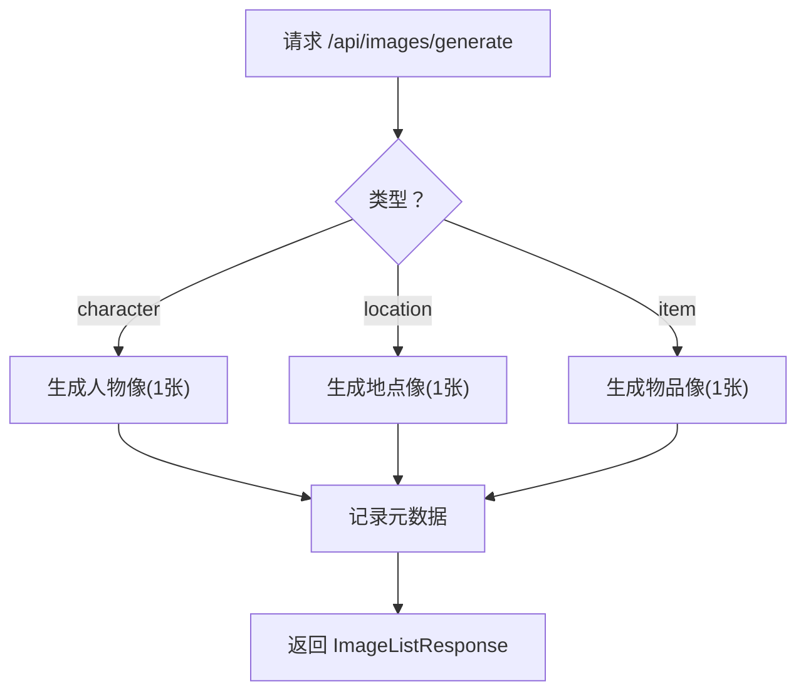
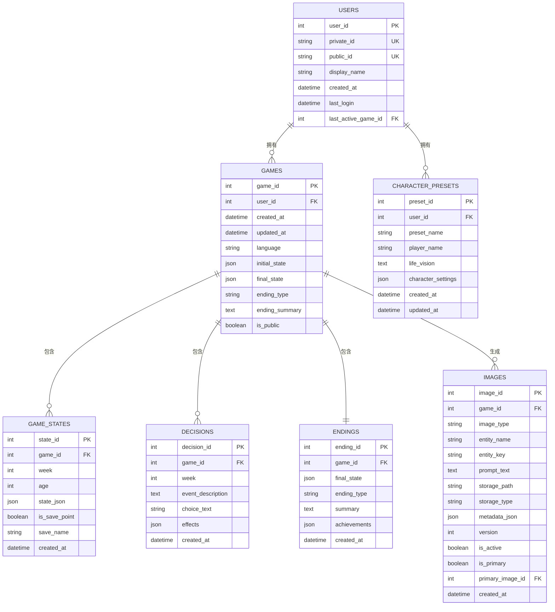
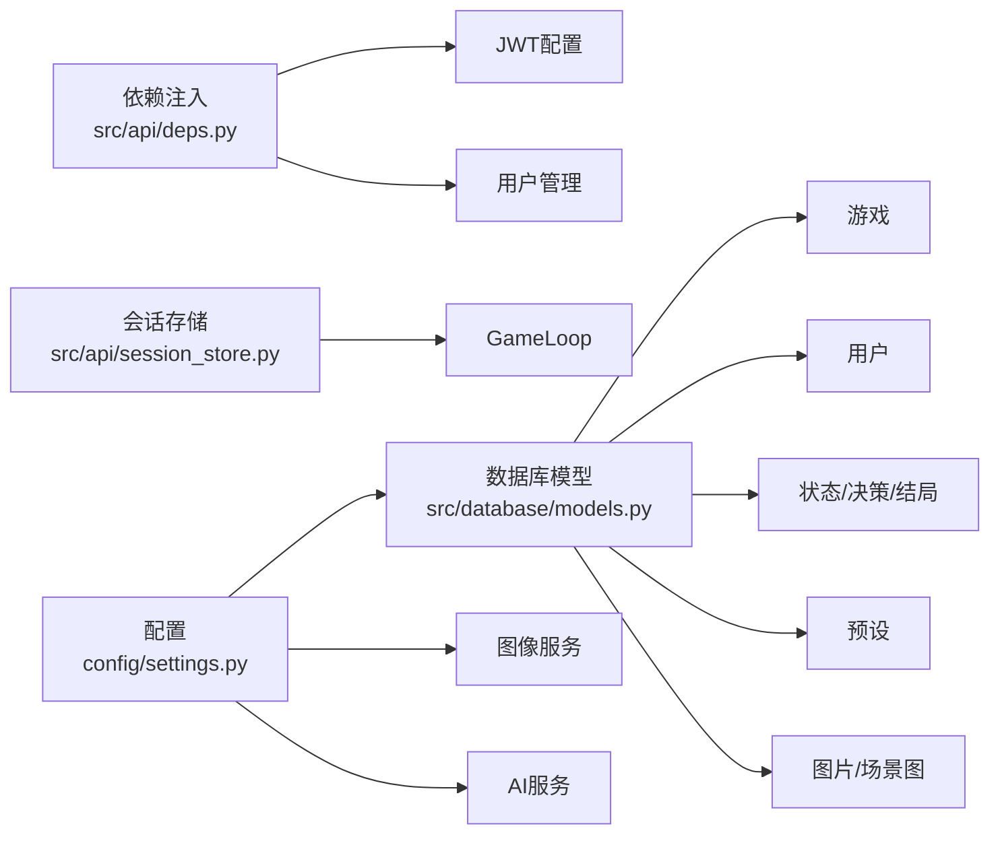

# API接口文档

<cite>
**本文档引用的文件**
- [src/api/main.py](file://src/api/main.py)
- [src/api/schemas.py](file://src/api/schemas.py)
- [src/api/deps.py](file://src/api/deps.py)
- [src/api/session_store.py](file://src/api/session_store.py)
- [src/api/routers/auth.py](file://src/api/routers/auth.py)
- [src/api/routers/games.py](file://src/api/routers/games.py)
- [src/api/routers/character.py](file://src/api/routers/character.py)
- [src/api/routers/story.py](file://src/api/routers/story.py)
- [src/api/routers/images.py](file://src/api/routers/images.py)
- [src/api/routers/gameplay/choices.py](file://src/api/routers/gameplay/choices.py)
- [src/api/routers/gameplay/events.py](file://src/api/routers/gameplay/events.py)
- [src/api/routers/presets.py](file://src/api/routers/presets.py)
- [src/api/routers/friends.py](file://src/api/routers/friends.py)
- [src/database/models.py](file://src/database/models.py)
- [config/settings.py](file://config/settings.py)
</cite>

## 目录
1. [简介](#简介)
2. [项目结构](#项目结构)
3. [核心组件](#核心组件)
4. [架构总览](#架构总览)
5. [详细组件分析](#详细组件分析)
6. [依赖关系分析](#依赖关系分析)
7. [性能考量](#性能考量)
8. [故障排除指南](#故障排除指南)
9. [结论](#结论)
10. [附录](#附录)

## 简介
本项目为“人生草稿本”提供完整的RESTful API，覆盖游戏会话管理、角色创建、故事生成与调整、图像生成与管理、好友系统以及SSE流式交互。API采用FastAPI构建，支持JWT与Cookie认证、CORS跨域、SSE重连、会话缓存与清理，并提供健康检查与客户端日志收集端点。

## 项目结构
后端采用模块化路由组织，按功能域划分：
- 认证与用户：/api/auth
- 游戏会话：/api/games
- 角色创建：/api/character
- 故事服务：/api/games 下的 story 路由
- 图像服务：/api/images
- 游戏玩法：/api/games 下的 gameplay 子路由
- 预设与好友：/api/presets、/api/friends



图表来源
- [src/api/main.py](file://src/api/main.py#L79-L89)
- [src/api/routers/auth.py](file://src/api/routers/auth.py#L14-L14)
- [src/api/routers/games.py](file://src/api/routers/games.py#L23-L23)
- [src/api/routers/character.py](file://src/api/routers/character.py#L20-L20)
- [src/api/routers/story.py](file://src/api/routers/story.py#L13-L13)
- [src/api/routers/images.py](file://src/api/routers/images.py#L30-L30)
- [src/api/routers/presets.py](file://src/api/routers/presets.py#L10-L10)
- [src/api/routers/friends.py](file://src/api/routers/friends.py#L13-L13)
- [src/api/session_store.py](file://src/api/session_store.py#L100-L200)
- [src/api/deps.py](file://src/api/deps.py#L23-L42)
- [src/database/models.py](file://src/database/models.py#L11-L92)
- [config/settings.py](file://config/settings.py#L27-L167)

章节来源
- [src/api/main.py](file://src/api/main.py#L79-L89)
- [src/api/routers/auth.py](file://src/api/routers/auth.py#L14-L14)
- [src/api/routers/games.py](file://src/api/routers/games.py#L23-L23)
- [src/api/routers/character.py](file://src/api/routers/character.py#L20-L20)
- [src/api/routers/story.py](file://src/api/routers/story.py#L13-L13)
- [src/api/routers/images.py](file://src/api/routers/images.py#L30-L30)
- [src/api/routers/presets.py](file://src/api/routers/presets.py#L10-L10)
- [src/api/routers/friends.py](file://src/api/routers/friends.py#L13-L13)

## 核心组件
- FastAPI应用与中间件：CORS、全局异常处理、健康检查、客户端日志收集
- 依赖注入与认证：JWT创建/解码、Cookie与Bearer优先级、用户获取
- 会话管理：内存会话存储、SSE缓存、过期清理
- 数据模型：用户、游戏、状态、决策、结局、预设、图片、场景图
- 配置中心：AI与图像服务、数据库、存储、常量

章节来源
- [src/api/main.py](file://src/api/main.py#L35-L100)
- [src/api/deps.py](file://src/api/deps.py#L44-L133)
- [src/api/session_store.py](file://src/api/session_store.py#L15-L199)
- [src/database/models.py](file://src/database/models.py#L11-L200)
- [config/settings.py](file://config/settings.py#L27-L167)

## 架构总览


图表来源
- [src/api/main.py](file://src/api/main.py#L92-L99)
- [src/api/routers/auth.py](file://src/api/routers/auth.py#L44-L99)
- [src/api/routers/games.py](file://src/api/routers/games.py#L26-L58)
- [src/api/routers/story.py](file://src/api/routers/story.py#L26-L114)
- [src/api/routers/images.py](file://src/api/routers/images.py#L104-L218)
- [src/database/models.py](file://src/database/models.py#L70-L200)

## 详细组件分析

### 认证与会话管理
- 认证方式
  - 注册/登录：返回JWT并设置Cookie(auth_token)，支持Cookie与Bearer双通道
  - 令牌解析：优先从Cookie读取，否则从Authorization头读取
  - 会话有效期：30天
- 会话存储
  - 内存会话：按"user_{user_id}_game_{game_id}"或"anon_game_{game_id}"键管理
  - 过期策略：2小时超时，定期清理
  - SSE缓存：支持断线重连，最多缓存500条事件块

```mermaid
sequenceDiagram
participant Client as "客户端"
participant Auth as "认证路由"
participant Deps as "依赖注入"
participant Store as "会话存储"
Client->>Auth : POST /api/auth/register
Auth->>Deps : create_token(user_id)
Auth-->>Client : Set-Cookie : auth_token=...; HttpOnly; Secure; SameSite=Lax
Client->>Deps : 读取令牌(Cookie优先)
Deps-->>Client : user_id
Client->>Store : 访问游戏会话
Store-->>Client : GameLoopSession 或 404
```

图表来源
- [src/api/routers/auth.py](file://src/api/routers/auth.py#L16-L99)
- [src/api/deps.py](file://src/api/deps.py#L70-L133)
- [src/api/session_store.py](file://src/api/session_store.py#L100-L199)

章节来源
- [src/api/routers/auth.py](file://src/api/routers/auth.py#L16-L125)
- [src/api/deps.py](file://src/api/deps.py#L44-L133)
- [src/api/session_store.py](file://src/api/session_store.py#L15-L98)

### 游戏会话API
- 创建新游戏
  - 方法：POST /api/games
  - 请求体：CreateGameRequest
  - 响应：GameStateResponse
  - 行为：初始化GameInitializer，创建GameLoop并存入会话，记录活跃游戏
- 加载游戏
  - 方法：GET /api/games/{game_id}
  - 行为：从数据库加载状态，创建GameLoop并存入会话，记录活跃游戏
- 获取活跃游戏
  - 方法：GET /api/games/active
  - 行为：根据用户活跃游戏ID自动恢复
- 保存/删除/清缓存
  - POST /api/games/{game_id}/save
  - DELETE /api/games/{game_id}
  - POST /api/games/{game_id}/clear-cache
- 时间回溯存档
  - 创建存档点：POST /api/games/{game_id}/save-point
  - 列表：GET /api/games/{game_id}/save-points
  - 时间线：GET /api/games/{game_id}/timeline
  - 回溯：GET /api/games/load-save-point/{state_id}
  - 删除存档点：DELETE /api/games/save-point/{state_id}



图表来源
- [src/api/routers/games.py](file://src/api/routers/games.py#L26-L389)
- [src/database/models.py](file://src/database/models.py#L70-L111)

章节来源
- [src/api/routers/games.py](file://src/api/routers/games.py#L26-L389)
- [src/database/models.py](file://src/database/models.py#L70-L111)

### 角色创建API
- 生成设定
  - POST /api/character/setting
  - 请求：GenerateSettingRequest
- 生成关系人物
  - POST /api/character/relationship
  - 请求：GenerateRelationshipRequest
- 生成初始属性
  - POST /api/character/attributes
  - 请求：GenerateAttributesRequest
- 开场故事（SSE）
  - POST /api/character/opening-story
  - 请求：OpeningStoryRequest
  - 响应：SSE流，包含status/story/complete事件
  - 防重复缓存：同名玩家60秒内去重，5分钟内结果缓存
- 关系总结
  - POST /api/character/relationships-summary
  - 请求：RelationshipsSummaryRequest



图表来源
- [src/api/routers/character.py](file://src/api/routers/character.py#L80-L192)

章节来源
- [src/api/routers/character.py](file://src/api/routers/character.py#L27-L210)

### 故事服务API
- 局部重写
  - POST /api/games/{game_id}/rewrite
  - 请求：RewriteStoryRequest
  - 行为：基于full_story与上下文重写片段
- 全文重生成（非流）
  - POST /api/games/{game_id}/regenerate
  - 请求：RegenerateStoryRequest
  - 行为：调用完整generate_round_event流程
- 全文重生成（SSE流）
  - GET /api/games/{game_id}/regenerate-stream
  - 行为：SSE流式返回进度与最终事件
- 故事助手聊天
  - POST /api/games/{game_id}/chat
  - 请求：StoryChatRequest
  - 行为：构建角色设定与近期历史上下文，返回简洁回复

```mermaid
sequenceDiagram
participant Client as "客户端"
participant Story as "故事路由"
participant Loop as "GameLoop"
Client->>Story : POST /api/games/{game_id}/rewrite
Story->>Loop : rewrite_story_segment(...)
Loop-->>Story : 新故事文本
Story-->>Client : {new_story, event}
```

图表来源
- [src/api/routers/story.py](file://src/api/routers/story.py#L26-L210)

章节来源
- [src/api/routers/story.py](file://src/api/routers/story.py#L26-L210)

### 图像服务API
- 生成图片
  - POST /api/images/generate
  - 请求：GenerateImageRequest
  - 类型：character/location/item，默认仅生成1张人物像
- 批量生成关键人物画像
  - POST /api/images/batch-characters
  - 请求：BatchGenerateCharactersRequest
  - 行为：从设定中提取家庭成员与关键人物，逐个生成
- 开场插画
  - POST /api/images/opening-illustration
  - 请求：GenerateOpeningIllustrationRequest
- 重新生成开场插画
  - POST /api/images/opening-illustration/regenerate
  - 请求：RegenerateOpeningIllustrationRequest
- 重新生成图片
  - POST /api/images/regenerate
  - 请求：RegenerateImageRequest
- 完全重新生成图片
  - POST /api/images/regenerate-fresh
  - 请求：RegenerateFreshImageRequest
- 获取游戏图片
  - GET /api/images/game/{game_id}
  - 参数：image_type
- 获取图片文件
  - GET /api/images/file/{game_id}/{image_type}/{filename}
  - 行为：直接返回二进制数据，带缓存头
- 每轮场景插画
  - GET /api/images/scene/{game_id}/{round_number}?stage=event|result
  - GET /api/images/scenes/{game_id}



图表来源
- [src/api/routers/images.py](file://src/api/routers/images.py#L104-L218)

章节来源
- [src/api/routers/images.py](file://src/api/routers/images.py#L104-L800)

### 游戏玩法API（SSE）
- 选择处理（SSE）
  - POST /api/games/{game_id}/choice
  - POST /api/games/{game_id}/custom-choice
  - 支持Last-Event-ID断线重连
- 选择处理（同步回退）
  - POST /api/games/{game_id}/choice-sync
  - POST /api/games/{game_id}/custom-choice-sync
- 事件生成（SSE）
  - GET /api/games/{game_id}/event
  - 支持并发锁与缓存重放
- 事件生成（同步回退）
  - POST /api/games/{game_id}/event-sync

```mermaid
sequenceDiagram
participant Client as "客户端"
participant Choices as "选择路由"
participant Events as "事件路由"
participant Loop as "GameLoop"
participant DB as "数据库"
Client->>Choices : POST /api/games/{game_id}/choice
Choices->>Loop : stream_choice(...)
Loop-->>Choices : 流式返回故事片段
Choices-->>Client : SSE : status -> story -> complete
Client->>Events : GET /api/games/{game_id}/event
Events->>Loop : stream_round_event(...)
Loop-->>Events : 事件+选项
Events-->>Client : SSE : status -> story -> complete
```

图表来源
- [src/api/routers/gameplay/choices.py](file://src/api/routers/gameplay/choices.py#L74-L224)
- [src/api/routers/gameplay/events.py](file://src/api/routers/gameplay/events.py#L48-L212)

章节来源
- [src/api/routers/gameplay/choices.py](file://src/api/routers/gameplay/choices.py#L74-L224)
- [src/api/routers/gameplay/events.py](file://src/api/routers/gameplay/events.py#L48-L212)

### 预设与好友API
- 预设
  - POST /api/presets (创建)
  - GET /api/presets (列表)
  - GET /api/presets/{preset_id} (详情)
  - DELETE /api/presets/{preset_id} (删除)
- 好友
  - POST /api/friends/request (发送请求)
  - POST /api/friends/respond (接受/拒绝)
  - GET /api/friends (好友列表)
  - GET /api/friends/requests (待处理请求)
  - DELETE /api/friends/{friend_user_id} (删除好友)

章节来源
- [src/api/routers/presets.py](file://src/api/routers/presets.py#L13-L92)
- [src/api/routers/friends.py](file://src/api/routers/friends.py#L16-L87)

### 数据模型概览


图表来源
- [src/database/models.py](file://src/database/models.py#L11-L200)

章节来源
- [src/database/models.py](file://src/database/models.py#L11-L200)

## 依赖关系分析
- 认证依赖
  - JWT密钥、算法、过期时间来自环境变量
  - Cookie配置支持HTTPS、SameSite、HttpOnly
- 会话依赖
  - GameLoopSession封装生成锁、SSE缓存、访问时间戳
  - SessionStore线程安全、定时清理过期会话
- 数据库依赖
  - 用户、游戏、状态、决策、结局、预设、图片、场景图
  - 外键约束与索引优化查询
- 配置依赖
  - AI与图像服务、数据库连接、存储类型、语言、常量



图表来源
- [src/api/deps.py](file://src/api/deps.py#L15-L42)
- [src/api/session_store.py](file://src/api/session_store.py#L15-L98)
- [src/database/models.py](file://src/database/models.py#L70-L200)
- [config/settings.py](file://config/settings.py#L27-L167)

章节来源
- [src/api/deps.py](file://src/api/deps.py#L15-L42)
- [src/api/session_store.py](file://src/api/session_store.py#L100-L199)
- [src/database/models.py](file://src/database/models.py#L70-L200)
- [config/settings.py](file://config/settings.py#L27-L167)

## 性能考量
- SSE重连与缓存
  - GameLoopSession维护事件ID与缓存，支持Last-Event-ID重放
  - 最多缓存500条，避免移动端网络波动丢失消息
- 会话超时与清理
  - 2小时超时，5分钟清理一次过期会话，降低内存占用
- 图像生成优化
  - 人物像默认仅生成1张，减少等待时间
  - 批量生成间隔3秒，避免速率限制
  - 遇到429/RateQuota时自动等待10秒重试
- 并发控制
  - 事件生成使用asyncio.Lock，防止同一游戏并发生成
  - 生成超时自动重置，避免状态悬挂
- 缓存与CDN
  - 图片文件接口设置Cache-Control: public, max-age=86400

[本节为通用指导，无需列出具体文件来源]

## 故障排除指南
- 401 未认证
  - 检查Cookie(auth_token)或Authorization头是否正确传递
  - 确认JWT未过期（30天）
- 404 无活动会话
  - 先加载游戏再进行玩法操作；或使用GET /api/games/active自动恢复
- 409 生成冲突
  - SSE断线重连时携带Last-Event-ID；或等待生成完成
- 429 速率限制
  - 图像生成遇到429时自动等待10秒重试；批量生成间隔3秒
- 内容审核失败
  - 图像生成/重生成触发内容安全审核时，返回400并提示使用更合适的描述
- 健康检查
  - GET /api/health 查看活跃会话数，辅助诊断服务状态

章节来源
- [src/api/deps.py](file://src/api/deps.py#L107-L133)
- [src/api/routers/images.py](file://src/api/routers/images.py#L342-L379)
- [src/api/routers/gameplay/events.py](file://src/api/routers/gameplay/events.py#L88-L147)
- [src/api/main.py](file://src/api/main.py#L92-L99)

## 结论
本API设计围绕“会话驱动”的游戏体验，结合JWT/Cookie认证、SSE流式交互与内存会话缓存，提供稳定可靠的角色创建、故事生成、图像管理与玩法交互能力。通过严格的并发控制、错误处理与性能优化，满足移动端与桌面端的多样化使用场景。

[本节为总结性内容，无需列出具体文件来源]

## 附录

### 认证与授权机制
- 令牌来源：注册/登录返回JWT并写入Cookie
- 读取顺序：Cookie > Authorization头
- 会话有效期：30天
- Cookie安全：HttpOnly、Secure(生产环境)、SameSite=Lax
- 权限控制：所有受保护路由依赖get_current_user/get_current_user_optional

章节来源
- [src/api/routers/auth.py](file://src/api/routers/auth.py#L16-L99)
- [src/api/deps.py](file://src/api/deps.py#L70-L133)

### API版本控制
- 当前版本：1.0.0
- 建议：未来通过URL前缀或Accept头扩展版本

章节来源
- [src/api/main.py](file://src/api/main.py#L36-L39)

### 速率限制与安全
- 速率限制：图像生成遇429自动等待10秒重试；批量生成间隔3秒
- 内容安全：图像生成/重生成触发内容审核时返回400
- CORS：明确允许的origin，开发环境默认包含localhost:3000/8501与局域网地址
- 异常处理：全局异常处理器统一返回500与错误详情

章节来源
- [src/api/routers/images.py](file://src/api/routers/images.py#L342-L379)
- [src/api/main.py](file://src/api/main.py#L42-L66)
- [src/api/main.py](file://src/api/main.py#L69-L76)

### 客户端实现指南
- 认证
  - 登录后保存Cookie；后续请求自动携带
  - 若使用Bearer，需在Authorization头中提供Bearer token
- SSE
  - 断线重连时携带Last-Event-ID
  - 事件类型：status、story、complete、error
- 图像
  - 使用GET /api/images/file/{game_id}/{image_type}/{filename}直接显示
  - 注意缓存头，合理利用浏览器缓存
- 错误处理
  - 400：请求参数错误或内容审核失败
  - 401：未认证或令牌无效
  - 404：资源不存在或无权访问
  - 409：并发冲突或生成进行中
  - 500：服务器内部错误

章节来源
- [src/api/routers/character.py](file://src/api/routers/character.py#L121-L182)
- [src/api/routers/images.py](file://src/api/routers/images.py#L662-L711)
- [src/api/main.py](file://src/api/main.py#L69-L76)