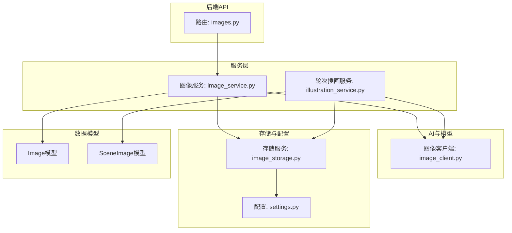
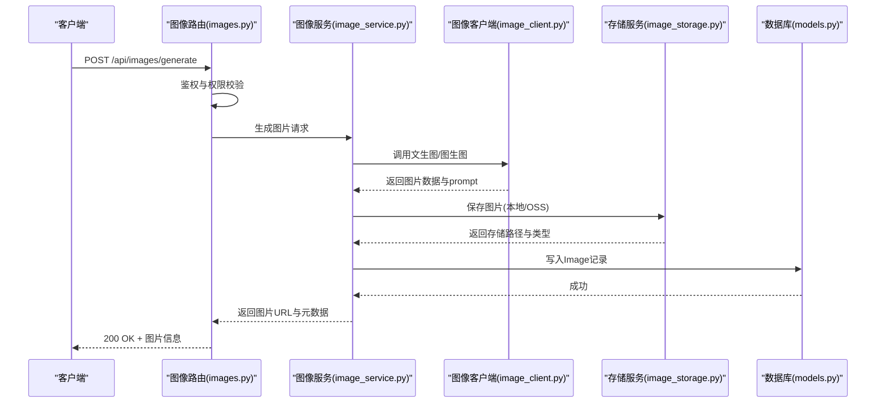
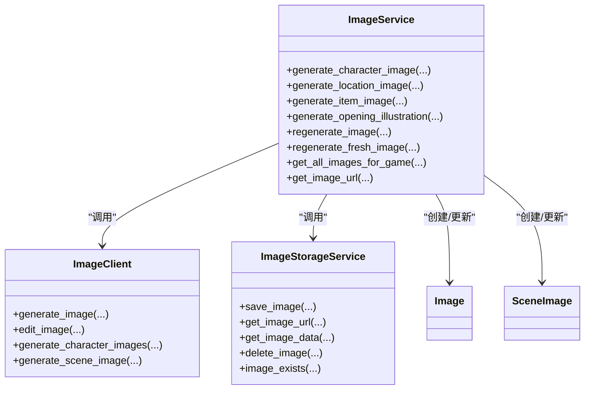

# 图像API

<cite>
**本文引用的文件**
- [src/api/routers/images.py](file://src/api/routers/images.py)
- [src/services/image_service.py](file://src/services/image_service.py)
- [src/services/image_storage.py](file://src/services/image_storage.py)
- [src/ai/image_client.py](file://src/ai/image_client.py)
- [src/game/round/illustration_service.py](file://src/game/round/illustration_service.py)
- [src/api/schemas.py](file://src/api/schemas.py)
- [src/database/models.py](file://src/database/models.py)
- [config/settings.py](file://config/settings.py)
</cite>

## 目录
1. [简介](#简介)
2. [项目结构](#项目结构)
3. [核心组件](#核心组件)
4. [架构总览](#架构总览)
5. [详细组件分析](#详细组件分析)
6. [依赖关系分析](#依赖关系分析)
7. [性能考量](#性能考量)
8. [故障排查指南](#故障排查指南)
9. [结论](#结论)
10. [附录](#附录)

## 简介
本文件为“图像API”的详细RESTful API文档，覆盖图像生成、获取、管理的全部HTTP端点，以及图像生成参数、存储与缓存机制、元数据管理、质量与尺寸规范、与游戏内容的关联与动态更新策略。文档面向开发者与产品/运营人员，既提供代码级实现细节，也提供可操作的使用建议与排障指引。

## 项目结构
图像能力由后端FastAPI路由、图像服务、图像客户端、存储抽象层与数据库模型共同组成，并与游戏轮次插画服务协同工作。

图表来源
- [src/api/routers/images.py](file://src/api/routers/images.py#L1-L986)
- [src/services/image_service.py](file://src/services/image_service.py#L1-L1411)
- [src/game/round/illustration_service.py](file://src/game/round/illustration_service.py#L1-L305)
- [src/ai/image_client.py](file://src/ai/image_client.py#L1-L1240)
- [src/services/image_storage.py](file://src/services/image_storage.py#L1-L375)
- [src/database/models.py](file://src/database/models.py#L162-L234)
- [config/settings.py](file://config/settings.py#L27-L168)

章节来源
- [src/api/routers/images.py](file://src/api/routers/images.py#L1-L986)
- [src/services/image_service.py](file://src/services/image_service.py#L1-L1411)
- [src/services/image_storage.py](file://src/services/image_storage.py#L1-L375)
- [src/ai/image_client.py](file://src/ai/image_client.py#L1-L1240)
- [src/game/round/illustration_service.py](file://src/game/round/illustration_service.py#L1-L305)
- [src/database/models.py](file://src/database/models.py#L162-L234)
- [config/settings.py](file://config/settings.py#L27-L168)

## 核心组件
- 图像API路由：提供生成、重新生成、批量生成、获取、场景插画等端点，统一鉴权与权限校验。
- 图像服务：编排图像生成、存储、数据库记录与版本控制，处理内容审核与错误传播。
- 图像客户端：封装DashScope/Qwen系列OpenAI兼容接口，支持模型降级、图生图、反向提示词与质量控制。
- 存储服务：抽象本地与OSS两种存储，统一路径生成、URL生成、数据读取与删除。
- 数据模型：Image与SceneImage模型承载图片元数据、版本、主图/变体关系、场景插画引用等。
- 轮次插画服务：异步生成每轮场景插画，结合人物/物品图片与故事文本，保证一致性与动态更新。

章节来源
- [src/api/routers/images.py](file://src/api/routers/images.py#L104-L986)
- [src/services/image_service.py](file://src/services/image_service.py#L30-L1411)
- [src/ai/image_client.py](file://src/ai/image_client.py#L30-L1240)
- [src/services/image_storage.py](file://src/services/image_storage.py#L23-L375)
- [src/database/models.py](file://src/database/models.py#L162-L234)
- [src/game/round/illustration_service.py](file://src/game/round/illustration_service.py#L21-L305)

## 架构总览
图像API采用“路由-服务-客户端-存储-模型”分层设计，核心流程如下：
- 请求进入路由层，进行鉴权与权限校验。
- 路由调用图像服务，服务层根据类型选择AI客户端生成或编辑图片。
- 生成完成后，服务层调用存储服务保存文件并写入数据库。
- 前端通过API路径或直链获取图片，支持本地与OSS两种存储类型。

图表来源
- [src/api/routers/images.py](file://src/api/routers/images.py#L104-L218)
- [src/services/image_service.py](file://src/services/image_service.py#L51-L182)
- [src/ai/image_client.py](file://src/ai/image_client.py#L160-L412)
- [src/services/image_storage.py](file://src/services/image_storage.py#L57-L92)
- [src/database/models.py](file://src/database/models.py#L162-L200)

## 详细组件分析

### 1) 图像生成端点
- 生成图片
  - 方法与路径：POST /api/images/generate
  - 请求体字段：game_id, image_type, entity_name, description, entity_key, era, extra_context, feedback
  - 功能：支持人物、地点、物品三类图片生成；人物默认生成1张，减少等待；支持反馈参数强化修改。
  - 响应：返回图片列表，包含image_id、image_url、prompt_used、version、created_at等。
  - 错误：内容审核失败返回400友好提示；其他异常返回500。
- 批量生成关键人物画像
  - 方法与路径：POST /api/images/batch-characters
  - 请求体字段：game_id, character_settings, language
  - 功能：从角色设定中抽取家庭成员与关键人物，逐个生成画像；带延迟避免速率限制。
  - 响应：返回批量生成的图片列表。
- 生成开场故事插画
  - 方法与路径：POST /api/images/opening-illustration
  - 请求体字段：game_id, story_text, character_settings, player_name, player_image_id
  - 功能：DeepSeek分析故事选择场景，结合玩家形象（可选）生成插画。
  - 响应：返回插画URL、场景描述、prompt_used、创建时间。
- 重新生成开场插画
  - 方法与路径：POST /api/images/opening-illustration/regenerate
  - 请求体字段：game_id, story_text, character_settings, player_name, player_image_id, user_prompt, current_illustration_id
  - 功能：基于当前插画与用户提示词重新生成，保持场景一致性。
- 重新生成图片
  - 方法与路径：POST /api/images/regenerate
  - 请求体字段：image_id, feedback, new_description
  - 功能：基于当前图片作为参考，生成变体，保持人物一致性。
- 完全重新生成图片
  - 方法与路径：POST /api/images/regenerate-fresh
  - 请求体字段：image_id, use_deepseek_prompt
  - 功能：丢弃历史修改，使用DeepSeek优化prompt重新文生图。

章节来源
- [src/api/routers/images.py](file://src/api/routers/images.py#L104-L498)
- [src/api/schemas.py](file://src/api/schemas.py#L179-L200)
- [src/api/schemas.py](file://src/api/schemas.py#L272-L288)
- [src/api/schemas.py](file://src/api/schemas.py#L290-L300)
- [src/api/schemas.py](file://src/api/schemas.py#L301-L322)

### 2) 图像获取与管理端点
- 获取游戏所有图片
  - 方法与路径：GET /api/images/game/{game_id}?image_type={type}
  - 功能：按类型过滤返回活跃图片列表。
- 获取图片文件
  - 方法与路径：GET /api/images/file/{game_id}/{image_type}/{filename}
  - 功能：直接返回图片二进制数据，带缓存头；无需鉴权，通过路径参数校验权限。
- 获取轮次场景插画
  - 方法与路径：GET /api/images/scene/{game_id}/{round_number}?stage={event|result}
  - 功能：返回指定轮次的场景插画；未生成返回404。
- 获取所有轮次场景插画
  - 方法与路径：GET /api/images/scenes/{game_id}
  - 功能：返回游戏内所有轮次场景插画列表。

章节来源
- [src/api/routers/images.py](file://src/api/routers/images.py#L625-L800)
- [src/api/routers/images.py](file://src/api/routers/images.py#L662-L712)
- [src/api/routers/images.py](file://src/api/routers/images.py#L716-L774)
- [src/api/routers/images.py](file://src/api/routers/images.py#L776-L800)

### 3) 图像生成参数与风格选项
- 通用参数
  - game_id：所属游戏ID
  - image_type：图片类型（character/location/item）
  - entity_name：实体名称（人物名/地点名/物品名）
  - description：描述文本（年龄、性别、外貌、性格、背景等）
  - entity_key：实体唯一标识（如player_main、npc_1等）
  - era：时代背景（如“现代”、“唐朝”等）
  - extra_context：额外上下文（用于扩展元数据）
  - feedback：用户反馈（用于重新生成时强调修改）
- 人物画像
  - 默认生成1张主图，再生成变体；强调全身像、脚部可见、纵向构图。
  - 支持参考图片（当前图片）进行图生图，保证一致性。
- 地点/物品
  - 地点：强调场景清晰、构图美观、氛围感。
  - 物品：强调居中、简洁背景、自然光影。
- 开场插画
  - 基于DeepSeek分析故事选择场景，结合玩家形象（可选）生成16:9宽屏插画。
- 轮次场景插画
  - 异步生成，优先使用玩家主形象与涉及实体图片作为参考，保持一致性。

章节来源
- [src/api/schemas.py](file://src/api/schemas.py#L179-L189)
- [src/services/image_service.py](file://src/services/image_service.py#L51-L182)
- [src/ai/image_client.py](file://src/ai/image_client.py#L413-L520)
- [src/ai/image_client.py](file://src/ai/image_client.py#L629-L760)
- [src/ai/image_client.py](file://src/ai/image_client.py#L733-L791)

### 4) 图像存储与缓存机制
- 存储类型
  - 本地存储：文件系统，路径为data/images/{game_id}/{type}/{timestamp}_{name}_{uuid}.ext。
  - OSS存储：阿里云OSS，返回签名URL，有效期1小时。
- 路径与URL
  - 本地：返回API路径“/api/images/file/...”，由路由层直接读取。
  - OSS：返回签名URL，便于CDN分发与跨域访问。
- 缓存策略
  - 图片文件接口设置Cache-Control: public, max-age=86400。
- 文件名规则
  - 自动生成唯一文件名，包含时间戳、实体名与UUID，扩展名由生成器决定。
- 删除与存在性检查
  - 支持删除与存在性检查，便于清理与迁移。

章节来源
- [src/services/image_storage.py](file://src/services/image_storage.py#L57-L92)
- [src/services/image_storage.py](file://src/services/image_storage.py#L205-L235)
- [src/services/image_storage.py](file://src/services/image_storage.py#L304-L371)
- [src/api/routers/images.py](file://src/api/routers/images.py#L662-L712)

### 5) 图像元数据管理
- Image模型
  - 字段：image_id, game_id, image_type, entity_name, entity_key, prompt_text, storage_path, storage_type, metadata_json, version, is_active, is_primary, primary_image_id, created_at。
  - 索引：按game_id+image_type+entity_name建立复合索引，支持高效查询。
- SceneImage模型
  - 字段：scene_id, game_id, round_number, stage, scene_description, final_prompt, storage_path, storage_type, referenced_images, importance_score, created_at。
  - 关系：与Game与Image关联，记录轮次场景与引用的实体图片。
- 元数据与版本
  - metadata_json用于存放角色设定、场景描述、参考图片ID等。
  - 版本控制：每次生成/重新生成都会创建新版本，旧版本标记为非活跃，主图/变体通过主图关联维护一致性。

章节来源
- [src/database/models.py](file://src/database/models.py#L162-L200)
- [src/database/models.py](file://src/database/models.py#L203-L234)

### 6) 图像质量控制与尺寸规格
- 尺寸规格
  - 人物全身像：928*1664（竖版，强调全身）
  - 地点/场景：1664*928（16:9宽屏）
  - 物品：1328*1328（正方形）
- 质量与风格
  - 默认写实风格，细节丰富，光影自然。
  - 反向提示词：避免低分辨率、肢体畸形、AI感、半身像、裁剪等问题。
- 模型降级与稳定性
  - 支持多模型降级（如qwen-image-max、qwen-image-plus等），遇到429速率限制自动切换模型或等待重试。
- Prompt增强
  - DeepSeek优化prompt，提升生成质量与一致性。

章节来源
- [src/ai/image_client.py](file://src/ai/image_client.py#L160-L189)
- [src/ai/image_client.py](file://src/ai/image_client.py#L413-L441)
- [src/ai/image_client.py](file://src/ai/image_client.py#L629-L656)
- [src/ai/image_client.py](file://src/ai/image_client.py#L681-L708)
- [src/ai/image_client.py](file://src/ai/image_client.py#L733-L760)

### 7) 图像服务集成与第三方API调用策略
- DashScope/Qwen接口
  - OpenAI兼容格式，支持文生图与图生图，自动解析URL并下载图片。
- 模型降级策略
  - TEXT_TO_IMAGE_MODELS与IMAGE_EDIT_MODELS配置逗号分隔的降级顺序；遇到429立即切换模型，最后模型等待重试。
- 内容审核
  - ContentInspectionError捕获平台内容安全检测触发的错误，返回400并提示用户修改描述。
- 异步轮次插画
  - 使用线程池异步生成，不阻塞游戏主流程；失败日志记录但不影响主线。

章节来源
- [src/ai/image_client.py](file://src/ai/image_client.py#L30-L66)
- [src/ai/image_client.py](file://src/ai/image_client.py#L190-L260)
- [src/ai/image_client.py](file://src/ai/image_client.py#L236-L258)
- [src/game/round/illustration_service.py](file://src/game/round/illustration_service.py#L40-L75)

### 8) 图像与游戏内容的关联关系与动态更新
- 关联关系
  - Image与Game一对多；Image与Image主图/变体自关联；SceneImage与Game一对多。
- 动态更新机制
  - 重新生成：基于当前图片作为参考，生成变体保持一致性。
  - 完全重新生成：丢弃历史修改，使用DeepSeek优化prompt重新生成。
  - 轮次场景插画：异步生成，自动选择涉及人物/物品图片作为参考，保持一致性。
- 版本与活跃状态
  - 每次生成/重新生成都会停用同实体旧图片，仅保留最新活跃版本，避免重复显示。

章节来源
- [src/services/image_service.py](file://src/services/image_service.py#L183-L277)
- [src/services/image_service.py](file://src/services/image_service.py#L278-L365)
- [src/database/models.py](file://src/database/models.py#L188-L196)
- [src/game/round/illustration_service.py](file://src/game/round/illustration_service.py#L166-L213)

## 依赖关系分析

图表来源
- [src/services/image_service.py](file://src/services/image_service.py#L30-L1411)
- [src/ai/image_client.py](file://src/ai/image_client.py#L30-L1240)
- [src/services/image_storage.py](file://src/services/image_storage.py#L23-L375)
- [src/database/models.py](file://src/database/models.py#L162-L234)

章节来源
- [src/services/image_service.py](file://src/services/image_service.py#L30-L1411)
- [src/ai/image_client.py](file://src/ai/image_client.py#L30-L1240)
- [src/services/image_storage.py](file://src/services/image_storage.py#L23-L375)
- [src/database/models.py](file://src/database/models.py#L162-L234)

## 性能考量
- 模型降级与指数退避：在API失败或429时自动切换模型或等待，提升成功率与稳定性。
- 速率限制处理：批量生成人物时加入延迟，避免平台限流。
- 异步生成：轮次场景插画在后台线程执行，不阻塞主流程。
- 缓存策略：图片文件接口设置1天缓存，降低重复请求压力。
- 存储类型：生产环境推荐OSS，具备CDN加速与高可用性。

[本节为通用指导，不直接分析具体文件]

## 故障排查指南
- 内容审核失败（400）
  - 现象：返回“敏感内容”提示，要求修改描述。
  - 处理：简化描述、避免敏感词汇，使用更具体的外貌/服装描述。
- 生成失败（500）
  - 现象：服务端异常，返回通用错误。
  - 处理：检查API密钥、基础URL、网络连通性；查看日志定位具体模型或接口问题。
- 速率限制（429）
  - 现象：短时间内大量请求被拒绝。
  - 处理：启用模型降级；在客户端增加重试与退避策略；合理安排批量任务。
- 图片不存在（404）
  - 现象：文件路径或OSS对象不存在。
  - 处理：确认存储类型配置；检查文件是否被清理；验证路径拼接逻辑。
- 权限不足（401/404）
  - 现象：未登录或游戏归属权校验失败。
  - 处理：确保携带有效用户令牌；确认game_id与用户绑定关系。

章节来源
- [src/api/routers/images.py](file://src/api/routers/images.py#L204-L218)
- [src/ai/image_client.py](file://src/ai/image_client.py#L235-L258)
- [src/api/routers/images.py](file://src/api/routers/images.py#L675-L712)
- [src/api/routers/images.py](file://src/api/routers/images.py#L42-L73)

## 结论
图像API通过清晰的路由层、稳健的服务层、灵活的存储抽象与完善的元数据管理，实现了从生成、存储到获取与版本控制的全链路能力。配合模型降级、内容审核与异步生成策略，能够在保证质量的同时兼顾稳定性与用户体验。建议在生产环境使用OSS存储与CDN分发，并结合缓存策略进一步优化性能。

[本节为总结性内容，不直接分析具体文件]

## 附录

### A. 请求/响应示例（路径引用）
- 生成人物头像
  - 请求：POST /api/images/generate
  - 示例字段：game_id, image_type="character", entity_name, description, feedback
  - 响应：包含image_id, image_url, prompt_used, version
  - 参考路径：[src/api/routers/images.py](file://src/api/routers/images.py#L104-L156), [src/api/schemas.py](file://src/api/schemas.py#L179-L189)
- 生成场景插画（角色头像+场景）
  - 请求：POST /api/images/opening-illustration
  - 示例字段：game_id, story_text, character_settings, player_name, player_image_id
  - 响应：包含image_id, image_url, scene_description, prompt_used
  - 参考路径：[src/api/routers/images.py](file://src/api/routers/images.py#L389-L429), [src/api/schemas.py](file://src/api/schemas.py#L272-L288)
- 生成物品图像
  - 请求：POST /api/images/generate
  - 示例字段：image_type="item", entity_name, description, era
  - 响应：包含image_id, image_url, prompt_used
  - 参考路径：[src/api/routers/images.py](file://src/api/routers/images.py#L179-L201), [src/api/schemas.py](file://src/api/schemas.py#L179-L189)
- 获取轮次场景插画
  - 请求：GET /api/images/scene/{game_id}/{round_number}?stage=result
  - 响应：包含scene_id, image_url, scene_description, referenced_images
  - 参考路径：[src/api/routers/images.py](file://src/api/routers/images.py#L716-L774), [src/api/schemas.py](file://src/api/schemas.py#L324-L333)

### B. 配置要点
- 存储类型：IMAGE_STORAGE_TYPE（local/oss）
- 本地路径：IMAGE_LOCAL_PATH
- OSS配置：OSS_ACCESS_KEY_ID, OSS_ACCESS_KEY_SECRET, OSS_ENDPOINT, OSS_BUCKET_NAME
- 模型降级：TEXT_TO_IMAGE_MODELS, IMAGE_EDIT_MODELS
- API密钥与基础URL：IMAGE_API_KEY, IMAGE_API_BASE_URL
- 参考路径：[config/settings.py](file://config/settings.py#L46-L69)