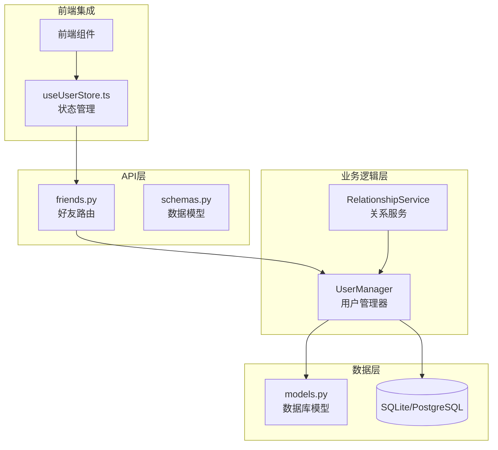
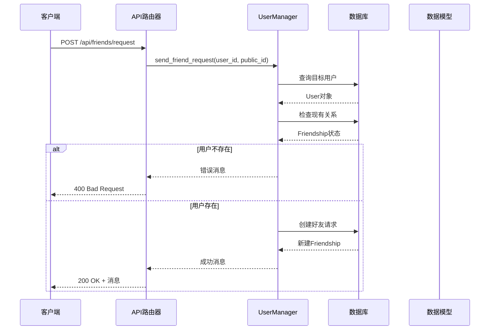
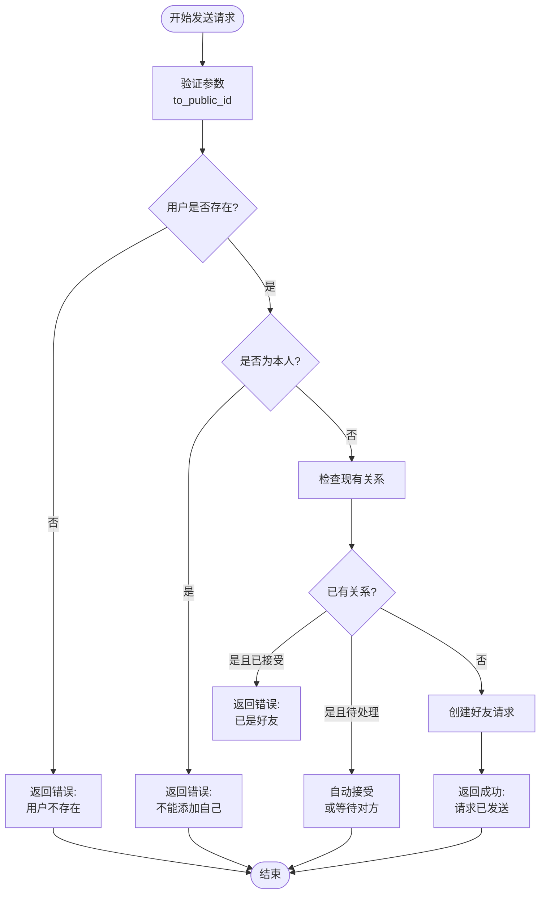
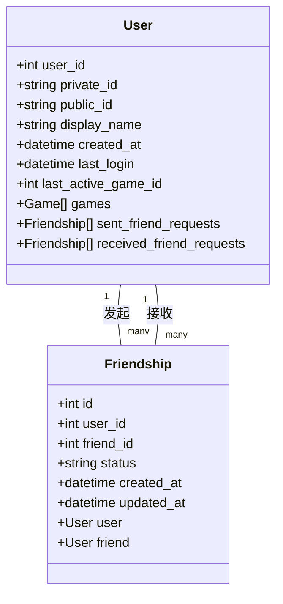
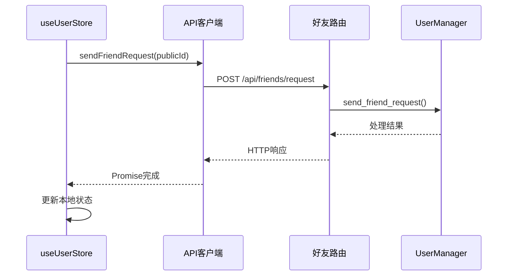
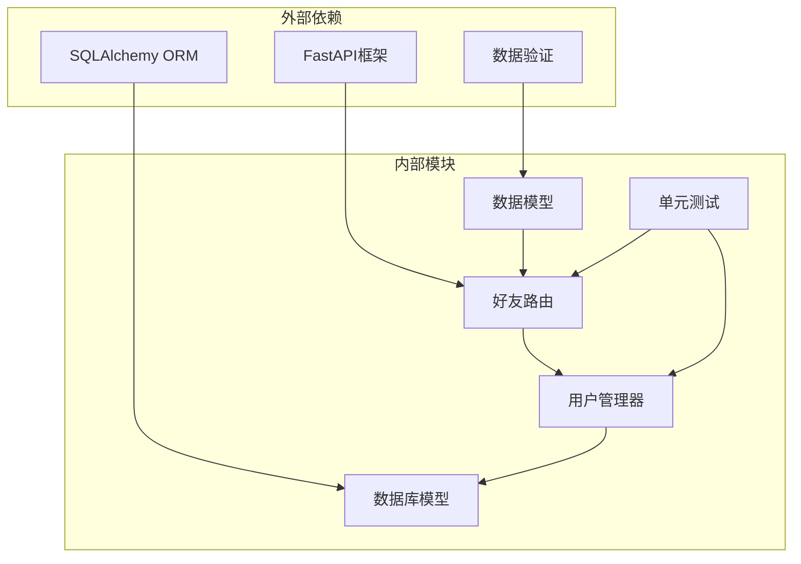

# 好友API

<cite>
**本文档引用的文件**
- [friends.py](file://src/api/routers/friends.py)
- [models.py](file://src/database/models.py)
- [user_manager.py](file://src/database/user_manager.py)
- [schemas.py](file://src/api/schemas.py)
- [test_api_friends.py](file://tests/test_api_friends.py)
- [relationship_service.py](file://src/mcp/relationship_service.py)
- [relationship_events.py](file://src/game/relationship_events.py)
- [useUserStore.ts](file://frontend/src/stores/useUserStore.ts)
</cite>

## 目录
1. [简介](#简介)
2. [项目结构](#项目结构)
3. [核心组件](#核心组件)
4. [架构概览](#架构概览)
5. [详细组件分析](#详细组件分析)
6. [依赖关系分析](#依赖关系分析)
7. [性能考虑](#性能考虑)
8. [故障排除指南](#故障排除指南)
9. [结论](#结论)

## 简介
好友API是故事驱动游戏系统中的核心社交功能模块，负责管理用户间的好友关系、互动消息和资源共享。该系统基于FastAPI构建，采用SQLAlchemy进行数据持久化，支持完整的好友生命周期管理，包括添加、接受/拒绝、删除等操作。

## 项目结构
好友API位于src/api/routers目录下，采用模块化设计，每个路由文件负责特定的功能领域。系统通过依赖注入模式实现松耦合的架构设计。

**图表来源**
- [friends.py](file://src/api/routers/friends.py#L1-L87)
- [user_manager.py](file://src/database/user_manager.py#L34-L401)
- [models.py](file://src/database/models.py#L1-L295)

**章节来源**
- [friends.py](file://src/api/routers/friends.py#L1-L87)
- [models.py](file://src/database/models.py#L1-L295)

## 核心组件
好友API系统包含以下核心组件：

### 1. 路由控制器
- **friends.py**: 提供RESTful API端点，处理好友相关的HTTP请求
- 支持POST /api/friends/request（发送好友请求）
- 支持POST /api/friends/respond（响应好友请求）
- 支持GET /api/friends（获取好友列表）
- 支持GET /api/friends/requests（获取待处理请求）
- 支持DELETE /api/friends/{friend_user_id}（删除好友）

### 2. 数据模型
- **User模型**: 用户基本信息，包含私有ID和公有ID
- **Friendship模型**: 好友关系状态，支持pending/accepted/rejected三种状态
- **Game模型**: 游戏会话，支持公开/私有状态切换

### 3. 业务逻辑
- **UserManager**: 核心业务逻辑处理，包括好友关系管理、游戏权限验证
- **RelationshipService**: MCP服务，处理关系事件检测和触发

**章节来源**
- [friends.py](file://src/api/routers/friends.py#L16-L86)
- [models.py](file://src/database/models.py#L11-L68)
- [user_manager.py](file://src/database/user_manager.py#L34-L401)

## 架构概览
好友API采用分层架构设计，确保关注点分离和代码可维护性。

**图表来源**
- [friends.py](file://src/api/routers/friends.py#L16-L26)
- [user_manager.py](file://src/database/user_manager.py#L165-L224)

## 详细组件分析

### 1. 好友请求管理

#### 发送好友请求

**图表来源**
- [user_manager.py](file://src/database/user_manager.py#L165-L224)

#### 响应好友请求
- **接受请求**: 将状态从pending改为accepted
- **拒绝请求**: 将状态从pending改为rejected
- **权限验证**: 确保只有接收者能响应请求

**章节来源**
- [friends.py](file://src/api/routers/friends.py#L29-L39)
- [user_manager.py](file://src/database/user_manager.py#L226-L253)

### 2. 好友列表管理

#### 获取好友列表
系统支持两种查询方式：
- **已接受的好友**: 返回所有status为accepted的关系
- **待处理请求**: 返回所有status为pending的关系

#### 删除好友
- 验证当前用户与目标用户是否为好友关系
- 删除对应的Friendship记录
- 确保删除操作的原子性

**章节来源**
- [friends.py](file://src/api/routers/friends.py#L42-L86)
- [user_manager.py](file://src/database/user_manager.py#L255-L335)

### 3. 数据模型设计

#### 用户模型 (User)

**图表来源**
- [models.py](file://src/database/models.py#L11-L68)

#### 关系状态管理
- **pending**: 请求已发送，等待对方响应
- **accepted**: 双方已确认好友关系
- **rejected**: 请求已被拒绝

**章节来源**
- [models.py](file://src/database/models.py#L49-L68)
- [user_manager.py](file://src/database/user_manager.py#L50-L58)

### 4. 前端集成

#### 状态管理
前端使用Zustand进行状态管理，主要包含：
- 用户认证信息 (user, token, isAuthenticated)
- 好友列表 (friends)
- 待处理请求 (pendingRequests)

#### API调用流程

**图表来源**
- [useUserStore.ts](file://frontend/src/stores/useUserStore.ts#L91-L93)
- [friends.py](file://src/api/routers/friends.py#L16-L26)

**章节来源**
- [useUserStore.ts](file://frontend/src/stores/useUserStore.ts#L1-L126)

## 依赖关系分析

### 1. 组件依赖图

**图表来源**
- [friends.py](file://src/api/routers/friends.py#L1-L13)
- [user_manager.py](file://src/database/user_manager.py#L1-L12)

### 2. 数据流分析
好友API的数据流遵循标准的RESTful设计模式：

1. **请求验证**: 使用Pydantic模型验证输入参数
2. **业务逻辑**: UserManager处理核心业务规则
3. **数据持久化**: SQLAlchemy ORM管理数据库交互
4. **响应生成**: 返回标准化的JSON响应

**章节来源**
- [schemas.py](file://src/api/schemas.py#L27-L43)
- [models.py](file://src/database/models.py#L1-L295)

## 性能考虑
好友API在设计时充分考虑了性能优化：

### 1. 数据库优化
- **索引策略**: 在user_id和friend_id上建立复合索引
- **查询优化**: 使用JOIN操作减少数据库往返
- **事务管理**: 确保数据一致性的同时最小化锁持有时间

### 2. 缓存策略
- **会话缓存**: 使用SQLAlchemy的会话管理减少连接开销
- **状态缓存**: 前端使用Zustand进行本地状态缓存

### 3. 扩展性设计
- **模块化架构**: 路由、业务逻辑、数据模型分离
- **依赖注入**: 支持测试和扩展
- **异步支持**: 基于FastAPI的异步特性

## 故障排除指南

### 1. 常见错误场景

#### 好友请求错误
- **用户不存在**: 返回400状态码，错误消息"用户不存在"
- **重复请求**: 已发送过请求时返回相应提示
- **自我添加**: 不能添加自己为好友的保护机制

#### 权限错误
- **未授权访问**: 401状态码，需要有效的认证令牌
- **越权操作**: 400状态码，无权操作此请求

#### 数据完整性
- **关系验证**: 确保好友关系的双向一致性和状态完整性

### 2. 调试建议
- **日志记录**: 系统包含详细的日志记录，便于问题追踪
- **单元测试**: 完整的测试覆盖各种边界情况
- **API测试**: 使用TestClient进行集成测试

**章节来源**
- [test_api_friends.py](file://tests/test_api_friends.py#L38-L241)
- [user_manager.py](file://src/database/user_manager.py#L176-L224)

## 结论
好友API系统提供了完整、健壮的社交功能解决方案。通过清晰的架构设计、完善的错误处理机制和良好的扩展性，该系统能够满足故事驱动游戏中的社交需求。

### 主要优势
1. **完整的功能覆盖**: 支持好友关系的全生命周期管理
2. **安全可靠**: 包含多重验证和权限控制机制
3. **易于扩展**: 模块化设计便于功能扩展和维护
4. **性能优化**: 采用多种优化策略确保系统性能

### 未来改进方向
1. **黑名单功能**: 可以添加用户屏蔽和拉黑功能
2. **好友推荐**: 基于共同游戏和互动历史的智能推荐
3. **实时通信**: 集成WebSocket实现实时消息传递
4. **隐私设置**: 更细粒度的隐私控制选项

该系统为故事驱动游戏的社交体验奠定了坚实的基础，能够有效促进玩家间的互动和社区建设。