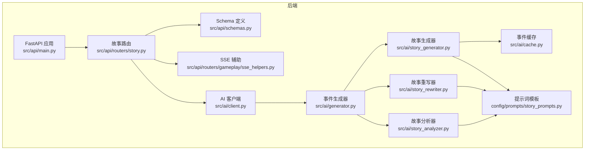
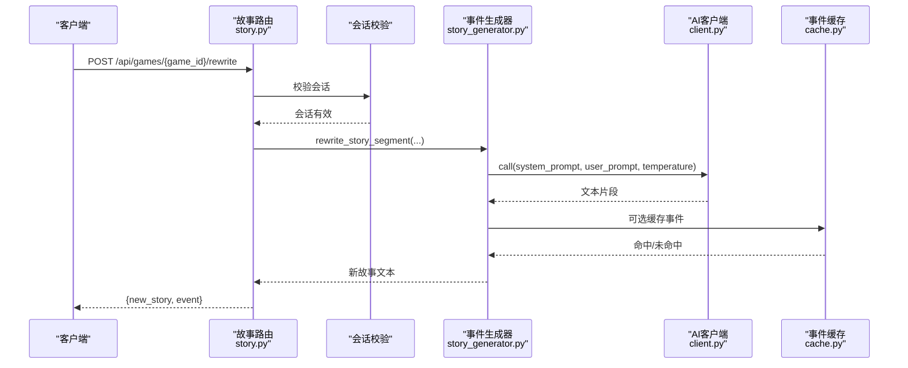
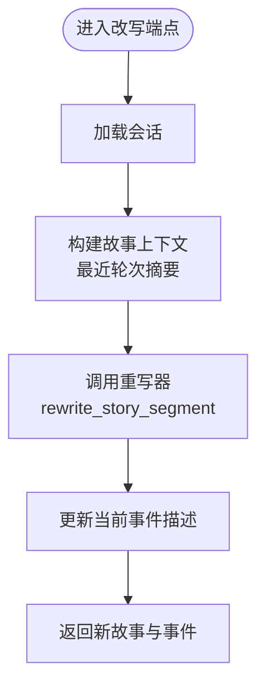
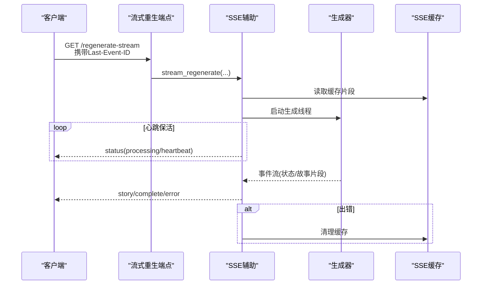
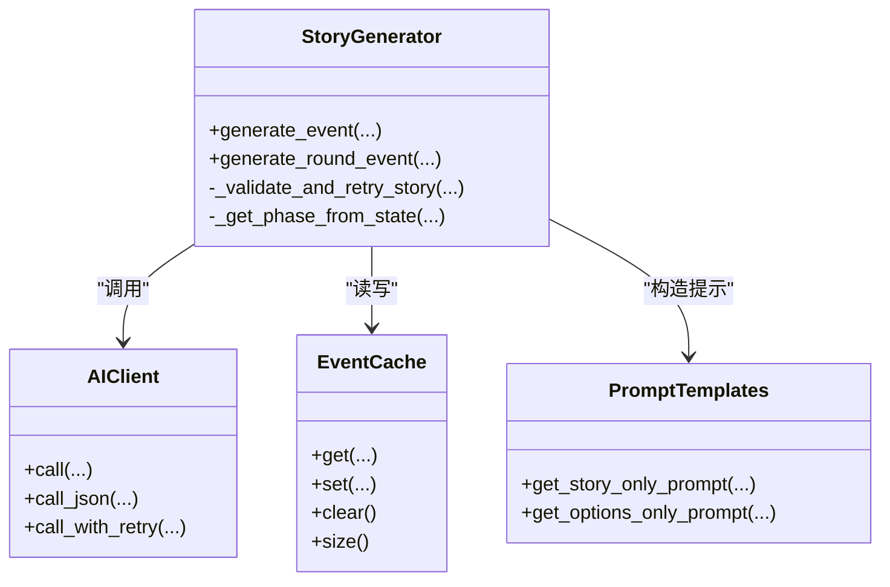
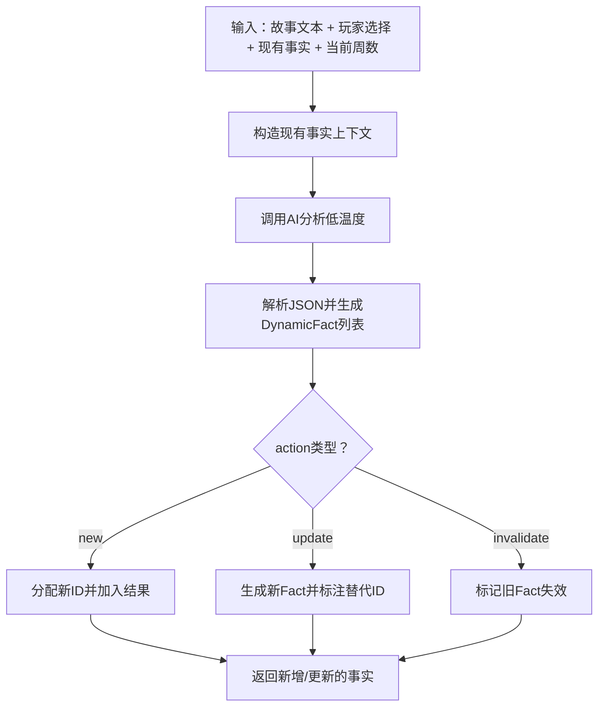
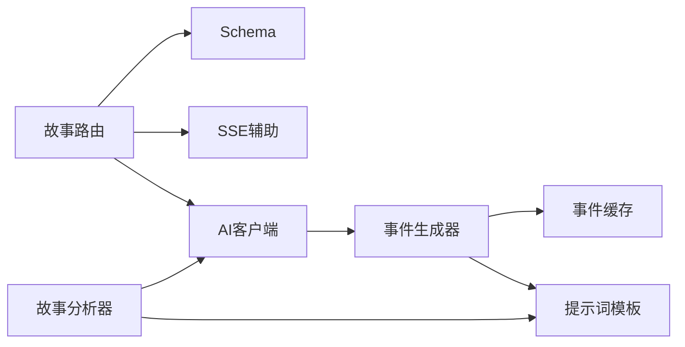

# 故事API

<cite>
**本文引用的文件**
- [src/api/routers/story.py](file://src/api/routers/story.py)
- [src/api/schemas.py](file://src/api/schemas.py)
- [src/ai/story_generator.py](file://src/ai/story_generator.py)
- [src/ai/story_rewriter.py](file://src/ai/story_rewriter.py)
- [src/ai/story_analyzer.py](file://src/ai/story_analyzer.py)
- [src/ai/cache.py](file://src/ai/cache.py)
- [src/ai/client.py](file://src/ai/client.py)
- [src/ai/generator.py](file://src/ai/generator.py)
- [config/prompts/story_prompts.py](file://config/prompts/story_prompts.py)
- [src/api/routers/gameplay/sse_helpers.py](file://src/api/routers/gameplay/sse_helpers.py)
- [src/api/main.py](file://src/api/main.py)
- [config/settings.py](file://config/settings.py)
- [frontend/src/__tests__/components/StoryAdjuster.test.tsx](file://frontend/src/__tests__/components/StoryAdjuster.test.tsx)
</cite>

## 目录
1. [简介](#简介)
2. [项目结构](#项目结构)
3. [核心组件](#核心组件)
4. [架构总览](#架构总览)
5. [详细组件分析](#详细组件分析)
6. [依赖分析](#依赖分析)
7. [性能考虑](#性能考虑)
8. [故障排查指南](#故障排查指南)
9. [结论](#结论)
10. [附录](#附录)

## 简介
本文件为“故事API”的完整RESTful API文档，覆盖故事生成、重写、分析与管理的全部端点与机制。重点说明：
- 故事生成：两阶段流水线（故事文本生成 + 选项生成）、一致性校验与重试、缓存策略
- 故事重写：段落级改写、全文重生成、风格与长度控制
- 故事分析：情感/主题抽取、动态事实提取、预定承诺识别、事实溯源
- SSE流式再生：断点续播、心跳保活、错误注入
- 缓存与性能：事件缓存、随机命中率、热点优化
- 与游戏事件的数据流转：从生成到选项、再到插画与世界模型更新

## 项目结构
故事API位于后端FastAPI应用中，路由集中在“/api/games/{game_id}/”路径下，配合AI模块与提示词模板实现端到端故事处理。

图表来源
- [src/api/main.py](file://src/api/main.py#L35-L90)
- [src/api/routers/story.py](file://src/api/routers/story.py#L1-L210)
- [src/api/schemas.py](file://src/api/schemas.py#L150-L167)
- [src/api/routers/gameplay/sse_helpers.py](file://src/api/routers/gameplay/sse_helpers.py#L137-L200)
- [src/ai/client.py](file://src/ai/client.py#L22-L171)
- [src/ai/generator.py](file://src/ai/generator.py#L88-L174)
- [src/ai/story_generator.py](file://src/ai/story_generator.py#L24-L191)
- [src/ai/story_rewriter.py](file://src/ai/story_rewriter.py#L16-L127)
- [src/ai/story_analyzer.py](file://src/ai/story_analyzer.py#L108-L183)
- [src/ai/cache.py](file://src/ai/cache.py#L13-L139)
- [config/prompts/story_prompts.py](file://config/prompts/story_prompts.py#L612-L800)

章节来源
- [src/api/main.py](file://src/api/main.py#L35-L90)
- [src/api/routers/story.py](file://src/api/routers/story.py#L1-L210)

## 核心组件
- 故事路由层：提供改写、重生成、流式重生成、故事助理聊天等端点
- AI客户端与事件生成器：统一封装AI调用、重试与流式回调
- 故事生成器：两阶段流水线（故事文本 + 选项），一致性校验与缓存
- 故事重写器：段落级改写与全文重生成
- 故事分析器：动态事实提取、预定承诺识别、事实溯源
- SSE辅助：异步队列、心跳保活、断点续播、缓存清理
- 事件缓存：基于签名的MD5键、随机命中率、持久化存储
- 提示词模板：故事生成、结果续写、选项生成、分析与承诺提取

章节来源
- [src/api/routers/story.py](file://src/api/routers/story.py#L26-L210)
- [src/ai/client.py](file://src/ai/client.py#L22-L171)
- [src/ai/generator.py](file://src/ai/generator.py#L88-L174)
- [src/ai/story_generator.py](file://src/ai/story_generator.py#L24-L191)
- [src/ai/story_rewriter.py](file://src/ai/story_rewriter.py#L16-L127)
- [src/ai/story_analyzer.py](file://src/ai/story_analyzer.py#L108-L183)
- [src/ai/cache.py](file://src/ai/cache.py#L13-L139)
- [config/prompts/story_prompts.py](file://config/prompts/story_prompts.py#L612-L800)

## 架构总览
故事API采用“路由 → 会话校验 → 业务流程 → AI流水线 → 返回/流式输出”的控制流。SSE端点通过异步队列与线程池解耦生成任务，支持断点续播与心跳保活。

图表来源
- [src/api/routers/story.py](file://src/api/routers/story.py#L26-L66)
- [src/ai/story_generator.py](file://src/ai/story_generator.py#L24-L191)
- [src/ai/client.py](file://src/ai/client.py#L22-L171)
- [src/ai/cache.py](file://src/ai/cache.py#L13-L139)

## 详细组件分析

### 1) 改写端点：POST /{game_id}/rewrite
- 功能：对当前完整故事进行段落级改写，支持用户指令、角色设定与上下文
- 请求体：RewriteStoryRequest（full_story、segment_to_replace、user_instruction、language）
- 响应：new_story/rewritten_story与当前事件对象
- 上下文构建：取最近若干轮摘要作为“之前的故事脉络”
- 一致性：改写后更新当前事件描述

图表来源
- [src/api/routers/story.py](file://src/api/routers/story.py#L26-L66)
- [src/ai/story_rewriter.py](file://src/ai/story_rewriter.py#L24-L117)

章节来源
- [src/api/routers/story.py](file://src/api/routers/story.py#L26-L66)
- [src/api/schemas.py](file://src/api/schemas.py#L152-L157)

### 2) 重生成端点：POST /{game_id}/regenerate
- 功能：非流式重生成整段故事，使用完整generate_round_event流程
- 行为：清除生成标志、清空当前事件、调用完整流程生成新事件
- 响应：new_story与事件对象

章节来源
- [src/api/routers/story.py](file://src/api/routers/story.py#L69-L115)

### 3) 流式重生成端点：GET /{game_id}/regenerate-stream
- 功能：SSE流式重生成，支持断点续播与心跳保活
- 断点续播：读取Last-Event-ID，回放缓存片段
- 心跳保活：定时发送status事件
- 错误处理：异常时发送error事件并清理缓存

图表来源
- [src/api/routers/story.py](file://src/api/routers/story.py#L117-L155)
- [src/api/routers/gameplay/sse_helpers.py](file://src/api/routers/gameplay/sse_helpers.py#L137-L200)
- [src/api/routers/gameplay/sse_helpers.py](file://src/api/routers/gameplay/sse_helpers.py#L506-L544)

章节来源
- [src/api/routers/story.py](file://src/api/routers/story.py#L117-L155)
- [src/api/routers/gameplay/sse_helpers.py](file://src/api/routers/gameplay/sse_helpers.py#L137-L200)

### 4) 故事助理聊天：POST /{game_id}/chat
- 功能：基于角色设定、当前故事与最近历史回答问题
- 请求体：StoryChatRequest（message、language）
- 响应：StoryChatResponse（reply）

章节来源
- [src/api/routers/story.py](file://src/api/routers/story.py#L158-L210)
- [src/api/schemas.py](file://src/api/schemas.py#L161-L167)

### 5) 两阶段故事生成（AI侧）
- 阶段1：生成纯故事文本（get_story_only_prompt），支持流式回调
- 阶段2：基于故事生成选项（get_options_only_prompt），并校验关系名与质量
- 一致性校验：可选WorldModel约束，发现严重问题时重试一次，固定低温度
- 缓存：事件缓存，随机命中率，持久化

图表来源
- [src/ai/story_generator.py](file://src/ai/story_generator.py#L24-L191)
- [src/ai/client.py](file://src/ai/client.py#L22-L171)
- [src/ai/cache.py](file://src/ai/cache.py#L13-L139)
- [config/prompts/story_prompts.py](file://config/prompts/story_prompts.py#L612-L800)

章节来源
- [src/ai/story_generator.py](file://src/ai/story_generator.py#L32-L191)
- [src/ai/cache.py](file://src/ai/cache.py#L78-L129)

### 6) 故事重写（AI侧）
- 段落级改写：输入完整故事、待替换段落、用户指令、角色设定与上下文
- 全文重生成：基于角色设定与上下文生成全新故事
- 温度与令牌：适配不同任务的温度与max_tokens

章节来源
- [src/ai/story_rewriter.py](file://src/ai/story_rewriter.py#L24-L127)
- [config/prompts/story_prompts.py](file://config/prompts/story_prompts.py#L612-L800)

### 7) 故事分析（AI侧）
- 动态事实提取：AI自主识别事实类型、主体、描述、约束文本
- 生命周期管理：重要性、到期、替代、溯源（source_excerpt、source_story_hash）
- 预定承诺提取：从故事中抽取带时间点的承诺，用于计划事件

图表来源
- [src/ai/story_analyzer.py](file://src/ai/story_analyzer.py#L125-L183)
- [src/ai/story_analyzer.py](file://src/ai/story_analyzer.py#L209-L356)

章节来源
- [src/ai/story_analyzer.py](file://src/ai/story_analyzer.py#L108-L183)
- [src/ai/story_analyzer.py](file://src/ai/story_analyzer.py#L359-L472)

### 8) 与前端交互与示例
- 前端点击“改写故事”按钮，调用rewrite接口，传入full_story与user_instruction
- 测试用例验证API调用与回调

章节来源
- [frontend/src/__tests__/components/StoryAdjuster.test.tsx](file://frontend/src/__tests__/components/StoryAdjuster.test.tsx#L84-L101)

## 依赖分析
- 路由依赖：故事路由依赖会话存储、SSE辅助、Schema定义
- AI依赖：事件生成器依赖AI客户端、提示词模板、缓存
- 分析依赖：故事分析器依赖提示词模板与AI客户端
- 配置依赖：设置项控制API密钥、模型、缓存开关、超时等

图表来源
- [src/api/routers/story.py](file://src/api/routers/story.py#L1-L210)
- [src/api/schemas.py](file://src/api/schemas.py#L150-L167)
- [src/api/routers/gameplay/sse_helpers.py](file://src/api/routers/gameplay/sse_helpers.py#L137-L200)
- [src/ai/client.py](file://src/ai/client.py#L22-L171)
- [src/ai/generator.py](file://src/ai/generator.py#L88-L174)
- [src/ai/cache.py](file://src/ai/cache.py#L13-L139)
- [src/ai/story_analyzer.py](file://src/ai/story_analyzer.py#L108-L183)
- [config/prompts/story_prompts.py](file://config/prompts/story_prompts.py#L612-L800)

章节来源
- [src/api/routers/story.py](file://src/api/routers/story.py#L1-L210)
- [src/ai/story_generator.py](file://src/ai/story_generator.py#L24-L191)
- [src/ai/story_analyzer.py](file://src/ai/story_analyzer.py#L108-L183)

## 性能考虑
- 事件缓存：基于签名的MD5键，随机30%命中率，避免过度缓存导致的同质化
- 流式生成：SSE队列与线程分离，零延迟事件转发，心跳保活避免超时
- 温度策略：生成阶段采用渐进式温度下降，重试阶段固定保守温度
- 超时与降级：生成超时自动重置，AI失败时回退文本或默认选项
- 并发与一致性：重生成前清理标志位与当前事件，保证流程一致性

章节来源
- [src/ai/cache.py](file://src/ai/cache.py#L78-L129)
- [src/ai/story_generator.py](file://src/ai/story_generator.py#L106-L135)
- [src/ai/story_generator.py](file://src/ai/story_generator.py#L390-L426)
- [src/api/routers/gameplay/sse_helpers.py](file://src/api/routers/gameplay/sse_helpers.py#L506-L544)
- [config/settings.py](file://config/settings.py#L104-L106)

## 故障排查指南
- 404会话缺失：若game_id无活跃会话，需先加载游戏
- 500生成失败：检查AI密钥、模型、提示词与重试逻辑
- SSE断开：确认Last-Event-ID与缓存，心跳超时会触发错误事件
- 一致性校验失败：观察“retry”状态事件，前端会清空旧故事并重新流式渲染

章节来源
- [src/api/routers/story.py](file://src/api/routers/story.py#L16-L23)
- [src/api/routers/gameplay/sse_helpers.py](file://src/api/routers/gameplay/sse_helpers.py#L506-L544)
- [src/ai/story_generator.py](file://src/ai/story_generator.py#L377-L426)

## 结论
故事API通过清晰的路由分层、稳健的AI流水线与完善的SSE机制，实现了高质量、可定制、可追踪的故事生成与管理能力。事件缓存与一致性校验保障了性能与质量，断点续播与心跳保活提升了用户体验。建议在生产环境中启用事件缓存、合理设置超时与重试策略，并持续监控AI调用成本与稳定性。

## 附录

### A. 端点一览与请求/响应要点
- POST /api/games/{game_id}/rewrite
  - 请求：RewriteStoryRequest（full_story、segment_to_replace、user_instruction、language）
  - 响应：new_story、rewritten_story、event
- POST /api/games/{game_id}/regenerate
  - 请求：RegenerateStoryRequest（language）
  - 响应：new_story、event
- GET /api/games/{game_id}/regenerate-stream
  - 响应：SSE（status/story/complete/error），支持Last-Event-ID断点续播
- POST /api/games/{game_id}/chat
  - 请求：StoryChatRequest（message、language）
  - 响应：StoryChatResponse（reply）

章节来源
- [src/api/routers/story.py](file://src/api/routers/story.py#L26-L210)
- [src/api/schemas.py](file://src/api/schemas.py#L152-L167)

### B. AI服务集成与调用限制
- 集成方式：统一AIClient封装，支持JSON解析、重试与流式回调
- 调用限制：OPENAI_API_KEY必填，模型与基础URL可配置；生成超时默认60秒
- 重试策略：错误反馈注入，首次失败附加原因提示，最多多次尝试

章节来源
- [src/ai/client.py](file://src/ai/client.py#L22-L171)
- [config/settings.py](file://config/settings.py#L30-L34)
- [config/settings.py](file://config/settings.py#L104-L106)

### C. 故事缓存机制与性能优化
- 缓存键：基于年龄、资源、周数、决策计数与语言的签名，MD5摘要
- 命中策略：随机30%命中率，兼顾多样性与性能
- 持久化：events_cache.json，异常时安全降级

章节来源
- [src/ai/cache.py](file://src/ai/cache.py#L47-L129)

### D. 故事与游戏事件的数据流转
- 生成：generate_round_event → 事件对象（event_description + options）
- 插画：异步触发每轮场景插画生成，避免阻塞主流程
- 分析：动态事实写入世界模型，支持后续生成约束与承诺计划

章节来源
- [src/api/routers/gameplay/sse_helpers.py](file://src/api/routers/gameplay/sse_helpers.py#L17-L118)
- [src/ai/story_generator.py](file://src/ai/story_generator.py#L292-L331)
- [src/ai/story_analyzer.py](file://src/ai/story_analyzer.py#L125-L183)