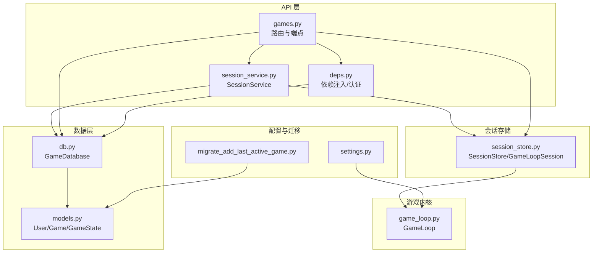
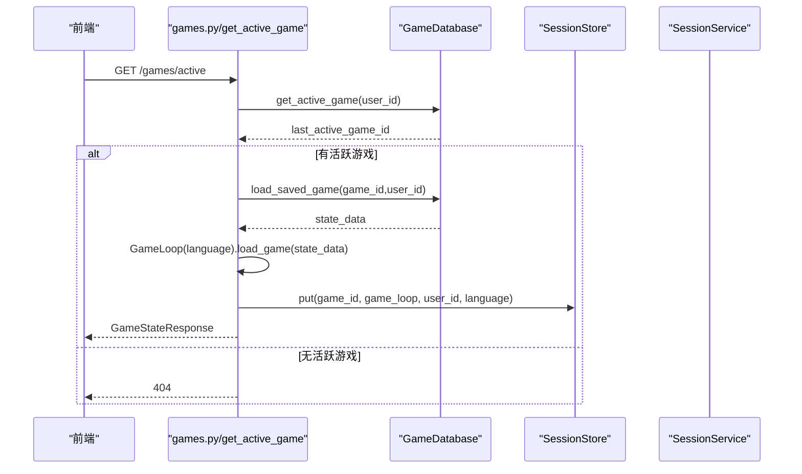
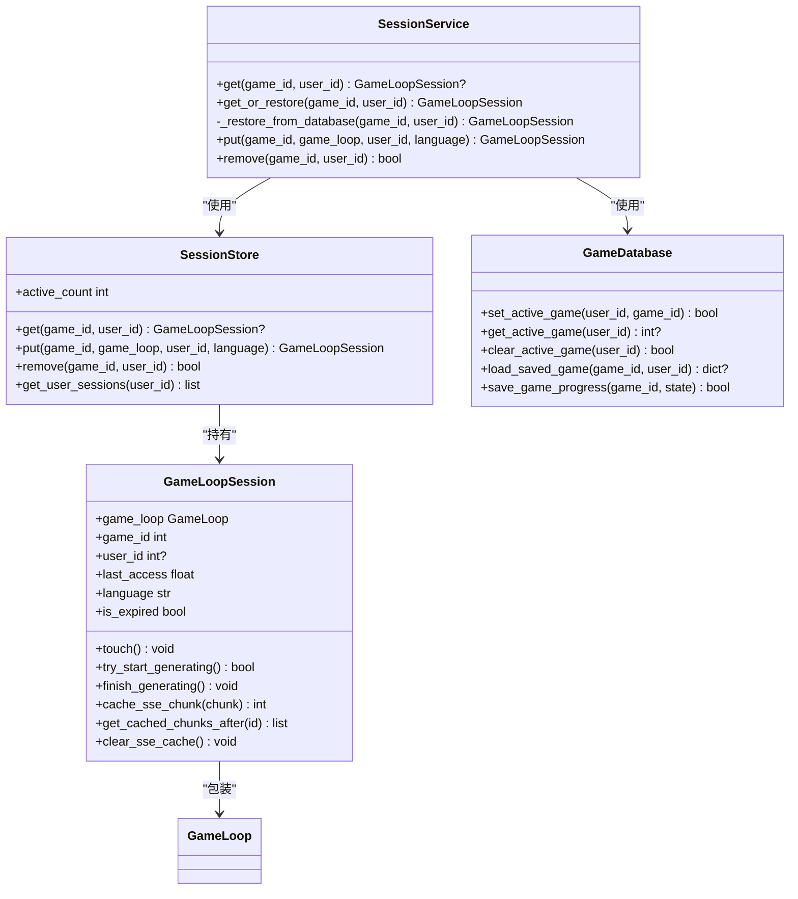
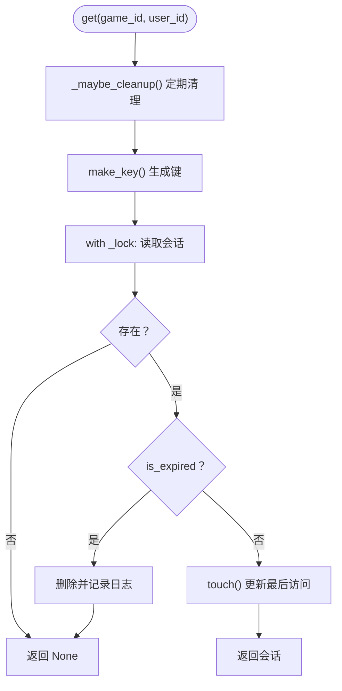
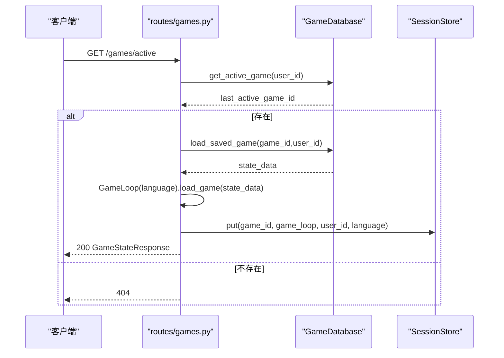
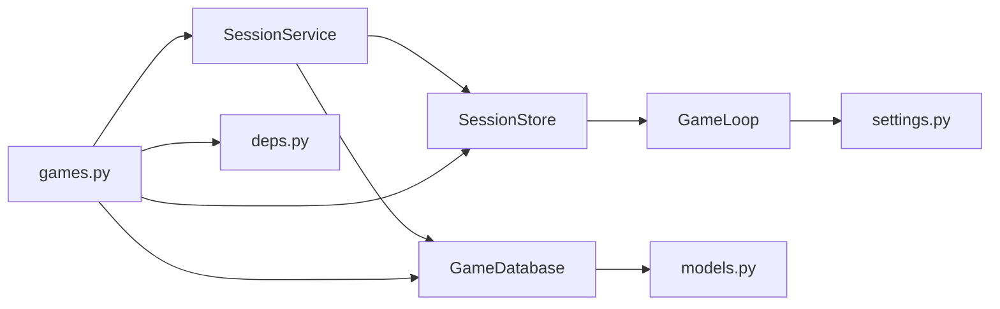

# 会话管理

<cite>
**本文引用的文件**
- [src/api/services/session_service.py](file://src/api/services/session_service.py)
- [src/api/session_store.py](file://src/api/session_store.py)
- [src/api/routers/games.py](file://src/api/routers/games.py)
- [src/database/db.py](file://src/database/db.py)
- [src/database/models.py](file://src/database/models.py)
- [src/api/deps.py](file://src/api/deps.py)
- [src/game/game_loop.py](file://src/game/game_loop.py)
- [src/api/schemas.py](file://src/api/schemas.py)
- [config/settings.py](file://config/settings.py)
- [migrate_add_last_active_game.py](file://migrate_add_last_active_game.py)
- [docs/session-recovery-test-plan.md](file://docs/session-recovery-test-plan.md)
- [frontend/src/__tests__/hooks/useSessionRecovery.test.ts](file://frontend/src/__tests__/hooks/useSessionRecovery.test.ts)
</cite>

## 目录
1. [简介](#简介)
2. [项目结构](#项目结构)
3. [核心组件](#核心组件)
4. [架构总览](#架构总览)
5. [详细组件分析](#详细组件分析)
6. [依赖分析](#依赖分析)
7. [性能考量](#性能考量)
8. [故障排除指南](#故障排除指南)
9. [结论](#结论)
10. [附录](#附录)

## 简介
本文件面向“会话管理”功能，提供完整的API文档与技术说明，覆盖以下主题：
- 服务端会话存储机制：内存会话存储、用户活跃游戏跟踪、会话恢复策略
- get_active_game 端点的工作原理：iPad 等设备上 localStorage 失效时的会话恢复
- SessionService 的服务层设计：会话获取、恢复与清理的完整流程
- 会话存储配置项与性能考虑
- 会话过期处理、并发访问控制与安全策略
- 会话状态与数据库状态的一致性保证机制
- 最佳实践与故障排除指南

## 项目结构
围绕会话管理的关键模块与文件如下：
- 服务层：SessionService（统一获取/恢复逻辑）
- 存储层：SessionStore（内存会话存储）、GameLoopSession（会话包装）
- 数据层：GameDatabase（数据库操作）、User/Game 模型（活跃游戏跟踪）
- 路由层：games.py（get_active_game 等会话相关端点）
- 依赖注入：deps.py（认证、会话获取）
- 游戏内核：GameLoop（状态装载/生成）
- 配置：settings.py（超时、资源衰减等）
- 迁移：migrate_add_last_active_game.py（新增 last_active_game_id 字段）

图表来源
- [src/api/routers/games.py](file://src/api/routers/games.py#L1-L389)
- [src/api/services/session_service.py](file://src/api/services/session_service.py#L1-L158)
- [src/api/session_store.py](file://src/api/session_store.py#L1-L200)
- [src/database/db.py](file://src/database/db.py#L1-L910)
- [src/database/models.py](file://src/database/models.py#L1-L295)
- [src/api/deps.py](file://src/api/deps.py#L1-L150)
- [src/game/game_loop.py](file://src/game/game_loop.py#L1-L592)
- [config/settings.py](file://config/settings.py#L1-L168)
- [migrate_add_last_active_game.py](file://migrate_add_last_active_game.py#L1-L61)

章节来源
- [src/api/routers/games.py](file://src/api/routers/games.py#L1-L389)
- [src/api/services/session_service.py](file://src/api/services/session_service.py#L1-L158)
- [src/api/session_store.py](file://src/api/session_store.py#L1-L200)
- [src/database/db.py](file://src/database/db.py#L1-L910)
- [src/database/models.py](file://src/database/models.py#L1-L295)
- [src/api/deps.py](file://src/api/deps.py#L1-L150)
- [src/game/game_loop.py](file://src/game/game_loop.py#L1-L592)
- [config/settings.py](file://config/settings.py#L1-L168)
- [migrate_add_last_active_game.py](file://migrate_add_last_active_game.py#L1-L61)

## 核心组件
- SessionService：统一的会话获取/恢复入口，负责内存查找与数据库恢复
- SessionStore：线程安全的内存会话存储，支持过期清理、用户会话枚举与缓存
- GameLoopSession：会话包装器，包含 GameLoop 实例、元数据与 SSE 缓存
- GameDatabase：数据库操作封装，提供活跃游戏设置/查询/清理、状态加载/保存、时间回溯存档
- User/Game 模型：User.last_active_game_id 字段用于服务端会话恢复
- games.py 路由：get_active_game 端点、save_game/load_game 等与会话强相关的端点
- deps.py：认证与会话获取依赖，支持 Cookie 与 Bearer Token，提供 get_game_session

章节来源
- [src/api/services/session_service.py](file://src/api/services/session_service.py#L24-L158)
- [src/api/session_store.py](file://src/api/session_store.py#L100-L200)
- [src/database/db.py](file://src/database/db.py#L601-L684)
- [src/database/models.py](file://src/database/models.py#L22-L23)
- [src/api/routers/games.py](file://src/api/routers/games.py#L83-L126)
- [src/api/deps.py](file://src/api/deps.py#L135-L150)

## 架构总览
会话管理采用“内存优先 + 数据库兜底”的双层策略：
- 内存层：SessionStore 以 key 形式缓存 GameLoopSession，提供快速访问与过期检测
- 数据库层：当内存无会话时，SessionService 从 GameDatabase 加载最新状态重建 GameLoop 并写入内存
- 活跃游戏跟踪：User.last_active_game_id 记录最近活跃游戏，get_active_game 用于设备/浏览器切换后的恢复

图表来源
- [src/api/routers/games.py](file://src/api/routers/games.py#L83-L126)
- [src/database/db.py](file://src/database/db.py#L629-L659)
- [src/api/session_store.py](file://src/api/session_store.py#L138-L156)

章节来源
- [src/api/routers/games.py](file://src/api/routers/games.py#L83-L126)
- [src/database/db.py](file://src/database/db.py#L629-L659)
- [src/api/session_store.py](file://src/api/session_store.py#L138-L156)

## 详细组件分析

### SessionService 服务层设计
- get(game_id, user_id)：仅从内存获取，不自动恢复
- get_or_restore(game_id, user_id)：内存无则从数据库恢复，异常时抛出 404
- _restore_from_database：加载 state_data → GameLoop.load_game → 写入 SessionStore
- put/remove：创建/更新与移除会话

图表来源
- [src/api/services/session_service.py](file://src/api/services/session_service.py#L24-L158)
- [src/api/session_store.py](file://src/api/session_store.py#L15-L98)
- [src/database/db.py](file://src/database/db.py#L603-L683)
- [src/game/game_loop.py](file://src/game/game_loop.py#L25-L68)

章节来源
- [src/api/services/session_service.py](file://src/api/services/session_service.py#L24-L158)
- [src/api/session_store.py](file://src/api/session_store.py#L15-L98)
- [src/database/db.py](file://src/database/db.py#L603-L683)
- [src/game/game_loop.py](file://src/game/game_loop.py#L25-L68)

### 内存会话存储（SessionStore）
- 会话键规则：user_{user_id}_game_{game_id} 或 anon_game_{game_id}
- 过期策略：默认 2 小时；get 时检查并清理过期；定期清理任务
- 线程安全：内部锁保护
- 用户会话枚举：按前缀过滤非过期会话
- SSE 缓存：支持断线重连的事件流缓存与回放

图表来源
- [src/api/session_store.py](file://src/api/session_store.py#L123-L136)
- [src/api/session_store.py](file://src/api/session_store.py#L184-L195)

章节来源
- [src/api/session_store.py](file://src/api/session_store.py#L100-L200)

### get_active_game 端点与会话恢复
- 作用：iPad 等设备 localStorage 失效时，从服务端恢复活跃游戏
- 流程：查询 User.last_active_game_id → 校验归属 → 从 GameDatabase.load_saved_game 加载状态 → GameLoop.load_game → 写入 SessionStore → 返回 GameStateResponse
- 异常：无活跃游戏或游戏不存在时返回 404，并清理无效引用

图表来源
- [src/api/routers/games.py](file://src/api/routers/games.py#L83-L126)
- [src/database/db.py](file://src/database/db.py#L629-L659)
- [src/database/db.py](file://src/database/db.py#L385-L426)

章节来源
- [src/api/routers/games.py](file://src/api/routers/games.py#L83-L126)
- [src/database/db.py](file://src/database/db.py#L629-L659)
- [src/database/db.py](file://src/database/db.py#L385-L426)

### 会话清理与过期处理
- 内存过期：GameLoopSession.is_expired 基于 last_access 与 SESSION_TIMEOUT（2 小时）
- 定期清理：SessionStore._maybe_cleanup 每 5 分钟扫描并删除过期会话
- 数据库清理：GameDatabase.clear_active_game(user_id) 清空无效引用

章节来源
- [src/api/session_store.py](file://src/api/session_store.py#L45-L46)
- [src/api/session_store.py](file://src/api/session_store.py#L184-L195)
- [src/database/db.py](file://src/database/db.py#L661-L683)

### 并发访问控制与生成锁
- try_start_generating/finish_generating：基于布尔标志的简单互斥，避免并发生成
- SSE 缓存：cache_sse_chunk/get_cached_chunks_after/clear_sse_cache 支持断线重连

章节来源
- [src/api/session_store.py](file://src/api/session_store.py#L48-L97)

### 安全策略与认证
- 优先从 Cookie 读取 auth_token，其次 Authorization Bearer，提升 iPad Safari 等设备持久化体验
- get_current_user/get_current_user_optional 提供严格/宽松两种认证依赖
- get_game_session：直接从 SessionStore 获取会话，不存在则 404

章节来源
- [src/api/deps.py](file://src/api/deps.py#L70-L132)
- [src/api/deps.py](file://src/api/deps.py#L135-L150)

### 会话状态与数据库状态一致性
- 活跃游戏一致性：User.last_active_game_id 与 Game.user_id 双重校验，若游戏不存在则清理引用
- 状态加载：load_saved_game 优先最新 GameState，回退到 Game.initial_state，并补充缺失字段
- 保存进度：save_game_progress 写入 GameState 并更新 Game.updated_at

章节来源
- [src/database/db.py](file://src/database/db.py#L629-L659)
- [src/database/db.py](file://src/database/db.py#L385-L426)
- [src/database/db.py](file://src/database/db.py#L336-L383)

### API 定义与端点说明
- GET /games/active：获取并恢复用户当前活跃游戏
- POST /games：创建新游戏并写入会话
- GET /games/{game_id}：加载指定游戏并写入会话
- POST /games/{game_id}/save：通过 SessionService 统一获取/恢复后保存
- DELETE /games/{game_id}：删除游戏并清理会话与活跃引用
- POST /games/{game_id}/clear-cache：强制从会话移除以触发下次数据库重载

章节来源
- [src/api/routers/games.py](file://src/api/routers/games.py#L26-L58)
- [src/api/routers/games.py](file://src/api/routers/games.py#L83-L126)
- [src/api/routers/games.py](file://src/api/routers/games.py#L129-L160)
- [src/api/routers/games.py](file://src/api/routers/games.py#L163-L183)
- [src/api/routers/games.py](file://src/api/routers/games.py#L186-L208)
- [src/api/routers/games.py](file://src/api/routers/games.py#L211-L224)

## 依赖分析
- SessionService 依赖 SessionStore 与 GameDatabase
- SessionStore 依赖 GameLoop
- games.py 路由依赖 deps（认证）、SessionService/SessionStore、GameDatabase
- GameDatabase 依赖 SQLAlchemy 模型（User/Game/GameState）
- settings.py 为 GameLoop 提供生成超时、里程碑等常量

图表来源
- [src/api/services/session_service.py](file://src/api/services/session_service.py#L16-L19)
- [src/api/session_store.py](file://src/api/session_store.py#L7-L8)
- [src/api/routers/games.py](file://src/api/routers/games.py#L7-L12)
- [src/database/db.py](file://src/database/db.py#L7-L8)
- [src/database/models.py](file://src/database/models.py#L1-L8)
- [src/game/game_loop.py](file://src/game/game_loop.py#L20-L21)
- [config/settings.py](file://config/settings.py#L104-L106)

章节来源
- [src/api/services/session_service.py](file://src/api/services/session_service.py#L16-L19)
- [src/api/session_store.py](file://src/api/session_store.py#L7-L8)
- [src/api/routers/games.py](file://src/api/routers/games.py#L7-L12)
- [src/database/db.py](file://src/database/db.py#L7-L8)
- [src/database/models.py](file://src/database/models.py#L1-L8)
- [src/game/game_loop.py](file://src/game/game_loop.py#L20-L21)
- [config/settings.py](file://config/settings.py#L104-L106)

## 性能考量
- 内存命中率：SessionStore 以 O(1) 键访问，建议合理设置 SESSION_TIMEOUT 与清理间隔
- 清理策略：定期清理降低内存占用，避免频繁 GC 压力
- 数据库 IO：get_active_game/save_game 为热点路径，建议：
  - 为 User.last_active_game_id 建立索引（迁移脚本已包含）
  - 使用事务批量写入 GameState
- 生成超时：settings.GENERATION_TIMEOUT 控制 AI 生成上限，防止阻塞
- SSE 缓存大小：MAX_SSE_CACHE_SIZE 控制事件流缓存长度，避免内存膨胀

章节来源
- [src/api/session_store.py](file://src/api/session_store.py#L11-L12)
- [src/api/session_store.py](file://src/api/session_store.py#L184-L195)
- [src/database/db.py](file://src/database/db.py#L336-L383)
- [config/settings.py](file://config/settings.py#L104-L106)
- [migrate_add_last_active_game.py](file://migrate_add_last_active_game.py#L39-L44)

## 故障排除指南
- 症状：iPad 等设备刷新后无法继续游戏
  - 检查 get_active_game 是否返回 404（可能已删除或引用失效）
  - 使用 DELETE /games/{game_id}/clear-cache 清理会话缓存，强制下次从数据库恢复
- 症状：404 “No active game found”
  - 确认 User.last_active_game_id 是否仍指向有效游戏
  - 若无效，调用 GameDatabase.clear_active_game 清理
- 症状：选择时报错 “No current event”
  - 前端已修复：自动恢复后重新生成事件
  - 后端：SessionService 会在必要时从数据库恢复 current_event
- 症状：会话频繁过期
  - 调整 SESSION_TIMEOUT 与清理间隔
  - 检查是否有大量并发生成导致 try_start_generating 失败
- 症状：SSE 断线重连丢失中间事件
  - 检查 MAX_SSE_CACHE_SIZE 与 cache_sse_chunk 回放逻辑

章节来源
- [src/api/routers/games.py](file://src/api/routers/games.py#L83-L126)
- [src/database/db.py](file://src/database/db.py#L661-L683)
- [src/api/session_store.py](file://src/api/session_store.py#L65-L97)
- [docs/session-recovery-test-plan.md](file://docs/session-recovery-test-plan.md#L1-L158)
- [frontend/src/__tests__/hooks/useSessionRecovery.test.ts](file://frontend/src/__tests__/hooks/useSessionRecovery.test.ts#L78-L131)

## 结论
本会话管理方案通过“内存优先 + 数据库兜底”的双层设计，结合 User.last_active_game_id 的服务端恢复能力，实现了跨设备、跨浏览器的稳定会话恢复。SessionService 统一了获取/恢复/清理流程，SessionStore 提供高性能的内存缓存与过期控制，GameDatabase 保障状态一致性与时间回溯能力。配合合理的配置与监控，可在高并发场景下维持良好的用户体验。

## 附录

### 配置选项与最佳实践
- 会话超时（SESSION_TIMEOUT）：默认 2 小时，建议根据业务调整
- 清理间隔（cleanup_interval）：默认 5 分钟，平衡内存与 CPU
- SSE 缓存上限（MAX_SSE_CACHE_SIZE）：默认 500，建议根据事件流长度调整
- 生成超时（GENERATION_TIMEOUT）：默认 60 秒，避免长时间阻塞
- 认证优先级：Cookie > Bearer，提升移动端持久化体验
- 最佳实践：
  - 为 User.last_active_game_id 建立索引（迁移脚本已包含）
  - 使用 SessionService 统一获取/恢复，避免绕过
  - 在 save_game 前通过 SessionService.get_or_restore 确保会话可用
  - 定期清理过期会话，监控 active_count

章节来源
- [src/api/session_store.py](file://src/api/session_store.py#L11-L12)
- [src/api/session_store.py](file://src/api/session_store.py#L184-L195)
- [src/api/session_store.py](file://src/api/session_store.py#L20-L21)
- [config/settings.py](file://config/settings.py#L104-L106)
- [src/api/deps.py](file://src/api/deps.py#L70-L87)
- [migrate_add_last_active_game.py](file://migrate_add_last_active_game.py#L39-L44)