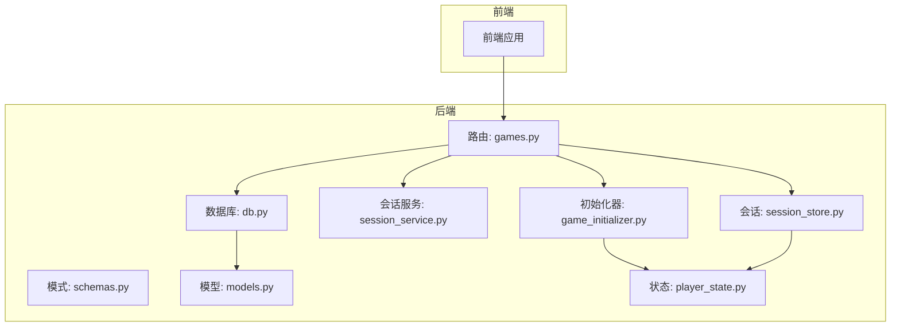
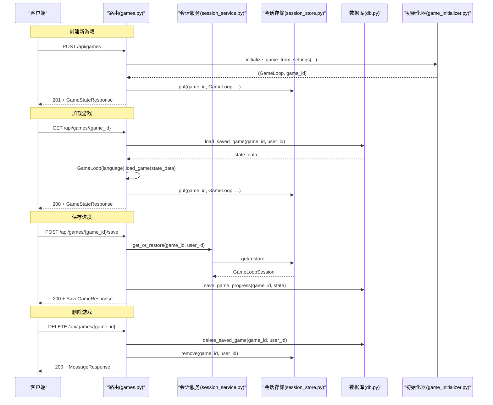
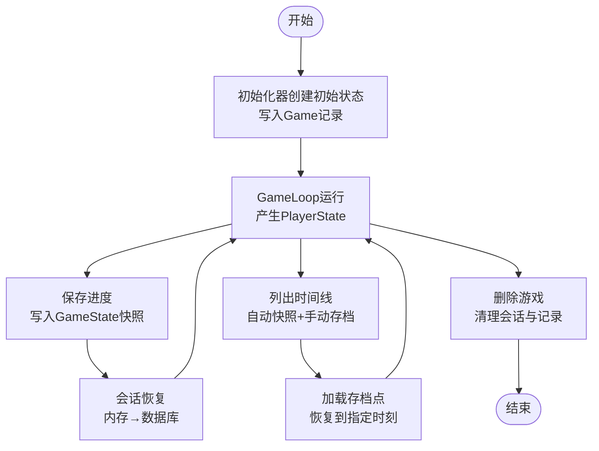
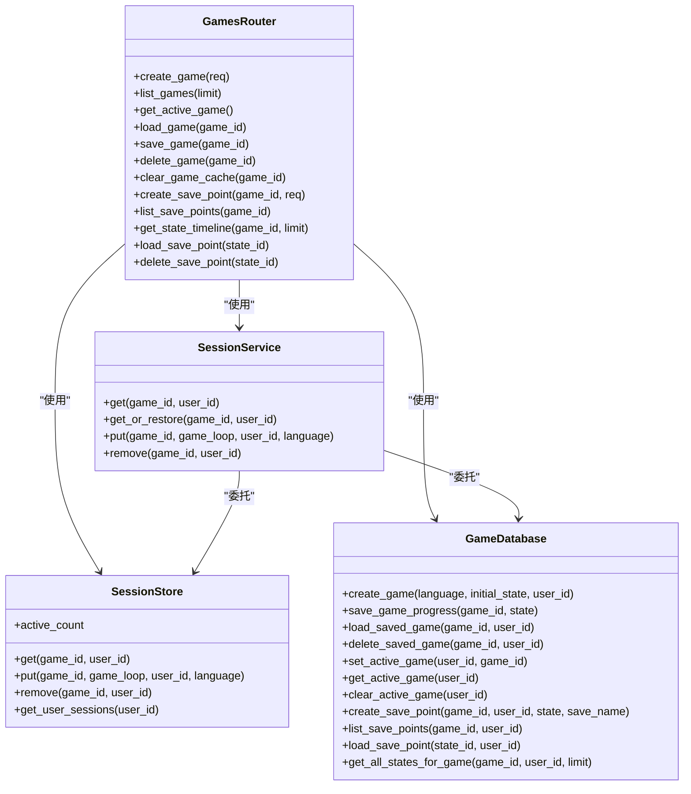

# 基础游戏管理

<cite>
**本文引用的文件**
- [src/api/routers/games.py](file://src/api/routers/games.py)
- [src/api/schemas.py](file://src/api/schemas.py)
- [src/api/session_store.py](file://src/api/session_store.py)
- [src/api/services/session_service.py](file://src/api/services/session_service.py)
- [src/api/deps.py](file://src/api/deps.py)
- [src/database/db.py](file://src/database/db.py)
- [src/database/models.py](file://src/database/models.py)
- [src/game/game_initializer.py](file://src/game/game_initializer.py)
- [src/game/state/player_state.py](file://src/game/state/player_state.py)
- [tests/test_api_games.py](file://tests/test_api_games.py)
</cite>

## 目录
1. [简介](#简介)
2. [项目结构](#项目结构)
3. [核心组件](#核心组件)
4. [架构总览](#架构总览)
5. [详细组件分析](#详细组件分析)
6. [依赖分析](#依赖分析)
7. [性能考量](#性能考量)
8. [故障排查指南](#故障排查指南)
9. [结论](#结论)
10. [附录](#附录)

## 简介
本文件面向“基础游戏管理”能力，围绕游戏创建、加载、保存、删除的完整生命周期，系统化梳理API端点、请求/响应模型、会话与持久化策略，并给出错误处理与状态码说明。读者无需深入代码即可理解如何通过HTTP接口完成角色设置初始化、游戏状态恢复、进度持久化与时间回溯存档等操作。

## 项目结构
- 后端采用FastAPI路由组织，游戏相关路由集中在games.py；请求/响应模型定义于schemas.py；会话与数据库分别由session_store.py与db.py负责；游戏初始化逻辑在game_initializer.py；玩家状态模型在player_state.py。
- 前端通过API层进行交互，后端提供统一的会话恢复与自动保存机制，保障iPad等设备上localStorage失效后的会话恢复。

图表来源
- [src/api/routers/games.py](file://src/api/routers/games.py#L1-L389)
- [src/api/schemas.py](file://src/api/schemas.py#L1-L333)
- [src/api/session_store.py](file://src/api/session_store.py#L1-L200)
- [src/api/services/session_service.py](file://src/api/services/session_service.py#L1-L158)
- [src/database/db.py](file://src/database/db.py#L1-L910)
- [src/database/models.py](file://src/database/models.py#L1-L295)
- [src/game/game_initializer.py](file://src/game/game_initializer.py#L1-L145)
- [src/game/state/player_state.py](file://src/game/state/player_state.py#L1-L200)

章节来源
- [src/api/routers/games.py](file://src/api/routers/games.py#L1-L389)
- [src/api/schemas.py](file://src/api/schemas.py#L1-L333)
- [src/api/session_store.py](file://src/api/session_store.py#L1-L200)
- [src/api/services/session_service.py](file://src/api/services/session_service.py#L1-L158)
- [src/database/db.py](file://src/database/db.py#L1-L910)
- [src/database/models.py](file://src/database/models.py#L1-L295)
- [src/game/game_initializer.py](file://src/game/game_initializer.py#L1-L145)
- [src/game/state/player_state.py](file://src/game/state/player_state.py#L1-L200)

## 核心组件
- 游戏路由层：提供创建、列表、加载、保存、删除、会话清理、时间回溯存档等端点。
- 会话存储：基于内存的GameLoop会话缓存，带超时清理与SSE断线重连缓存。
- 会话服务：统一获取/恢复会话逻辑，避免重复代码。
- 数据库层：封装游戏、状态快照、决策、结局、预设、场景图等模型与持久化方法。
- 初始化器：从角色设置构建初始玩家状态，创建Game记录并加载GameLoop。
- 状态模型：PlayerState承载玩家核心状态与多轮系统、世界模型等复杂数据结构。

章节来源
- [src/api/routers/games.py](file://src/api/routers/games.py#L26-L389)
- [src/api/session_store.py](file://src/api/session_store.py#L100-L200)
- [src/api/services/session_service.py](file://src/api/services/session_service.py#L24-L158)
- [src/database/db.py](file://src/database/db.py#L13-L910)
- [src/database/models.py](file://src/database/models.py#L70-L235)
- [src/game/game_initializer.py](file://src/game/game_initializer.py#L13-L145)
- [src/game/state/player_state.py](file://src/game/state/player_state.py#L15-L200)

## 架构总览
后端通过FastAPI路由接收请求，依赖注入获取数据库与用户信息，结合会话服务与会话存储实现“内存+数据库”的双层缓存与恢复。游戏状态以PlayerState为核心，通过GameLoop进行推进，最终以GameState快照形式持久化到数据库。

图表来源
- [src/api/routers/games.py](file://src/api/routers/games.py#L26-L209)
- [src/api/services/session_service.py](file://src/api/services/session_service.py#L49-L122)
- [src/api/session_store.py](file://src/api/session_store.py#L123-L167)
- [src/database/db.py](file://src/database/db.py#L336-L452)
- [src/game/game_initializer.py](file://src/game/game_initializer.py#L27-L102)

## 详细组件分析

### HTTP端点规范
- POST /api/games
  - 请求体：CreateGameRequest
  - 成功：201，响应：GameStateResponse
  - 错误：400（参数非法）、401（未认证，匿名也可创建）
- GET /api/games
  - 查询参数：limit（默认50）
  - 成功：200，响应：GameListItem[]
  - 错误：401（未认证）
- GET /api/games/active
  - 成功：200，响应：GameStateResponse（若无活跃游戏则404）
- GET /api/games/{game_id}
  - 成功：200，响应：GameStateResponse
  - 错误：404（未找到或无权限）
- POST /api/games/{game_id}/save
  - 成功：200，响应：SaveGameResponse
  - 错误：400（无可用状态）、404（无活动会话且无法恢复）
- DELETE /api/games/{game_id}
  - 成功：200，响应：MessageResponse
  - 错误：404（未找到或无权限）
- POST /api/games/{game_id}/clear-cache
  - 成功：200，响应：MessageResponse
- POST /api/games/{game_id}/save-point
  - 成功：200，响应：SaveGameResponse
  - 错误：500（创建失败）
- GET /api/games/{game_id}/save-points
  - 成功：200，响应：SavePointListResponse
- GET /api/games/{game_id}/timeline
  - 成功：200，响应：StateTimelineResponse
- GET /api/load-save-point/{state_id}
  - 成功：200，响应：GameStateResponse
- DELETE /api/save-point/{state_id}
  - 成功：200，响应：MessageResponse

章节来源
- [src/api/routers/games.py](file://src/api/routers/games.py#L26-L389)
- [src/api/schemas.py](file://src/api/schemas.py#L47-L72)

### 请求/响应模型
- CreateGameRequest
  - 字段：character_settings（字典）、player_name（字符串）、life_vision（字符串）、language（字符串，默认"zh"）
- GameStateResponse
  - 字段：game_id（整数）、player_state（字典）、progress（字典）、round_info（字典）、current_event（可选字典）
- SaveGameResponse
  - 字段：success（布尔）、message（字符串）
- GameListItem
  - 字段：game_id、player_name、week、age、created_at、updated_at、has_progress
- 时间回溯相关
  - CreateSavePointRequest：save_name（可选）
  - SavePointItem、SavePointListResponse、StateSnapshotItem、StateTimelineResponse

章节来源
- [src/api/schemas.py](file://src/api/schemas.py#L47-L72)
- [src/api/schemas.py](file://src/api/schemas.py#L229-L268)

### 会话存储与数据库持久化
- 会话存储
  - 会话键：user_{user_id}_game_{game_id} 或 anon_game_{game_id}
  - 超时：2小时；定期清理过期会话
  - SSE断线重连：缓存最近若干故事片段，支持事件ID回放
- 数据库
  - 游戏表：记录language、初始状态、最终状态、结局摘要、公开标记等
  - 状态快照表：按周/年龄记录state_json，区分自动快照与手动存档点
  - 决策表：记录每周事件描述、选项文本与效果
  - 结局表：记录最终状态、结局类型与成就
  - 服务端会话管理：User.last_active_game_id用于自动恢复

章节来源
- [src/api/session_store.py](file://src/api/session_store.py#L100-L200)
- [src/database/models.py](file://src/database/models.py#L70-L235)
- [src/database/db.py](file://src/database/db.py#L601-L684)

### 生命周期管理机制
- 角色设置初始化
  - 初始化器根据character_settings、player_name、life_vision构建初始状态，写入Game记录并加载GameLoop
- 会话恢复
  - 会话服务优先从内存获取，否则从数据库恢复；失败时抛出404
- 进度持久化
  - 保存时写入GameState快照，同时更新Game.updated_at
- 时间回溯存档
  - 手动存档点与自动快照统一存储，支持列出与回溯加载

图表来源
- [src/game/game_initializer.py](file://src/game/game_initializer.py#L27-L102)
- [src/api/services/session_service.py](file://src/api/services/session_service.py#L49-L122)
- [src/database/db.py](file://src/database/db.py#L336-L452)
- [src/api/routers/games.py](file://src/api/routers/games.py#L229-L389)

## 依赖分析
- 路由依赖
  - 依赖会话服务与会话存储，统一获取/恢复逻辑
  - 依赖数据库服务进行持久化
- 会话服务
  - 封装get/get_or_restore/put/remove，避免重复代码
- 数据库
  - Game、GameState、Decision、Ending、CharacterPreset、Image、SceneImage等模型
  - 提供创建、查询、更新、删除等方法，含服务端会话管理与时间回溯存档

图表来源
- [src/api/routers/games.py](file://src/api/routers/games.py#L26-L389)
- [src/api/services/session_service.py](file://src/api/services/session_service.py#L24-L158)
- [src/api/session_store.py](file://src/api/session_store.py#L100-L200)
- [src/database/db.py](file://src/database/db.py#L13-L910)

章节来源
- [src/api/routers/games.py](file://src/api/routers/games.py#L1-L389)
- [src/api/services/session_service.py](file://src/api/services/session_service.py#L1-L158)
- [src/api/session_store.py](file://src/api/session_store.py#L1-L200)
- [src/database/db.py](file://src/database/db.py#L1-L910)

## 性能考量
- 会话超时与清理：2小时超时与周期性清理，避免内存泄漏；建议前端在长时间无操作时主动保存。
- SSE缓存：限制最大缓存条目，避免内存膨胀；断线重连时按事件ID回放。
- 数据库写入：保存进度时仅写入GameState快照并更新Game.updated_at，避免冗余字段。
- 查询优化：列表与时间线查询按时间倒序，必要时限制条数。

[本节为通用指导，无需特定文件来源]

## 故障排查指南
- 401 未认证
  - 确认携带Cookie或Authorization头；后端优先从Cookie读取token。
- 404 无活动会话或游戏不存在
  - 若会话过期，先执行加载游戏或获取活跃游戏；若游戏被删除，需重新创建。
- 400 参数错误
  - 创建游戏时检查character_settings、player_name等必填项。
- 保存失败
  - 确认当前会话存在有效PlayerState；若无，先加载游戏。
- 时间回溯
  - 若加载存档点后仍无事件，检查current_event是否为空，必要时回退到同步接口。

章节来源
- [src/api/deps.py](file://src/api/deps.py#L70-L133)
- [src/api/services/session_service.py](file://src/api/services/session_service.py#L49-L122)
- [src/api/routers/games.py](file://src/api/routers/games.py#L163-L209)

## 结论
本API体系以“内存会话+数据库持久化”为核心，配合统一的会话服务与时间回溯存档，实现了从角色设置到游戏状态恢复、进度保存与删除的完整生命周期管理。通过清晰的端点设计与严格的错误处理，既满足了用户体验，也保证了系统的可维护性与可扩展性。

[本节为总结性内容，无需特定文件来源]

## 附录

### 请求/响应示例（路径引用）
- 创建游戏
  - 请求：POST /api/games
  - 示例请求体：参见 [CreateGameRequest](file://src/api/schemas.py#L47-L52)
  - 成功响应：参见 [GameStateResponse](file://src/api/schemas.py#L62-L68)
- 加载游戏
  - 请求：GET /api/games/{game_id}
  - 成功响应：参见 [GameStateResponse](file://src/api/schemas.py#L62-L68)
- 保存进度
  - 请求：POST /api/games/{game_id}/save
  - 成功响应：参见 [SaveGameResponse](file://src/api/schemas.py#L69-L72)
- 删除游戏
  - 请求：DELETE /api/games/{game_id}
  - 成功响应：参见 [MessageResponse](file://src/api/schemas.py#L171-L175)
- 时间回溯
  - 创建存档点：POST /api/games/{game_id}/save-point
  - 列出存档点：GET /api/games/{game_id}/save-points
  - 加载存档点：GET /api/load-save-point/{state_id}
  - 删除存档点：DELETE /api/save-point/{state_id}

章节来源
- [src/api/schemas.py](file://src/api/schemas.py#L47-L72)
- [src/api/schemas.py](file://src/api/schemas.py#L229-L268)
- [src/api/routers/games.py](file://src/api/routers/games.py#L229-L389)