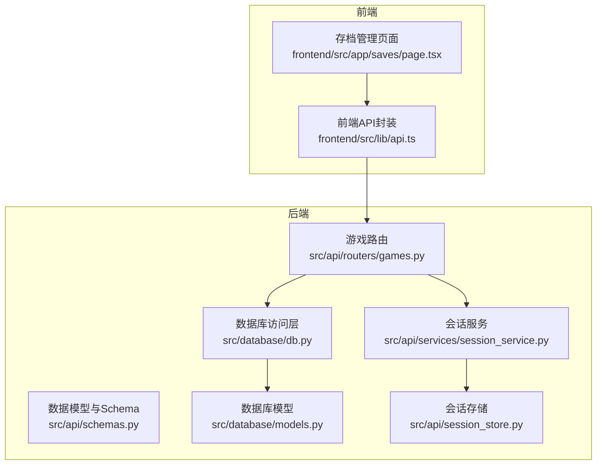
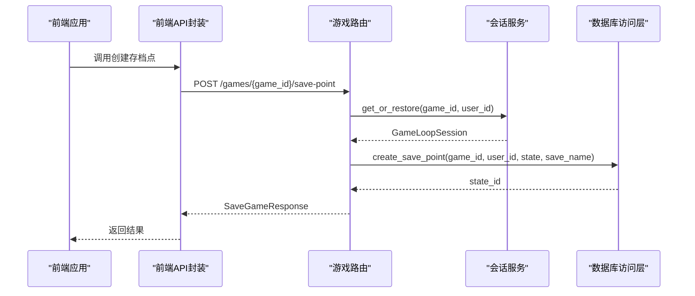
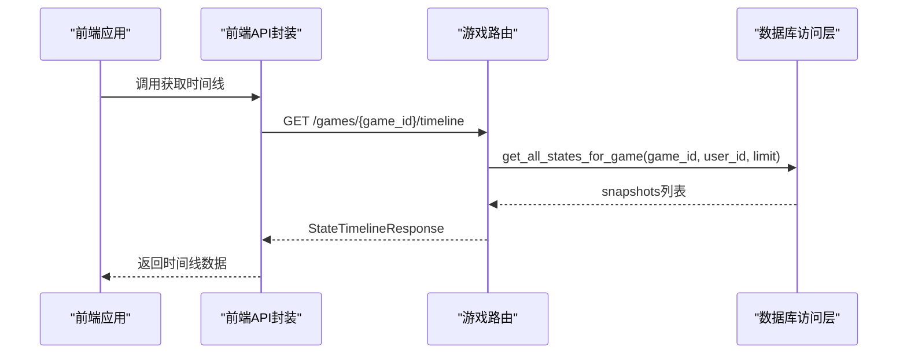
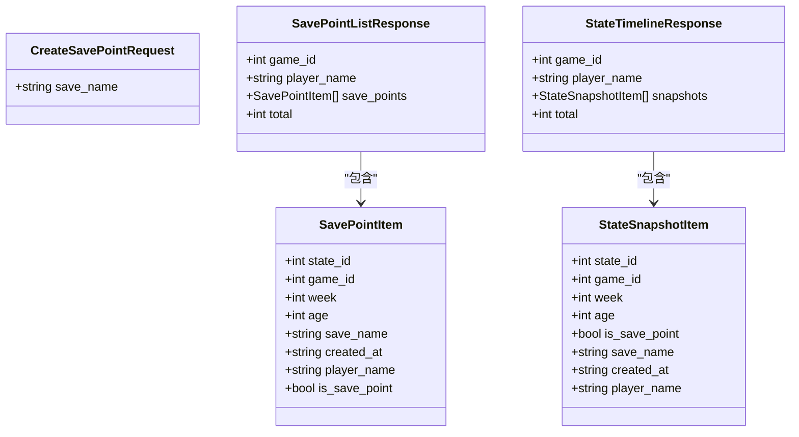
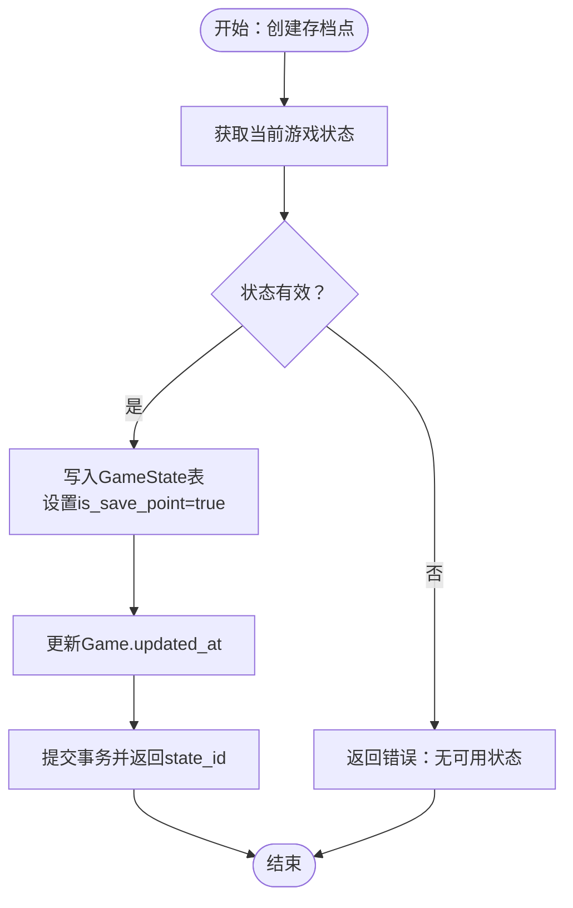
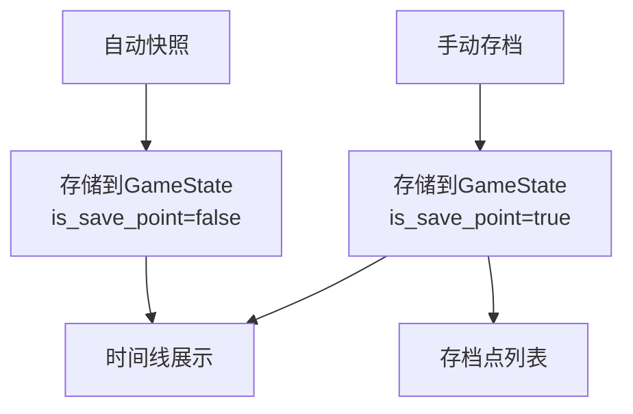
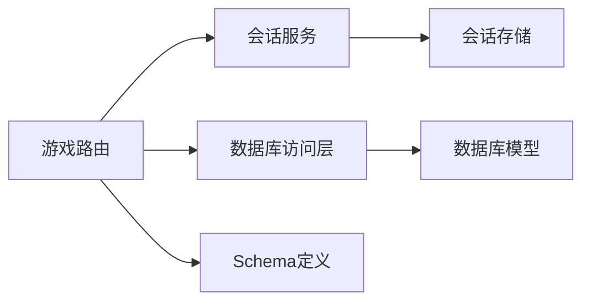

# 时间回溯存档系统

<cite>
**本文档引用的文件**
- [src/api/routers/games.py](file://src/api/routers/games.py)
- [src/api/schemas.py](file://src/api/schemas.py)
- [src/database/db.py](file://src/database/db.py)
- [src/database/models.py](file://src/database/models.py)
- [src/api/services/session_service.py](file://src/api/services/session_service.py)
- [src/api/session_store.py](file://src/api/session_store.py)
- [frontend/src/lib/api.ts](file://frontend/src/lib/api.ts)
- [frontend/src/app/saves/page.tsx](file://frontend/src/app/saves/page.tsx)
</cite>

## 目录
1. [简介](#简介)
2. [项目结构](#项目结构)
3. [核心组件](#核心组件)
4. [架构总览](#架构总览)
5. [详细组件分析](#详细组件分析)
6. [依赖分析](#依赖分析)
7. [性能考量](#性能考量)
8. [故障排除指南](#故障排除指南)
9. [结论](#结论)

## 简介
本系统提供完整的时间回溯存档能力，支持手动存档点创建、自动快照与手动存档的统一时间线展示、按存档点回溯加载以及存档点删除。系统通过API路由暴露以下端点：
- POST /games/{game_id}/save-point：创建存档点（手动存档）
- GET /games/{game_id}/save-points：列出所有存档点
- GET /games/{game_id}/timeline：获取完整时间线（含自动快照与手动存档）
- GET /games/load-save-point/{state_id}：按存档点ID加载回溯
- DELETE /games/save-point/{state_id}：删除存档点

系统还包含存档点生命周期管理、数据版本控制与存储优化策略，并对安全性与性能进行专门考量。

## 项目结构
后端采用FastAPI + SQLAlchemy架构，前端使用Next.js + TypeScript。核心模块分布如下：
- API层：路由定义与请求/响应模型
- 数据访问层：数据库模型与查询封装
- 会话管理层：内存会话缓存与自动恢复
- 前端API封装：统一的REST客户端与类型定义

**图表来源**
- [src/api/routers/games.py](file://src/api/routers/games.py#L229-L389)
- [src/api/schemas.py](file://src/api/schemas.py#L229-L268)
- [src/database/db.py](file://src/database/db.py#L687-L910)
- [src/database/models.py](file://src/database/models.py#L94-L111)
- [src/api/services/session_service.py](file://src/api/services/session_service.py#L24-L157)
- [src/api/session_store.py](file://src/api/session_store.py#L158-L199)
- [frontend/src/lib/api.ts](file://frontend/src/lib/api.ts#L256-L276)
- [frontend/src/app/saves/page.tsx](file://frontend/src/app/saves/page.tsx#L352-L402)

**章节来源**
- [src/api/routers/games.py](file://src/api/routers/games.py#L1-L389)
- [src/api/schemas.py](file://src/api/schemas.py#L229-L268)
- [src/database/db.py](file://src/database/db.py#L687-L910)
- [src/database/models.py](file://src/database/models.py#L94-L111)
- [src/api/services/session_service.py](file://src/api/services/session_service.py#L24-L157)
- [src/api/session_store.py](file://src/api/session_store.py#L158-L199)
- [frontend/src/lib/api.ts](file://frontend/src/lib/api.ts#L256-L276)
- [frontend/src/app/saves/page.tsx](file://frontend/src/app/saves/page.tsx#L352-L402)

## 核心组件
- 请求/响应模型
  - CreateSavePointRequest：创建存档点请求，包含可选字段save_name
  - SavePointItem：存档点信息，包含state_id、game_id、week、age、save_name、created_at、player_name、is_save_point
  - SavePointListResponse：存档点列表响应，包含game_id、player_name、save_points数组、total
  - StateSnapshotItem：状态快照项，包含state_id、game_id、week、age、is_save_point、save_name、created_at、player_name
  - StateTimelineResponse：时间线响应，包含game_id、player_name、snapshots数组、total
- 数据库模型
  - GameState：游戏状态快照表，新增is_save_point与save_name字段以区分手动存档点与自动快照
- 会话管理
  - SessionService：统一获取/恢复会话逻辑
  - SessionStore：内存会话缓存与清理

**章节来源**
- [src/api/schemas.py](file://src/api/schemas.py#L229-L268)
- [src/database/models.py](file://src/database/models.py#L94-L111)
- [src/api/services/session_service.py](file://src/api/services/session_service.py#L24-L157)
- [src/api/session_store.py](file://src/api/session_store.py#L158-L199)

## 架构总览
系统通过API路由协调会话服务与数据库访问，实现存档点的创建、查询、回溯与删除。前端通过统一API封装调用后端接口。

**图表来源**
- [src/api/routers/games.py](file://src/api/routers/games.py#L229-L256)
- [src/api/services/session_service.py](file://src/api/services/session_service.py#L49-L121)
- [src/database/db.py](file://src/database/db.py#L687-L741)
- [frontend/src/lib/api.ts](file://frontend/src/lib/api.ts#L256-L261)

**章节来源**
- [src/api/routers/games.py](file://src/api/routers/games.py#L229-L256)
- [src/api/services/session_service.py](file://src/api/services/session_service.py#L49-L121)
- [src/database/db.py](file://src/database/db.py#L687-L741)
- [frontend/src/lib/api.ts](file://frontend/src/lib/api.ts#L256-L261)

## 详细组件分析

### API端点规范
- 创建存档点
  - 方法：POST
  - 路径：/games/{game_id}/save-point
  - 请求体：CreateSavePointRequest（可选save_name）
  - 响应：SaveGameResponse（success、message）
  - 权限：需要登录用户
  - 行为：从会话服务获取/恢复GameLoop，读取当前状态并持久化为存档点
- 列出存档点
  - 方法：GET
  - 路径：/games/{game_id}/save-points
  - 响应：SavePointListResponse（包含game_id、player_name、save_points、total）
  - 行为：查询所有is_save_point=true的状态快照
- 获取时间线
  - 方法：GET
  - 路径：/games/{game_id}/timeline
  - 响应：StateTimelineResponse（包含snapshots，包含is_save_point标记）
  - 行为：查询所有状态快照，用于展示自动快照与手动存档的统一时间线
- 加载存档点
  - 方法：GET
  - 路径：/games/load-save-point/{state_id}
  - 响应：GameStateResponse（加载指定state_id对应的状态）
  - 行为：按state_id加载状态并创建GameLoop会话
- 删除存档点
  - 方法：DELETE
  - 路径：/games/save-point/{state_id}
  - 响应：MessageResponse
  - 行为：删除指定state_id且is_save_point=true的存档点

**图表来源**
- [src/api/routers/games.py](file://src/api/routers/games.py#L294-L330)
- [src/database/db.py](file://src/database/db.py#L863-L910)
- [frontend/src/lib/api.ts](file://frontend/src/lib/api.ts#L266-L267)

**章节来源**
- [src/api/routers/games.py](file://src/api/routers/games.py#L229-L389)
- [frontend/src/lib/api.ts](file://frontend/src/lib/api.ts#L256-L276)

### 数据模型与Schema
- CreateSavePointRequest
  - 字段：save_name（可选）
- SavePointItem
  - 字段：state_id、game_id、week、age、save_name、created_at、player_name、is_save_point（固定为true）
- SavePointListResponse
  - 字段：game_id、player_name、save_points（SavePointItem数组）、total
- StateSnapshotItem
  - 字段：state_id、game_id、week、age、is_save_point（区分自动快照与手动存档）、save_name、created_at、player_name
- StateTimelineResponse
  - 字段：game_id、player_name、snapshots（StateSnapshotItem数组）、total

**图表来源**
- [src/api/schemas.py](file://src/api/schemas.py#L229-L268)

**章节来源**
- [src/api/schemas.py](file://src/api/schemas.py#L229-L268)

### 数据库模型与操作
- GameState模型
  - 新增字段：is_save_point（布尔）、save_name（字符串）
  - 作用：区分手动存档点与自动快照；存储存档名称
- 数据库操作
  - create_save_point：创建手动存档点，设置is_save_point=true
  - list_save_points：查询所有is_save_point=true的快照
  - get_all_states_for_game：查询所有快照（用于时间线），包含is_save_point标记
  - load_save_point：按state_id加载存档点状态
  - delete_save_point：删除指定state_id的存档点

**图表来源**
- [src/database/db.py](file://src/database/db.py#L687-L741)

**章节来源**
- [src/database/models.py](file://src/database/models.py#L94-L111)
- [src/database/db.py](file://src/database/db.py#L687-L910)

### 自动快照与手动存档
- 自动快照
  - 由系统定期保存游戏进度，不设置is_save_point标记
  - 仅用于会话恢复与自动保存，不在存档点列表中展示
- 手动存档
  - 用户触发创建，设置is_save_point=true
  - 在存档点列表与时间线中可见，支持回溯加载与删除

**图表来源**
- [src/database/db.py](file://src/database/db.py#L687-L741)
- [src/database/db.py](file://src/database/db.py#L863-L910)

**章节来源**
- [src/database/db.py](file://src/database/db.py#L687-L910)

### 生命周期管理与存储优化
- 生命周期
  - 创建：create_save_point
  - 查询：list_save_points、get_all_states_for_game
  - 回溯：load_save_point
  - 删除：delete_save_point
- 存储优化
  - 通过is_save_point字段区分手动存档与自动快照，减少前端渲染负担
  - 时间线限制默认数量（limit参数），避免超大数据集传输
  - 会话缓存：SessionStore提供内存缓存，降低数据库压力

**章节来源**
- [src/api/routers/games.py](file://src/api/routers/games.py#L259-L330)
- [src/api/services/session_service.py](file://src/api/services/session_service.py#L24-L157)
- [src/api/session_store.py](file://src/api/session_store.py#L158-L199)

### 安全性与性能考量
- 安全性
  - 所有端点均需登录用户权限校验
  - 操作前验证游戏归属（user_id与game_id匹配）
  - 删除存档点时再次验证权限
- 性能
  - 会话缓存：避免频繁数据库读取
  - 分页与限制：时间线默认限制数量
  - 日志记录：关键操作记录日志，便于追踪与审计

**章节来源**
- [src/api/routers/games.py](file://src/api/routers/games.py#L229-L389)
- [src/database/db.py](file://src/database/db.py#L687-L910)

## 依赖分析
- 组件耦合
  - 路由依赖会话服务与数据库访问层
  - 会话服务依赖会话存储与数据库
  - Schema定义被路由与数据库层共同使用
- 外部依赖
  - FastAPI（路由与依赖注入）
  - SQLAlchemy（ORM与数据库访问）
  - 前端通过fetch调用后端API

**图表来源**
- [src/api/routers/games.py](file://src/api/routers/games.py#L1-L389)
- [src/api/services/session_service.py](file://src/api/services/session_service.py#L24-L157)
- [src/api/session_store.py](file://src/api/session_store.py#L158-L199)
- [src/database/db.py](file://src/database/db.py#L687-L910)
- [src/database/models.py](file://src/database/models.py#L94-L111)
- [src/api/schemas.py](file://src/api/schemas.py#L229-L268)

**章节来源**
- [src/api/routers/games.py](file://src/api/routers/games.py#L1-L389)
- [src/api/services/session_service.py](file://src/api/services/session_service.py#L24-L157)
- [src/api/session_store.py](file://src/api/session_store.py#L158-L199)
- [src/database/db.py](file://src/database/db.py#L687-L910)
- [src/database/models.py](file://src/database/models.py#L94-L111)
- [src/api/schemas.py](file://src/api/schemas.py#L229-L268)

## 性能考量
- 会话缓存命中率：通过SessionStore减少数据库访问
- 数据库索引：GameState表按game_id、created_at排序，提高查询效率
- 前端分页：时间线默认限制数量，避免一次性传输过多数据
- 异常处理：数据库异常回滚与日志记录，保证系统稳定性

## 故障排除指南
- 创建存档点失败
  - 检查当前是否存在有效游戏状态
  - 确认用户权限与游戏归属
  - 查看后端日志定位具体错误
- 加载存档点失败
  - 确认state_id存在且属于当前用户
  - 检查数据库连接与权限
- 删除存档点失败
  - 确认state_id为手动存档点（is_save_point=true）
  - 检查用户权限与游戏归属

**章节来源**
- [src/api/routers/games.py](file://src/api/routers/games.py#L229-L389)
- [src/database/db.py](file://src/database/db.py#L788-L861)

## 结论
时间回溯存档系统通过清晰的API设计与完善的数据库模型，实现了手动存档与自动快照的统一管理。系统具备良好的扩展性与性能表现，能够满足复杂叙事游戏的存档需求。建议在生产环境中结合监控与日志，持续优化会话缓存与数据库查询性能。