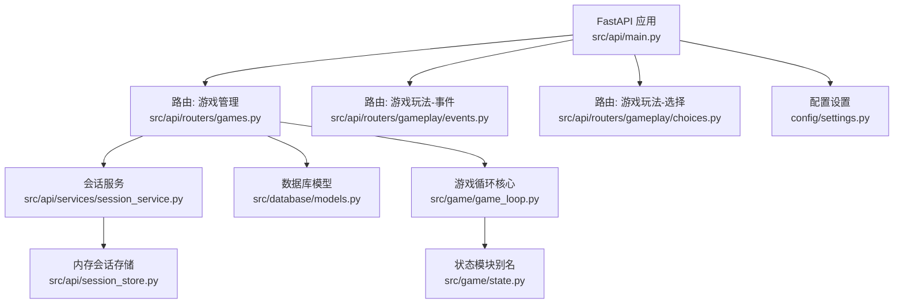
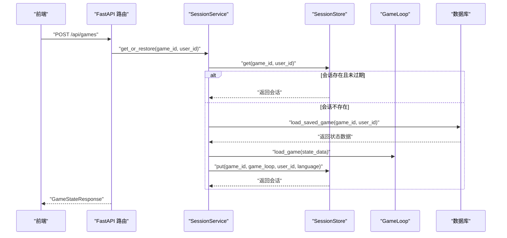
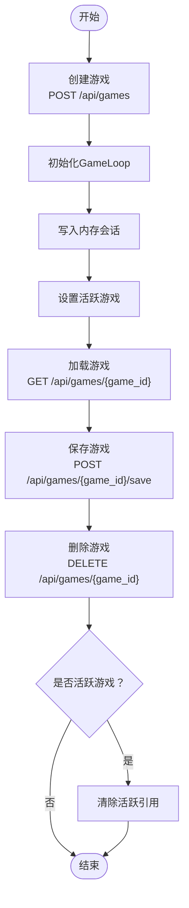
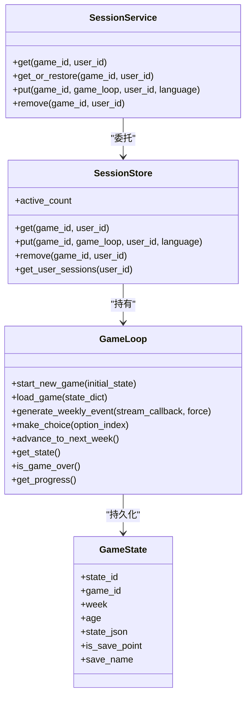
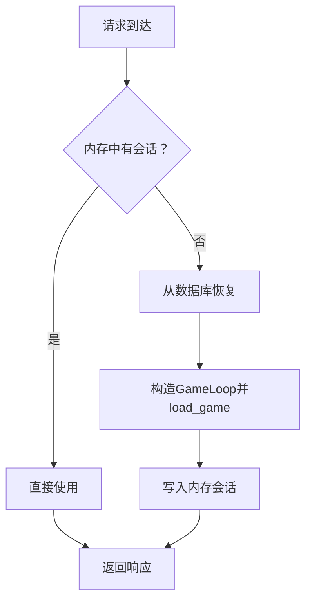
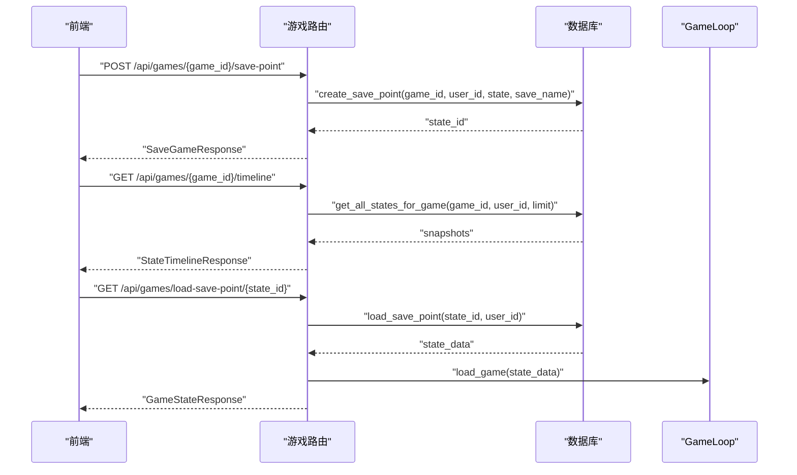
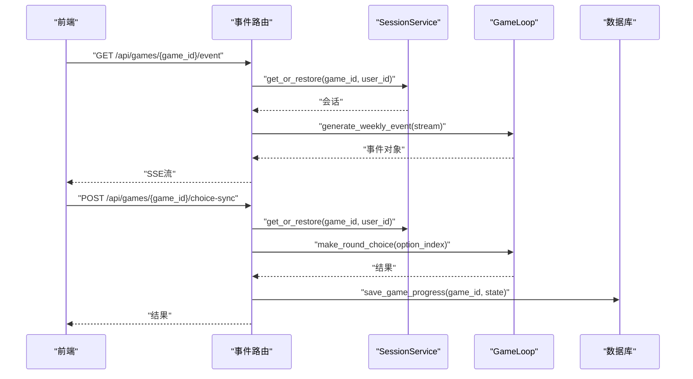
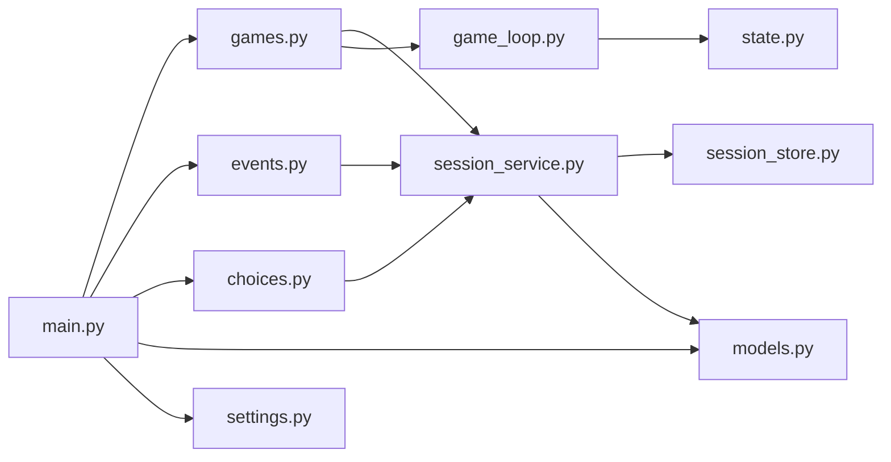

# 游戏API

<cite>
**本文引用的文件**
- [src/api/main.py](file://src/api/main.py)
- [src/api/routers/games.py](file://src/api/routers/games.py)
- [src/api/routers/gameplay/events.py](file://src/api/routers/gameplay/events.py)
- [src/api/routers/gameplay/choices.py](file://src/api/routers/gameplay/choices.py)
- [src/api/schemas.py](file://src/api/schemas.py)
- [src/api/session_store.py](file://src/api/session_store.py)
- [src/api/services/session_service.py](file://src/api/services/session_service.py)
- [src/database/models.py](file://src/database/models.py)
- [src/game/game_loop.py](file://src/game/game_loop.py)
- [src/game/state.py](file://src/game/state.py)
- [config/settings.py](file://config/settings.py)
- [tests/test_api_games.py](file://tests/test_api_games.py)
- [tests/test_api_gameplay.py](file://tests/test_api_gameplay.py)
- [README.md](file://README.md)
- [docs/session-recovery-test-plan.md](file://docs/session-recovery-test-plan.md)
</cite>

## 目录
1. [简介](#简介)
2. [项目结构](#项目结构)
3. [核心组件](#核心组件)
4. [架构总览](#架构总览)
5. [详细组件分析](#详细组件分析)
6. [依赖分析](#依赖分析)
7. [性能考量](#性能考量)
8. [故障排查指南](#故障排查指南)
9. [结论](#结论)
10. [附录](#附录)

## 简介
本文件为“人生草稿本”游戏API的完整RESTful文档，覆盖游戏生命周期管理、状态序列化/反序列化与持久化、会话管理策略（内存与数据库）、时间回溯存档系统、请求/响应示例、异常处理、性能优化与并发控制策略。目标读者既包括后端开发者，也包括需要理解API行为的前端与测试人员。

## 项目结构
后端基于FastAPI，采用模块化路由组织：
- 根应用入口负责CORS、全局异常处理、健康检查与客户端日志收集
- 游戏相关路由集中在games.py，包含创建、加载、保存、删除、活跃游戏、时间回溯存档等
- 游戏玩法路由分为事件生成（SSE/同步）与选择处理（SSE/同步）
- 会话管理由SessionStore与SessionService统一处理
- 数据层基于SQLAlchemy模型，支持SQLite与云数据库
- 游戏核心逻辑封装在GameLoop，负责状态序列化/反序列化、事件生成、选择处理、进度统计等

图表来源
- [src/api/main.py](file://src/api/main.py#L35-L90)
- [src/api/routers/games.py](file://src/api/routers/games.py#L25-L389)
- [src/api/routers/gameplay/events.py](file://src/api/routers/gameplay/events.py#L48-L164)
- [src/api/routers/gameplay/choices.py](file://src/api/routers/gameplay/choices.py#L74-L224)
- [src/api/services/session_service.py](file://src/api/services/session_service.py#L24-L157)
- [src/api/session_store.py](file://src/api/session_store.py#L100-L200)
- [src/database/models.py](file://src/database/models.py#L250-L295)
- [src/game/game_loop.py](file://src/game/game_loop.py#L25-L592)
- [src/game/state.py](file://src/game/state.py#L1-L18)
- [config/settings.py](file://config/settings.py#L27-L167)

章节来源
- [src/api/main.py](file://src/api/main.py#L35-L90)
- [README.md](file://README.md#L74-L87)

## 核心组件
- FastAPI应用与中间件：CORS配置、全局异常处理、健康检查、客户端日志收集
- 游戏路由：创建/加载/保存/删除/活跃游戏、时间回溯存档（手动存档点、时间线、回溯加载）
- 游戏玩法路由：事件生成（SSE/同步）、选择处理（SSE/同步）
- 会话管理：内存会话存储（带超时清理）、会话服务（自动从数据库恢复）
- 数据库模型：用户、游戏、状态快照、决策、结局、图片与场景图等
- 游戏核心：GameLoop负责状态序列化/反序列化、事件生成、选择处理、进度统计

章节来源
- [src/api/main.py](file://src/api/main.py#L24-L134)
- [src/api/routers/games.py](file://src/api/routers/games.py#L26-L389)
- [src/api/routers/gameplay/events.py](file://src/api/routers/gameplay/events.py#L48-L212)
- [src/api/routers/gameplay/choices.py](file://src/api/routers/gameplay/choices.py#L74-L224)
- [src/api/session_store.py](file://src/api/session_store.py#L100-L200)
- [src/api/services/session_service.py](file://src/api/services/session_service.py#L24-L157)
- [src/database/models.py](file://src/database/models.py#L70-L234)
- [src/game/game_loop.py](file://src/game/game_loop.py#L25-L592)

## 架构总览
整体架构围绕“内存会话 + 数据库持久化”的双层设计：
- 内存会话：高吞吐、低延迟；定期清理过期会话
- 数据库：可靠持久化；提供会话恢复与时间回溯能力
- SSE流式输出：移动端网络波动下的断线重连支持
- 并发控制：基于游戏粒度的异步锁，避免事件/选择并发冲突

图表来源
- [src/api/routers/games.py](file://src/api/routers/games.py#L26-L58)
- [src/api/services/session_service.py](file://src/api/services/session_service.py#L49-L121)
- [src/api/session_store.py](file://src/api/session_store.py#L123-L156)
- [src/game/game_loop.py](file://src/game/game_loop.py#L100-L159)
- [src/database/models.py](file://src/database/models.py#L94-L111)

## 详细组件分析

### 游戏生命周期管理（创建/加载/保存/删除/活跃）
- 创建游戏
  - 请求：CreateGameRequest（角色设定、玩家名、人生愿景、语言）
  - 处理：GameInitializer初始化GameLoop，写入SessionStore，记录活跃游戏
  - 响应：GameStateResponse（game_id、player_state、progress、round_info、current_event）
- 加载游戏
  - 处理：从数据库读取状态，构造GameLoop并加载，写入SessionStore，设置活跃游戏
- 保存游戏
  - 处理：通过SessionService获取或恢复会话，读取GameLoop状态并持久化
- 删除游戏
  - 处理：删除数据库记录，清理SessionStore，若删除的是活跃游戏则清除活跃引用
- 活跃游戏
  - 处理：根据用户活跃游戏ID自动恢复并返回状态

图表来源
- [src/api/routers/games.py](file://src/api/routers/games.py#L26-L208)
- [src/api/services/session_service.py](file://src/api/services/session_service.py#L49-L121)
- [src/api/session_store.py](file://src/api/session_store.py#L138-L166)
- [src/database/models.py](file://src/database/models.py#L94-L111)

章节来源
- [src/api/routers/games.py](file://src/api/routers/games.py#L26-L208)
- [src/api/schemas.py](file://src/api/schemas.py#L47-L72)
- [src/api/services/session_service.py](file://src/api/services/session_service.py#L49-L121)
- [src/api/session_store.py](file://src/api/session_store.py#L138-L166)
- [src/database/models.py](file://src/database/models.py#L94-L111)

### 游戏状态管理（序列化/反序列化/持久化）
- 序列化/反序列化
  - GameLoop提供start_new_game/load_game/get_state/is_game_over/get_progress等方法
  - 状态以字典形式在内存与数据库间传递
- 持久化
  - save_game_progress：将当前状态写入数据库
  - load_saved_game：从数据库读取状态并重建GameLoop
- 一致性保障
  - 选择后自动保存current_event_data=None，避免重复处理
  - 事件生成与选择处理均通过SessionService统一获取/恢复会话，减少竞态

图表来源
- [src/game/game_loop.py](file://src/game/game_loop.py#L69-L592)
- [src/api/session_store.py](file://src/api/session_store.py#L100-L200)
- [src/api/services/session_service.py](file://src/api/services/session_service.py#L24-L157)
- [src/database/models.py](file://src/database/models.py#L94-L111)

章节来源
- [src/game/game_loop.py](file://src/game/game_loop.py#L69-L592)
- [src/database/models.py](file://src/database/models.py#L94-L111)

### 会话管理策略（内存与数据库）
- 内存会话存储
  - 会话键格式：user_{user_id}_game_{game_id} 或 anon_game_{game_id}
  - 会话超时：默认2小时，定期清理过期会话
  - SSE缓存：支持断线重连，缓存最多500条故事片段
- 会话服务
  - get_or_restore：优先内存，否则从数据库恢复
  - 统一创建/移除/查询接口，避免重复逻辑

图表来源
- [src/api/services/session_service.py](file://src/api/services/session_service.py#L49-L121)
- [src/api/session_store.py](file://src/api/session_store.py#L123-L195)
- [src/game/game_loop.py](file://src/game/game_loop.py#L100-L159)

章节来源
- [src/api/session_store.py](file://src/api/session_store.py#L100-L200)
- [src/api/services/session_service.py](file://src/api/services/session_service.py#L24-L157)

### 时间回溯存档系统（手动存档点/时间线/回溯加载）
- 创建存档点
  - POST /api/games/{game_id}/save-point
  - 将当前状态持久化为手动存档点（可选名称）
- 列出存档点
  - GET /api/games/{game_id}/save-points
  - 返回存档点列表（含周数、年龄、创建时间等）
- 时间线
  - GET /api/games/{game_id}/timeline
  - 返回包含自动快照与手动存档的完整时间线
- 回溯加载
  - GET /api/games/load-save-point/{state_id}
  - 加载指定存档点并设为活跃游戏
- 删除存档点
  - DELETE /api/games/save-point/{state_id}

图表来源
- [src/api/routers/games.py](file://src/api/routers/games.py#L229-L389)
- [src/database/models.py](file://src/database/models.py#L94-L111)

章节来源
- [src/api/routers/games.py](file://src/api/routers/games.py#L229-L389)
- [src/api/schemas.py](file://src/api/schemas.py#L229-L268)
- [src/database/models.py](file://src/database/models.py#L94-L111)

### 游戏玩法（事件生成与选择处理）
- 事件生成
  - SSE：GET /api/games/{game_id}/event（支持Last-Event-ID断线重连）
  - 同步：POST /api/games/{game_id}/event-sync（移动端回退）
  - 并发控制：基于game_id的异步锁，防止并发生成
- 选择处理
  - SSE：POST /api/games/{game_id}/choice、POST /api/games/{game_id}/custom-choice
  - 同步：POST /api/games/{game_id}/choice-sync、POST /api/games/{game_id}/custom-choice-sync
  - 当current_event缺失时，自动从数据库恢复或报错
- 自动保存
  - 同步选择后自动保存当前状态，确保current_event_data被清空

图表来源
- [src/api/routers/gameplay/events.py](file://src/api/routers/gameplay/events.py#L48-L164)
- [src/api/routers/gameplay/choices.py](file://src/api/routers/gameplay/choices.py#L74-L224)
- [src/api/services/session_service.py](file://src/api/services/session_service.py#L49-L121)
- [src/game/game_loop.py](file://src/game/game_loop.py#L161-L308)

章节来源
- [src/api/routers/gameplay/events.py](file://src/api/routers/gameplay/events.py#L48-L212)
- [src/api/routers/gameplay/choices.py](file://src/api/routers/gameplay/choices.py#L74-L224)
- [src/api/services/session_service.py](file://src/api/services/session_service.py#L49-L121)
- [src/game/game_loop.py](file://src/game/game_loop.py#L161-L308)

### 请求/响应示例（含异常）
- 创建游戏
  - 请求体：CreateGameRequest
  - 成功：201 Created，响应体：GameStateResponse
  - 异常：400（无效设置）、401（未认证，匿名可创建）
- 加载游戏
  - 成功：200 OK，响应体：GameStateResponse
  - 异常：404（未找到或无权限）
- 保存游戏
  - 成功：200 OK，响应体：SaveGameResponse
  - 异常：400（无状态可保存）、404（无活动会话）
- 删除游戏
  - 成功：200 OK，响应体：MessageResponse
  - 异常：404（未找到或无权限）
- 活跃游戏
  - 成功：200 OK，响应体：GameStateResponse
  - 异常：404（无活跃游戏）
- 事件生成（SSE）
  - 成功：200 OK，SSE流
  - 异常：400（游戏已结束）、409（生成进行中）

章节来源
- [tests/test_api_games.py](file://tests/test_api_games.py#L51-L418)
- [tests/test_api_gameplay.py](file://tests/test_api_gameplay.py#L73-L334)
- [src/api/routers/games.py](file://src/api/routers/games.py#L26-L208)
- [src/api/routers/gameplay/events.py](file://src/api/routers/gameplay/events.py#L48-L164)
- [src/api/routers/gameplay/choices.py](file://src/api/routers/gameplay/choices.py#L74-L224)

## 依赖分析
- 组件耦合
  - 路由层依赖会话服务与数据库；会话服务依赖内存会话存储与数据库；GameLoop依赖状态模块与AI生成器
- 外部依赖
  - FastAPI、SQLAlchemy、配置settings
- 潜在环依赖
  - 通过服务层解耦路由与存储，避免直接环依赖

图表来源
- [src/api/routers/games.py](file://src/api/routers/games.py#L1-L389)
- [src/api/routers/gameplay/events.py](file://src/api/routers/gameplay/events.py#L1-L212)
- [src/api/routers/gameplay/choices.py](file://src/api/routers/gameplay/choices.py#L1-L224)
- [src/api/services/session_service.py](file://src/api/services/session_service.py#L1-L157)
- [src/api/session_store.py](file://src/api/session_store.py#L1-L200)
- [src/database/models.py](file://src/database/models.py#L1-L295)
- [src/game/game_loop.py](file://src/game/game_loop.py#L1-L592)
- [src/game/state.py](file://src/game/state.py#L1-L18)
- [src/api/main.py](file://src/api/main.py#L1-L134)
- [config/settings.py](file://config/settings.py#L1-L167)

章节来源
- [src/api/routers/games.py](file://src/api/routers/games.py#L1-L389)
- [src/api/routers/gameplay/events.py](file://src/api/routers/gameplay/events.py#L1-L212)
- [src/api/routers/gameplay/choices.py](file://src/api/routers/gameplay/choices.py#L1-L224)
- [src/api/services/session_service.py](file://src/api/services/session_service.py#L1-L157)
- [src/api/session_store.py](file://src/api/session_store.py#L1-L200)
- [src/database/models.py](file://src/database/models.py#L1-L295)
- [src/game/game_loop.py](file://src/game/game_loop.py#L1-L592)
- [src/game/state.py](file://src/game/state.py#L1-L18)
- [src/api/main.py](file://src/api/main.py#L1-L134)
- [config/settings.py](file://config/settings.py#L1-L167)

## 性能考量
- 内存会话
  - 会话超时2小时，定期清理过期会话，避免内存泄漏
  - SSE缓存上限500条，避免无限增长
- 并发控制
  - 基于game_id的异步锁，防止事件/选择并发冲突
  - 事件生成超时检测（默认60秒），自动重置卡住标志
- 数据库
  - 使用with_db_session装饰器自动管理会话生命周期
  - PostgreSQL模式启用pool_pre_ping，提升连接稳定性
- 事件生成
  - 支持Last-Event-ID断线重连，减少重复生成
  - 生成期间阻止再次生成，避免资源竞争

章节来源
- [src/api/session_store.py](file://src/api/session_store.py#L11-L98)
- [src/api/routers/gameplay/events.py](file://src/api/routers/gameplay/events.py#L30-L164)
- [src/database/models.py](file://src/database/models.py#L264-L294)
- [config/settings.py](file://config/settings.py#L104-L106)

## 故障排查指南
- 会话恢复
  - 现象：后端重启或会话过期，前端需恢复
  - 处理：SessionService自动从数据库恢复；若无记录，返回404
- 断线重连
  - 现象：SSE连接中断
  - 处理：前端携带Last-Event-ID，后端按事件ID重放缓存片段
- 事件/选择冲突
  - 现象：同时触发事件生成或选择处理
  - 处理：异步锁保护；若超过超时（默认60秒），自动重置并返回等待消息
- 选择重复处理
  - 现象：current_event缺失或已被处理
  - 处理：自动从数据库恢复current_event；若无则报错“请先生成事件”

章节来源
- [src/api/services/session_service.py](file://src/api/services/session_service.py#L74-L121)
- [src/api/routers/gameplay/events.py](file://src/api/routers/gameplay/events.py#L61-L164)
- [src/api/routers/gameplay/choices.py](file://src/api/routers/gameplay/choices.py#L31-L72)
- [docs/session-recovery-test-plan.md](file://docs/session-recovery-test-plan.md#L1-L158)

## 结论
本API以“内存会话+数据库持久化”为核心，结合SSE与同步回退、异步锁与超时检测，提供了稳定、可扩展的游戏生命周期管理与玩法交互能力。时间回溯存档系统进一步增强了可玩性与容错性。建议在生产环境中配合监控与日志，持续优化事件生成与选择处理的并发性能。

## 附录
- 健康检查
  - GET /api/health：返回服务状态与活跃会话数量
- 客户端日志收集
  - POST /api/client-log：接收前端上报的日志，便于移动端问题定位

章节来源
- [src/api/main.py](file://src/api/main.py#L92-L134)
- [src/api/routers/games.py](file://src/api/routers/games.py#L83-L126)