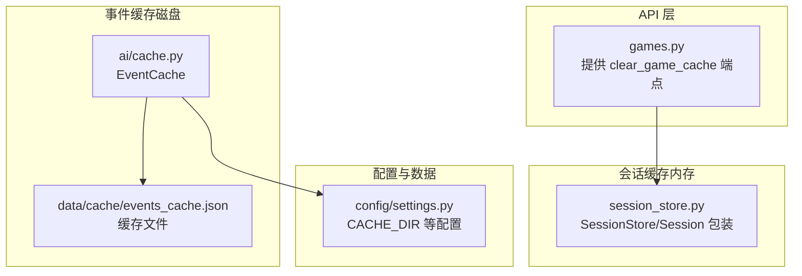
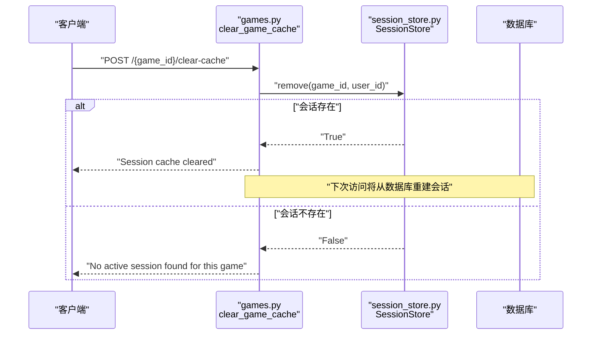
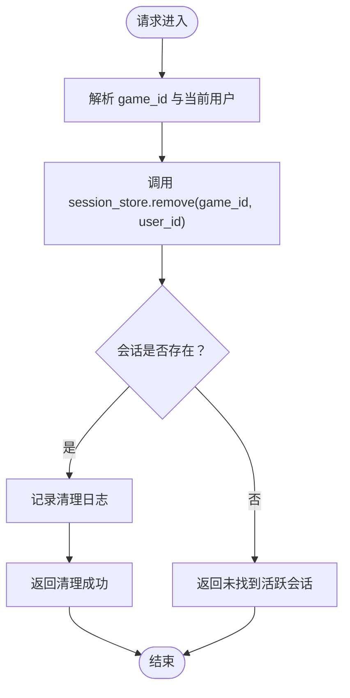
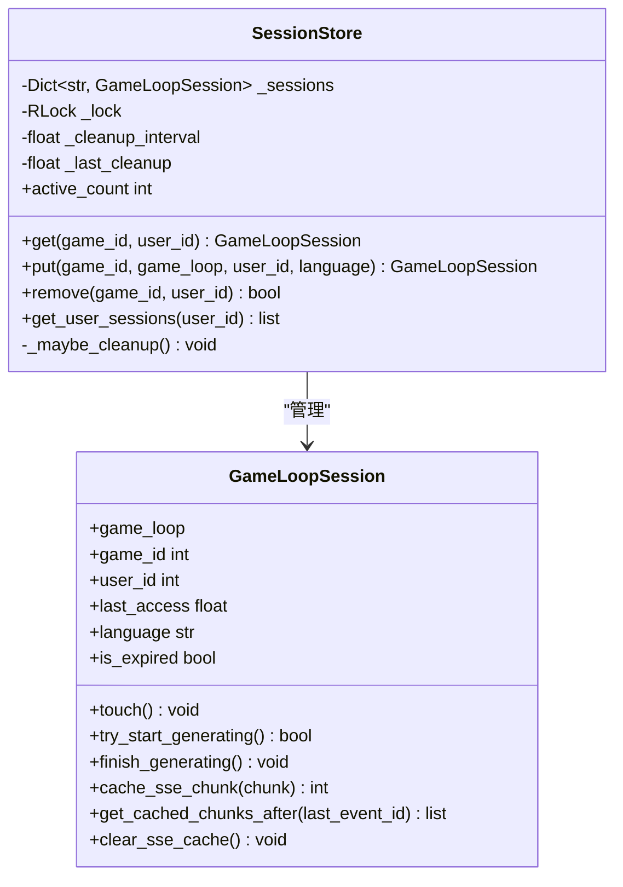
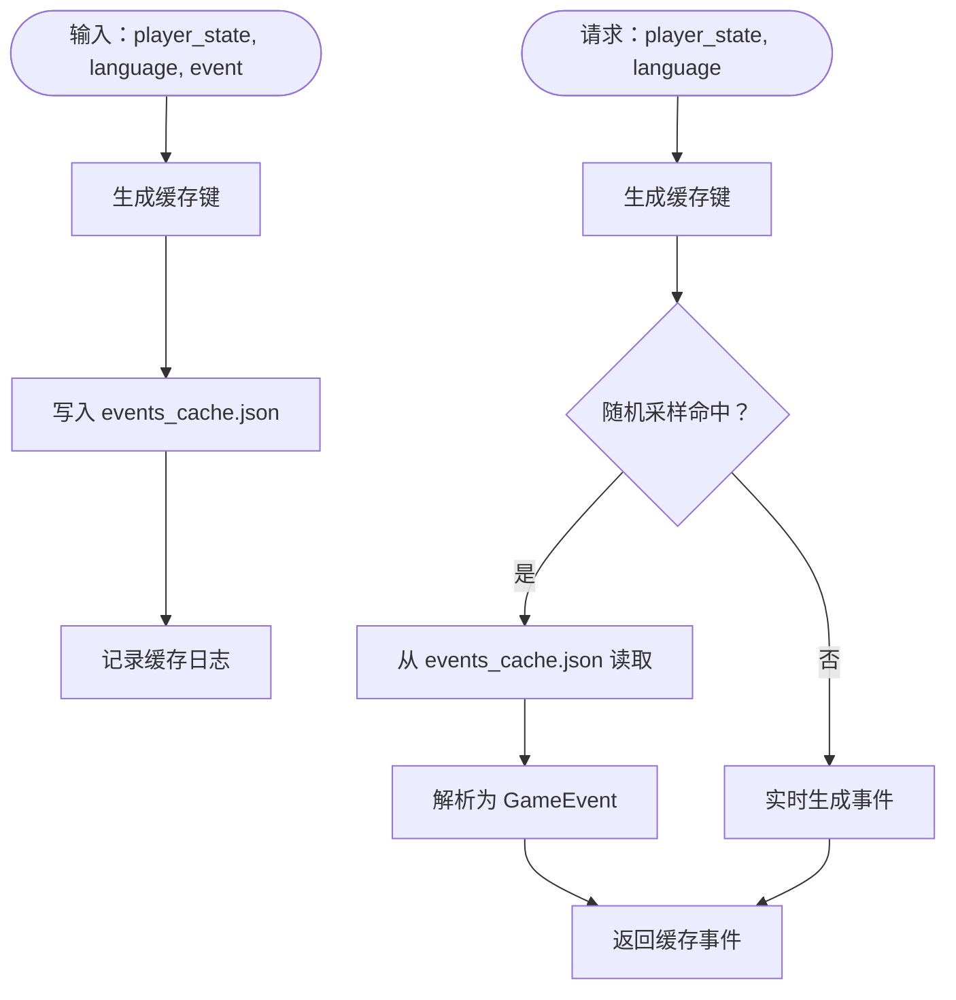
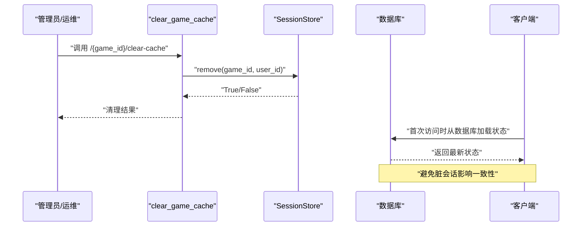
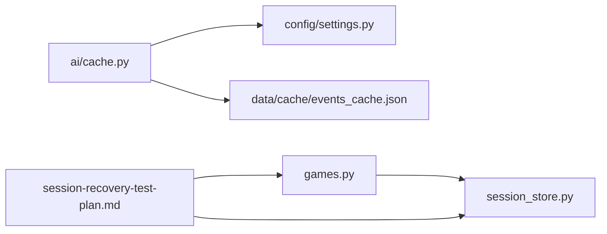

# 缓存管理

<cite>
**本文引用的文件**
- [src/api/routers/games.py](file://src/api/routers/games.py)
- [src/api/session_store.py](file://src/api/session_store.py)
- [src/ai/cache.py](file://src/ai/cache.py)
- [config/settings.py](file://config/settings.py)
- [data/cache/events_cache.json](file://data/cache/events_cache.json)
- [clear_session_cache.py](file://clear_session_cache.py)
- [docs/session-recovery-test-plan.md](file://docs/session-recovery-test-plan.md)
</cite>

## 目录
1. [简介](#简介)
2. [项目结构](#项目结构)
3. [核心组件](#核心组件)
4. [架构总览](#架构总览)
5. [详细组件分析](#详细组件分析)
6. [依赖分析](#依赖分析)
7. [性能考量](#性能考量)
8. [故障排查指南](#故障排查指南)
9. [结论](#结论)
10. [附录](#附录)

## 简介
本文件聚焦于缓存管理功能，特别是会话缓存与事件缓存两大体系，围绕以下目标展开：
- 详述 clear_game_cache 端点的作用与使用场景，尤其是数据库恢复后的会话缓存清理机制
- 解释会话存储的缓存策略，包括内存缓存的生命周期管理与缓存失效机制
- 阐明缓存与数据库状态同步的重要性，以及缓存清理对系统一致性的意义
- 提供缓存管理最佳实践，包括清理时机、用户体验影响与性能优化建议
- 说明缓存清理的日志记录与审计要点

## 项目结构
与缓存管理直接相关的模块分布如下：
- 会话缓存（内存）：由会话存储组件统一管理，提供按用户+游戏维度的内存 GameLoop 实例缓存
- 事件缓存（磁盘）：基于文件的事件缓存，用于减少重复的AI生成调用
- API 层：提供 clear_game_cache 端点，触发会话缓存清理
- 配置与数据目录：集中管理缓存目录与开关

图表来源
- [src/api/routers/games.py](file://src/api/routers/games.py#L211-L225)
- [src/api/session_store.py](file://src/api/session_store.py#L100-L200)
- [src/ai/cache.py](file://src/ai/cache.py#L13-L139)
- [config/settings.py](file://config/settings.py#L13-L24)
- [data/cache/events_cache.json](file://data/cache/events_cache.json#L1-L20)

章节来源
- [src/api/routers/games.py](file://src/api/routers/games.py#L211-L225)
- [src/api/session_store.py](file://src/api/session_store.py#L100-L200)
- [src/ai/cache.py](file://src/ai/cache.py#L13-L139)
- [config/settings.py](file://config/settings.py#L13-L24)

## 核心组件
- clear_game_cache 端点：用于在数据库恢复或异常后，主动清理对应用户的会话缓存，强制后续请求从数据库重建会话
- SessionStore：线程安全的内存会话存储，支持超时清理、键生成、按用户列出会话、统计活跃数等
- EventCache：基于文件的事件缓存，按玩家状态签名缓存AI生成事件，支持清理与大小统计
- 配置与数据目录：统一管理缓存目录路径与开关

章节来源
- [src/api/routers/games.py](file://src/api/routers/games.py#L211-L225)
- [src/api/session_store.py](file://src/api/session_store.py#L100-L200)
- [src/ai/cache.py](file://src/ai/cache.py#L13-L139)
- [config/settings.py](file://config/settings.py#L13-L24)

## 架构总览
会话缓存与事件缓存分别承担运行时状态与生成内容的缓存职责；API 层通过 clear_game_cache 触发会话缓存清理，从而保证数据库与内存状态的一致性。

图表来源
- [src/api/routers/games.py](file://src/api/routers/games.py#L211-L225)
- [src/api/session_store.py](file://src/api/session_store.py#L158-L166)

## 详细组件分析

### clear_game_cache 端点
- 功能定位：在数据库恢复或异常后，清理指定用户+游戏的会话缓存，强制后续请求从数据库重建 GameLoop 实例
- 请求方式：POST /{game_id}/clear-cache
- 认证与授权：依赖当前登录用户上下文
- 行为说明：
  - 调用 session_store.remove 清理内存会话
  - 若存在会话，返回成功消息；否则返回未找到活跃会话的消息
  - 记录清理日志，便于审计
- 使用场景：
  - 数据库恢复后，确保内存会话与数据库状态一致
  - 诊断阶段，快速排除会话污染问题
  - 多实例部署或重启后，避免脏会话影响一致性

图表来源
- [src/api/routers/games.py](file://src/api/routers/games.py#L211-L225)
- [src/api/session_store.py](file://src/api/session_store.py#L158-L166)

章节来源
- [src/api/routers/games.py](file://src/api/routers/games.py#L211-L225)

### 会话存储（SessionStore）与生命周期管理
- 会话键规则：user_{user_id}_game_{game_id} 或匿名场景的 anon_game_{game_id}
- 生命周期：
  - 超时阈值：默认 2 小时
  - 访问更新：每次 get 会更新最后访问时间
  - 定期清理：每 5 分钟检查并清理过期会话
- 关键方法：
  - get：获取并触活会话，过期则删除并返回 None
  - put：创建或覆盖会话
  - remove：删除指定会话
  - get_user_sessions：按用户列出未过期会话
  - active_count：统计未过期会话数量
- SSE 支持：会话包装类提供 SSE 缓存能力，支持断线重连重放

图表来源
- [src/api/session_store.py](file://src/api/session_store.py#L100-L200)

章节来源
- [src/api/session_store.py](file://src/api/session_store.py#L100-L200)

### 事件缓存（EventCache）与磁盘持久化
- 缓存介质：data/cache/events_cache.json
- 缓存键生成：基于玩家状态关键字段与语言生成哈希键，降低缓存抖动
- 命中策略：随机采样（约 30%）使用缓存，其余走实时生成，平衡一致性与成本
- 清理与统计：支持清空全部缓存、统计缓存条目数量
- 异常处理：加载/保存失败时记录告警/错误日志

图表来源
- [src/ai/cache.py](file://src/ai/cache.py#L13-L139)
- [data/cache/events_cache.json](file://data/cache/events_cache.json#L1-L20)

章节来源
- [src/ai/cache.py](file://src/ai/cache.py#L13-L139)
- [config/settings.py](file://config/settings.py#L13-L24)

### 数据库恢复后的会话缓存清理机制
- 会话恢复流程：当内存会话缺失或过期时，系统会自动从数据库恢复 GameLoop 状态
- 清理触发点：clear_game_cache 主动删除会话，确保下一次访问强制重建
- 一致性保障：清理后，后续请求从数据库加载最新状态，避免脏缓存导致的状态不一致
- 测试参考：会话恢复测试方案中包含调试端点与多场景验证，体现清理与恢复的协同

图表来源
- [src/api/routers/games.py](file://src/api/routers/games.py#L211-L225)
- [src/api/session_store.py](file://src/api/session_store.py#L123-L136)
- [docs/session-recovery-test-plan.md](file://docs/session-recovery-test-plan.md#L31-L43)

章节来源
- [src/api/routers/games.py](file://src/api/routers/games.py#L211-L225)
- [src/api/session_store.py](file://src/api/session_store.py#L123-L136)
- [docs/session-recovery-test-plan.md](file://docs/session-recovery-test-plan.md#L31-L43)

### 会话存储的缓存策略与失效机制
- 超时控制：基于 last_access 与 SESSION_TIMEOUT 的到期判定
- 访问触活：get 时 touch，延长会话生命周期
- 定期清理：_maybe_cleanup 按固定间隔扫描并删除过期项
- 并发安全：使用线程锁保护会话字典的读写
- SSE 缓存：支持断线重连的事件流缓存，避免重放丢失

章节来源
- [src/api/session_store.py](file://src/api/session_store.py#L11-L13)
- [src/api/session_store.py](file://src/api/session_store.py#L40-L47)
- [src/api/session_store.py](file://src/api/session_store.py#L184-L195)

### 缓存与数据库状态同步
- 会话层面：清理会话后，下一次访问从数据库重建 GameLoop，确保内存状态与数据库一致
- 事件层面：事件缓存采用磁盘文件持久化，配合随机采样命中策略，在成本与一致性之间取得平衡
- 一致性保障：通过清理与恢复流程，避免“旧选项”、“No current event”等状态不一致问题

章节来源
- [src/api/routers/games.py](file://src/api/routers/games.py#L211-L225)
- [src/ai/cache.py](file://src/ai/cache.py#L92-L101)
- [docs/session-recovery-test-plan.md](file://docs/session-recovery-test-plan.md#L5-L9)

### 缓存清理脚本与审计
- 单独脚本：clear_session_cache.py 直接访问 session_store 单例，演示如何在外部脚本中清理指定会话
- 审计日志：清理与恢复过程均记录日志，便于问题定位与合规审计

章节来源
- [clear_session_cache.py](file://clear_session_cache.py#L1-L24)
- [src/api/routers/games.py](file://src/api/routers/games.py#L220-L221)
- [src/api/session_store.py](file://src/api/session_store.py#L133-L134)

## 依赖分析
- clear_game_cache 依赖 SessionStore 的 remove 方法
- EventCache 依赖配置中的 CACHE_DIR 与 events_cache.json 文件
- 会话恢复与测试方案共同保障清理与恢复的协同

图表来源
- [src/api/routers/games.py](file://src/api/routers/games.py#L211-L225)
- [src/api/session_store.py](file://src/api/session_store.py#L100-L200)
- [src/ai/cache.py](file://src/ai/cache.py#L13-L139)
- [config/settings.py](file://config/settings.py#L13-L24)
- [docs/session-recovery-test-plan.md](file://docs/session-recovery-test-plan.md#L1-L158)

章节来源
- [src/api/routers/games.py](file://src/api/routers/games.py#L211-L225)
- [src/api/session_store.py](file://src/api/session_store.py#L100-L200)
- [src/ai/cache.py](file://src/ai/cache.py#L13-L139)
- [config/settings.py](file://config/settings.py#L13-L24)
- [docs/session-recovery-test-plan.md](file://docs/session-recovery-test-plan.md#L1-L158)

## 性能考量
- 会话缓存命中率优化
  - 合理设置 SESSION_TIMEOUT，避免频繁重建带来的抖动
  - 在高并发场景下，注意 _maybe_cleanup 的清理频率与锁竞争
- 事件缓存命中率优化
  - 通过随机采样命中（约 30%）平衡成本与多样性
  - 对关键字段做合理分箱（如 round 到十位级），减少键空间膨胀
- I/O 与持久化
  - 事件缓存文件读写需注意异常处理与落盘频率
  - 缓存文件过大时，建议定期清理或压缩

## 故障排查指南
- 现象：用户点击“确认并继续”后出现“旧选项”或“无当前事件”
  - 排查：确认是否发生会话过期或后端重启；必要时调用 clear_game_cache 清理会话
  - 参考：会话恢复测试方案中的调试端点与日志关键词
- 现象：事件生成不稳定或重复
  - 排查：检查事件缓存文件是否损坏；必要时清空缓存并观察随机采样命中情况
- 现象：清理后仍出现异常
  - 排查：查看清理与恢复日志，确认数据库状态是否一致

章节来源
- [docs/session-recovery-test-plan.md](file://docs/session-recovery-test-plan.md#L141-L151)
- [src/api/routers/games.py](file://src/api/routers/games.py#L220-L221)
- [src/ai/cache.py](file://src/ai/cache.py#L34-L45)

## 结论
- clear_game_cache 端点是数据库恢复与一致性保障的关键工具，通过清理会话强制从数据库重建状态
- 会话存储采用超时与定期清理策略，结合访问触活，平衡性能与一致性
- 事件缓存通过磁盘持久化与随机采样命中策略，兼顾成本与多样性
- 建议在数据库维护窗口或异常恢复后主动清理会话，确保系统一致性与用户体验

## 附录
- 最佳实践
  - 在数据库迁移/恢复后，优先清理受影响用户的会话缓存
  - 高峰期避免大规模批量清理，建议按用户或按游戏分批执行
  - 结合日志审计，记录每次清理的原因与结果
- 性能监控指标建议
  - 会话命中率：(总请求数 - 过期重建次数)/总请求数
  - 事件缓存命中率：从缓存返回的事件数/总事件生成数
  - 清理频率与平均会话存活时长，评估 SESSION_TIMEOUT 设置合理性
- 清理时机选择
  - 系统维护窗口：批量清理，降低对在线用户的影响
  - 异常恢复后：快速清理，确保一致性
  - 用户反馈异常时：按用户粒度清理，快速定位问题