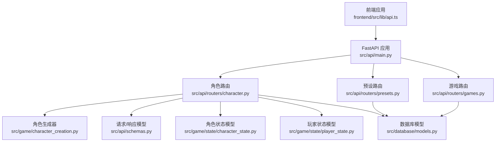
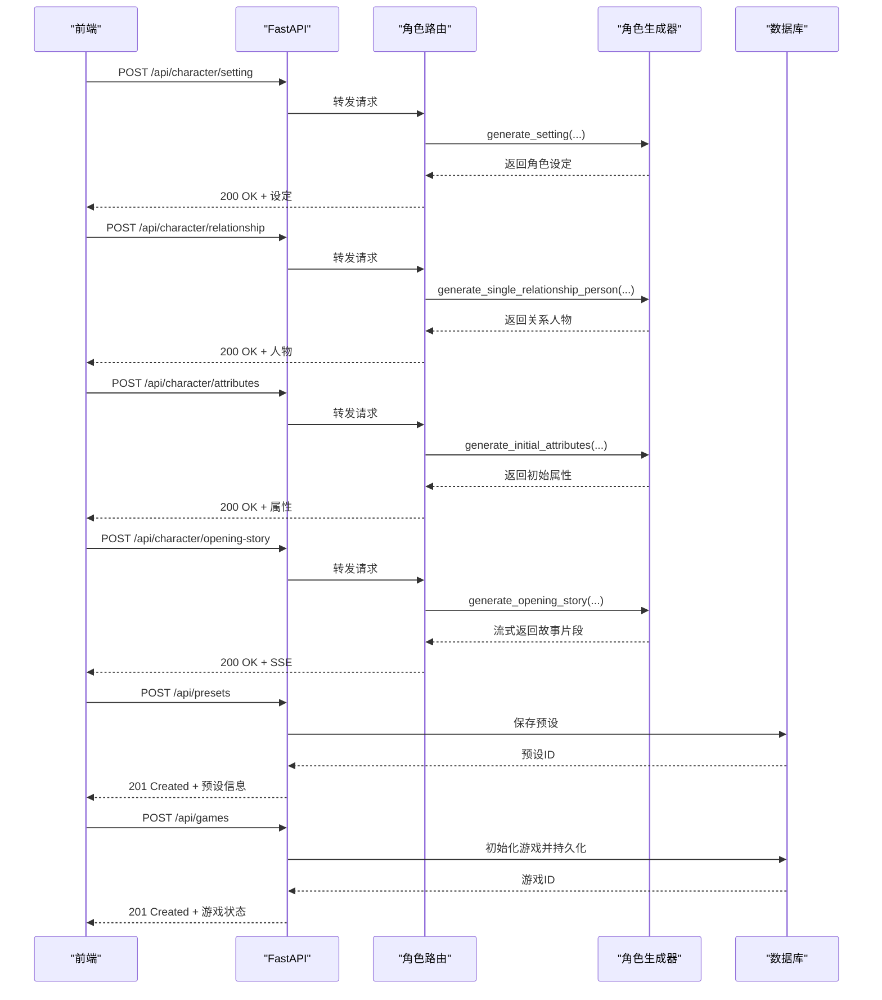
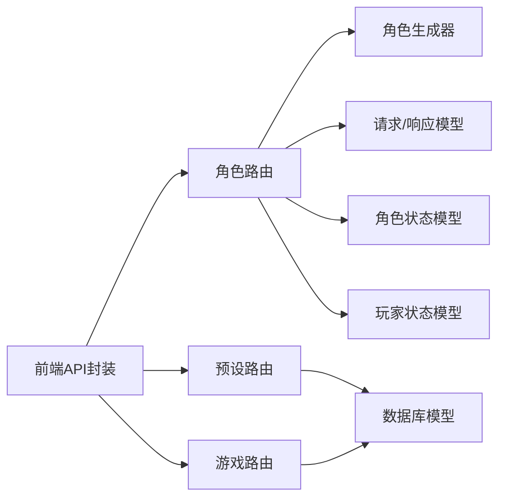

# 角色API

<cite>
**本文引用的文件**
- [src/api/routers/character.py](file://src/api/routers/character.py)
- [src/api/schemas.py](file://src/api/schemas.py)
- [src/game/character_creation.py](file://src/game/character_creation.py)
- [src/game/state/character_state.py](file://src/game/state/character_state.py)
- [src/game/state/player_state.py](file://src/game/state/player_state.py)
- [src/database/models.py](file://src/database/models.py)
- [src/api/routers/presets.py](file://src/api/routers/presets.py)
- [src/api/routers/games.py](file://src/api/routers/games.py)
- [frontend/src/lib/api.ts](file://frontend/src/lib/api.ts)
- [config/prompts/character_prompts.py](file://config/prompts/character_prompts.py)
- [src/api/main.py](file://src/api/main.py)
- [tests/test_api_character.py](file://tests/test_api_character.py)
</cite>

## 目录
1. [简介](#简介)
2. [项目结构](#项目结构)
3. [核心组件](#核心组件)
4. [架构总览](#架构总览)
5. [详细组件分析](#详细组件分析)
6. [依赖分析](#依赖分析)
7. [性能考量](#性能考量)
8. [故障排查指南](#故障排查指南)
9. [结论](#结论)
10. [附录](#附录)

## 简介
本文件为“角色API”的详细RESTful API文档，覆盖角色创建、更新、删除与查询相关接口，以及角色设置参数、预设管理、角色状态同步与一致性保障、请求/响应示例、数据验证规则与业务约束、角色模板与自定义创建最佳实践，以及角色与游戏会话的数据关联机制。目标读者既包括后端开发者，也包括前端集成人员与产品运营。

## 项目结构
角色API位于后端FastAPI应用中，路由集中在character模块，配合角色生成器、状态模型与数据库模型共同构成角色生命周期管理。前端通过统一的API封装进行调用。

图表来源
- [src/api/main.py](file://src/api/main.py#L80-L89)
- [src/api/routers/character.py](file://src/api/routers/character.py#L1-L210)
- [src/api/routers/presets.py](file://src/api/routers/presets.py#L1-L92)
- [src/api/routers/games.py](file://src/api/routers/games.py#L1-L389)
- [src/game/character_creation.py](file://src/game/character_creation.py#L1-L721)
- [src/game/state/character_state.py](file://src/game/state/character_state.py#L1-L243)
- [src/game/state/player_state.py](file://src/game/state/player_state.py#L1-L590)
- [src/database/models.py](file://src/database/models.py#L1-L295)

章节来源
- [src/api/main.py](file://src/api/main.py#L80-L89)

## 核心组件
- 角色生成器：负责按设置类型生成时代、年龄、性别、世界、家庭、关系、特质、财富等设定，并生成初始属性与开场故事。
- 角色状态模型：描述NPC角色的动态属性（情绪、亲密度、信任、尊重等）与事件触发阈值。
- 玩家状态模型：承载玩家核心属性、时间进度、回合系统、关系网络、世界模型与存档点等。
- 数据库模型：提供角色预设、游戏会话、状态快照、图片等持久化能力。
- 前端API封装：统一封装认证、路由与错误处理，便于前端调用。

章节来源
- [src/game/character_creation.py](file://src/game/character_creation.py#L38-L721)
- [src/game/state/character_state.py](file://src/game/state/character_state.py#L13-L243)
- [src/game/state/player_state.py](file://src/game/state/player_state.py#L15-L590)
- [src/database/models.py](file://src/database/models.py#L145-L160)
- [frontend/src/lib/api.ts](file://frontend/src/lib/api.ts#L1-L564)

## 架构总览
角色API围绕“角色设定生成—角色状态管理—游戏会话绑定—预设持久化”展开，前端通过统一的API封装调用后端路由，后端通过角色生成器与状态模型协调完成角色生命周期管理。

图表来源
- [src/api/routers/character.py](file://src/api/routers/character.py#L27-L210)
- [src/api/routers/presets.py](file://src/api/routers/presets.py#L13-L37)
- [src/api/routers/games.py](file://src/api/routers/games.py#L26-L58)
- [src/game/character_creation.py](file://src/game/character_creation.py#L52-L608)

## 详细组件分析

### 角色设定生成接口
- 端点：POST /api/character/setting
- 功能：按设置类型生成角色设定（时代、年龄、性别、世界、家庭、关系、特质、财富）。
- 请求体字段：
  - setting_type：设定类型（era|age|gender|world|family|relationships|traits|wealth）
  - player_name：玩家姓名
  - life_vision：人生愿景
  - previous_settings：先前生成的设定字典
  - feedback：可选的用户反馈
  - language：语言（默认zh）
- 响应：对应类型的设定字典（JSON）
- 示例请求：
  - setting_type: "era"
  - player_name: "李明"
  - life_vision: "成为作家"
  - previous_settings: {}
  - language: "zh"
- 示例响应：
  - {"year": 2024, "era_description": "现代", "world_context": "现代社会"}

章节来源
- [src/api/routers/character.py](file://src/api/routers/character.py#L27-L43)
- [src/api/schemas.py](file://src/api/schemas.py#L76-L82)
- [config/prompts/character_prompts.py](file://config/prompts/character_prompts.py#L132-L387)

### 关系人物生成接口
- 端点：POST /api/character/relationship
- 功能：生成单个关系人物（含丰富属性）。
- 请求体字段：
  - player_name、life_vision、previous_settings、existing_people、person_index、total_needed、feedback、language
- 响应：包含姓名、角色定位、关系描述、年龄、性别、职业、性格标签、气质、情绪、亲密度、信任度、尊重度等。
- 示例请求：
  - existing_people: []
  - person_index: 0
  - total_needed: 3
- 示例响应：
  - {"name": "张华", "role": "大学室友", "relationship_desc": "...", "age": 25, ...}

章节来源
- [src/api/routers/character.py](file://src/api/routers/character.py#L45-L62)
- [src/api/schemas.py](file://src/api/schemas.py#L84-L92)
- [config/prompts/character_prompts.py](file://config/prompts/character_prompts.py#L393-L530)

### 初始属性生成接口
- 端点：POST /api/character/attributes
- 功能：基于角色设定生成初始属性（精力、情绪、学识、财富）。
- 请求体字段：
  - character_settings：完整角色设定
  - language：语言
- 响应：属性字典（energy、mood、knowledge、wealth）
- 示例请求：
  - character_settings: {"era": {...}, "traits": {...}, "family": {...}, "age": {...}}
- 示例响应：
  - {"energy": 70, "mood": 60, "knowledge": 50, "wealth": 10000}

章节来源
- [src/api/routers/character.py](file://src/api/routers/character.py#L65-L77)
- [src/api/schemas.py](file://src/api/schemas.py#L94-L96)
- [config/prompts/character_prompts.py](file://config/prompts/character_prompts.py#L586-L701)

### 关系总结生成接口
- 端点：POST /api/character/relationships-summary
- 功能：基于已生成的关键人物生成关系总结描述。
- 请求体字段：
  - player_name、life_vision、previous_settings、key_people、language
- 响应：包含relationships_description的字典
- 示例请求：
  - key_people: [{"name": "张华", "role": "室友"}, {"name": "李教授", "role": "导师"}]
- 示例响应：
  - {"relationships_description": "你与三位关键人物建立了深厚关系..."}

章节来源
- [src/api/routers/character.py](file://src/api/routers/character.py#L195-L209)
- [src/api/schemas.py](file://src/api/schemas.py#L104-L109)
- [config/prompts/character_prompts.py](file://config/prompts/character_prompts.py#L533-L583)

### 开场故事生成接口（SSE）
- 端点：POST /api/character/opening-story
- 功能：生成开场故事，使用Server-Sent Events流式返回。
- 请求体字段：
  - character_settings、player_name、life_vision、language
- 响应：SSE流，事件类型包括status、story、complete；包含缓存控制头。
- 缓存策略：同一玩家名在短时间内返回缓存结果；并发请求返回409。
- 示例请求：
  - character_settings: {...}
  - player_name: "李明"
- 示例响应事件：
  - event: status → {"phase": "preparing/cached"}
  - event: story → 文本片段
  - event: complete → {"full_story": "完整故事"}

章节来源
- [src/api/routers/character.py](file://src/api/routers/character.py#L80-L192)
- [src/api/schemas.py](file://src/api/schemas.py#L98-L102)
- [config/prompts/character_prompts.py](file://config/prompts/character_prompts.py#L704-L800)

### 角色状态模型（NPC）
- 字段概览：
  - 基础信息：name、role、relationship_desc、age、gender、occupation
  - 性格系统：personality_traits、temperament
  - 动态状态：mood、mood_stability
  - 社会属性：social_status、influence
  - 能力属性：competence、specialty
  - 隐藏属性：sexual_orientation、relationship_status、romantic_interest、has_external_obstacle、peak_affinity
  - 与主角关联：affinity、trust、respect
  - 互动记录：interaction_count、last_interaction_week、relationship_history
  - 事件触发阈值：event_triggers（含深度友谊、冲突、帮助请求、秘密分享、背叛风险、恋爱火花、求婚、分手、私奔、结拜、知己、创业合伙、托付、反目成仇、背叛、决裂、暗中陷害、师徒、贵人提携、生育子女等）
  - 已触发事件：triggered_events
- 方法：
  - update_mood、update_relationship、record_interaction、check_event_trigger、get_interaction_style、to_context_string、from_simple_dict

章节来源
- [src/game/state/character_state.py](file://src/game/state/character_state.py#L13-L243)

### 玩家状态模型（核心）
- 字段概览：
  - 玩家身份：player_name、life_vision
  - 核心属性：energy、mood、knowledge、wealth
  - 关系网络：relationships（兼容旧版）、characters（CharacterState）
  - 时间进度：age、week、current_round、rounds_per_week、round_history、weekly_summaries、yearly_summaries
  - 故事历史：story_history、four_week_summaries
  - 当前事件：current_event_data
  - 世界模型：established_facts、world_model_data、foreshadowing_seeds、character_habits、pending_storylines
  - 预定事件：scheduled_events
- 方法：
  - update、advance_week、advance_round、is_week_complete、get_current_week_rounds、get_game_date_info、get_round_context、validate、to_dict、from_dict、is_game_over、get_current_phase、get_round_name
  - 角色管理：add_character、get_character、get_all_characters、update_character、update_character_relationship、sync_relationships_to_characters、sync_characters_to_relationships、get_characters_context、check_character_events、initialize_characters_from_settings
  - 预定事件管理：add_scheduled_event、get_scheduled_event_manager、sync_scheduled_events_from_manager、get_pending_scheduled_events、mark_scheduled_event_triggered、get_overdue_scheduled_events

章节来源
- [src/game/state/player_state.py](file://src/game/state/player_state.py#L15-L590)

### 角色预设管理
- 保存预设：POST /api/presets
  - 请求体：preset_name、player_name、life_vision、character_settings
  - 响应：PresetInfo
- 列表预设：GET /api/presets
  - 查询参数：limit（默认50）、user_id（鉴权）
  - 响应：PresetInfo[]
- 获取预设：GET /api/presets/{preset_id}
  - 响应：PresetInfo
- 删除预设：DELETE /api/presets/{preset_id}
  - 响应：MessageResponse

章节来源
- [src/api/routers/presets.py](file://src/api/routers/presets.py#L13-L91)
- [src/api/schemas.py](file://src/api/schemas.py#L114-L127)
- [src/database/models.py](file://src/database/models.py#L145-L160)

### 角色与游戏会话的关系
- 创建游戏：POST /api/games
  - 请求体：character_settings、player_name、life_vision、language
  - 响应：GameStateResponse（包含game_id、player_state、progress、round_info、current_event）
  - 同时记录活跃游戏ID，支持服务端会话恢复。
- 加载游戏：GET /api/games/{game_id}
  - 响应：GameStateResponse
- 获取活跃游戏：GET /api/games/active
  - 响应：GameStateResponse（自动恢复）
- 保存/删除/清理缓存：POST /api/games/{game_id}/save、DELETE /api/games/{game_id}、POST /api/games/{game_id}/clear-cache
- 时间回溯存档：POST /api/games/{game_id}/save-point、GET /api/games/{game_id}/save-points、GET /api/games/{game_id}/timeline、GET /api/games/load-save-point/{state_id}、DELETE /api/games/save-point/{state_id}

章节来源
- [src/api/routers/games.py](file://src/api/routers/games.py#L26-L389)
- [src/api/schemas.py](file://src/api/schemas.py#L47-L72)
- [src/database/models.py](file://src/database/models.py#L70-L111)

### 前端调用示例
- 角色创建相关：
  - character.generateSetting(data)
  - character.generateRelationship(data)
  - character.generateAttributes(data)
  - character.generateRelationshipsSummary(data)
- 预设管理：
  - presets.create(data)
  - presets.list()
  - presets.get(id)
  - presets.delete(id)
- 游戏会话：
  - games.create(data)
  - games.getActive()
  - games.load(id)
  - games.save(id)
  - games.createSavePoint(id, saveName?)
  - games.listSavePoints(id)
  - games.getTimeline(id)
  - games.loadSavePoint(stateId)
  - games.deleteSavePoint(stateId)

章节来源
- [frontend/src/lib/api.ts](file://frontend/src/lib/api.ts#L280-L325)
- [frontend/src/lib/api.ts](file://frontend/src/lib/api.ts#L310-L325)
- [frontend/src/lib/api.ts](file://frontend/src/lib/api.ts#L231-L276)

## 依赖分析
- 角色路由依赖角色生成器与请求/响应模型。
- 角色生成器依赖AI生成器与提示词模块。
- 角色状态模型与玩家状态模型相互协作，前者用于NPC，后者用于玩家。
- 预设与游戏路由依赖数据库模型进行持久化。
- 前端API封装统一调用后端路由，支持Cookie与Authorization双认证。

图表来源
- [src/api/routers/character.py](file://src/api/routers/character.py#L1-L210)
- [src/api/routers/presets.py](file://src/api/routers/presets.py#L1-L92)
- [src/api/routers/games.py](file://src/api/routers/games.py#L1-L389)
- [frontend/src/lib/api.ts](file://frontend/src/lib/api.ts#L1-L564)

## 性能考量
- 开场故事生成采用SSE流式返回，前端可逐步渲染，降低首屏延迟。
- 角色生成器对重复请求进行缓存与并发控制，避免重复计算。
- 数据库层使用索引与连接池，支持高并发读写。
- 前端API封装支持Cookie认证，减少Header传输开销。

## 故障排查指南
- 角色设定生成失败：检查previous_settings完整性与setting_type合法性；查看后端日志与异常处理器返回的详细信息。
- 关系人物生成失败：检查existing_people与命名规范；关注提示词中的禁止用语。
- 开场故事SSE异常：确认客户端SSE连接与事件解析；检查缓存状态与并发冲突。
- 预设保存失败：确认用户鉴权与字符集限制；检查数据库连接与事务。
- 游戏会话恢复失败：确认活跃游戏ID是否存在与权限校验；必要时清理会话缓存。

章节来源
- [src/api/routers/character.py](file://src/api/routers/character.py#L80-L192)
- [src/api/routers/presets.py](file://src/api/routers/presets.py#L13-L37)
- [src/api/routers/games.py](file://src/api/routers/games.py#L83-L126)
- [src/api/main.py](file://src/api/main.py#L69-L76)

## 结论
角色API提供了从角色设定生成、关系构建、初始属性计算到开场故事流式生成的完整能力，并通过预设与游戏会话实现角色数据的持久化与一致性保障。结合前后端协同与严格的验证规则，能够支撑高质量的角色驱动叙事体验。

## 附录

### 请求/响应示例（角色创建）
- 设置生成
  - 请求：POST /api/character/setting
  - Body: {"setting_type":"era","player_name":"李明","life_vision":"成为作家","previous_settings":{},"language":"zh"}
  - 响应：{"year":2024,"era_description":"现代","world_context":"现代社会"}
- 关系人物生成
  - 请求：POST /api/character/relationship
  - Body: {"player_name":"李明","life_vision":"","previous_settings":{},"existing_people":[],"person_index":0,"total_needed":3,"language":"zh"}
  - 响应：包含姓名、角色、关系描述、年龄、性别、职业、性格、气质、情绪、亲密度、信任度、尊重度等字段
- 初始属性生成
  - 请求：POST /api/character/attributes
  - Body: {"character_settings":{"era":{"year":2024},"traits":{"personality":"开朗"},"family":{"family_economy":"中产"},"age":{"age":22}},"language":"zh"}
  - 响应：{"energy":70,"mood":60,"knowledge":50,"wealth":10000}
- 关系总结生成
  - 请求：POST /api/character/relationships-summary
  - Body: {"player_name":"李明","life_vision":"","previous_settings":{},"key_people":[{"name":"张华","role":"室友"},{"name":"李教授","role":"导师"}],"language":"zh"}
  - 响应：{"relationships_description":"你与三位关键人物建立了深厚关系..."}
- 开场故事生成（SSE）
  - 请求：POST /api/character/opening-story
  - Body: {"character_settings":{"era":{"year":2024},"age":{"age":22},"gender":{"gender":"男"},"world":{"world_description":"现代世界"},"family":{"family_description":"中产家庭"},"traits":{"traits_description":"开朗乐观"},"wealth":{"wealth":50000}},"player_name":"李明","life_vision":"成为作家","language":"zh"}
  - 响应：SSE事件流，包含status、story、complete

章节来源
- [tests/test_api_character.py](file://tests/test_api_character.py#L24-L180)
- [tests/test_api_character.py](file://tests/test_api_character.py#L182-L242)
- [tests/test_api_character.py](file://tests/test_api_character.py#L244-L276)
- [tests/test_api_character.py](file://tests/test_api_character.py#L278-L310)
- [tests/test_api_character.py](file://tests/test_api_character.py#L312-L365)

### 数据验证规则与业务约束
- setting_type必须为枚举值之一：era、age、gender、world、family、relationships、traits、wealth。
- age生成时需根据era.year计算birth_year，否则修正。
- wealth生成时不得为0，最低1000，必要时回退。
- 关系人物生成禁止使用模糊描述（如“有一些朋友”），必须具体、生动、有故事性。
- SSE缓存：同一player_name在5分钟内缓存，超过60秒的生成状态视为失效。
- 关系网络：relationships与characters双向同步，防止数据不一致。

章节来源
- [src/game/character_creation.py](file://src/game/character_creation.py#L96-L159)
- [src/game/character_creation.py](file://src/game/character_creation.py#L256-L261)
- [src/api/routers/character.py](file://src/api/routers/character.py#L80-L115)
- [src/game/state/player_state.py](file://src/game/state/player_state.py#L466-L481)

### 角色模板系统与自定义创建最佳实践
- 使用预设保存常用角色配置，便于快速复用与分享。
- 在生成关系人物时，结合existing_people避免重复角色与姓名。
- 利用feedback参数进行迭代优化，提升生成质量。
- 将生成的设定与属性组合为character_settings，作为后续游戏初始化的基础。

章节来源
- [src/api/routers/presets.py](file://src/api/routers/presets.py#L13-L37)
- [src/game/character_creation.py](file://src/game/character_creation.py#L204-L211)
- [src/game/character_creation.py](file://src/game/character_creation.py#L524-L530)

### 角色状态同步机制
- 前端通过统一API封装与后端交互，后端在路由层进行鉴权与参数校验。
- 角色状态模型与玩家状态模型在内存中维护，数据库模型负责持久化。
- SSE流式返回确保前端实时渲染，同时后端进行缓存与并发控制。
- 游戏会话通过活跃游戏ID与数据库记录保持一致性，支持服务端会话恢复。

章节来源
- [frontend/src/lib/api.ts](file://frontend/src/lib/api.ts#L69-L124)
- [src/api/routers/character.py](file://src/api/routers/character.py#L80-L192)
- [src/api/routers/games.py](file://src/api/routers/games.py#L83-L126)
- [src/database/models.py](file://src/database/models.py#L22-L23)