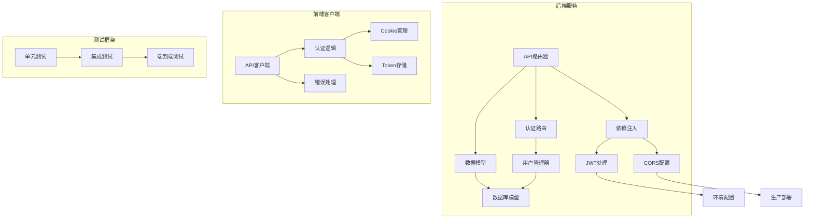
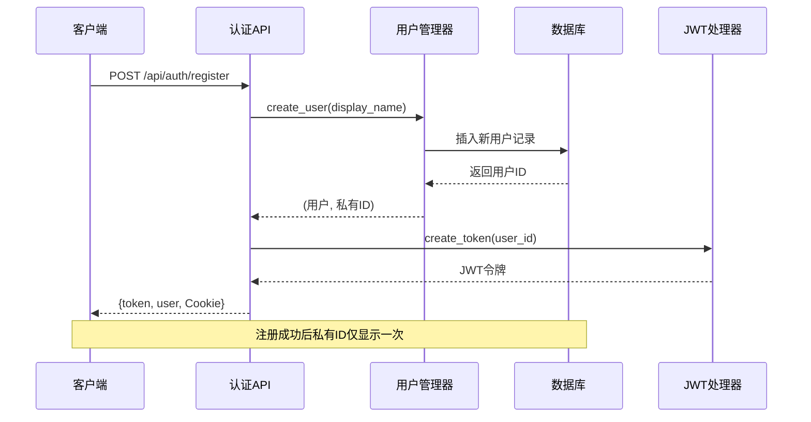
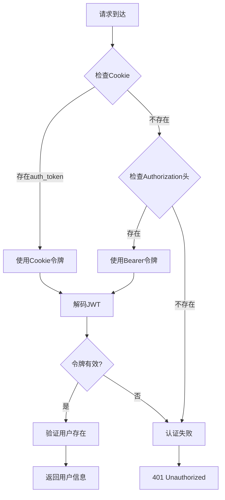
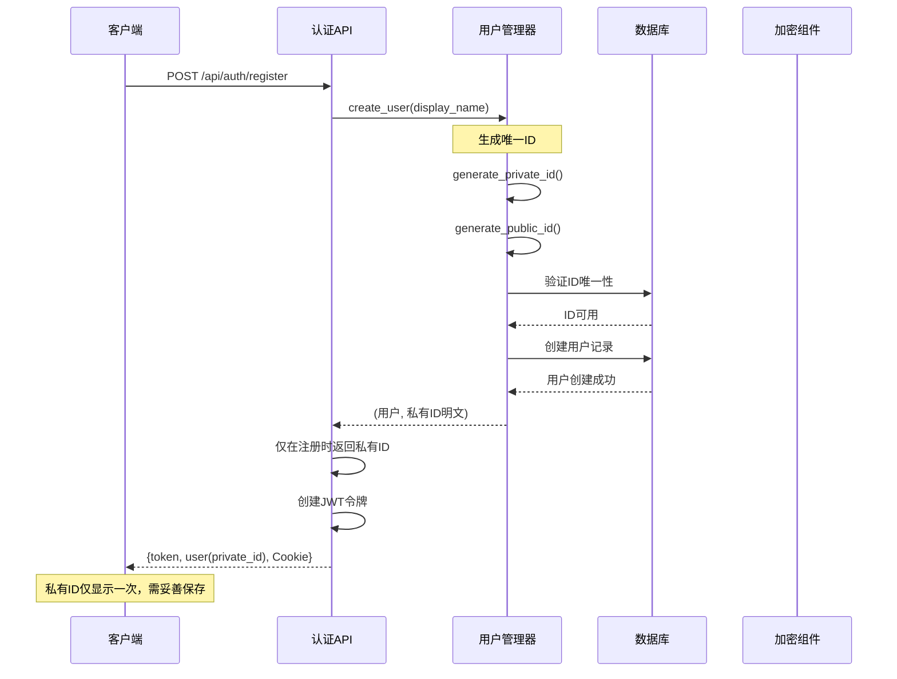
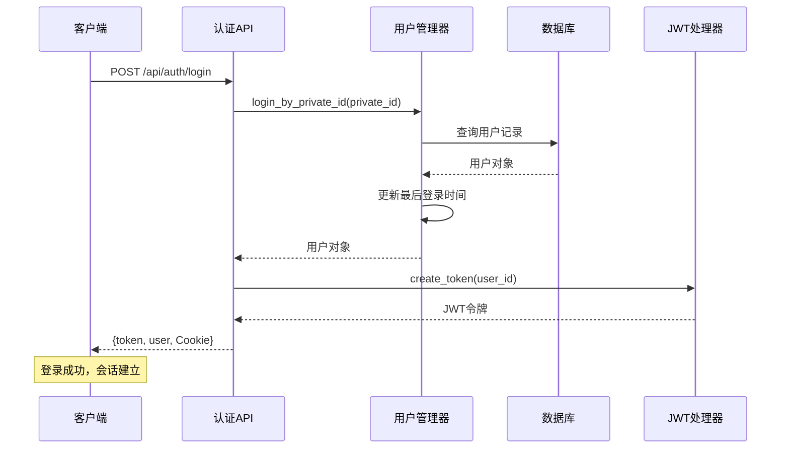
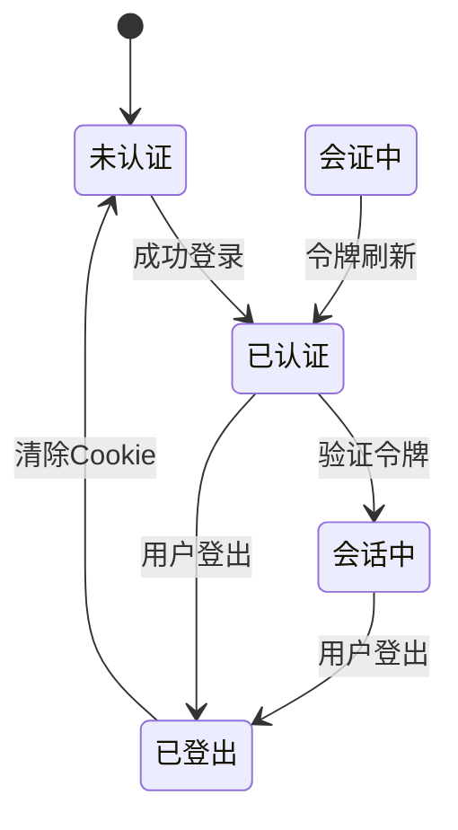
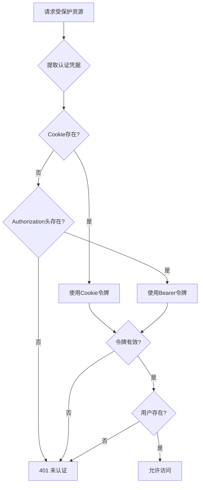
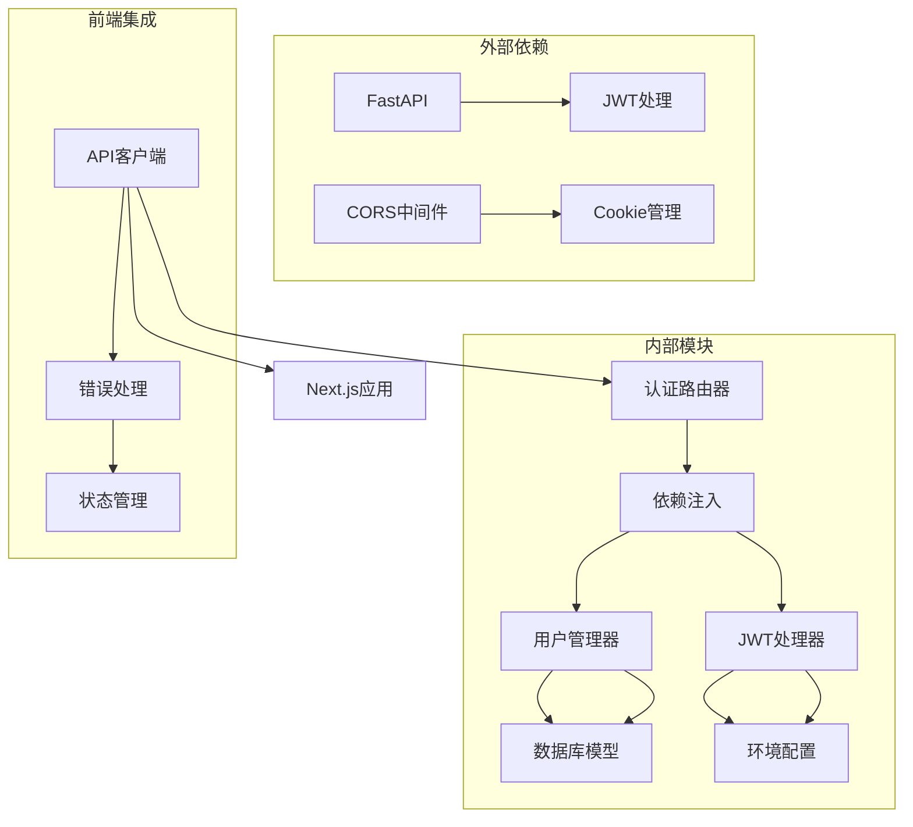

# 认证API

<cite>
**本文档引用的文件**
- [src/api/routers/auth.py](file://src/api/routers/auth.py)
- [src/api/deps.py](file://src/api/deps.py)
- [src/api/schemas.py](file://src/api/schemas.py)
- [src/api/main.py](file://src/api/main.py)
- [src/database/user_manager.py](file://src/database/user_manager.py)
- [src/database/models.py](file://src/database/models.py)
- [frontend/src/lib/api.ts](file://frontend/src/lib/api.ts)
- [tests/test_api_auth.py](file://tests/test_api_auth.py)
- [.env.example](file://.env.example)
</cite>

## 目录
1. [简介](#简介)
2. [项目结构](#项目结构)
3. [核心组件](#核心组件)
4. [架构概览](#架构概览)
5. [详细组件分析](#详细组件分析)
6. [依赖关系分析](#依赖关系分析)
7. [性能考虑](#性能考虑)
8. [故障排除指南](#故障排除指南)
9. [结论](#结论)
10. [附录](#附录)

## 简介

认证API是"人生草稿本"交互式叙事游戏的核心安全基础设施，负责用户身份验证、会话管理和权限控制。该系统采用JWT令牌机制结合Cookie认证，提供双重认证策略以确保跨平台兼容性和安全性。

系统支持三种主要认证方式：
- **Cookie认证**：优先级最高的认证方式，使用httpOnly Cookie防止XSS攻击
- **Bearer Token认证**：基于Authorization头的JWT令牌认证
- **混合认证**：自动在Cookie和Bearer Token之间切换

## 项目结构

认证系统由以下关键模块组成：

**图表来源**
- [src/api/routers/auth.py](file://src/api/routers/auth.py#L1-L125)
- [src/api/deps.py](file://src/api/deps.py#L1-L150)
- [frontend/src/lib/api.ts](file://frontend/src/lib/api.ts#L1-L564)

**章节来源**
- [src/api/routers/auth.py](file://src/api/routers/auth.py#L1-L125)
- [src/api/deps.py](file://src/api/deps.py#L1-L150)
- [src/api/main.py](file://src/api/main.py#L1-L134)

## 核心组件

### 认证路由器 (Auth Router)

认证路由器提供四个核心端点：
- `POST /api/auth/register` - 用户注册
- `POST /api/auth/login` - 用户登录
- `GET /api/auth/me` - 获取当前用户信息
- `POST /api/auth/logout` - 用户登出

每个端点都实现了完整的错误处理和响应格式化。

### JWT令牌管理

系统使用HS256算法生成24小时有效期的JWT令牌。令牌包含以下声明：
- `sub`: 用户ID
- `exp`: 过期时间戳

令牌通过Cookie和Authorization头两种方式传输，确保最大兼容性。

### 用户管理器

用户管理器负责用户生命周期管理：
- 用户创建和唯一ID生成
- 私有ID和公有ID管理
- 用户信息查询和更新
- 登录历史追踪

**章节来源**
- [src/api/routers/auth.py](file://src/api/routers/auth.py#L44-L124)
- [src/database/user_manager.py](file://src/database/user_manager.py#L68-L127)

## 架构概览

认证系统采用分层架构设计，确保关注点分离和可维护性：

**图表来源**
- [src/api/routers/auth.py](file://src/api/routers/auth.py#L44-L70)
- [src/database/user_manager.py](file://src/database/user_manager.py#L68-L102)

### Cookie认证机制

系统采用智能Cookie认证策略：

**图表来源**
- [src/api/deps.py](file://src/api/deps.py#L70-L132)
- [frontend/src/lib/api.ts](file://frontend/src/lib/api.ts#L48-L67)

**章节来源**
- [src/api/deps.py](file://src/api/deps.py#L70-L132)
- [frontend/src/lib/api.ts](file://frontend/src/lib/api.ts#L69-L124)

## 详细组件分析

### 用户注册流程

用户注册是认证系统的第一步，涉及多个安全考量：

**图表来源**
- [src/api/routers/auth.py](file://src/api/routers/auth.py#L44-L70)
- [src/database/user_manager.py](file://src/database/user_manager.py#L68-L102)

#### 注册安全特性

1. **一次性私有ID暴露**：私有ID仅在创建时返回，避免重复泄露
2. **唯一性保证**：系统自动检查并确保ID的唯一性
3. **Cookie安全设置**：
   - httpOnly防止JavaScript访问
   - Secure标志确保HTTPS传输
   - SameSite保护防止CSRF攻击

### 用户登录流程

登录流程验证用户凭据并建立会话：

**图表来源**
- [src/api/routers/auth.py](file://src/api/routers/auth.py#L73-L99)
- [src/database/user_manager.py](file://src/database/user_manager.py#L104-L126)

#### 登录验证机制

1. **私有ID标准化**：自动处理大小写和格式差异
2. **实时登录追踪**：每次登录都会更新最后登录时间
3. **令牌生命周期**：24小时有效期，到期后需要重新认证

### 会话管理

系统采用无状态JWT令牌配合Cookie实现会话管理：

**图表来源**
- [src/api/routers/auth.py](file://src/api/routers/auth.py#L116-L124)
- [src/api/deps.py](file://src/api/deps.py#L116-L132)

### 权限控制

权限控制基于用户身份验证，所有受保护端点都需要有效的认证凭据：

**图表来源**
- [src/api/deps.py](file://src/api/deps.py#L70-L132)

**章节来源**
- [src/api/routers/auth.py](file://src/api/routers/auth.py#L102-L113)
- [src/api/deps.py](file://src/api/deps.py#L107-L132)

## 依赖关系分析

认证系统的依赖关系清晰且职责分明：

**图表来源**
- [src/api/main.py](file://src/api/main.py#L80-L89)
- [src/api/deps.py](file://src/api/deps.py#L1-L150)

### 关键依赖关系

1. **认证路由器依赖**：
   - 依赖注入模块提供用户管理和JWT处理
   - 使用Pydantic模型进行数据验证

2. **用户管理器依赖**：
   - 基于SQLAlchemy ORM操作数据库
   - 维护用户生命周期状态

3. **前端客户端依赖**：
   - 与后端API保持同步的类型定义
   - 实现智能认证策略切换

**章节来源**
- [src/api/main.py](file://src/api/main.py#L80-L89)
- [src/api/deps.py](file://src/api/deps.py#L1-L150)

## 性能考虑

认证系统的性能优化策略：

### 缓存策略
- **用户会话缓存**：使用内存缓存减少数据库查询
- **令牌验证缓存**：缓存最近使用的JWT令牌以提高验证速度

### 连接管理
- **数据库连接池**：复用数据库连接减少开销
- **单例模式**：用户管理器和数据库实例采用单例模式

### 网络优化
- **CORS预检缓存**：合理配置CORS头减少预检请求
- **Cookie压缩**：最小化Cookie大小以减少网络开销

## 故障排除指南

### 常见认证问题

#### 401 未认证错误
**症状**：API返回401状态码
**可能原因**：
- 缺少认证凭据
- 令牌过期或无效
- Cookie未正确设置

**解决方案**：
1. 检查客户端是否正确设置Cookie
2. 验证JWT令牌的有效性
3. 确认服务器时间同步

#### 400 错误请求
**症状**：注册或登录返回400状态码
**可能原因**：
- 用户名格式不正确
- 私有ID格式错误
- 数据库约束冲突

**解决方案**：
1. 验证输入数据格式
2. 检查用户名长度限制
3. 确认私有ID格式规范

#### 404 用户不存在
**症状**：`/api/auth/me`返回404状态码
**可能原因**：
- 用户已被删除
- 令牌对应的用户不存在
- 数据库不一致

**解决方案**：
1. 重新登录获取新令牌
2. 检查用户数据完整性
3. 验证数据库连接

### 调试工具

#### 服务器端调试
- 启用详细日志记录
- 监控JWT令牌生成和验证
- 跟踪用户会话状态

#### 客户端调试
- 检查Cookie设置情况
- 验证Authorization头内容
- 监控网络请求和响应

**章节来源**
- [tests/test_api_auth.py](file://tests/test_api_auth.py#L32-L276)

## 结论

认证API系统提供了完整、安全且高效的用户身份验证解决方案。通过JWT令牌与Cookie认证的结合，系统实现了跨平台兼容性和强安全性。关键特性包括：

1. **多层安全防护**：Cookie安全设置、令牌验证、CORS配置
2. **灵活认证策略**：支持多种认证方式自动切换
3. **完整的用户生命周期管理**：从注册到登出的全流程支持
4. **优秀的开发体验**：清晰的API设计和完善的错误处理

该系统为"人生草稿本"提供了坚实的安全基础，确保用户数据的安全性和应用的可靠性。

## 附录

### API端点详细说明

#### 用户注册
- **方法**：POST `/api/auth/register`
- **请求体**：`RegisterRequest`
- **响应**：`AuthResponse`
- **安全要求**：无（匿名可注册）

#### 用户登录
- **方法**：POST `/api/auth/login`
- **请求体**：`LoginRequest`
- **响应**：`AuthResponse`
- **安全要求**：私有ID验证

#### 获取当前用户
- **方法**：GET `/api/auth/me`
- **认证要求**：必需
- **响应**：`UserInfo`

#### 用户登出
- **方法**：POST `/api/auth/logout`
- **认证要求**：必需
- **响应**：`MessageResponse`

### 环境配置

#### 必需环境变量
- `JWT_SECRET`：JWT签名密钥
- `COOKIE_SECURE`：Cookie安全标志
- `COOKIE_SAMESITE`：Cookie SameSite策略

#### 可选环境变量
- `CORS_ORIGINS`：允许的CORS源
- `DATABASE_URL`：数据库连接字符串

**章节来源**
- [.env.example](file://.env.example#L1-L22)