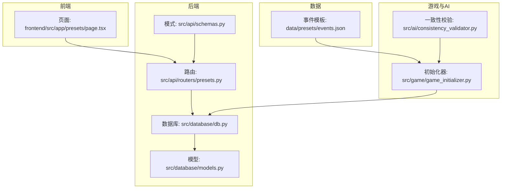
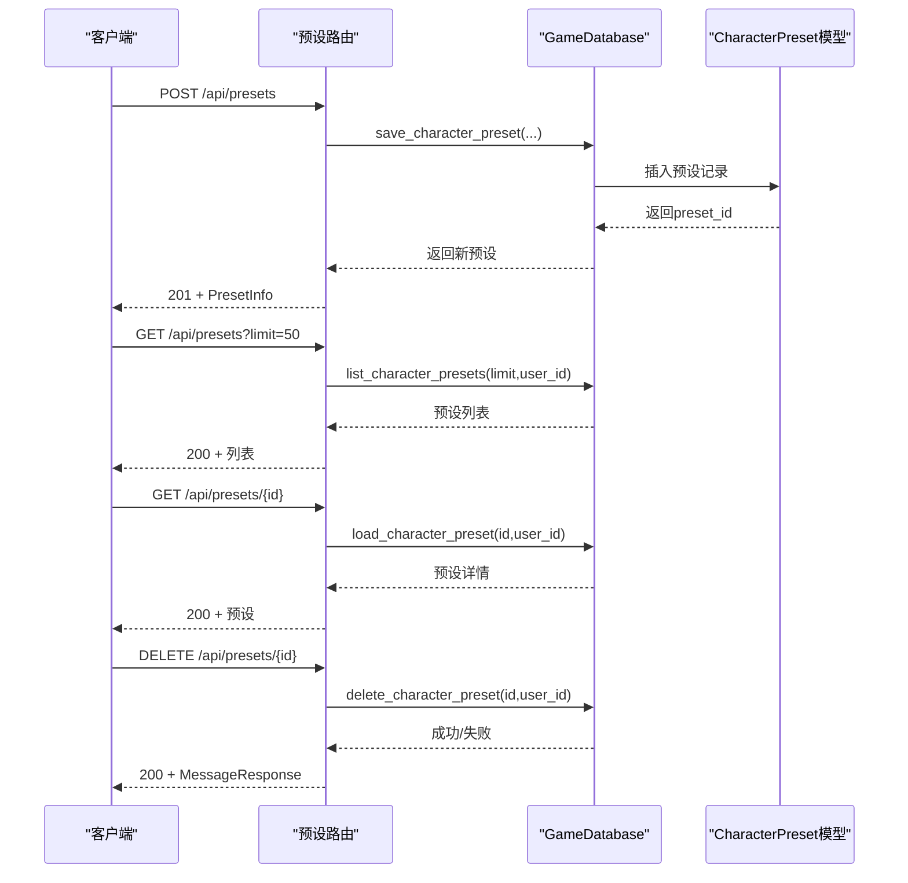
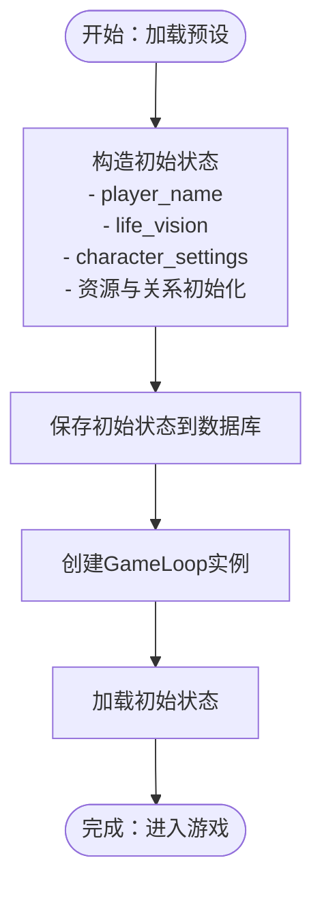
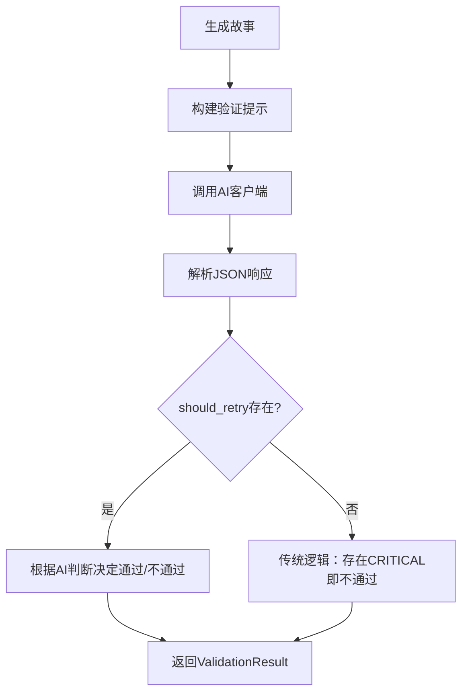
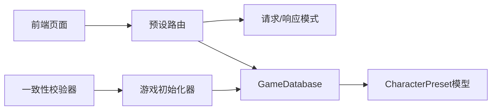

# 预设API

<cite>
**本文档引用的文件**
- [src/api/routers/presets.py](file://src/api/routers/presets.py)
- [src/api/schemas.py](file://src/api/schemas.py)
- [src/database/db.py](file://src/database/db.py)
- [src/database/models.py](file://src/database/models.py)
- [data/presets/events.json](file://data/presets/events.json)
- [frontend/src/app/presets/page.tsx](file://frontend/src/app/presets/page.tsx)
- [tests/test_api_presets.py](file://tests/test_api_presets.py)
- [src/game/game_initializer.py](file://src/game/game_initializer.py)
- [src/ai/consistency_validator.py](file://src/ai/consistency_validator.py)
</cite>

## 目录
1. [简介](#简介)
2. [项目结构](#项目结构)
3. [核心组件](#核心组件)
4. [架构总览](#架构总览)
5. [详细组件分析](#详细组件分析)
6. [依赖关系分析](#依赖关系分析)
7. [性能考虑](#性能考虑)
8. [故障排除指南](#故障排除指南)
9. [结论](#结论)
10. [附录](#附录)

## 简介
本文件为“预设API”的完整RESTful API文档，覆盖角色预设的创建、查询、删除等核心能力，并扩展说明与游戏初始化、一致性校验、事件模板、版本与历史记录、权限与访问控制、导入导出与格式标准化、模板库与社区贡献等机制的关系。文档面向开发者与产品使用者，既提供技术细节也提供可操作的使用指引。

## 项目结构
预设API位于后端FastAPI路由层，配合数据库模型与存储层实现角色预设的持久化；前端Next.js页面负责展示与交互；测试用例覆盖关键业务流程与边界条件。

图表来源
- [src/api/routers/presets.py](file://src/api/routers/presets.py#L1-L92)
- [src/api/schemas.py](file://src/api/schemas.py#L114-L127)
- [src/database/db.py](file://src/database/db.py#L454-L599)
- [src/database/models.py](file://src/database/models.py#L145-L160)
- [frontend/src/app/presets/page.tsx](file://frontend/src/app/presets/page.tsx#L1-L192)
- [data/presets/events.json](file://data/presets/events.json#L1-L239)
- [src/game/game_initializer.py](file://src/game/game_initializer.py#L27-L102)
- [src/ai/consistency_validator.py](file://src/ai/consistency_validator.py#L60-L238)

章节来源
- [src/api/routers/presets.py](file://src/api/routers/presets.py#L1-L92)
- [src/api/schemas.py](file://src/api/schemas.py#L114-L127)
- [src/database/db.py](file://src/database/db.py#L454-L599)
- [src/database/models.py](file://src/database/models.py#L145-L160)
- [frontend/src/app/presets/page.tsx](file://frontend/src/app/presets/page.tsx#L1-L192)
- [data/presets/events.json](file://data/presets/events.json#L1-L239)
- [src/game/game_initializer.py](file://src/game/game_initializer.py#L27-L102)
- [src/ai/consistency_validator.py](file://src/ai/consistency_validator.py#L60-L238)

## 核心组件
- 路由层：提供角色预设的POST/GET/DELETE接口，支持匿名与认证用户访问。
- 数据层：CharacterPreset模型与GameDatabase方法封装了预设的增删改查与权限控制。
- 模式层：CreatePresetRequest与PresetInfo定义请求与响应的数据结构。
- 前端页面：展示预设列表、加载与删除操作。
- 事件模板：events.json提供里程碑与特殊事件的模板数据，供游戏初始化与故事生成使用。
- 初始化器：从预设设置创建初始游戏状态并保存至数据库。
- 一致性校验：对生成故事进行跨维度一致性检查，保障预设驱动的世界观稳定。

章节来源
- [src/api/routers/presets.py](file://src/api/routers/presets.py#L13-L91)
- [src/database/db.py](file://src/database/db.py#L454-L599)
- [src/database/models.py](file://src/database/models.py#L145-L160)
- [src/api/schemas.py](file://src/api/schemas.py#L114-L127)
- [frontend/src/app/presets/page.tsx](file://frontend/src/app/presets/page.tsx#L25-L147)
- [data/presets/events.json](file://data/presets/events.json#L1-L239)
- [src/game/game_initializer.py](file://src/game/game_initializer.py#L27-L102)
- [src/ai/consistency_validator.py](file://src/ai/consistency_validator.py#L60-L238)

## 架构总览
预设API采用分层架构：路由层负责HTTP协议与鉴权，数据层负责数据库访问与业务逻辑，模式层统一输入输出结构，前端负责用户交互。预设与游戏初始化紧密耦合，预设数据成为游戏初始状态的核心来源；同时，一致性校验确保基于预设生成的故事符合设定。

图表来源
- [src/api/routers/presets.py](file://src/api/routers/presets.py#L13-L91)
- [src/database/db.py](file://src/database/db.py#L454-L599)
- [src/database/models.py](file://src/database/models.py#L145-L160)

## 详细组件分析

### 角色预设API规范
- 基础路径：/api/presets
- 认证方式：支持匿名访问；登录后可查看/管理自己的预设
- 限流与安全：路由层依赖依赖注入的鉴权函数，未通过鉴权时以匿名身份处理

端点定义
- POST /api/presets
  - 功能：保存角色预设
  - 请求体：CreatePresetRequest
  - 响应：201 + PresetInfo
  - 错误：500（数据库异常）
- GET /api/presets
  - 功能：列出角色预设（默认limit=50）
  - 查询参数：limit（整型）
  - 响应：200 + 预设数组（PresetInfo[]）
- GET /api/presets/{preset_id}
  - 功能：获取单个预设详情
  - 响应：200 + PresetInfo；404（不存在）
- DELETE /api/presets/{preset_id}
  - 功能：删除角色预设
  - 响应：200 + MessageResponse；404（不存在）

请求/响应示例（路径引用）
- 创建预设（匿名）：[tests/test_api_presets.py](file://tests/test_api_presets.py#L58-L69)
- 创建预设（带认证）：[tests/test_api_presets.py](file://tests/test_api_presets.py#L41-L56)
- 列表预设（带认证）：[tests/test_api_presets.py](file://tests/test_api_presets.py#L111-L129)
- 获取预设（带认证）：[tests/test_api_presets.py](file://tests/test_api_presets.py#L161-L177)
- 删除预设（带认证）：[tests/test_api_presets.py](file://tests/test_api_presets.py#L205-L212)

章节来源
- [src/api/routers/presets.py](file://src/api/routers/presets.py#L13-L91)
- [src/api/schemas.py](file://src/api/schemas.py#L114-L127)
- [tests/test_api_presets.py](file://tests/test_api_presets.py#L38-L229)

### 数据模型与权限控制
- 模型：CharacterPreset
  - 字段：preset_id、user_id（可空）、preset_name、player_name、life_vision、character_settings、created_at、updated_at
  - 外键：user_id → users.user_id
- 权限策略
  - 列表与获取：若提供user_id，则仅返回该用户预设或公共预设（user_id为NULL）
  - 删除：若提供user_id，则需拥有者权限或允许删除公共预设
- 前向兼容：user_id为NULL的预设视为公共预设，便于迁移与共享

章节来源
- [src/database/models.py](file://src/database/models.py#L145-L160)
- [src/database/db.py](file://src/database/db.py#L533-L599)

### 预设数据结构与模板系统
- 请求结构：CreatePresetRequest
  - 字段：preset_name（必填，长度1-100）、player_name（必填）、life_vision（可选）、character_settings（必填，JSON）
- 响应结构：PresetInfo
  - 字段：preset_id、preset_name、player_name、life_vision（可选）、character_settings（JSON）、created_at（可选）
- 模板系统
  - 事件模板：events.json提供里程碑与特殊事件的多语言选项与效果，供游戏初始化与故事生成使用
  - 与预设的关系：character_settings承载角色设定，events.json承载世界事件模板，二者共同构成游戏初始状态

章节来源
- [src/api/schemas.py](file://src/api/schemas.py#L114-L127)
- [data/presets/events.json](file://data/presets/events.json#L1-L239)

### 预设与游戏初始化的关系
- 初始化流程
  - 从前端接收character_settings、player_name、life_vision
  - 构造初始状态字典（包含年龄、周数、能量、心情、知识、财富、关系、角色、历史等）
  - 保存初始状态到数据库并创建Game记录
  - 加载GameLoop并开始游戏
- 预设的作用
  - 提供稳定的初始设定，确保每次从预设开始的游戏体验一致
  - 支持多语言与多轮次扩展

图表来源
- [src/game/game_initializer.py](file://src/game/game_initializer.py#L27-L102)

章节来源
- [src/game/game_initializer.py](file://src/game/game_initializer.py#L27-L102)

### 一致性校验与兼容性检查
- 一致性校验器
  - 输入：生成的故事文本、世界模型、玩家状态、角色设定、语言、可选历史故事
  - 输出：ValidationResult（passed、issues、fix_instructions）
  - 维度：地理、职业、个性、时间、承诺、因果、虚构（fabrication）
- 历史交叉验证
  - 结合数据库历史故事与动态事实，检测“虚构过去事件”“关键事实遗漏”“因果断裂”
  - 通过JSON结构化的输出，指导修正

图表来源
- [src/ai/consistency_validator.py](file://src/ai/consistency_validator.py#L60-L238)
- [src/ai/consistency_validator.py](file://src/ai/consistency_validator.py#L240-L404)

章节来源
- [src/ai/consistency_validator.py](file://src/ai/consistency_validator.py#L60-L238)
- [src/ai/consistency_validator.py](file://src/ai/consistency_validator.py#L240-L404)

### 版本管理与历史记录机制
- 预设层面
  - 数据库字段created_at/updated_at记录变更时间
  - 列表按updated_at倒序，支持版本迭代
- 游戏层面
  - GameState模型支持时间回溯存档（is_save_point）与自动快照
  - 与预设解耦：预设决定初始状态，存档点决定进度恢复点
- 建议实践
  - 预设变更时保留历史版本，避免破坏既有存档
  - 导出预设时附带created_at，便于溯源

章节来源
- [src/database/models.py](file://src/database/models.py#L94-L111)
- [src/database/db.py](file://src/database/db.py#L685-L786)

### 权限控制与访问限制
- 列表与获取
  - 未登录：仅可见公共预设（user_id为NULL）
  - 已登录：可见自己预设 + 公共预设
- 删除
  - 未登录：允许删除公共预设（兼容旧数据）
  - 已登录：需拥有者权限
- 建议
  - 对匿名用户限制创建频率，防止滥用
  - 对敏感字段（如用户ID）在响应中最小化暴露

章节来源
- [src/database/db.py](file://src/database/db.py#L533-L599)
- [src/api/routers/presets.py](file://src/api/routers/presets.py#L40-L91)

### 导入导出与格式标准化
- 导入
  - 建议：导入时校验preset_name长度、character_settings结构完整性、player_name必填
  - 兼容性：允许user_id为空（公共预设），便于迁移
- 导出
  - 建议：导出字段包含preset_id、preset_name、player_name、life_vision、character_settings、created_at
  - 标准化：统一JSON格式，多语言键位（如zh/en）分离
- 迁移
  - 旧数据：user_id为NULL的预设视为公共预设，迁移时可保留
  - 新数据：建议为每个预设绑定user_id，增强权限控制

章节来源
- [src/api/schemas.py](file://src/api/schemas.py#L114-L127)
- [src/database/db.py](file://src/database/db.py#L533-L599)

### 模板库与社区贡献机制
- 模板来源
  - events.json提供里程碑与特殊事件模板，支持多语言
- 社区贡献
  - 建议：社区贡献的模板以JSON形式提交，包含事件描述、选项与效果
  - 审核：对模板进行一致性与平衡性审核，避免破坏游戏体验
  - 分发：模板可作为公共预设共享，或集成到事件模板库

章节来源
- [data/presets/events.json](file://data/presets/events.json#L1-L239)

## 依赖关系分析
- 路由依赖模式：CreatePresetRequest、PresetInfo
- 路由依赖数据层：GameDatabase.save_character_preset/list/load/delete
- 数据层依赖模型：CharacterPreset
- 前端依赖路由：预设列表、加载与删除
- 初始化器依赖数据库：创建游戏记录
- 一致性校验依赖AI客户端与系统提示

图表来源
- [src/api/routers/presets.py](file://src/api/routers/presets.py#L6-L7)
- [src/api/schemas.py](file://src/api/schemas.py#L114-L127)
- [src/database/db.py](file://src/database/db.py#L454-L599)
- [src/database/models.py](file://src/database/models.py#L145-L160)
- [frontend/src/app/presets/page.tsx](file://frontend/src/app/presets/page.tsx#L27-L51)
- [src/game/game_initializer.py](file://src/game/game_initializer.py#L84-L102)
- [src/ai/consistency_validator.py](file://src/ai/consistency_validator.py#L42-L59)

章节来源
- [src/api/routers/presets.py](file://src/api/routers/presets.py#L6-L7)
- [src/database/db.py](file://src/database/db.py#L454-L599)
- [src/database/models.py](file://src/database/models.py#L145-L160)
- [frontend/src/app/presets/page.tsx](file://frontend/src/app/presets/page.tsx#L27-L51)
- [src/game/game_initializer.py](file://src/game/game_initializer.py#L84-L102)
- [src/ai/consistency_validator.py](file://src/ai/consistency_validator.py#L42-L59)

## 性能考虑
- 列表查询：默认limit=50，避免一次性返回过多数据
- 权限过滤：在SQL层通过OR条件筛选公共与私有预设，减少应用层处理
- 序列化：PresetInfo仅返回必要字段，避免传输冗余数据
- 前端缓存：预设列表可在前端缓存，减少重复请求

## 故障排除指南
- 404未找到
  - 检查preset_id是否存在，确认用户权限（删除/获取需拥有者权限）
- 500服务器错误
  - 数据库异常：检查save_character_preset执行日志
- 参数校验失败（422）
  - preset_name长度超出限制或为空
- 权限问题
  - 未登录用户无法删除他人预设；公共预设可被匿名删除

章节来源
- [src/api/routers/presets.py](file://src/api/routers/presets.py#L35-L37)
- [tests/test_api_presets.py](file://tests/test_api_presets.py#L71-L92)
- [tests/test_api_presets.py](file://tests/test_api_presets.py#L179-L185)
- [tests/test_api_presets.py](file://tests/test_api_presets.py#L214-L220)

## 结论
预设API围绕角色预设的生命周期设计，具备清晰的CRUD接口、完善的权限控制与数据模型支撑。通过与游戏初始化、事件模板、一致性校验的协同，预设成为稳定而可复用的游戏世界入口。建议在生产环境中强化速率限制、审计日志与模板审核，持续提升可用性与安全性。

## 附录

### API定义与示例（路径引用）
- 创建预设（匿名）：[tests/test_api_presets.py](file://tests/test_api_presets.py#L58-L69)
- 创建预设（带认证）：[tests/test_api_presets.py](file://tests/test_api_presets.py#L41-L56)
- 列表预设（带认证）：[tests/test_api_presets.py](file://tests/test_api_presets.py#L111-L129)
- 获取预设（带认证）：[tests/test_api_presets.py](file://tests/test_api_presets.py#L161-L177)
- 删除预设（带认证）：[tests/test_api_presets.py](file://tests/test_api_presets.py#L205-L212)