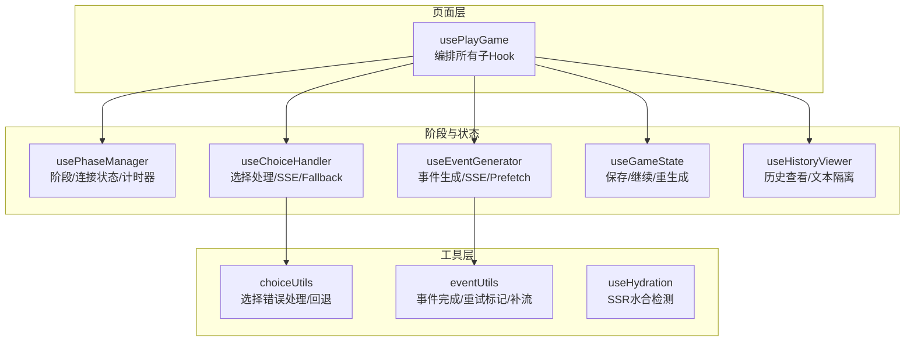
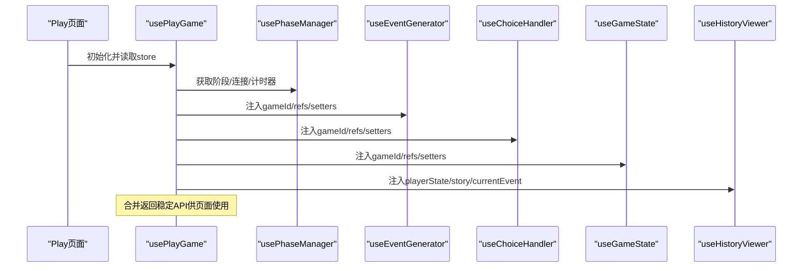
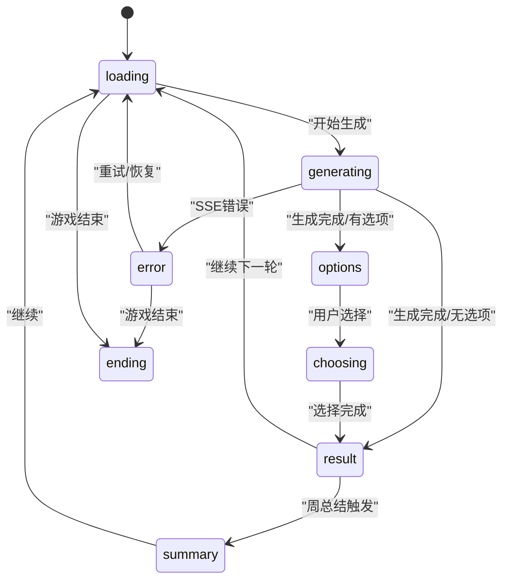
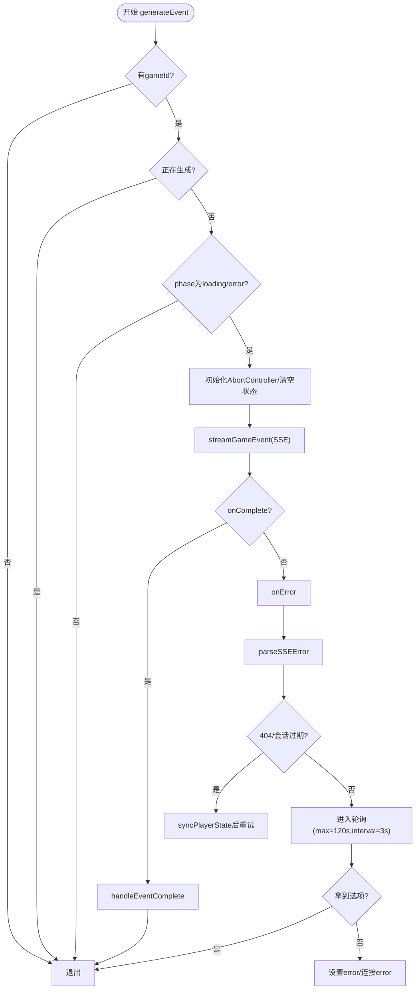
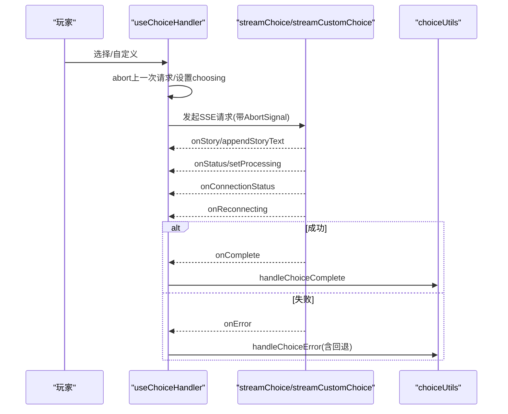
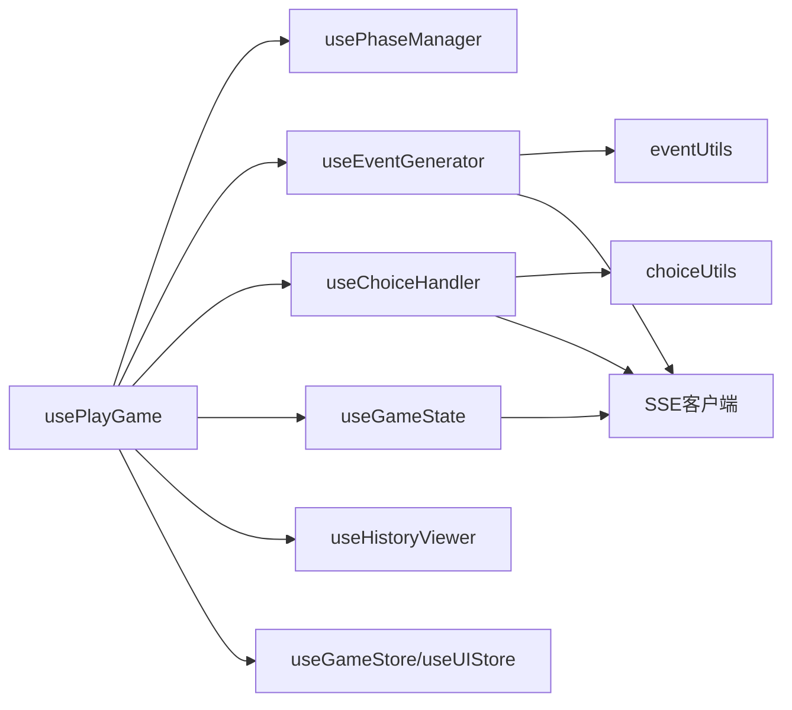

# Hooks和自定义Hook

<cite>
**本文档引用的文件**
- [usePlayGame.ts](file://frontend/src/hooks/usePlayGame.ts)
- [usePhaseManager.ts](file://frontend/src/hooks/game/usePhaseManager.ts)
- [useEventGenerator.ts](file://frontend/src/hooks/game/useEventGenerator.ts)
- [useChoiceHandler.ts](file://frontend/src/hooks/game/useChoiceHandler.ts)
- [useGameState.ts](file://frontend/src/hooks/game/useGameState.ts)
- [useHistoryViewer.ts](file://frontend/src/hooks/game/useHistoryViewer.ts)
- [choiceUtils.ts](file://frontend/src/hooks/game/choiceUtils.ts)
- [eventUtils.ts](file://frontend/src/hooks/game/eventUtils.ts)
- [useHydration.ts](file://frontend/src/hooks/useHydration.ts)
- [useGameState.test.ts](file://frontend/src/__tests__/hooks/useGameState.test.ts)
- [useChoiceHandler.test.ts](file://frontend/src/__tests__/hooks/useChoiceHandler.test.ts)
- [useEventGenerator.test.ts](file://frontend/src/__tests__/hooks/useEventGenerator.test.ts)
- [useHistoryViewer.test.ts](file://frontend/src/__tests__/hooks/useHistoryViewer.test.ts)
- [usePhaseManager.test.ts](file://frontend/src/__tests__/hooks/usePhaseManager.test.ts)
</cite>

## 目录
1. [简介](#简介)
2. [项目结构](#项目结构)
3. [核心组件](#核心组件)
4. [架构总览](#架构总览)
5. [详细组件分析](#详细组件分析)
6. [依赖分析](#依赖分析)
7. [性能考虑](#性能考虑)
8. [故障排查指南](#故障排查指南)
9. [结论](#结论)
10. [附录](#附录)

## 简介
本文件系统性梳理并文档化本项目的Hooks与自定义Hook，重点覆盖以下方面：
- 设计模式与实现策略：围绕游戏状态、选择处理、事件生成、历史查看与阶段管理五大核心Hook展开
- 功能职责、参数配置与返回值结构：明确每个Hook的输入、内部状态、副作用与对外暴露的方法
- 组合使用与依赖关系：展示usePlayGame如何编排多个子Hook，以及各Hook之间的协作方式
- 数据获取与状态更新：涵盖SSE流式回调、错误处理、加载状态管理与回退机制
- 性能优化：memoization、去抖动与节流策略的应用
- 测试方法与调试技巧：基于现有测试用例总结验证策略与常见问题定位方法
- 最佳实践与常见陷阱：结合代码实现提炼可复用的经验与注意事项

## 项目结构
本项目采用“页面级Hook + 子Hook组合”的组织方式，页面Hook统一导出稳定的API，子Hook按功能拆分，便于维护与测试。

图表来源
- [usePlayGame.ts](file://frontend/src/hooks/usePlayGame.ts#L26-L454)
- [usePhaseManager.ts](file://frontend/src/hooks/game/usePhaseManager.ts#L41-L121)
- [useEventGenerator.ts](file://frontend/src/hooks/game/useEventGenerator.ts#L43-L301)
- [useChoiceHandler.ts](file://frontend/src/hooks/game/useChoiceHandler.ts#L30-L157)
- [useGameState.ts](file://frontend/src/hooks/game/useGameState.ts#L40-L314)
- [useHistoryViewer.ts](file://frontend/src/hooks/game/useHistoryViewer.ts#L37-L124)
- [choiceUtils.ts](file://frontend/src/hooks/game/choiceUtils.ts#L55-L306)
- [eventUtils.ts](file://frontend/src/hooks/game/eventUtils.ts#L117-L242)
- [useHydration.ts](file://frontend/src/hooks/useHydration.ts#L9-L19)

章节来源
- [usePlayGame.ts](file://frontend/src/hooks/usePlayGame.ts#L26-L454)

## 核心组件
- usePhaseManager：统一管理游戏阶段、连接状态、重连尝试与计时器，提供加载文案与处理状态
- useEventGenerator：负责事件生成（SSE）、错误恢复（降级轮询）、预取（prefetch）与清理
- useChoiceHandler：处理玩家选择（常规/自定义），支持SSE回调、重连状态与回退到同步API
- useGameState：封装存档、继续、重生成、调整器与结局数据管理
- useHistoryViewer：允许在不干扰当前生成的情况下查看历史轮次，保持SSE回调对当前文本的影响
- choiceUtils/eventUtils：通用错误解析、回退策略、事件完成处理与重试标记/补流逻辑

章节来源
- [usePhaseManager.ts](file://frontend/src/hooks/game/usePhaseManager.ts#L41-L121)
- [useEventGenerator.ts](file://frontend/src/hooks/game/useEventGenerator.ts#L43-L301)
- [useChoiceHandler.ts](file://frontend/src/hooks/game/useChoiceHandler.ts#L30-L157)
- [useGameState.ts](file://frontend/src/hooks/game/useGameState.ts#L40-L314)
- [useHistoryViewer.ts](file://frontend/src/hooks/game/useHistoryViewer.ts#L37-L124)
- [choiceUtils.ts](file://frontend/src/hooks/game/choiceUtils.ts#L55-L306)
- [eventUtils.ts](file://frontend/src/hooks/game/eventUtils.ts#L117-L242)

## 架构总览
usePlayGame作为页面级Hook，集中注入store状态与动作，并将共享的ref与setter传递给子Hook，形成清晰的单向数据流与职责边界。

图表来源
- [usePlayGame.ts](file://frontend/src/hooks/usePlayGame.ts#L26-L454)

章节来源
- [usePlayGame.ts](file://frontend/src/hooks/usePlayGame.ts#L26-L454)

## 详细组件分析

### usePhaseManager：阶段管理Hook
- 职责
  - 维护阶段枚举与当前阶段引用，避免闭包捕获旧值
  - 管理连接状态（connecting/connected/reconnecting/error）与重连尝试信息
  - 在生成/选择阶段自动计时，提供加载文案映射
- 关键点
  - 使用ref保存阶段以避免渲染抖动
  - 计时器仅在关键阶段开启，退出时清理
  - 加载文案根据连接状态与processingMessage动态拼装
- 参数与返回
  - 输入：无（依赖UI store）
  - 输出：phase/phaseRef/connectionStatus/reconnectAttempt/elapsedSeconds/getLoadingMessage/setProcessing

图表来源
- [usePhaseManager.ts](file://frontend/src/hooks/game/usePhaseManager.ts#L7-L15)
- [usePhaseManager.ts](file://frontend/src/hooks/game/usePhaseManager.ts#L41-L121)

章节来源
- [usePhaseManager.ts](file://frontend/src/hooks/game/usePhaseManager.ts#L41-L121)

### useEventGenerator：事件生成Hook
- 职责
  - 通过SSE流式生成事件，支持连接状态回调、重连尝试与最终错误降级为轮询
  - 提供prefetch能力：后台生成下一事件，减少用户等待
  - 在错误时进行会话恢复与阶段回退
- 关键点
  - 严格的状态守卫：仅在loading或error阶段允许生成
  - SSE onError分支：区分404/会话过期、未知错误与网络中断，分别走恢复或轮询
  - 轮询策略：最大时长与固定间隔，避免无限等待
  - Prefetch：独立AbortController与结果缓存，进入result阶段后自动触发
- 参数与返回
  - 输入：gameId/phaseRef/refs(setters)/isGameOver/开关
  - 输出：generateEvent/prefetchNextEvent

图表来源
- [useEventGenerator.ts](file://frontend/src/hooks/game/useEventGenerator.ts#L80-L217)
- [eventUtils.ts](file://frontend/src/hooks/game/eventUtils.ts#L117-L242)
- [choiceUtils.ts](file://frontend/src/hooks/game/choiceUtils.ts#L37-L49)

章节来源
- [useEventGenerator.ts](file://frontend/src/hooks/game/useEventGenerator.ts#L43-L301)
- [eventUtils.ts](file://frontend/src/hooks/game/eventUtils.ts#L117-L242)
- [choiceUtils.ts](file://frontend/src/hooks/game/choiceUtils.ts#L37-L49)

### useChoiceHandler：选择处理Hook
- 职责
  - 处理玩家选择（常规/自定义），优先SSE流式回调，失败则回退到同步API
  - 管理连接状态、重连尝试与错误恢复
- 关键点
  - 共享回调工厂：统一onStory/onStatus/onConnectionStatus/onReconnecting/onComplete
  - 错误处理：先尝试SSE，若未成功则回退；针对特定错误类型执行恢复逻辑
  - 重试语义：当SSE成功但后续报错时，通过回退路径保证一致性
- 参数与返回
  - 输入：gameId/refs/refs(setters)/isGameOver/开关
  - 输出：handleChoice/handleCustomChoice

图表来源
- [useChoiceHandler.ts](file://frontend/src/hooks/game/useChoiceHandler.ts#L84-L151)
- [choiceUtils.ts](file://frontend/src/hooks/game/choiceUtils.ts#L255-L306)

章节来源
- [useChoiceHandler.ts](file://frontend/src/hooks/game/useChoiceHandler.ts#L30-L157)
- [choiceUtils.ts](file://frontend/src/hooks/game/choiceUtils.ts#L55-L306)

### useGameState：游戏状态Hook
- 职责
  - 封装存档、继续（回合/总结）、重生成（SSE流式）、调整器与结局数据
  - 管理toast提示、预取结果消费与会话恢复
- 关键点
  - 重生成：流式追加文本、阶段切换、错误简化提示、404时尝试会话恢复并重试
  - 继续：优先使用prefetch结果，否则同步状态后重新生成
  - 会话恢复：在SSE错误时尝试syncPlayerState，必要时引导回到loading再触发生成
- 参数与返回
  - 输入：gameId/isGameOver/refs(setters)/开关/函数引用
  - 输出：状态+操作：保存/继续/调整/重生成/结局数据

章节来源
- [useGameState.ts](file://frontend/src/hooks/game/useGameState.ts#L40-L314)

### useHistoryViewer：历史查看Hook
- 职责
  - 在不干扰当前生成的前提下查看历史轮次，隔离历史显示文本
  - 支持在生成过程中查看历史，SSE回调仍更新当前storyText
- 关键点
  - 独立的historyDisplayText用于历史模式显示，不影响当前storyText
  - 首次进入历史时备份当前phase，返回时恢复
  - 选项在历史模式下清空，返回时恢复当前事件的选项
- 参数与返回
  - 输入：playerState/story/currentEvent/refs(setters)/开关
  - 输出：状态+操作：打开/选择/返回

章节来源
- [useHistoryViewer.ts](file://frontend/src/hooks/game/useHistoryViewer.ts#L37-L124)

### 工具层：choiceUtils与eventUtils
- choiceUtils
  - 错误解析：兼容空对象与不同字段名，统一为字符串消息
  - 选择完成：根据返回字段决定summary/ending/直接进入result
  - 会话恢复：syncState后重试或进入result
  - 回退策略：同步API（常规/自定义）兜底
- eventUtils
  - 重试标记：detect retry并在complete时强制使用后端故事
  - 文本选择：比较前后端故事长度，必要时补流
  - 插画生成：事件/结果阶段异步生成场景图

章节来源
- [choiceUtils.ts](file://frontend/src/hooks/game/choiceUtils.ts#L37-L306)
- [eventUtils.ts](file://frontend/src/hooks/game/eventUtils.ts#L17-L242)

## 依赖分析
- 页面级依赖
  - usePlayGame依赖所有子Hook与store，统一暴露稳定API
- 子Hook间耦合
  - useEventGenerator与useChoiceHandler均依赖SSE回调与错误处理工具
  - useGameState依赖useEventGenerator的生成函数与store的同步能力
  - useHistoryViewer与usePhaseManager共同影响显示文本与阶段
- 外部依赖
  - SSE客户端：streamGameEvent/streamChoice/streamCustomChoice/streamRegenerate
  - store：useGameStore/useUIStore
  - 工具：API封装、类型定义

图表来源
- [usePlayGame.ts](file://frontend/src/hooks/usePlayGame.ts#L10-L16)
- [useChoiceHandler.ts](file://frontend/src/hooks/game/useChoiceHandler.ts#L3-L7)
- [useEventGenerator.ts](file://frontend/src/hooks/game/useEventGenerator.ts#L3-L9)
- [useGameState.ts](file://frontend/src/hooks/game/useGameState.ts#L3-L6)

章节来源
- [usePlayGame.ts](file://frontend/src/hooks/usePlayGame.ts#L10-L16)

## 性能考虑
- memoization
  - usePlayGame通过useCallback包裹子Hook返回的处理器，减少重渲染
  - 事件/选择处理器内部使用useCallback，避免不必要的函数重建
- 去抖动与节流
  - SSE重连尝试通过onReconnecting携带次数与上限，避免盲目重试
  - 轮询间隔固定（3秒），最大时长限制（2分钟），防止资源浪费
- 并发控制
  - AbortController确保请求取消，避免竞态条件
  - 生成/预取/轮询三者互斥标志位（generatingRef/prefetchingRef/pollingRef）严格管控
- 文本流式渲染
  - 补流采用小块增量与定时器，避免长文本一次性插入导致卡顿

章节来源
- [usePlayGame.ts](file://frontend/src/hooks/usePlayGame.ts#L156-L175)
- [useEventGenerator.ts](file://frontend/src/hooks/game/useEventGenerator.ts#L174-L213)
- [eventUtils.ts](file://frontend/src/hooks/game/eventUtils.ts#L89-L110)

## 故障排查指南
- 常见错误与定位
  - SSE 404/会话过期：检查syncPlayerState是否成功，确认session是否被清理
  - Unknown error/空对象：通过parseSSEError统一解析，必要时降级轮询
  - 选择重复/无当前事件：通过回退到同步API或从历史恢复续写
- 调试技巧
  - 利用日志栈追踪调用来源（generateEvent内部打印caller）
  - 分阶段断言：先断言SSE回调触发，再断言complete/错误分支
  - 使用AbortController.abort()快速终止异常请求
- 测试要点
  - usePlayGame：覆盖会话恢复、初始加载、插画自动生成
  - useEventGenerator：覆盖SSE错误、轮询超时、prefetch成功/失败
  - useChoiceHandler：覆盖SSE成功/失败、回退同步API、重连状态
  - useGameState：覆盖重生成成功/失败、预取结果消费、保存/继续
  - useHistoryViewer：覆盖历史文本构建、选项清空/恢复、返回逻辑

章节来源
- [usePlayGame.ts](file://frontend/src/hooks/usePlayGame.ts#L200-L270)
- [useEventGenerator.ts](file://frontend/src/hooks/game/useEventGenerator.ts#L127-L213)
- [useChoiceHandler.ts](file://frontend/src/hooks/game/useChoiceHandler.ts#L106-L116)
- [useGameState.test.ts](file://frontend/src/__tests__/hooks/useGameState.test.ts#L212-L307)
- [useEventGenerator.test.ts](file://frontend/src/__tests__/hooks/useEventGenerator.test.ts#L179-L234)
- [useChoiceHandler.test.ts](file://frontend/src/__tests__/hooks/useChoiceHandler.test.ts#L63-L104)
- [useHistoryViewer.test.ts](file://frontend/src/__tests__/hooks/useHistoryViewer.test.ts#L75-L162)
- [usePhaseManager.test.ts](file://frontend/src/__tests__/hooks/usePhaseManager.test.ts#L150-L238)

## 结论
本项目通过usePlayGame将多子Hook有机整合，形成以SSE为主、回退轮询与同步API为辅的稳健数据流。各Hook职责清晰、依赖明确，配合完善的错误处理与测试用例，具备良好的可维护性与扩展性。建议在新增功能时遵循现有模式：优先SSE、严格守卫、合理回退、充分测试。

## 附录
- 最佳实践
  - 严格的状态守卫：在关键阶段才允许生成/选择
  - 明确的错误分类：区分会话过期、网络中断与业务错误
  - 一致的回退策略：SSE失败时优先回退到同步API
  - 可观测性：保留关键日志与错误消息，便于定位
- 常见陷阱
  - 忽视AbortController：可能导致竞态与内存泄漏
  - 闭包捕获旧阶段：使用ref保存phase，避免渲染抖动
  - 直接替换故事文本：应比较前后端长度，必要时补流
  - 忽略轮询上限：设置最大时长与间隔，避免无限等待