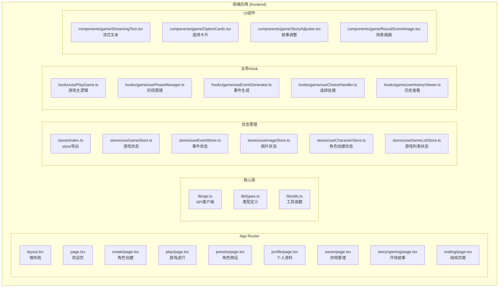
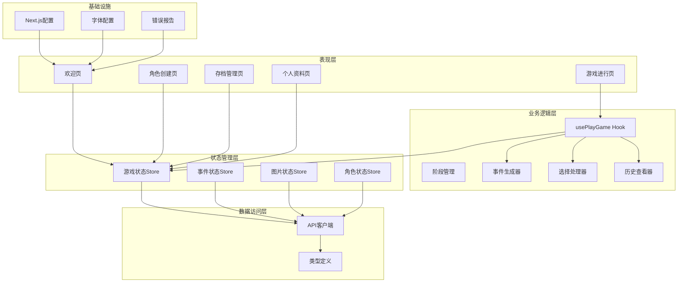
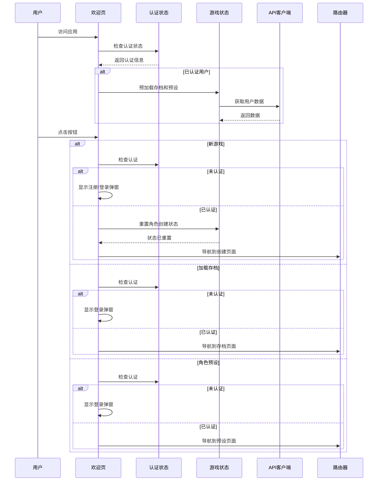
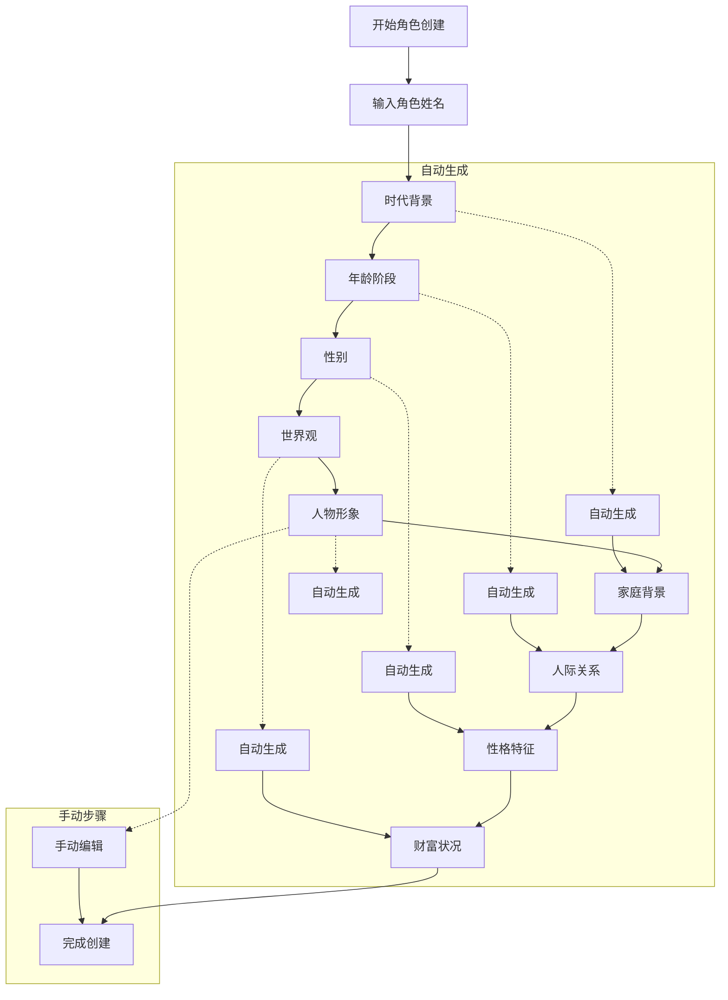
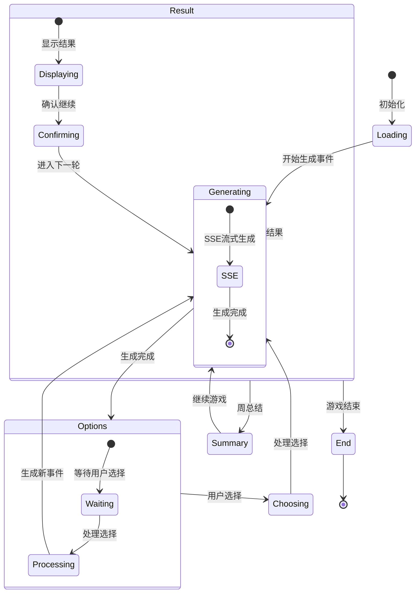
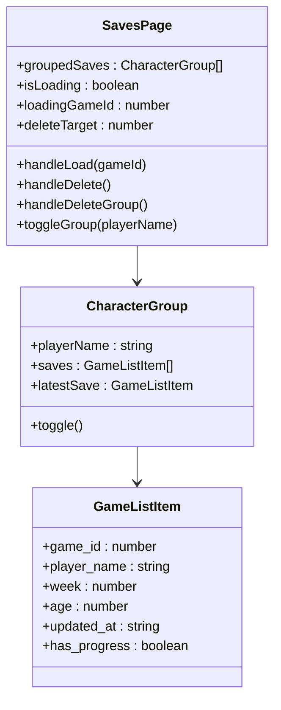
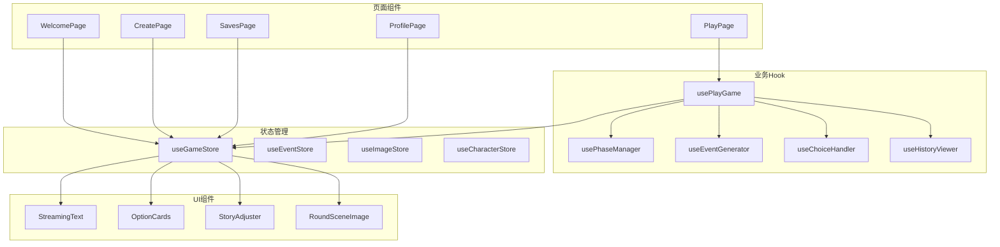
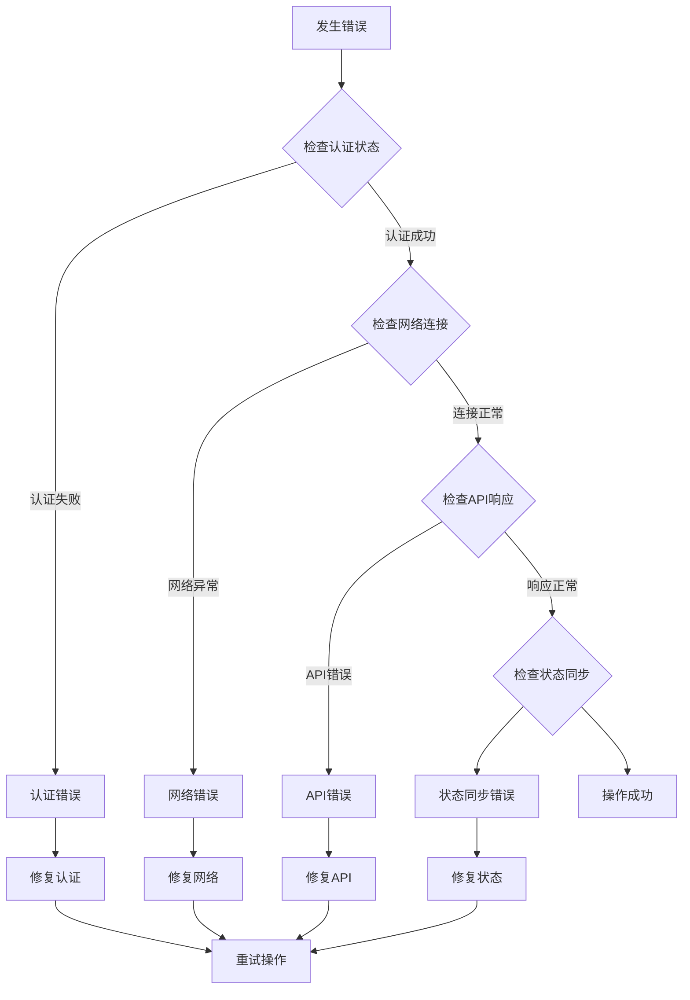

# Next.js应用结构

<cite>
**本文档引用的文件**
- [frontend/src/app/layout.tsx](file://frontend/src/app/layout.tsx)
- [frontend/src/app/page.tsx](file://frontend/src/app/page.tsx)
- [frontend/next.config.ts](file://frontend/next.config.ts)
- [frontend/package.json](file://frontend/package.json)
- [frontend/src/lib/api.ts](file://frontend/src/lib/api.ts)
- [frontend/src/app/create/page.tsx](file://frontend/src/app/create/page.tsx)
- [frontend/src/app/play/page.tsx](file://frontend/src/app/play/page.tsx)
- [frontend/src/app/saves/page.tsx](file://frontend/src/app/saves/page.tsx)
- [frontend/src/app/profile/page.tsx](file://frontend/src/app/profile/page.tsx)
- [frontend/src/stores/index.ts](file://frontend/src/stores/index.ts)
- [frontend/src/hooks/usePlayGame.ts](file://frontend/src/hooks/usePlayGame.ts)
- [frontend/src/stores/useGameStore.ts](file://frontend/src/stores/useGameStore.ts)
- [frontend/src/components/game/StreamingText.tsx](file://frontend/src/components/game/StreamingText.tsx)
- [frontend/src/components/game/OptionCards.tsx](file://frontend/src/components/game/OptionCards.tsx)
- [frontend/src/lib/types.ts](file://frontend/src/lib/types.ts)
</cite>

## 目录
1. [简介](#简介)
2. [项目结构](#项目结构)
3. [核心组件](#核心组件)
4. [架构总览](#架构总览)
5. [详细组件分析](#详细组件分析)
6. [依赖关系分析](#依赖关系分析)
7. [性能考虑](#性能考虑)
8. [故障排除指南](#故障排除指南)
9. [结论](#结论)

## 简介
本项目是一个基于Next.js 16的应用，采用App Router目录结构与客户端组件模式，构建了一个AI驱动的沉浸式人生模拟文字冒险游戏。应用通过Zustand状态管理、自定义Hook组合以及TypeScript类型系统，实现了角色创建、游戏进行、存档管理、个人资料等功能模块。系统支持流式文本渲染、场景插画生成、历史回顾、时间回溯存档等高级特性。

## 项目结构
应用采用Next.js App Router标准目录结构，核心文件组织如下：



**图表来源**
- [frontend/src/app/layout.tsx](file://frontend/src/app/layout.tsx#L1-L48)
- [frontend/src/app/page.tsx](file://frontend/src/app/page.tsx#L1-L352)
- [frontend/src/lib/api.ts](file://frontend/src/lib/api.ts#L1-L564)

**章节来源**
- [frontend/src/app/layout.tsx](file://frontend/src/app/layout.tsx#L1-L48)
- [frontend/src/app/page.tsx](file://frontend/src/app/page.tsx#L1-L352)
- [frontend/next.config.ts](file://frontend/next.config.ts#L1-L31)

## 核心组件
应用的核心组件围绕以下关键模块构建：

### 根布局设计
根布局组件负责全局样式、字体配置和元数据设置：

- **字体系统**：集成Noto Sans SC和Noto Serif SC，支持中文排版
- **主题配置**：默认深色主题，支持渐进式增强
- **元数据**：设置网站标题、描述和视口配置
- **错误处理**：全局错误报告组件

### API客户端架构
统一的API客户端封装了认证机制和错误处理：

- **双重认证**：Cookie认证（优先）和Authorization Header（备选）
- **自动降级**：首次请求失败时自动切换认证方式
- **错误处理**：结构化的ApiError类，支持远程日志记录
- **模块化设计**：按功能域划分的API模块（auth、games、character等）

### 状态管理系统
基于Zustand的状态管理，采用组合store模式：

- **游戏状态**：useGameStore管理核心游戏会话
- **事件状态**：useEventStore处理故事和事件
- **图片状态**：useImageStore管理图像资源
- **角色状态**：useCharacterStore处理角色创建流程
- **列表状态**：useGameListStore管理存档和预设

**章节来源**
- [frontend/src/app/layout.tsx](file://frontend/src/app/layout.tsx#L20-L47)
- [frontend/src/lib/api.ts](file://frontend/src/lib/api.ts#L1-L201)
- [frontend/src/stores/index.ts](file://frontend/src/stores/index.ts#L1-L27)

## 架构总览
应用采用分层架构设计，各层职责清晰：



**图表来源**
- [frontend/src/hooks/usePlayGame.ts](file://frontend/src/hooks/usePlayGame.ts#L26-L454)
- [frontend/src/stores/useGameStore.ts](file://frontend/src/stores/useGameStore.ts#L161-L996)
- [frontend/src/lib/api.ts](file://frontend/src/lib/api.ts#L551-L564)

## 详细组件分析

### 欢迎页（Welcome Page）
欢迎页作为应用入口，提供完整的用户身份验证和游戏导航功能：



**图表来源**
- [frontend/src/app/page.tsx](file://frontend/src/app/page.tsx#L31-L351)
- [frontend/src/lib/api.ts](file://frontend/src/lib/api.ts#L166-L201)

**章节来源**
- [frontend/src/app/page.tsx](file://frontend/src/app/page.tsx#L31-L351)

### 角色创建流程
角色创建页面实现了复杂的多步骤流程，支持自动和手动两种模式：



**图表来源**
- [frontend/src/app/create/page.tsx](file://frontend/src/app/create/page.tsx#L60-L712)
- [frontend/src/stores/useGameStore.ts](file://frontend/src/stores/useGameStore.ts#L585-L648)

**章节来源**
- [frontend/src/app/create/page.tsx](file://frontend/src/app/create/page.tsx#L60-L712)

### 游戏进行页面
游戏进行页面是应用的核心，实现了完整的RPG式交互体验：



**图表来源**
- [frontend/src/app/play/page.tsx](file://frontend/src/app/play/page.tsx#L31-L465)
- [frontend/src/hooks/usePlayGame.ts](file://frontend/src/hooks/usePlayGame.ts#L26-L454)

**章节来源**
- [frontend/src/app/play/page.tsx](file://frontend/src/app/play/page.tsx#L31-L465)
- [frontend/src/hooks/usePlayGame.ts](file://frontend/src/hooks/usePlayGame.ts#L26-L454)

### 存档管理页面
存档管理页面提供了完整的存档生命周期管理：



**图表来源**
- [frontend/src/app/saves/page.tsx](file://frontend/src/app/saves/page.tsx#L58-L452)

**章节来源**
- [frontend/src/app/saves/page.tsx](file://frontend/src/app/saves/page.tsx#L58-L452)

### 个人资料页面
个人资料页面实现了社交功能的基础框架：

**章节来源**
- [frontend/src/app/profile/page.tsx](file://frontend/src/app/profile/page.tsx#L22-L227)

## 依赖关系分析

### 技术栈依赖
应用采用现代化的前端技术栈：

```mermaid
graph TB
subgraph "运行时依赖"
NEXT[next@16.1.6]
REACT[react@19.2.3]
DOM[react-dom@19.2.3]
ZUSTAND[zustand@5.0.11]
RADIX[radix-ui]
LUCIDE[lucide-react]
end
subgraph "开发依赖"
TSC[typescript]
JEST[jest]
ESLINT[eslint]
TAILWIND[tailwindcss]
PLAYWRIGHT[@playwright/test]
end
subgraph "UI框架"
TAILWINDCSS[Tailwind CSS v4]
SHADCN[shadcn/ui]
CLSX[clsx]
TM[Tailwind Merge]
end
NEXT --> REACT
REACT --> DOM
ZUSTAND --> REACT
LUCIDE --> REACT
RADIX --> REACT
TSC --> NEXT
JEST --> REACT
ESLINT --> NEXT
PLAYWRIGHT --> NEXT
```

**图表来源**
- [frontend/package.json](file://frontend/package.json#L16-L47)

**章节来源**
- [frontend/package.json](file://frontend/package.json#L1-L49)

### 组件依赖关系
应用内部组件的依赖关系呈现清晰的层次结构：



**图表来源**
- [frontend/src/hooks/usePlayGame.ts](file://frontend/src/hooks/usePlayGame.ts#L10-L19)
- [frontend/src/stores/index.ts](file://frontend/src/stores/index.ts#L1-L27)

## 性能考虑
应用在多个层面实现了性能优化策略：

### 渲染优化
- **客户端组件**：所有页面组件标记为"use client"以启用客户端渲染
- **条件渲染**：根据状态智能渲染，避免不必要的DOM更新
- **懒加载**：对话框和弹窗组件按需加载
- **虚拟滚动**：长列表使用虚拟化技术

### 状态管理优化
- **选择性订阅**：Zustand支持细粒度状态订阅
- **状态持久化**：关键状态通过localStorage持久化
- **状态合并**：避免频繁的状态对象重建
- **浅比较优化**：使用shallow比较减少重渲染

### 网络请求优化
- **请求去重**：避免重复的API调用
- **缓存策略**：合理利用浏览器缓存
- **错误重试**：智能的重试机制
- **连接池**：复用HTTP连接

### 图像和媒体优化
- **渐进式加载**：占位符到高质量图像的渐进式显示
- **懒加载**：非首屏图像延迟加载
- **格式优化**：WebP等现代图像格式
- **尺寸适配**：响应式图像尺寸

## 故障排除指南

### 常见问题诊断
应用提供了完善的错误处理和诊断机制：



### 错误恢复机制
- **会话恢复**：自动尝试从服务器恢复活动游戏
- **状态回滚**：支持时间回溯存档功能
- **数据备份**：定期自动保存游戏进度
- **降级处理**：网络异常时的离线模式

**章节来源**
- [frontend/src/hooks/usePlayGame.ts](file://frontend/src/hooks/usePlayGame.ts#L200-L270)
- [frontend/src/stores/useGameStore.ts](file://frontend/src/stores/useGameStore.ts#L346-L475)

## 结论
本项目展现了现代Next.js应用的最佳实践，通过合理的架构设计、清晰的组件分离和完善的错误处理机制，构建了一个功能完整、性能优异的AI驱动文字冒险游戏。应用的模块化设计使得代码易于维护和扩展，而丰富的状态管理和流式渲染技术则为用户提供了流畅的交互体验。未来可以在PWA支持、SEO优化和权限控制方面进一步完善，以提升应用的可用性和可访问性。