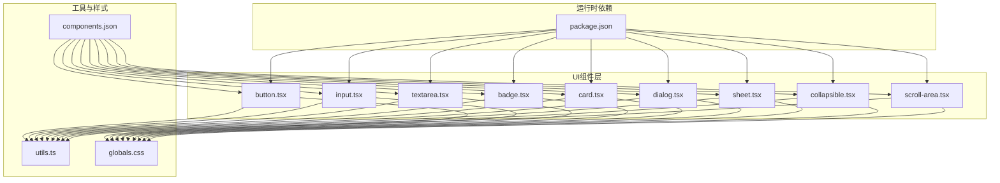
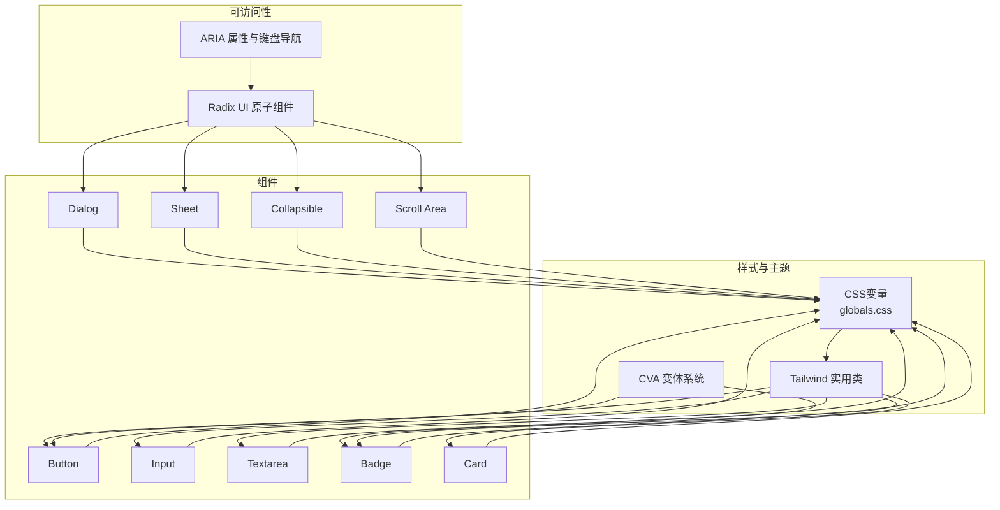
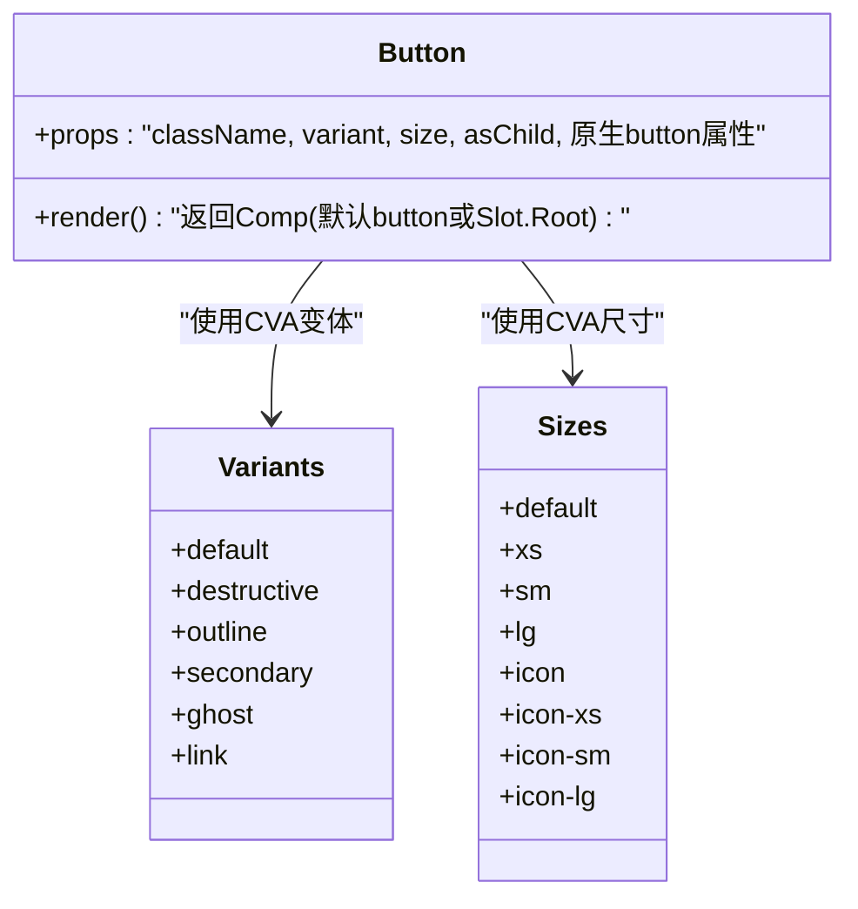
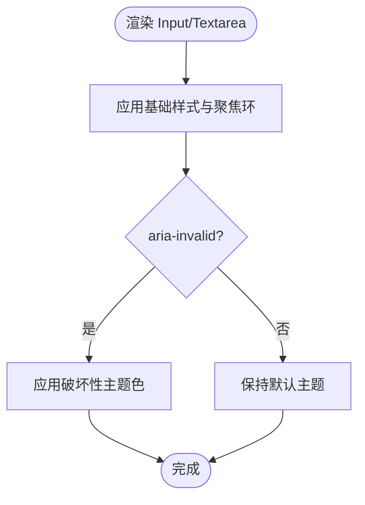
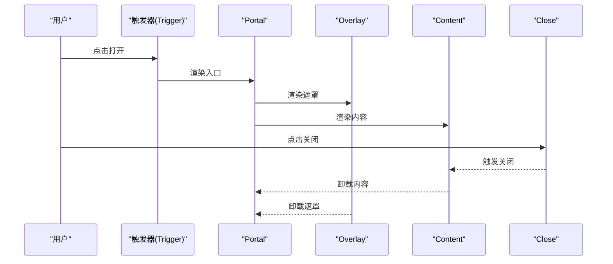
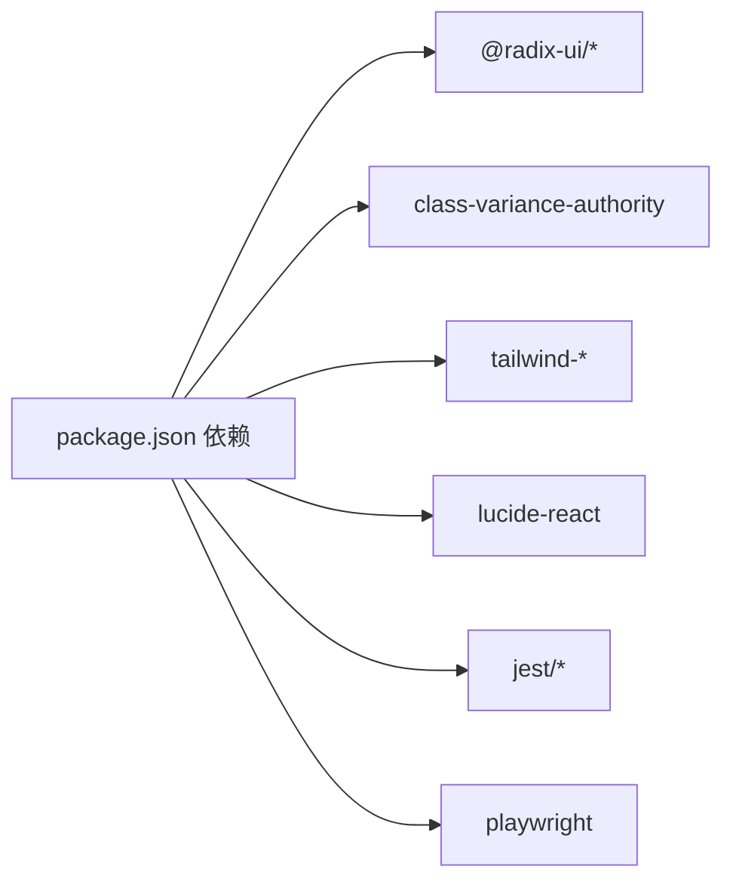
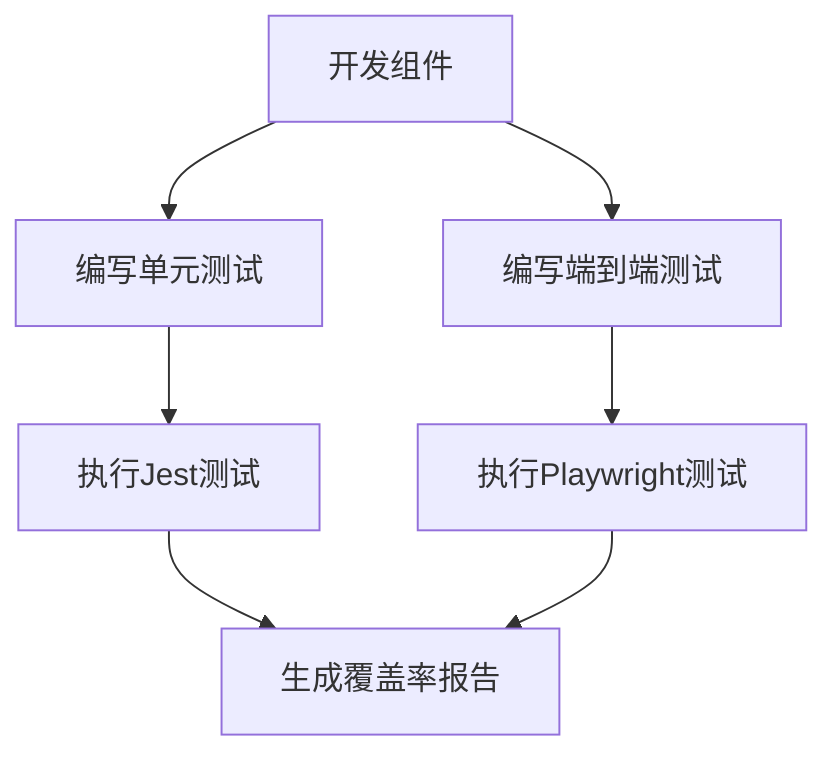

# UI组件库

<cite>
**本文引用的文件**
- [button.tsx](file://frontend/src/components/ui/button.tsx)
- [input.tsx](file://frontend/src/components/ui/input.tsx)
- [card.tsx](file://frontend/src/components/ui/card.tsx)
- [collapsible.tsx](file://frontend/src/components/ui/collapsible.tsx)
- [dialog.tsx](file://frontend/src/components/ui/dialog.tsx)
- [sheet.tsx](file://frontend/src/components/ui/sheet.tsx)
- [badge.tsx](file://frontend/src/components/ui/badge.tsx)
- [textarea.tsx](file://frontend/src/components/ui/textarea.tsx)
- [scroll-area.tsx](file://frontend/src/components/ui/scroll-area.tsx)
- [utils.ts](file://frontend/src/lib/utils.ts)
- [globals.css](file://frontend/src/app/globals.css)
- [components.json](file://frontend/components.json)
- [package.json](file://frontend/package.json)
- [OptionCards.test.tsx](file://frontend/src/__tests__/components/OptionCards.test.tsx)
</cite>

## 目录
1. [简介](#简介)
2. [项目结构](#项目结构)
3. [核心组件](#核心组件)
4. [架构总览](#架构总览)
5. [组件详解](#组件详解)
6. [依赖关系分析](#依赖关系分析)
7. [性能与响应式](#性能与响应式)
8. [无障碍与键盘导航](#无障碍与键盘导航)
9. [使用示例与最佳实践](#使用示例与最佳实践)
10. [测试策略](#测试策略)
11. [故障排查](#故障排查)
12. [结论](#结论)

## 简介
本UI组件库以Tailwind CSS作为样式基础，结合Radix UI实现语义化与可访问性，辅以class-variance-authority（CVA）实现变体风格管理。组件覆盖基础元素（按钮、输入、文本域、徽章）、布局容器（卡片）、复合交互（对话框、抽屉、可折叠面板、滚动区域）等，满足故事类游戏场景中的信息呈现与交互需求。主题系统通过CSS变量集中管理，支持深色模式与视觉一致性；组件API统一、插槽化设计便于组合扩展。

## 项目结构
前端采用Next.js应用结构，UI组件集中在src/components/ui目录下，通用工具函数位于src/lib/utils.ts，全局样式在src/app/globals.css中定义，并通过components.json进行组件别名与Tailwind配置声明。

**图表来源**
- [button.tsx](file://frontend/src/components/ui/button.tsx#L1-L65)
- [input.tsx](file://frontend/src/components/ui/input.tsx#L1-L22)
- [textarea.tsx](file://frontend/src/components/ui/textarea.tsx#L1-L19)
- [badge.tsx](file://frontend/src/components/ui/badge.tsx#L1-L49)
- [card.tsx](file://frontend/src/components/ui/card.tsx#L1-L93)
- [dialog.tsx](file://frontend/src/components/ui/dialog.tsx#L1-L159)
- [sheet.tsx](file://frontend/src/components/ui/sheet.tsx#L1-L144)
- [collapsible.tsx](file://frontend/src/components/ui/collapsible.tsx#L1-L13)
- [scroll-area.tsx](file://frontend/src/components/ui/scroll-area.tsx#L1-L59)
- [utils.ts](file://frontend/src/lib/utils.ts#L1-L48)
- [globals.css](file://frontend/src/app/globals.css#L55-L124)
- [components.json](file://frontend/components.json#L1-L24)
- [package.json](file://frontend/package.json#L1-L49)

**章节来源**
- [components.json](file://frontend/components.json#L1-L24)
- [package.json](file://frontend/package.json#L1-L49)

## 核心组件
- 基础组件：按钮、输入框、文本域、徽章
- 布局组件：卡片（含标题、描述、内容、页脚、操作）
- 复合组件：对话框、抽屉、可折叠面板、滚动区域
- 工具函数：类名合并与剪贴板复制

这些组件均遵循统一的数据槽位（data-slot）命名规范，便于调试与样式定位；同时大量使用Tailwind实用类与CSS变量，确保主题一致性与可定制性。

**章节来源**
- [button.tsx](file://frontend/src/components/ui/button.tsx#L1-L65)
- [input.tsx](file://frontend/src/components/ui/input.tsx#L1-L22)
- [textarea.tsx](file://frontend/src/components/ui/textarea.tsx#L1-L19)
- [badge.tsx](file://frontend/src/components/ui/badge.tsx#L1-L49)
- [card.tsx](file://frontend/src/components/ui/card.tsx#L1-L93)
- [dialog.tsx](file://frontend/src/components/ui/dialog.tsx#L1-L159)
- [sheet.tsx](file://frontend/src/components/ui/sheet.tsx#L1-L144)
- [collapsible.tsx](file://frontend/src/components/ui/collapsible.tsx#L1-L13)
- [scroll-area.tsx](file://frontend/src/components/ui/scroll-area.tsx#L1-L59)
- [utils.ts](file://frontend/src/lib/utils.ts#L1-L48)

## 架构总览
组件架构围绕“可变风格 + 可访问性 + 主题变量”展开：
- 可变风格：使用CVA定义变体与尺寸，通过className合并生成最终样式。
- 可访问性：基于Radix UI实现语义化与无障碍属性，保证键盘可达与状态同步。
- 主题变量：CSS变量集中管理色彩与层级，支持深色模式与一致性。

**图表来源**
- [globals.css](file://frontend/src/app/globals.css#L55-L124)
- [button.tsx](file://frontend/src/components/ui/button.tsx#L7-L39)
- [badge.tsx](file://frontend/src/components/ui/badge.tsx#L7-L27)
- [dialog.tsx](file://frontend/src/components/ui/dialog.tsx#L1-L159)
- [sheet.tsx](file://frontend/src/components/ui/sheet.tsx#L1-L144)
- [collapsible.tsx](file://frontend/src/components/ui/collapsible.tsx#L1-L13)
- [scroll-area.tsx](file://frontend/src/components/ui/scroll-area.tsx#L1-L59)

## 组件详解

### 按钮 Button
- 设计要点
  - 使用CVA定义多种变体（默认、破坏性、描边、次级、幽灵、链接）与尺寸（默认、xs、sm、lg、icon系列），自动合并Tailwind类与焦点环。
  - 支持asChild模式，将渲染节点替换为Slot根节点，便于组合其他组件。
  - 提供数据槽位与变体/尺寸标记，利于调试与样式追踪。
- 关键API
  - props：className、variant、size、asChild、原生button属性
  - 返回：包裹后的Comp（默认button或Slot.Root）

**图表来源**
- [button.tsx](file://frontend/src/components/ui/button.tsx#L7-L39)

**章节来源**
- [button.tsx](file://frontend/src/components/ui/button.tsx#L1-L65)

### 输入 Input 与 文本域 Textarea
- 设计要点
  - 统一的边框、聚焦环、禁用态与无效态样式，支持aria-invalid联动主题色。
  - 聚焦态使用ring变量，确保与主题一致。
- 关键API
  - Input：type、className、原生input属性
  - Textarea：className、原生textarea属性

**图表来源**
- [input.tsx](file://frontend/src/components/ui/input.tsx#L1-L22)
- [textarea.tsx](file://frontend/src/components/ui/textarea.tsx#L1-L19)

**章节来源**
- [input.tsx](file://frontend/src/components/ui/input.tsx#L1-L22)
- [textarea.tsx](file://frontend/src/components/ui/textarea.tsx#L1-L19)

### 徽章 Badge
- 设计要点
  - 使用CVA定义多种变体，支持asChild模式，适配内联图标与链接场景。
  - 统一的圆角、内边距与尺寸，配合焦点环与无效态。
- 关键API
  - props：className、variant、asChild、原生span属性

**章节来源**
- [badge.tsx](file://frontend/src/components/ui/badge.tsx#L1-L49)

### 卡片 Card
- 设计要点
  - 结构化布局：头部（标题/描述/操作）、内容、页脚，支持网格与对齐控制。
  - 行为：通过data-slot与CSS选择器实现结构化样式与响应式断点。
- 关键API
  - Card/CardHeader/CardTitle/CardDescription/CardAction/CardContent/CardFooter

**章节来源**
- [card.tsx](file://frontend/src/components/ui/card.tsx#L1-L93)

### 对话框 Dialog
- 设计要点
  - 基于Radix UI的Root/Trigger/Portal/Overlay/Content/Close等原子组件组合。
  - 支持显示/隐藏动画、居中布局、关闭按钮与描述区。
  - 支持自定义头部/底部区域，便于放置操作按钮。
- 关键API
  - Root/Trigger/Portal/Overlay/Content/Close/Title/Description/Header/Footer
  - Content额外支持showCloseButton与children

**图表来源**
- [dialog.tsx](file://frontend/src/components/ui/dialog.tsx#L1-L159)

**章节来源**
- [dialog.tsx](file://frontend/src/components/ui/dialog.tsx#L1-L159)

### 抽屉 Sheet
- 设计要点
  - 支持四个方向（上/右/下/左）滑入/滑出动画，固定宽高策略与阴影。
  - 支持侧边栏关闭按钮与标题/描述/头部/底部区域。
- 关键API
  - Root/Trigger/Portal/Overlay/Content/Close/Title/Description/Header/Footer
  - Content支持side与showCloseButton

**章节来源**
- [sheet.tsx](file://frontend/src/components/ui/sheet.tsx#L1-L144)

### 可折叠面板 Collapsible
- 设计要点
  - 基于Radix UI Collapsible，提供Root/Trigger/Content三件套，用于构建折叠/展开交互。
- 关键API
  - Collapsible/CollapsibleTrigger/CollapsibleContent

**章节来源**
- [collapsible.tsx](file://frontend/src/components/ui/collapsible.tsx#L1-L13)

### 滚动区域 ScrollArea
- 设计要点
  - 提供根容器、视口与滚动条，支持垂直/水平方向，滚动条样式与边框变量联动。
- 关键API
  - ScrollArea/ScrollBar

**章节来源**
- [scroll-area.tsx](file://frontend/src/components/ui/scroll-area.tsx#L1-L59)

## 依赖关系分析
- 运行时依赖
  - Radix UI相关包：用于可访问性与状态管理
  - class-variance-authority：用于变体与尺寸的条件样式
  - tailwind-merge/clsx：类名合并与冲突修复
  - lucide-react：图标库
- 开发依赖
  - Jest/Testing Library：单元测试
  - Playwright：端到端测试

**图表来源**
- [package.json](file://frontend/package.json#L16-L47)

**章节来源**
- [package.json](file://frontend/package.json#L1-L49)

## 性能与响应式
- 性能
  - 使用Tailwind实用类减少CSS体积，避免重复样式。
  - CVA按需生成类名，降低运行时计算成本。
  - 动画使用CSS过渡与Radix UI内置动画，避免复杂JS动画。
- 响应式
  - 组件广泛使用sm及以上的断点前缀，确保在小屏设备上的可读性与可点击性。
  - 对话框与抽屉通过max-width与百分比宽度限制内容宽度，提升移动端体验。

**章节来源**
- [dialog.tsx](file://frontend/src/components/ui/dialog.tsx#L64-L66)
- [sheet.tsx](file://frontend/src/components/ui/sheet.tsx#L62-L73)

## 无障碍与键盘导航
- 可访问性
  - 所有复合组件基于Radix UI，具备ARIA属性与键盘交互约定。
  - 焦点管理：聚焦环与outline-ring变量统一，确保键盘可达。
  - 无效态：aria-invalid联动destructive主题，提供视觉反馈。
- 键盘导航
  - 对话框/抽屉：Esc关闭、Tab循环聚焦。
  - 滚动区域：支持键盘滚动与焦点环提示。

**章节来源**
- [dialog.tsx](file://frontend/src/components/ui/dialog.tsx#L1-L159)
- [sheet.tsx](file://frontend/src/components/ui/sheet.tsx#L1-L144)
- [scroll-area.tsx](file://frontend/src/components/ui/scroll-area.tsx#L1-L59)

## 使用示例与最佳实践
- 基础按钮
  - 选择合适变体（默认/破坏性/描边/次级/幽灵/链接）与尺寸，必要时使用asChild组合图标。
- 输入与文本域
  - 使用aria-invalid标识校验失败，配合错误提示文案。
- 对话框与抽屉
  - 将操作按钮置于Footer/Header，确保关闭按钮可见且可键盘访问。
- 卡片
  - 合理拆分头部/内容/页脚，使用Action放置辅助控件。
- 徽章
  - 用于标签、状态与轻量链接，注意尺寸与对比度。

[本节为概念性指导，不直接分析具体文件]

## 测试策略
- 单元测试
  - 使用Jest与@testing-library/react进行组件渲染与交互验证。
  - 覆盖选项卡组件的渲染、选择、自定义输入、键盘事件与禁用态。
- 端到端测试
  - 使用Playwright进行跨浏览器与真实用户流程验证。
- 覆盖率
  - 通过jest --coverage生成覆盖率报告，持续改进测试矩阵。

**图表来源**
- [OptionCards.test.tsx](file://frontend/src/__tests__/components/OptionCards.test.tsx#L1-L337)
- [package.json](file://frontend/package.json#L10-L14)

**章节来源**
- [OptionCards.test.tsx](file://frontend/src/__tests__/components/OptionCards.test.tsx#L1-L337)
- [package.json](file://frontend/package.json#L10-L14)

## 故障排查
- 类名冲突
  - 使用utils.ts中的cn函数合并类名，避免重复与冲突。
- 剪贴板不可用
  - 使用utils.ts中的copyToClipboard，自动回退到textarea方案。
- 主题色不生效
  - 检查globals.css中的CSS变量是否正确注入，确认Tailwind配置与components.json别名一致。

**章节来源**
- [utils.ts](file://frontend/src/lib/utils.ts#L1-L48)
- [globals.css](file://frontend/src/app/globals.css#L55-L124)
- [components.json](file://frontend/components.json#L1-L24)

## 结论
该UI组件库以Tailwind为核心、Radix UI为骨架、CVA为风格引擎，实现了高可访问性、强一致性的组件体系。通过CSS变量主题系统与严格的API设计，组件既易于扩展又便于维护。建议在实际项目中遵循本文档的使用范式与测试策略，持续完善可访问性与性能表现。