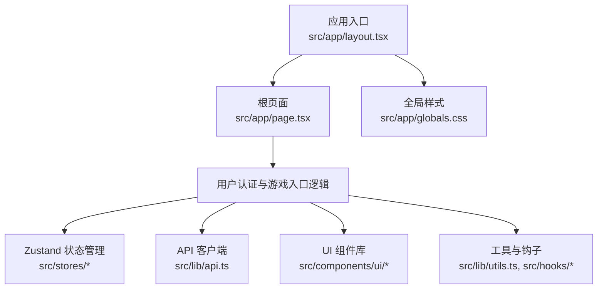
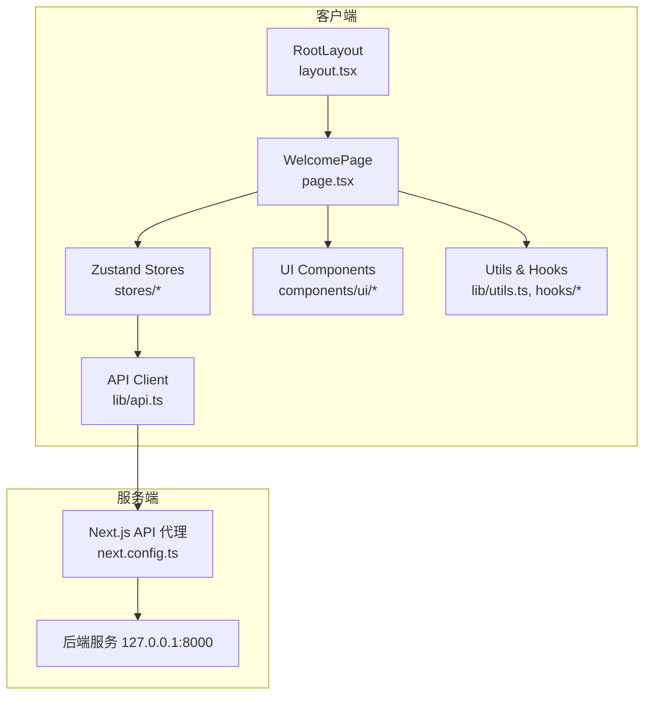
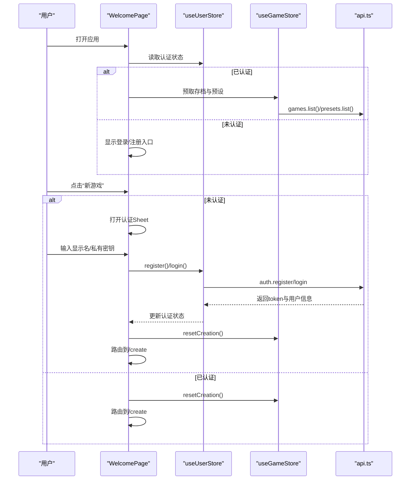
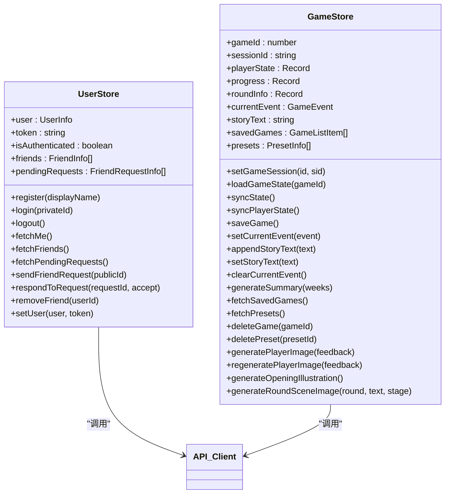
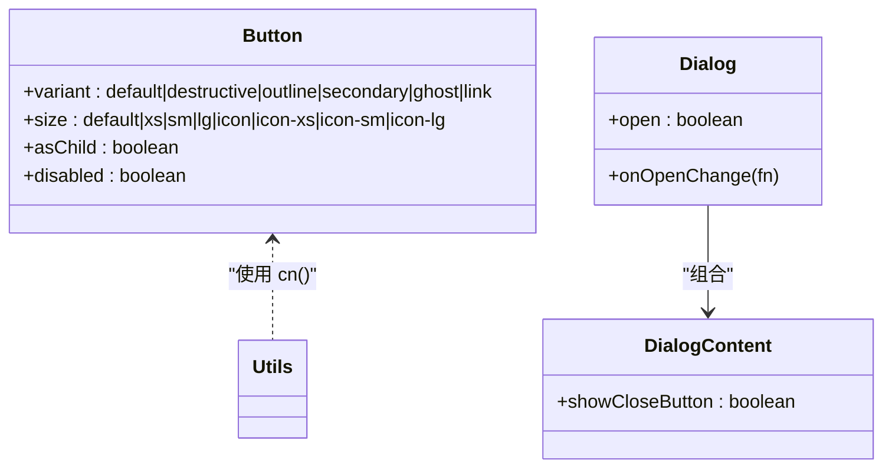
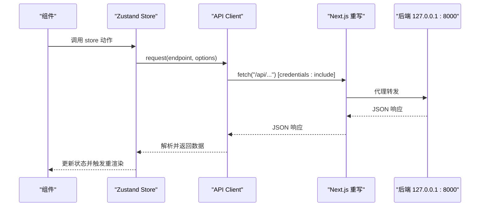
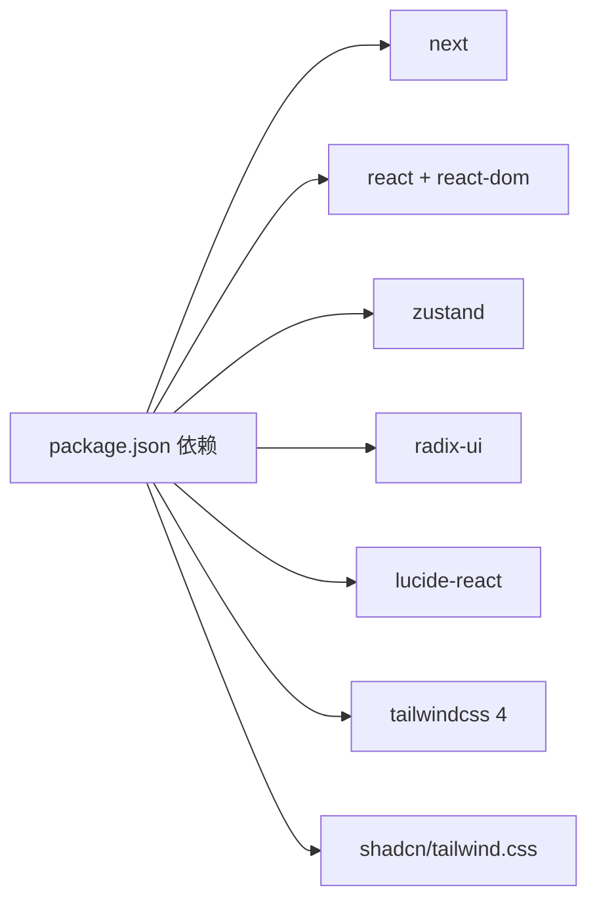

# 前端应用架构

<cite>
**本文档引用的文件**
- [package.json](file://frontend/package.json)
- [layout.tsx](file://frontend/src/app/layout.tsx)
- [page.tsx](file://frontend/src/app/page.tsx)
- [next.config.ts](file://frontend/next.config.ts)
- [api.ts](file://frontend/src/lib/api.ts)
- [index.ts](file://frontend/src/stores/index.ts)
- [useUserStore.ts](file://frontend/src/stores/useUserStore.ts)
- [useGameStore.ts](file://frontend/src/stores/useGameStore.ts)
- [button.tsx](file://frontend/src/components/ui/button.tsx)
- [dialog.tsx](file://frontend/src/components/ui/dialog.tsx)
- [utils.ts](file://frontend/src/lib/utils.ts)
- [ErrorReporter.tsx](file://frontend/src/components/ErrorReporter.tsx)
- [useHydration.ts](file://frontend/src/hooks/useHydration.ts)
- [globals.css](file://frontend/src/app/globals.css)
</cite>

## 目录
1. [引言](#引言)
2. [项目结构](#项目结构)
3. [核心组件](#核心组件)
4. [架构总览](#架构总览)
5. [详细组件分析](#详细组件分析)
6. [依赖关系分析](#依赖关系分析)
7. [性能考量](#性能考量)
8. [故障排除指南](#故障排除指南)
9. [结论](#结论)
10. [附录](#附录)

## 引言
本文件面向“人生草稿本”前端应用，系统性梳理基于 Next.js 的应用架构，涵盖页面路由与导航、状态管理（Zustand）、UI 组件库、国际化策略、响应式与移动端适配、样式系统与主题定制、前后端 API 集成、性能优化与用户体验改进，以及可访问性与跨浏览器兼容性。

## 项目结构
前端采用 Next.js App Router（app 目录），结合 TypeScript、TailwindCSS 4、Radix UI、Lucide React 与 Zustand，形成模块化、可维护且高性能的单页应用骨架。

图表来源
- [layout.tsx](file://frontend/src/app/layout.tsx#L32-L47)
- [page.tsx](file://frontend/src/app/page.tsx#L31-L351)
- [globals.css](file://frontend/src/app/globals.css#L1-L241)

章节来源
- [layout.tsx](file://frontend/src/app/layout.tsx#L1-L48)
- [page.tsx](file://frontend/src/app/page.tsx#L1-L352)
- [next.config.ts](file://frontend/next.config.ts#L1-L31)

## 核心组件
- 应用根布局与元信息：设置语言、视口、字体与全局错误上报。
- 根页面：欢迎页，负责用户认证、游戏入口、存档与预设导航。
- API 客户端：统一封装 fetch、自动注入认证头、错误处理与远程日志。
- 状态管理：Zustand store 组织用户、游戏、事件、图片、UI 等状态，并持久化。
- UI 组件：基于 Radix UI 与 Tailwind，提供按钮、对话框等基础组件。
- 工具与钩子：通用工具函数与水合钩子，保障 SSR/CSR 一致性。

章节来源
- [layout.tsx](file://frontend/src/app/layout.tsx#L20-L47)
- [page.tsx](file://frontend/src/app/page.tsx#L31-L351)
- [api.ts](file://frontend/src/lib/api.ts#L69-L124)
- [index.ts](file://frontend/src/stores/index.ts#L1-L27)

## 架构总览
前端通过 Next.js App Router 管理页面与路由，Zustand 管理应用状态，API 客户端封装后端交互，UI 组件库提供一致的视觉与交互体验。开发配置支持本地与局域网联调，代理转发至后端服务。

图表来源
- [layout.tsx](file://frontend/src/app/layout.tsx#L32-L47)
- [page.tsx](file://frontend/src/app/page.tsx#L31-L351)
- [api.ts](file://frontend/src/lib/api.ts#L11-L124)
- [next.config.ts](file://frontend/next.config.ts#L20-L27)

## 详细组件分析

### 页面与导航系统
- 根布局：固定主题色、禁用严格模式以避免开发期双连接问题、启用暗色主题、注入字体变量与全局样式。
- 根页面：欢迎页整合认证（注册/登录）、游戏入口（继续/新游戏）、存档与预设导航；根据认证状态与活动游戏决定按钮行为；使用底部弹出式表单（Sheet）承载认证流程；提供私有密钥复制与提示。
- 导航策略：Next.js 导航器驱动页面跳转；水合钩子保障 SSR 初始渲染后的状态一致性，避免误判跳转。

图表来源
- [page.tsx](file://frontend/src/app/page.tsx#L31-L351)
- [useUserStore.ts](file://frontend/src/stores/useUserStore.ts#L32-L114)
- [useGameStore.ts](file://frontend/src/stores/useGameStore.ts#L607-L628)
- [api.ts](file://frontend/src/lib/api.ts#L166-L201)

章节来源
- [layout.tsx](file://frontend/src/app/layout.tsx#L20-L47)
- [page.tsx](file://frontend/src/app/page.tsx#L31-L351)
- [useHydration.ts](file://frontend/src/hooks/useHydration.ts#L1-L20)

### 状态管理系统（Zustand）
- 设计模式：每个领域（用户、游戏、事件、图片、UI、角色创建、存档列表）独立 store，通过统一导出提供向后兼容；store 使用持久化中间件，按需持久化字段。
- 数据流：组件通过 store 动作发起 API 请求，接收响应后更新本地状态；提供浅比较优化，减少不必要重渲染。
- 同步机制：游戏会话状态通过定时/事件触发的同步动作从后端拉取最新状态，处理会话过期与重载逻辑。

图表来源
- [useUserStore.ts](file://frontend/src/stores/useUserStore.ts#L32-L125)
- [useGameStore.ts](file://frontend/src/stores/useGameStore.ts#L161-L504)
- [api.ts](file://frontend/src/lib/api.ts#L166-L276)

章节来源
- [index.ts](file://frontend/src/stores/index.ts#L1-L27)
- [useUserStore.ts](file://frontend/src/stores/useUserStore.ts#L1-L126)
- [useGameStore.ts](file://frontend/src/stores/useGameStore.ts#L1-L996)

### UI 组件库
- 按钮组件：基于 class-variance-authority 的变体系统，支持多种尺寸与外观，适配暗色主题与无障碍焦点状态。
- 对话框组件：基于 Radix UI，提供内容区、标题、描述、关闭按钮等语义化结构，支持可选关闭按钮与动画过渡。
- 组件设计原则：最小触控目标（44px）、减少动效偏好适配、语义化标签与可访问性属性。

图表来源
- [button.tsx](file://frontend/src/components/ui/button.tsx#L7-L39)
- [dialog.tsx](file://frontend/src/components/ui/dialog.tsx#L10-L82)
- [utils.ts](file://frontend/src/lib/utils.ts#L4-L6)

章节来源
- [button.tsx](file://frontend/src/components/ui/button.tsx#L1-L65)
- [dialog.tsx](file://frontend/src/components/ui/dialog.tsx#L1-L159)
- [utils.ts](file://frontend/src/lib/utils.ts#L1-L48)

### 国际化与本地化策略
- 字体与文本：使用 Google Fonts 的 Noto Sans SC 与 Noto Serif SC，变量字体便于主题切换时的动态继承。
- 文案与界面：当前页面文案以中文为主，未见显式的多语言切换实现；建议后续引入 i18n 方案（如 next-i18n）并配合动态语言切换钩子。
- 本地化建议：为日期、数字、货币等格式化提供本地化工具；对图片与图标进行方向性适配（RTL）准备。

章节来源
- [layout.tsx](file://frontend/src/app/layout.tsx#L6-L18)
- [globals.css](file://frontend/src/app/globals.css#L127-L134)

### 响应式设计与移动端适配
- 视口与主题：固定初始缩放与主题色，适配移动设备。
- 触控目标：全局样式定义最小触控区域，提升移动端可点触性。
- 动画与动效：提供“减少动效偏好”的媒体查询适配，尊重用户系统设置。
- 滚动条：自定义滚动条样式，增强深色主题下的可读性与一致性。

章节来源
- [layout.tsx](file://frontend/src/app/layout.tsx#L25-L30)
- [globals.css](file://frontend/src/app/globals.css#L227-L241)

### 样式系统与主题定制
- 主题：深色“冷色电影”美学，强调冰蓝高光与柔和灰背景，营造沉浸式叙事氛围。
- 原子化与合并：使用 Tailwind 4 与 tailwind-merge，保证类名冲突最小化与体积控制。
- 动画与骨架屏：打字机光标、逐词淡入、骨架屏 shimmer 等动画增强阅读体验。
- 排版：叙事文本使用衬线字体与缩进排版，提升故事感。

章节来源
- [globals.css](file://frontend/src/app/globals.css#L55-L115)
- [globals.css](file://frontend/src/app/globals.css#L126-L189)

### 前后端 API 集成
- 认证策略：优先 Cookie（credentials: include），首次或不可用时回退到 Authorization Bearer Token；支持登出时清理本地状态。
- 代理与重写：开发环境通过 Next.js 重写将 /api/* 转发至后端 127.0.0.1:8000，允许局域网与移动端访问。
- 错误处理：统一捕获网络异常与非 2xx 响应，构造结构化错误对象并上报远程日志。
- SSE 与长耗时：代理超时增加至 2 分钟，满足图片生成等长耗时场景。

图表来源
- [api.ts](file://frontend/src/lib/api.ts#L69-L124)
- [next.config.ts](file://frontend/next.config.ts#L20-L27)

章节来源
- [api.ts](file://frontend/src/lib/api.ts#L1-L564)
- [next.config.ts](file://frontend/next.config.ts#L1-L31)

## 依赖关系分析
- 运行时依赖：Next.js、React、Radix UI、Lucide React、Tailwind 4、Zustand。
- 开发依赖：Jest、Playwright、Testing Library、Tailwind PostCSS 插件、TypeScript。
- 关键耦合：页面与 store、store 与 API 客户端、UI 组件与工具函数之间保持低耦合高内聚。

图表来源
- [package.json](file://frontend/package.json#L16-L47)

章节来源
- [package.json](file://frontend/package.json#L1-L49)

## 性能考量
- 状态同步与浅比较：对关键字段进行浅比较，避免不必要的重渲染；仅在字段变化时更新状态。
- 持久化策略：按需持久化字段，减少存储体积与序列化成本。
- 水合保护：使用水合钩子等待 Zustand 持久化完成后再进行路由判断，避免首屏误判。
- 图片与长耗时：代理超时延长，图片批量生成与重新生成接口支持反馈参数，降低失败重试成本。
- 动画与骨架屏：合理使用动画与骨架屏，平衡性能与体验。

章节来源
- [useGameStore.ts](file://frontend/src/stores/useGameStore.ts#L42-L50)
- [useHydration.ts](file://frontend/src/hooks/useHydration.ts#L1-L20)
- [next.config.ts](file://frontend/next.config.ts#L16-L19)

## 故障排除指南
- 全局错误上报：在根布局安装全局错误上报器，捕获未处理异常并上报后端日志。
- 认证失败：检查 Cookie 是否可用与 Token 是否存在；若 Cookie 不可用则回退 Authorization 头。
- 404 会话过期：同步动作捕获 404 并尝试重新加载游戏状态，若数据库无该会话则清空本地状态。
- 复制粘贴：提供跨浏览器兼容的复制实现，iOS Safari 通过 execCommand 降级处理。

章节来源
- [ErrorReporter.tsx](file://frontend/src/components/ErrorReporter.tsx#L1-L16)
- [api.ts](file://frontend/src/lib/api.ts#L48-L67)
- [api.ts](file://frontend/src/lib/api.ts#L354-L381)
- [utils.ts](file://frontend/src/lib/utils.ts#L11-L48)

## 结论
该前端架构以 Next.js App Router 为核心，结合 Zustand 实现清晰的状态分层与持久化，通过统一 API 客户端屏蔽认证与错误细节，辅以 Tailwind 4 与 Radix UI 构建一致的 UI 体系。开发配置支持局域网与移动端调试，具备良好的扩展性与可维护性。建议后续完善国际化与无障碍能力，持续优化长耗时场景的用户体验。

## 附录
- 最佳实践清单
  - 为关键路径添加骨架屏与渐进式加载
  - 在 store 动作中集中处理错误与回退逻辑
  - 使用水合钩子保护首屏路由判断
  - 为图片与事件生成提供进度反馈与取消能力
  - 逐步引入 i18n 与 RTL 支持