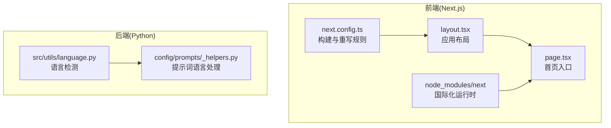
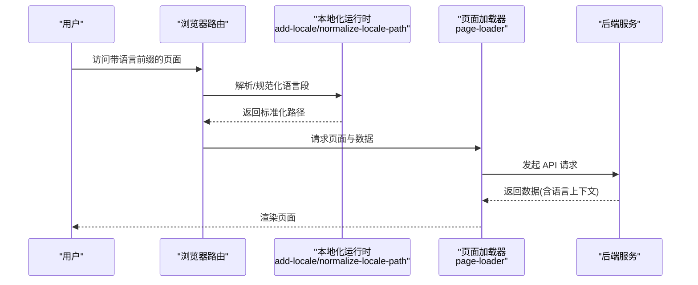
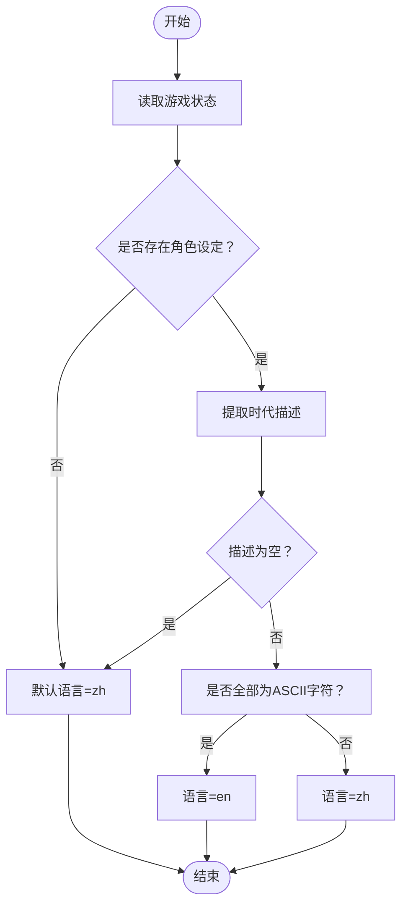
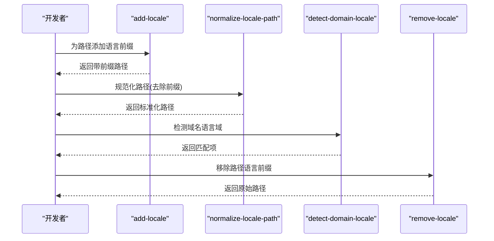
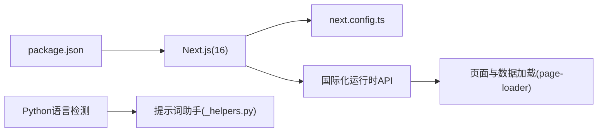

# 国际化与本地化

<cite>
**本文引用的文件**
- [next.config.ts](file://frontend/next.config.ts)
- [package.json](file://frontend/package.json)
- [layout.tsx](file://frontend/src/app/layout.tsx)
- [page.tsx](file://frontend/src/app/page.tsx)
- [language.py](file://src/utils/language.py)
- [_helpers.py](file://config/prompts/_helpers.py)
- [add-locale.ts](file://frontend/node_modules/next/src/client/add-locale.ts)
- [normalize-locale-path.js](file://frontend/node_modules/next/dist/shared/lib/i18n/normalize-locale-path.js)
- [detect-domain-locale.ts](file://frontend/node_modules/next/src/client/detect-domain-locale.ts)
- [remove-locale.ts](file://frontend/node_modules/next/src/client/remove-locale.ts)
- [page-loader.ts](file://frontend/node_modules/next/src/client/page-loader.ts)
</cite>

## 目录
1. [引言](#引言)
2. [项目结构](#项目结构)
3. [核心组件](#核心组件)
4. [架构总览](#架构总览)
5. [详细组件分析](#详细组件分析)
6. [依赖关系分析](#依赖关系分析)
7. [性能考量](#性能考量)
8. [故障排查指南](#故障排查指南)
9. [结论](#结论)
10. [附录](#附录)

## 引言
本文件面向“国际化与本地化”主题，系统梳理本仓库在前端与后端层面的语言检测、资源组织、动态加载与切换、格式化、RTL 支持、URL 结构与 SEO 策略、以及 i18n 工具链与质量保障流程。当前仓库已具备 Next.js 的国际化运行时能力与基础语言检测逻辑，但尚未在前端实现完整的多语言资源与路由结构。本文将给出可落地的实施建议与最佳实践。

## 项目结构
- 前端采用 Next.js 应用，位于 frontend/，通过 next.config.ts 进行构建期与运行期配置；package.json 指定依赖版本。
- 后端 Python 层提供语言检测工具，用于根据游戏状态推断语言，辅助内容生成与提示词处理。
- 语言资源与本地化策略尚未在前端落地，需按本文建议补充。

图表来源
- [next.config.ts](file://frontend/next.config.ts#L1-L31)
- [layout.tsx](file://frontend/src/app/layout.tsx)
- [page.tsx](file://frontend/src/app/page.tsx)
- [language.py](file://src/utils/language.py#L1-L28)
- [_helpers.py](file://config/prompts/_helpers.py)

章节来源
- [next.config.ts](file://frontend/next.config.ts#L1-L31)
- [package.json](file://frontend/package.json#L1-L49)

## 核心组件
- 语言检测与推断
  - 后端：根据游戏状态中的时代描述等字段进行语言判定，返回 zh/en。
  - 前端：Next.js 提供运行时的域名/路径本地化解析与 URL 规范化能力。
- 资源组织与加载
  - 前端：通过页面加载器与数据接口加载页面与数据，结合本地化运行时进行路径与数据处理。
- 动态切换与格式化
  - 前端：利用运行时 API 实现语言前缀的添加/移除与路径规范化。
- RTL 与文本方向
  - 当前未见显式 RTL 切换逻辑，需按最佳实践补充。
- URL 结构与 SEO
  - Next.js 支持多语言前缀 URL，可配合 robots/sitemap 策略提升 SEO。
- 工具链与质量保障
  - 建议引入翻译键值管理、缺失翻译检测、自动化校验与评审流程。

章节来源
- [language.py](file://src/utils/language.py#L1-L28)
- [add-locale.ts](file://frontend/node_modules/next/src/client/add-locale.ts)
- [normalize-locale-path.js](file://frontend/node_modules/next/dist/shared/lib/i18n/normalize-locale-path.js)
- [detect-domain-locale.ts](file://frontend/node_modules/next/src/client/detect-domain-locale.ts)
- [remove-locale.ts](file://frontend/node_modules/next/src/client/remove-locale.ts)
- [page-loader.ts](file://frontend/node_modules/next/src/client/page-loader.ts)

## 架构总览
下图展示从前端路由到数据加载，再到语言检测与本地化运行时的整体交互。

图表来源
- [add-locale.ts](file://frontend/node_modules/next/src/client/add-locale.ts)
- [normalize-locale-path.js](file://frontend/node_modules/next/dist/shared/lib/i18n/normalize-locale-path.js)
- [page-loader.ts](file://frontend/node_modules/next/src/client/page-loader.ts)

## 详细组件分析

### 语言检测与推断
- 后端检测逻辑
  - 输入：游戏状态字典，包含角色设定与时代信息。
  - 规则：若时代描述全为 ASCII，则判定为 en；否则默认 zh。
  - 输出：语言代码字符串。
- 前端运行时
  - Next.js 提供 detect-domain-locale、normalize-locale-path、remove-locale 等运行时函数，用于域名/路径本地化与语言段处理。

图表来源
- [language.py](file://src/utils/language.py#L5-L27)

章节来源
- [language.py](file://src/utils/language.py#L1-L28)
- [detect-domain-locale.ts](file://frontend/node_modules/next/src/client/detect-domain-locale.ts)
- [normalize-locale-path.js](file://frontend/node_modules/next/dist/shared/lib/i18n/normalize-locale-path.js)
- [remove-locale.ts](file://frontend/node_modules/next/src/client/remove-locale.ts)

### 文本资源组织与管理策略
- 组件内文本
  - 建议在组件内部以“键值对”的形式集中管理文案，键名采用层级命名（如 ui.button.confirm），便于翻译与检索。
- API 响应文本与错误消息
  - 错误码与消息统一由后端返回，前端按语言上下文渲染；建议后端在不同语言下返回对应语言的消息体。
- 翻译键值管理
  - 使用 JSON 文件按语言分组存放键值，例如 resources/zh-CN.json、resources/en-US.json。
  - 建立键值清单与变更追踪，避免重复与遗漏。
- 缺失翻译处理
  - 未命中键值时回退至默认语言或占位符，并记录日志以便后续补齐。

章节来源
- [page-loader.ts](file://frontend/node_modules/next/src/client/page-loader.ts)

### 日期、数字与货币格式化
- 日期与数字
  - 建议使用 Intl.DateTimeFormat 与 Intl.NumberFormat，依据语言环境动态格式化。
- 货币
  - 使用 Intl.NumberFormat 并指定 style: "currency" 与相应货币代码，确保符号与分隔符符合目标语言区域。
- 格式化策略
  - 在应用层封装格式化工具，集中处理不同语言下的差异点。

章节来源
- [page-loader.ts](file://frontend/node_modules/next/src/client/page-loader.ts)

### RTL 语言支持与文本方向动态切换
- 当前未发现显式的 RTL 切换逻辑与样式方向控制。
- 建议
  - 在根元素上根据语言动态设置 dir="rtl" 或 dir="ltr"。
  - 通过 CSS 变量或主题系统切换左右边距、对齐方式与图标镜像。
  - 在布局组件中注入方向控制钩子，确保全局一致性。

章节来源
- [layout.tsx](file://frontend/src/app/layout.tsx)

### i18n 工具链配置与使用
- 运行时 API
  - add-locale：为路径添加语言前缀。
  - normalize-locale-path：去除语言前缀并返回标准化路径。
  - detect-domain-locale：根据域名与主机名检测语言域。
  - remove-locale：移除路径中的语言前缀。
- 构建与开发
  - next.config.ts 中可配置代理与重写，确保 API 请求转发正确。
  - package.json 中的脚本支持开发、构建、测试与覆盖率。

图表来源
- [add-locale.ts](file://frontend/node_modules/next/src/client/add-locale.ts)
- [normalize-locale-path.js](file://frontend/node_modules/next/dist/shared/lib/i18n/normalize-locale-path.js)
- [detect-domain-locale.ts](file://frontend/node_modules/next/src/client/detect-domain-locale.ts)
- [remove-locale.ts](file://frontend/node_modules/next/src/client/remove-locale.ts)

章节来源
- [next.config.ts](file://frontend/next.config.ts#L1-L31)
- [package.json](file://frontend/package.json#L1-L49)

### 多语言 URL 结构与 SEO 策略
- URL 结构
  - 建议采用 /zh-CN/... 与 /en/... 的前缀式结构，保持路径清晰且利于搜索引擎识别。
- SEO 策略
  - 为每种语言生成独立的 sitemap，并在 robots.txt 中声明。
  - 使用 hreflang 标签标注互惠语言链接，避免重复内容问题。
  - 页面标题与描述按语言动态生成，确保与目标语言受众一致。

章节来源
- [page-loader.ts](file://frontend/node_modules/next/src/client/page-loader.ts)

### 翻译质量保证与维护流程
- 质量保证
  - 引入翻译键值清单与自动化校验，检测缺失键与重复键。
  - 对比不同语言版本的键集，确保覆盖完整。
- 维护流程
  - 建立“新增/修改键值 → 翻译 → 审核 → 回归测试 → 上线”的闭环。
  - 对高频模块优先完成本地化，逐步扩展至全站。

章节来源
- [page-loader.ts](file://frontend/node_modules/next/src/client/page-loader.ts)

## 依赖关系分析
- 前端依赖 Next.js 16，具备国际化运行时能力；通过 next.config.ts 配置代理与重写，确保 API 请求可达。
- 后端语言检测工具为前端提供语言上下文参考，有助于统一内容风格与提示词语言。

图表来源
- [next.config.ts](file://frontend/next.config.ts#L1-L31)
- [package.json](file://frontend/package.json#L16-L26)
- [page-loader.ts](file://frontend/node_modules/next/src/client/page-loader.ts)
- [language.py](file://src/utils/language.py#L1-L28)
- [_helpers.py](file://config/prompts/_helpers.py)

章节来源
- [next.config.ts](file://frontend/next.config.ts#L1-L31)
- [package.json](file://frontend/package.json#L1-L49)

## 性能考量
- 路由与数据加载
  - 使用 Next.js 的路由加载器与预取机制，减少首屏与切换延迟。
- 本地化运行时
  - 仅在必要时调用 add-locale/normalize-locale-path 等函数，避免重复计算。
- 资源与缓存
  - 将翻译资源按语言拆分并启用缓存，降低网络开销。

章节来源
- [page-loader.ts](file://frontend/node_modules/next/src/client/page-loader.ts)

## 故障排查指南
- 语言前缀不生效
  - 检查 next.config.ts 的重写规则与 API 代理配置，确认请求被正确转发。
- 路径无法规范化
  - 确认 normalize-locale-path 的输入是否包含有效语言段，避免空路径或非法段。
- 域名语言域检测异常
  - 核对 detect-domain-locale 的参数与域名映射，确保大小写与主机名匹配。
- 缺失翻译键值
  - 在构建或运行时输出缺失键日志，及时补充对应语言的键值文件。

章节来源
- [next.config.ts](file://frontend/next.config.ts#L20-L27)
- [normalize-locale-path.js](file://frontend/node_modules/next/dist/shared/lib/i18n/normalize-locale-path.js)
- [detect-domain-locale.ts](file://frontend/node_modules/next/src/client/detect-domain-locale.ts)
- [page-loader.ts](file://frontend/node_modules/next/src/client/page-loader.ts)

## 结论
本仓库已具备 Next.js 国际化运行时能力与后端语言检测基础，建议在此基础上完善前端多语言资源组织、URL 结构与 SEO 策略，并建立翻译质量与维护流程，以实现稳定、可扩展的国际化方案。

## 附录
- 建议的前端本地化目录结构
  - resources/
    - zh-CN/
      - ui.json
      - errors.json
    - en/
      - ui.json
      - errors.json
- 建议的提示词语言处理函数
  - 在 _helpers.py 中增加按语言格式化名称与分隔符的逻辑，参考现有 zh/en 分支处理。

章节来源
- [_helpers.py](file://config/prompts/_helpers.py#L32-L46)