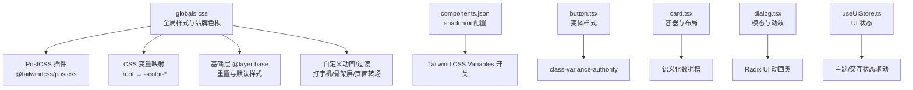
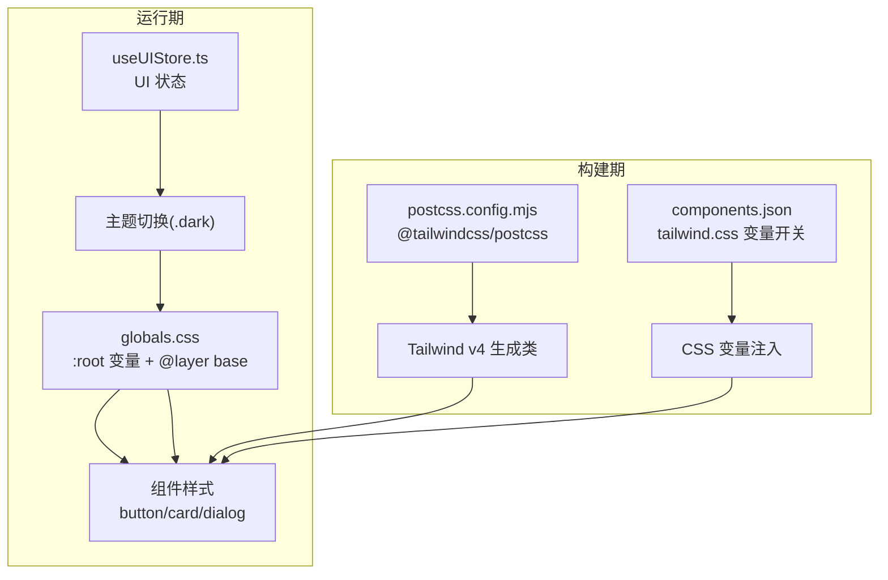
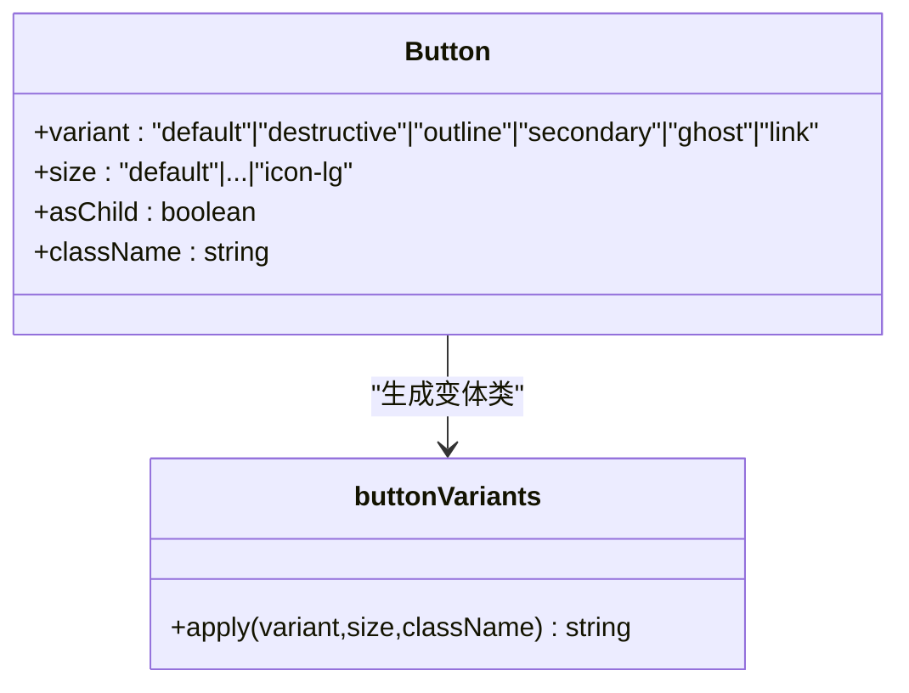
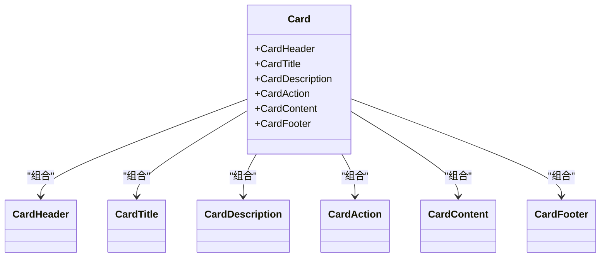
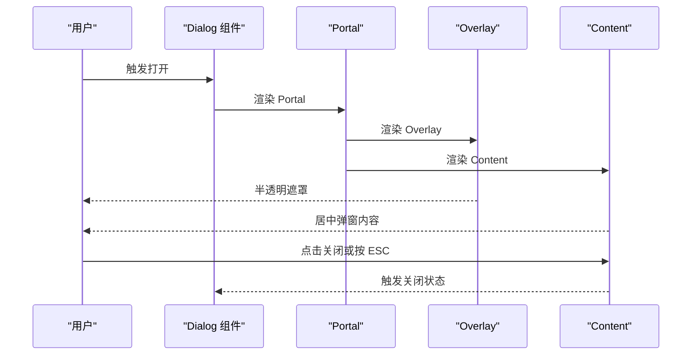
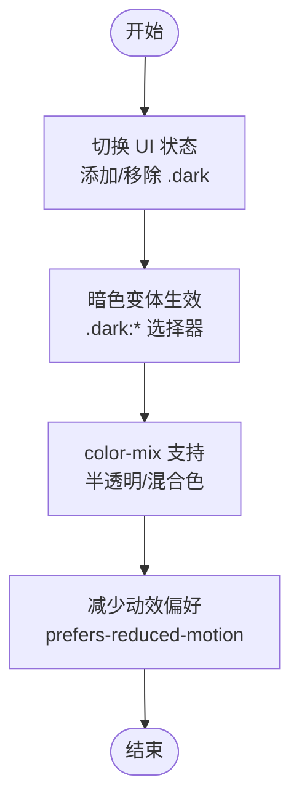
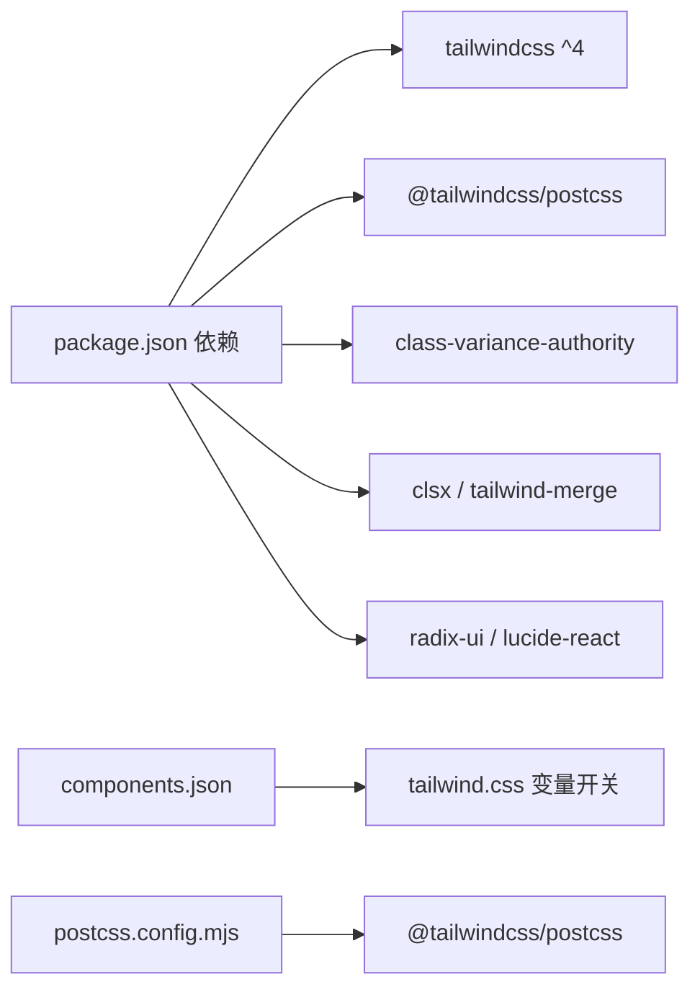

# 样式与主题系统

<cite>
**本文引用的文件**
- [frontend/src/app/globals.css](file://frontend/src/app/globals.css)
- [frontend/components.json](file://frontend/components.json)
- [frontend/postcss.config.mjs](file://frontend/postcss.config.mjs)
- [frontend/package.json](file://frontend/package.json)
- [frontend/src/components/ui/button.tsx](file://frontend/src/components/ui/button.tsx)
- [frontend/src/components/ui/card.tsx](file://frontend/src/components/ui/card.tsx)
- [frontend/src/components/ui/dialog.tsx](file://frontend/src/components/ui/dialog.tsx)
- [frontend/src/stores/useUIStore.ts](file://frontend/src/stores/useUIStore.ts)
</cite>

## 目录
1. [简介](#简介)
2. [项目结构](#项目结构)
3. [核心组件](#核心组件)
4. [架构总览](#架构总览)
5. [详细组件分析](#详细组件分析)
6. [依赖关系分析](#依赖关系分析)
7. [性能考虑](#性能考虑)
8. [故障排查指南](#故障排查指南)
9. [结论](#结论)
10. [附录](#附录)

## 简介
本文件面向样式与主题系统，围绕 Tailwind CSS v4 的配置与定制展开，涵盖颜色系统、字体配置、响应式断点、暗色主题实现（CSS 变量与主题切换）、全局样式组织与命名约定、组件样式隔离与继承、CSS-in-JS 使用场景与最佳实践、动画与过渡效果、样式性能优化策略以及主题定制与品牌色彩扩展方法。文档以仓库中实际存在的样式与组件文件为依据，提供可操作的说明与图示。

## 项目结构
前端样式体系由以下关键文件构成：
- 全局样式入口：定义 Tailwind 引入、CSS 变量映射、品牌色板、基础层与自定义动画/过渡
- PostCSS 配置：启用 Tailwind v4 插件
- 组件库配置：shadcn/ui 集成与 Tailwind 变量开关
- UI 组件：基于 class-variance-authority 的变体按钮、卡片、对话框等
- 状态管理：UI 状态（如模态、处理状态、语言）用于驱动主题与交互

图表来源
- [frontend/src/app/globals.css](file://frontend/src/app/globals.css#L1-L241)
- [frontend/postcss.config.mjs](file://frontend/postcss.config.mjs#L1-L8)
- [frontend/components.json](file://frontend/components.json#L1-L24)
- [frontend/src/components/ui/button.tsx](file://frontend/src/components/ui/button.tsx#L1-L65)
- [frontend/src/components/ui/card.tsx](file://frontend/src/components/ui/card.tsx#L1-L93)
- [frontend/src/components/ui/dialog.tsx](file://frontend/src/components/ui/dialog.tsx#L1-L159)
- [frontend/src/stores/useUIStore.ts](file://frontend/src/stores/useUIStore.ts#L1-L65)

章节来源
- [frontend/src/app/globals.css](file://frontend/src/app/globals.css#L1-L241)
- [frontend/postcss.config.mjs](file://frontend/postcss.config.mjs#L1-L8)
- [frontend/components.json](file://frontend/components.json#L1-L24)

## 核心组件
- 品牌色板与 CSS 变量
  - 在全局样式中定义了完整的 CSS 变量体系，覆盖背景、前景、主色、次色、强调色、边框、输入、环形高亮、语义色（成功/警告）、侧边栏、图表等，并通过 @theme inline 将其映射到 Tailwind v4 的变量别名，确保在任意层级均可使用。
  - 关键路径参考：[品牌色板与变量映射](file://frontend/src/app/globals.css#L9-L53)，[根变量定义](file://frontend/src/app/globals.css#L56-L115)

- 暗色主题实现
  - 使用自定义变体 dark (&:is(.dark *))，结合 CSS 变量与支持函数 color-mix 实现半透明与混合色，保证在深色模式下具备良好的对比度与一致性。
  - 关键路径参考：[自定义暗色变体](file://frontend/src/app/globals.css#L5)，[暗色变体用法示例](file://frontend/.next/dev/static/chunks/src_app_globals_css_bad6b30c._.single.css#L3097-L3118)

- 响应式断点与排版
  - Tailwind v4 生成的断点类（如 md:）在构建产物中可见，配合 CSS 变量字体大小与行高，实现跨设备一致的排版体验。
  - 关键路径参考：[断点类示例](file://frontend/.next/dev/static/chunks/src_app_globals_css_bad6b30c._.single.css#L3064-L3095)

- 组件样式隔离与继承
  - 组件通过 data-slot 属性进行语义化隔离，便于主题与样式覆盖；同时继承全局变量与变体系统，确保风格统一。
  - 关键路径参考：[按钮变体与尺寸](file://frontend/src/components/ui/button.tsx#L7-L39)，[卡片语义槽](file://frontend/src/components/ui/card.tsx#L5-L16)，[对话框动效与结构](file://frontend/src/components/ui/dialog.tsx#L34-L82)

- CSS-in-JS 使用场景与最佳实践
  - 本项目主要采用 CSS 类与 Tailwind 工程化方案，未直接使用 CSS-in-JS 库。但 UI 组件通过 class-variance-authority 生成变体类，属于“类级样式控制”的范畴，可视为广义的“样式逻辑化”实践，有助于在 TypeScript 中安全地组合样式。
  - 关键路径参考：[按钮变体生成](file://frontend/src/components/ui/button.tsx#L7-L39)

- 动画与过渡效果
  - 提供打字机光标、单词淡入、骨架屏 shimmer、页面进入、选项卡片 hover 等动画与过渡，均基于原生 CSS 动画与过渡，减少 JS 干预，提升性能。
  - 关键路径参考：[打字机光标](file://frontend/src/app/globals.css#L142-L152)，[淡入单词](file://frontend/src/app/globals.css#L155-L162)，[骨架屏 shimmer](file://frontend/src/app/globals.css#L165-L179)，[页面转场](file://frontend/src/app/globals.css#L182-L189)，[选项卡片 hover](file://frontend/src/app/globals.css#L192-L207)

- 全局样式组织与命名约定
  - 采用 @layer base 组织基础重置与默认样式；使用语义化前缀（如 prose-story、typewriter-cursor、skeleton-shimmer、animate-page-enter、option-card、touch-target）命名，便于维护与检索。
  - 关键路径参考：[基础层](file://frontend/src/app/globals.css#L117-L124)，[命名约定示例](file://frontend/src/app/globals.css#L126-L231)

章节来源
- [frontend/src/app/globals.css](file://frontend/src/app/globals.css#L1-L241)
- [frontend/src/components/ui/button.tsx](file://frontend/src/components/ui/button.tsx#L1-L65)
- [frontend/src/components/ui/card.tsx](file://frontend/src/components/ui/card.tsx#L1-L93)
- [frontend/src/components/ui/dialog.tsx](file://frontend/src/components/ui/dialog.tsx#L1-L159)

## 架构总览
样式系统围绕“全局变量 → 组件变体 → 主题切换 → 构建产物”的链路工作。PostCSS 负责将 Tailwind v4 与 shadcn/ui 注入到 CSS 中，组件通过 class-variance-authority 生成变体类，运行时通过 UI 状态驱动主题切换与交互。

图表来源
- [frontend/postcss.config.mjs](file://frontend/postcss.config.mjs#L1-L8)
- [frontend/components.json](file://frontend/components.json#L1-L24)
- [frontend/src/app/globals.css](file://frontend/src/app/globals.css#L1-L241)
- [frontend/src/stores/useUIStore.ts](file://frontend/src/stores/useUIStore.ts#L1-L65)

## 详细组件分析

### 组件：按钮 Button
- 设计要点
  - 使用 class-variance-authority 定义变体与尺寸，自动组合 hover/focus/禁用/错误态等状态类
  - 支持 asChild 渲染为不同 HTML 元素，保持语义正确性
  - 通过 data-slot 与 data-variant/data-size 标注，便于调试与覆盖
- 样式隔离
  - 仅依赖全局变量与变体类，避免内联样式污染
- 性能特性
  - 无运行时计算，类名在构建期确定

图表来源
- [frontend/src/components/ui/button.tsx](file://frontend/src/components/ui/button.tsx#L7-L39)

章节来源
- [frontend/src/components/ui/button.tsx](file://frontend/src/components/ui/button.tsx#L1-L65)

### 组件：卡片 Card
- 设计要点
  - 语义化子组件（Header/Title/Description/Action/Content/Footer），通过 data-slot 标注
  - 使用容器查询与网格布局实现响应式与对齐
- 样式隔离
  - 通过 bg-card/text-card-foreground 等变量类继承全局主题

图表来源
- [frontend/src/components/ui/card.tsx](file://frontend/src/components/ui/card.tsx#L5-L92)

章节来源
- [frontend/src/components/ui/card.tsx](file://frontend/src/components/ui/card.tsx#L1-L93)

### 组件：对话框 Dialog
- 设计要点
  - 基于 Radix UI，使用 data-[state=open] 动画类实现开合过渡
  - 内置 Overlay/Content/Header/Footer/Title/Description 结构，支持关闭按钮与键盘无障碍
- 动画与过渡
  - 使用 animate-in/animate-out 与 fade/zoom 系列类，保证流畅体验

图表来源
- [frontend/src/components/ui/dialog.tsx](file://frontend/src/components/ui/dialog.tsx#L10-L82)

章节来源
- [frontend/src/components/ui/dialog.tsx](file://frontend/src/components/ui/dialog.tsx#L1-L159)

### 主题切换流程（暗色模式）
- 运行时切换
  - 通过 UI 状态管理器切换根元素上的 .dark 类，从而激活暗色变体选择器
- 样式应用
  - 暗色变体 .dark\:bg-input\/30 与 color-mix 支持确保颜色混合与半透明白名单生效
- 无障碍与偏好
  - 媒体查询 prefers-reduced-motion 降低动画与过渡时长，尊重用户偏好

图表来源
- [frontend/src/stores/useUIStore.ts](file://frontend/src/stores/useUIStore.ts#L1-L65)
- [frontend/src/app/globals.css](file://frontend/src/app/globals.css#L5)
- [frontend/.next/dev/static/chunks/src_app_globals_css_bad6b30c._.single.css](file://frontend/.next/dev/static/chunks/src_app_globals_css_bad6b30c._.single.css#L3097-L3118)

章节来源
- [frontend/src/stores/useUIStore.ts](file://frontend/src/stores/useUIStore.ts#L1-L65)
- [frontend/src/app/globals.css](file://frontend/src/app/globals.css#L5)
- [frontend/.next/dev/static/chunks/src_app_globals_css_bad6b30c._.single.css](file://frontend/.next/dev/static/chunks/src_app_globals_css_bad6b30c._.single.css#L3097-L3118)

## 依赖关系分析
- 构建工具链
  - PostCSS 通过 @tailwindcss/postcss 插件接入 Tailwind v4
  - shadcn/ui 通过 components.json 配置，开启 tailwind.css 与 CSS 变量开关
- 运行时依赖
  - class-variance-authority 与 clsx/tailwind-merge 用于变体类组合与合并
  - radix-ui 与 lucide-react 提供无障碍与图标支持

图表来源
- [frontend/package.json](file://frontend/package.json#L16-L48)
- [frontend/components.json](file://frontend/components.json#L6-L12)
- [frontend/postcss.config.mjs](file://frontend/postcss.config.mjs#L1-L8)

章节来源
- [frontend/package.json](file://frontend/package.json#L16-L48)
- [frontend/components.json](file://frontend/components.json#L1-L24)
- [frontend/postcss.config.mjs](file://frontend/postcss.config.mjs#L1-L8)

## 性能考虑
- 关键 CSS 提取
  - 利用 Next.js 构建产物中的关键类（如断点类 md:\*）与全局样式，确保首屏渲染所需的核心样式优先加载
- 样式懒加载
  - 对非关键路径的组件样式（如大型对话框、复杂卡片）采用按需引入与动态加载策略，减少初始包体积
- 动画与过渡优化
  - 优先使用 transform/opacity 等可合成属性；在减少动效偏好下缩短动画时长，避免不必要的重绘
- 变体类复用
  - 通过 class-variance-authority 生成稳定类名，避免重复计算与运行时样式拼接

## 故障排查指南
- 暗色主题不生效
  - 检查根元素是否正确添加 .dark 类；确认暗色变体选择器与 CSS 变量映射存在
  - 参考路径：[暗色变体选择器](file://frontend/src/app/globals.css#L5)，[变量映射](file://frontend/src/app/globals.css#L9-L53)
- 颜色不随主题变化
  - 确认组件使用的是全局变量类（如 bg-primary/text-primary-foreground），而非硬编码颜色值
  - 参考路径：[按钮变体类](file://frontend/src/components/ui/button.tsx#L10-L22)
- 动画异常或卡顿
  - 检查是否启用了 prefers-reduced-motion；确认动画属性使用可合成属性
  - 参考路径：[减少动效偏好](file://frontend/src/app/globals.css#L234-L240)
- 构建后样式缺失
  - 确认 postcss.config.mjs 正确加载 @tailwindcss/postcss；检查 components.json 的 tailwind.css 路径
  - 参考路径：[PostCSS 配置](file://frontend/postcss.config.mjs#L1-L8)，[组件库配置](file://frontend/components.json#L6-L12)

章节来源
- [frontend/src/app/globals.css](file://frontend/src/app/globals.css#L5-L53)
- [frontend/src/components/ui/button.tsx](file://frontend/src/components/ui/button.tsx#L10-L22)
- [frontend/postcss.config.mjs](file://frontend/postcss.config.mjs#L1-L8)
- [frontend/components.json](file://frontend/components.json#L6-L12)

## 结论
本样式与主题系统以 Tailwind CSS v4 为核心，结合 CSS 变量、自定义暗色变体与 shadcn/ui 组件库，实现了统一的品牌色彩、清晰的组件隔离与可维护的主题切换机制。通过合理的命名约定、动画与过渡策略以及工程化配置，系统在可扩展性与性能之间取得了良好平衡。后续可在现有基础上进一步完善品牌色彩扩展与关键 CSS 优化策略。

## 附录
- 主题定制与品牌色彩扩展建议
  - 新增品牌色板：在 :root 中补充新的 --brand-* 变量，并在 @theme inline 中映射到对应别名
  - 组件扩展：为新组件定义 data-slot 与变体类，遵循现有命名约定
  - 动画规范：统一使用 animate-in/animate-out 与语义化类名，避免硬编码动画参数
- 响应式断点与排版
  - 借助 Tailwind v4 生成的断点类与 CSS 变量字体大小，确保跨设备一致体验
- CSS-in-JS 最佳实践
  - 优先使用类与变体系统；如确需运行时样式，建议封装为受控组件并最小化计算范围