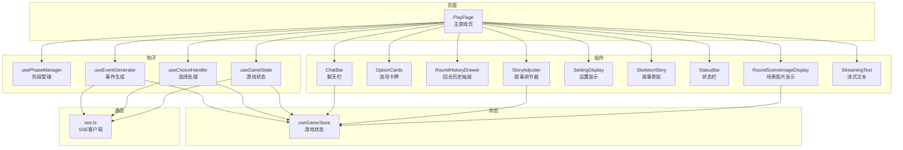
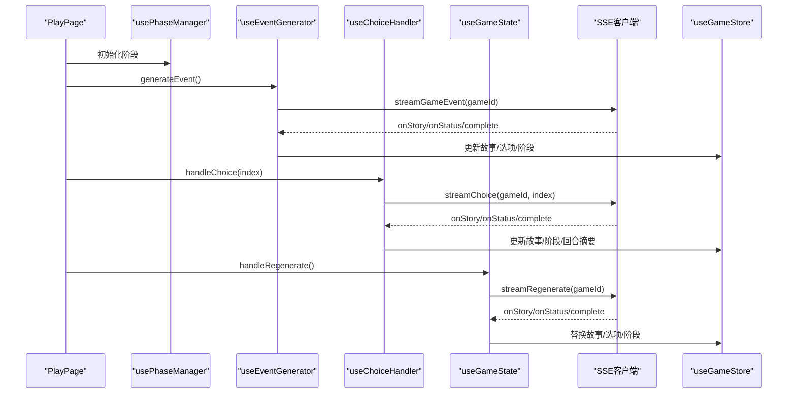
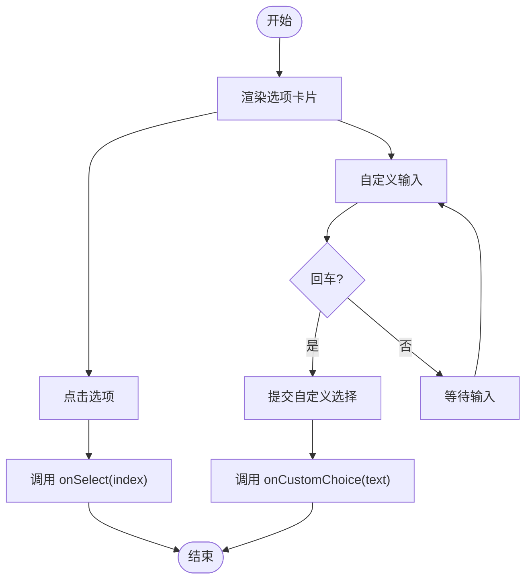
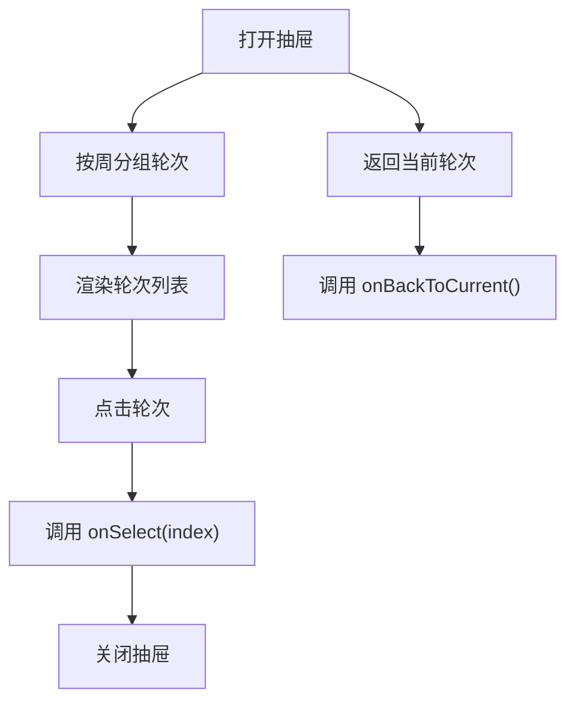
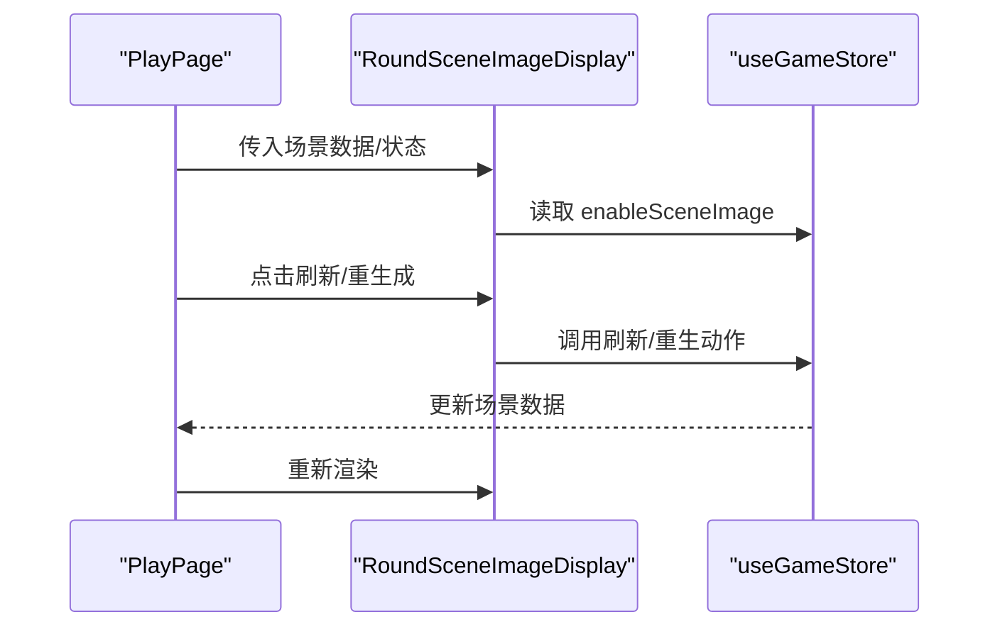
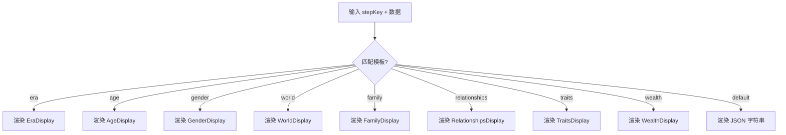
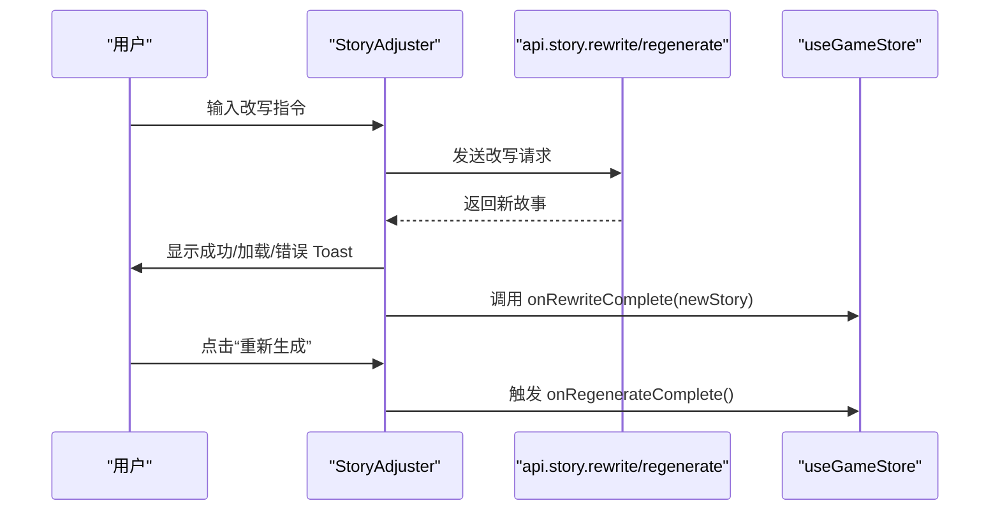
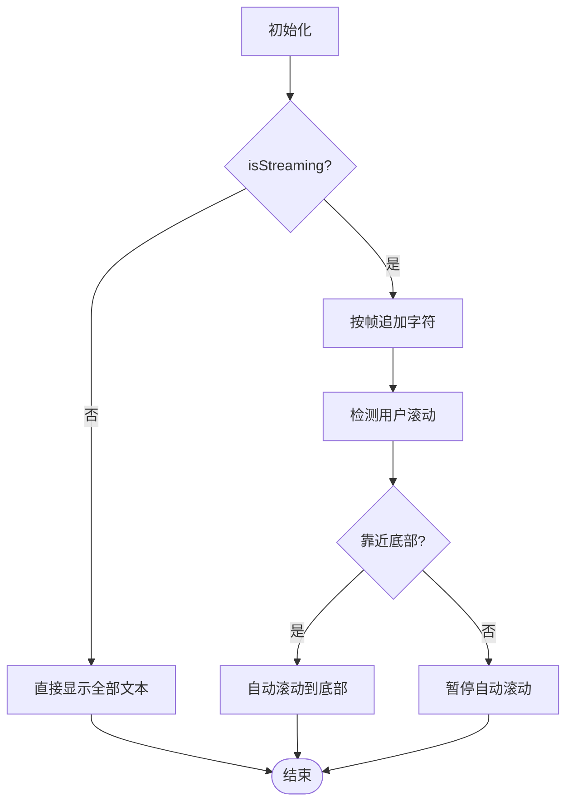
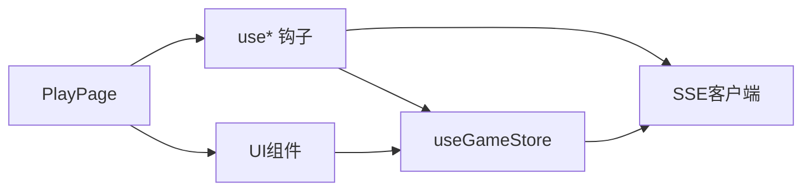

# 游戏UI组件

<cite>
**本文引用的文件**
- [frontend/src/components/game/ChatBar.tsx](file://frontend/src/components/game/ChatBar.tsx)
- [frontend/src/components/game/OptionCards.tsx](file://frontend/src/components/game/OptionCards.tsx)
- [frontend/src/components/game/RoundHistoryDrawer.tsx](file://frontend/src/components/game/RoundHistoryDrawer.tsx)
- [frontend/src/components/game/RoundSceneImage.tsx](file://frontend/src/components/game/RoundSceneImage.tsx)
- [frontend/src/components/game/SettingDisplay.tsx](file://frontend/src/components/game/SettingDisplay.tsx)
- [frontend/src/components/game/SkeletonStory.tsx](file://frontend/src/components/game/SkeletonStory.tsx)
- [frontend/src/components/game/StatusBar.tsx](file://frontend/src/components/game/StatusBar.tsx)
- [frontend/src/components/game/StoryAdjuster.tsx](file://frontend/src/components/game/StoryAdjuster.tsx)
- [frontend/src/components/game/StreamingText.tsx](file://frontend/src/components/game/StreamingText.tsx)
- [frontend/src/app/play/page.tsx](file://frontend/src/app/play/page.tsx)
- [frontend/src/hooks/game/useGameState.ts](file://frontend/src/hooks/game/useGameState.ts)
- [frontend/src/hooks/game/useChoiceHandler.ts](file://frontend/src/hooks/game/useChoiceHandler.ts)
- [frontend/src/hooks/game/useEventGenerator.ts](file://frontend/src/hooks/game/useEventGenerator.ts)
- [frontend/src/hooks/game/usePhaseManager.ts](file://frontend/src/hooks/game/usePhaseManager.ts)
- [frontend/src/lib/sse.ts](file://frontend/src/lib/sse.ts)
- [frontend/src/lib/types.ts](file://frontend/src/lib/types.ts)
- [frontend/src/stores/useGameStore.ts](file://frontend/src/stores/useGameStore.ts)
</cite>

## 目录
1. [简介](#简介)
2. [项目结构](#项目结构)
3. [核心组件](#核心组件)
4. [架构总览](#架构总览)
5. [组件详解](#组件详解)
6. [依赖关系分析](#依赖关系分析)
7. [性能考量](#性能考量)
8. [故障排查指南](#故障排查指南)
9. [结论](#结论)
10. [附录](#附录)

## 简介
本技术文档聚焦于游戏UI组件体系，系统梳理聊天栏、选项卡牌、回合历史抽屉、场景图片显示、设置显示、故事骨架、状态栏、故事调节器和流式文本组件的设计与实现。文档深入解释各组件的交互逻辑、数据绑定、动画效果与状态管理；阐述响应式设计与移动端适配策略；说明组件间通信机制与状态共享；并给出文本流式显示、图片懒加载与用户反馈等体验优化建议，以及可访问性与国际化最佳实践。

## 项目结构
游戏UI位于前端Next.js应用中，采用按功能分层组织：
- 组件层：位于 frontend/src/components/game，封装可复用UI组件
- 页面层：frontend/src/app/play/page.tsx 聚合业务逻辑与UI渲染
- 钩子层：frontend/src/hooks/game 下的 use* 系列钩子负责状态流转与SSE通信
- 状态层：frontend/src/stores/useGameStore.ts 提供全局状态与动作
- 通信层：frontend/src/lib/sse.ts 封装SSE流式通信，支持断点续传与自动重连
- 类型层：frontend/src/lib/types.ts 定义前后端数据契约

图表来源
- [frontend/src/app/play/page.tsx](file://frontend/src/app/play/page.tsx#L1-L466)
- [frontend/src/components/game/ChatBar.tsx](file://frontend/src/components/game/ChatBar.tsx#L1-L323)
- [frontend/src/components/game/OptionCards.tsx](file://frontend/src/components/game/OptionCards.tsx#L1-L152)
- [frontend/src/components/game/RoundHistoryDrawer.tsx](file://frontend/src/components/game/RoundHistoryDrawer.tsx#L1-L185)
- [frontend/src/components/game/RoundSceneImage.tsx](file://frontend/src/components/game/RoundSceneImage.tsx#L1-L224)
- [frontend/src/components/game/SettingDisplay.tsx](file://frontend/src/components/game/SettingDisplay.tsx#L1-L393)
- [frontend/src/components/game/SkeletonStory.tsx](file://frontend/src/components/game/SkeletonStory.tsx#L1-L64)
- [frontend/src/components/game/StatusBar.tsx](file://frontend/src/components/game/StatusBar.tsx#L1-L172)
- [frontend/src/components/game/StoryAdjuster.tsx](file://frontend/src/components/game/StoryAdjuster.tsx#L1-L180)
- [frontend/src/components/game/StreamingText.tsx](file://frontend/src/components/game/StreamingText.tsx#L1-L148)
- [frontend/src/hooks/game/usePhaseManager.ts](file://frontend/src/hooks/game/usePhaseManager.ts#L1-L122)
- [frontend/src/hooks/game/useEventGenerator.ts](file://frontend/src/hooks/game/useEventGenerator.ts#L1-L302)
- [frontend/src/hooks/game/useChoiceHandler.ts](file://frontend/src/hooks/game/useChoiceHandler.ts#L1-L158)
- [frontend/src/hooks/game/useGameState.ts](file://frontend/src/hooks/game/useGameState.ts#L1-L315)
- [frontend/src/lib/sse.ts](file://frontend/src/lib/sse.ts#L1-L520)
- [frontend/src/stores/useGameStore.ts](file://frontend/src/stores/useGameStore.ts#L1-L996)

章节来源
- [frontend/src/app/play/page.tsx](file://frontend/src/app/play/page.tsx#L1-L466)

## 核心组件
- 聊天栏 ChatBar：底部固定聊天入口与对话面板，支持快捷操作（保存、改写、重新生成、总结）、消息历史滚动与会话恢复
- 选项卡牌 OptionCards：选项卡片组与自定义输入，提供触控目标与视觉反馈
- 回合历史抽屉 RoundHistoryDrawer：左侧抽屉式历史回顾，按周/轮次分组展示
- 场景图片显示 RoundSceneImageDisplay：轮次场景插画展示与重生成，支持事件/结果阶段区分
- 设置显示 SettingDisplay：多类型设定卡片渲染（时代、年龄、性别、世界、家庭、关系、特质、财富）
- 故事骨架 SkeletonStory：加载骨架屏，含闪烁动画与等待计时
- 状态栏 StatusBar：紧凑/完整两种模式，属性条与进度条
- 故事调节器 StoryAdjuster：底部滑出式改写/重新生成面板，支持整段改写与流式重新生成
- 流式文本 StreamingText：打字机动画、智能滚动、段落渲染与光标闪烁

章节来源
- [frontend/src/components/game/ChatBar.tsx](file://frontend/src/components/game/ChatBar.tsx#L1-L323)
- [frontend/src/components/game/OptionCards.tsx](file://frontend/src/components/game/OptionCards.tsx#L1-L152)
- [frontend/src/components/game/RoundHistoryDrawer.tsx](file://frontend/src/components/game/RoundHistoryDrawer.tsx#L1-L185)
- [frontend/src/components/game/RoundSceneImage.tsx](file://frontend/src/components/game/RoundSceneImage.tsx#L1-L224)
- [frontend/src/components/game/SettingDisplay.tsx](file://frontend/src/components/game/SettingDisplay.tsx#L1-L393)
- [frontend/src/components/game/SkeletonStory.tsx](file://frontend/src/components/game/SkeletonStory.tsx#L1-L64)
- [frontend/src/components/game/StatusBar.tsx](file://frontend/src/components/game/StatusBar.tsx#L1-L172)
- [frontend/src/components/game/StoryAdjuster.tsx](file://frontend/src/components/game/StoryAdjuster.tsx#L1-L180)
- [frontend/src/components/game/StreamingText.tsx](file://frontend/src/components/game/StreamingText.tsx#L1-L148)

## 架构总览
游戏UI采用“页面聚合 + 钩子驱动 + 状态中心 + SSE通信”的分层架构：
- 页面 PlayPage 负责布局与渲染，将业务逻辑委托给 usePlayGame（由上述use*钩子组合而成）
- usePhaseManager 统一管理阶段与连接状态
- useEventGenerator 与 useChoiceHandler 通过 SSE 与后端流式交互，支持断点续传与自动重连
- useGameState 统一处理保存、继续、重新生成、摘要等流程
- useGameStore 提供全局状态与动作（故事文本、事件、图片、角色设定等）

图表来源
- [frontend/src/app/play/page.tsx](file://frontend/src/app/play/page.tsx#L1-L466)
- [frontend/src/hooks/game/usePhaseManager.ts](file://frontend/src/hooks/game/usePhaseManager.ts#L1-L122)
- [frontend/src/hooks/game/useEventGenerator.ts](file://frontend/src/hooks/game/useEventGenerator.ts#L1-L302)
- [frontend/src/hooks/game/useChoiceHandler.ts](file://frontend/src/hooks/game/useChoiceHandler.ts#L1-L158)
- [frontend/src/hooks/game/useGameState.ts](file://frontend/src/hooks/game/useGameState.ts#L1-L315)
- [frontend/src/lib/sse.ts](file://frontend/src/lib/sse.ts#L1-L520)
- [frontend/src/stores/useGameStore.ts](file://frontend/src/stores/useGameStore.ts#L1-L996)

## 组件详解

### 聊天栏 ChatBar
- 交互逻辑
  - 收起态：右下角圆形按钮，点击展开
  - 展开态：顶部快捷操作区（保存、改写、重新生成、总结），中部消息列表自动滚动，底部输入区支持回车发送
  - 会话恢复：发送失败若检测到“会话不存在”，自动触发同步并重试一次
- 数据绑定
  - 本地状态：展开状态、消息历史、发送/生成中标志
  - 全局状态：通过 useGameStore 同步会话与状态
- 动画效果
  - 消息列表底部平滑滚动
  - 加载态使用旋转动画与占位符
- 响应式与移动端
  - 固定定位 + 安全区域适配，输入区高度与按钮尺寸满足触控目标
- 与其他组件的关系
  - 与 StoryAdjuster 共享“改写”入口
  - 与 ChatBar 共享“重新生成”入口（通过回调）

```mermaid
sequenceDiagram
participant User as "用户"
participant CB as "ChatBar"
participant API as "api.story.chat"
participant Store as "useGameStore"
User->>CB : 点击发送
CB->>CB : 校验输入/状态
CB->>API : 发送消息
API-->>CB : 返回回复
CB->>CB : 追加消息到历史
CB->>Store : 若会话异常，尝试同步并重试
```

图表来源
- [frontend/src/components/game/ChatBar.tsx](file://frontend/src/components/game/ChatBar.tsx#L103-L151)
- [frontend/src/stores/useGameStore.ts](file://frontend/src/stores/useGameStore.ts#L346-L427)

章节来源
- [frontend/src/components/game/ChatBar.tsx](file://frontend/src/components/game/ChatBar.tsx#L1-L323)
- [frontend/src/stores/useGameStore.ts](file://frontend/src/stores/useGameStore.ts#L346-L427)

### 选项卡牌 OptionCards
- 交互逻辑
  - 选项卡片：序号+文本，选中态高亮与阴影，点击触发父级回调
  - 自定义输入：支持回车提交，禁用态显示加载
- 数据绑定
  - 本地状态：选中索引、自定义输入文本
  - 父组件回调：onSelect、onCustomChoice
- 动画效果
  - 悬停缩放与过渡，选中态强调色
- 响应式与移动端
  - 最小触控目标，紧凑排版，支持多行文本

图表来源
- [frontend/src/components/game/OptionCards.tsx](file://frontend/src/components/game/OptionCards.tsx#L33-L44)

章节来源
- [frontend/src/components/game/OptionCards.tsx](file://frontend/src/components/game/OptionCards.tsx#L1-L152)

### 回合历史抽屉 RoundHistoryDrawer
- 交互逻辑
  - 按周分组轮次，点击选择某轮次，支持返回当前轮次
  - 只读模式，不可编辑
- 数据绑定
  - 本地状态：打开/关闭、选中索引
  - 父组件回调：onSelect、onBackToCurrent
- 动画效果
  - 抽屉滑入滑出，滚动区域平滑滚动
- 响应式与移动端
  - 左侧抽屉宽度自适应，内容区域滚动

图表来源
- [frontend/src/components/game/RoundHistoryDrawer.tsx](file://frontend/src/components/game/RoundHistoryDrawer.tsx#L51-L183)

章节来源
- [frontend/src/components/game/RoundHistoryDrawer.tsx](file://frontend/src/components/game/RoundHistoryDrawer.tsx#L1-L185)

### 场景图片显示 RoundSceneImageDisplay
- 交互逻辑
  - 展示当前轮次/事件/结果场景插画，支持刷新与重生成
  - 设置面板控制是否自动生成场景插画
- 数据绑定
  - props：场景数据、加载/重生状态、当前轮次、标签
  - 全局状态：useGameStore 控制开关与更新
- 动画效果
  - 图片加载时的占位与淡入
  - 重生成输入框与按钮组
- 响应式与移动端
  - 卡片容器与图片区域自适应，按钮组紧凑排列

图表来源
- [frontend/src/components/game/RoundSceneImage.tsx](file://frontend/src/components/game/RoundSceneImage.tsx#L22-L223)
- [frontend/src/stores/useGameStore.ts](file://frontend/src/stores/useGameStore.ts#L213-L268)

章节来源
- [frontend/src/components/game/RoundSceneImage.tsx](file://frontend/src/components/game/RoundSceneImage.tsx#L1-L224)
- [frontend/src/stores/useGameStore.ts](file://frontend/src/stores/useGameStore.ts#L190-L268)

### 设置显示 SettingDisplay
- 交互逻辑
  - 根据 stepKey 渲染不同模板（时代、年龄、性别、世界、家庭、关系、特质、财富）
  - 新生成项带高亮边框
- 数据绑定
  - props：stepKey、数据对象、是否新生成
- 响应式与移动端
  - 卡片网格布局，标签与内容清晰分层

图表来源
- [frontend/src/components/game/SettingDisplay.tsx](file://frontend/src/components/game/SettingDisplay.tsx#L53-L82)

章节来源
- [frontend/src/components/game/SettingDisplay.tsx](file://frontend/src/components/game/SettingDisplay.tsx#L1-L393)

### 故事骨架 SkeletonStory
- 交互逻辑
  - 仅渲染，无交互
- 数据绑定
  - props：消息文本、已等待秒数
- 动画效果
  - 骨架闪烁动画，居中布局
- 响应式与移动端
  - 适配窄屏，间距与字号自适应

章节来源
- [frontend/src/components/game/SkeletonStory.tsx](file://frontend/src/components/game/SkeletonStory.tsx#L1-L64)

### 状态栏 StatusBar
- 交互逻辑
  - 紧凑模式用于顶部徽章，完整模式用于侧边栏详情
- 数据绑定
  - props：玩家状态、进度、紧凑/完整模式
- 动画效果
  - 属性条与进度条过渡动画
- 响应式与移动端
  - 密集信息的紧凑展示，避免遮挡

章节来源
- [frontend/src/components/game/StatusBar.tsx](file://frontend/src/components/game/StatusBar.tsx#L1-L172)

### 故事调节器 StoryAdjuster
- 交互逻辑
  - 底部滑出面板，输入改写指令，支持整段改写与流式重新生成
  - 会话恢复：若检测到会话不存在，自动恢复并重试
- 数据绑定
  - props：打开状态、游戏ID、完整故事、完成回调
  - 本地状态：指令文本、改写中标志、Toast提示
- 动画效果
  - 抽屉滑入滑出，Toast提示
- 响应式与移动端
  - 底部滑出，适合移动端操作

图表来源
- [frontend/src/components/game/StoryAdjuster.tsx](file://frontend/src/components/game/StoryAdjuster.tsx#L52-L97)
- [frontend/src/stores/useGameStore.ts](file://frontend/src/stores/useGameStore.ts#L346-L427)

章节来源
- [frontend/src/components/game/StoryAdjuster.tsx](file://frontend/src/components/game/StoryAdjuster.tsx#L1-L180)
- [frontend/src/stores/useGameStore.ts](file://frontend/src/stores/useGameStore.ts#L346-L427)

### 流式文本 StreamingText
- 交互逻辑
  - 仅在 isStreaming 时启用逐字显示；非流式模式直接显示全部文本
  - 智能滚动：用户滚动时暂停自动滚动，靠近底部时自动滚动
- 数据绑定
  - props：文本、是否流式、字符/帧间隔
  - 本地状态：已显示长度、用户滚动标记
- 动画效果
  - 打字机效果、段落淡入、光标闪烁
- 响应式与移动端
  - 滚动容器自适应，字号与行高优化阅读

图表来源
- [frontend/src/components/game/StreamingText.tsx](file://frontend/src/components/game/StreamingText.tsx#L44-L113)

章节来源
- [frontend/src/components/game/StreamingText.tsx](file://frontend/src/components/game/StreamingText.tsx#L1-L148)

## 依赖关系分析
- 组件耦合
  - PlayPage 作为编排者，依赖各组件与钩子；组件之间通过props与回调解耦
  - ChatBar、StoryAdjuster、RoundSceneImageDisplay、OptionCards、RoundHistoryDrawer、StatusBar、SettingDisplay、SkeletonStory、StreamingText 各自职责明确
- 状态共享
  - useGameStore 提供全局状态与动作，被多个组件与钩子共享
  - usePhaseManager 提供阶段与连接状态，统一调度
- 外部依赖
  - SSE 客户端封装了断点续传、自动重连与错误处理
  - 类型系统保证前后端契约一致

图表来源
- [frontend/src/app/play/page.tsx](file://frontend/src/app/play/page.tsx#L1-L466)
- [frontend/src/hooks/game/useEventGenerator.ts](file://frontend/src/hooks/game/useEventGenerator.ts#L1-L302)
- [frontend/src/hooks/game/useChoiceHandler.ts](file://frontend/src/hooks/game/useChoiceHandler.ts#L1-L158)
- [frontend/src/hooks/game/useGameState.ts](file://frontend/src/hooks/game/useGameState.ts#L1-L315)
- [frontend/src/lib/sse.ts](file://frontend/src/lib/sse.ts#L1-L520)
- [frontend/src/stores/useGameStore.ts](file://frontend/src/stores/useGameStore.ts#L1-L996)

章节来源
- [frontend/src/app/play/page.tsx](file://frontend/src/app/play/page.tsx#L1-L466)
- [frontend/src/stores/useGameStore.ts](file://frontend/src/stores/useGameStore.ts#L1-L996)
- [frontend/src/lib/sse.ts](file://frontend/src/lib/sse.ts#L1-L520)

## 性能考量
- 文本流式显示
  - StreamingText 采用按帧增量渲染与智能滚动，避免长文本一次性渲染带来的卡顿
  - 建议：合理设置 charsPerFrame 与 frameInterval，移动端可适当降低帧率
- 图片懒加载与渐进呈现
  - RoundSceneImageDisplay 在图片加载时显示占位与旋转图标，加载完成后淡入，减少白屏与跳变
  - 建议：结合 IntersectionObserver 实现进入视口再加载
- 会话恢复与重连
  - SSE 客户端支持断点续传与指数退避重连，网络恢复后自动恢复
  - 建议：在弱网环境下限制最大重试次数与延迟上限
- 预取与并发控制
  - useEventGenerator 支持预取下一事件，减少等待时间；通过 AbortController 控制并发
  - 建议：在结果阶段触发预取，避免干扰当前生成
- 状态更新优化
  - useGameStore 使用浅比较字段判断变更，减少不必要的重渲染
  - 建议：将大型对象拆分，避免无关字段触发更新

## 故障排查指南
- 会话过期
  - 现象：SSE/HTTP 请求返回 404 或“无活动游戏会话”
  - 处理：自动触发 syncState/syncPlayerState，必要时重试
  - 参考：ChatBar、StoryAdjuster、useEventGenerator、useChoiceHandler、useGameState
- 连接中断
  - 现象：SSE 连接断开，出现“连接中断/未知错误”
  - 处理：自动重连，指数退避；离线时等待网络恢复
  - 参考：sse.ts 的自动重连与断点续传
- 生成失败
  - 现象：事件/选择/重新生成无选项或报错
  - 处理：显示简化错误消息，引导重试或刷新页面
  - 参考：useEventGenerator、useChoiceHandler、useGameState
- 图片生成异常
  - 现象：场景插画生成失败或为空
  - 处理：检查 enableSceneImage 开关与网络状态，提供刷新/重生入口
  - 参考：RoundSceneImageDisplay、useGameStore

章节来源
- [frontend/src/components/game/ChatBar.tsx](file://frontend/src/components/game/ChatBar.tsx#L124-L144)
- [frontend/src/components/game/StoryAdjuster.tsx](file://frontend/src/components/game/StoryAdjuster.tsx#L75-L91)
- [frontend/src/hooks/game/useEventGenerator.ts](file://frontend/src/hooks/game/useEventGenerator.ts#L131-L152)
- [frontend/src/hooks/game/useChoiceHandler.ts](file://frontend/src/hooks/game/useChoiceHandler.ts#L106-L113)
- [frontend/src/hooks/game/useGameState.ts](file://frontend/src/hooks/game/useGameState.ts#L225-L266)
- [frontend/src/lib/sse.ts](file://frontend/src/lib/sse.ts#L344-L439)
- [frontend/src/components/game/RoundSceneImage.tsx](file://frontend/src/components/game/RoundSceneImage.tsx#L84-L89)
- [frontend/src/stores/useGameStore.ts](file://frontend/src/stores/useGameStore.ts#L213-L268)

## 结论
本UI组件体系通过清晰的分层与职责划分，实现了流畅的流式交互、稳定的会话恢复与良好的移动端体验。组件间通过props与回调解耦，状态通过集中式store管理，通信通过SSE客户端抽象，形成高内聚、低耦合的架构。建议在后续迭代中进一步完善图片懒加载、国际化文案与无障碍支持，并持续优化弱网环境下的重连策略与预取机制。

## 附录
- 可访问性建议
  - 为按钮与链接提供语义化标签与键盘导航
  - 为图片提供替代文本，为动画提供“减少动画”偏好设置
  - 为加载状态提供ARIA状态描述
- 国际化支持
  - 将文案抽取为国际化键值，按语言切换渲染
  - 数字、日期与货币格式按地区设置
- 组件复用与扩展
  - 将通用交互（如加载、错误、空状态）抽象为可复用Hook或组件
  - 通过接口与类型约束保证扩展的一致性