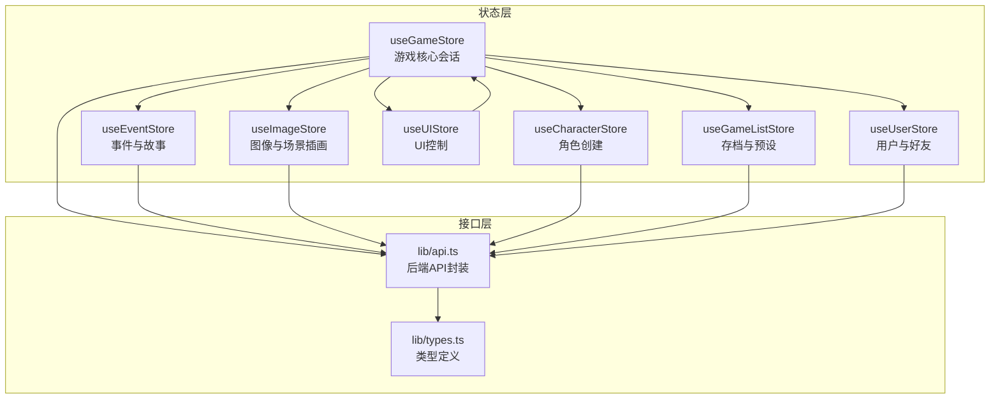
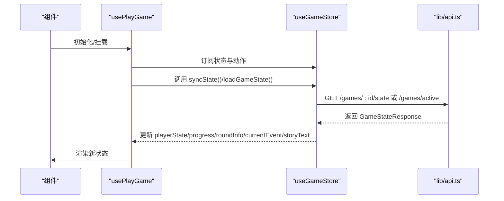
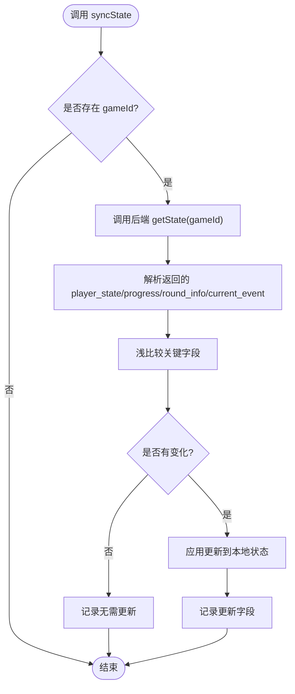
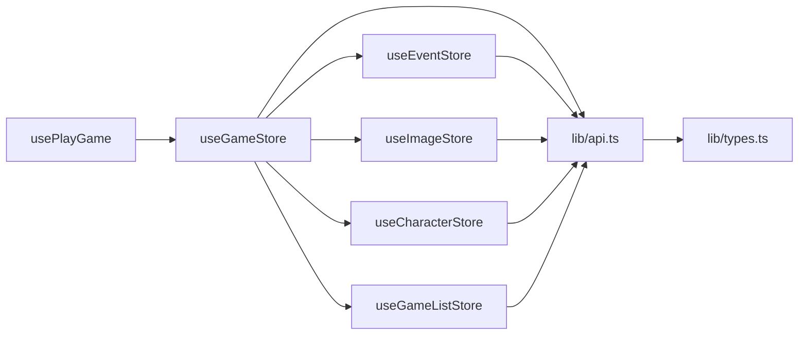

# 状态管理系统

<cite>
**本文档引用的文件**
- [frontend/src/stores/index.ts](file://frontend/src/stores/index.ts)
- [frontend/src/stores/useGameStore.ts](file://frontend/src/stores/useGameStore.ts)
- [frontend/src/stores/useCharacterStore.ts](file://frontend/src/stores/useCharacterStore.ts)
- [frontend/src/stores/useEventStore.ts](file://frontend/src/stores/useEventStore.ts)
- [frontend/src/stores/useImageStore.ts](file://frontend/src/stores/useImageStore.ts)
- [frontend/src/stores/useUIStore.ts](file://frontend/src/stores/useUIStore.ts)
- [frontend/src/stores/useUserStore.ts](file://frontend/src/stores/useUserStore.ts)
- [frontend/src/stores/useGameListStore.ts](file://frontend/src/stores/useGameListStore.ts)
- [frontend/src/lib/types.ts](file://frontend/src/lib/types.ts)
- [frontend/src/lib/api.ts](file://frontend/src/lib/api.ts)
- [frontend/src/hooks/usePlayGame.ts](file://frontend/src/hooks/usePlayGame.ts)
</cite>

## 目录
1. [简介](#简介)
2. [项目结构](#项目结构)
3. [核心组件](#核心组件)
4. [架构总览](#架构总览)
5. [详细组件分析](#详细组件分析)
6. [依赖关系分析](#依赖关系分析)
7. [性能考虑](#性能考虑)
8. [故障排查指南](#故障排查指南)
9. [结论](#结论)
10. [附录](#附录)

## 简介
本项目采用 Zustand 作为前端状态管理核心，围绕游戏会话构建了细粒度的多 store 架构，涵盖游戏状态、角色状态、事件状态、图像状态、UI 状态与用户状态，并通过持久化中间件与后端 API 实现状态同步与本地持久化。本文档系统性阐述各 store 的职责边界、状态结构、动作组织、订阅与组件更新机制、同步策略、最佳实践、调试与性能优化，以及状态迁移与版本兼容方案。

## 项目结构
前端状态管理位于 frontend/src/stores 目录，采用“按功能域拆分”的模块化组织：
- useGameStore.ts：游戏核心会话状态（向后兼容聚合）
- useCharacterStore.ts：角色创建流程状态
- useEventStore.ts：事件与故事文本状态
- useImageStore.ts：图像生成与场景插画状态
- useUIStore.ts：UI 控制与处理状态
- useUserStore.ts：用户认证与好友状态
- useGameListStore.ts：存档与预设列表状态
- index.ts：统一导出入口，维持向后兼容

**图表来源**
- [frontend/src/stores/index.ts](file://frontend/src/stores/index.ts#L1-L27)
- [frontend/src/stores/useGameStore.ts](file://frontend/src/stores/useGameStore.ts#L1-L160)
- [frontend/src/stores/useCharacterStore.ts](file://frontend/src/stores/useCharacterStore.ts#L1-L118)
- [frontend/src/stores/useEventStore.ts](file://frontend/src/stores/useEventStore.ts#L1-L83)
- [frontend/src/stores/useImageStore.ts](file://frontend/src/stores/useImageStore.ts#L1-L68)
- [frontend/src/stores/useUIStore.ts](file://frontend/src/stores/useUIStore.ts#L1-L65)
- [frontend/src/stores/useUserStore.ts](file://frontend/src/stores/useUserStore.ts#L1-L126)
- [frontend/src/stores/useGameListStore.ts](file://frontend/src/stores/useGameListStore.ts#L1-L55)
- [frontend/src/lib/api.ts](file://frontend/src/lib/api.ts#L1-L124)
- [frontend/src/lib/types.ts](file://frontend/src/lib/types.ts#L1-L342)

**章节来源**
- [frontend/src/stores/index.ts](file://frontend/src/stores/index.ts#L1-L27)

## 核心组件
- useGameStore：游戏会话聚合 store，负责会话标识、玩家状态、进度、回合信息、事件与故事文本、存档与预设、角色创建、图像生成与场景插画、游戏设置（如是否自动生成场景插画），并提供与后端同步、保存、重置等动作。
- useCharacterStore：角色创建流程状态，包含步骤跟踪、角色设定、玩家姓名、人生愿景、开场故事、预设加载标记等。
- useEventStore：事件与故事文本状态，维护当前事件、累计流式故事文本、年度总结数据，并提供生成总结与清理摘要的动作。
- useImageStore：图像相关状态，包含玩家头像、开场插画、每轮场景插画（事件与结果两阶段）、加载与再生状态，以及对应的生成、重新生成、批量获取等动作。
- useUIStore：UI 控制状态，包括模态框、处理中状态、流式状态、语言、侧边栏开关等。
- useUserStore：用户认证与好友状态，包含用户信息、令牌、认证状态、好友列表与待处理请求，以及注册、登录、登出、好友操作等动作。
- useGameListStore：存档与预设列表状态，提供列表获取、删除、设置等动作。
- 统一导出：index.ts 提供向后兼容的统一导出，便于组件按需引入或整体导入。

**章节来源**
- [frontend/src/stores/useGameStore.ts](file://frontend/src/stores/useGameStore.ts#L1-L160)
- [frontend/src/stores/useCharacterStore.ts](file://frontend/src/stores/useCharacterStore.ts#L1-L118)
- [frontend/src/stores/useEventStore.ts](file://frontend/src/stores/useEventStore.ts#L1-L83)
- [frontend/src/stores/useImageStore.ts](file://frontend/src/stores/useImageStore.ts#L1-L68)
- [frontend/src/stores/useUIStore.ts](file://frontend/src/stores/useUIStore.ts#L1-L65)
- [frontend/src/stores/useUserStore.ts](file://frontend/src/stores/useUserStore.ts#L1-L126)
- [frontend/src/stores/useGameListStore.ts](file://frontend/src/stores/useGameListStore.ts#L1-L55)
- [frontend/src/stores/index.ts](file://frontend/src/stores/index.ts#L1-L27)

## 架构总览
Zustand 通过 create/store 模式创建独立状态容器；persist 中间件提供本地持久化能力；API 层通过 lib/api.ts 封装 fetch 请求与认证策略（Cookie 优先，Authorization Header 备份）。组件通过 hooks 订阅 store，实现响应式更新。

**图表来源**
- [frontend/src/hooks/usePlayGame.ts](file://frontend/src/hooks/usePlayGame.ts#L26-L127)
- [frontend/src/stores/useGameStore.ts](file://frontend/src/stores/useGameStore.ts#L273-L344)
- [frontend/src/lib/api.ts](file://frontend/src/lib/api.ts#L230-L276)

## 详细组件分析

### useGameStore：游戏核心会话状态
- 职责：管理游戏会话标识、玩家状态、进度、回合信息、事件与故事文本、存档与预设、角色创建、图像生成与场景插画、游戏设置（如是否自动生成场景插画）。
- 关键状态：
  - 会话：gameId、sessionId、playerState、progress、roundInfo、isGameOver
  - 事件：currentEvent、storyText、lastSummary
  - 列表：savedGames、presets
  - 角色创建：creationStep、characterSettings、playerName、lifeVision、openingStory、isPresetLoaded
  - 图像：playerImage、playerImages、selectedImageIndex、isGeneratingImage、imageFeedback、openingIllustration、isGeneratingIllustration、illustrationError、roundSceneImages、currentRoundSceneImage、eventSceneImage、resultSceneImage、isLoadingRoundSceneImage、isRegeneratingRoundScene、roundSceneRegenerateError
  - 设置：enableSceneImage
- 关键动作：
  - 会话：setGameSession、loadGameState、syncState、syncPlayerState、saveGame、resetGame
  - 事件：setCurrentEvent、appendStoryText、setStoryText、clearCurrentEvent、setGameOver、generateSummary、clearSummary
  - 列表：fetchSavedGames、fetchPresets、deleteGame、deletePreset
  - 角色创建：setCreationStep、nextCreationStep、prevCreationStep、updateCharacterSetting、setPlayerName、setLifeVision、setOpeningStory、resetCreation、loadPreset
  - 图像：setPlayerImage、setPlayerImages、setSelectedImageIndex、setIsGeneratingImage、setImageFeedback、generatePlayerImage、regeneratePlayerImage、regenerateFreshPlayerImage、setOpeningIllustration、setIsGeneratingIllustration、setIllustrationError、generateOpeningIllustration、regenerateOpeningIllustration、fetchRoundSceneImage、fetchAllRoundSceneImages、setCurrentRoundSceneImage、setEventSceneImage、setResultSceneImage、addRoundSceneImage、regenerateRoundSceneImage、generateRoundSceneImage
  - 设置：setEnableSceneImage
- 同步机制：
  - 后端同步：syncState 与 syncPlayerState 基于浅比较（shallowChanged）判断关键字段变更，仅更新变化部分，减少不必要的渲染。
  - 会话恢复：loadGameState 从后端恢复状态，优先使用 current_event 的故事，若为空则尝试从 last_round_full_story 或 round_history 恢复。
  - 场景插画：支持按阶段（event/result）生成与获取，自动维护 roundSceneImages 与 currentRoundSceneImage。
- 持久化：persist 中间件仅持久化必要字段，避免敏感信息泄露。

**图表来源**
- [frontend/src/stores/useGameStore.ts](file://frontend/src/stores/useGameStore.ts#L346-L427)

**章节来源**
- [frontend/src/stores/useGameStore.ts](file://frontend/src/stores/useGameStore.ts#L1-L996)

### useCharacterStore：角色创建状态
- 职责：管理角色创建流程的状态，包括步骤跟踪、角色设定、玩家姓名、人生愿景、开场故事、预设加载标记。
- 关键状态：creationStep、characterSettings、playerName、lifeVision、openingStory、isPresetLoaded
- 关键动作：setCreationStep、nextCreationStep、prevCreationStep、updateCharacterSetting、setPlayerName、setLifeVision、setOpeningStory、resetCreation、loadPreset
- 持久化：persist 中间件仅持久化必要字段，避免敏感信息泄露。

**章节来源**
- [frontend/src/stores/useCharacterStore.ts](file://frontend/src/stores/useCharacterStore.ts#L1-L118)

### useEventStore：事件与故事状态
- 职责：管理当前事件、累计流式故事文本、年度总结数据。
- 关键状态：currentEvent、storyText、lastSummary
- 关键动作：setCurrentEvent、appendStoryText、setStoryText、clearCurrentEvent、generateSummary、clearSummary
- 行为：优先保留前端流式累积的 storyText，避免覆盖。

**章节来源**
- [frontend/src/stores/useEventStore.ts](file://frontend/src/stores/useEventStore.ts#L1-L83)

### useImageStore：图像与场景插画状态
- 职责：管理玩家头像、开场插画、每轮场景插画（事件与结果两阶段）及相关生成与再生动作。
- 关键状态：playerImage、playerImages、selectedImageIndex、isGeneratingImage、imageFeedback、openingIllustration、isGeneratingIllustration、illustrationError、roundSceneImages、currentRoundSceneImage、eventSceneImage、resultSceneImage、isLoadingRoundSceneImage、isRegeneratingRoundScene、roundSceneRegenerateError
- 关键动作：生成与再生玩家头像、生成与再生开场插画、按轮次获取场景插画、获取全部场景插画、按阶段获取场景插画、重新生成场景插画、设置当前场景插画、设置事件/结果场景插画、添加场景插画
- 行为：支持按阶段（event/result）区分场景插画，自动维护状态数组与当前显示项。

**章节来源**
- [frontend/src/stores/useImageStore.ts](file://frontend/src/stores/useImageStore.ts#L1-L409)

### useUIStore：UI 控制状态
- 职责：管理模态框、处理中状态、流式状态、语言、侧边栏开关等 UI 控制。
- 关键状态：activeModal、modalData、isProcessing、processingMessage、isStreaming、language、sidebarOpen
- 关键动作：openModal、closeModal、setProcessing、setStreaming、setLanguage、toggleSidebar

**章节来源**
- [frontend/src/stores/useUIStore.ts](file://frontend/src/stores/useUIStore.ts#L1-L65)

### useUserStore：用户与好友状态
- 职责：管理用户认证与好友状态，包含用户信息、令牌、认证状态、好友列表与待处理请求。
- 关键状态：user、token、isAuthenticated、friends、pendingRequests
- 关键动作：register、login、logout、fetchMe、fetchFriends、fetchPendingRequests、sendFriendRequest、respondToRequest、removeFriend、setUser
- 认证策略：优先使用 Cookie（credentials: 'include'），若不可用则使用 Authorization Header；退出登录时清除本地 token 并标记 Cookie 不可用。

**章节来源**
- [frontend/src/stores/useUserStore.ts](file://frontend/src/stores/useUserStore.ts#L1-L126)
- [frontend/src/lib/api.ts](file://frontend/src/lib/api.ts#L1-L124)

### useGameListStore：存档与预设列表状态
- 职责：管理游戏存档列表与角色预设列表。
- 关键状态：savedGames、presets
- 关键动作：fetchSavedGames、fetchPresets、deleteGame、deletePreset、setSavedGames、setPresets

**章节来源**
- [frontend/src/stores/useGameListStore.ts](file://frontend/src/stores/useGameListStore.ts#L1-L55)

### 统一导出与向后兼容
- index.ts 提供主 store 与子 store 的统一导出，保持向后兼容，组件可按需引入细粒度 store 或使用聚合 store。

**章节来源**
- [frontend/src/stores/index.ts](file://frontend/src/stores/index.ts#L1-L27)

## 依赖关系分析
- 组件依赖：页面级 hook（如 usePlayGame）依赖 useGameStore，并组合其他子 hook；useGameStore 再依赖 useEventStore、useImageStore、useCharacterStore、useGameListStore。
- API 依赖：各 store 通过 lib/api.ts 调用后端接口，API 层封装认证策略与错误处理。
- 类型依赖：lib/types.ts 定义前后端交互的数据结构，确保类型一致性。

**图表来源**
- [frontend/src/hooks/usePlayGame.ts](file://frontend/src/hooks/usePlayGame.ts#L1-L455)
- [frontend/src/stores/useGameStore.ts](file://frontend/src/stores/useGameStore.ts#L1-L160)
- [frontend/src/lib/api.ts](file://frontend/src/lib/api.ts#L1-L124)
- [frontend/src/lib/types.ts](file://frontend/src/lib/types.ts#L1-L342)

**章节来源**
- [frontend/src/hooks/usePlayGame.ts](file://frontend/src/hooks/usePlayGame.ts#L1-L455)
- [frontend/src/stores/useGameStore.ts](file://frontend/src/stores/useGameStore.ts#L1-L160)
- [frontend/src/lib/api.ts](file://frontend/src/lib/api.ts#L1-L124)
- [frontend/src/lib/types.ts](file://frontend/src/lib/types.ts#L1-L342)

## 性能考虑
- 浅比较更新：useGameStore 中的 shallowChanged 用于判断关键字段是否变化，仅在变化时更新状态，降低渲染开销。
- 按需订阅：组件通过选择器订阅所需字段，避免全局重渲染。
- 懒加载与延迟检查：场景插画在轮次变化或初始化完成后按需生成，避免无谓请求。
- 持久化字段精简：persist 中间件仅持久化必要字段，减少存储体积与序列化成本。
- 错误静默与降级：图像生成失败时静默处理，不影响游戏流程。

[本节为通用指导，无需特定文件引用]

## 故障排查指南
- 会话过期与恢复：
  - syncState 在收到 404 时尝试重新加载游戏；若数据库中不存在则清空本地状态。
  - usePlayGame 在客户端无 gameId 时尝试服务端恢复，若无活动游戏则跳转首页。
- 图像生成失败：
  - useImageStore 与 useGameStore 的图像相关动作在失败时记录错误并保持状态稳定，避免阻塞流程。
- 认证问题：
  - API 层根据 Cookie 可用性自动切换认证方式；退出登录时清除本地 token 并标记 Cookie 不可用。
- 类型不一致：
  - 通过 lib/types.ts 的严格类型定义，确保前后端交互数据结构一致，减少运行时错误。

**章节来源**
- [frontend/src/stores/useGameStore.ts](file://frontend/src/stores/useGameStore.ts#L346-L427)
- [frontend/src/hooks/usePlayGame.ts](file://frontend/src/hooks/usePlayGame.ts#L202-L270)
- [frontend/src/lib/api.ts](file://frontend/src/lib/api.ts#L1-L124)

## 结论
本状态管理方案以 Zustand 为核心，结合细粒度 store、持久化中间件与严格的 API 封装，实现了高效、可维护、可扩展的前端状态管理。通过浅比较更新、按需订阅、会话恢复与错误静默等策略，兼顾了性能与用户体验。建议在后续迭代中持续完善类型体系、增强调试工具与监控告警，以进一步提升系统的稳定性与可观测性。

[本节为总结性内容，无需特定文件引用]

## 附录

### 状态订阅与组件更新机制
- 组件通过 hooks 订阅 store，当状态变化且选择器返回的新值与旧值不相等时触发重渲染。
- 选择器与浅比较结合，确保只有真正变化的部分引起更新。

**章节来源**
- [frontend/src/hooks/usePlayGame.ts](file://frontend/src/hooks/usePlayGame.ts#L1-L455)

### 状态调试工具与最佳实践
- 调试工具：利用浏览器开发工具观察 store 变化，结合日志输出定位问题。
- 最佳实践：
  - 状态结构设计：按功能域拆分 store，避免过度耦合。
  - 动作组织：将副作用封装在 store 动作内，保持组件简洁。
  - 副作用处理：对异步请求进行错误捕获与降级处理，保证 UI 稳定。
  - 类型安全：通过 lib/types.ts 严格约束数据结构，减少运行时错误。

**章节来源**
- [frontend/src/lib/types.ts](file://frontend/src/lib/types.ts#L1-L342)

### 状态迁移与版本兼容
- 持久化策略：persist 中间件允许自定义 partialize 与 merge，便于在字段增删时进行平滑迁移。
- 版本控制：persist 中间件支持 version 字段，可用于强制回滚或迁移逻辑。
- 向后兼容：index.ts 提供统一导出，组件可通过细粒度导入或聚合导入，避免破坏既有代码。

**章节来源**
- [frontend/src/stores/useGameStore.ts](file://frontend/src/stores/useGameStore.ts#L979-L994)
- [frontend/src/stores/useCharacterStore.ts](file://frontend/src/stores/useCharacterStore.ts#L105-L116)
- [frontend/src/stores/useUserStore.ts](file://frontend/src/stores/useUserStore.ts#L115-L124)
- [frontend/src/stores/index.ts](file://frontend/src/stores/index.ts#L1-L27)