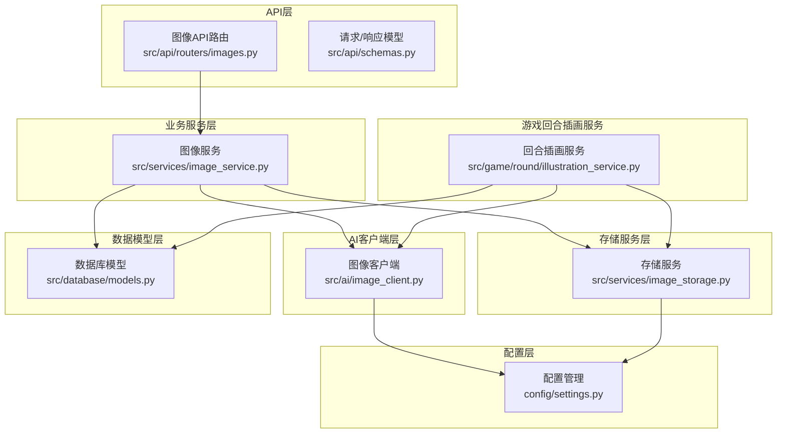
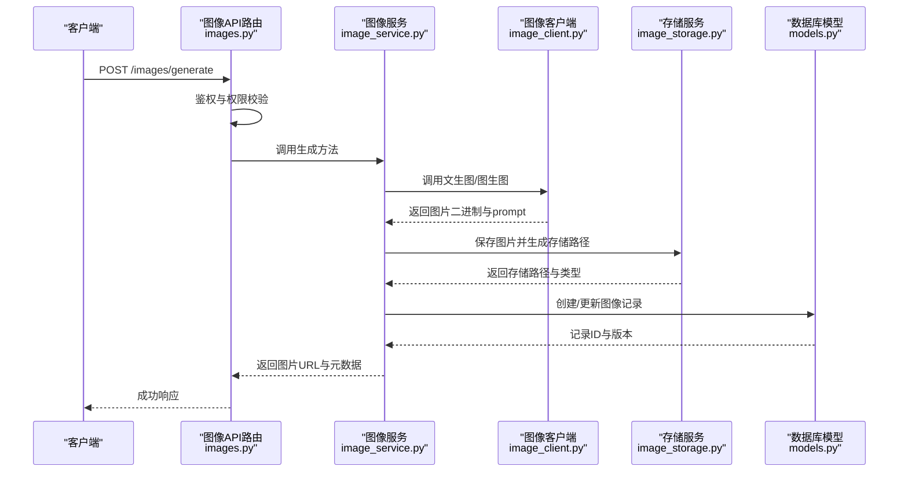
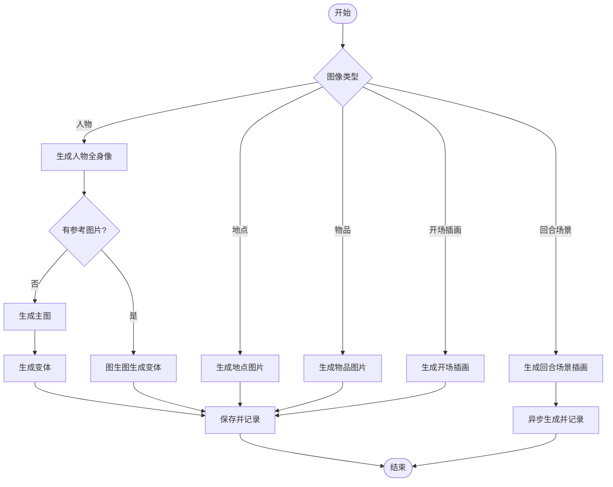
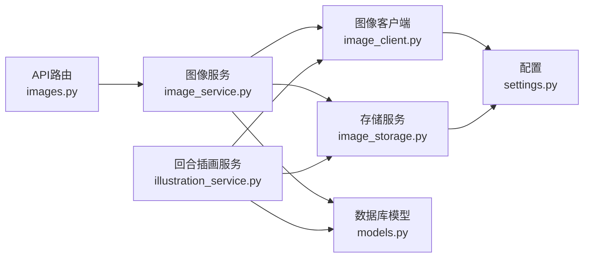

# 图像生成系统

<cite>
**本文档引用的文件**
- [src/services/image_service.py](file://src/services/image_service.py)
- [src/services/image_storage.py](file://src/services/image_storage.py)
- [src/ai/image_client.py](file://src/ai/image_client.py)
- [src/api/routers/images.py](file://src/api/routers/images.py)
- [src/database/models.py](file://src/database/models.py)
- [config/settings.py](file://config/settings.py)
- [src/game/round/illustration_service.py](file://src/game/round/illustration_service.py)
- [src/api/schemas.py](file://src/api/schemas.py)
- [src/ai/consistency_validator.py](file://src/ai/consistency_validator.py)
</cite>

## 目录
1. [简介](#简介)
2. [项目结构](#项目结构)
3. [核心组件](#核心组件)
4. [架构总览](#架构总览)
5. [详细组件分析](#详细组件分析)
6. [依赖关系分析](#依赖关系分析)
7. [性能考虑](#性能考虑)
8. [故障排除指南](#故障排除指南)
9. [结论](#结论)
10. [附录](#附录)

## 简介
本技术文档面向图像生成系统，全面阐述其架构设计、实现细节与最佳实践。系统围绕“图像生成服务”展开，涵盖与AI图像生成API的集成方式、图像存储管理机制（文件存储策略、命名规范、版本控制）、触发时机与处理流程（从文本描述到图像输出的完整过程）、元数据管理（生成时间、描述信息与关联关系）、缓存策略与性能优化、质量控制与一致性检查、API调用示例与错误处理策略、存储空间管理与清理策略，以及故障排除与监控告警机制。

## 项目结构
系统采用分层架构，主要模块包括：
- API层：提供REST接口，负责请求校验、鉴权与响应封装
- 业务服务层：图像生成调度与管理（ImageService）
- AI客户端层：图像生成与编辑的统一接口（ImageClient）
- 存储服务层：抽象化的本地/OSS存储（ImageStorageService）
- 数据模型层：图像与场景插画的数据库模型
- 配置层：统一的设置与环境变量管理
- 游戏回合插画服务：基于故事内容自动生成场景插画

**图表来源**
- [src/api/routers/images.py](file://src/api/routers/images.py#L1-L986)
- [src/services/image_service.py](file://src/services/image_service.py#L1-L1411)
- [src/ai/image_client.py](file://src/ai/image_client.py#L1-L1240)
- [src/services/image_storage.py](file://src/services/image_storage.py#L1-L375)
- [src/database/models.py](file://src/database/models.py#L1-L295)
- [config/settings.py](file://config/settings.py#L1-L168)
- [src/game/round/illustration_service.py](file://src/game/round/illustration_service.py#L1-L305)

**章节来源**
- [src/api/routers/images.py](file://src/api/routers/images.py#L1-L986)
- [src/services/image_service.py](file://src/services/image_service.py#L1-L1411)
- [src/ai/image_client.py](file://src/ai/image_client.py#L1-L1240)
- [src/services/image_storage.py](file://src/services/image_storage.py#L1-L375)
- [src/database/models.py](file://src/database/models.py#L1-L295)
- [config/settings.py](file://config/settings.py#L1-L168)
- [src/game/round/illustration_service.py](file://src/game/round/illustration_service.py#L1-L305)

## 核心组件
- 图像服务（ImageService）：协调图像生成、存储与数据库记录，提供人物、地点、物品、开场插画与回合场景插画的生成与重新生成能力，并维护版本控制与主图/变体关联。
- 图像客户端（ImageClient）：封装DashScope/Qwen系列图像生成与图生图接口，支持模型降级、速率限制处理与内容审核错误传播。
- 存储服务（ImageStorageService）：抽象本地与OSS存储，提供统一的保存、读取、URL生成与删除能力。
- 数据库模型（Image/SceneImage）：记录图像元数据、版本、主图关联与场景插画的阶段信息。
- API路由（images.py）：提供生成、重新生成、批量生成、文件获取与回合场景插画查询等接口。
- 配置（settings.py）：集中管理图像API密钥、基础URL、存储类型、模型降级列表与超时重试参数。
- 回合插画服务（RoundIllustrationService）：基于故事内容自动选择场景并生成插画，支持异步生成与参考图片复用。

**章节来源**
- [src/services/image_service.py](file://src/services/image_service.py#L30-L182)
- [src/ai/image_client.py](file://src/ai/image_client.py#L30-L800)
- [src/services/image_storage.py](file://src/services/image_storage.py#L23-L375)
- [src/database/models.py](file://src/database/models.py#L162-L234)
- [src/api/routers/images.py](file://src/api/routers/images.py#L104-L986)
- [config/settings.py](file://config/settings.py#L27-L168)
- [src/game/round/illustration_service.py](file://src/game/round/illustration_service.py#L21-L305)

## 架构总览
系统通过FastAPI路由接收请求，鉴权与权限校验后交由ImageService处理。ImageService调用ImageClient进行图像生成或图生图，随后通过ImageStorageService完成持久化与URL生成，并在数据库中创建/更新图像记录。对于回合场景插画，系统通过RoundIllustrationService异步生成并在数据库中记录场景信息。

**图表来源**
- [src/api/routers/images.py](file://src/api/routers/images.py#L104-L218)
- [src/services/image_service.py](file://src/services/image_service.py#L51-L182)
- [src/ai/image_client.py](file://src/ai/image_client.py#L160-L412)
- [src/services/image_storage.py](file://src/services/image_storage.py#L57-L92)
- [src/database/models.py](file://src/database/models.py#L162-L201)

**章节来源**
- [src/api/routers/images.py](file://src/api/routers/images.py#L104-L218)
- [src/services/image_service.py](file://src/services/image_service.py#L51-L182)
- [src/ai/image_client.py](file://src/ai/image_client.py#L160-L412)
- [src/services/image_storage.py](file://src/services/image_storage.py#L57-L92)
- [src/database/models.py](file://src/database/models.py#L162-L201)

## 详细组件分析

### 图像服务（ImageService）
职责与特性：
- 统一协调图像生成、存储与数据库记录
- 支持人物全身像（保证人物一致性）、地点、物品、开场插画与回合场景插画
- 版本控制与主图/变体关联，支持重新生成与完全重新生成
- 错误分类与传播（内容审核错误、生成错误、存储错误）

关键流程：
- 生成人物全身像：优先生成主图，再基于主图生成变体；或直接基于参考图片生成变体
- 重新生成：停用旧图片，使用当前图片作为参考，仅应用用户反馈
- 完全重新生成：使用DeepSeek优化prompt，抛弃历史修改
- 开场插画：分析故事选择场景，可选使用玩家形象作为参考
- 回合场景插画：异步生成，支持阶段区分（event/result）

**图表来源**
- [src/services/image_service.py](file://src/services/image_service.py#L51-L182)
- [src/services/image_service.py](file://src/services/image_service.py#L183-L365)
- [src/services/image_service.py](file://src/services/image_service.py#L366-L528)
- [src/services/image_service.py](file://src/services/image_service.py#L632-L761)
- [src/game/round/illustration_service.py](file://src/game/round/illustration_service.py#L40-L165)

**章节来源**
- [src/services/image_service.py](file://src/services/image_service.py#L51-L182)
- [src/services/image_service.py](file://src/services/image_service.py#L183-L365)
- [src/services/image_service.py](file://src/services/image_service.py#L366-L528)
- [src/services/image_service.py](file://src/services/image_service.py#L632-L761)
- [src/game/round/illustration_service.py](file://src/game/round/illustration_service.py#L40-L165)

### 图像客户端（ImageClient）
职责与特性：
- 支持DashScope/Qwen图像生成与图生图接口
- 模型降级与速率限制处理（指数退避与模型切换）
- 内容审核错误透传（ContentInspectionError）
- 统一的prompt构建策略（人物全身像、场景、物品、故事场景）

关键能力：
- 文生图：generate_image/generate_image_with_url
- 图生图：edit_image（基于参考图片生成）
- Prompt优化：generate_image_prompt_with_deepseek（DeepSeek）
- 尺寸与负向提示词管理

**章节来源**
- [src/ai/image_client.py](file://src/ai/image_client.py#L30-L800)
- [src/ai/image_client.py](file://src/ai/image_client.py#L800-L1240)

### 存储服务（ImageStorageService）
职责与特性：
- 支持本地文件系统与阿里云OSS两种存储
- 统一的文件命名策略（game_id/image_type/timestamp_name_unique.ext）
- URL生成与二进制数据读取
- 删除与存在性检查
- 哈希计算用于去重或一致性校验

命名规范与版本控制：
- 文件名包含时间戳、实体名与UUID，确保唯一性
- 数据库存储路径与类型，便于跨存储迁移
- 版本字段与主图/变体关联用于历史追踪

**章节来源**
- [src/services/image_storage.py](file://src/services/image_storage.py#L23-L375)
- [src/database/models.py](file://src/database/models.py#L162-L201)

### 数据库模型（Image/SceneImage）
职责与特性：
- Image：记录图像类型、实体标识、prompt、存储路径与类型、元数据、版本、主图/变体关系、创建时间
- SceneImage：记录回合场景插画的场景描述、最终prompt、存储路径与类型、引用图片ID列表、重要性评分与阶段（event/result）

索引与查询：
- 图像：按game_id、image_type、entity_name建立复合索引
- 场景插画：按game_id、round_number建立索引

**章节来源**
- [src/database/models.py](file://src/database/models.py#L162-L234)

### API路由（images.py）
职责与特性：
- 生成图片：支持人物、地点、物品三类
- 重新生成与完全重新生成：支持用户反馈与DeepSeek优化
- 批量生成关键人物画像：从角色设定中提取关键人物并生成
- 文件获取：直接返回图片二进制，支持缓存头
- 回合场景插画：按轮次与阶段查询，支持异步生成

鉴权与权限：
- 必须登录用户
- 游戏归属权校验（GameOwnership）
- 图片归属权校验（通过Game关联）

**章节来源**
- [src/api/routers/images.py](file://src/api/routers/images.py#L104-L986)
- [src/api/schemas.py](file://src/api/schemas.py#L179-L333)

### 回合插画服务（RoundIllustrationService）
职责与特性：
- 基于故事内容选择场景，支持异步生成
- 自动复用玩家主形象与涉及人物的既有图片作为参考
- 生成场景插画并记录到数据库，支持阶段区分（event/result）

**章节来源**
- [src/game/round/illustration_service.py](file://src/game/round/illustration_service.py#L21-L305)

## 依赖关系分析
组件耦合与协作：
- API路由依赖图像服务进行业务处理
- 图像服务依赖图像客户端与存储服务
- 图像客户端依赖配置（settings）与网络请求
- 存储服务依赖配置（settings）与文件系统/OSS SDK
- 数据库模型为图像与场景插画提供持久化支撑
- 回合插画服务与图像服务协同，共同完成场景插画生成

**图表来源**
- [src/api/routers/images.py](file://src/api/routers/images.py#L1-L986)
- [src/services/image_service.py](file://src/services/image_service.py#L1-L1411)
- [src/ai/image_client.py](file://src/ai/image_client.py#L1-L1240)
- [src/services/image_storage.py](file://src/services/image_storage.py#L1-L375)
- [src/database/models.py](file://src/database/models.py#L1-L295)
- [config/settings.py](file://config/settings.py#L1-L168)
- [src/game/round/illustration_service.py](file://src/game/round/illustration_service.py#L1-L305)

**章节来源**
- [src/api/routers/images.py](file://src/api/routers/images.py#L1-L986)
- [src/services/image_service.py](file://src/services/image_service.py#L1-L1411)
- [src/ai/image_client.py](file://src/ai/image_client.py#L1-L1240)
- [src/services/image_storage.py](file://src/services/image_storage.py#L1-L375)
- [src/database/models.py](file://src/database/models.py#L1-L295)
- [config/settings.py](file://config/settings.py#L1-L168)
- [src/game/round/illustration_service.py](file://src/game/round/illustration_service.py#L1-L305)

## 性能考虑
- 模型降级与速率限制：ImageClient内置模型降级与指数退避，降低API限流风险
- 异步生成：回合插画服务在后台线程生成，不阻塞主流程
- 缓存策略：图片文件接口设置Cache-Control头，提升前端加载性能
- 批量生成延迟：批量生成关键人物画像时增加延迟，避免API限流
- 存储优化：统一命名与版本控制，便于清理与去重

**章节来源**
- [src/ai/image_client.py](file://src/ai/image_client.py#L190-L260)
- [src/game/round/illustration_service.py](file://src/game/round/illustration_service.py#L40-L75)
- [src/api/routers/images.py](file://src/api/routers/images.py#L662-L712)
- [src/api/routers/images.py](file://src/api/routers/images.py#L289-L293)

## 故障排除指南
常见错误与处理：
- 内容审核错误（ContentInspectionError）：前端友好提示，引导用户调整描述
- 生成失败（ImageGenerationError）：重试与降级策略，必要时提示稍后重试
- 存储失败（ImageStorageError）：检查存储配置与权限，确认OSS或本地目录可用
- 权限不足：确保用户登录且具备游戏归属权
- 429速率限制：自动等待或切换模型，批量生成时增加延迟

监控与告警建议：
- 记录API调用日志与错误统计
- 监控图像生成耗时与成功率
- 监控存储空间使用率与清理策略执行情况
- 监控内容审核触发频率与失败原因

**章节来源**
- [src/api/routers/images.py](file://src/api/routers/images.py#L204-L218)
- [src/ai/image_client.py](file://src/ai/image_client.py#L235-L259)
- [src/services/image_storage.py](file://src/services/image_storage.py#L18-L21)
- [src/api/routers/images.py](file://src/api/routers/images.py#L42-L73)

## 结论
图像生成系统通过清晰的分层架构与完善的错误处理机制，实现了从文本描述到图像输出的高效闭环。系统支持多种图像类型与生成策略，具备版本控制、主图/变体关联与异步生成能力。通过模型降级、速率限制处理与缓存策略，系统在性能与稳定性方面表现良好。建议在生产环境中配合监控告警与定期清理策略，确保系统的长期稳定运行。

## 附录

### API调用示例与错误处理策略
- 生成人物图片
  - 请求：POST /images/generate
  - 参数：game_id、image_type=character、entity_name、description、era、entity_key、extra_context、feedback
  - 成功：返回图片URL与元数据
  - 错误：内容审核错误返回400，生成/存储错误返回500
- 重新生成图片
  - 请求：POST /images/regenerate
  - 参数：image_id、feedback、new_description
  - 行为：基于当前图片作为参考，仅应用用户反馈
- 完全重新生成图片
  - 请求：POST /images/regenerate-fresh
  - 参数：image_id、use_deepseek_prompt
  - 行为：使用DeepSeek优化prompt，抛弃历史修改
- 批量生成关键人物画像
  - 请求：POST /images/batch-characters
  - 参数：game_id、character_settings、language
  - 行为：从角色设定提取关键人物并生成
- 获取图片文件
  - 请求：GET /images/file/{game_id}/{image_type}/{filename}
  - 行为：直接返回图片二进制，带缓存头

**章节来源**
- [src/api/routers/images.py](file://src/api/routers/images.py#L104-L986)
- [src/api/schemas.py](file://src/api/schemas.py#L179-L333)

### 图像元数据管理
- 图像记录：image_type、entity_name、entity_key、prompt_text、storage_path、storage_type、metadata_json、version、is_active、is_primary、primary_image_id、created_at
- 场景插画记录：scene_description、final_prompt、storage_path、storage_type、referenced_images、importance_score、stage、created_at

**章节来源**
- [src/database/models.py](file://src/database/models.py#L162-L234)

### 质量控制与一致性检查
- 内容审核：ImageClient在生成过程中进行内容审核，错误透传至服务层
- 一致性校验：可结合故事一致性校验器对生成内容进行逻辑一致性评估（可选）

**章节来源**
- [src/ai/image_client.py](file://src/ai/image_client.py#L23-L29)
- [src/ai/consistency_validator.py](file://src/ai/consistency_validator.py#L42-L239)

### 存储空间管理与清理策略
- 存储类型：本地文件系统或阿里云OSS
- 清理策略：定期扫描数据库中不再活跃的图像记录，删除对应的存储文件
- 建议：监控存储空间使用率，设置阈值告警并自动清理历史版本

**章节来源**
- [src/services/image_storage.py](file://src/services/image_storage.py#L304-L339)
- [config/settings.py](file://config/settings.py#L46-L55)