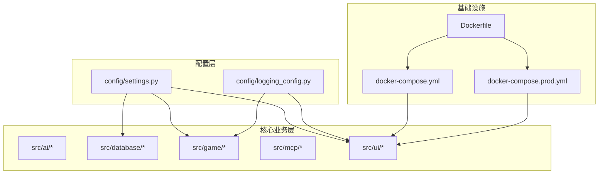
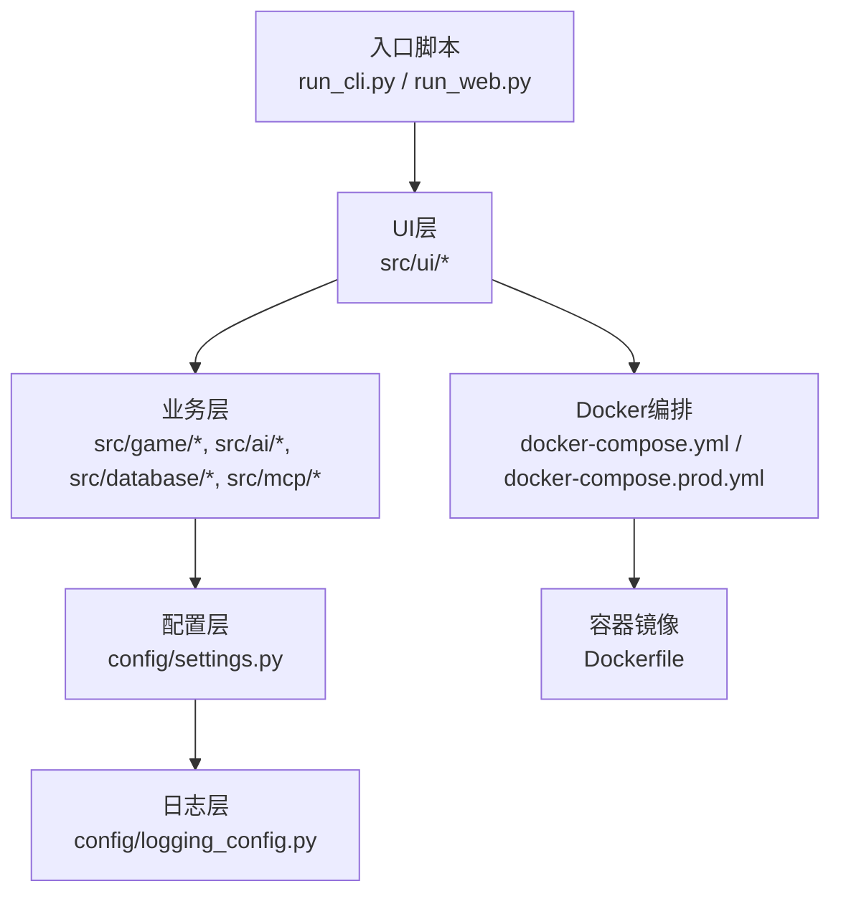
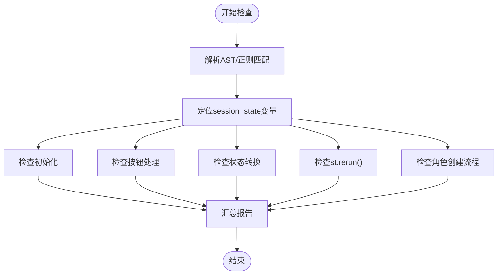
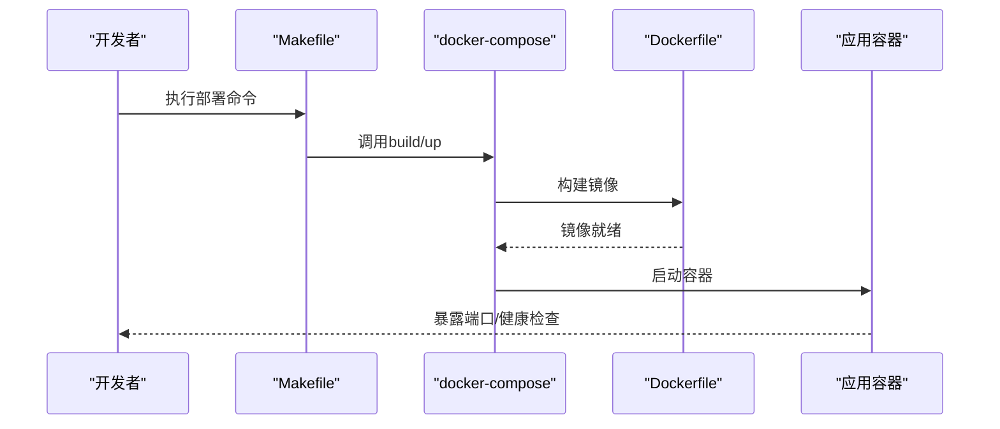
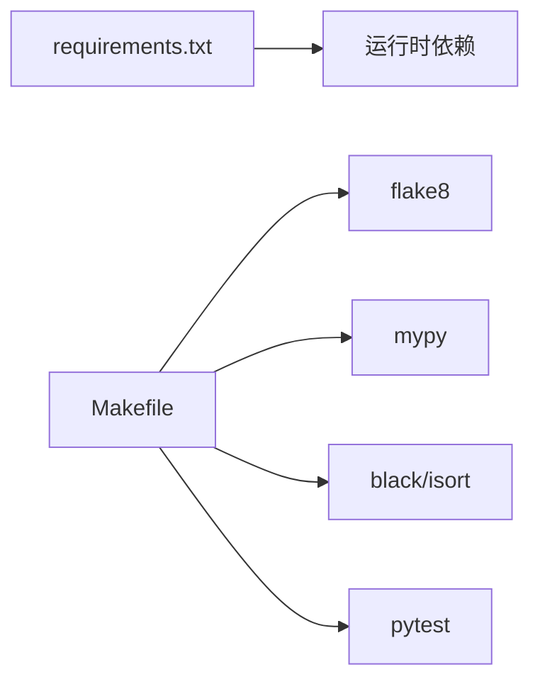

# 开发指南

<cite>
**本文引用的文件**
- [README.md](file://README.md)
- [DEPLOYMENT.md](file://DEPLOYMENT.md)
- [Makefile](file://Makefile)
- [requirements.txt](file://requirements.txt)
- [pytest.ini](file://pytest.ini)
- [.env.example](file://.env.example)
- [config/settings.py](file://config/settings.py)
- [config/logging_config.py](file://config/logging_config.py)
- [check_flow.py](file://check_flow.py)
- [run_cli.py](file://run_cli.py)
- [run_web.py](file://run_web.py)
- [Dockerfile](file://Dockerfile)
- [docker-compose.yml](file://docker-compose.yml)
- [docker-compose.prod.yml](file://docker-compose.prod.yml)
- [src/ui/streamlit_app.py](file://src/ui/streamlit_app.py)
- [src/ui/character_creation_ui.py](file://src/ui/character_creation_ui.py)
</cite>

## 目录
1. [简介](#简介)
2. [项目结构](#项目结构)
3. [核心组件](#核心组件)
4. [架构总览](#架构总览)
5. [详细组件分析](#详细组件分析)
6. [依赖关系分析](#依赖关系分析)
7. [性能考虑](#性能考虑)
8. [故障排查指南](#故障排查指南)
9. [结论](#结论)
10. [附录](#附录)

## 简介
本指南面向贡献者与维护者，提供从开发、测试、审查到发布的全流程规范，涵盖代码规范、分支与提交规范、开发与发布流程、问题跟踪与版本规划、调试与性能优化、内部工具使用与架构演进建议，以及新功能开发与现有代码修改的实践方法。

## 项目结构
项目采用按功能分层的组织方式：
- config：配置与日志模块，集中管理环境变量与日志策略
- src：核心业务代码，按领域拆分（ai、database、game、mcp、ui）
- tests：单元与集成测试
- data：预设事件、缓存与数据库文件
- 根目录：部署与开发脚本（Makefile、Dockerfile、docker-compose）

图表来源
- [config/settings.py](file://config/settings.py#L1-L100)
- [config/logging_config.py](file://config/logging_config.py#L1-L78)
- [Dockerfile](file://Dockerfile#L1-L48)
- [docker-compose.yml](file://docker-compose.yml#L1-L65)
- [docker-compose.prod.yml](file://docker-compose.prod.yml#L1-L43)

章节来源
- [README.md](file://README.md#L61-L73)

## 核心组件
- 配置与常量：集中于配置模块，统一加载环境变量、设置默认值、校验必要参数，并提供数据库连接策略与语言设置
- 日志：生产环境日志配置，支持滚动文件与第三方库日志级别控制
- 流程检查：对UI状态流进行静态检查，识别初始化缺失、按钮处理不当、状态变更未触发刷新等问题
- 部署与运行：Docker镜像与编排，支持开发与生产两种模式；提供一键式命令与入口脚本

章节来源
- [config/settings.py](file://config/settings.py#L30-L100)
- [config/logging_config.py](file://config/logging_config.py#L12-L78)
- [check_flow.py](file://check_flow.py#L12-L37)
- [Dockerfile](file://Dockerfile#L1-L48)
- [docker-compose.yml](file://docker-compose.yml#L1-L65)
- [docker-compose.prod.yml](file://docker-compose.prod.yml#L1-L43)

## 架构总览
应用采用“配置/日志—业务—UI/入口—容器化部署”的分层架构。配置模块为各子系统提供统一的运行参数；业务模块实现AI事件生成、数据库交互、游戏循环与UI逻辑；入口脚本与Docker编排负责运行时环境与对外暴露。

图表来源
- [run_cli.py](file://run_cli.py#L1-L7)
- [run_web.py](file://run_web.py#L1-L11)
- [src/ui/streamlit_app.py](file://src/ui/streamlit_app.py)
- [config/settings.py](file://config/settings.py#L1-L100)
- [config/logging_config.py](file://config/logging_config.py#L1-L78)
- [Dockerfile](file://Dockerfile#L1-L48)
- [docker-compose.yml](file://docker-compose.yml#L1-L65)
- [docker-compose.prod.yml](file://docker-compose.prod.yml#L1-L43)

## 详细组件分析

### 配置与常量（config/settings.py）
- 职责：加载环境变量、提供游戏常量、数据库连接策略、语言与缓存开关
- 关键点：
  - 优先使用云数据库URL，否则回退到本地SQLite路径
  - 提供默认语言、事件缓存开关、调试模式等
  - 校验必要参数（如OpenAI密钥）
- 使用建议：
  - 新增配置项需在类中声明默认值与类型提示
  - 对外仅通过单例实例访问，避免重复加载

章节来源
- [config/settings.py](file://config/settings.py#L30-L100)

### 日志配置（config/logging_config.py）
- 职责：统一日志格式、输出到控制台与轮转文件、屏蔽第三方库噪音
- 关键点：
  - 生产环境通过环境变量自动启用文件日志
  - 控制台与文件处理器共存，便于本地与线上调试
- 使用建议：
  - 在业务模块中通过标准库logger获取命名空间日志
  - 避免在日志中泄露敏感信息

章节来源
- [config/logging_config.py](file://config/logging_config.py#L12-L78)

### 流程检查工具（check_flow.py）
- 职责：对Streamlit UI的状态流进行静态分析，识别常见错误
- 检查范围：
  - session_state变量初始化完整性
  - 按钮点击是否正确处理状态
  - 状态变更后是否调用刷新
  - 角色创建流程是否完整
- 输出：按严重程度分类的报告，便于修复

图表来源
- [check_flow.py](file://check_flow.py#L12-L37)

章节来源
- [check_flow.py](file://check_flow.py#L22-L37)

### 入口与运行（run_cli.py / run_web.py）
- CLI入口：直接调用CLI主函数
- Web入口：通过子进程启动Streamlit，允许局域网访问
- 建议：保持入口脚本简洁，具体逻辑放入对应模块

章节来源
- [run_cli.py](file://run_cli.py#L1-L7)
- [run_web.py](file://run_web.py#L1-L11)

### 容器化与部署（Dockerfile / docker-compose）
- Dockerfile：固定Python基础镜像、安装系统与Python依赖、健康检查、CMD启动
- docker-compose：开发环境编排，暴露端口、挂载数据卷、资源限制
- docker-compose.prod：生产环境扩展，禁用CORS、启用XSRF保护、Nginx反代、日志滚动

图表来源
- [Makefile](file://Makefile#L49-L82)
- [docker-compose.yml](file://docker-compose.yml#L1-L65)
- [Dockerfile](file://Dockerfile#L1-L48)

章节来源
- [Dockerfile](file://Dockerfile#L1-L48)
- [docker-compose.yml](file://docker-compose.yml#L1-L65)
- [docker-compose.prod.yml](file://docker-compose.prod.yml#L1-L43)

## 依赖关系分析
- 运行时依赖：OpenAI SDK、HTTP客户端、Streamlit、dotenv、Pydantic、SQLAlchemy、PostgreSQL驱动、pytest
- 开发工具链：Black格式化、isort导入排序、flake8风格检查、mypy类型检查、pytest测试

图表来源
- [requirements.txt](file://requirements.txt#L1-L9)
- [Makefile](file://Makefile#L32-L46)
- [pytest.ini](file://pytest.ini#L1-L7)

章节来源
- [requirements.txt](file://requirements.txt#L1-L9)
- [pytest.ini](file://pytest.ini#L1-L7)
- [Makefile](file://Makefile#L32-L46)

## 性能考虑
- 数据库：生产环境建议使用PostgreSQL替代SQLite，提升并发与稳定性
- 缓存：启用事件缓存可显著降低AI调用频率
- 静态资源：结合Nginx与CDN优化前端资源加载
- 资源限制：通过Docker部署块限制作业容器CPU与内存
- 日志：生产环境使用滚动文件，避免磁盘膨胀

章节来源
- [DEPLOYMENT.md](file://DEPLOYMENT.md#L310-L317)
- [config/settings.py](file://config/settings.py#L68-L82)
- [docker-compose.yml](file://docker-compose.yml#L34-L43)

## 故障排查指南
- 日志查看：开发环境使用Compose日志流；生产环境检查容器日志滚动配置
- 健康检查：通过健康端点确认应用与Nginx状态
- 环境变量：确认API密钥、数据库URL、语言与缓存开关
- 端口冲突：确保8501端口未被占用
- 备份与恢复：定期备份数据目录与数据库

章节来源
- [DEPLOYMENT.md](file://DEPLOYMENT.md#L203-L234)
- [DEPLOYMENT.md](file://DEPLOYMENT.md#L237-L309)
- [.env.example](file://.env.example#L1-L18)

## 结论
本指南提供了从开发到部署的一体化规范与工具链，建议团队在日常协作中严格遵循：统一配置、统一日志、统一格式与类型检查、统一测试与覆盖率、统一容器化与健康检查。通过流程检查工具与自动化脚本，持续提升代码质量与交付效率。

## 附录

### 代码规范与工具链
- 格式化：使用Black，行宽100
- 导入排序：使用isort
- 风格检查：flake8，忽略长行警告
- 类型检查：mypy，忽略缺失导入
- 覆盖率：pytest覆盖报告HTML与终端

章节来源
- [Makefile](file://Makefile#L32-L46)

### 分支与提交规范
- 分支策略：采用功能分支，主分支仅合并稳定版本
- 提交信息：简明描述、说明动机与影响，必要时关联Issue
- 合并与审查：通过Pull Request进行代码审查，至少一名维护者批准

（本节为通用实践建议，无需特定文件引用）

### 开发工作流程
- 新功能：基于主分支创建功能分支，完成开发与测试，提交PR
- 修复：针对Issue创建修复分支，附带最小复现与测试
- 本地验证：运行质量检查与测试，确保无回归

（本节为通用流程建议，无需特定文件引用）

### 代码审查流程
- 范围明确：PR聚焦单一目标，避免无关改动
- 质量门槛：通过格式、风格、类型与测试检查
- 回归测试：新增/修改功能需补充或更新测试
- 文档同步：涉及用户行为变更需更新README或相关文档

（本节为通用流程建议，无需特定文件引用）

### 发布流程
- 版本标记：语义化版本，变更日志清晰
- 构建验证：Docker镜像构建与健康检查
- 环境切换：生产环境使用Compose扩展配置
- 回滚预案：保留上一版本镜像与数据快照

章节来源
- [docker-compose.prod.yml](file://docker-compose.prod.yml#L1-L43)

### 问题跟踪、需求与版本规划
- Issue模板：缺陷、增强、文档、安全四类模板
- 需求管理：将需求转化为可测试的验收条件
- 版本规划：按迭代周期拆解任务，优先级与风险评估

（本节为通用方法建议，无需特定文件引用）

### 调试技巧与性能分析
- 日志：分级日志、上下文ID、错误堆栈
- Profiling：对热点路径进行性能剖析
- 并发：关注数据库与AI调用的并发限制
- 缓存：合理利用事件缓存与会话缓存

章节来源
- [config/logging_config.py](file://config/logging_config.py#L12-L78)
- [config/settings.py](file://config/settings.py#L38-L41)

### 内部开发工具与架构演进
- 工具：Makefile封装常用任务；流程检查工具保障UI状态流正确性
- 架构演进：模块边界清晰、配置与日志集中化、容器化标准化

章节来源
- [Makefile](file://Makefile#L1-L93)
- [check_flow.py](file://check_flow.py#L12-L37)

### 新功能开发指导与现有代码修改规范
- 新功能：先设计接口与测试，再实现业务逻辑，最后完善配置与日志
- 现有代码：保持向后兼容，逐步替换硬编码为配置项，增加必要的日志与错误处理

（本节为通用规范建议，无需特定文件引用）