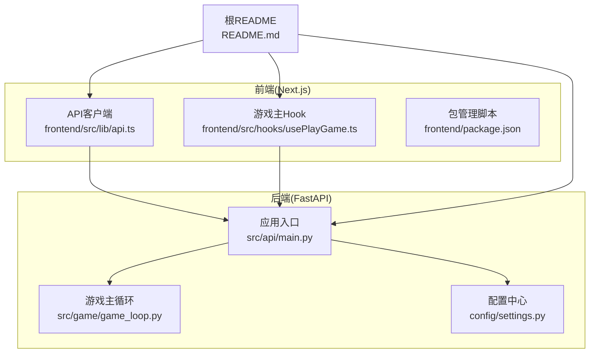
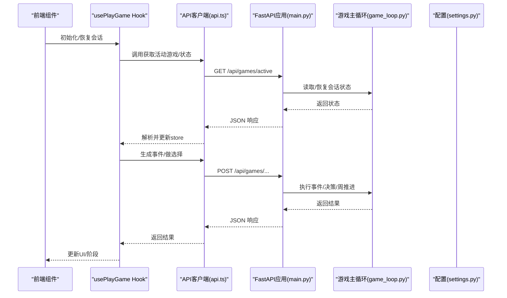
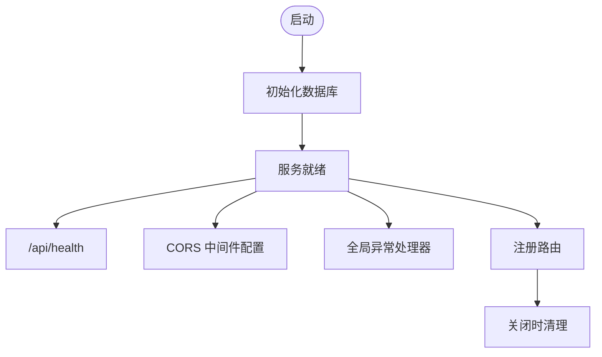
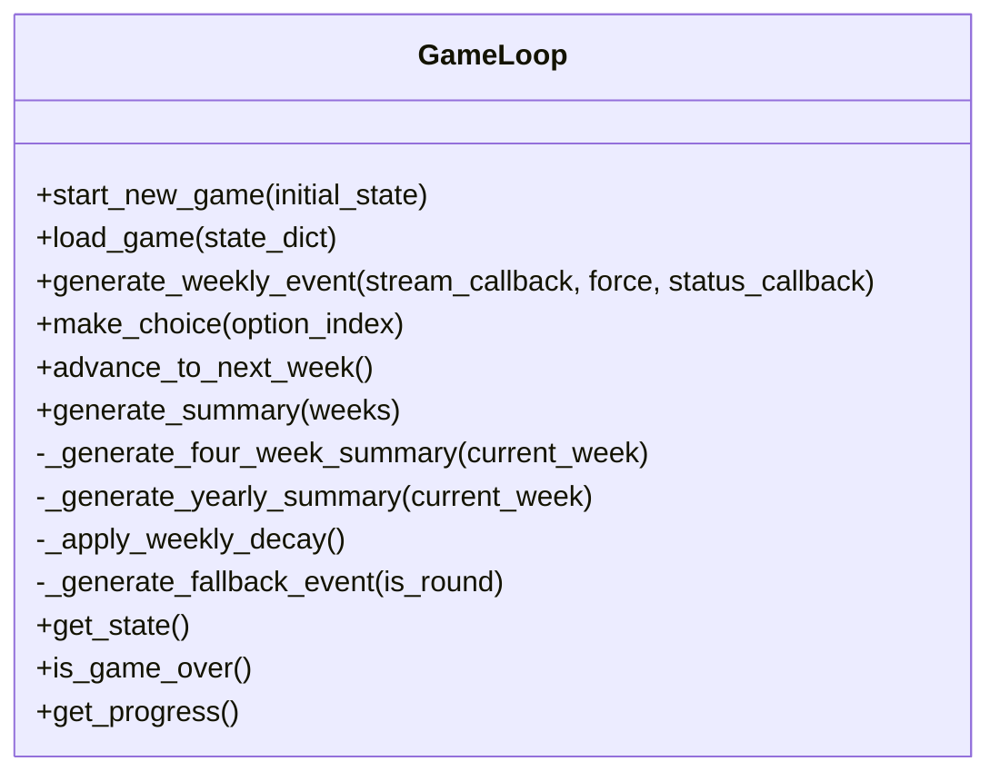
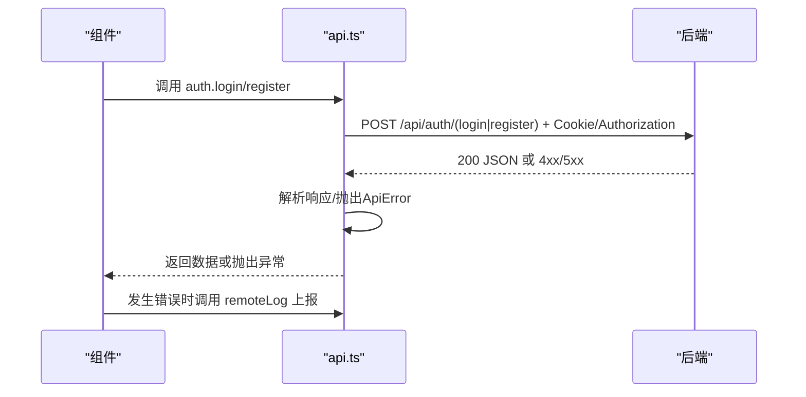
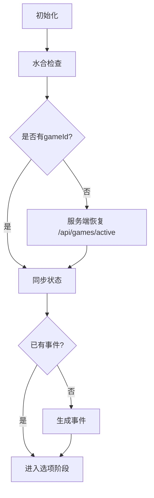
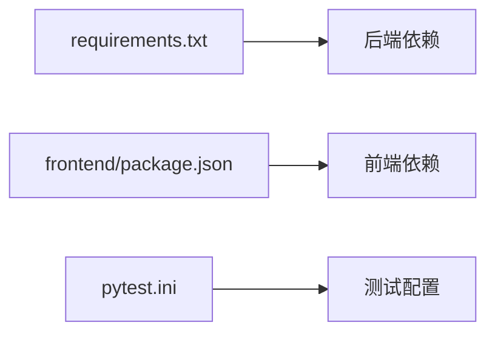

# 代码规范与最佳实践

<cite>
**本文引用的文件**
- [README.md](file://README.md)
- [frontend/README.md](file://frontend/README.md)
- [requirements.txt](file://requirements.txt)
- [pytest.ini](file://pytest.ini)
- [frontend/package.json](file://frontend/package.json)
- [src/api/main.py](file://src/api/main.py)
- [src/game/game_loop.py](file://src/game/game_loop.py)
- [frontend/src/lib/api.ts](file://frontend/src/lib/api.ts)
- [frontend/src/hooks/usePlayGame.ts](file://frontend/src/hooks/usePlayGame.ts)
- [config/settings.py](file://config/settings.py)
</cite>

## 目录
1. [引言](#引言)
2. [项目结构](#项目结构)
3. [核心组件](#核心组件)
4. [架构总览](#架构总览)
5. [详细组件分析](#详细组件分析)
6. [依赖关系分析](#依赖关系分析)
7. [性能考虑](#性能考虑)
8. [故障排查指南](#故障排查指南)
9. [结论](#结论)
10. [附录](#附录)

## 引言
本文件为“人生草稿本”项目的代码规范与最佳实践文档，面向后端（Python/FastAPI）、前端（TypeScript/Next.js）与跨端协作的工程实践，覆盖以下方面：
- Python 编码标准（PEP8、命名约定、格式化、注释）
- 前端开发规范（TypeScript、React 组件、文件命名与组织）
- 文档编写要求（API 文档、README 规范、注释规范）
- 代码审查标准与流程（PR 规范、审查清单、合并要求）
- 开发工具配置建议（VS Code、ESLint、Black 等）
- 错误处理与异常管理最佳实践
- 具体示例与反例路径指引，便于对照执行

## 项目结构
项目采用前后端分离架构，后端基于 FastAPI，前端基于 Next.js App Router，核心模块分布如下：
- 后端
  - 应用入口与中间件：src/api/main.py
  - 游戏主循环与业务逻辑：src/game/game_loop.py
  - 配置中心：config/settings.py
- 前端
  - API 客户端封装与认证策略：frontend/src/lib/api.ts
  - 游戏主流程钩子组合：frontend/src/hooks/usePlayGame.ts
  - 包管理与脚本：frontend/package.json
- 测试与依赖
  - 后端依赖：requirements.txt
  - 测试配置：pytest.ini
  - 项目根 README：README.md

**图示来源**
- [src/api/main.py](file://src/api/main.py#L1-L134)
- [src/game/game_loop.py](file://src/game/game_loop.py#L1-L592)
- [config/settings.py](file://config/settings.py#L1-L168)
- [frontend/src/lib/api.ts](file://frontend/src/lib/api.ts#L1-L564)
- [frontend/src/hooks/usePlayGame.ts](file://frontend/src/hooks/usePlayGame.ts#L1-L455)
- [README.md](file://README.md#L1-L98)

**章节来源**
- [README.md](file://README.md#L74-L87)
- [frontend/README.md](file://frontend/README.md#L1-L37)

## 核心组件
- 后端应用入口与中间件
  - 生命周期管理、CORS 配置、全局异常处理、健康检查、客户端日志收集等
- 游戏主循环
  - 事件生成、决策处理、周推进、里程碑与总结生成、资源衰减、回退事件等
- 配置中心
  - API 密钥、模型、数据库、图像存储、语言与常量等集中配置
- 前端 API 客户端
  - 双重认证策略（Cookie 优先、Authorization 备份）、统一错误处理、远程日志上报
- 前端游戏主 Hook
  - 钩子组合模式（阶段管理、事件生成、选择处理、历史查看、会话恢复）

**章节来源**
- [src/api/main.py](file://src/api/main.py#L1-L134)
- [src/game/game_loop.py](file://src/game/game_loop.py#L1-L592)
- [config/settings.py](file://config/settings.py#L1-L168)
- [frontend/src/lib/api.ts](file://frontend/src/lib/api.ts#L1-L564)
- [frontend/src/hooks/usePlayGame.ts](file://frontend/src/hooks/usePlayGame.ts#L1-L455)

## 架构总览
后端通过 FastAPI 提供 REST 接口，前端通过 Next.js 以 App Router 方式消费接口；两者通过统一的 API 客户端进行交互，并在认证上采用 Cookie 优先、Authorization 备份的双轨策略。

**图示来源**
- [frontend/src/hooks/usePlayGame.ts](file://frontend/src/hooks/usePlayGame.ts#L1-L455)
- [frontend/src/lib/api.ts](file://frontend/src/lib/api.ts#L1-L564)
- [src/api/main.py](file://src/api/main.py#L1-L134)
- [src/game/game_loop.py](file://src/game/game_loop.py#L1-L592)
- [config/settings.py](file://config/settings.py#L1-L168)

## 详细组件分析

### 后端应用入口与中间件（FastAPI）
- 生命周期管理：启动时初始化数据库，关闭时清理
- CORS：明确白名单，支持 Cookie 认证与局域网访问
- 全局异常处理：统一返回 500 与日志记录
- 健康检查：返回会话计数
- 客户端日志收集：接收前端上报的错误上下文

**图示来源**
- [src/api/main.py](file://src/api/main.py#L24-L100)

**章节来源**
- [src/api/main.py](file://src/api/main.py#L1-L134)

### 游戏主循环（GameLoop）
- 职责拆分：事件生成、决策处理、周推进、里程碑与年度总结、资源衰减、回退事件
- 并发与超时：生成过程带超时保护，防止卡死
- 回退策略：AI 失败时生成简单事件，保证可玩性
- 状态持久化：current_event_data 保存当前事件，便于恢复

**图示来源**
- [src/game/game_loop.py](file://src/game/game_loop.py#L25-L592)

**章节来源**
- [src/game/game_loop.py](file://src/game/game_loop.py#L1-L592)

### 配置中心（Settings）
- 集中式配置：OpenAI/图像/场景分析、数据库、语言、常量、缓存开关
- 默认值与降级：图像模型列表、编辑模型列表、数据库优先级
- 运行时校验：缺失密钥时报错
- 存储目录保障：本地图片目录存在性

**章节来源**
- [config/settings.py](file://config/settings.py#L1-L168)

### 前端 API 客户端（api.ts）
- 双重认证：Cookie 优先（credentials: 'include'），localStorage Token 备份
- 统一错误处理：捕获网络异常与非 2xx 响应，构造 ApiError
- 远程日志：上报错误上下文到后端 /api/client-log
- 类型安全：导出请求/响应类型，便于调用方约束

**图示来源**
- [frontend/src/lib/api.ts](file://frontend/src/lib/api.ts#L16-L124)

**章节来源**
- [frontend/src/lib/api.ts](file://frontend/src/lib/api.ts#L1-L564)

### 前端游戏主 Hook（usePlayGame）
- 钩子组合：阶段管理、事件生成、选择处理、历史查看、会话恢复
- 会话恢复：无本地 gameId 时尝试服务端恢复
- 插画自动生成：根据阶段与内容自动触发场景插画生成
- 状态同步：与 store 同步，控制 UI 阶段与展示

**图示来源**
- [frontend/src/hooks/usePlayGame.ts](file://frontend/src/hooks/usePlayGame.ts#L200-L316)

**章节来源**
- [frontend/src/hooks/usePlayGame.ts](file://frontend/src/hooks/usePlayGame.ts#L1-L455)

## 依赖关系分析
- 后端依赖
  - FastAPI、Pydantic、SQLAlchemy、pytest、httpx、python-dotenv 等
- 前端依赖
  - Next.js、React、Zustand、Radix UI、TailwindCSS、Jest、Playwright、ESLint 等
- 测试配置
  - pytest.ini 指定测试目录与命名规则

**图示来源**
- [requirements.txt](file://requirements.txt#L1-L12)
- [frontend/package.json](file://frontend/package.json#L1-L49)
- [pytest.ini](file://pytest.ini#L1-L8)

**章节来源**
- [requirements.txt](file://requirements.txt#L1-L12)
- [frontend/package.json](file://frontend/package.json#L1-L49)
- [pytest.ini](file://pytest.ini#L1-L8)

## 性能考虑
- 事件生成超时保护：GameLoop 对 AI 生成设置超时，避免阻塞
- 资源衰减：低能量/低心情时自动衰减，模拟真实压力
- 插画按需生成：前端在阶段切换时检查并自动生成，减少冷启动成本
- 数据库连接策略：优先 DATABASE_URL（云），回退本地 SQLite，降低部署复杂度

**章节来源**
- [src/game/game_loop.py](file://src/game/game_loop.py#L445-L457)
- [frontend/src/hooks/usePlayGame.ts](file://frontend/src/hooks/usePlayGame.ts#L350-L375)
- [config/settings.py](file://config/settings.py#L107-L141)

## 故障排查指南
- 后端
  - CORS 问题：确认 allow_origins 明确列出，allow_credentials=True
  - 全局异常：统一 500 返回与日志记录，检查 /api/health 与会话计数
  - 客户端日志：通过 /api/client-log 查看前端错误上下文
- 前端
  - 认证失败：检查 Cookie 是否可用与 localStorage token 是否存在
  - 网络错误：ApiError 包含状态与数据，结合 remoteLog 定位
  - 会话恢复：usePlayGame 在无本地 gameId 时尝试服务端恢复
- 配置
  - 缺失 OPENAI_API_KEY：Settings.validate 抛出异常，需在 .env 或环境变量中配置

**章节来源**
- [src/api/main.py](file://src/api/main.py#L46-L100)
- [frontend/src/lib/api.ts](file://frontend/src/lib/api.ts#L94-L124)
- [frontend/src/hooks/usePlayGame.ts](file://frontend/src/hooks/usePlayGame.ts#L200-L270)
- [config/settings.py](file://config/settings.py#L143-L149)

## 结论
本规范文档围绕“人生草稿本”的实际代码实现，给出了后端与前端的编码标准、组件职责边界、错误处理与性能优化建议，并提供了可操作的工具配置与审查流程建议。建议团队在 PR 中严格遵循规范，确保代码一致性与可维护性。

## 附录

### Python 编码标准与最佳实践
- 命名约定
  - 模块与包：小写、下划线分隔
  - 类：PascalCase
  - 函数/方法：snake_case
  - 常量：UPPER_CASE
  - 私有成员：_leading_underscore
- 代码格式化
  - 使用 Black 进行统一格式化，建议在 CI 中强制执行
  - 行宽不超过 88 字符（与项目 ESLint 配置一致）
- 注释规范
  - 模块顶部包含简要描述与用途
  - 类与公共方法需提供 docstring，说明参数、返回值与异常
  - 关键逻辑处添加简明注释，解释“为什么”而非“是什么”
- 示例与反例路径
  - 正例：[src/api/main.py](file://src/api/main.py#L1-L134) 的模块注释与函数注释
  - 反例：缺少 docstring 的内部函数（可在后续补全）

**章节来源**
- [src/api/main.py](file://src/api/main.py#L1-L134)
- [src/game/game_loop.py](file://src/game/game_loop.py#L1-L592)

### TypeScript/React 组件开发规范
- 文件命名与组织
  - 组件文件：PascalCase.tsx
  - 工具函数：camelCase.ts
  - 类型定义：types.ts 或同文件内 export
- 组件设计
  - 单一职责：每个组件只负责一个功能
  - Hooks 组合：useXxx 形式的自定义 Hook，便于复用与测试
  - 类型安全：严格使用 TypeScript，避免 any
- API 客户端
  - 统一封装 fetch，提供统一错误处理与远程日志
  - 认证策略：Cookie 优先，Authorization 备份
- 示例与反例路径
  - 正例：[frontend/src/lib/api.ts](file://frontend/src/lib/api.ts#L1-L564) 的类与函数组织
  - 反例：未使用类型约束的异步调用（可在后续补充类型）

**章节来源**
- [frontend/src/lib/api.ts](file://frontend/src/lib/api.ts#L1-L564)
- [frontend/src/hooks/usePlayGame.ts](file://frontend/src/hooks/usePlayGame.ts#L1-L455)

### 文档编写要求
- API 文档标准
  - 使用 OpenAPI/Swagger（FastAPI 自动生成）
  - 接口文档包含：路径、方法、请求体、响应体、错误码与示例
- README 编写规范
  - 项目简介、特性、安装步骤、使用说明、项目结构、开发阶段、许可证
  - 前后端分别提供对应 README，根 README 作为导航入口
- 注释规范
  - Python 使用 docstring，TypeScript 使用 JSDoc 风格注释
  - 关键算法与业务逻辑需补充注释说明

**章节来源**
- [README.md](file://README.md#L1-L98)
- [frontend/README.md](file://frontend/README.md#L1-L37)

### 代码审查标准与流程
- Pull Request 规范
  - 标题清晰，描述包含背景、变更点、影响范围与测试要点
  - 分支命名：feature/xxx、fix/xxx、docs/xxx
- 代码审查清单
  - 代码风格与格式（Black/ESLint）
  - 类型安全与边界条件
  - 错误处理与日志记录
  - 性能与并发安全性
  - 测试覆盖率与可测试性
- 合并要求
  - 至少一名 reviewer 通过
  - CI 通过（测试、格式、安全扫描）
  - 无未解决的评论

### 开发工具配置建议
- VS Code
  - Python：启用 Black、flake8、pylance
  - TypeScript：启用 ESLint、Prettier、Tailwind IntelliSense
- ESLint（Next.js）
  - 使用 eslint-config-next，禁用与项目不兼容规则
- Black（Python）
  - 在 pre-commit 中集成，确保提交前格式化
- Jest 与 Playwright
  - Jest 用于单元测试，Playwright 用于端到端测试
  - 前端 package.json 已内置脚本，直接使用

**章节来源**
- [frontend/package.json](file://frontend/package.json#L5-L15)
- [pytest.ini](file://pytest.ini#L1-L8)

### 错误处理与异常管理最佳实践
- 后端
  - 全局异常处理器统一返回 500 与日志
  - 健康检查接口暴露会话状态，便于监控
- 前端
  - ApiError 统一承载状态码与数据
  - remoteLog 上报错误上下文（页面、IP、UA、上下文标签）
- 游戏层
  - AI 生成失败回退到简单事件，保证可玩性
  - 资源衰减与边界保护，避免负值

**章节来源**
- [src/api/main.py](file://src/api/main.py#L69-L134)
- [frontend/src/lib/api.ts](file://frontend/src/lib/api.ts#L16-L134)
- [src/game/game_loop.py](file://src/game/game_loop.py#L512-L570)