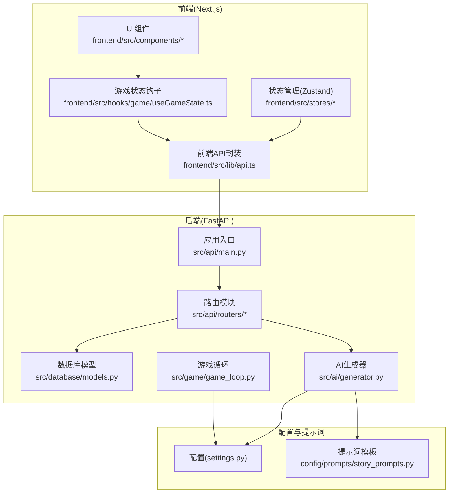
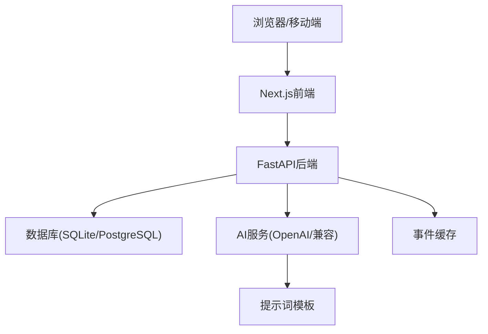
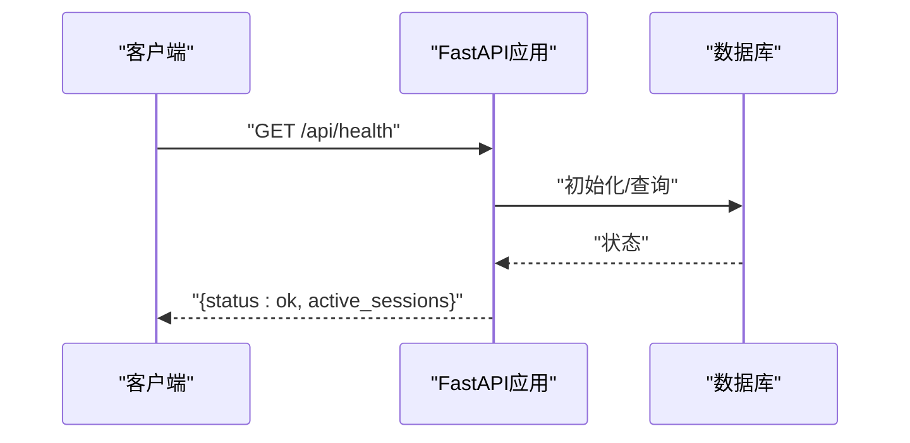
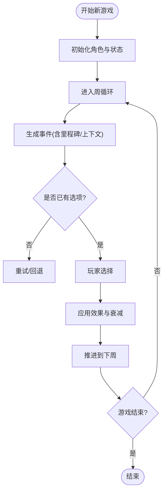
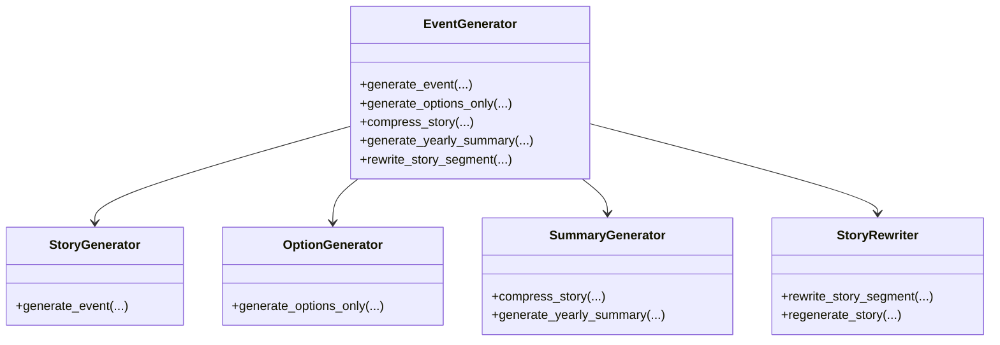
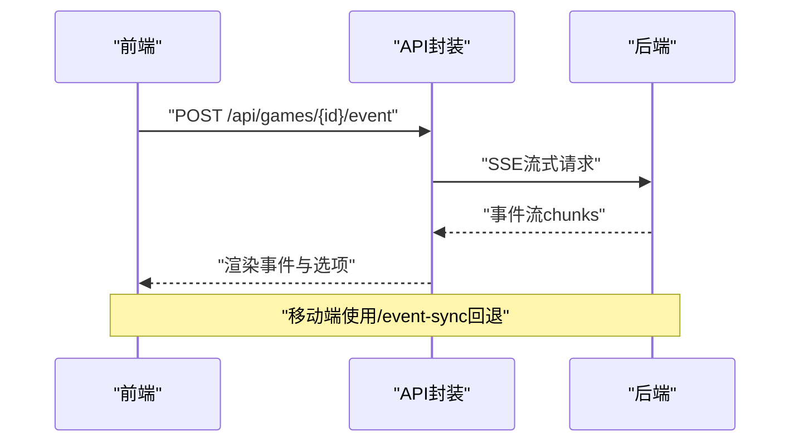
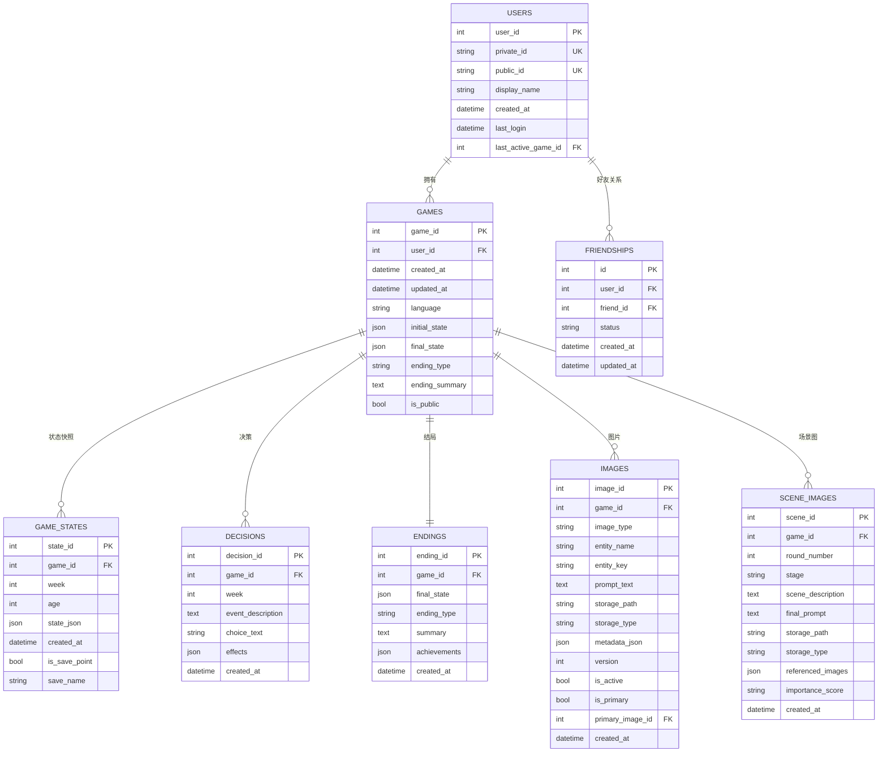
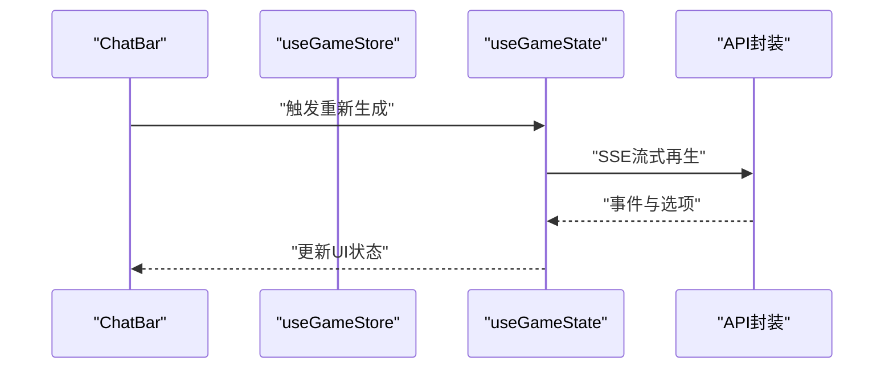
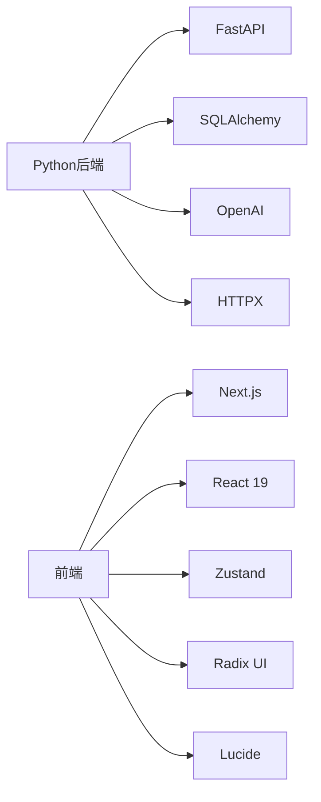

# 学习资源与技能提升

<cite>
**本文引用的文件**
- [README.md](file://README.md)
- [requirements.txt](file://requirements.txt)
- [package.json](file://frontend/package.json)
- [src/api/main.py](file://src/api/main.py)
- [frontend/src/lib/api.ts](file://frontend/src/lib/api.ts)
- [src/game/game_loop.py](file://src/game/game_loop.py)
- [src/ai/generator.py](file://src/ai/generator.py)
- [config/prompts/story_prompts.py](file://config/prompts/story_prompts.py)
- [src/database/models.py](file://src/database/models.py)
- [config/settings.py](file://config/settings.py)
- [frontend/src/hooks/game/useGameState.ts](file://frontend/src/hooks/game/useGameState.ts)
- [src/api/routers/gameplay/events.py](file://src/api/routers/gameplay/events.py)
- [frontend/src/components/game/ChatBar.tsx](file://frontend/src/components/game/ChatBar.tsx)
- [tests/performance/locustfile.py](file://tests/performance/locustfile.py)
- [DEPLOYMENT.md](file://DEPLOYMENT.md)
- [Makefile](file://Makefile)
</cite>

## 目录
1. [简介](#简介)
2. [项目结构](#项目结构)
3. [核心组件](#核心组件)
4. [架构总览](#架构总览)
5. [详细组件分析](#详细组件分析)
6. [依赖关系分析](#依赖关系分析)
7. [性能考量](#性能考量)
8. [故障排查指南](#故障排查指南)
9. [结论](#结论)
10. [附录](#附录)

## 简介
“人生草稿本”是一个以文本为基础的人生模拟游戏，结合AI动态生成事件、资源管理与决策玩法，支持双语（中/英）体验与多结局。项目采用Python后端（FastAPI）、React 19 + Next.js前端、Zustand状态管理、SQLite/PostgreSQL数据库、以及OpenAI等AI服务，覆盖从CLI原型到Web应用的完整开发路径。

## 项目结构
项目采用前后端分离与模块化设计：
- 后端：FastAPI应用，路由按业务域划分，包含认证、角色、游戏、剧情、图片等模块
- 前端：Next.js应用，使用React 19与Zustand进行状态管理，组件化UI与工具函数封装
- AI与提示词：集中于提示词模板与AI生成器，支持事件、选项、总结、重写等流水线
- 数据层：SQLAlchemy模型与数据库初始化，支持本地SQLite与云数据库
- 配置：集中于settings与.env，支持多环境与可插拔的AI/图像服务
- 测试与性能：单元/集成测试、端到端测试、性能压测（Locust）

图表来源
- [src/api/main.py](file://src/api/main.py#L1-L134)
- [frontend/src/lib/api.ts](file://frontend/src/lib/api.ts#L1-L564)
- [src/ai/generator.py](file://src/ai/generator.py#L1-L497)
- [src/game/game_loop.py](file://src/game/game_loop.py#L1-L592)
- [src/database/models.py](file://src/database/models.py#L1-L295)
- [config/settings.py](file://config/settings.py#L1-L168)
- [config/prompts/story_prompts.py](file://config/prompts/story_prompts.py#L1-L1099)

章节来源
- [README.md](file://README.md#L74-L87)
- [src/api/main.py](file://src/api/main.py#L1-L134)
- [frontend/package.json](file://frontend/package.json#L1-L49)

## 核心组件
- 后端FastAPI应用与中间件：CORS、全局异常处理、健康检查、客户端日志上报
- 游戏循环与状态：每周事件生成、决策处理、资源衰减、里程碑与总结
- AI事件生成器：两阶段流水线（故事生成+选项生成）、缓存、重写与总结
- 前端API封装与认证：Cookie优先、Authorization头回退、错误上报
- 数据库模型：用户、好友、游戏、状态快照、决策、结局、图片与场景图
- 配置中心：AI/图像/数据库/语言/常量等统一管理
- 提示词模板：事件生成、选项生成、故事续写、纯故事生成等

章节来源
- [src/api/main.py](file://src/api/main.py#L1-L134)
- [src/game/game_loop.py](file://src/game/game_loop.py#L1-L592)
- [src/ai/generator.py](file://src/ai/generator.py#L1-L497)
- [frontend/src/lib/api.ts](file://frontend/src/lib/api.ts#L1-L564)
- [src/database/models.py](file://src/database/models.py#L1-L295)
- [config/settings.py](file://config/settings.py#L1-L168)
- [config/prompts/story_prompts.py](file://config/prompts/story_prompts.py#L1-L1099)

## 架构总览
后端采用模块化路由，前端通过统一API封装调用，AI与提示词解耦，数据库抽象清晰，支持本地与云数据库切换。

图表来源
- [src/api/main.py](file://src/api/main.py#L1-L134)
- [frontend/src/lib/api.ts](file://frontend/src/lib/api.ts#L1-L564)
- [src/database/models.py](file://src/database/models.py#L1-L295)
- [config/settings.py](file://config/settings.py#L1-L168)
- [config/prompts/story_prompts.py](file://config/prompts/story_prompts.py#L1-L1099)

## 详细组件分析

### 后端应用与路由
- 应用生命周期：启动初始化数据库，关闭清理
- CORS策略：明确允许来源，支持Cookie认证
- 全局异常处理：统一JSON响应
- 健康检查：返回会话计数
- 客户端日志：接收前端错误与上下文

图表来源
- [src/api/main.py](file://src/api/main.py#L24-L99)

章节来源
- [src/api/main.py](file://src/api/main.py#L1-L134)

### 游戏循环与事件生成
- 游戏循环：每周推进、里程碑事件、4周/年度总结、资源衰减
- 事件生成：AI生成器两阶段流水线，支持流式与非流式
- 回退机制：AI失败时生成简单事件，保证体验连续性

图表来源
- [src/game/game_loop.py](file://src/game/game_loop.py#L69-L159)
- [src/ai/generator.py](file://src/ai/generator.py#L211-L268)

章节来源
- [src/game/game_loop.py](file://src/game/game_loop.py#L1-L592)
- [src/ai/generator.py](file://src/ai/generator.py#L1-L497)

### AI事件生成器与提示词
- 事件生成：故事生成+选项生成+缓存命中
- 选项生成：基于已有故事生成选项，严格约束人物与效果
- 提示词模板：事件生成、选项生成、故事续写、纯故事生成等
- 重写与总结：支持段落重写与多粒度总结

图表来源
- [src/ai/generator.py](file://src/ai/generator.py#L30-L66)
- [config/prompts/story_prompts.py](file://config/prompts/story_prompts.py#L21-L361)

章节来源
- [src/ai/generator.py](file://src/ai/generator.py#L1-L497)
- [config/prompts/story_prompts.py](file://config/prompts/story_prompts.py#L1-L1099)

### 前端API封装与认证
- 双重认证：Cookie优先（httpOnly），localStorage回退
- 请求封装：统一header、错误处理、远程日志
- 游戏API：认证、好友、游戏、角色、预设、玩法、剧情、图片
- SSE与回退：事件流式生成与非流式回退

图表来源
- [frontend/src/lib/api.ts](file://frontend/src/lib/api.ts#L69-L124)
- [src/api/routers/gameplay/events.py](file://src/api/routers/gameplay/events.py#L48-L164)

章节来源
- [frontend/src/lib/api.ts](file://frontend/src/lib/api.ts#L1-L564)
- [src/api/routers/gameplay/events.py](file://src/api/routers/gameplay/events.py#L1-L212)

### 数据库模型与会话恢复
- 用户/好友/游戏/状态/决策/结局/图片/场景图
- 会话恢复：基于用户最后活跃游戏ID
- 时间回溯存档：手动存档点与自动快照

图表来源
- [src/database/models.py](file://src/database/models.py#L11-L234)

章节来源
- [src/database/models.py](file://src/database/models.py#L1-L295)
- [config/settings.py](file://config/settings.py#L107-L141)

### 配置中心与环境
- OpenAI/图像/场景分析API配置
- 图像存储与OSS配置
- 游戏常量：年龄、周数、初始资源、衰减、回合数
- 数据库URL优先级：云数据库 > 本地SQLite

章节来源
- [config/settings.py](file://config/settings.py#L1-L168)

### 前端状态与交互
- Zustand组合store：游戏会话、事件、图片、角色、存档与预设
- 游戏状态钩子：保存、继续、重新生成、总结、结局
- ChatBar：底部聊天助手，支持保存、改写、重新生成、总结

图表来源
- [frontend/src/components/game/ChatBar.tsx](file://frontend/src/components/game/ChatBar.tsx#L103-L151)
- [frontend/src/hooks/game/useGameState.ts](file://frontend/src/hooks/game/useGameState.ts#L150-L288)

章节来源
- [frontend/src/stores/useGameStore.ts](file://frontend/src/stores/useGameStore.ts#L1-L996)
- [frontend/src/hooks/game/useGameState.ts](file://frontend/src/hooks/game/useGameState.ts#L1-L315)
- [frontend/src/components/game/ChatBar.tsx](file://frontend/src/components/game/ChatBar.tsx#L1-L323)

## 依赖关系分析
- Python后端依赖：FastAPI、SQLAlchemy、Pydantic、OpenAI、HTTPX、dotenv、pytest等
- 前端依赖：Next.js 16、React 19、Zustand、Radix UI、Lucide等
- 配置与提示词：集中于settings与prompts目录，便于扩展与维护
- 测试与性能：pytest、Jest/Playwright、Locust

图表来源
- [requirements.txt](file://requirements.txt#L1-L12)
- [frontend/package.json](file://frontend/package.json#L16-L27)

章节来源
- [requirements.txt](file://requirements.txt#L1-L12)
- [frontend/package.json](file://frontend/package.json#L1-L49)

## 性能考量
- SSE并发控制：每游戏实例使用异步锁，防止并发生成
- 生成超时与回退：检测卡住状态并自动重置
- 事件缓存：AI事件缓存减少重复生成
- 前端流式渲染：逐步展示事件，降低首屏压力
- 性能压测：Locust负载测试覆盖注册、健康检查、游戏创建与状态查询

章节来源
- [src/api/routers/gameplay/events.py](file://src/api/routers/gameplay/events.py#L30-L164)
- [src/ai/generator.py](file://src/ai/generator.py#L54-L66)
- [tests/performance/locustfile.py](file://tests/performance/locustfile.py#L1-L224)

## 故障排查指南
- 健康检查：确认后端存活与会话数量
- CORS与Cookie：确保允许来源与credentials配置正确
- 会话恢复：404错误时尝试恢复会话并重试
- 生成冲突：并发生成时等待或使用同步回退接口
- 客户端日志：通过“/api/client-log”上报前端错误与上下文

章节来源
- [src/api/main.py](file://src/api/main.py#L92-L133)
- [frontend/src/lib/api.ts](file://frontend/src/lib/api.ts#L117-L133)
- [frontend/src/hooks/game/useGameState.ts](file://frontend/src/hooks/game/useGameState.ts#L230-L252)

## 结论
本项目以清晰的模块化架构、完善的前后端交互与AI提示词体系，提供了可扩展的人类体验模拟框架。通过统一的配置中心与数据库抽象，支持从本地开发到云部署的多种环境。建议在学习过程中循序渐进，先掌握后端FastAPI与数据库、再熟悉前端Next.js/Zustand，最后深入AI提示词与性能优化。

## 附录

### 技术栈学习路径
- Python高级特性
  - 上下文管理器、异步并发、装饰器与元编程
  - 参考：[src/api/main.py](file://src/api/main.py#L24-L33)、[src/api/routers/gameplay/events.py](file://src/api/routers/gameplay/events.py#L35-L41)
- FastAPI框架
  - 路由、依赖注入、异常处理、CORS、SSE
  - 参考：[src/api/main.py](file://src/api/main.py#L1-L134)、[src/api/routers/gameplay/events.py](file://src/api/routers/gameplay/events.py#L1-L212)
- React 19 + Next.js应用开发
  - 组件化、Hooks、状态管理、SSR/Streaming
  - 参考：[frontend/package.json](file://frontend/package.json#L16-L27)、[frontend/src/hooks/game/useGameState.ts](file://frontend/src/hooks/game/useGameState.ts#L1-L315)
- Zustand状态管理
  - 轻量状态、持久化、组合store
  - 参考：[frontend/src/stores/useGameStore.ts](file://frontend/src/stores/useGameStore.ts#L1-L996)
- AI服务集成
  - OpenAI/兼容接口、提示词工程、缓存与重试
  - 参考：[config/settings.py](file://config/settings.py#L30-L68)、[config/prompts/story_prompts.py](file://config/prompts/story_prompts.py#L1-L1099)、[src/ai/generator.py](file://src/ai/generator.py#L1-L497)
- 数据库与ORM
  - SQLAlchemy模型、索引、事务、会话恢复
  - 参考：[src/database/models.py](file://src/database/models.py#L1-L295)

### 核心概念与术语
- 游戏循环：每周推进、事件生成、决策处理、资源衰减、里程碑与总结
- 事件生成：故事生成+选项生成+缓存命中
- 状态管理：Zustand store组合、本地持久化、UI状态同步
- 资源系统：能量、情绪、知识、财富的范围与衰减
- 事件流：SSE流式生成与移动端同步回退
- 会话恢复：基于用户最后活跃游戏ID的自动恢复

章节来源
- [src/game/game_loop.py](file://src/game/game_loop.py#L1-L592)
- [src/ai/generator.py](file://src/ai/generator.py#L1-L497)
- [frontend/src/stores/useGameStore.ts](file://frontend/src/stores/useGameStore.ts#L1-L996)
- [frontend/src/hooks/game/useGameState.ts](file://frontend/src/hooks/game/useGameState.ts#L1-L315)

### 在线学习资源推荐
- 官方文档
  - FastAPI：https://fastapi.tiangolo.com/
  - Next.js：https://nextjs.org/docs
  - React 19：https://react.dev/blog
  - SQLAlchemy：https://docs.sqlalchemy.org/
  - OpenAI：https://platform.openai.com/docs
- 教程网站
  - Real Python（Python高级与Web）
  - freeCodeCamp（全栈与Next.js）
  - The Net Ninja（React与状态管理）
- 视频课程
  - FastAPI实战系列
  - Next.js从入门到实践
  - React 19新特性与Zustand
- 技术博客
  - FastAPI生态与最佳实践
  - React性能优化与状态管理
  - AI提示词工程与缓存策略

### 技能评估标准
- 初级
  - 能运行项目、理解前后端交互、掌握基本API调用
  - 能修改提示词模板、配置环境变量
- 中级
  - 能扩展路由与模型、实现新玩法、优化SSE并发
  - 能编写单元测试与端到端测试、进行性能压测
- 高级
  - 能重构AI生成器、设计提示词流水线、实现多模态集成
  - 能设计数据库迁移、实现灰度发布与监控告警

### 实践项目建议
- 个人练习
  - 基于现有提示词模板扩展新事件类型
  - 为游戏循环增加新的里程碑事件与总结维度
  - 优化前端UI组件与交互（如ChatBar增强）
- 开源贡献
  - 补充测试覆盖率、完善错误处理与日志上报
  - 优化提示词模板与AI生成稳定性
- 技能展示平台
  - GitHub Pages/Cloudflare Pages部署前端Demo
  - Streamlit/Docker部署后端API演示

### 团队技术分享机制
- 内部培训
  - 每月一次“AI提示词工程”专题
  - “前后端协作”工作坊（API契约与SSE）
- 技术讲座
  - 数据库设计与迁移策略
  - 性能优化与压测实践
- 经验交流
  - 每周代码评审与重构分享
  - 部署与运维最佳实践

### 职业发展指导
- 技能发展方向
  - 全栈工程师：后端Python/FastAPI + 前端Next.js/React
  - AI应用工程师：提示词工程、多模态与缓存优化
  - DevOps：Docker/Compose/Nginx/SSL/监控
- 面试准备
  - 熟练掌握FastAPI路由、依赖注入、异常处理
  - 理解SSE与并发控制、数据库事务与索引
  - 能够解释提示词工程与AI生成稳定性
- 简历优化建议
  - 突出项目架构与模块化设计
  - 强调AI服务集成与性能优化
  - 展示测试与部署经验

### 学习计划制定与进度跟踪
- 第1-2周：环境搭建与项目运行，理解前后端交互
- 第3-4周：学习FastAPI与数据库模型，扩展路由与测试
- 第5-6周：深入AI提示词与生成器，优化事件流
- 第7-8周：前端状态管理与UI组件，完善用户体验
- 第9-10周：性能压测与部署，CI/CD与监控
- 进度跟踪：Makefile任务、测试覆盖率报告、性能指标

章节来源
- [Makefile](file://Makefile#L1-L93)
- [tests/performance/locustfile.py](file://tests/performance/locustfile.py#L1-L224)
- [DEPLOYMENT.md](file://DEPLOYMENT.md#L1-L352)