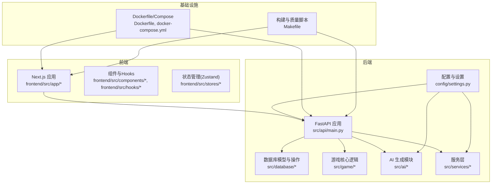
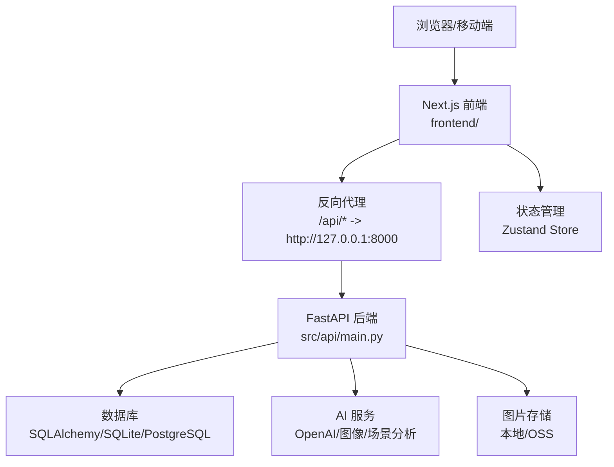
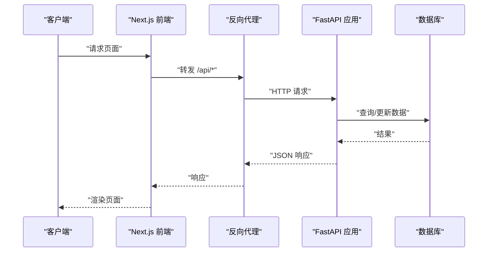
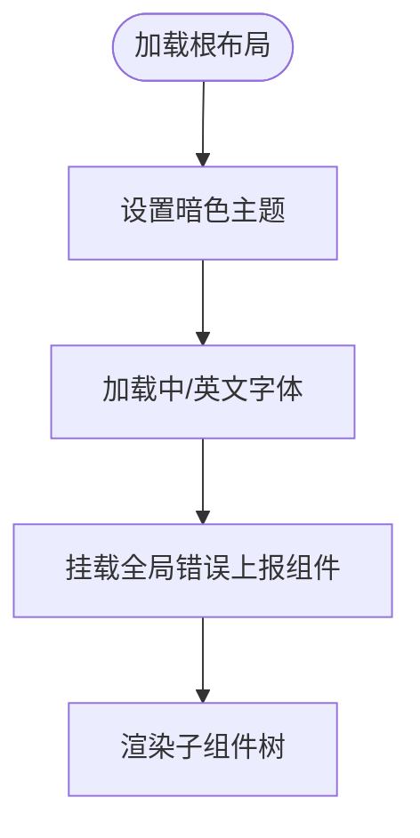
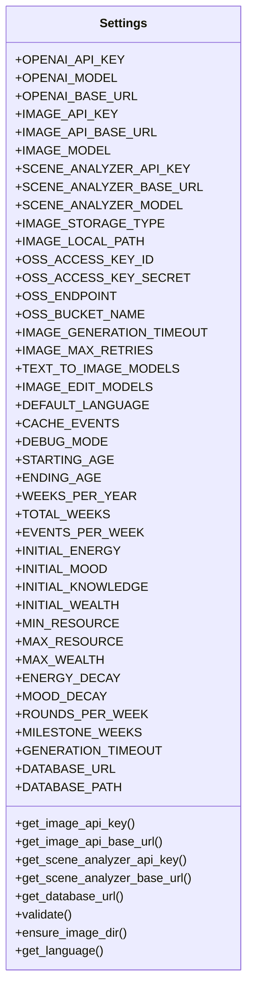
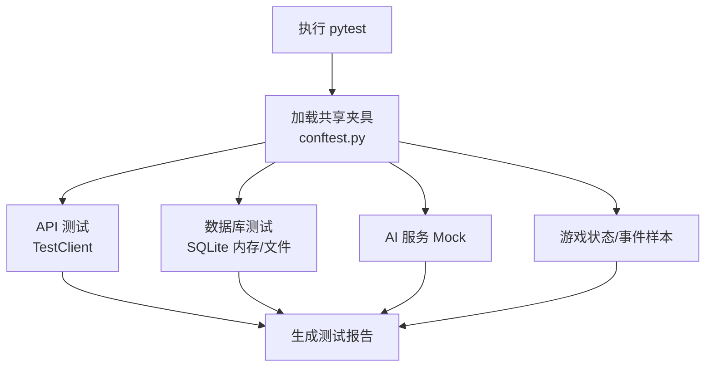
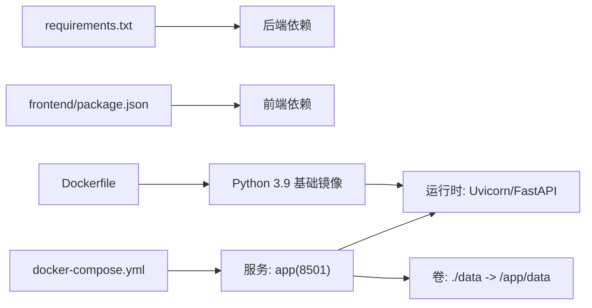

# 开发指南

<cite>
**本文引用的文件**
- [README.md](file://README.md)
- [requirements.txt](file://requirements.txt)
- [Dockerfile](file://Dockerfile)
- [Makefile](file://Makefile)
- [config/settings.py](file://config/settings.py)
- [src/api/main.py](file://src/api/main.py)
- [frontend/package.json](file://frontend/package.json)
- [frontend/eslint.config.mjs](file://frontend/eslint.config.mjs)
- [frontend/tsconfig.json](file://frontend/tsconfig.json)
- [frontend/next.config.ts](file://frontend/next.config.ts)
- [frontend/src/app/layout.tsx](file://frontend/src/app/layout.tsx)
- [pytest.ini](file://pytest.ini)
- [tests/conftest.py](file://tests/conftest.py)
- [docker-compose.yml](file://docker-compose.yml)
</cite>

## 目录
1. [简介](#简介)
2. [项目结构](#项目结构)
3. [核心组件](#核心组件)
4. [架构总览](#架构总览)
5. [详细组件分析](#详细组件分析)
6. [依赖关系分析](#依赖关系分析)
7. [性能考虑](#性能考虑)
8. [故障排除指南](#故障排除指南)
9. [结论](#结论)
10. [附录](#附录)

## 简介
本开发指南面向“人生草稿本”项目的开发者与团队成员，提供从代码规范、开发流程、测试与质量保障、构建与部署到性能优化与故障排除的全流程指导。项目采用 Python 后端（FastAPI）+ Next.js 前端的双栈架构，结合容器化与自动化脚本，支持本地开发、局域网联调与云端部署。

## 项目结构
项目采用按层与按功能混合的组织方式：
- 根目录包含后端、前端、配置、测试、数据与文档等模块
- 后端位于 src/，包含 API、AI 生成、游戏逻辑、数据库与服务层
- 前端位于 frontend/，基于 Next.js 16，TypeScript，TailwindCSS
- 配置位于 config/，包含提示词与全局设置
- 测试位于 tests/，覆盖单元、集成、安全与端到端测试
- 数据位于 data/，包含缓存、预设与数据库文件

图表来源
- [src/api/main.py](file://src/api/main.py#L1-L134)
- [config/settings.py](file://config/settings.py#L1-L168)
- [frontend/src/app/layout.tsx](file://frontend/src/app/layout.tsx#L1-L48)
- [Dockerfile](file://Dockerfile#L1-L40)
- [docker-compose.yml](file://docker-compose.yml#L1-L65)
- [Makefile](file://Makefile#L1-L93)

章节来源
- [README.md](file://README.md#L74-L87)

## 核心组件
- 配置与设置：集中于 config/settings.py，统一管理 OpenAI/图像/场景分析/数据库/语言/缓存等配置项，并提供校验与默认值
- 后端 API：基于 FastAPI，注册路由、CORS、健康检查与全局异常处理；通过依赖注入与会话存储支撑游戏状态
- 前端应用：Next.js 16，TypeScript，TailwindCSS，内置错误上报组件与暗色主题
- 构建与质量：Makefile 提供格式化、静态检查、类型检查、测试与覆盖率、Docker 操作与部署快捷命令
- 测试体系：pytest + TestClient，配合 conftest 提供丰富的共享夹具，覆盖 API、数据库、AI 服务与游戏状态

章节来源
- [config/settings.py](file://config/settings.py#L27-L168)
- [src/api/main.py](file://src/api/main.py#L35-L90)
- [frontend/src/app/layout.tsx](file://frontend/src/app/layout.tsx#L20-L47)
- [Makefile](file://Makefile#L32-L46)
- [tests/conftest.py](file://tests/conftest.py#L12-L337)

## 架构总览
后端与前端通过 Next.js 的反向代理转发 /api/* 到后端 8000 端口；CORS 明确允许本地与局域网访问；健康检查与会话统计用于运维可观测性。

图表来源
- [frontend/next.config.ts](file://frontend/next.config.ts#L20-L27)
- [src/api/main.py](file://src/api/main.py#L46-L66)
- [src/api/main.py](file://src/api/main.py#L92-L99)
- [config/settings.py](file://config/settings.py#L107-L141)

## 详细组件分析

### 后端 API 组件分析
- 生命周期与中间件：应用启动时初始化数据库，关闭时优雅退出；启用 CORS 并支持 Cookie 认证；全局异常处理器返回统一错误响应
- 路由注册：认证、好友、游戏、角色、预设、剧情、图片等模块化路由
- 健康检查与客户端日志：提供 /api/health 与 /api/client-log 接口，便于监控与移动端问题定位

图表来源
- [frontend/next.config.ts](file://frontend/next.config.ts#L20-L27)
- [src/api/main.py](file://src/api/main.py#L80-L89)
- [src/api/main.py](file://src/api/main.py#L92-L99)

章节来源
- [src/api/main.py](file://src/api/main.py#L24-L33)
- [src/api/main.py](file://src/api/main.py#L46-L66)
- [src/api/main.py](file://src/api/main.py#L80-L89)
- [src/api/main.py](file://src/api/main.py#L92-L99)
- [src/api/main.py](file://src/api/main.py#L117-L133)

### 前端应用组件分析
- 布局与主题：根布局设置字体、暗色主题与全局错误上报组件
- 类型与路径别名：tsconfig 配置严格模式、路径映射与插件
- ESLint：基于 eslint-config-next，自定义忽略规则
- Next 配置：禁用 Strict Mode 避免 SSE 重复连接；允许局域网访问；代理超时增加；/api/* 重写至后端

图表来源
- [frontend/src/app/layout.tsx](file://frontend/src/app/layout.tsx#L32-L47)

章节来源
- [frontend/src/app/layout.tsx](file://frontend/src/app/layout.tsx#L20-L47)
- [frontend/tsconfig.json](file://frontend/tsconfig.json#L1-L36)
- [frontend/eslint.config.mjs](file://frontend/eslint.config.mjs#L1-L19)
- [frontend/next.config.ts](file://frontend/next.config.ts#L3-L28)

### 配置与设置组件分析
- 配置项分类：OpenAI/图像/场景分析、图片存储(OSS/本地)、语言与缓存、游戏常量、资源边界、周循环与里程碑、数据库连接、超时与降级模型
- 默认值与回退：图像与场景分析 API 密钥与基础地址可回退到 OpenAI 配置；数据库优先使用 DATABASE_URL（云），否则回退到本地 SQLite
- 运行时校验：缺失 OPENAI_API_KEY 将抛出异常，确保关键配置可用

图表来源
- [config/settings.py](file://config/settings.py#L27-L168)

章节来源
- [config/settings.py](file://config/settings.py#L30-L149)
- [config/settings.py](file://config/settings.py#L133-L141)

### 测试与质量组件分析
- 测试框架：pytest，自动发现 test_*.py，异步模式，简洁输出
- 共享夹具：TestClient、认证头、数据库引擎/会话、会话存储与服务 Mock、用户与游戏对象、AI 生成器 Mock、样本数据与时间冻结
- 质量脚本：格式化（black/isort）、Linter（flake8）、类型检查（mypy）、全量质量检查、覆盖率报告

图表来源
- [pytest.ini](file://pytest.ini#L1-L8)
- [tests/conftest.py](file://tests/conftest.py#L29-L337)
- [Makefile](file://Makefile#L19-L46)

章节来源
- [pytest.ini](file://pytest.ini#L1-L8)
- [tests/conftest.py](file://tests/conftest.py#L29-L337)
- [Makefile](file://Makefile#L32-L46)

## 依赖关系分析
- 后端依赖：OpenAI SDK、HTTPX、dotenv、Pydantic、SQLAlchemy、PostgreSQL 驱动、FastAPI、Uvicorn、JWE、multipart、pytest 等
- 前端依赖：Next.js、React、Radix UI、TailwindCSS、Zustand、Playwright/Jest/Turbo 等
- 构建与运行：Dockerfile 基于 Python slim，安装系统依赖与 Python 依赖，暴露 8000 端口并健康检查；docker-compose 提供服务编排与持久化数据卷

图表来源
- [requirements.txt](file://requirements.txt#L1-L12)
- [frontend/package.json](file://frontend/package.json#L16-L48)
- [Dockerfile](file://Dockerfile#L1-L40)
- [docker-compose.yml](file://docker-compose.yml#L5-L27)

章节来源
- [requirements.txt](file://requirements.txt#L1-L12)
- [frontend/package.json](file://frontend/package.json#L16-L48)
- [Dockerfile](file://Dockerfile#L1-L40)
- [docker-compose.yml](file://docker-compose.yml#L1-L65)

## 性能考虑
- 图像生成与场景分析：配置图像生成超时与最大重试次数，支持多模型降级（文本到图/编辑），避免单点失败影响整体体验
- 资源衰减与边界：合理设置能量/情绪衰减与资源上下限，减少极端状态导致的计算开销
- 会话与并发：健康检查与会话计数接口便于观察并发与存活状态；在容器中设置 CPU/内存限制，避免资源争用
- 前端代理超时：针对图片生成较长耗时，适当提高代理超时，避免中途断连
- 缓存与预设：事件缓存与预设数据可降低重复请求成本

章节来源
- [config/settings.py](file://config/settings.py#L56-L68)
- [config/settings.py](file://config/settings.py#L96-L99)
- [frontend/next.config.ts](file://frontend/next.config.ts#L16-L19)
- [src/api/main.py](file://src/api/main.py#L92-L99)
- [docker-compose.yml](file://docker-compose.yml#L35-L43)

## 故障排除指南
- 启动后端 API：确认 .env 中 OPENAI_API_KEY 等关键配置；使用 Makefile 的 docker-build 与 docker-up 快捷命令
- 前端无法访问后端：检查 Next.js 重写规则是否正确指向 127.0.0.1:8000；确认 CORS 允许的 origin 列表
- 健康检查失败：查看容器日志与健康检查命令；确认端口映射与服务监听地址
- 移动端/局域网访问：通过环境变量扩展 CORS_ORIGINS 或 NEXT_PUBLIC_API_BASE；必要时使用 start_lan_nextjs.sh
- 客户端错误上报：利用 /api/client-log 接口收集移动端错误上下文（URL、UA、IP）

章节来源
- [src/api/main.py](file://src/api/main.py#L46-L66)
- [frontend/next.config.ts](file://frontend/next.config.ts#L20-L27)
- [Dockerfile](file://Dockerfile#L34-L36)
- [src/api/main.py](file://src/api/main.py#L117-L133)

## 结论
本指南提供了从代码规范、开发流程、测试与质量、构建与部署到性能优化与故障排除的完整实践路径。建议团队在日常开发中遵循 Makefile 的质量检查流程、pytest 的测试规范与前端 ESLint/TS 配置，结合 Docker 与 docker-compose 实现一致的本地与生产环境。

## 附录

### 代码规范与最佳实践
- Python 后端
  - 格式化：使用 black，行宽 100
  - 导入排序：使用 isort
  - Lint：flake8，忽略 E501/W503
  - 类型检查：mypy，忽略缺失导入
- 前端
  - TypeScript 严格模式，路径别名 @/*
  - ESLint 基于 eslint-config-next，自定义忽略
  - Jest + Testing Library 进行单元与快照测试
  - Playwright 进行端到端测试

章节来源
- [Makefile](file://Makefile#L32-L46)
- [frontend/tsconfig.json](file://frontend/tsconfig.json#L22-L24)
- [frontend/eslint.config.mjs](file://frontend/eslint.config.mjs#L1-L19)
- [frontend/package.json](file://frontend/package.json#L5-L15)

### 新功能开发流程
- 需求分析：明确功能目标、用户故事与验收标准
- 设计评审：前后端接口契约（路由、参数、响应）、数据库变更（如有）、AI 生成策略
- 开发实现：遵循代码规范与测试先行；后端使用 FastAPI 路由与依赖注入；前端使用 Zustand 状态管理与组件化
- 测试验证：单元测试 + 集成测试 + 端到端测试；使用 pytest 与 Playwright；覆盖率报告与质量检查
- 文档与发布：更新 README 与相关文档；通过 Makefile 的 docker-build 与 docker-compose 部署

章节来源
- [tests/conftest.py](file://tests/conftest.py#L29-L337)
- [pytest.ini](file://pytest.ini#L1-L8)
- [Makefile](file://Makefile#L74-L82)

### 代码审查标准与流程
- Pull Request 规范
  - 标题清晰，描述包含背景、变更内容与测试要点
  - 包含必要的测试用例与覆盖率说明
  - 通过质量检查（格式化、Linter、类型检查、pytest）
- 合并要求
  - 至少一名维护者批准
  - 无阻断性警告与失败
  - 通过 CI（如需）与健康检查

章节来源
- [Makefile](file://Makefile#L32-L46)
- [pytest.ini](file://pytest.ini#L1-L8)

### 构建与打包流程
- 依赖管理
  - 后端：pip 安装 requirements.txt
  - 前端：npm install
- 版本控制
  - 使用 .env.example 作为模板，.env 存放本地敏感配置
- 发布流程
  - 本地：make deploy-dev 或 docker-compose up -d
  - 生产：make deploy-prod 或 docker-compose -f docker-compose.yml -f docker-compose.prod.yml up -d
  - 健康检查：Dockerfile 中对 /docs 的健康检查

章节来源
- [requirements.txt](file://requirements.txt#L1-L12)
- [frontend/package.json](file://frontend/package.json#L16-L48)
- [Makefile](file://Makefile#L74-L82)
- [Dockerfile](file://Dockerfile#L34-L36)

### 性能优化策略与代码重构指南
- 性能优化
  - 图像生成与场景分析：合理设置超时与重试；多模型降级
  - 资源边界与衰减：避免极端状态引发的计算抖动
  - 前端代理超时：针对长耗时操作适当放宽
  - 容器资源限制：CPU/内存配额避免资源争用
- 重构建议
  - 拆分大型路由模块，保持单一职责
  - 使用 Pydantic 模型统一输入输出
  - 将 AI 服务抽象为可替换的客户端接口
  - 将状态管理拆分为更细粒度的 Store

章节来源
- [config/settings.py](file://config/settings.py#L56-L68)
- [config/settings.py](file://config/settings.py#L96-L99)
- [frontend/next.config.ts](file://frontend/next.config.ts#L16-L19)
- [docker-compose.yml](file://docker-compose.yml#L35-L43)

### 开发工具配置与 IDE 设置建议
- Python
  - 使用 VS Code/PyCharm，启用 black/isort/flake8/mypy 插件
  - 在终端集成 Makefile 命令进行格式化与质量检查
- 前端
  - VS Code/WebStorm，启用 ESLint、Prettier、TypeScript
  - 配置路径别名与自动导入
- 容器与部署
  - Docker Desktop，使用 docker-compose 进行本地联调
  - 通过 Makefile 快速构建与部署

章节来源
- [Makefile](file://Makefile#L32-L46)
- [frontend/tsconfig.json](file://frontend/tsconfig.json#L22-L24)
- [frontend/eslint.config.mjs](file://frontend/eslint.config.mjs#L1-L19)

### 调试技巧与故障排除
- 后端
  - 使用 /api/health 查看活跃会话数
  - 使用 /api/client-log 收集客户端错误上下文
  - 通过日志级别与格式化输出定位问题
- 前端
  - 使用 ErrorReporter 组件捕获渲染错误
  - 通过 Next.js 重写规则与代理超时解决跨域与长耗时问题
- 容器
  - docker-compose logs -f app 查看实时日志
  - 健康检查命令验证服务可用性

章节来源
- [src/api/main.py](file://src/api/main.py#L92-L99)
- [src/api/main.py](file://src/api/main.py#L117-L133)
- [frontend/src/app/layout.tsx](file://frontend/src/app/layout.tsx#L3-L4)
- [Dockerfile](file://Dockerfile#L34-L36)

### 持续集成与持续部署
- CI（建议）
  - 触发条件：push/pr 触发质量检查与测试
  - 步骤：安装依赖 → 质量检查 → 单元测试 → 覆盖率报告 → 构建镜像 → 健康检查
- CD（当前）
  - 本地开发：make deploy-dev
  - 生产部署：make deploy-prod 或 docker-compose 多组合文件编排

章节来源
- [Makefile](file://Makefile#L74-L82)
- [Dockerfile](file://Dockerfile#L34-L36)

### 团队协作与沟通规范
- 分支策略：主分支保护，PR 审查与质量门禁
- 文档同步：新增功能需补充 README 与相关文档
- 沟通渠道：Issue/PR 讨论、站会同步进展

章节来源
- [Makefile](file://Makefile#L74-L82)

### 学习资源与技能提升建议
- Python：PEP8、Pydantic、SQLAlchemy、FastAPI
- 前端：Next.js、TypeScript、TailwindCSS、Zustand、Testing Library、Playwright
- DevOps：Docker、Compose、健康检查与日志采集
- 测试：pytest、Mock、夹具设计、覆盖率与端到端测试

章节来源
- [requirements.txt](file://requirements.txt#L1-L12)
- [frontend/package.json](file://frontend/package.json#L16-L48)
- [Dockerfile](file://Dockerfile#L1-L40)