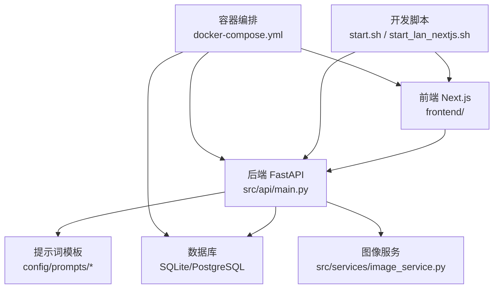
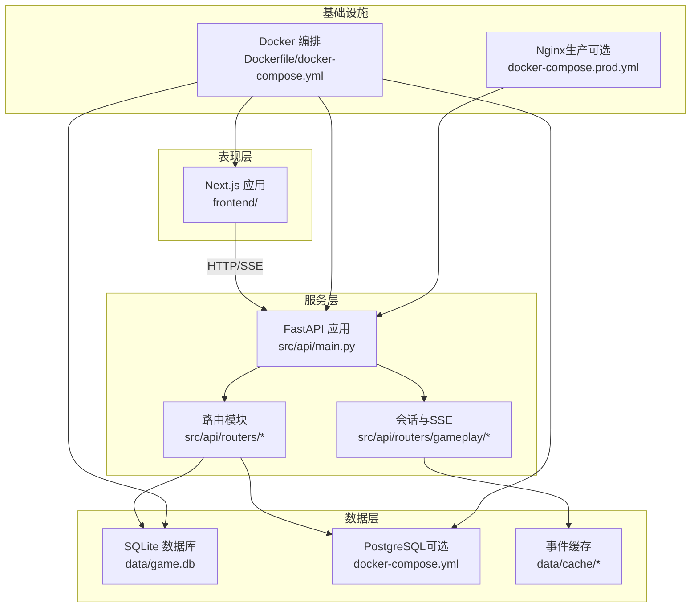
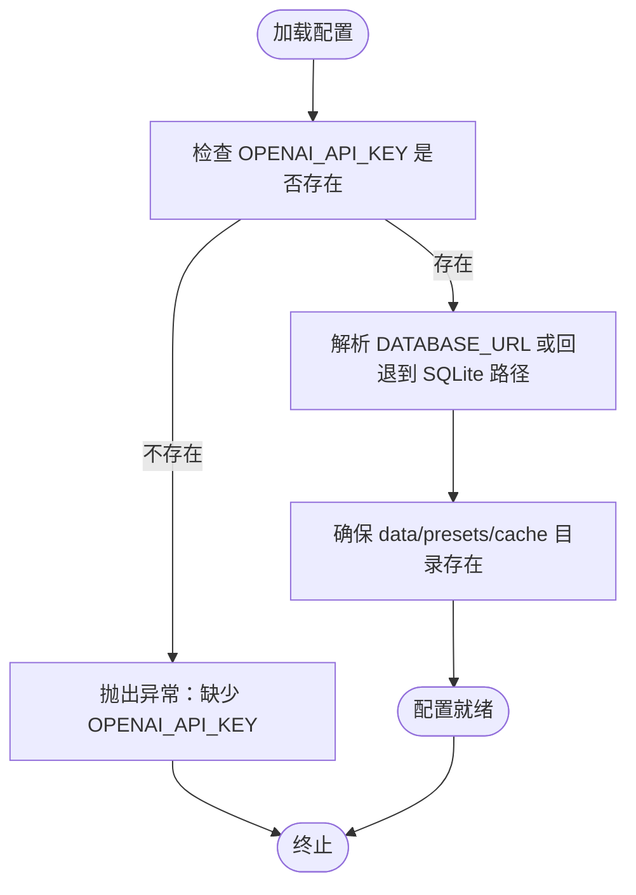
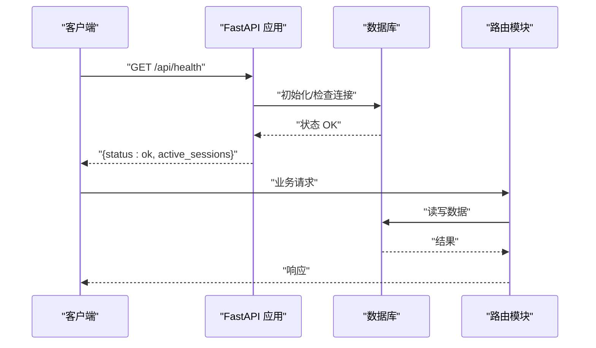
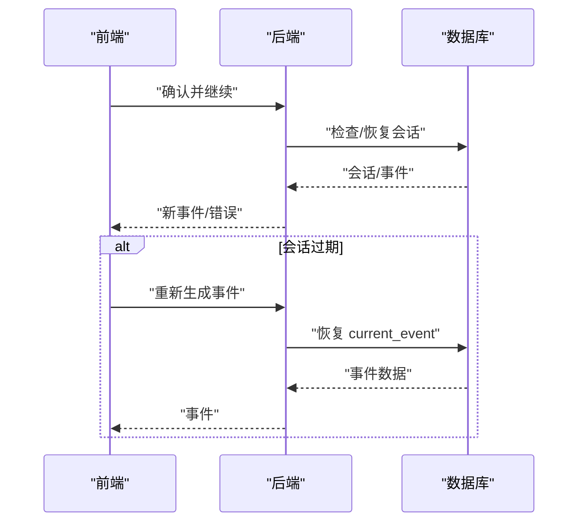
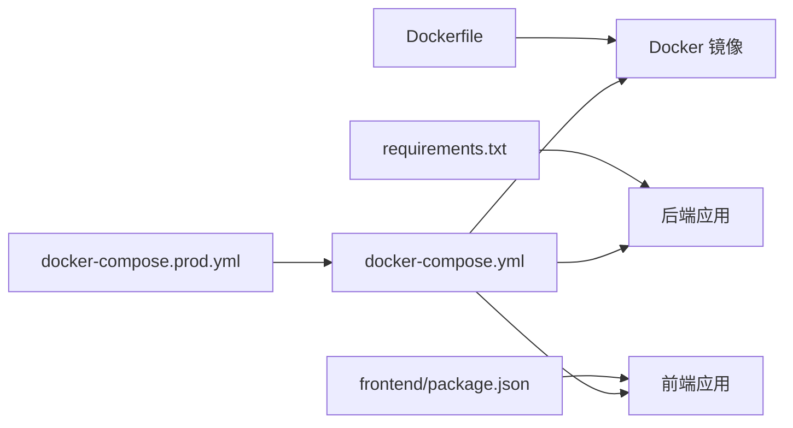

# 开发流程与工作规范

<cite>
**本文引用的文件**
- [README.md](file://README.md)
- [DEPLOYMENT.md](file://DEPLOYMENT.md)
- [requirements.txt](file://requirements.txt)
- [Dockerfile](file://Dockerfile)
- [Makefile](file://Makefile)
- [pytest.ini](file://pytest.ini)
- [frontend/package.json](file://frontend/package.json)
- [config/settings.py](file://config/settings.py)
- [src/api/main.py](file://src/api/main.py)
- [docker-compose.yml](file://docker-compose.yml)
- [docker-compose.prod.yml](file://docker-compose.prod.yml)
- [start.sh](file://start.sh)
- [start_lan_nextjs.sh](file://start_lan_nextjs.sh)
- [run_api.py](file://run_api.py)
- [config/prompts/__init__.py](file://config/prompts/__init__.py)
- [docs/session-recovery-test-plan.md](file://docs/session-recovery-test-plan.md)
</cite>

## 目录
1. [引言](#引言)
2. [项目结构](#项目结构)
3. [核心组件](#核心组件)
4. [架构总览](#架构总览)
5. [详细组件分析](#详细组件分析)
6. [依赖关系分析](#依赖关系分析)
7. [性能考量](#性能考量)
8. [故障排查指南](#故障排查指南)
9. [结论](#结论)
10. [附录](#附录)

## 引言
本文件面向“人生草稿本”项目的开发团队，提供一套完整的开发流程与工作规范，覆盖需求分析、设计评审、开发实现、测试验证、代码审查、版本控制、CI/CD、构建打包、环境搭建、团队协作与问题跟踪等全流程。目标是统一开发标准、提升交付质量与效率，并降低维护成本。

## 项目结构
项目采用前后端分离架构：后端基于 FastAPI 提供 REST API 与 SSE；前端基于 Next.js；AI 事件生成与提示词模板位于 Python 后端；数据层支持 SQLite 与 PostgreSQL；Docker 化部署；本地一键启动脚本简化开发环境搭建。

图表来源
- [src/api/main.py](file://src/api/main.py#L1-L134)
- [docker-compose.yml](file://docker-compose.yml#L1-L65)
- [config/prompts/__init__.py](file://config/prompts/__init__.py#L1-L121)

章节来源
- [README.md](file://README.md#L74-L87)
- [docker-compose.yml](file://docker-compose.yml#L1-L65)

## 核心组件
- 配置与环境
  - 环境变量与配置加载：通过配置模块集中管理 API 密钥、模型、数据库、语言、缓存等参数。
  - 端到端验证：配置模块提供校验函数，确保关键配置存在。
- 后端 API
  - 生命周期与中间件：应用启动时初始化数据库，全局异常处理，CORS 策略支持多端访问。
  - 路由组织：按业务域划分路由模块，统一前缀与标签。
  - 健康检查与客户端日志收集：便于运维与前端调试。
- 前端 Next.js
  - 测试与工具链：Jest、Playwright、ESLint、TailwindCSS。
  - 构建与运行：开发、构建、启动脚本。
- 数据与缓存
  - 数据目录与缓存目录：本地开发时自动创建，支持 SQLite 与外部数据库。
- 部署与容器化
  - Dockerfile、docker-compose、生产扩展配置、健康检查与资源限制。
- 本地开发脚本
  - 一键启动前后端、局域网访问模式、状态查询与日志查看。

章节来源
- [config/settings.py](file://config/settings.py#L1-L168)
- [src/api/main.py](file://src/api/main.py#L1-L134)
- [frontend/package.json](file://frontend/package.json#L1-L49)
- [docker-compose.yml](file://docker-compose.yml#L1-L65)
- [start.sh](file://start.sh#L1-L111)
- [start_lan_nextjs.sh](file://start_lan_nextjs.sh#L1-L97)

## 架构总览
系统由三层组成：表现层（Next.js）、服务层（FastAPI）、数据层（SQLite/PostgreSQL）。通过 Docker 编排实现服务编排与资源隔离；通过健康检查与日志收集保障稳定性；通过提示词模板与图像服务支撑 AI 生成能力。

图表来源
- [src/api/main.py](file://src/api/main.py#L1-L134)
- [docker-compose.yml](file://docker-compose.yml#L1-L65)
- [docker-compose.prod.yml](file://docker-compose.prod.yml#L1-L43)

## 详细组件分析

### 配置与环境管理
- 环境变量优先级与回退策略：数据库连接优先使用外部 URL，否则回退到本地 SQLite 路径；图像与场景分析 API 密钥可复用主密钥。
- 关键配置项：OpenAI/图像/场景分析模型、语言、缓存开关、资源上下界、周循环轮次、里程碑周、超时与重试、数据库类型与路径。
- 运行时校验：缺失必要密钥时抛出异常，避免静默失败。

图表来源
- [config/settings.py](file://config/settings.py#L143-L149)
- [config/settings.py](file://config/settings.py#L133-L141)
- [config/settings.py](file://config/settings.py#L18-L24)

章节来源
- [config/settings.py](file://config/settings.py#L1-L168)

### 后端 API 生命周期与中间件
- 生命周期：启动时初始化数据库，关闭时优雅退出。
- 全局异常处理：捕获未处理异常并返回统一格式。
- CORS 策略：显式允许来源，支持 Cookie 认证与局域网访问。
- 路由注册：按模块引入并统一前缀与标签，便于文档生成与维护。
- 健康检查：对外暴露健康端点，统计活动会话数。
- 客户端日志：接收前端上报的日志，便于移动端与跨端调试。

图表来源
- [src/api/main.py](file://src/api/main.py#L24-L33)
- [src/api/main.py](file://src/api/main.py#L92-L99)
- [src/api/main.py](file://src/api/main.py#L80-L89)

章节来源
- [src/api/main.py](file://src/api/main.py#L1-L134)

### 前端 Next.js 工作流
- 测试与工具链：Jest 单元测试、Playwright E2E、ESLint、TailwindCSS。
- 构建与运行：开发、构建、启动脚本，支持 TypeScript。
- 与后端交互：通过 API 前缀调用后端路由，使用 SSE 接收事件流。

章节来源
- [frontend/package.json](file://frontend/package.json#L1-L49)

### 会话恢复与测试验证
- 问题背景：后端重启导致会话丢失，前端恢复旧 currentEvent 导致选项不一致。
- 修复策略：
  - 前端：仅同步玩家状态，不在本地持久化 currentEvent；选择成功后清理；错误时自动重新生成。
  - 后端：会话缺失时自动从数据库恢复。
  - 新增调试端点：删除指定游戏的会话以便测试。
- 测试场景：正常流程、继续时过期、生成中过期、选择时过期。
- 验证清单：不显示旧选项、日志输出、流程不中断。

图表来源
- [docs/session-recovery-test-plan.md](file://docs/session-recovery-test-plan.md#L1-L158)
- [src/api/main.py](file://src/api/main.py#L80-L89)

章节来源
- [docs/session-recovery-test-plan.md](file://docs/session-recovery-test-plan.md#L1-L158)

### 提示词模板与 AI 生成
- 模块化组织：按故事、摘要、世界状态、校验、角色创建等域划分。
- 统一导出：通过包入口集中导出，便于上层模块按需导入。
- 与配置联动：提示词生成依赖当前世界模型、角色状态、历史事件等上下文。

章节来源
- [config/prompts/__init__.py](file://config/prompts/__init__.py#L1-L121)

## 依赖关系分析
- 后端依赖
  - 核心库：FastAPI、Uvicorn、SQLAlchemy、Pydantic、HTTPX、Python-Jose、multipart。
  - 数据库：SQLite（本地）与 PostgreSQL（云部署）。
  - 测试：pytest。
- 前端依赖
  - 框架：Next.js、React、Zustand。
  - 测试：Jest、Playwright、Testing Library。
  - 样式：TailwindCSS。
- 构建与运行
  - Dockerfile 定义镜像构建流程与健康检查。
  - docker-compose.yml 定义服务编排、环境变量与卷挂载。
  - docker-compose.prod.yml 扩展生产环境配置（Nginx、日志、端口映射）。

图表来源
- [requirements.txt](file://requirements.txt#L1-L12)
- [frontend/package.json](file://frontend/package.json#L1-L49)
- [Dockerfile](file://Dockerfile#L1-L40)
- [docker-compose.yml](file://docker-compose.yml#L1-L65)
- [docker-compose.prod.yml](file://docker-compose.prod.yml#L1-L43)

章节来源
- [requirements.txt](file://requirements.txt#L1-L12)
- [frontend/package.json](file://frontend/package.json#L1-L49)
- [Dockerfile](file://Dockerfile#L1-L40)
- [docker-compose.yml](file://docker-compose.yml#L1-L65)
- [docker-compose.prod.yml](file://docker-compose.prod.yml#L1-L43)

## 性能考量
- 数据库选择：生产环境建议使用 PostgreSQL 以获得更好的并发与稳定性。
- 缓存策略：启用事件缓存可减少重复生成开销。
- 资源限制：容器层面配置 CPU 与内存上限，避免资源争用。
- 静态资源与 CDN：生产环境可结合 Nginx 与 CDN 加速。
- 会话恢复：后端自动从数据库恢复会话，减少用户感知的中断。

章节来源
- [DEPLOYMENT.md](file://DEPLOYMENT.md#L310-L317)
- [config/settings.py](file://config/settings.py#L72-L72)
- [docker-compose.yml](file://docker-compose.yml#L35-L42)

## 故障排查指南
- 启动失败
  - 检查端口占用：后端默认 8000，前端默认 3000；局域网模式下注意 CORS 与主机绑定。
  - 查看日志：后端与前端分别输出到临时文件，使用脚本查看最后若干行。
- 部署问题
  - Docker 构建失败：确认 requirements.txt 与 Dockerfile 一致；确保网络可达。
  - 健康检查失败：检查应用端口与路由是否可达。
- 数据库问题
  - SQLite：确认 data 目录可写；如需迁移，参考迁移脚本。
  - PostgreSQL：确认连接字符串与凭据正确。
- 会话相关
  - 使用调试端点清理会话，复现并验证自动恢复逻辑。
- 环境变量
  - 确认 .env 文件存在且包含必要密钥；生产环境建议通过容器编排注入。

章节来源
- [start.sh](file://start.sh#L70-L77)
- [start_lan_nextjs.sh](file://start_lan_nextjs.sh#L47-L71)
- [run_api.py](file://run_api.py#L18-L31)
- [docker-compose.yml](file://docker-compose.yml#L28-L33)
- [docs/session-recovery-test-plan.md](file://docs/session-recovery-test-plan.md#L75-L80)

## 结论
本规范以“人生草稿本”现有代码为基础，建立了从需求到发布的完整流程与标准，明确了配置、API、前端、部署与测试的关键实践。建议团队在迭代中持续完善 CI/CD、监控与回滚策略，确保高质量交付与稳定运营。

## 附录

### 开发流程与工作规范

- 需求分析
  - 明确功能边界与验收标准；记录在案并与产品/设计对齐。
- 设计评审
  - API 设计：统一前缀、标签与错误码；SSE 事件流设计清晰。
  - 前端交互：组件职责单一；状态管理与副作用分离。
  - 数据模型：ORM 映射与约束明确；迁移脚本完备。
- 开发实现
  - 分支命名：feature/xxx、fix/xxx、chore/xxx。
  - 提交信息：类型: 概述；正文说明动机与影响；引用 Issue。
  - 代码风格：遵循后端格式化与类型检查；前端 ESLint/Tailwind。
- 测试验证
  - 单测：pytest（后端）、Jest（前端）覆盖率达标。
  - 集成测试：API 行为与数据库一致性。
  - E2E：Playwright 覆盖关键流程。
  - 回归测试：会话恢复等关键场景纳入回归计划。
- 代码审查
  - 审查要点：可读性、健壮性、安全性、性能与可维护性。
  - 门禁：通过 CI 与审查后方可合并主干。
- 版本控制与发布
  - 分支策略：main 为主干；hotfix/feature/release 分支管理。
  - 标签管理：语义化版本；变更日志与发布说明。
  - 发布流程：构建镜像 → 健康检查 → 部署 → 回滚预案。
- 持续集成与持续部署
  - CI：拉取代码 → 安装依赖 → 单测/覆盖率 → Lint/类型检查 → 构建镜像。
  - CD：镜像推送 → 编排部署 → 健康检查 → 通知。
- 构建与打包
  - 后端：requirements.txt 管理依赖；Dockerfile 固化环境。
  - 前端：package.json 管理依赖；Next.js 构建产物。
  - 镜像：最小化基础镜像；健康检查；非 root 用户（建议）。
- 开发环境搭建
  - 后端：虚拟环境、依赖安装、.env 配置、数据库初始化。
  - 前端：Node 依赖安装、开发服务器启动。
  - 一键脚本：start.sh 与 start_lan_nextjs.sh。
- 团队协作
  - 任务分配：Jira/GitHub Issues 明确负责人与截止时间。
  - 进度跟踪：每日站会、迭代回顾、燃尽图。
  - 沟通机制：即时通讯群组、评审会议纪要。
- 问题跟踪与缺陷管理
  - Bug 分类：P0/P1/P2/P3；重现步骤与期望/实际结果。
  - 修复闭环：修复 → 测试 → 回归 → 上线 → 验收。

### 本地开发环境搭建指南
- 后端
  - 创建虚拟环境并安装依赖。
  - 配置 .env，填写 API 密钥与模型参数。
  - 初始化数据库（首次运行自动）。
  - 启动后端服务。
- 前端
  - 安装 Node 依赖。
  - 启动 Next.js 开发服务器。
- 一键脚本
  - start.sh：一键启动前后端，查看状态与日志。
  - start_lan_nextjs.sh：局域网访问模式，iPad/手机可访问。

章节来源
- [README.md](file://README.md#L13-L64)
- [start.sh](file://start.sh#L1-L111)
- [start_lan_nextjs.sh](file://start_lan_nextjs.sh#L1-L97)
- [run_api.py](file://run_api.py#L18-L31)

### 部署与运维
- 部署方案
  - Docker 部署：推荐方案；支持本地与云平台。
  - 生产环境：Nginx 反代、HTTPS、日志轮转、健康检查。
- 常见问题
  - 更新应用：拉取代码 → 重建镜像 → 重启服务。
  - 查看日志：容器日志与 Nginx 日志。
  - 数据库配置：SQLite/PostgreSQL 切换与备份。
  - HTTPS：Let’s Encrypt 或手动证书。
  - 资源限制：容器 deploy 资源限制。
  - 备份与恢复：数据目录与数据库备份策略。

章节来源
- [DEPLOYMENT.md](file://DEPLOYMENT.md#L1-L352)

### 测试与质量门禁
- 测试命令
  - 后端：pytest、覆盖率、快速失败。
  - 前端：Jest、Playwright、ESLint。
- 质量门禁
  - 格式化、Lint、类型检查、流程检查、状态机测试。
- 覆盖率报告
  - HTML 与终端报告；持续改进薄弱模块。

章节来源
- [Makefile](file://Makefile#L19-L46)
- [pytest.ini](file://pytest.ini#L1-L8)
- [frontend/package.json](file://frontend/package.json#L5-L15)