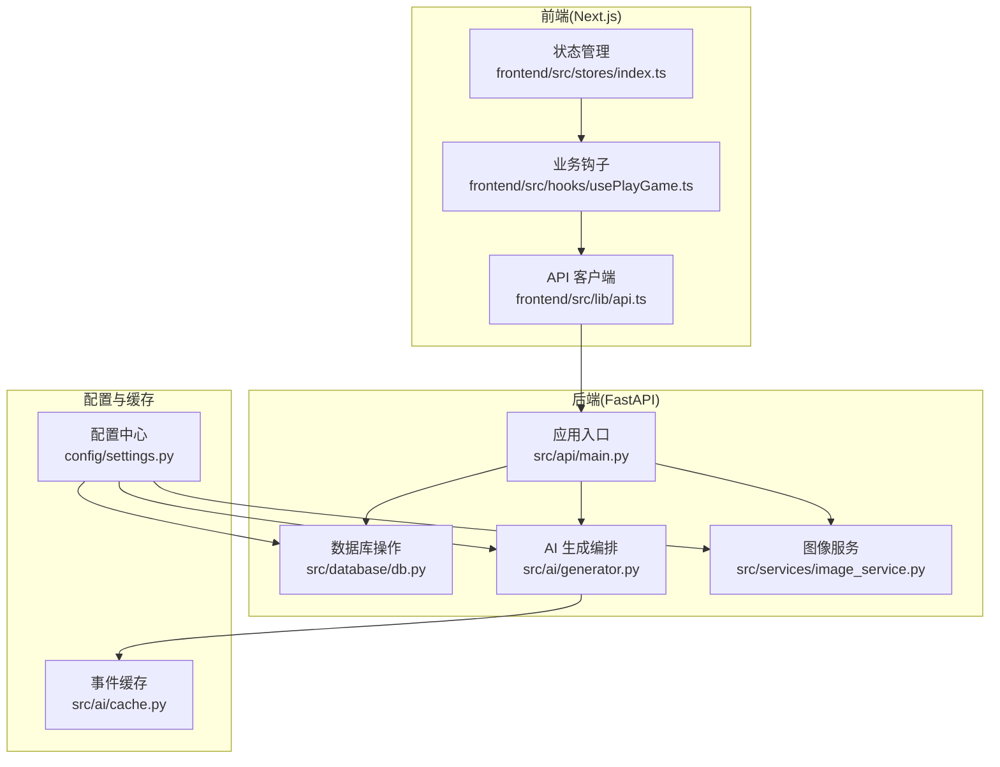
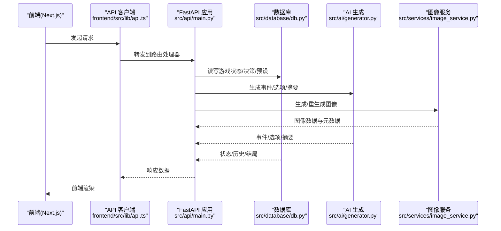
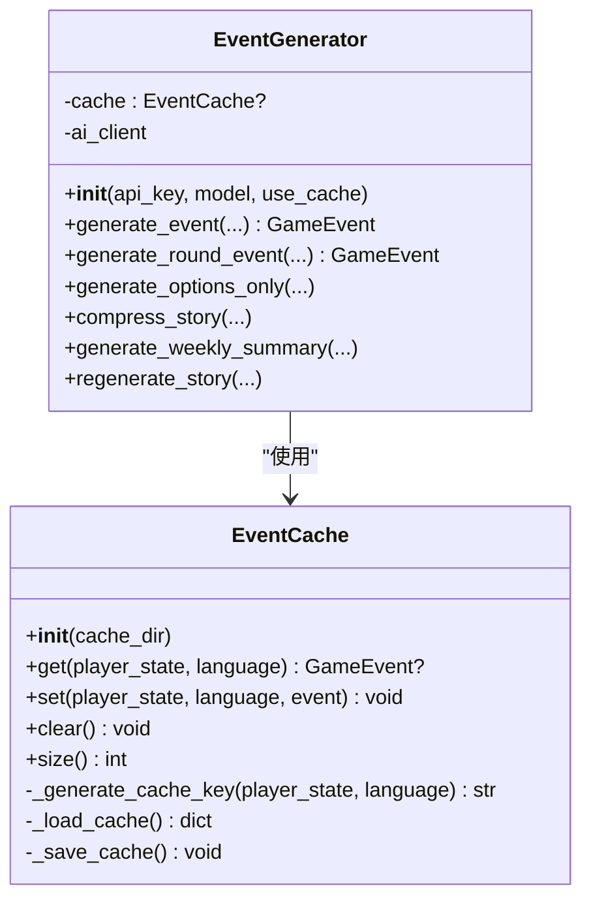
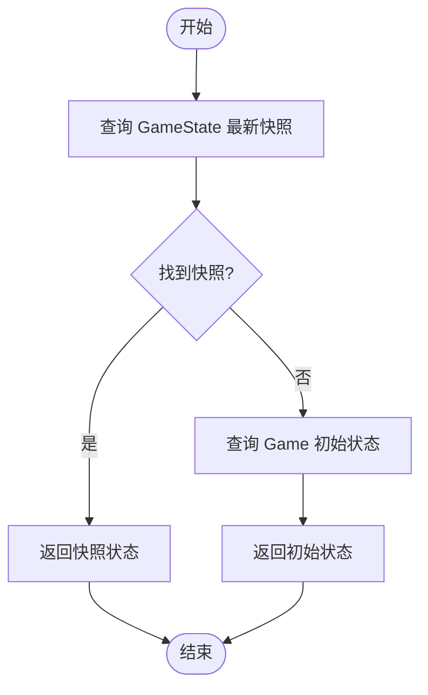
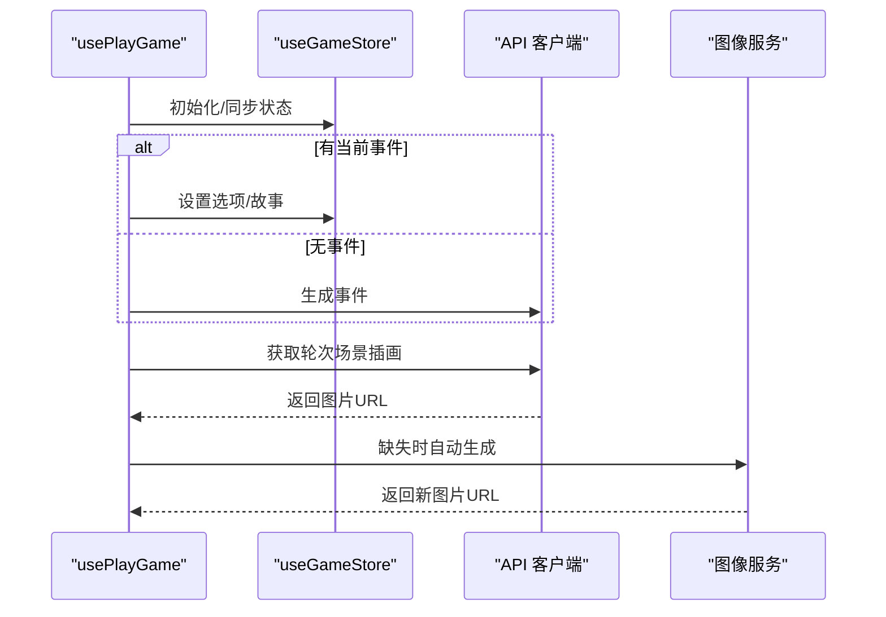
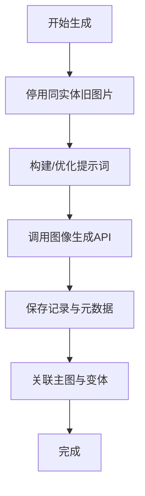
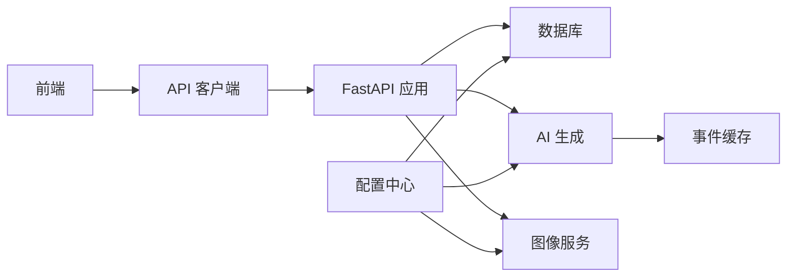

# 性能优化与重构指南

<cite>
**本文档引用的文件**
- [README.md](file://README.md)
- [requirements.txt](file://requirements.txt)
- [src/ai/cache.py](file://src/ai/cache.py)
- [src/ai/generator.py](file://src/ai/generator.py)
- [src/database/db.py](file://src/database/db.py)
- [frontend/src/stores/index.ts](file://frontend/src/stores/index.ts)
- [frontend/src/hooks/usePlayGame.ts](file://frontend/src/hooks/usePlayGame.ts)
- [src/services/image_service.py](file://src/services/image_service.py)
- [config/settings.py](file://config/settings.py)
- [src/api/main.py](file://src/api/main.py)
- [frontend/src/lib/api.ts](file://frontend/src/lib/api.ts)
- [tests/performance/locustfile.py](file://tests/performance/locustfile.py)
</cite>

## 目录
1. [引言](#引言)
2. [项目结构](#项目结构)
3. [核心组件](#核心组件)
4. [架构总览](#架构总览)
5. [详细组件分析](#详细组件分析)
6. [依赖关系分析](#依赖关系分析)
7. [性能考量](#性能考量)
8. [故障排查指南](#故障排查指南)
9. [结论](#结论)
10. [附录](#附录)

## 引言
本指南面向“人生草稿本”项目的性能优化与重构工作，目标是在不牺牲功能与用户体验的前提下，系统性地提升系统的响应速度、吞吐能力与稳定性。重点覆盖以下方面：
- AI生成缓存机制与数据库查询优化
- 前端状态管理与渲染性能优化
- 图像生成与存储性能提升
- 缓存策略设计（AI响应、图像、状态）
- 异步处理与并发策略
- 内存管理与垃圾回收优化
- 性能监控与分析方法
- 性能测试与基准测试实践

## 项目结构
项目采用前后端分离架构，后端基于 FastAPI，前端基于 Next.js，AI 生成与图像生成通过服务层进行编排，数据库采用 SQLAlchemy ORM。

图表来源
- [src/api/main.py](file://src/api/main.py#L35-L90)
- [frontend/src/lib/api.ts](file://frontend/src/lib/api.ts#L1-L564)
- [frontend/src/hooks/usePlayGame.ts](file://frontend/src/hooks/usePlayGame.ts#L1-L455)
- [frontend/src/stores/index.ts](file://frontend/src/stores/index.ts#L1-L27)
- [src/ai/generator.py](file://src/ai/generator.py#L30-L66)
- [src/ai/cache.py](file://src/ai/cache.py#L13-L27)
- [src/services/image_service.py](file://src/services/image_service.py#L30-L50)
- [src/database/db.py](file://src/database/db.py#L13-L20)
- [config/settings.py](file://config/settings.py#L27-L168)

章节来源
- [README.md](file://README.md#L74-L87)
- [requirements.txt](file://requirements.txt#L1-L12)

## 核心组件
- AI 事件生成与缓存：EventGenerator 作为门面，委托 StoryGenerator、OptionGenerator、SummaryGenerator、StoryRewriter，并集成 EventCache 降低 API 调用成本。
- 数据库层：GameDatabase 提供游戏状态、决策、结局、预设等持久化能力，支持查询优化与事务控制。
- 图像服务：ImageService 协调图像生成、存储与数据库记录，支持人物、地点、物品与开场插画生成，以及重生成与新鲜生成策略。
- 前端状态与交互：usePlayGame 集成多个子钩子，负责回合推进、选项处理、历史查看、场景插画加载与自动生成。
- 配置中心：Settings 统一管理 API 密钥、模型、存储、超时、语言等参数。

章节来源
- [src/ai/generator.py](file://src/ai/generator.py#L30-L66)
- [src/ai/cache.py](file://src/ai/cache.py#L13-L27)
- [src/database/db.py](file://src/database/db.py#L13-L20)
- [src/services/image_service.py](file://src/services/image_service.py#L30-L50)
- [frontend/src/hooks/usePlayGame.ts](file://frontend/src/hooks/usePlayGame.ts#L26-L56)
- [config/settings.py](file://config/settings.py#L27-L168)

## 架构总览
后端通过 FastAPI 提供 REST 接口，前端通过统一 API 客户端发起请求；AI 与图像生成由服务层编排，数据库提供持久化；配置中心贯穿各层。

图表来源
- [frontend/src/lib/api.ts](file://frontend/src/lib/api.ts#L69-L124)
- [src/api/main.py](file://src/api/main.py#L80-L90)
- [src/database/db.py](file://src/database/db.py#L139-L164)
- [src/ai/generator.py](file://src/ai/generator.py#L211-L268)
- [src/services/image_service.py](file://src/services/image_service.py#L51-L182)

## 详细组件分析

### AI 事件生成与缓存优化
- 事件缓存策略
  - 基于玩家状态的关键字段（年龄、能量、心情、知识、财富、周数、决策次数、语言）生成哈希键，减少重复请求。
  - 仅以一定概率命中缓存，保证多样性。
  - 缓存序列化为最小必要字段，避免冗余。
- 生成流程优化
  - EventGenerator 作为门面，按需委托子服务，避免单体类膨胀。
  - 支持强制刷新(force)与预设里程碑事件优先策略。
- 配置与开关
  - settings.CACHE_EVENTS 控制是否启用缓存。
  - 事件缓存目录与文件路径在配置中集中管理。

图表来源
- [src/ai/cache.py](file://src/ai/cache.py#L13-L139)
- [src/ai/generator.py](file://src/ai/generator.py#L30-L66)

章节来源
- [src/ai/cache.py](file://src/ai/cache.py#L47-L128)
- [src/ai/generator.py](file://src/ai/generator.py#L211-L268)
- [config/settings.py](file://config/settings.py#L70-L73)

### 数据库查询优化
- 查询路径优化
  - 加载最新状态优先查询 GameState 并按周倒序取第一条，无快照时回退到初始状态。
  - 决策历史按周正序返回，便于前端展示。
  - 搜索历史故事时逐条扫描并提前终止，限制最大结果数。
- 事务与异常
  - 保存进度与删除游戏均使用 try/finally 关闭会话，异常时回滚并记录日志。
- 多表关联与权限
  - 活跃游戏设置/获取/清理通过 User 表 last_active_game_id 字段维护，结合 Game 表 user_id 验证所有权。

图表来源
- [src/database/db.py](file://src/database/db.py#L139-L163)

章节来源
- [src/database/db.py](file://src/database/db.py#L139-L282)
- [src/database/db.py](file://src/database/db.py#L603-L679)

### 前端状态管理与渲染优化
- 状态拆分与组合
  - stores/index.ts 统一导出主 store 与子 store，便于按需订阅。
  - usePlayGame 通过多个子钩子（usePhaseManager、useEventGenerator、useChoiceHandler、useGameState、useHistoryViewer）解耦业务逻辑。
- 插画加载与自动生成
  - 首次进入与轮次变化时触发 fetchRoundSceneImage；若缺失则在 options/result 阶段自动触发 generateRoundSceneImage。
  - 支持批量加载 fetchAllRoundSceneImages，减少多次请求。
- 会话恢复
  - 若本地无 gameId，尝试服务端恢复（getActive），失败则跳转首页。

图表来源
- [frontend/src/hooks/usePlayGame.ts](file://frontend/src/hooks/usePlayGame.ts#L26-L56)
- [frontend/src/hooks/usePlayGame.ts](file://frontend/src/hooks/usePlayGame.ts#L332-L375)
- [frontend/src/lib/api.ts](file://frontend/src/lib/api.ts#L458-L520)

章节来源
- [frontend/src/stores/index.ts](file://frontend/src/stores/index.ts#L1-L27)
- [frontend/src/hooks/usePlayGame.ts](file://frontend/src/hooks/usePlayGame.ts#L26-L56)
- [frontend/src/hooks/usePlayGame.ts](file://frontend/src/hooks/usePlayGame.ts#L332-L375)
- [frontend/src/lib/api.ts](file://frontend/src/lib/api.ts#L401-L520)

### 图像生成性能提升
- 生成策略
  - 人物像：支持参考图片（保持一致性），主图与变体关联，停用旧版本图片。
  - 场景插画：支持按阶段生成（event/result），支持用户反馈与当前插画作为参考。
  - 开场插画：可结合玩家形象与故事文本生成，支持重新生成与新鲜生成（DeepSeek 优化 prompt）。
- 错误处理
  - 内容审核失败、生成失败、存储失败分别抛出特定异常，避免部分回滚导致的数据不一致。
- 配置与超时
  - IMAGE_GENERATION_TIMEOUT、IMAGE_MAX_RETRIES、TEXT_TO_IMAGE_MODELS、IMAGE_EDIT_MODELS 等参数集中管理。

图表来源
- [src/services/image_service.py](file://src/services/image_service.py#L51-L182)
- [src/services/image_service.py](file://src/services/image_service.py#L632-L761)

章节来源
- [src/services/image_service.py](file://src/services/image_service.py#L51-L182)
- [src/services/image_service.py](file://src/services/image_service.py#L632-L761)
- [config/settings.py](file://config/settings.py#L56-L69)

### 缓存策略设计
- AI 响应缓存
  - 事件缓存：按状态签名生成键，定期命中率控制，文件持久化。
  - 预设事件：里程碑事件优先，避免重复生成。
- 图像缓存
  - 本地存储：按游戏/实体/版本组织目录，支持 OSS 配置。
  - 数据库索引：按 game_id、entity_key、is_active、version 等字段建立查询条件。
- 状态缓存
  - 前端：useGameStore 管理当前回合、故事文本、事件、选项、插画等，避免重复拉取。
  - 后端：GameDatabase 的 GameState 快照表用于快速恢复。

章节来源
- [src/ai/cache.py](file://src/ai/cache.py#L47-L128)
- [src/ai/generator.py](file://src/ai/generator.py#L178-L208)
- [src/database/db.py](file://src/database/db.py#L139-L163)
- [config/settings.py](file://config/settings.py#L46-L55)

### 异步处理与并发策略
- SSE 与非流式回退
  - 前端提供 SSE 通道与非流式同步接口，移动端或网络受限场景可回退至同步模式。
- 并发控制
  - 事件生成与图像生成均支持 AbortController 控制取消，避免竞态与资源浪费。
  - 前端 usePlayGame 中对生成、轮询、预取等状态进行引用管理，防止重复触发。

章节来源
- [frontend/src/lib/api.ts](file://frontend/src/lib/api.ts#L354-L377)
- [frontend/src/hooks/usePlayGame.ts](file://frontend/src/hooks/usePlayGame.ts#L68-L78)

### 内存管理与垃圾回收优化
- 前端
  - 合理使用 React Hooks 的引用(ref)与状态，避免不必要的重渲染。
  - 对图片数据采用 URL.createObjectURL 或直接使用服务器返回的 URL，避免在内存中长期持有大对象。
- 后端
  - 数据库会话使用 try/finally 确保关闭，异常时回滚。
  - 图像生成与存储流程中及时释放中间变量，避免长时间占用内存。

章节来源
- [src/database/db.py](file://src/database/db.py#L356-L383)
- [src/services/image_service.py](file://src/services/image_service.py#L100-L182)

## 依赖关系分析
- 组件耦合
  - EventGenerator 与 EventCache 解耦，便于替换缓存实现。
  - ImageService 依赖 ImageClient 与 ImageStorageService，职责清晰。
  - 前端 usePlayGame 通过子钩子解耦，提高可维护性。
- 外部依赖
  - OpenAI 兼容接口、图像生成接口、数据库驱动、存储服务（本地/OSS）。

图表来源
- [src/api/main.py](file://src/api/main.py#L80-L90)
- [src/ai/generator.py](file://src/ai/generator.py#L30-L66)
- [src/services/image_service.py](file://src/services/image_service.py#L30-L50)
- [config/settings.py](file://config/settings.py#L27-L168)

章节来源
- [src/api/main.py](file://src/api/main.py#L35-L90)
- [src/ai/generator.py](file://src/ai/generator.py#L30-L66)
- [src/services/image_service.py](file://src/services/image_service.py#L30-L50)
- [config/settings.py](file://config/settings.py#L27-L168)

## 性能考量
- 降低外部依赖开销
  - 启用 AI 事件缓存，减少 LLM 调用次数；合理设置命中率与缓存键。
  - 图像生成采用参考图片策略，减少重复生成成本。
- 数据库查询优化
  - 使用索引友好的查询条件（game_id、week、created_at 等）。
  - 限制搜索结果数量，避免全表扫描。
- 前端渲染与网络
  - 使用懒加载与分页，避免一次性渲染大量节点。
  - 合理缓存图片与文本，减少重复请求。
- 异步与并发
  - 使用 AbortController 控制请求生命周期，避免资源泄漏。
  - SSE 与同步回退双通道，提升弱网体验。

## 故障排查指南
- 健康检查
  - /api/health 返回活动会话数，可用于快速判断后端健康状况。
- 日志收集
  - /api/client-log 接收前端上报的日志，便于定位移动端问题。
- 数据库异常
  - 保存进度失败时会记录错误并回滚，检查日志定位具体原因。
- 图像生成异常
  - 内容审核失败、生成失败、存储失败均有专门异常类型，前端可根据错误类型提示用户。

章节来源
- [src/api/main.py](file://src/api/main.py#L92-L134)
- [src/database/db.py](file://src/database/db.py#L356-L383)
- [src/services/image_service.py](file://src/services/image_service.py#L18-L28)

## 结论
通过引入与完善缓存、优化数据库查询、提升图像生成效率、改善前端状态管理与异步处理，以及建立完善的性能监控与测试体系，“人生草稿本”可以在保持高质量叙事体验的同时，显著提升系统性能与稳定性。建议在迭代过程中持续关注关键指标，结合负载测试与回归测试，逐步完善性能基线。

## 附录

### 性能监控与分析方法
- 关键指标
  - 响应时间（P50/P90/P95）、吞吐量（QPS）、错误率、缓存命中率、数据库查询耗时、图像生成耗时。
- 工具与实践
  - 使用 Locust 进行负载测试，覆盖匿名用户、游戏玩家、压力测试场景。
  - 前端上报 /api/client-log，结合后端日志定位问题。
  - 数据库慢查询日志与执行计划分析。

章节来源
- [tests/performance/locustfile.py](file://tests/performance/locustfile.py#L1-L224)
- [src/api/main.py](file://src/api/main.py#L102-L134)

### 性能测试与基准测试
- 基准测试建议
  - 事件生成：固定玩家状态与语言，测量平均耗时与标准差。
  - 图像生成：固定 prompt 与参考图片，测量生成耗时与成功率。
  - 数据库：构造典型查询（加载最新状态、决策历史、搜索关键字），测量响应时间分布。
- 回归测试
  - 将关键路径纳入自动化测试，确保性能回归不恶化。

章节来源
- [tests/performance/locustfile.py](file://tests/performance/locustfile.py#L96-L179)