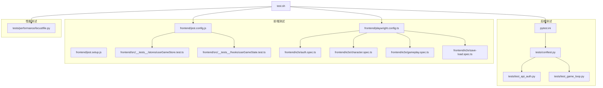
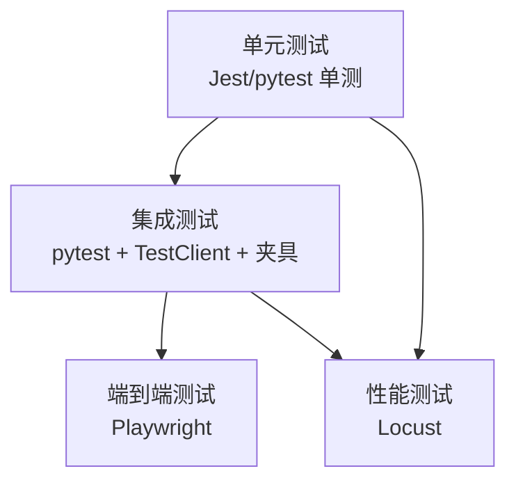
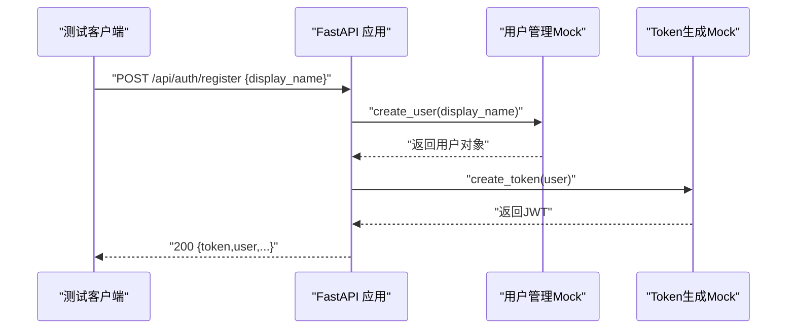
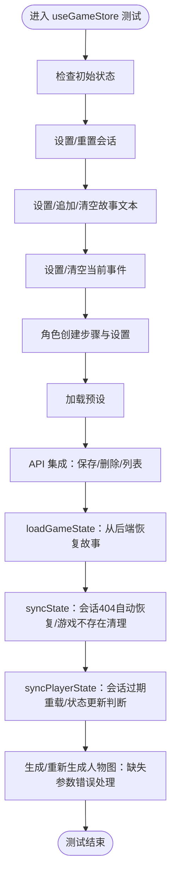
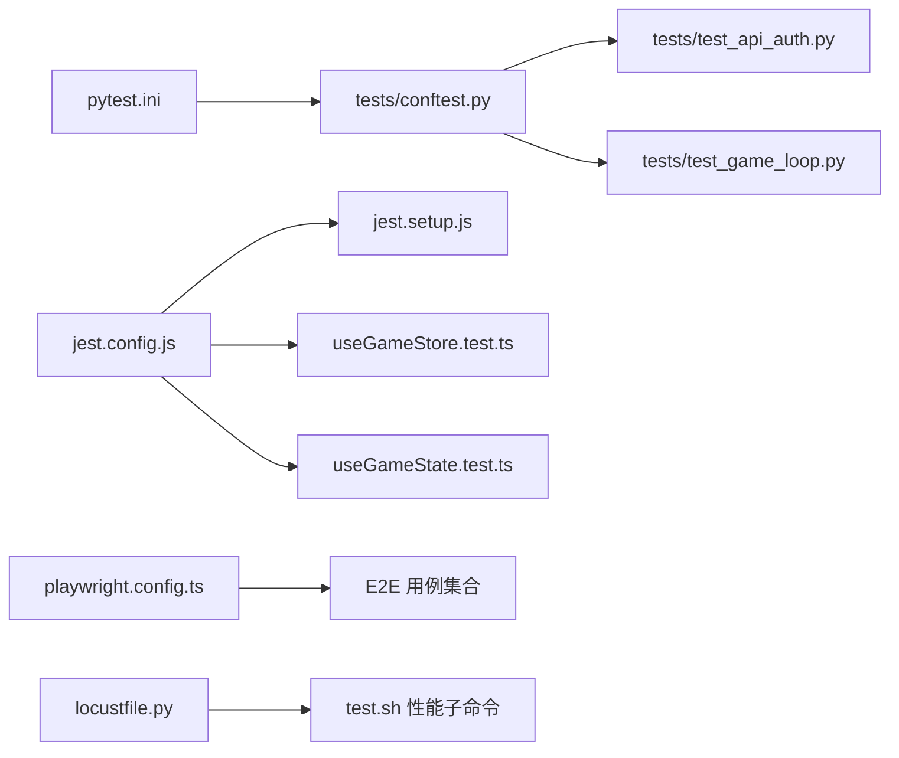

# 测试要求与质量保证

<cite>
**本文引用的文件**
- [TEST_COVERAGE_REPORT.md](file://TEST_COVERAGE_REPORT.md)
- [TEST_COVERAGE_PROGRESS.md](file://TEST_COVERAGE_PROGRESS.md)
- [TEST_COVERAGE_PLAN.md](file://frontend/TEST_COVERAGE_PLAN.md)
- [pytest.ini](file://pytest.ini)
- [jest.config.js](file://frontend/jest.config.js)
- [jest.setup.js](file://frontend/jest.setup.js)
- [test.sh](file://test.sh)
- [playwright.config.ts](file://frontend/playwright.config.ts)
- [locustfile.py](file://tests/performance/locustfile.py)
- [conftest.py](file://tests/conftest.py)
- [useGameStore.test.ts](file://frontend/src/__tests__/stores/useGameStore.test.ts)
- [useGameState.test.ts](file://frontend/src/__tests__/hooks/useGameState.test.ts)
- [test_api_auth.py](file://tests/test_api_auth.py)
- [test_game_loop.py](file://tests/test_game_loop.py)
</cite>

## 目录
1. [引言](#引言)
2. [项目结构](#项目结构)
3. [核心组件](#核心组件)
4. [架构总览](#架构总览)
5. [详细组件分析](#详细组件分析)
6. [依赖分析](#依赖分析)
7. [性能考虑](#性能考虑)
8. [故障排查指南](#故障排查指南)
9. [结论](#结论)
10. [附录](#附录)

## 引言
本文件面向“人生草稿本”项目，提供系统化的测试要求与质量保证方案。内容涵盖测试金字塔结构、覆盖率目标与现状、测试用例编写规范、测试环境配置、性能与负载测试、测试执行命令与脚本、测试报告与分析方法，以及测试优化计划与改进措施。目标是帮助开发与测试团队建立一致的测试实践，确保代码质量与交付稳定性。

## 项目结构
项目采用前后端分离的测试布局：
- 后端（Python）：pytest 测试框架，集中于 tests/ 目录，配合 pytest.ini、conftest.py 提供共享夹具与全局配置。
- 前端（Next.js/Jest）：Jest 单元测试与 Playwright 端到端测试，分别位于 frontend/src/__tests__/ 与 frontend/e2e/；Jest 配置位于 frontend/jest.config.js，初始化脚本在 frontend/jest.setup.js。
- 性能测试：Locust 负载测试位于 tests/performance/locustfile.py。
- 测试脚本：统一入口脚本 test.sh 支持后端、前端、E2E、覆盖率、性能、安全扫描与全量测试。

图表来源
- [pytest.ini](file://pytest.ini#L1-L8)
- [conftest.py](file://tests/conftest.py#L1-L337)
- [test_api_auth.py](file://tests/test_api_auth.py#L1-L276)
- [test_game_loop.py](file://tests/test_game_loop.py#L1-L76)
- [jest.config.js](file://frontend/jest.config.js#L1-L38)
- [jest.setup.js](file://frontend/jest.setup.js#L1-L61)
- [useGameStore.test.ts](file://frontend/src/__tests__/stores/useGameStore.test.ts#L1-L974)
- [useGameState.test.ts](file://frontend/src/__tests__/hooks/useGameState.test.ts#L1-L335)
- [playwright.config.ts](file://frontend/playwright.config.ts#L1-L58)
- [locustfile.py](file://tests/performance/locustfile.py#L1-L224)
- [test.sh](file://test.sh#L1-L232)

章节来源
- [pytest.ini](file://pytest.ini#L1-L8)
- [jest.config.js](file://frontend/jest.config.js#L1-L38)
- [playwright.config.ts](file://frontend/playwright.config.ts#L1-L58)
- [test.sh](file://test.sh#L1-L232)

## 核心组件
- 后端测试：以 pytest 为核心，通过 conftest.py 提供 TestClient、数据库内存引擎、会话存储、用户管理、AI 客户端等通用夹具，覆盖认证、角色、游戏、图片、SSE 等路由与模块。
- 前端测试：Jest 单测覆盖 hooks、stores、components、lib 工具与页面；Playwright 端到端覆盖登录、角色创建、游戏玩法与存档加载。
- 性能测试：Locust 负载测试，模拟匿名浏览、认证玩家与高压场景，支持 Web UI 与 Headless 模式。
- 统一测试脚本：test.sh 封装后端、前端、E2E、覆盖率、性能、安全扫描与全量测试，便于本地与 CI 使用。

章节来源
- [conftest.py](file://tests/conftest.py#L1-L337)
- [useGameStore.test.ts](file://frontend/src/__tests__/stores/useGameStore.test.ts#L1-L974)
- [useGameState.test.ts](file://frontend/src/__tests__/hooks/useGameState.test.ts#L1-L335)
- [test_api_auth.py](file://tests/test_api_auth.py#L1-L276)
- [test_game_loop.py](file://tests/test_game_loop.py#L1-L76)
- [locustfile.py](file://tests/performance/locustfile.py#L1-L224)
- [test.sh](file://test.sh#L1-L232)

## 架构总览
测试架构遵循金字塔模型：
- 单元测试（Unit）：Jest 单测与 pytest 单测，覆盖函数、类、钩子、store、工具函数与路由层逻辑。
- 集成测试（Integration）：pytest 通过 TestClient 与夹具组合，验证路由、数据库交互、会话与外部依赖（AI、图片）的协作。
- 端到端测试（E2E）：Playwright 在真实浏览器中验证用户路径与关键业务流程。

[本图为概念性架构示意，不直接映射具体源码文件，故无图表来源]

## 详细组件分析

### 后端测试：认证路由与游戏循环
- 认证路由测试要点：注册（成功/失败、空名、超长名）、登录（成功/失败、空私有ID）、获取当前用户（无/无效/不存在令牌）、登出（无状态）、Cookie 优先于 Header 的认证策略。
- 游戏循环测试要点：新建游戏、加载游戏、推进周次、游戏结束判定、进度查询。

图表来源
- [test_api_auth.py](file://tests/test_api_auth.py#L32-L75)
- [conftest.py](file://tests/conftest.py#L174-L190)

章节来源
- [test_api_auth.py](file://tests/test_api_auth.py#L1-L276)
- [test_game_loop.py](file://tests/test_game_loop.py#L1-L76)
- [conftest.py](file://tests/conftest.py#L1-L337)

### 前端测试：状态管理与游戏状态钩子
- useGameStore 测试：覆盖初始状态、会话管理、故事文本、事件管理、角色创建步骤、预设加载、保存/删除、开场故事、核心方法（加载状态、同步状态、同步玩家状态、生成/重新生成人物图）。
- useGameState 测试：覆盖保存、继续回合、调整故事、重新生成（含 SSE 回调与错误处理）、toast 状态管理。

图表来源
- [useGameStore.test.ts](file://frontend/src/__tests__/stores/useGameStore.test.ts#L48-L805)

章节来源
- [useGameStore.test.ts](file://frontend/src/__tests__/stores/useGameStore.test.ts#L1-L974)
- [useGameState.test.ts](file://frontend/src/__tests__/hooks/useGameState.test.ts#L1-L335)

### 端到端测试：Playwright 配置与用例
- Playwright 配置：并行运行、重试策略、报告器、设备项目（Chrome/Safari）、本地开发服务器启动、超时与截图策略。
- E2E 用例：认证、角色创建、游戏玩法、存档加载，均通过。

章节来源
- [playwright.config.ts](file://frontend/playwright.config.ts#L1-L58)
- [TEST_COVERAGE_REPORT.md](file://TEST_COVERAGE_REPORT.md#L65-L73)

### 性能测试：Locust 负载场景
- 用户类型与权重：匿名用户（30%）、游戏玩家（50%）、高压用户（20%）。
- 请求场景：健康检查、API 文档、注册、获取存档、获取预设、创建游戏、快速健康检查与列表请求等。
- 运行模式：Web UI 与 Headless（CI），支持指定用户数、上升速率与持续时间。

章节来源
- [locustfile.py](file://tests/performance/locustfile.py#L1-L224)
- [test.sh](file://test.sh#L101-L120)

## 依赖分析
- 后端依赖：pytest、fastapi.TestClient、SQLAlchemy 内存数据库、unittest.mock、外部 AI/图片服务通过夹具 Mock。
- 前端依赖：Jest、React Testing Library、JSDOM、next/navigation Mock、Clipboard 与媒体查询 Mock、IntersectionObserver/ResizeObserver Mock。
- 性能依赖：Locust、httpx（在 Locust 中用于请求）。

图表来源
- [pytest.ini](file://pytest.ini#L1-L8)
- [conftest.py](file://tests/conftest.py#L1-L337)
- [test_api_auth.py](file://tests/test_api_auth.py#L1-L276)
- [test_game_loop.py](file://tests/test_game_loop.py#L1-L76)
- [jest.config.js](file://frontend/jest.config.js#L1-L38)
- [jest.setup.js](file://frontend/jest.setup.js#L1-L61)
- [useGameStore.test.ts](file://frontend/src/__tests__/stores/useGameStore.test.ts#L1-L974)
- [useGameState.test.ts](file://frontend/src/__tests__/hooks/useGameState.test.ts#L1-L335)
- [playwright.config.ts](file://frontend/playwright.config.ts#L1-L58)
- [locustfile.py](file://tests/performance/locustfile.py#L1-L224)
- [test.sh](file://test.sh#L101-L120)

## 性能考虑
- 响应时间与吞吐：Locust 测试中对 5xx/4xx 响应进行失败标记，便于识别性能瓶颈与错误率。
- 并发用户数：通过 Locust 的用户数（-u）与每秒启动数（-r）参数控制并发强度，结合 Headless 模式适合 CI。
- 数据库与外部依赖：后端测试使用内存数据库与 Mock，避免真实依赖影响性能测试稳定性。

章节来源
- [locustfile.py](file://tests/performance/locustfile.py#L47-L61)
- [conftest.py](file://tests/conftest.py#L74-L127)

## 故障排查指南
- 前端覆盖率阈值：当前 jest.config.js 设定了全局覆盖率阈值，如需调整可参考配置文件中的 global 节点。
- 跳过测试：部分前端测试因 Jest hoisting 问题被临时跳过，可参考进度报告中的“已跳过测试”与“后续优化”建议。
- E2E 配置：Playwright 配置中设置了本地开发服务器启动与截图策略，若 CI 报错可检查 webServer 配置与端口占用。
- 后端异步测试：pytest.ini 已启用 asyncio_mode = auto，确保异步测试正常运行。

章节来源
- [jest.config.js](file://frontend/jest.config.js#L23-L30)
- [TEST_COVERAGE_PROGRESS.md](file://TEST_COVERAGE_PROGRESS.md#L134-L146)
- [playwright.config.ts](file://frontend/playwright.config.ts#L50-L57)
- [pytest.ini](file://pytest.ini#L7-L8)

## 结论
项目已建立较为完善的测试体系：后端 pytest、前端 Jest/RTL、Playwright E2E 与 Locust 性能测试协同工作。当前后端覆盖率约 61%，前端 Statements 约 71%；根据计划目标，前端 Statements/Functions/Lines 应达 75%+，后端整体覆盖率目标 70%+。建议持续推进覆盖率优化、引入 MSW 替代手动 API Mock、完善 E2E 配置，并在 CI 中加入覆盖率阈值检查与报告归档。

## 附录

### 测试金字塔结构与要求
- 单元测试：优先编写，关注函数/类/钩子/store 的边界与错误分支。
- 集成测试：验证路由、数据库、会话与外部依赖协作，重点覆盖认证、游戏状态、图片与 SSE。
- 端到端测试：覆盖关键用户路径，确保跨组件一致性与可用性。

章节来源
- [conftest.py](file://tests/conftest.py#L1-L337)
- [useGameStore.test.ts](file://frontend/src/__tests__/stores/useGameStore.test.ts#L1-L974)
- [useGameState.test.ts](file://frontend/src/__tests__/hooks/useGameState.test.ts#L1-L335)
- [playwright.config.ts](file://frontend/playwright.config.ts#L1-L58)

### 测试用例编写规范
- 命名约定：使用语义化描述，如 “handleSave 成功保存”、“会话404时自动恢复”。
- 断言标准：覆盖正常路径、异常路径、边界条件与错误提示。
- Mock 策略：API、SSE、Store、导航、剪贴板、媒体查询、观察者 API 等均需合理 Mock。

章节来源
- [useGameStore.test.ts](file://frontend/src/__tests__/stores/useGameStore.test.ts#L1-L974)
- [useGameState.test.ts](file://frontend/src/__tests__/hooks/useGameState.test.ts#L1-L335)
- [jest.setup.js](file://frontend/jest.setup.js#L1-L61)

### 测试环境配置
- 后端：pytest.ini 启用 asyncio；conftest.py 提供 TestClient、内存数据库、会话存储、用户管理、AI 客户端等夹具。
- 前端：jest.config.js 指定 jsdom 环境、TS 转换、覆盖率收集范围与阈值；jest.setup.js 提供导航、剪贴板、媒体查询与观察者 Mock。
- E2E：Playwright 配置本地开发服务器、设备项目与报告器。

章节来源
- [pytest.ini](file://pytest.ini#L1-L8)
- [conftest.py](file://tests/conftest.py#L1-L337)
- [jest.config.js](file://frontend/jest.config.js#L1-L38)
- [jest.setup.js](file://frontend/jest.setup.js#L1-L61)
- [playwright.config.ts](file://frontend/playwright.config.ts#L1-L58)

### 性能与负载测试要求
- 响应时间：通过 Locust 对关键接口进行压力与稳定性评估，关注 5xx/4xx 错误率。
- 并发用户数：按业务峰值的 1.5~2 倍设计并发，结合上升速率与持续时间进行压测。
- 场景覆盖：健康检查、注册、存档列表、创建游戏、获取状态等高频路径。

章节来源
- [locustfile.py](file://tests/performance/locustfile.py#L63-L179)
- [test.sh](file://test.sh#L101-L120)

### 测试执行命令与脚本使用
- 统一脚本：./test.sh 支持 backend、frontend、e2e、coverage、perf、security、all。
- 单独运行：后端 pytest、前端 npm test -- --coverage、E2E npx playwright test。
- 覆盖率报告：后端 HTML 报告、前端 LCOV/HTML 报告。

章节来源
- [test.sh](file://test.sh#L1-L232)
- [TEST_COVERAGE_REPORT.md](file://TEST_COVERAGE_REPORT.md#L159-L193)

### 测试报告生成与分析
- 后端：pytest --cov=src --cov-report=html:htmlcov/backend。
- 前端：npm test -- --coverage --coverageReporters=text --coverageReporters=html。
- 分析要点：关注 Statements/Branches/Functions/Lines 覆盖率，定位低覆盖率模块并补充测试。

章节来源
- [test.sh](file://test.sh#L77-L99)
- [TEST_COVERAGE_REPORT.md](file://TEST_COVERAGE_REPORT.md#L7-L50)

### 测试优化计划与改进措施
- 前端覆盖率目标：Statements/Functions/Lines ≥ 75%，Branches ≥ 65%；P0 模块覆盖率 ≥ 60%。
- 后端覆盖率目标：整体 ≥ 70%，低覆盖率模块（如图片服务、SSE、世界模型更新器）通过 Mock 与夹具补齐。
- 工具与策略：引入 MSW 替代手动 API Mock；使用 jest.isolateModules 解决 hoisting；在 CI 中加入覆盖率阈值检查。

章节来源
- [TEST_COVERAGE_PLAN.md](file://frontend/TEST_COVERAGE_PLAN.md#L1-L279)
- [TEST_COVERAGE_PROGRESS.md](file://TEST_COVERAGE_PROGRESS.md#L149-L262)
- [TEST_COVERAGE_REPORT.md](file://TEST_COVERAGE_REPORT.md#L196-L217)