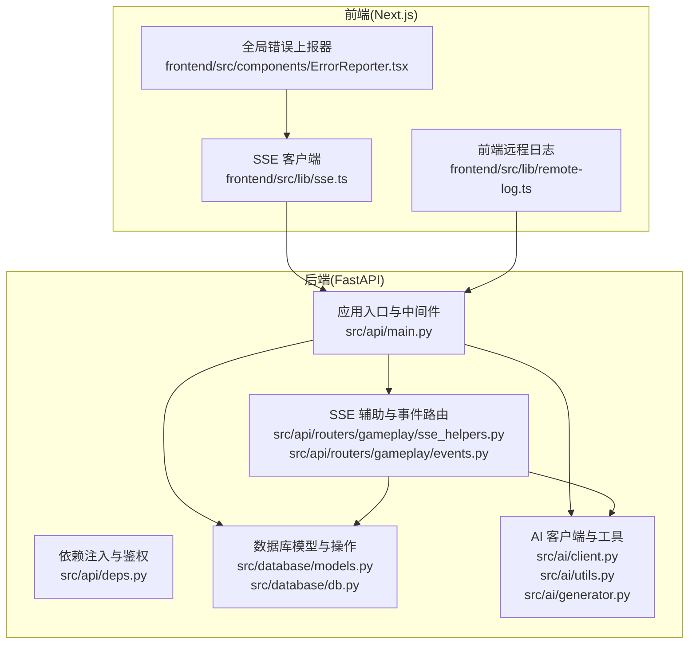
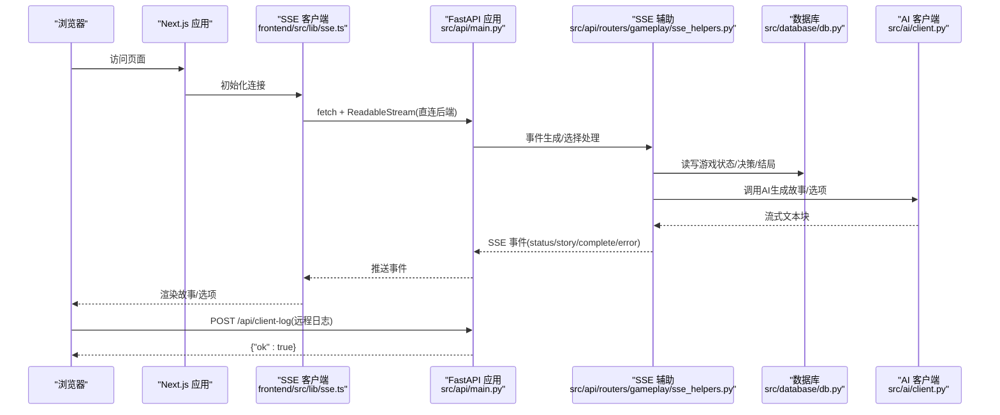
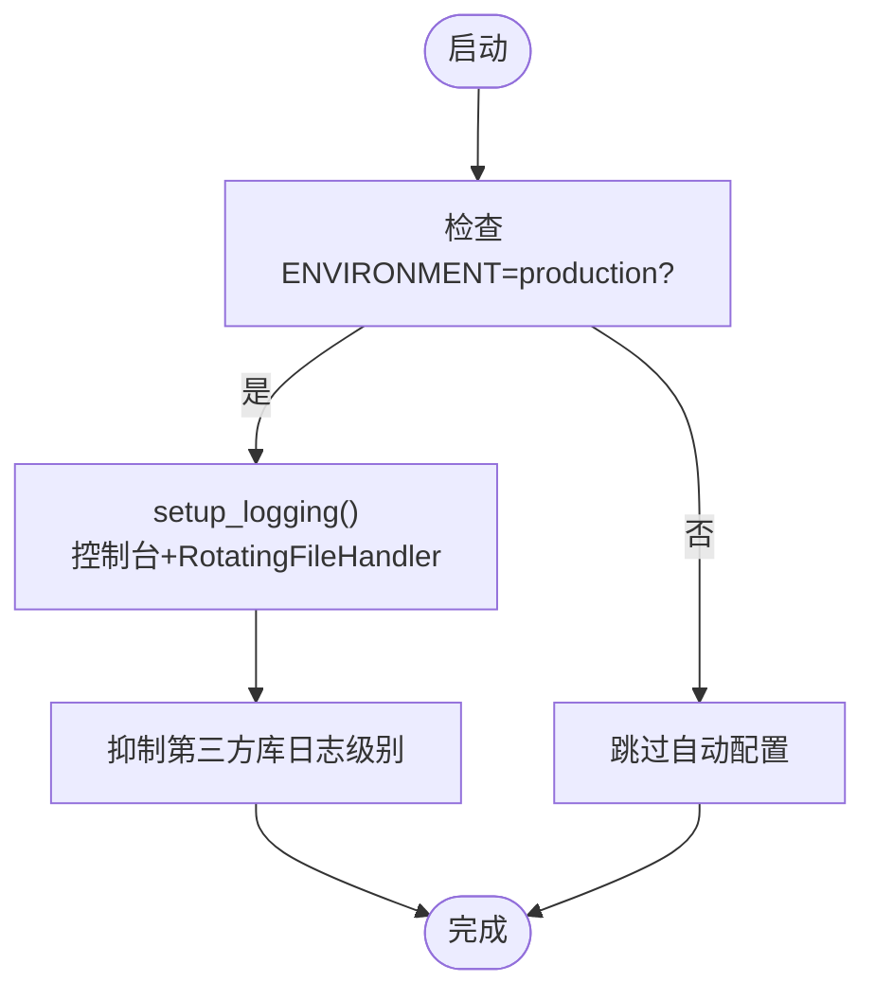
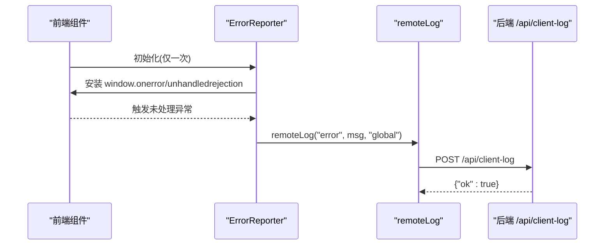
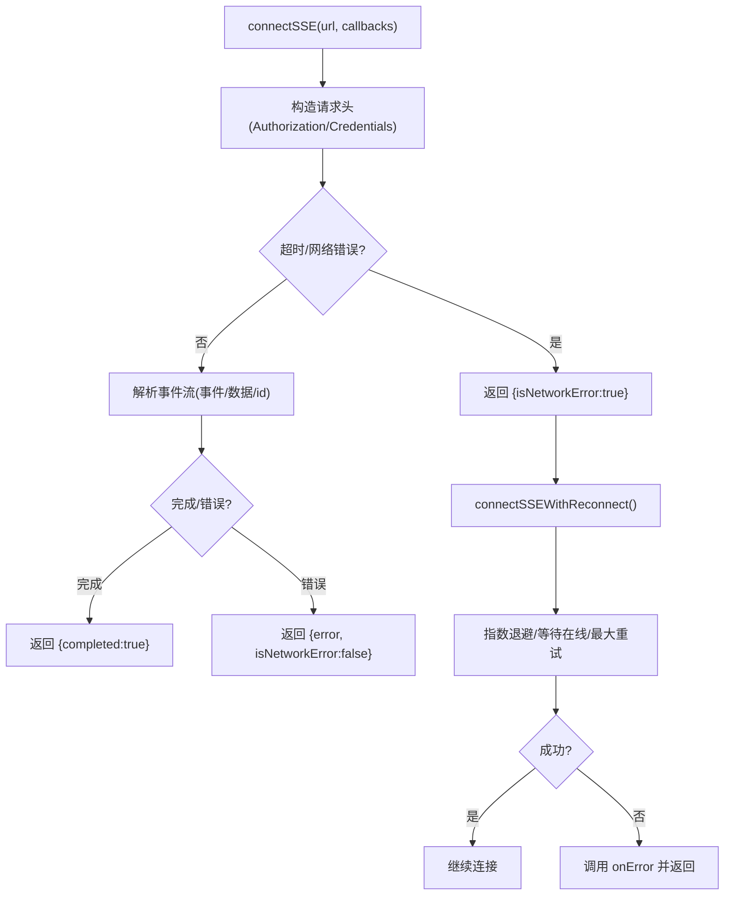
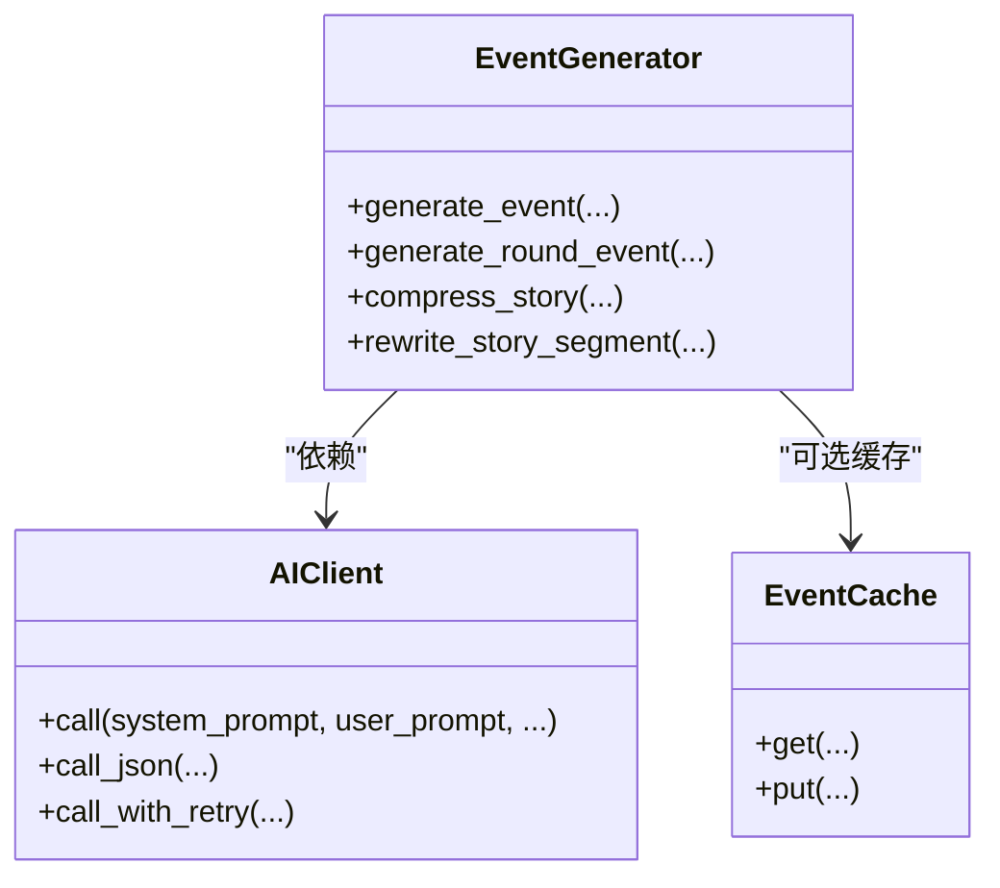
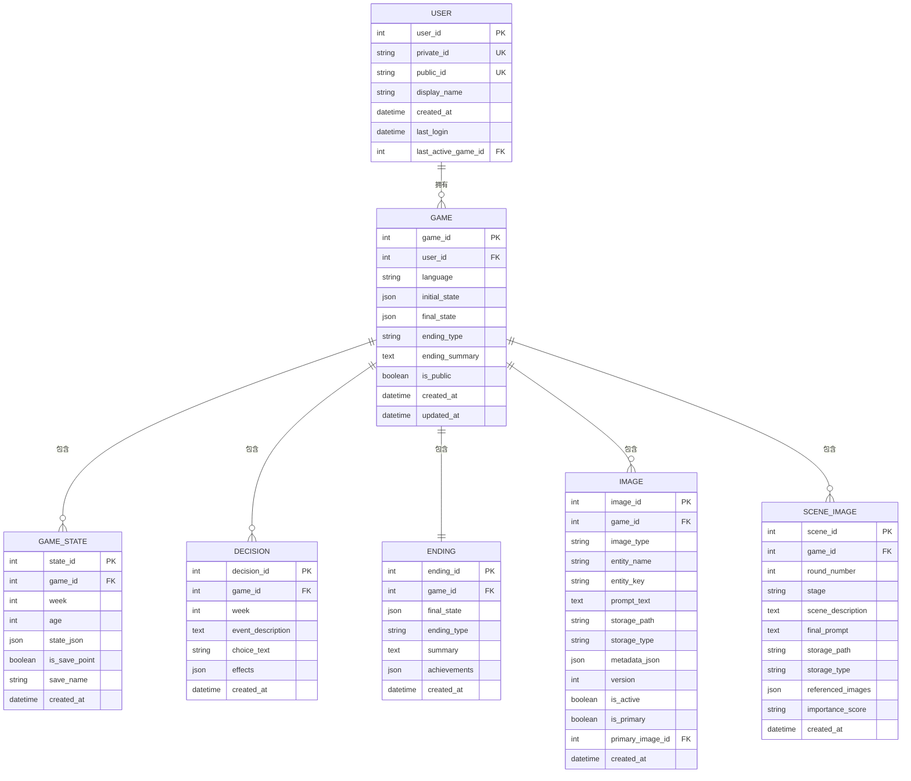
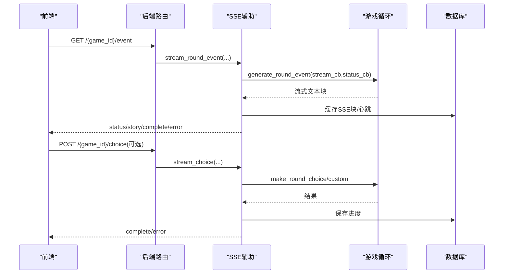
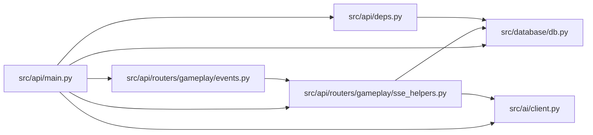

# 调试技巧与故障排除

<cite>
**本文引用的文件**
- [src/api/main.py](file://src/api/main.py)
- [config/logging_config.py](file://config/logging_config.py)
- [frontend/src/lib/remote-log.ts](file://frontend/src/lib/remote-log.ts)
- [frontend/src/components/ErrorReporter.tsx](file://frontend/src/components/ErrorReporter.tsx)
- [src/database/db.py](file://src/database/db.py)
- [src/database/models.py](file://src/database/models.py)
- [src/ai/client.py](file://src/ai/client.py)
- [src/ai/utils.py](file://src/ai/utils.py)
- [src/ai/generator.py](file://src/ai/generator.py)
- [src/api/routers/gameplay/events.py](file://src/api/routers/gameplay/events.py)
- [src/api/routers/gameplay/sse_helpers.py](file://src/api/routers/gameplay/sse_helpers.py)
- [frontend/src/lib/sse.ts](file://frontend/src/lib/sse.ts)
- [src/api/deps.py](file://src/api/deps.py)
- [config/settings.py](file://config/settings.py)
- [tests/performance/locustfile.py](file://tests/performance/locustfile.py)
</cite>

## 目录
1. [简介](#简介)
2. [项目结构](#项目结构)
3. [核心组件](#核心组件)
4. [架构总览](#架构总览)
5. [详细组件分析](#详细组件分析)
6. [依赖关系分析](#依赖关系分析)
7. [性能考虑](#性能考虑)
8. [故障排除指南](#故障排除指南)
9. [结论](#结论)
10. [附录](#附录)

## 简介
本文件面向“人生草稿本”项目的开发与运维团队，提供系统化的调试技巧与故障排除指南。内容涵盖：
- 后端与前端调试工具与方法
- AI服务连接与日志上报
- 数据库连接与一致性校验
- 前端组件渲染与API响应异常排查
- 性能问题诊断（内存、CPU、网络）
- 生产环境问题处理与应急响应
- 开发与生产环境调试差异
- 调试工具推荐与配置建议

## 项目结构
项目采用前后端分离架构，后端基于FastAPI，前端基于Next.js，AI服务通过统一客户端封装，数据库使用SQLAlchemy与SQLite/PostgreSQL。

图表来源
- [src/api/main.py](file://src/api/main.py#L1-L134)
- [frontend/src/lib/sse.ts](file://frontend/src/lib/sse.ts#L1-L520)
- [frontend/src/lib/remote-log.ts](file://frontend/src/lib/remote-log.ts#L1-L88)
- [frontend/src/components/ErrorReporter.tsx](file://frontend/src/components/ErrorReporter.tsx#L1-L16)
- [src/database/models.py](file://src/database/models.py#L1-L295)
- [src/database/db.py](file://src/database/db.py#L1-L910)
- [src/ai/client.py](file://src/ai/client.py#L1-L233)
- [src/ai/utils.py](file://src/ai/utils.py#L1-L77)
- [src/ai/generator.py](file://src/ai/generator.py#L1-L497)
- [src/api/routers/gameplay/sse_helpers.py](file://src/api/routers/gameplay/sse_helpers.py#L1-L562)
- [src/api/routers/gameplay/events.py](file://src/api/routers/gameplay/events.py#L1-L212)

章节来源
- [src/api/main.py](file://src/api/main.py#L1-L134)
- [frontend/src/lib/sse.ts](file://frontend/src/lib/sse.ts#L1-L520)
- [frontend/src/lib/remote-log.ts](file://frontend/src/lib/remote-log.ts#L1-L88)
- [frontend/src/components/ErrorReporter.tsx](file://frontend/src/components/ErrorReporter.tsx#L1-L16)
- [src/database/models.py](file://src/database/models.py#L1-L295)
- [src/database/db.py](file://src/database/db.py#L1-L910)
- [src/ai/client.py](file://src/ai/client.py#L1-L233)
- [src/ai/utils.py](file://src/ai/utils.py#L1-L77)
- [src/ai/generator.py](file://src/ai/generator.py#L1-L497)
- [src/api/routers/gameplay/sse_helpers.py](file://src/api/routers/gameplay/sse_helpers.py#L1-L562)
- [src/api/routers/gameplay/events.py](file://src/api/routers/gameplay/events.py#L1-L212)

## 核心组件
- 后端日志系统：集中配置与第三方库日志抑制，生产环境自动启用。
- 前端远程日志：统一上报前端错误到后端，便于移动端与跨端调试。
- SSE 流式通信：事件生成与选择处理的实时流，支持断点续传与自动重连。
- AI 客户端：统一的AI调用抽象层，内置重试与错误反馈注入。
- 数据库模型与操作：支持本地SQLite与云数据库，提供一致性校验与缓存策略。
- 依赖注入与鉴权：JWT与Cookie双通道认证，支持iPad Safari等设备持久化。

章节来源
- [config/logging_config.py](file://config/logging_config.py#L1-L78)
- [src/api/main.py](file://src/api/main.py#L102-L134)
- [frontend/src/lib/remote-log.ts](file://frontend/src/lib/remote-log.ts#L1-L88)
- [frontend/src/lib/sse.ts](file://frontend/src/lib/sse.ts#L1-L520)
- [src/ai/client.py](file://src/ai/client.py#L1-L233)
- [src/database/models.py](file://src/database/models.py#L1-L295)
- [src/database/db.py](file://src/database/db.py#L1-L910)
- [src/api/deps.py](file://src/api/deps.py#L1-L150)

## 架构总览
下图展示了从浏览器到后端、再到AI与数据库的完整链路，以及关键的调试与日志节点。

图表来源
- [frontend/src/lib/sse.ts](file://frontend/src/lib/sse.ts#L1-L520)
- [src/api/main.py](file://src/api/main.py#L102-L134)
- [src/api/routers/gameplay/sse_helpers.py](file://src/api/routers/gameplay/sse_helpers.py#L1-L562)
- [src/database/db.py](file://src/database/db.py#L1-L910)
- [src/ai/client.py](file://src/ai/client.py#L1-L233)

## 详细组件分析

### 后端日志系统
- 配置项：控制台与滚动文件处理器、格式化器、第三方库日志级别抑制。
- 生产环境：通过环境变量自动启用，避免过多噪声。
- 使用方式：在各模块中获取logger并按级别记录；全局异常处理器统一记录未捕获异常。

图表来源
- [config/logging_config.py](file://config/logging_config.py#L71-L78)
- [src/api/main.py](file://src/api/main.py#L15-L21)

章节来源
- [config/logging_config.py](file://config/logging_config.py#L1-L78)
- [src/api/main.py](file://src/api/main.py#L15-L21)

### 前端远程日志与全局错误上报
- remoteLog：去重、fire-and-forget上报、自动补充上下文（URL、UA、IP）。
- ErrorReporter：在根布局安装全局错误捕获器，上报未处理异常与Promise拒绝。
- 后端/client-log：接收并记录，统一到“client”logger，便于集中检索。

图表来源
- [frontend/src/components/ErrorReporter.tsx](file://frontend/src/components/ErrorReporter.tsx#L1-L16)
- [frontend/src/lib/remote-log.ts](file://frontend/src/lib/remote-log.ts#L68-L88)
- [src/api/main.py](file://src/api/main.py#L117-L134)

章节来源
- [frontend/src/components/ErrorReporter.tsx](file://frontend/src/components/ErrorReporter.tsx#L1-L16)
- [frontend/src/lib/remote-log.ts](file://frontend/src/lib/remote-log.ts#L1-L88)
- [src/api/main.py](file://src/api/main.py#L102-L134)

### SSE 流式事件与自动重连
- 直连后端：避免Next.js代理缓冲导致的流式问题。
- 断点续传：Last-Event-ID头支持重连后继续。
- 自动重连：指数退避、离线等待、最大重试次数。
- 错误分类：网络错误可重试，服务器错误直接返回错误事件。
- 心跳与超时：定期心跳保持连接，整体超时保护。

图表来源
- [frontend/src/lib/sse.ts](file://frontend/src/lib/sse.ts#L120-L258)
- [frontend/src/lib/sse.ts](file://frontend/src/lib/sse.ts#L344-L440)

章节来源
- [frontend/src/lib/sse.ts](file://frontend/src/lib/sse.ts#L1-L520)

### AI 客户端与重试机制
- 统一调用：AIClient封装OpenAI调用，支持流式与非流式。
- 重试与反馈：call_with_retry在重试时注入上次错误，提升输出质量。
- JSON解析：extract_json增强鲁棒性，支持多种代码块包裹与正则提取。

图表来源
- [src/ai/client.py](file://src/ai/client.py#L22-L233)
- [src/ai/generator.py](file://src/ai/generator.py#L30-L497)
- [src/ai/utils.py](file://src/ai/utils.py#L10-L77)

章节来源
- [src/ai/client.py](file://src/ai/client.py#L1-L233)
- [src/ai/utils.py](file://src/ai/utils.py#L1-L77)
- [src/ai/generator.py](file://src/ai/generator.py#L1-L497)

### 数据库模型与一致性校验
- 支持本地SQLite与云数据库（通过settings.get_database_url）。
- 提供历史故事检索与关键词搜索，用于一致性验证与事实核查。
- 事务与回滚：保存失败时回滚，避免脏数据。
- 服务端会话恢复：记录last_active_game_id，支持自动恢复。

图表来源
- [src/database/models.py](file://src/database/models.py#L1-L295)
- [src/database/db.py](file://src/database/db.py#L213-L282)

章节来源
- [src/database/models.py](file://src/database/models.py#L1-L295)
- [src/database/db.py](file://src/database/db.py#L1-L910)

### 事件生成与选择处理（SSE）
- 事件路由：GET /{game_id}/event（SSE）、POST /{game_id}/event-sync（非流式回退）。
- 并发控制：游戏级锁与生成标志位，防止重复生成与超时卡死。
- 断点续传：Last-Event-ID支持重连后继续。
- 自动保存：事件生成/选择后自动保存游戏进度，支持恢复。

图表来源
- [src/api/routers/gameplay/events.py](file://src/api/routers/gameplay/events.py#L48-L212)
- [src/api/routers/gameplay/sse_helpers.py](file://src/api/routers/gameplay/sse_helpers.py#L137-L268)

章节来源
- [src/api/routers/gameplay/events.py](file://src/api/routers/gameplay/events.py#L1-L212)
- [src/api/routers/gameplay/sse_helpers.py](file://src/api/routers/gameplay/sse_helpers.py#L1-L562)

### 依赖注入与鉴权
- JWT与Cookie双通道：优先从Cookie读取，支持iPad Safari等设备持久化。
- 令牌解码：校验过期与有效性，缺失或无效返回401。
- 会话获取：从内存或数据库恢复，确保SSE重连可用。

章节来源
- [src/api/deps.py](file://src/api/deps.py#L1-L150)

### 配置与环境
- settings：统一读取OPENAI/图像/场景分析/数据库等配置，支持本地与云数据库切换。
- 环境变量：CORS_ORIGINS、JWT_SECRET、DATABASE_URL等。

章节来源
- [config/settings.py](file://config/settings.py#L1-L168)

## 依赖关系分析
- 后端入口依赖：CORS中间件、健康检查、全局异常处理、客户端日志收集。
- SSE路由依赖：会话服务、SSE辅助、依赖注入（用户/数据库）。
- AI模块依赖：AIClient、EventCache、子服务（故事/选项/摘要/重写）。
- 数据库依赖：SQLAlchemy引擎、会话管理、with_db_session装饰器。

图表来源
- [src/api/main.py](file://src/api/main.py#L1-L134)
- [src/api/routers/gameplay/events.py](file://src/api/routers/gameplay/events.py#L1-L212)
- [src/api/routers/gameplay/sse_helpers.py](file://src/api/routers/gameplay/sse_helpers.py#L1-L562)
- [src/api/deps.py](file://src/api/deps.py#L1-L150)
- [src/database/db.py](file://src/database/db.py#L1-L910)
- [src/ai/client.py](file://src/ai/client.py#L1-L233)

章节来源
- [src/api/main.py](file://src/api/main.py#L1-L134)
- [src/api/routers/gameplay/events.py](file://src/api/routers/gameplay/events.py#L1-L212)
- [src/api/routers/gameplay/sse_helpers.py](file://src/api/routers/gameplay/sse_helpers.py#L1-L562)
- [src/api/deps.py](file://src/api/deps.py#L1-L150)
- [src/database/db.py](file://src/database/db.py#L1-L910)
- [src/ai/client.py](file://src/ai/client.py#L1-L233)

## 性能考虑
- 压力测试：Locust脚本覆盖匿名/游戏用户/高压场景，支持CI集成。
- 关键指标：吞吐量、错误率、P95/P99延迟、资源占用。
- 优化建议：
  - 合理设置max_tokens，避免截断。
  - 使用EventCache减少重复AI调用。
  - SSE心跳与超时参数平衡体验与资源。
  - 数据库连接池与索引优化（参考models中的索引定义）。

章节来源
- [tests/performance/locustfile.py](file://tests/performance/locustfile.py#L1-L224)
- [src/ai/generator.py](file://src/ai/generator.py#L54-L66)
- [src/database/models.py](file://src/database/models.py#L198-L234)

## 故障排除指南

### 常见问题与解决方案

- AI服务连接失败
  - 现象：SSE返回error或前端提示“AI调用失败”。
  - 排查要点：
    - 检查OPENAI_API_KEY/OPENAI_BASE_URL是否正确配置。
    - 查看后端日志中AI客户端警告（max_tokens截断提示）。
    - 使用call_with_retry确认是否已注入上次错误反馈。
  - 修复建议：
    - 补充或修正环境变量。
    - 适当提高max_tokens或优化提示词。
    - 降低并发，避免限流。

  章节来源
  - [src/ai/client.py](file://src/ai/client.py#L100-L123)
  - [src/ai/client.py](file://src/ai/client.py#L159-L233)
  - [config/settings.py](file://config/settings.py#L30-L44)

- 数据库连接问题
  - 现象：初始化失败、查询异常、迁移失败。
  - 排查要点：
    - DATABASE_URL优先于本地SQLite路径。
    - 云数据库需pool_pre_ping与echo=false。
    - 检查表是否创建（init_db）。
  - 修复建议：
    - 确认DATABASE_URL格式与可达性。
    - 本地开发使用SQLite时确保data/game.db存在或允许创建。

  章节来源
  - [config/settings.py](file://config/settings.py#L133-L141)
  - [src/database/models.py](file://src/database/models.py#L237-L247)
  - [src/database/models.py](file://src/database/models.py#L250-L262)

- 前端组件渲染错误
  - 现象：页面白屏、组件崩溃、SSE连接失败。
  - 排查要点：
    - 使用ErrorReporter捕获全局异常并上报。
    - 检查SSE直连后端端口与跨域配置。
    - 确认NEXT_PUBLIC_API_BASE与主机名匹配。
  - 修复建议：
    - 在根布局引入ErrorReporter。
    - 检查CORS_ORIGINS与allow_credentials=true。
    - 移动端使用直连后端端口，避免代理缓冲。

  章节来源
  - [frontend/src/components/ErrorReporter.tsx](file://frontend/src/components/ErrorReporter.tsx#L1-L16)
  - [frontend/src/lib/remote-log.ts](file://frontend/src/lib/remote-log.ts#L1-L88)
  - [frontend/src/lib/sse.ts](file://frontend/src/lib/sse.ts#L36-L44)
  - [src/api/main.py](file://src/api/main.py#L46-L66)

- API响应异常
  - 现象：401/409/500错误。
  - 排查要点：
    - 鉴权：优先从Cookie读取auth_token，否则Authorization。
    - 并发：事件生成中返回409，等待后再试。
    - 全局异常：查看后端全局异常处理器记录。
  - 修复建议：
    - 确保Cookie与Token有效。
    - 避免重复请求，等待生成完成。
    - 检查后端日志定位具体异常。

  章节来源
  - [src/api/deps.py](file://src/api/deps.py#L70-L133)
  - [src/api/routers/gameplay/events.py](file://src/api/routers/gameplay/events.py#L184-L198)
  - [src/api/main.py](file://src/api/main.py#L69-L77)

- SSE断线重连与超时
  - 现象：连接中断、长时间无响应。
  - 排查要点：
    - Last-Event-ID是否正确传递。
    - 网络状态与最大重试次数。
    - 后端心跳与整体超时阈值。
  - 修复建议：
    - 前端正确设置Last-Event-ID。
    - 适当增大maxRetries与重试间隔。
    - 后端检查生成耗时，必要时拆分任务。

  章节来源
  - [frontend/src/lib/sse.ts](file://frontend/src/lib/sse.ts#L136-L140)
  - [src/api/routers/gameplay/sse_helpers.py](file://src/api/routers/gameplay/sse_helpers.py#L200-L211)

### 日志系统使用
- 后端日志
  - 生产环境自动启用，控制台+滚动文件，第三方库日志抑制。
  - 全局异常处理器统一记录未捕获异常。
- 前端远程日志
  - remoteLog自动去重、fire-and-forget上报，包含URL/UA/IP。
  - ErrorReporter在根布局安装，捕获全局错误。
- 日志检索
  - 前端错误统一记录到“client”logger，便于集中检索。

章节来源
- [config/logging_config.py](file://config/logging_config.py#L1-L78)
- [src/api/main.py](file://src/api/main.py#L102-L134)
- [frontend/src/lib/remote-log.ts](file://frontend/src/lib/remote-log.ts#L16-L32)
- [frontend/src/components/ErrorReporter.tsx](file://frontend/src/components/ErrorReporter.tsx#L1-L16)

### 性能问题诊断
- 内存泄漏检测
  - remoteLog使用Map去重并清理过期条目，避免无限增长。
  - 建议：监控前端内存与Map大小，结合浏览器性能面板。
- CPU占用分析
  - SSE心跳与超时逻辑避免长时间阻塞。
  - AI调用建议使用缓存与合理max_tokens。
- 网络延迟排查
  - 使用SSE自动重连与指数退避。
  - 检查CORS与跨域配置，避免代理缓冲。

章节来源
- [frontend/src/lib/remote-log.ts](file://frontend/src/lib/remote-log.ts#L16-L32)
- [frontend/src/lib/sse.ts](file://frontend/src/lib/sse.ts#L344-L440)
- [src/ai/client.py](file://src/ai/client.py#L100-L123)

### 生产环境问题处理
- 错误监控与告警
  - 前端remoteLog上报到后端，后端集中记录。
  - 建议：接入外部日志平台（如ELK/Cloud Logging）。
- 应急响应
  - 快速定位：根据context/url/ua筛选。
  - 降级：关闭AI缓存或限制并发。
  - 回滚：冻结新版本，恢复上一稳定版本。

章节来源
- [src/api/main.py](file://src/api/main.py#L117-L134)
- [frontend/src/lib/remote-log.ts](file://frontend/src/lib/remote-log.ts#L1-L88)

### 开发与生产环境调试差异
- 开发环境
  - Next.js DevTools终端日志配置可启用。
  - CORS允许localhost与本地IP，便于联调。
- 生产环境
  - 自动日志配置，第三方库日志抑制。
  - 严格CORS与Cookie认证，禁止通配符origin。

章节来源
- [frontend/src/lib/sse.ts](file://frontend/src/lib/sse.ts#L36-L44)
- [config/logging_config.py](file://config/logging_config.py#L71-L78)
- [src/api/main.py](file://src/api/main.py#L46-L66)

### 调试工具推荐与配置
- Python调试器
  - pdb/remote-pdb：后端断点与远程调试。
  - pytest + fixtures：单元与集成测试。
- 浏览器开发者工具
  - Network：SSE直连端口与Headers/Cookies。
  - Console：查看remoteLog上报与错误。
- 网络请求监控
  - curl/wget：验证SSE直连与CORS。
  - Postman：API端点与鉴权测试。
- 日志分析
  - tail -f logs/app.log：实时查看后端日志。
  - grep "client" logs/app.log：筛选前端上报。

章节来源
- [src/api/main.py](file://src/api/main.py#L102-L134)
- [config/logging_config.py](file://config/logging_config.py#L1-L78)

## 结论
通过统一的日志体系、SSE流式通信、AI客户端抽象与数据库一致性校验，项目具备良好的可观测性与可维护性。建议在生产环境中完善日志平台接入、性能监控与告警机制，并持续优化AI调用与数据库访问路径，以提升用户体验与系统稳定性。

## 附录
- 系统性故障排除流程
  1) 问题定位：查看后端日志(client/全局异常)与前端remoteLog。
  2) 根因分析：结合SSE断点续传、AI重试与数据库一致性校验。
  3) 修复验证：压测与回归测试，确认修复生效并监控指标。

章节来源
- [src/api/main.py](file://src/api/main.py#L69-L77)
- [src/api/routers/gameplay/sse_helpers.py](file://src/api/routers/gameplay/sse_helpers.py#L126-L135)
- [src/database/db.py](file://src/database/db.py#L213-L282)