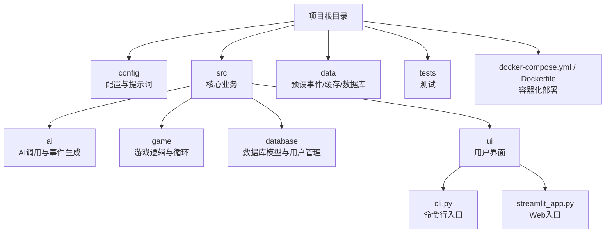
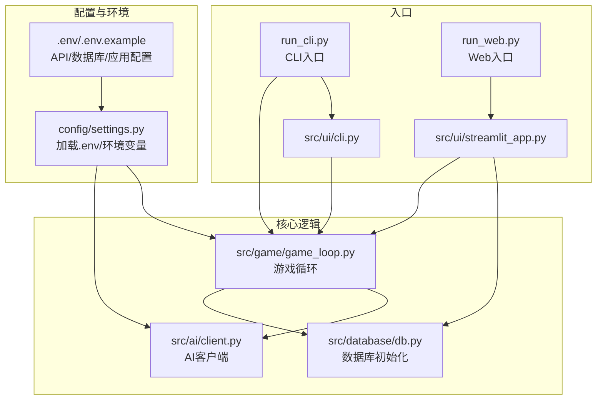
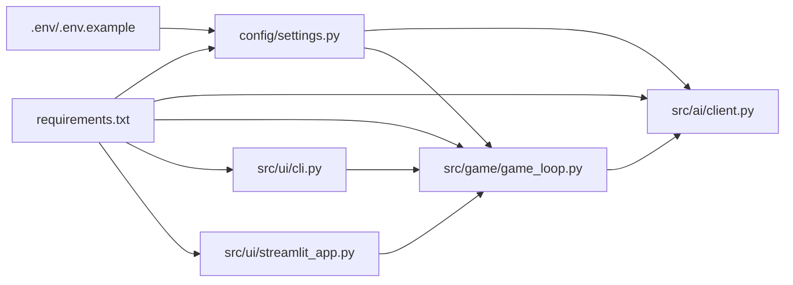

# 快速开始

<cite>
**本文引用的文件**
- [README.md](file://README.md)
- [requirements.txt](file://requirements.txt)
- [.env.example](file://.env.example)
- [run_cli.py](file://run_cli.py)
- [run_web.py](file://run_web.py)
- [Makefile](file://Makefile)
- [config/settings.py](file://config/settings.py)
- [src/ui/cli.py](file://src/ui/cli.py)
- [src/ui/streamlit_app.py](file://src/ui/streamlit_app.py)
- [Dockerfile](file://Dockerfile)
- [docker-compose.yml](file://docker-compose.yml)
- [DEPLOYMENT.md](file://DEPLOYMENT.md)
</cite>

## 目录
1. [简介](#简介)
2. [项目结构](#项目结构)
3. [核心组件](#核心组件)
4. [架构总览](#架构总览)
5. [详细组件分析](#详细组件分析)
6. [依赖关系分析](#依赖关系分析)
7. [性能注意事项](#性能注意事项)
8. [故障排查指南](#故障排查指南)
9. [结论](#结论)
10. [附录](#附录)

## 简介
“人生草稿本”是一个基于文本的生活模拟游戏，通过AI实时生成个性化人生事件，玩家在每周面对2-3个事件并做出选择，影响能量、情绪、知识、财富等资源，体验不同的人生结局。项目提供命令行界面（CLI）和Web界面（Streamlit）两种使用方式，支持中英文双语。

## 项目结构
项目采用模块化组织，核心目录与职责如下：
- config：配置与提示词模板
- src：核心业务代码
  - ai：AI调用与事件生成
  - game：游戏逻辑与循环
  - database：数据库模型与用户管理
  - ui：用户界面（CLI/Web）
- data：预设事件、缓存与数据库文件
- tests：单元与集成测试
- docker-compose与Dockerfile：容器化部署



图表来源
- [README.md](file://README.md#L61-L73)
- [src/ui/cli.py](file://src/ui/cli.py#L1-L20)
- [src/ui/streamlit_app.py](file://src/ui/streamlit_app.py#L1-L20)

章节来源
- [README.md](file://README.md#L61-L73)

## 核心组件
- 配置系统：集中管理OpenAI API密钥、模型、语言、缓存开关、数据库连接等，启动时从环境变量加载。
- CLI入口：提供命令行交互，支持语言切换、加载存档、保存进度。
- Web入口：基于Streamlit的图形界面，支持角色创建、剧情播放、存档管理等。
- AI客户端：统一的OpenAI调用抽象层，封装错误重试与流式回调。
- 游戏循环：负责每周事件生成、决策处理、资源衰减、阶段性总结与结局判定。

章节来源
- [config/settings.py](file://config/settings.py#L30-L100)
- [src/ui/cli.py](file://src/ui/cli.py#L120-L253)
- [src/ui/streamlit_app.py](file://src/ui/streamlit_app.py#L139-L215)
- [src/ai/client.py](file://src/ai/client.py#L22-L214)
- [src/game/game_loop.py](file://src/game/game_loop.py#L23-L120)

## 架构总览
下面的架构图展示了从入口到AI与数据库的关键交互：



图表来源
- [run_cli.py](file://run_cli.py#L1-L7)
- [run_web.py](file://run_web.py#L1-L11)
- [src/ui/cli.py](file://src/ui/cli.py#L1-L20)
- [src/ui/streamlit_app.py](file://src/ui/streamlit_app.py#L1-L20)
- [config/settings.py](file://config/settings.py#L1-L20)
- [src/ai/client.py](file://src/ai/client.py#L1-L20)
- [src/game/game_loop.py](file://src/game/game_loop.py#L1-L20)

## 详细组件分析

### 环境准备与依赖安装
- Python版本：项目使用Streamlit 1.28+与Python 3.9基础镜像，建议使用Python 3.9或兼容版本。
- 虚拟环境：创建并激活虚拟环境，避免全局污染。
- 依赖安装：安装requirements.txt中的包，包括OpenAI SDK、Streamlit、Pydantic、SQLAlchemy等。
- 环境变量：复制.env.example为.env，填入OpenAI API密钥、模型、语言、缓存开关等；如需云数据库，设置DATABASE_URL。

章节来源
- [requirements.txt](file://requirements.txt#L1-L9)
- [.env.example](file://.env.example#L1-L18)
- [README.md](file://README.md#L13-L32)

### OpenAI API配置与验证
- 配置项
  - OPENAI_API_KEY：必填，用于AI调用
  - OPENAI_MODEL：默认gpt-4，可按需调整
  - OPENAI_BASE_URL：可选，用于自定义代理或兼容服务
  - DEFAULT_LANGUAGE：默认zh，支持en
  - CACHE_EVENTS：默认true，启用事件缓存
  - DATABASE_URL：可选，云数据库连接串
- 验证机制：配置类会在缺失API密钥时抛出错误，CLI/Web入口也会给出明确提示。

章节来源
- [.env.example](file://.env.example#L1-L18)
- [config/settings.py](file://config/settings.py#L34-L90)
- [src/ai/client.py](file://src/ai/client.py#L37-L47)
- [src/ui/cli.py](file://src/ui/cli.py#L132-L138)
- [src/ui/streamlit_app.py](file://src/ui/streamlit_app.py#L131-L135)

### CLI使用方式
- 启动命令
  - python run_cli.py
  - 可选参数：--language zh/en 切换语言；--load 加载存档
- 交互流程
  - 初始化GameLoop（若配置缺失会报错）
  - 生成每周事件并展示选项
  - 输入选项字母（A/B/C/D）进行选择
  - 可随时保存进度为JSON文件
  - 按回车进入下一周，直至游戏结束

```mermaid
sequenceDiagram
participant User as "用户"
participant CLI as "src/ui/cli.py"
participant Loop as "src/game/game_loop.py"
participant AI as "src/ai/client.py"
User->>CLI : 启动 run_cli.py
CLI->>Loop : 初始化GameLoop(language)
CLI->>Loop : start_new_game()/load_game()
loop 每周循环
CLI->>Loop : generate_weekly_event()
Loop->>AI : 生成事件
AI-->>Loop : 返回事件
Loop-->>CLI : 事件与选项
CLI->>User : 展示状态与事件
User->>CLI : 选择(A/B/C/D)/保存/退出
CLI->>Loop : make_choice(index)
Loop-->>CLI : 结果文本
CLI->>Loop : advance_to_next_week()
end
CLI-->>User : 游戏结束与最终状态
```

图表来源
- [src/ui/cli.py](file://src/ui/cli.py#L120-L253)
- [src/game/game_loop.py](file://src/game/game_loop.py#L153-L350)
- [src/ai/client.py](file://src/ai/client.py#L51-L104)

章节来源
- [README.md](file://README.md#L36-L42)
- [src/ui/cli.py](file://src/ui/cli.py#L120-L253)

### Web使用方式
- 启动命令
  - python run_web.py（默认允许局域网访问）
  - 或直接 streamlit run src/ui/streamlit_app.py
- 访问地址：http://localhost:8501
- 功能流程
  - 初始化数据库与样式
  - 读取会话状态与语言设置
  - 角色创建（姓名与人生愿景）→ 生成角色设定
  - 打开故事/游玩页面，按周推进
  - 支持保存预设、查看存档、调试控制台（调试模式）

```mermaid
sequenceDiagram
participant Browser as "浏览器"
participant Web as "run_web.py"
participant App as "src/ui/streamlit_app.py"
participant DB as "src/database/db.py"
participant Loop as "src/game/game_loop.py"
participant AI as "src/ai/client.py"
Browser->>Web : 访问 http : //localhost : 8501
Web->>App : streamlit run src/ui/streamlit_app.py
App->>DB : init_db()
App->>App : init_session_state()
App->>Loop : 初始化/恢复游戏
App->>AI : 生成事件/故事
AI-->>App : 返回内容
App-->>Browser : 渲染页面与交互
```

图表来源
- [run_web.py](file://run_web.py#L6-L11)
- [src/ui/streamlit_app.py](file://src/ui/streamlit_app.py#L139-L215)
- [src/game/game_loop.py](file://src/game/game_loop.py#L61-L91)
- [src/ai/client.py](file://src/ai/client.py#L51-L104)

章节来源
- [README.md](file://README.md#L44-L51)
- [src/ui/streamlit_app.py](file://src/ui/streamlit_app.py#L139-L215)

### 验证安装成功
- CLI验证：运行 python run_cli.py，出现“正在生成事件...”等提示，且可正常选择与保存。
- Web验证：运行 python run_web.py，打开 http://localhost:8501，看到欢迎页与角色创建流程。
- 环境变量验证：确认 .env 中OPENAI_API_KEY已设置，否则会提示配置缺失。
- 依赖验证：requirements.txt中的包均已安装。

章节来源
- [README.md](file://README.md#L13-L32)
- [src/ui/cli.py](file://src/ui/cli.py#L132-L138)
- [src/ui/streamlit_app.py](file://src/ui/streamlit_app.py#L131-L135)

## 依赖关系分析
- 配置层：config/settings.py统一读取环境变量，为AI与UI提供配置。
- 入口层：run_cli.py与run_web.py分别引导CLI与Web入口。
- 业务层：game_loop.py协调AI生成、决策处理、资源与总结。
- AI层：client.py封装OpenAI调用与重试。
- 数据层：database模块负责初始化与用户管理（Web端使用）。



图表来源
- [requirements.txt](file://requirements.txt#L1-L9)
- [config/settings.py](file://config/settings.py#L1-L20)
- [src/ai/client.py](file://src/ai/client.py#L1-L20)
- [src/game/game_loop.py](file://src/game/game_loop.py#L1-L20)
- [src/ui/cli.py](file://src/ui/cli.py#L1-L20)
- [src/ui/streamlit_app.py](file://src/ui/streamlit_app.py#L1-L20)

章节来源
- [requirements.txt](file://requirements.txt#L1-L9)

## 性能注意事项
- 启用事件缓存：CACHE_EVENTS=true可减少重复请求，提升加载速度。
- 选择合适模型：OPENAI_MODEL可根据预算与延迟需求调整。
- 数据库选择：生产环境建议使用PostgreSQL，避免SQLite并发瓶颈。
- 流式渲染：Web端支持流式回调，改善交互体验。
- 资源限制：Docker部署中可配置CPU/内存上限，避免资源争用。

章节来源
- [.env.example](file://.env.example#L12-L13)
- [Dockerfile](file://Dockerfile#L35-L47)
- [docker-compose.yml](file://docker-compose.yml#L35-L42)

## 故障排查指南
- 缺少API密钥
  - 现象：启动时报错提示未设置OPENAI_API_KEY
  - 处理：在.env中填入有效密钥，或设置环境变量
- 端口占用
  - 现象：Web无法启动或端口冲突
  - 处理：修改端口或释放8501端口占用
- 数据库连接失败
  - 现象：Web初始化数据库失败
  - 处理：检查DATABASE_URL或使用默认SQLite
- 依赖缺失
  - 现象：导入错误或模块未找到
  - 处理：重新安装requirements.txt
- Docker部署问题
  - 现象：容器启动失败或健康检查失败
  - 处理：查看日志，确认环境变量与卷挂载正确

章节来源
- [src/ui/cli.py](file://src/ui/cli.py#L132-L138)
- [src/ui/streamlit_app.py](file://src/ui/streamlit_app.py#L131-L135)
- [DEPLOYMENT.md](file://DEPLOYMENT.md#L237-L351)

## 结论
按照本指南完成环境准备、依赖安装与配置，你可以在30分钟内成功运行“人生草稿本”的CLI或Web版本。建议优先使用CLI快速体验，再切换至Web获得更丰富的交互。生产部署可参考Docker与Streamlit Cloud方案，按需扩展数据库与安全策略。

## 附录
- 常用命令
  - 安装依赖：pip install -r requirements.txt
  - 启动CLI：python run_cli.py
  - 启动Web：python run_web.py
  - Docker构建与启动：docker-compose build && docker-compose up -d
- 快速检查清单
  - 已创建并激活虚拟环境
  - 已复制.env并填入OPENAI_API_KEY
  - 已安装requirements.txt中的依赖
  - CLI/Web均可正常启动且无报错
  - 可以生成事件并进行选择