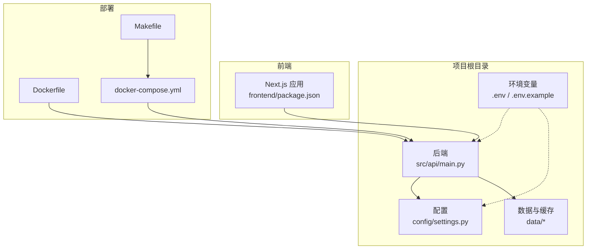
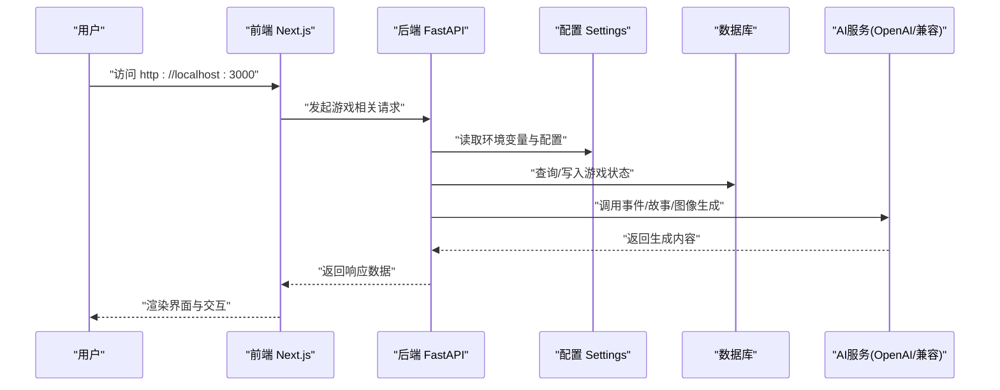
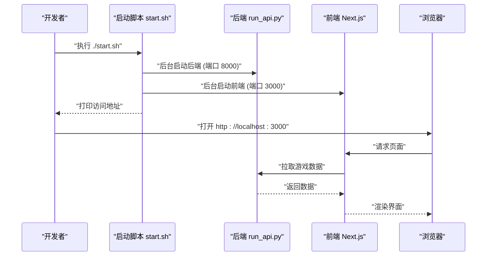
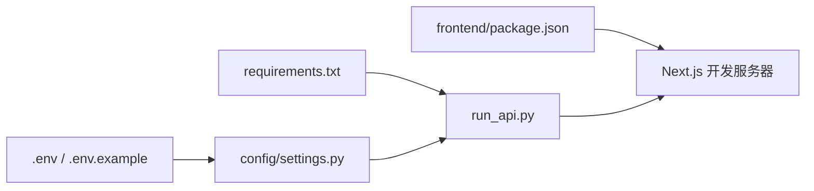

# 快速开始

<cite>
**本文引用的文件**
- [README.md](file://README.md)
- [requirements.txt](file://requirements.txt)
- [.env.example](file://.env.example)
- [start.sh](file://start.sh)
- [run_api.py](file://run_api.py)
- [Dockerfile](file://Dockerfile)
- [docker-compose.yml](file://docker-compose.yml)
- [Makefile](file://Makefile)
- [config/settings.py](file://config/settings.py)
- [frontend/package.json](file://frontend/package.json)
- [test.sh](file://test.sh)
</cite>

## 目录
1. [简介](#简介)
2. [项目结构](#项目结构)
3. [核心组件](#核心组件)
4. [架构总览](#架构总览)
5. [详细组件分析](#详细组件分析)
6. [依赖关系分析](#依赖关系分析)
7. [性能注意事项](#性能注意事项)
8. [故障排除指南](#故障排除指南)
9. [结论](#结论)
10. [附录](#附录)

## 简介
“人生草稿本”是一个基于文本的生活模拟游戏，通过AI实时生成个性化事件，结合资源管理与决策玩法，让玩家体验不同的人生轨迹。本指南面向新用户，帮助你在最短时间内完成环境准备、依赖安装、环境变量配置与启动运行，支持命令行界面、Web界面以及Docker容器化部署等多种方式。

## 项目结构
项目采用前后端分离架构：
- 后端：Python + FastAPI，提供API与游戏核心逻辑
- 前端：Next.js（React）提供Web界面
- 配置与提示词：config/prompts
- 数据与缓存：data 目录（数据库、预设事件、缓存、图片）

图表来源
- [config/settings.py](file://config/settings.py#L1-L168)
- [run_api.py](file://run_api.py#L1-L36)
- [frontend/package.json](file://frontend/package.json#L1-L49)
- [Dockerfile](file://Dockerfile#L1-L40)
- [docker-compose.yml](file://docker-compose.yml#L1-L65)
- [Makefile](file://Makefile#L1-L93)

章节来源
- [README.md](file://README.md#L74-L87)

## 核心组件
- 环境与依赖
  - Python 虚拟环境与依赖安装
  - 环境变量（OpenAI API密钥、模型、语言、缓存开关等）
- 后端服务
  - FastAPI 入口与运行脚本
  - 端口、主机、热重载等配置
- 前端服务
  - Next.js 开发服务器与构建脚本
- 启动脚本
  - 一键启动脚本与状态/日志查看
- 容器化
  - Dockerfile 与 docker-compose 编排

章节来源
- [README.md](file://README.md#L13-L64)
- [requirements.txt](file://requirements.txt#L1-L12)
- [.env.example](file://.env.example#L1-L22)
- [run_api.py](file://run_api.py#L18-L36)
- [frontend/package.json](file://frontend/package.json#L5-L15)
- [start.sh](file://start.sh#L1-L111)
- [Dockerfile](file://Dockerfile#L1-L40)
- [docker-compose.yml](file://docker-compose.yml#L1-L65)
- [Makefile](file://Makefile#L48-L93)

## 架构总览
下图展示了从用户到后端API再到AI服务与数据库的整体交互流程。

图表来源
- [config/settings.py](file://config/settings.py#L27-L168)
- [run_api.py](file://run_api.py#L18-L36)
- [frontend/package.json](file://frontend/package.json#L5-L15)

## 详细组件分析

### 环境准备与依赖安装
- 步骤
  - 创建并激活Python虚拟环境
  - 安装后端依赖
  - 在项目根目录创建 .env 并填入必要配置
- 关键文件
  - 依赖清单：requirements.txt
  - 示例环境变量：.env.example
- 常见问题
  - 若网络受限，建议配置代理或更换镜像源
  - macOS 用户如遇SSL警告，可按后端入口脚本中的处理方式运行（该脚本已内置兼容性处理）

章节来源
- [README.md](file://README.md#L13-L33)
- [requirements.txt](file://requirements.txt#L1-L12)
- [.env.example](file://.env.example#L1-L22)
- [run_api.py](file://run_api.py#L6-L8)

### 环境变量配置（重点：OpenAI API密钥）
- 必填项
  - OPENAI_API_KEY：必须设置，否则配置校验会抛出异常
  - OPENAI_MODEL：默认 gpt-4，可按需调整
  - DEFAULT_LANGUAGE：默认 zh，支持 en
  - CACHE_EVENTS：默认 true，启用事件缓存
- 可选项
  - OPENAI_BASE_URL：自定义OpenAI兼容服务端点
  - DATABASE_URL：云数据库连接串（优先级高于本地SQLite）
  - IMAGE_* 系列：图像生成与场景分析的API密钥与模型
- 验证机制
  - 配置模块在启动时会校验必填项，缺失将直接报错

章节来源
- [.env.example](file://.env.example#L1-L22)
- [config/settings.py](file://config/settings.py#L143-L149)

### 启动方式一：命令行界面（CLI）
- 适用阶段：Phase 1 原型
- 命令示例
  - 运行 CLI：参考 README 中的命令
  - 语言切换：通过参数指定语言
  - 加载存档：通过参数加载保存的游戏进度
- 注意事项
  - CLI 为早期原型，完整体验请使用 Web 界面

章节来源
- [README.md](file://README.md#L36-L42)

### 启动方式二：Web 界面（推荐）
- 后端服务
  - 运行后端 API：python run_api.py
  - 默认监听 0.0.0.0:8000，可通过环境变量覆盖
- 前端服务
  - 切换至 frontend 目录，安装依赖后启动开发服务器
  - 首次运行需安装依赖
- 访问地址
  - 本地：http://localhost:3000
  - 局域网：脚本会打印当前可用局域网IP

章节来源
- [README.md](file://README.md#L44-L64)
- [run_api.py](file://run_api.py#L20-L31)
- [frontend/package.json](file://frontend/package.json#L5-L15)
- [start.sh](file://start.sh#L106-L109)

### 启动方式三：一键启动脚本
- 功能
  - 同时启动后端与前端，自动检测端口占用并尝试清理
  - 支持查看状态、日志、停止、重启
- 常用命令
  - ./start.sh：启动前后端
  - ./start.sh stop：停止服务
  - ./start.sh status：查看服务状态
  - ./start.sh logs：查看日志
  - ./start_lan_nextjs.sh：局域网访问模式（脚本同仓库）
- 日志位置
  - 后端日志：/tmp/backend.log
  - 前端日志：/tmp/frontend.log

章节来源
- [start.sh](file://start.sh#L1-L111)

### 启动方式四：Docker 容器化部署
- 单机编排
  - 使用 docker-compose.yml 启动应用容器
  - 环境变量通过 .env 注入（或直接在 compose 文件中设置）
  - 数据持久化挂载 data 目录
- 健康检查
  - 后端健康检查：/docs
  - 前端健康检查：/_stcore/health（compose 中示例）
- 快捷命令
  - make start：启动服务
  - make stop：停止服务
  - make logs：查看日志
  - make status：查看状态
- 生产部署
  - 可通过合并 docker-compose.prod.yml 实现生产环境部署

章节来源
- [Dockerfile](file://Dockerfile#L1-L40)
- [docker-compose.yml](file://docker-compose.yml#L1-L65)
- [Makefile](file://Makefile#L74-L93)

### 启动序列图（Web界面）

图表来源
- [start.sh](file://start.sh#L98-L109)
- [run_api.py](file://run_api.py#L24-L31)
- [frontend/package.json](file://frontend/package.json#L6-L6)

## 依赖关系分析
- 后端依赖
  - OpenAI SDK、FastAPI、Uvicorn、SQLAlchemy、Pydantic、dotenv 等
- 前端依赖
  - Next.js、React、TailwindCSS、Zustand 状态管理等
- 配置与运行
  - settings.py 统一读取 .env 并提供默认值与校验
  - run_api.py 读取 API_HOST/API_PORT/API_RELOAD 等环境变量

图表来源
- [requirements.txt](file://requirements.txt#L1-L12)
- [run_api.py](file://run_api.py#L1-L36)
- [.env.example](file://.env.example#L1-L22)
- [config/settings.py](file://config/settings.py#L1-L168)
- [frontend/package.json](file://frontend/package.json#L1-L49)

章节来源
- [requirements.txt](file://requirements.txt#L1-L12)
- [frontend/package.json](file://frontend/package.json#L16-L47)
- [config/settings.py](file://config/settings.py#L1-L168)
- [run_api.py](file://run_api.py#L1-L36)

## 性能注意事项
- 启动性能
  - 前端首次安装依赖可能耗时较长，建议使用国内镜像源加速
  - 后端热重载仅开发环境启用，生产环境建议关闭
- AI生成延迟
  - 事件/故事/图像生成存在超时控制，可在配置中调整
- 数据库
  - 本地默认 SQLite，生产建议使用云数据库并配置 DATABASE_URL
- 容器资源
  - docker-compose 提供 CPU/内存限制示例，可根据宿主资源调整

章节来源
- [config/settings.py](file://config/settings.py#L104-L106)
- [config/settings.py](file://config/settings.py#L107-L141)
- [docker-compose.yml](file://docker-compose.yml#L35-L43)

## 故障排除指南
- 环境变量未生效
  - 确认 .env 文件位于项目根目录且包含 OPENAI_API_KEY
  - 确认 run_api.py 已加载 .env（脚本内已包含加载逻辑）
- 端口被占用
  - 使用一键脚本的 stop/status/logs 子命令进行排查
  - 后端默认端口 8000，前端默认端口 3000
- 前端依赖安装失败
  - 确保 Node.js 版本满足 package.json 要求
  - 首次运行需执行 npm install
- Docker 启动失败
  - 检查 docker-compose.yml 中的环境变量注入
  - 使用 make logs 查看容器日志
- 常用命令
  - 后端测试：./test.sh 或 pytest tests/
  - 前端测试：npm test（在 frontend 目录）
  - E2E 测试：./test.sh e2e
  - 性能测试：./test.sh perf（需先启动后端）

章节来源
- [start.sh](file://start.sh#L20-L77)
- [test.sh](file://test.sh#L21-L170)
- [frontend/package.json](file://frontend/package.json#L5-L15)
- [run_api.py](file://run_api.py#L13-L15)

## 结论
按照本指南，你可以在几分钟内完成环境准备、依赖安装与启动运行。建议优先使用一键启动脚本或 Docker 方式快速体验；若需深入开发或调试，可分别启动后端与前端服务。遇到问题时，优先查看脚本输出与日志定位原因。

## 附录
- 快速命令索引
  - 启动：./start.sh 或 make start
  - 停止：./start.sh stop 或 make stop
  - 日志：./start.sh logs 或 make logs
  - 状态：./start.sh status 或 make status
  - Docker：make deploy-dev / deploy-prod
- 预期输出
  - 启动成功后，浏览器应能访问 http://localhost:3000
  - 日志显示后端/前端进程已监听对应端口