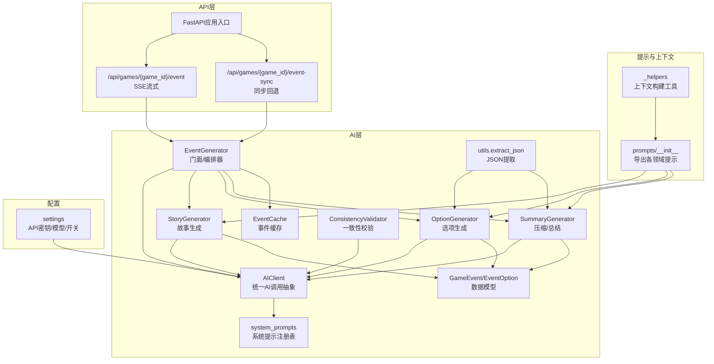
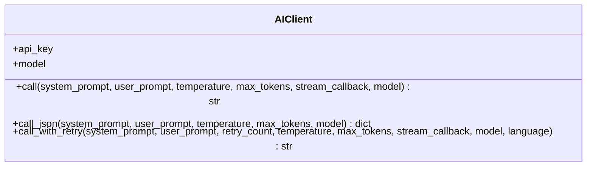
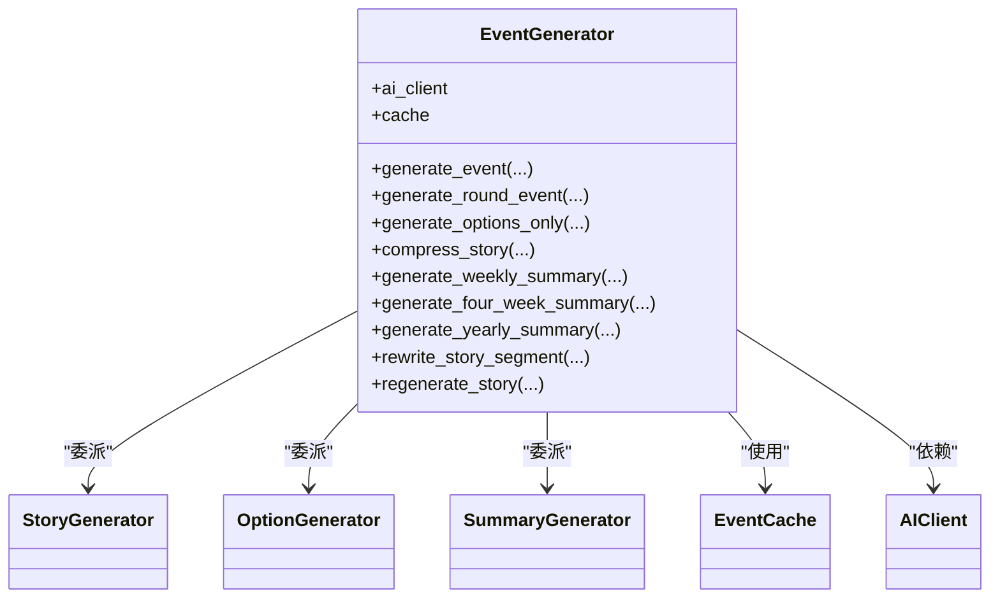
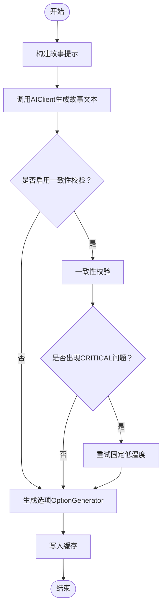
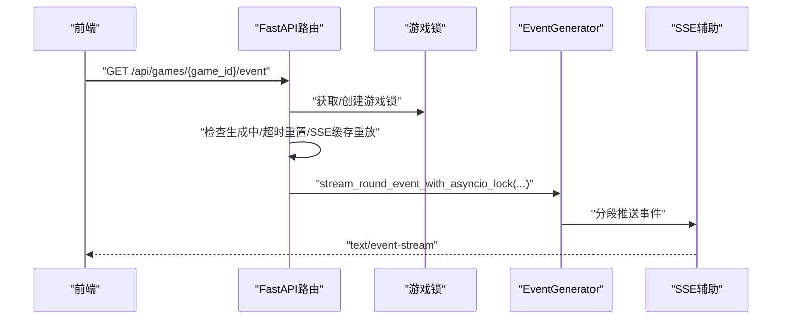
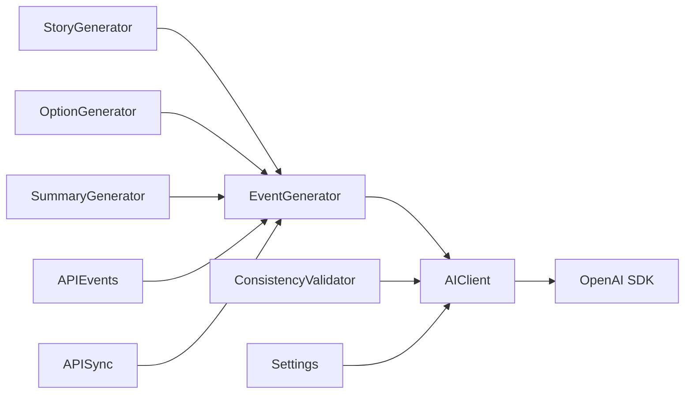

# AI模型集成

<cite>
**本文引用的文件**
- [src/ai/__init__.py](file://src/ai/__init__.py)
- [src/ai/client.py](file://src/ai/client.py)
- [src/ai/models.py](file://src/ai/models.py)
- [src/ai/system_prompts.py](file://src/ai/system_prompts.py)
- [src/ai/generator.py](file://src/ai/generator.py)
- [src/ai/story_generator.py](file://src/ai/story_generator.py)
- [src/ai/option_generator.py](file://src/ai/option_generator.py)
- [src/ai/summary_generator.py](file://src/ai/summary_generator.py)
- [src/ai/utils.py](file://src/ai/utils.py)
- [src/ai/cache.py](file://src/ai/cache.py)
- [src/ai/consistency_validator.py](file://src/ai/consistency_validator.py)
- [config/settings.py](file://config/settings.py)
- [config/prompts/__init__.py](file://config/prompts/__init__.py)
- [config/prompts/_helpers.py](file://config/prompts/_helpers.py)
- [src/api/routers/gameplay/events.py](file://src/api/routers/gameplay/events.py)
- [src/api/main.py](file://src/api/main.py)
</cite>

## 目录
1. [简介](#简介)
2. [项目结构](#项目结构)
3. [核心组件](#核心组件)
4. [架构总览](#架构总览)
5. [详细组件分析](#详细组件分析)
6. [依赖关系分析](#依赖关系分析)
7. [性能考虑](#性能考虑)
8. [故障排除指南](#故障排除指南)
9. [结论](#结论)
10. [附录](#附录)

## 简介
本技术指南面向需要在现有项目中集成与扩展AI模型能力的工程师与产品团队，系统讲解如何基于仓库中的AI模块实现自定义模型的统一接入、提示模板定制、两阶段故事生成流水线、一致性校验与回退策略、以及SSE流式输出与同步回退的API集成方式。文档同时提供OpenAI以外的其他AI服务适配思路（如本地模型、云API兼容层、混合推理架构），并给出性能优化、成本控制与质量评估的方法。

## 项目结构
AI相关能力集中在src/ai包中，围绕“统一客户端 → 服务编排器 → 专用生成器”的分层设计组织；提示模板与上下文构建集中在config/prompts包；API层通过FastAPI路由提供SSE流式与同步回退两种事件生成接口。



图示来源
- [src/ai/__init__.py](file://src/ai/__init__.py#L1-L18)
- [src/ai/client.py](file://src/ai/client.py#L22-L233)
- [src/ai/generator.py](file://src/ai/generator.py#L30-L497)
- [src/ai/story_generator.py](file://src/ai/story_generator.py#L24-L439)
- [src/ai/option_generator.py](file://src/ai/option_generator.py#L17-L264)
- [src/ai/summary_generator.py](file://src/ai/summary_generator.py#L17-L589)
- [src/ai/consistency_validator.py](file://src/ai/consistency_validator.py#L42-L404)
- [src/ai/cache.py](file://src/ai/cache.py#L13-L139)
- [src/ai/utils.py](file://src/ai/utils.py#L10-L77)
- [src/ai/models.py](file://src/ai/models.py#L7-L27)
- [src/ai/system_prompts.py](file://src/ai/system_prompts.py#L1-L279)
- [config/prompts/__init__.py](file://config/prompts/__init__.py#L1-L121)
- [config/prompts/_helpers.py](file://config/prompts/_helpers.py#L1-L814)
- [config/settings.py](file://config/settings.py#L27-L168)
- [src/api/routers/gameplay/events.py](file://src/api/routers/gameplay/events.py#L48-L212)
- [src/api/main.py](file://src/api/main.py#L35-L134)

章节来源
- [src/ai/__init__.py](file://src/ai/__init__.py#L1-L18)
- [config/prompts/__init__.py](file://config/prompts/__init__.py#L1-L121)

## 核心组件
- 统一AI调用抽象（AIClient）：封装OpenAI SDK调用，提供同步/流式、JSON解析、带错误反馈的重试机制，支持自定义base_url与模型覆盖。
- 事件生成门面（EventGenerator）：对外暴露统一接口，内部委派至故事生成、选项生成、压缩/总结、重写等子服务，并支持缓存与预设事件。
- 专用生成器：
  - StoryGenerator：两阶段流水线第一步，生成纯故事文本，支持一致性校验与重试。
  - OptionGenerator：两阶段流水线第二步，基于故事生成选项，进行关系名修复与质量校验。
  - SummaryGenerator：故事压缩、周/四周期/年总结、世界状态抽取。
  - ConsistencyValidator：基于世界模型的多维一致性校验，支持AI驱动的重试提示注入。
- 提示模板与上下文（system_prompts + prompts/_helpers）：集中管理系统提示，提供时间、人物、习惯、伏笔、逻辑约束、世界模型约束等上下文构建工具。
- 数据模型（GameEvent/EventOption）：标准化事件与选项的数据结构，便于跨模块传递与缓存。
- 工具与缓存（utils.extract_json、EventCache）：稳健的JSON提取与事件缓存，提升稳定性与性能。
- 配置（settings）：统一管理OpenAI API密钥、模型、图像服务、降级模型列表、缓存开关、语言等。

章节来源
- [src/ai/client.py](file://src/ai/client.py#L22-L233)
- [src/ai/generator.py](file://src/ai/generator.py#L30-L497)
- [src/ai/story_generator.py](file://src/ai/story_generator.py#L24-L439)
- [src/ai/option_generator.py](file://src/ai/option_generator.py#L17-L264)
- [src/ai/summary_generator.py](file://src/ai/summary_generator.py#L17-L589)
- [src/ai/consistency_validator.py](file://src/ai/consistency_validator.py#L42-L404)
- [src/ai/system_prompts.py](file://src/ai/system_prompts.py#L1-L279)
- [config/prompts/_helpers.py](file://config/prompts/_helpers.py#L1-L814)
- [src/ai/models.py](file://src/ai/models.py#L7-L27)
- [src/ai/utils.py](file://src/ai/utils.py#L10-L77)
- [src/ai/cache.py](file://src/ai/cache.py#L13-L139)
- [config/settings.py](file://config/settings.py#L27-L168)

## 架构总览
整体采用“统一客户端 + 门面编排 + 专用生成器 + 一致性校验 + 缓存”的分层架构，保证：
- 单一调用入口，便于替换底层模型与统一错误处理；
- 两阶段故事生成，先故事后选项，确保选项与故事一致；
- 一致性校验与重试，保障叙事连贯；
- 流式与同步双API路径，兼顾前端体验与移动端兼容。

```mermaid
sequenceDiagram
participant FE as "前端"
participant API as "FastAPI路由"
participant Gen as "EventGenerator"
participant Story as "StoryGenerator"
participant Opt as "OptionGenerator"
participant Val as "ConsistencyValidator"
participant Cache as "EventCache"
participant AI as "AIClient/OpenAI"
FE->>API : "GET /api/games/{game_id}/event"
API->>Gen : "生成回合事件SSE"
Gen->>Cache : "查询缓存"
alt "命中缓存"
Cache-->>Gen : "返回事件"
Gen-->>API : "事件对象"
API-->>FE : "SSE事件流"
else "未命中缓存"
Gen->>Story : "生成故事文本"
Story->>AI : "调用系统提示+用户提示"
AI-->>Story : "故事文本"
Story->>Val : "一致性校验可选"
Val-->>Story : "通过/重试提示"
Story->>Opt : "生成选项"
Opt->>AI : "调用系统提示+用户提示"
AI-->>Opt : "选项JSON"
Opt-->>Gen : "事件故事+选项"
Gen->>Cache : "写入缓存"
Gen-->>API : "事件对象"
API-->>FE : "SSE事件流"
end
```

图示来源
- [src/api/routers/gameplay/events.py](file://src/api/routers/gameplay/events.py#L48-L212)
- [src/ai/generator.py](file://src/ai/generator.py#L232-L314)
- [src/ai/story_generator.py](file://src/ai/story_generator.py#L32-L190)
- [src/ai/option_generator.py](file://src/ai/option_generator.py#L25-L132)
- [src/ai/consistency_validator.py](file://src/ai/consistency_validator.py#L60-L122)
- [src/ai/cache.py](file://src/ai/cache.py#L78-L101)
- [src/ai/client.py](file://src/ai/client.py#L51-L124)

## 详细组件分析

### 统一AI调用抽象（AIClient）
- 职责：封装OpenAI SDK调用，提供call/call_json/call_with_retry三种能力；支持流式回调、最大token限制、错误反馈注入重试。
- 关键特性：
  - 支持自定义base_url与model覆盖，便于对接不同供应商或本地服务；
  - call_with_retry在每次重试时将上次错误注入用户提示，帮助模型“学会”避免重复错误；
  - 对长度截断进行告警，便于调参与提示优化。
- 适用场景：替换OpenAI为其他兼容服务（见“适配方案”）。



图示来源
- [src/ai/client.py](file://src/ai/client.py#L22-L233)

章节来源
- [src/ai/client.py](file://src/ai/client.py#L22-L233)

### 事件生成门面（EventGenerator）
- 职责：对外提供统一接口，内部委派至StoryGenerator、OptionGenerator、SummaryGenerator、StoryRewriter；支持缓存、预设事件、流式与同步调用。
- 关键流程：
  - generate_event：两阶段流水线（故事→选项），支持一致性校验与重试；
  - generate_round_event：单轮故事与选项生成，支持世界模型约束；
  - generate_options_only：仅生成选项（已有故事）；
  - 压缩/总结：故事压缩、周/四周期/年总结、世界状态抽取。
- 与AIClient的关系：所有AI调用均通过AIClient，确保统一配置与错误处理。



图示来源
- [src/ai/generator.py](file://src/ai/generator.py#L30-L497)
- [src/ai/story_generator.py](file://src/ai/story_generator.py#L24-L439)
- [src/ai/option_generator.py](file://src/ai/option_generator.py#L17-L264)
- [src/ai/summary_generator.py](file://src/ai/summary_generator.py#L17-L589)
- [src/ai/cache.py](file://src/ai/cache.py#L13-L139)
- [src/ai/client.py](file://src/ai/client.py#L22-L233)

章节来源
- [src/ai/generator.py](file://src/ai/generator.py#L30-L497)

### 故事生成（StoryGenerator）
- 两阶段流水线：
  - Step 1：生成纯故事文本（系统提示：novelist），支持流式输出与温度衰减策略；
  - Step 2：基于故事生成选项（委派OptionGenerator），并进行关系名修复与质量校验；
  - 可选一致性校验：若世界模型存在，对故事进行一致性校验，出现CRITICAL问题时一次性重试。
- 温度策略：首次生成较高温度，重试时逐步降低，提升准确性与一致性。



图示来源
- [src/ai/story_generator.py](file://src/ai/story_generator.py#L32-L190)
- [src/ai/option_generator.py](file://src/ai/option_generator.py#L25-L132)
- [src/ai/consistency_validator.py](file://src/ai/consistency_validator.py#L60-L122)

章节来源
- [src/ai/story_generator.py](file://src/ai/story_generator.py#L24-L439)

### 选项生成（OptionGenerator）
- 输入：已有故事文本；
- 输出：GameEvent（故事+选项）；
- 关键能力：
  - JSON提取与格式校验，不足2个选项时回退默认选项；
  - 关系名修复：对人物关系进行精确/模糊匹配与角色身份匹配；
  - 质量校验：检查效果合理性、动作点成本、选项间的权衡。
- 适用场景：开放式故事的分支选择生成。

章节来源
- [src/ai/option_generator.py](file://src/ai/option_generator.py#L17-L264)
- [src/ai/models.py](file://src/ai/models.py#L7-L27)

### 压缩与总结（SummaryGenerator）
- 故事压缩：将长故事压缩为摘要并评估剧情线状态，支持回退提取；
- 周/四周期/年总结：生成阶段性总结与奖励效果；
- 世界状态抽取：并行抽取事实更新、伏笔种子、习惯变化、地点/职业/承诺/因果变化等。
- 温度与重试：针对JSON解析失败提供多次尝试与回退策略。

章节来源
- [src/ai/summary_generator.py](file://src/ai/summary_generator.py#L17-L589)

### 一致性校验（ConsistencyValidator）
- 多维度校验：地理、职业、个性、时间、承诺、因果、虚构（fabrication）等；
- AI驱动：直接解析AI返回的JSON，按其“是否重试/重试原因/严重性”决定策略；
- 历史交叉验证：结合历史故事与动态事实进行“伪造事件/事实遗漏/因果断裂”检测。

章节来源
- [src/ai/consistency_validator.py](file://src/ai/consistency_validator.py#L42-L404)

### 提示模板与上下文构建
- system_prompts：集中管理系统提示（中文/英文），涵盖故事生成、选项生成、压缩、总结、一致性校验、分析、人物合成等；
- prompts/_helpers：提供时间、人物、习惯、伏笔、逻辑约束、世界模型约束、可用人物列表等上下文构建工具，确保提示稳定与可审计。

章节来源
- [src/ai/system_prompts.py](file://src/ai/system_prompts.py#L1-L279)
- [config/prompts/_helpers.py](file://config/prompts/_helpers.py#L1-L814)
- [config/prompts/__init__.py](file://config/prompts/__init__.py#L1-L121)

### 数据模型
- GameEvent/EventOption：标准化事件与选项结构，支持从JSON反序列化与字段长度/数量约束。

章节来源
- [src/ai/models.py](file://src/ai/models.py#L7-L27)

### 工具与缓存
- utils.extract_json：稳健提取AI返回中的JSON，兼容代码块与嵌入文本；
- EventCache：基于签名的事件缓存，定期随机命中率以保持多样性。

章节来源
- [src/ai/utils.py](file://src/ai/utils.py#L10-L77)
- [src/ai/cache.py](file://src/ai/cache.py#L13-L139)

### API集成（SSE与同步）
- SSE流式：支持Last-Event-ID重连、并发锁、生成超时自动清理、SSE缓存重放；
- 同步回退：移动端或不支持SSE场景的非流式回退；
- FastAPI全局异常处理与健康检查。



图示来源
- [src/api/routers/gameplay/events.py](file://src/api/routers/gameplay/events.py#L48-L212)
- [src/api/main.py](file://src/api/main.py#L35-L134)

章节来源
- [src/api/routers/gameplay/events.py](file://src/api/routers/gameplay/events.py#L48-L212)
- [src/api/main.py](file://src/api/main.py#L35-L134)

## 依赖关系分析
- 模块耦合：
  - EventGenerator高度聚合，依赖AIClient与各生成器，耦合度中等；
  - StoryGenerator与OptionGenerator通过GameEvent耦合，职责清晰；
  - ConsistencyValidator与WorldModel通过提示构建文本交互，松耦合。
- 外部依赖：
  - OpenAI SDK（默认）；
  - FastAPI（API层）；
  - 配置来源于settings，支持环境变量覆盖。



图示来源
- [src/ai/client.py](file://src/ai/client.py#L14-L47)
- [src/ai/generator.py](file://src/ai/generator.py#L19-L66)
- [src/api/routers/gameplay/events.py](file://src/api/routers/gameplay/events.py#L14-L25)
- [config/settings.py](file://config/settings.py#L31-L33)

章节来源
- [src/ai/client.py](file://src/ai/client.py#L14-L47)
- [src/ai/generator.py](file://src/ai/generator.py#L19-L66)
- [src/api/routers/gameplay/events.py](file://src/api/routers/gameplay/events.py#L14-L25)
- [config/settings.py](file://config/settings.py#L31-L33)

## 性能考虑
- 事件缓存：EventCache按资源区间取整签名，降低缓存碎片；随机命中率控制多样性。
- 两阶段生成：先故事后选项，避免重复调用；一致性校验仅在必要时触发。
- 流式输出：SSE减少首字节延迟，移动端同步回退保障可用性。
- 温度与token：温度衰减与max_tokens告警，减少无效重试与截断。
- 并行压缩：SummaryGenerator的叙事压缩与世界抽取可并行执行，缩短总耗时。

章节来源
- [src/ai/cache.py](file://src/ai/cache.py#L47-L101)
- [src/ai/story_generator.py](file://src/ai/story_generator.py#L106-L135)
- [src/ai/summary_generator.py](file://src/ai/summary_generator.py#L144-L226)
- [src/api/routers/gameplay/events.py](file://src/api/routers/gameplay/events.py#L48-L164)

## 故障排除指南
- OpenAI调用失败：
  - 使用call_with_retry自动注入上次错误并重试；
  - 检查OPENAI_API_KEY、OPENAI_BASE_URL、OPENAI_MODEL配置；
  - 关注长度截断告警，适当提高max_tokens。
- JSON解析失败：
  - utils.extract_json具备多种提取策略，必要时回退到SummaryGenerator的回退提取；
  - 检查系统提示是否强制返回JSON。
- 一致性校验不通过：
  - ConsistencyValidator会生成修复建议；CRITICAL问题触发一次性重试；
  - 若AI未返回should_retry，回退到“存在CRITICAL即不通过”的策略。
- 并发与SSE问题：
  - API层使用游戏锁与生成标志位防止并发；超时自动清理；
  - 移动端使用/event-sync回退；SSE重连使用Last-Event-ID。

章节来源
- [src/ai/client.py](file://src/ai/client.py#L159-L233)
- [src/ai/utils.py](file://src/ai/utils.py#L10-L77)
- [src/ai/summary_generator.py](file://src/ai/summary_generator.py#L25-L140)
- [src/ai/consistency_validator.py](file://src/ai/consistency_validator.py#L123-L238)
- [src/api/routers/gameplay/events.py](file://src/api/routers/gameplay/events.py#L88-L164)
- [config/settings.py](file://config/settings.py#L143-L149)

## 结论
该AI模型集成方案通过统一客户端、门面编排与专用生成器实现了高内聚、低耦合的可扩展架构；两阶段故事生成与一致性校验确保了叙事质量；SSE与同步双API路径兼顾了用户体验与兼容性。结合提示模板集中化与稳健的JSON提取、缓存策略，可在保证质量的同时显著降低API成本与提升响应速度。

## 附录

### 自定义模型集成步骤
- 步骤1：在settings中配置新模型的API密钥与base_url；
- 步骤2：在AIClient初始化中读取配置，或通过构造函数参数覆盖；
- 步骤3：确保系统提示与提示模板在新模型上可正常工作（可通过system_prompts与prompts/_helpers验证）；
- 步骤4：在EventGenerator/AIClient调用处确认流式/JSON解析逻辑兼容新模型；
- 步骤5：在API层保持SSE与同步接口不变，验证端到端流程。

章节来源
- [config/settings.py](file://config/settings.py#L31-L33)
- [src/ai/client.py](file://src/ai/client.py#L25-L47)
- [src/ai/system_prompts.py](file://src/ai/system_prompts.py#L264-L279)
- [config/prompts/_helpers.py](file://config/prompts/_helpers.py#L1-L814)

### OpenAI以外的适配方案
- 本地模型部署：
  - 在settings中设置base_url指向本地服务（如vLLM/Ollama）；
  - 确认模型名称与OpenAI兼容的chat.completions接口；
  - 调整温度、max_tokens与提示模板以适配本地模型。
- 云API适配：
  - 使用相同base_url与API Key配置，保持AIClient调用语义不变；
  - 如需多供应商降级，可在AIClient外层增加工厂/路由层，按策略选择供应商。
- 混合推理架构：
  - 使用ConsistencyValidator与SummaryGenerator的并行抽取能力，将不同任务分配到不同供应商或本地/云端；
  - 通过EventCache与提示模板的KV缓存前缀稳定性，提升跨供应商一致性。

章节来源
- [config/settings.py](file://config/settings.py#L60-L68)
- [src/ai/client.py](file://src/ai/client.py#L43-L47)
- [src/ai/summary_generator.py](file://src/ai/summary_generator.py#L144-L226)

### 参数配置与最佳实践
- 系统提示与上下文：
  - 使用system_prompts集中管理提示，确保KV缓存前缀稳定；
  - 使用prompts/_helpers构建时间、人物、习惯、伏笔、逻辑约束与世界模型约束。
- 两阶段生成：
  - 故事阶段使用较高温度与较长max_tokens，选项阶段使用较低温度与紧凑JSON；
  - 一致性校验仅在关键节点启用，避免过度重试。
- 缓存与回退：
  - 启用EventCache并设置合理命中率；
  - JSON解析失败与压缩失败均有回退策略，确保系统可用性。

章节来源
- [src/ai/system_prompts.py](file://src/ai/system_prompts.py#L1-L279)
- [config/prompts/_helpers.py](file://config/prompts/_helpers.py#L1-L814)
- [src/ai/cache.py](file://src/ai/cache.py#L78-L101)
- [src/ai/summary_generator.py](file://src/ai/summary_generator.py#L25-L140)

### 模型切换与回滚策略
- 运行时模型选择：通过AIClient构造函数参数或settings覆盖model/base_url；
- 性能监控：关注长度截断告警、重试次数与SSE超时；在API层记录并发冲突与生成标志位状态；
- 回滚策略：ConsistencyValidator的AI驱动should_retry决定是否重试；失败时回退默认选项或摘要。

章节来源
- [src/ai/client.py](file://src/ai/client.py#L25-L47)
- [src/ai/consistency_validator.py](file://src/ai/consistency_validator.py#L167-L178)
- [src/api/routers/gameplay/events.py](file://src/api/routers/gameplay/events.py#L88-L121)

### 性能优化、成本控制与质量评估
- 性能优化：
  - 合理设置max_tokens与温度衰减，减少无效重试；
  - 使用EventCache与并行压缩，缩短总耗时；
  - SSE流式输出降低等待时间。
- 成本控制：
  - 通过缓存与提示模板KV稳定性减少重复调用；
  - 在settings中配置降级模型列表，按优先级回退。
- 质量评估：
  - ConsistencyValidator的多维校验与AI驱动的重试建议；
  - 选项质量校验（动作点、权衡、合理性）。

章节来源
- [src/ai/cache.py](file://src/ai/cache.py#L47-L101)
- [src/ai/story_generator.py](file://src/ai/story_generator.py#L106-L135)
- [src/ai/option_generator.py](file://src/ai/option_generator.py#L226-L264)
- [src/ai/consistency_validator.py](file://src/ai/consistency_validator.py#L123-L238)
- [config/settings.py](file://config/settings.py#L60-L68)