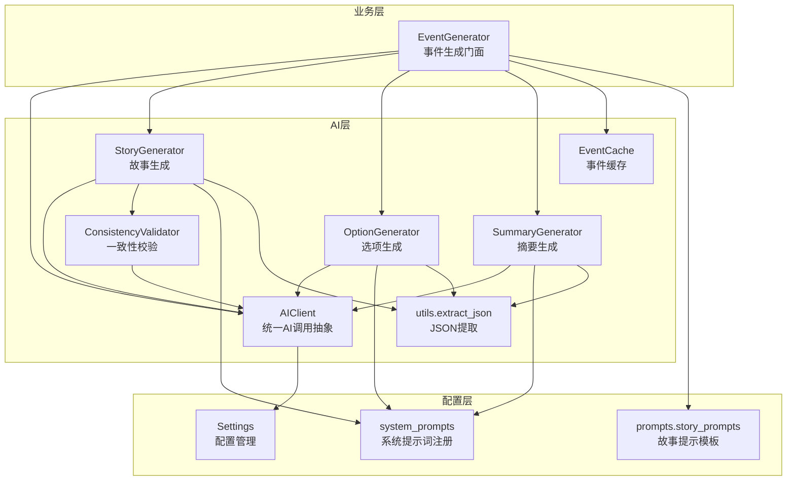
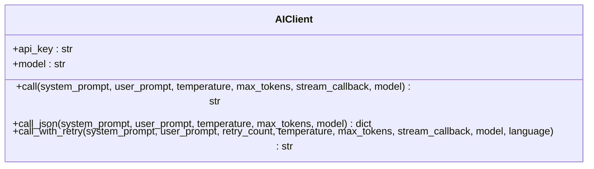
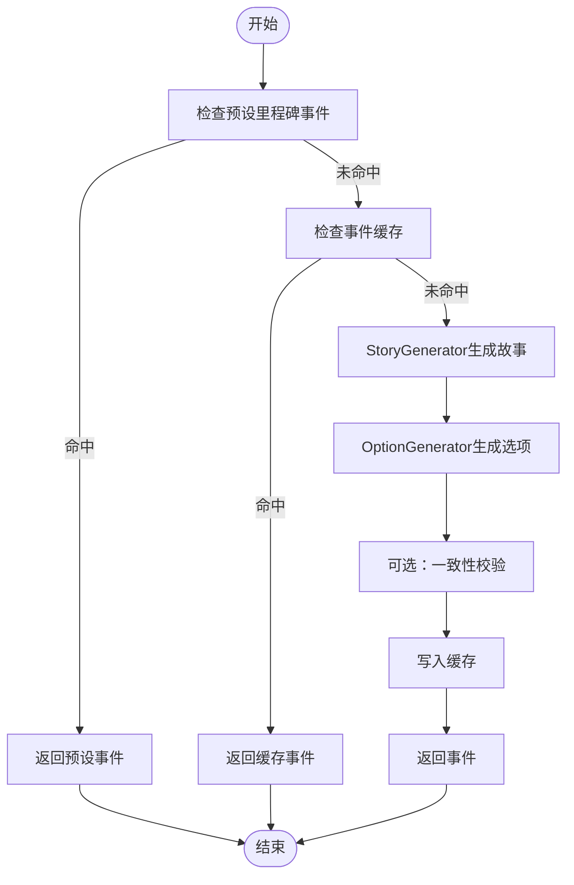
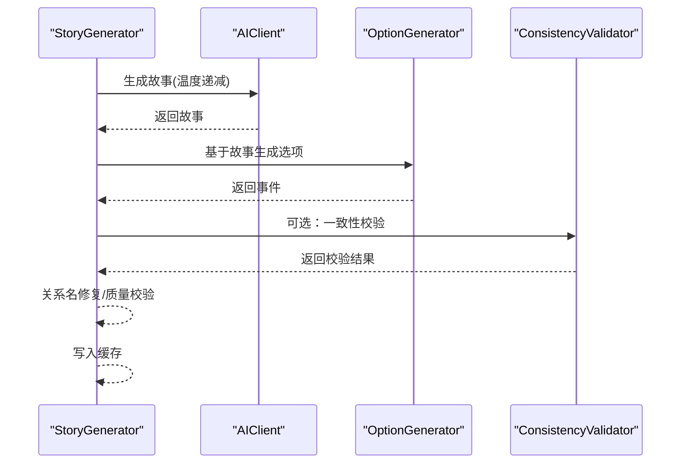
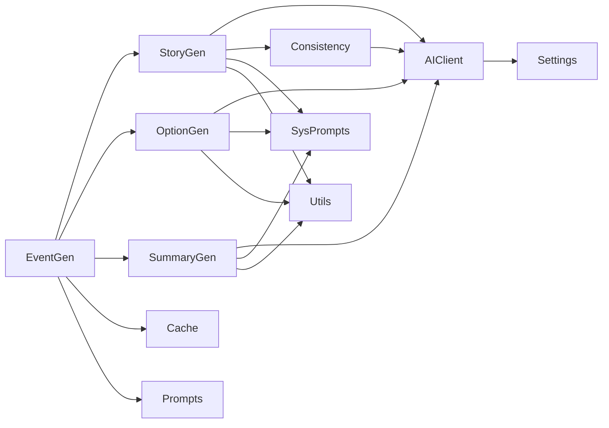

# 多模型集成方案

<cite>
**本文档引用的文件**
- [src/ai/client.py](file://src/ai/client.py)
- [src/ai/generator.py](file://src/ai/generator.py)
- [src/ai/story_generator.py](file://src/ai/story_generator.py)
- [src/ai/option_generator.py](file://src/ai/option_generator.py)
- [src/ai/summary_generator.py](file://src/ai/summary_generator.py)
- [src/ai/cache.py](file://src/ai/cache.py)
- [src/ai/utils.py](file://src/ai/utils.py)
- [src/ai/consistency_validator.py](file://src/ai/consistency_validator.py)
- [src/ai/system_prompts.py](file://src/ai/system_prompts.py)
- [config/settings.py](file://config/settings.py)
- [config/prompts/story_prompts.py](file://config/prompts/story_prompts.py)
- [requirements.txt](file://requirements.txt)
- [.env.example](file://.env.example)
</cite>

## 目录
1. [简介](#简介)
2. [项目结构](#项目结构)
3. [核心组件](#核心组件)
4. [架构总览](#架构总览)
5. [详细组件分析](#详细组件分析)
6. [依赖关系分析](#依赖关系分析)
7. [性能考虑](#性能考虑)
8. [故障排除指南](#故障排除指南)
9. [结论](#结论)
10. [附录](#附录)

## 简介
本技术指南面向需要在故事驱动型游戏中集成多种AI服务的工程团队，目标是提供一套可扩展、可维护、可演进的多模型集成方案。该方案以统一的AI调用抽象层为核心，支持：
- OpenAI API以外的其他AI服务（如本地模型、兼容OpenAI接口的云服务）
- 本地模型部署与混合推理架构
- 多模型投票与权重分配策略
- 成本与性能平衡的配置与优化建议
- 完整的集成配置示例与最佳实践

## 项目结构
该项目采用“模块化+分层”的组织方式：
- AI层：统一客户端、子服务（故事生成、选项生成、摘要生成、一致性校验）、工具与缓存
- 配置层：设置管理、系统提示词注册、提示模板
- 业务层：事件生成门面、轮次事件生成、重写与再生



**图表来源**
- [src/ai/client.py](file://src/ai/client.py#L22-L233)
- [src/ai/generator.py](file://src/ai/generator.py#L30-L497)
- [src/ai/story_generator.py](file://src/ai/story_generator.py#L24-L439)
- [src/ai/option_generator.py](file://src/ai/option_generator.py#L17-L264)
- [src/ai/summary_generator.py](file://src/ai/summary_generator.py#L17-L589)
- [src/ai/consistency_validator.py](file://src/ai/consistency_validator.py#L42-L405)
- [src/ai/cache.py](file://src/ai/cache.py#L13-L139)
- [src/ai/utils.py](file://src/ai/utils.py#L10-L77)
- [src/ai/system_prompts.py](file://src/ai/system_prompts.py#L242-L279)
- [config/prompts/story_prompts.py](file://config/prompts/story_prompts.py#L21-L800)
- [config/settings.py](file://config/settings.py#L27-L168)

**章节来源**
- [src/ai/client.py](file://src/ai/client.py#L1-L233)
- [src/ai/generator.py](file://src/ai/generator.py#L1-L497)
- [config/settings.py](file://config/settings.py#L1-L168)

## 核心组件
- 统一AI调用抽象层（AIClient）
  - 单一入口封装OpenAI SDK调用，支持流式输出、错误反馈注入、重试机制
  - 支持通过环境变量配置基础URL与模型，便于切换不同供应商
- 事件生成门面（EventGenerator）
  - 聚合故事生成、选项生成、摘要生成、重写与再生等子服务
  - 提供向后兼容的公共接口，屏蔽底层实现细节
- 子服务
  - StoryGenerator：两阶段流水线第一步，生成纯故事文本
  - OptionGenerator：两阶段流水线第二步，基于故事生成选项
  - SummaryGenerator：故事压缩、周/四/年总结
  - ConsistencyValidator：基于世界模型的一致性校验
- 缓存与工具
  - EventCache：事件缓存，降低API调用频率
  - utils.extract_json：鲁棒的JSON提取，提升容错率
  - system_prompts：集中式系统提示词，保证KV缓存命中与行为一致性

**章节来源**
- [src/ai/client.py](file://src/ai/client.py#L22-L233)
- [src/ai/generator.py](file://src/ai/generator.py#L30-L497)
- [src/ai/story_generator.py](file://src/ai/story_generator.py#L24-L439)
- [src/ai/option_generator.py](file://src/ai/option_generator.py#L17-L264)
- [src/ai/summary_generator.py](file://src/ai/summary_generator.py#L17-L589)
- [src/ai/consistency_validator.py](file://src/ai/consistency_validator.py#L42-L405)
- [src/ai/cache.py](file://src/ai/cache.py#L13-L139)
- [src/ai/utils.py](file://src/ai/utils.py#L10-L77)
- [src/ai/system_prompts.py](file://src/ai/system_prompts.py#L242-L279)

## 架构总览
该系统采用“门面+子服务”的轻量架构，核心流程如下：
- 事件生成：门面协调故事生成与选项生成，必要时进行一致性校验与缓存
- 流式输出：支持流式响应，前端可实时渲染
- 错误处理：统一异常捕获、错误反馈注入与重试
- 配置驱动：通过环境变量与配置类切换模型与供应商

```mermaid
sequenceDiagram
participant Caller as "调用方"
participant Facade as "EventGenerator"
participant Story as "StoryGenerator"
participant Opt as "OptionGenerator"
participant AI as "AIClient"
participant Validator as "ConsistencyValidator"
Caller->>Facade : 请求生成事件
Facade->>Story : 生成纯故事文本
Story->>AI : 调用模型生成故事
AI-->>Story : 返回故事文本
Story->>Opt : 基于故事生成选项
Opt->>AI : 调用模型生成选项(JSON)
AI-->>Opt : 返回选项JSON
Opt-->>Story : 返回事件(含故事+选项)
Story->>Validator : 可选：一致性校验
Validator-->>Story : 返回校验结果
Story-->>Facade : 返回事件
Facade-->>Caller : 返回事件
```

**图表来源**
- [src/ai/generator.py](file://src/ai/generator.py#L211-L268)
- [src/ai/story_generator.py](file://src/ai/story_generator.py#L32-L190)
- [src/ai/option_generator.py](file://src/ai/option_generator.py#L25-L132)
- [src/ai/consistency_validator.py](file://src/ai/consistency_validator.py#L60-L122)

## 详细组件分析

### 统一AI调用抽象层（AIClient）
- 设计要点
  - 单一职责：封装所有AI调用，屏蔽SDK差异
  - 流式输出：支持回调，前端可边收边显
  - 错误反馈注入：重试时将上次错误注入提示词，帮助模型避免重复错误
  - 模型切换：通过构造函数与配置类支持不同模型与基础URL
- 性能与可靠性
  - 超长输出警告：当达到最大token时发出告警，提示调高上限
  - 重试策略：指数退避友好（通过多次尝试与错误反馈）



**图表来源**
- [src/ai/client.py](file://src/ai/client.py#L22-L233)

**章节来源**
- [src/ai/client.py](file://src/ai/client.py#L22-L233)

### 事件生成门面（EventGenerator）
- 设计要点
  - 两阶段流水线：先生成故事，再生成选项
  - 向后兼容：保留原有公共接口签名
  - 缓存集成：可选启用事件缓存
  - 子服务解耦：故事、选项、摘要、重写各司其职
- 关键流程
  - generate_event：优先检查预设里程碑事件，再查缓存，最后调用子服务
  - generate_round_event：单轮事件生成，支持一致性校验与回退



**图表来源**
- [src/ai/generator.py](file://src/ai/generator.py#L211-L268)
- [src/ai/story_generator.py](file://src/ai/story_generator.py#L32-L190)
- [src/ai/option_generator.py](file://src/ai/option_generator.py#L25-L132)
- [src/ai/cache.py](file://src/ai/cache.py#L78-L128)

**章节来源**
- [src/ai/generator.py](file://src/ai/generator.py#L30-L497)

### 故事生成（StoryGenerator）
- 设计要点
  - 两阶段：先故事后选项，确保故事质量后再生成选项
  - 渐进式温度策略：首次0.85，重试逐步降低至0.7，提升稳定性
  - 一致性校验：可选调用ConsistencyValidator，发现严重问题时重试
  - 回退机制：异常时返回默认事件，保障可用性
- 关键流程
  - generate_event：生成故事→生成选项→关系名修复→质量校验→缓存
  - generate_round_event：单轮故事生成→可选一致性校验→生成选项



**图表来源**
- [src/ai/story_generator.py](file://src/ai/story_generator.py#L32-L190)
- [src/ai/option_generator.py](file://src/ai/option_generator.py#L25-L132)
- [src/ai/consistency_validator.py](file://src/ai/consistency_validator.py#L60-L122)

**章节来源**
- [src/ai/story_generator.py](file://src/ai/story_generator.py#L24-L439)

### 选项生成（OptionGenerator）
- 设计要点
  - 严格限制：选项必须直接源于故事，禁止通用选项
  - 关系名修复：对人物名称进行严格匹配与修复，确保与角色设定一致
  - 质量检查：确保选项数量、效果合理性与权衡性
  - 回退策略：解析失败时返回默认选项

**章节来源**
- [src/ai/option_generator.py](file://src/ai/option_generator.py#L17-L264)

### 摘要生成（SummaryGenerator）
- 设计要点
  - 多种摘要路径：完整压缩、叙事压缩、世界抽取、周/四/年总结
  - 渐进式重试：两次尝试，失败时进行回退提取或截断
  - 文本清洗：统一清理代码块与JSON残留，保证输出整洁
- 并行化：叙事压缩与世界抽取可并行执行，提升吞吐

**章节来源**
- [src/ai/summary_generator.py](file://src/ai/summary_generator.py#L17-L589)

### 一致性校验（ConsistencyValidator）
- 设计要点
  - 多维度校验：地理、职业、个性、时间、承诺、因果、虚构
  - AI驱动：完全由AI判断是否通过，避免硬编码误判
  - 增强验证：可结合历史故事与动态事实进行交叉验证
- 结果处理：根据AI返回的should_retry决定是否重试

**章节来源**
- [src/ai/consistency_validator.py](file://src/ai/consistency_validator.py#L42-L405)

### 缓存（EventCache）
- 设计要点
  - 基于签名的缓存键：年龄、状态、周数、决策历史长度等
  - 随机缓存策略：仅30%概率命中，保证多样性
  - 文件持久化：events_cache.json，支持重启后复用

**章节来源**
- [src/ai/cache.py](file://src/ai/cache.py#L13-L139)

### 工具与提示词
- utils.extract_json：支持多种包裹形式与嵌入式JSON，鲁棒提取
- system_prompts：集中式系统提示词，KV缓存稳定、易于审计
- promots.story_prompts：完整的事件、选项、故事等提示模板

**章节来源**
- [src/ai/utils.py](file://src/ai/utils.py#L10-L77)
- [src/ai/system_prompts.py](file://src/ai/system_prompts.py#L242-L279)
- [config/prompts/story_prompts.py](file://config/prompts/story_prompts.py#L21-L800)

## 依赖关系分析



**图表来源**
- [src/ai/client.py](file://src/ai/client.py#L16-L47)
- [src/ai/generator.py](file://src/ai/generator.py#L17-L65)
- [src/ai/story_generator.py](file://src/ai/story_generator.py#L12-L28)
- [src/ai/option_generator.py](file://src/ai/option_generator.py#L9-L21)
- [src/ai/summary_generator.py](file://src/ai/summary_generator.py#L10-L21)
- [src/ai/consistency_validator.py](file://src/ai/consistency_validator.py#L51-L58)
- [src/ai/system_prompts.py](file://src/ai/system_prompts.py#L242-L279)
- [config/prompts/story_prompts.py](file://config/prompts/story_prompts.py#L4-L18)

**章节来源**
- [config/settings.py](file://config/settings.py#L27-L168)
- [requirements.txt](file://requirements.txt#L1-L12)

## 性能考虑
- Token与超长输出
  - 当达到max_tokens时会发出告警，建议根据任务复杂度适当提高上限
- 温度策略
  - 故事生成采用渐进式温度下降，降低重试成本与输出不稳定
- 缓存策略
  - 事件缓存按30%概率命中，兼顾多样性与成本
- 并行化
  - 摘要生成支持叙事压缩与世界抽取并行，提升吞吐
- 重试与错误反馈
  - call_with_retry自动注入错误原因，减少重复错误

[本节为通用指导，无需特定文件引用]

## 故障排除指南
- API密钥缺失
  - 症状：初始化AIClient时报错
  - 处理：在环境变量中设置OPENAI_API_KEY
- 超长输出告警
  - 症状：日志提示被max_tokens截断
  - 处理：适当提高max_tokens或优化提示词
- JSON解析失败
  - 症状：选项或摘要生成失败
  - 处理：检查提示词格式约束，启用call_with_retry并查看回退逻辑
- 一致性校验不通过
  - 症状：AI判定存在严重问题
  - 处理：根据fix_instructions修正故事，必要时降低温度重试

**章节来源**
- [config/settings.py](file://config/settings.py#L143-L149)
- [src/ai/client.py](file://src/ai/client.py#L99-L122)
- [src/ai/option_generator.py](file://src/ai/option_generator.py#L114-L132)
- [src/ai/summary_generator.py](file://src/ai/summary_generator.py#L126-L140)
- [src/ai/consistency_validator.py](file://src/ai/consistency_validator.py#L172-L177)

## 结论
该多模型集成方案以统一抽象层为核心，通过门面与子服务解耦实现了高内聚、低耦合的AI服务架构。其特性包括：
- 易于替换与扩展：通过配置类与基础URL切换不同供应商
- 稳定性与容错：重试与错误反馈注入、JSON鲁棒提取、一致性校验
- 性能与成本：缓存、并行化、温度策略与超长输出告警
- 可维护性：集中式系统提示词与提示模板，KV缓存稳定

## 附录

### 多模型集成策略
- 供应商切换
  - 通过OPENAI_BASE_URL与OPENAI_MODEL配置，可在不同供应商间无缝切换
  - 适用于OpenAI兼容接口的云服务或本地部署
- 本地模型部署
  - 在OPENAI_BASE_URL指向本地服务，OPENAI_MODEL指向本地模型
  - 适合隐私敏感或离线场景
- 混合推理架构
  - 使用AIClient作为统一入口，StoryGenerator与OptionGenerator分别承担不同阶段
  - 可在不同阶段选择不同模型或供应商，实现负载均衡与成本控制

**章节来源**
- [config/settings.py](file://config/settings.py#L30-L44)
- [src/ai/client.py](file://src/ai/client.py#L25-L47)

### 模型融合策略
- 多模型投票机制
  - 对同一任务启动多个模型实例，收集多个候选结果
  - 采用多数投票或一致性校验通过率作为阈值
- 权重分配
  - 基于历史表现（稳定性、速度、成本）为不同模型分配权重
  - 动态调整：根据实时指标（延迟、错误率、成本）更新权重
- 结果聚合
  - 一致性校验通过的候选进入聚合池
  - 采用加权平均（如情感/知识/财富）或语义相似度排序

[本节为通用指导，无需特定文件引用]

### 第三方服务集成示例
- 付费API接入
  - 设置OPENAI_API_KEY与OPENAI_BASE_URL，选择高性能模型
- 免费服务替代
  - 使用开源模型或社区提供的免费接口，通过OPENAI_BASE_URL指向替代服务
- 自建服务部署
  - 部署兼容OpenAI接口的本地服务，OPENAI_BASE_URL指向本地地址

**章节来源**
- [.env.example](file://.env.example#L1-L22)
- [config/settings.py](file://config/settings.py#L30-L44)

### 集成配置示例
- 基础配置
  - OPENAI_API_KEY：API密钥
  - OPENAI_MODEL：模型名称
  - OPENAI_BASE_URL：基础URL（可指向本地或第三方服务）
- 图像与场景分析
  - IMAGE_API_KEY/IMAGE_API_BASE_URL/IMAGE_MODEL：图像生成
  - SCENE_ANALYZER_API_KEY/SCENE_ANALYZER_BASE_URL/SCENE_ANALYZER_MODEL：场景分析
- 缓存与语言
  - CACHE_EVENTS：是否启用事件缓存
  - DEFAULT_LANGUAGE：默认语言

**章节来源**
- [.env.example](file://.env.example#L1-L22)
- [config/settings.py](file://config/settings.py#L30-L74)

### 性能优化建议
- 提升稳定性
  - 使用call_with_retry与渐进式温度策略
  - 启用一致性校验，减少严重错误
- 降低成本
  - 启用事件缓存，合理设置缓存命中率
  - 选择合适模型与基础URL，避免不必要的高成本请求
- 提升吞吐
  - 并行执行摘要生成的不同分支
  - 控制max_tokens，避免超长输出导致的额外成本

**章节来源**
- [src/ai/client.py](file://src/ai/client.py#L159-L233)
- [src/ai/story_generator.py](file://src/ai/story_generator.py#L106-L125)
- [src/ai/summary_generator.py](file://src/ai/summary_generator.py#L144-L226)
- [src/ai/cache.py](file://src/ai/cache.py#L92-L101)