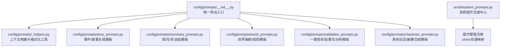
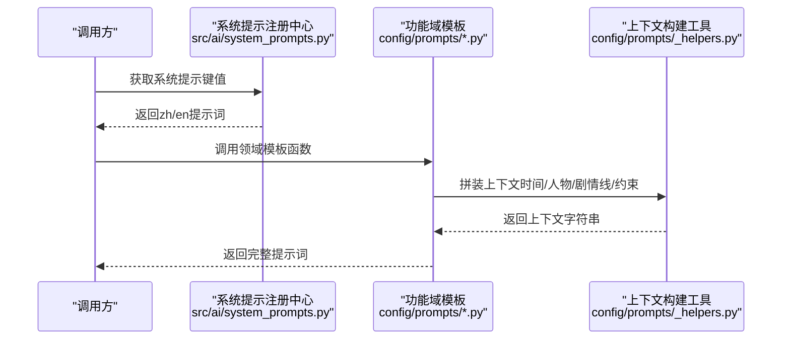
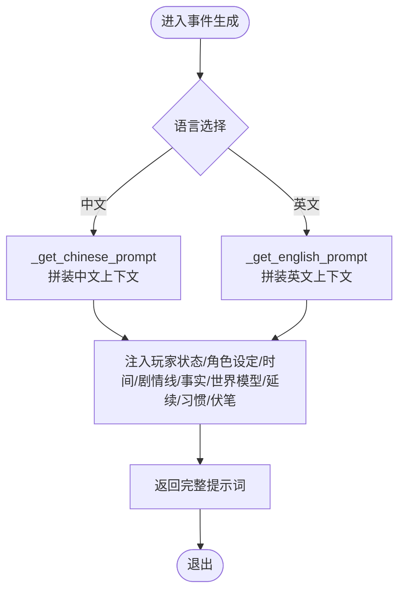
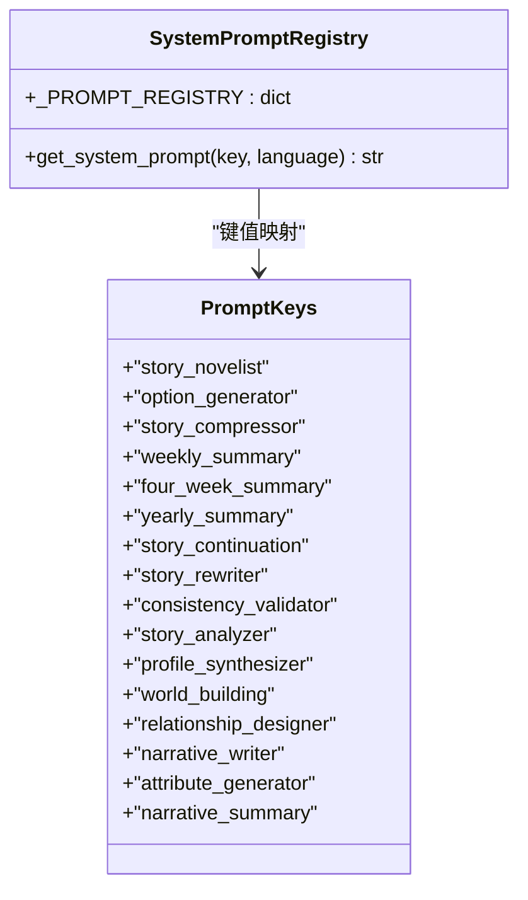
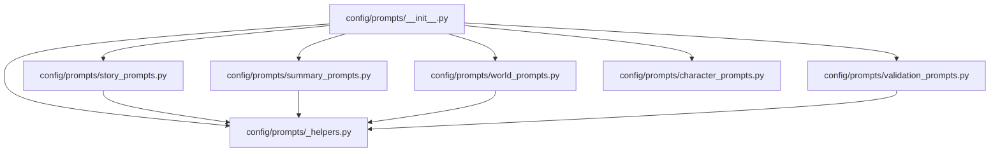

# 提示模板定制

<cite>
**本文档引用的文件**
- [config/prompts/__init__.py](file://config/prompts/__init__.py)
- [config/prompts/_helpers.py](file://config/prompts/_helpers.py)
- [config/prompts/character_prompts.py](file://config/prompts/character_prompts.py)
- [config/prompts/story_prompts.py](file://config/prompts/story_prompts.py)
- [config/prompts/world_prompts.py](file://config/prompts/world_prompts.py)
- [config/prompts/summary_prompts.py](file://config/prompts/summary_prompts.py)
- [config/prompts/validation_prompts.py](file://config/prompts/validation_prompts.py)
- [config/settings.py](file://config/settings.py)
- [src/ai/system_prompts.py](file://src/ai/system_prompts.py)
</cite>

## 目录
1. [简介](#简介)
2. [项目结构](#项目结构)
3. [核心组件](#核心组件)
4. [架构总览](#架构总览)
5. [详细组件分析](#详细组件分析)
6. [依赖分析](#依赖分析)
7. [性能考量](#性能考量)
8. [故障排查指南](#故障排查指南)
9. [结论](#结论)
10. [附录](#附录)

## 简介
本指南面向提示模板定制与管理，系统梳理提示模板的注册机制、分类与命名规范、版本控制策略、国际化实现、参数化设计、优化技巧与调试工具使用。文档以代码为依据，结合实际文件路径与行号，帮助开发者高效维护与扩展提示模板体系。

## 项目结构
提示模板集中位于 config/prompts 目录，按功能域拆分模块，统一通过 config/prompts/__init__.py 汇总导出，便于跨模块引用与版本管理。系统还包含系统级提示注册中心 src/ai/system_prompts.py，用于统一管理不同角色（如小说家、选项生成器、一致性校验器等）的系统提示词。

图表来源
- [config/prompts/__init__.py](file://config/prompts/__init__.py#L1-L121)
- [config/prompts/_helpers.py](file://config/prompts/_helpers.py#L1-L814)
- [config/prompts/story_prompts.py](file://config/prompts/story_prompts.py#L1-L1099)
- [config/prompts/summary_prompts.py](file://config/prompts/summary_prompts.py#L1-L972)
- [config/prompts/world_prompts.py](file://config/prompts/world_prompts.py#L1-L409)
- [config/prompts/validation_prompts.py](file://config/prompts/validation_prompts.py#L1-L410)
- [config/prompts/character_prompts.py](file://config/prompts/character_prompts.py#L1-L823)
- [src/ai/system_prompts.py](file://src/ai/system_prompts.py#L1-L279)

章节来源
- [config/prompts/__init__.py](file://config/prompts/__init__.py#L1-L121)

## 核心组件
- 统一导出入口：通过 config/prompts/__init__.py 将各功能域模板集中导出，便于外部模块按需导入与版本控制。
- 功能域模板：
  - 事件与故事生成：config/prompts/story_prompts.py
  - 总结与回顾：config/prompts/summary_prompts.py
  - 世界抽取与结局：config/prompts/world_prompts.py
  - 校验与一致性：config/prompts/validation_prompts.py
  - 角色设定与画像：config/prompts/character_prompts.py
- 上下文构建工具：config/prompts/_helpers.py 提供人物列表、时间、剧情线、世界模型约束、逻辑约束、习惯、伏笔等上下文拼装函数。
- 系统提示注册中心：src/ai/system_prompts.py 提供系统级提示词的键值注册与语言切换。

章节来源
- [config/prompts/__init__.py](file://config/prompts/__init__.py#L15-L121)
- [config/prompts/_helpers.py](file://config/prompts/_helpers.py#L1-L814)
- [config/prompts/story_prompts.py](file://config/prompts/story_prompts.py#L1-L1099)
- [config/prompts/summary_prompts.py](file://config/prompts/summary_prompts.py#L1-L972)
- [config/prompts/world_prompts.py](file://config/prompts/world_prompts.py#L1-L409)
- [config/prompts/validation_prompts.py](file://config/prompts/validation_prompts.py#L1-L410)
- [config/prompts/character_prompts.py](file://config/prompts/character_prompts.py#L1-L823)
- [src/ai/system_prompts.py](file://src/ai/system_prompts.py#L242-L279)

## 架构总览
提示模板的调用链路遵循“系统提示注册中心 + 功能域模板 + 上下文构建工具”的三层结构。系统提示注册中心负责角色化与语言切换，功能域模板负责业务场景的提示词拼装，上下文构建工具负责动态参数注入与一致性约束。

图表来源
- [src/ai/system_prompts.py](file://src/ai/system_prompts.py#L264-L279)
- [config/prompts/__init__.py](file://config/prompts/__init__.py#L21-L77)
- [config/prompts/_helpers.py](file://config/prompts/_helpers.py#L136-L800)
- [config/prompts/story_prompts.py](file://config/prompts/story_prompts.py#L21-L361)

## 详细组件分析

### 组件A：事件与故事生成模板（story_prompts）
- 职责：生成事件描述、选项、结果续写、纯故事文本等。
- 关键函数：
  - get_event_generation_prompt：主入口，按语言返回中/英模板。
  - _get_chinese_prompt/_get_english_prompt：分别拼装中文/英文提示词。
  - get_result_generation_prompt：基于玩家选择生成结果续写。
  - get_options_only_prompt：从既有故事中抽取选项。
  - get_story_only_prompt：生成纯故事文本（不含JSON）。
- 参数化设计：
  - 支持玩家状态（年龄、精力、情绪、学识、财富、关系）、角色设定、时间信息、未完结剧情线、已建立事实、世界模型、上一轮故事、伏笔种子、人物习惯等动态注入。
  - 通过 _helpers 模块函数构建可用人物列表、时间上下文、逻辑约束、延续指令、习惯与伏笔回响等。
- 国际化实现：
  - 通过 language 参数在中文/英文分支间切换，保证提示词与输出格式一致。
- 版本控制策略：
  - 通过函数签名与上下文字段的稳定性保障提示词版本演进；新增字段建议在上下文拼装处可选注入，避免破坏旧版提示词结构。

图表来源
- [config/prompts/story_prompts.py](file://config/prompts/story_prompts.py#L61-L192)
- [config/prompts/story_prompts.py](file://config/prompts/story_prompts.py#L195-L361)
- [config/prompts/_helpers.py](file://config/prompts/_helpers.py#L136-L800)

章节来源
- [config/prompts/story_prompts.py](file://config/prompts/story_prompts.py#L21-L361)
- [config/prompts/_helpers.py](file://config/prompts/_helpers.py#L136-L800)

### 组件B：总结与回顾模板（summary_prompts）
- 职责：生成周/月/年总结、故事压缩、叙事压缩等。
- 关键函数：
  - get_four_week_summary_prompt/get_yearly_summary_prompt：生成4周/年度总结。
  - get_story_compression_prompt/get_narrative_compression_prompt：压缩故事、判断事件完结、评估剧情线、抽取事实与习惯等。
  - get_ending_prompt：生成结局总结。
- 参数化设计：
  - 接收故事列表、决策列表、角色设定、时间信息、未完结剧情线、已建立事实、人物习惯等。
  - 通过上下文构建工具注入时间与事实/习惯上下文。
- 国际化实现：
  - 中/英模板在同一函数内按语言分支返回。

章节来源
- [config/prompts/summary_prompts.py](file://config/prompts/summary_prompts.py#L33-L120)
- [config/prompts/summary_prompts.py](file://config/prompts/summary_prompts.py#L122-L795)
- [config/prompts/_helpers.py](file://config/prompts/_helpers.py#L136-L168)

### 组件C：世界抽取与结局模板（world_prompts）
- 职责：从故事中抽取世界事实、人物习惯、位置变动、职业变动、承诺、因果链、伏笔种子等；生成结局总结。
- 关键函数：
  - get_world_extraction_prompt：抽取世界状态变化。
  - get_ending_prompt：生成结局总结。
  - get_scheduled_commitment_extraction_prompt：提取带具体时间点的承诺。
- 参数化设计：
  - 输入故事文本、玩家选择、当前周/轮次、语言、已建立事实、人物习惯等。
  - 输出JSON格式的抽取结果，字段覆盖事实、习惯、位置、职业、承诺、因果链与伏笔种子。

章节来源
- [config/prompts/world_prompts.py](file://config/prompts/world_prompts.py#L35-L263)
- [config/prompts/world_prompts.py](file://config/prompts/world_prompts.py#L266-L408)

### 组件D：校验与一致性模板（validation_prompts）
- 职责：故事分析与一致性校验。
- 关键函数：
  - get_story_analysis_prompt：自由提取对未来叙事有约束力的事实，生成约束文本与溯源摘录。
  - get_consistency_validation_prompt：对照世界模型约束检查地理、职业、性格、时间、承诺、因果、编造事实等维度。
- 参数化设计：
  - 输入故事文本、玩家选择、现有事实上下文、角色设定、当前周数、语言。
  - 输出问题清单、严重级别、修复建议与是否重试的判断。

章节来源
- [config/prompts/validation_prompts.py](file://config/prompts/validation_prompts.py#L12-L200)
- [config/prompts/validation_prompts.py](file://config/prompts/validation_prompts.py#L203-L410)

### 组件E：角色设定与画像模板（character_prompts）
- 职责：生成角色设定、关系人物、关系总结、初始属性、开场故事、行为画像合成等。
- 关键函数：
  - get_character_setting_prompt：按类型生成时代、年龄、性别、世界、家庭、关系、特质、财富等设定。
  - get_relationship_person_prompt：逐个生成关系人物。
  - get_relationships_summary_prompt：生成关系总结。
  - get_initial_attributes_prompt：生成初始属性。
  - get_opening_story_prompt：生成开场故事。
  - get_character_profile_synthesis_prompt：合成/更新行为画像。
- 参数化设计：
  - 支持语言切换、反馈重生成、JSON输出格式约束、命名规则与时代背景匹配等。

章节来源
- [config/prompts/character_prompts.py](file://config/prompts/character_prompts.py#L18-L127)
- [config/prompts/character_prompts.py](file://config/prompts/character_prompts.py#L132-L387)
- [config/prompts/character_prompts.py](file://config/prompts/character_prompts.py#L393-L530)
- [config/prompts/character_prompts.py](file://config/prompts/character_prompts.py#L533-L583)
- [config/prompts/character_prompts.py](file://config/prompts/character_prompts.py#L586-L701)
- [config/prompts/character_prompts.py](file://config/prompts/character_prompts.py#L704-L801)

### 组件F：系统提示注册中心（system_prompts）
- 职责：集中管理不同角色（小说家、选项生成器、压缩器、校验器、分析器、画像合成器、世界构建、关系设计、叙事写手、属性生成、叙事总结等）的系统提示词，提供 zh/en 双语映射与键值检索。
- 注册机制：
  - 通过 _PROMPT_REGISTRY 字典维护键值到（中文, 英文）提示词元组的映射。
  - get_system_prompt(key, language) 根据键值与语言返回对应提示词。
- 版本控制策略：
  - 通过键值稳定与提示词元组的可替换性实现版本演进；新增角色提示词通过扩展注册表实现。

图表来源
- [src/ai/system_prompts.py](file://src/ai/system_prompts.py#L242-L279)

章节来源
- [src/ai/system_prompts.py](file://src/ai/system_prompts.py#L242-L279)

## 依赖分析
- 模块耦合：
  - config/prompts/__init__.py 作为统一导出入口，聚合各功能域模板，降低外部依赖复杂度。
  - 各功能域模板依赖 config/prompts/_helpers.py 提供的上下文构建工具，实现参数化与一致性约束。
  - 系统提示注册中心独立于功能域模板，通过键值解耦不同角色的提示词。
- 直接/间接依赖：
  - story_prompts 依赖 _helpers 的时间、剧情线、事实、世界模型、逻辑、延续、习惯、伏笔等上下文函数。
  - summary_prompts 依赖 _helpers 的时间与格式化工具。
  - world_prompts 依赖 _helpers 的格式化工具。
  - validation_prompts 依赖 _helpers 的格式化工具。
- 外部依赖：
  - config/settings.py 提供默认语言、缓存开关、调试模式等全局配置，影响提示词的语言与运行模式。

图表来源
- [config/prompts/__init__.py](file://config/prompts/__init__.py#L21-L77)
- [config/prompts/_helpers.py](file://config/prompts/_helpers.py#L1-L814)
- [config/prompts/story_prompts.py](file://config/prompts/story_prompts.py#L4-L18)
- [config/prompts/summary_prompts.py](file://config/prompts/summary_prompts.py#L4-L7)
- [config/prompts/world_prompts.py](file://config/prompts/world_prompts.py#L9-L10)
- [config/prompts/validation_prompts.py](file://config/prompts/validation_prompts.py#L9-L10)
- [config/prompts/character_prompts.py](file://config/prompts/character_prompts.py#L13-L15)

章节来源
- [config/prompts/__init__.py](file://config/prompts/__init__.py#L21-L77)
- [config/prompts/_helpers.py](file://config/prompts/_helpers.py#L1-L814)

## 性能考量
- KV缓存前缀稳定性：系统提示注册中心通过稳定的提示词字符串提升KV缓存命中率，减少LLM请求开销。
- 上下文裁剪与长度控制：
  - 事件生成模板对上一轮未完结故事进行截断（中文最多1500字符，英文最多1500字符），避免提示词过长导致Token浪费。
  - 纯故事生成模板对上一轮故事进行尾部截断（中文最多800字符，英文最多800字符），保持上下文连贯的同时控制长度。
- 并行处理：
  - 故事压缩与世界抽取可并行执行，减少整体处理延迟。
- 语言切换成本：
  - 通过统一键值检索与语言分支，避免重复拼装提示词，降低切换成本。

章节来源
- [src/ai/system_prompts.py](file://src/ai/system_prompts.py#L1-L30)
- [config/prompts/story_prompts.py](file://config/prompts/story_prompts.py#L270-L304)
- [config/prompts/story_prompts.py](file://config/prompts/story_prompts.py#L307-L324)

## 故障排查指南
- 常见问题与定位：
  - 选项与故事无关：检查 get_options_only_prompt 的输入故事与可用人物列表，确保选项直接回应故事结尾的决策点。
  - 人物超出可用列表：检查 _build_available_people_constraint 与角色设定中的家庭/关系人物，确保所有人物来自“可用人物列表”。
  - 逻辑矛盾与编造事实：使用 get_consistency_validation_prompt 对照世界模型约束逐项检查，重点关注地理、职业、性格、时间、承诺、因果与编造事实维度。
  - 语言不一致：核对 language 参数传递与各模板的 zh/en 分支，确保输出格式与语言一致。
- 调试建议：
  - 在调用链路中打印关键上下文（时间、可用人物、剧情线、事实、世界模型、延续、习惯、伏笔）以辅助定位。
  - 使用最小化输入（仅必要字段）快速复现问题，逐步增加上下文以缩小范围。
  - 对系统提示注册中心进行单元测试，确保键值与语言映射正确。

章节来源
- [config/prompts/story_prompts.py](file://config/prompts/story_prompts.py#L440-L609)
- [config/prompts/validation_prompts.py](file://config/prompts/validation_prompts.py#L203-L410)
- [src/ai/system_prompts.py](file://src/ai/system_prompts.py#L264-L279)

## 结论
提示模板定制体系以“统一导出 + 功能域模板 + 上下文构建工具 + 系统提示注册中心”为核心，实现了模板的分类管理、参数化注入、国际化支持与版本演进。通过严格的上下文约束与一致性校验，确保生成内容在时间、逻辑、角色与世界层面保持稳定与可信。建议在扩展新模板时遵循现有命名与参数化模式，利用注册中心与导出入口实现统一维护与高效调试。

## 附录

### A. 分类与命名规范
- 分类：按业务域划分（事件/故事、总结、世界抽取、校验、角色设定/画像）。
- 命名：采用语义化函数名（如 get_*_prompt、_get_chinese_prompt/_get_english_prompt），便于检索与维护。
- 输出格式：明确JSON约束（如选项、效果、摘要、抽取结果等），确保下游解析稳定。

章节来源
- [config/prompts/__init__.py](file://config/prompts/__init__.py#L21-L77)
- [config/prompts/story_prompts.py](file://config/prompts/story_prompts.py#L162-L190)
- [config/prompts/summary_prompts.py](file://config/prompts/summary_prompts.py#L191-L452)

### B. 版本控制策略
- 稳定键值：系统提示注册中心的键值保持稳定，新增角色通过扩展注册表实现。
- 可选上下文：在上下文拼装处新增字段时，建议提供默认值与可选注入，避免破坏旧版提示词结构。
- 文档化变更：对提示词结构与输出格式的变更进行文档记录，便于追踪与回归测试。

章节来源
- [src/ai/system_prompts.py](file://src/ai/system_prompts.py#L242-L279)
- [config/prompts/_helpers.py](file://config/prompts/_helpers.py#L136-L800)

### C. 国际化实现要点
- 语言参数：通过 language 参数在中文/英文分支间切换，保证提示词与输出格式一致。
- 统一注册：系统提示注册中心提供 zh/en 双语映射，确保角色提示词的国际化一致性。
- 上下文格式：时间、人物、剧情线、事实、世界模型、逻辑约束、延续、习惯、伏笔等均支持中/英格式化。

章节来源
- [config/prompts/story_prompts.py](file://config/prompts/story_prompts.py#L55-L58)
- [config/prompts/story_prompts.py](file://config/prompts/story_prompts.py#L195-L361)
- [src/ai/system_prompts.py](file://src/ai/system_prompts.py#L242-L279)

### D. 参数化设计与占位符替换
- 动态注入：通过 player_state、character_settings、game_date_info、pending_storylines、established_facts、world_model、last_event_concluded、last_round_full_story、activated_foreshadowing、character_habits 等参数动态拼装提示词。
- 上下文函数：_helpers 提供 _build_* 系列函数，将复杂上下文转换为可注入字符串，简化模板拼装。
- 输出约束：模板明确输出格式（JSON/纯文本），并通过字段约束（如 effects、relationships、constraint_text 等）确保结构化数据一致性。

章节来源
- [config/prompts/_helpers.py](file://config/prompts/_helpers.py#L136-L800)
- [config/prompts/story_prompts.py](file://config/prompts/story_prompts.py#L21-L361)
- [config/prompts/summary_prompts.py](file://config/prompts/summary_prompts.py#L122-L795)

### E. 优化技巧与最佳实践
- 提示工程：
  - 明确角色职责与输出格式，减少歧义与多余说明。
  - 使用“必须/禁止/建议”等强约束词汇，提升LLM遵循度。
  - 在模板中加入“只返回JSON/只返回文本”的明确要求，避免多余解释。
- 性能优化：
  - 控制提示词长度，避免过长上下文导致Token浪费。
  - 并行执行故事压缩与世界抽取，缩短整体延迟。
  - 利用KV缓存前缀稳定性，提升重复请求命中率。
- 效果评估：
  - 使用 get_consistency_validation_prompt 对生成内容进行一致性检查。
  - 通过 get_story_analysis_prompt 提取关键事实，形成可复用的约束文本。
  - 对输出进行抽样评估，关注逻辑矛盾、角色一致性与叙事连贯性。

章节来源
- [src/ai/system_prompts.py](file://src/ai/system_prompts.py#L1-L30)
- [config/prompts/validation_prompts.py](file://config/prompts/validation_prompts.py#L203-L410)
- [config/prompts/summary_prompts.py](file://config/prompts/summary_prompts.py#L122-L795)

### F. 完整模板定制示例与调试工具
- 定制步骤：
  - 在 config/prompts/ 下新增模板文件或扩展现有模板，遵循 get_*_prompt 的命名与参数规范。
  - 在 config/prompts/__init__.py 中导出新函数，确保统一入口可见。
  - 如需系统提示角色，扩展 src/ai/system_prompts.py 的 _PROMPT_REGISTRY 与 get_system_prompt。
  - 在调用侧传入 language 参数与必要上下文，确保中/英分支一致。
- 调试工具：
  - 使用 get_consistency_validation_prompt 对生成内容进行一致性检查。
  - 使用 get_story_analysis_prompt 提取关键事实与约束文本。
  - 在系统提示注册中心进行单元测试，确保键值与语言映射正确。

章节来源
- [config/prompts/__init__.py](file://config/prompts/__init__.py#L79-L121)
- [src/ai/system_prompts.py](file://src/ai/system_prompts.py#L242-L279)
- [config/prompts/validation_prompts.py](file://config/prompts/validation_prompts.py#L12-L200)