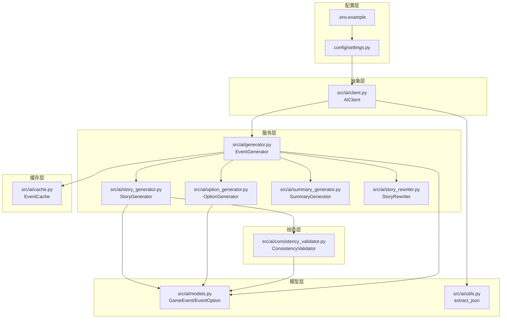
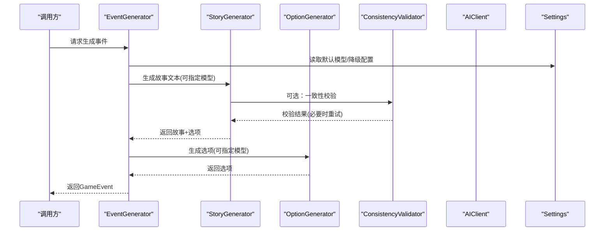
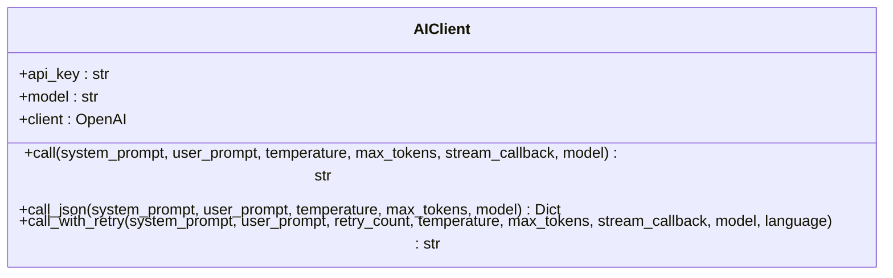
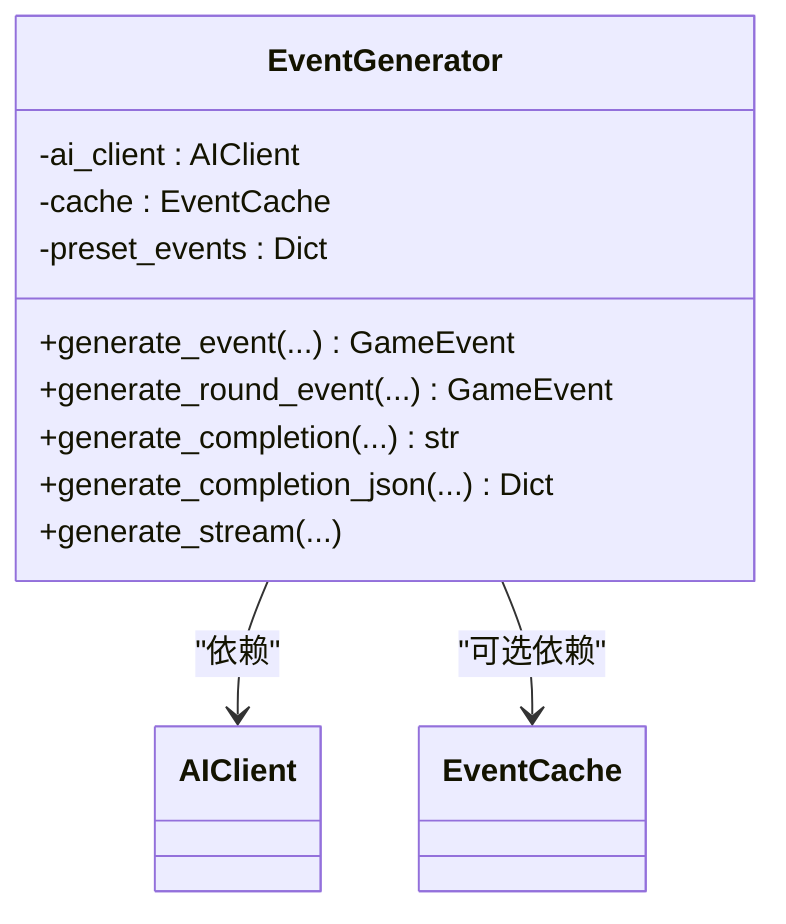
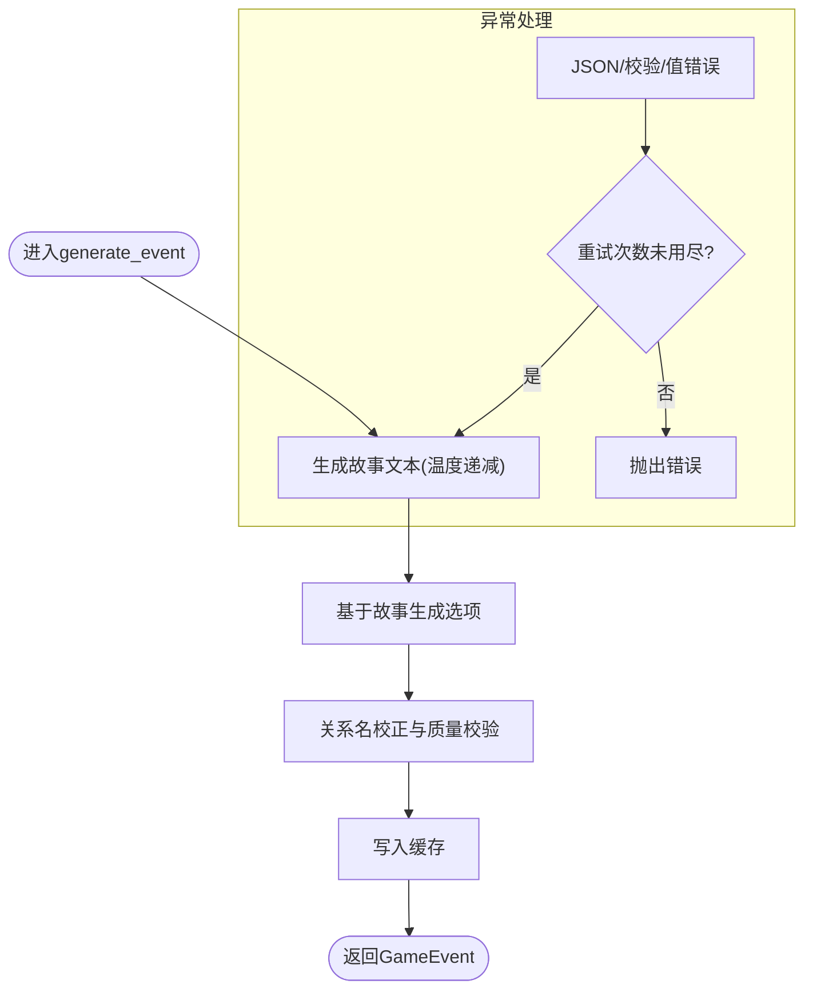
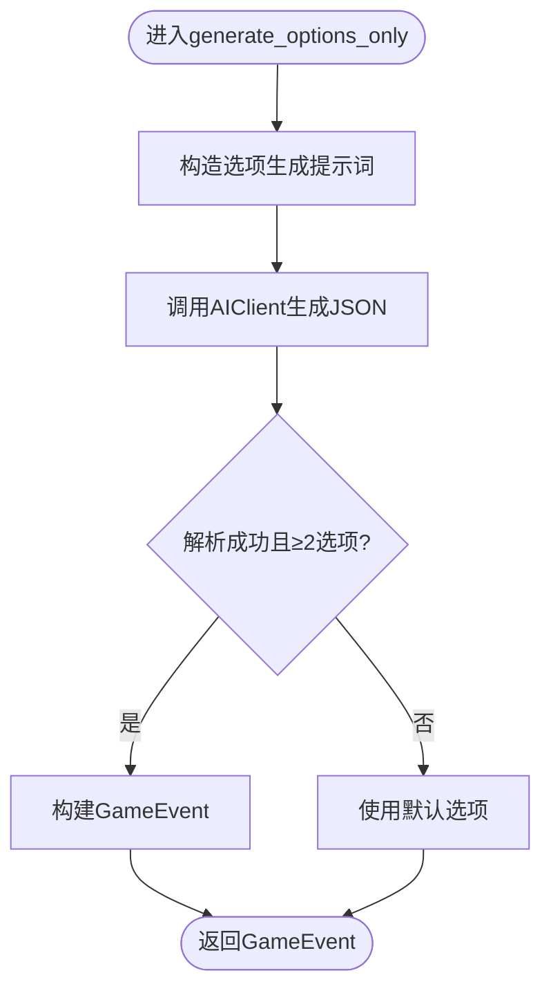
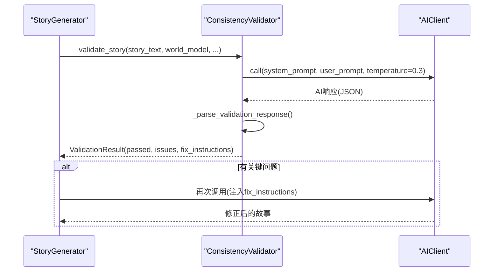
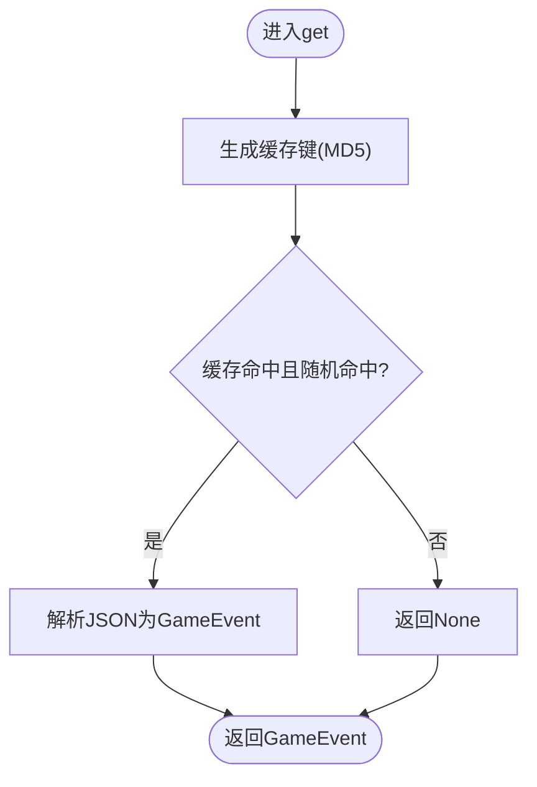
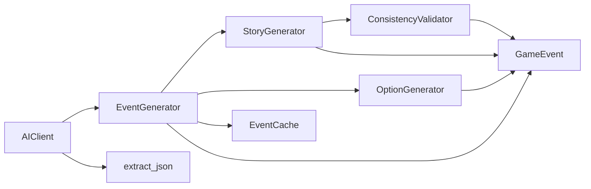
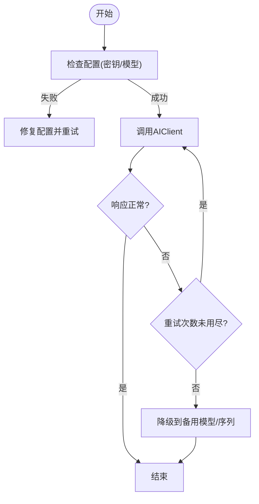

# 模型切换机制

<cite>
**本文档引用的文件**
- [src/ai/client.py](file://src/ai/client.py)
- [src/ai/generator.py](file://src/ai/generator.py)
- [src/ai/story_generator.py](file://src/ai/story_generator.py)
- [src/ai/option_generator.py](file://src/ai/option_generator.py)
- [src/ai/consistency_validator.py](file://src/ai/consistency_validator.py)
- [src/ai/cache.py](file://src/ai/cache.py)
- [src/ai/models.py](file://src/ai/models.py)
- [src/ai/utils.py](file://src/ai/utils.py)
- [config/settings.py](file://config/settings.py)
- [.env.example](file://.env.example)
</cite>

## 目录
1. [引言](#引言)
2. [项目结构](#项目结构)
3. [核心组件](#核心组件)
4. [架构总览](#架构总览)
5. [详细组件分析](#详细组件分析)
6. [依赖关系分析](#依赖关系分析)
7. [性能考虑](#性能考虑)
8. [故障排查指南](#故障排查指南)
9. [结论](#结论)
10. [附录](#附录)

## 引言
本文件围绕“模型切换机制”展开，系统化阐述运行时模型选择、负载均衡策略、故障转移机制；解释模型性能监控体系（响应时间统计、成功率计算、资源消耗监控）；给出模型回滚策略（自动降级、手动切换、灰度发布）；并提供模型A/B测试框架（实验设计、数据收集与效果评估）。文档同时包含完整的切换配置示例与故障处理流程，帮助开发者在生产环境中安全、可控地演进AI模型。

## 项目结构
该项目采用模块化分层设计：
- 配置层：集中管理API密钥、模型名称、功能开关等全局参数
- 抽象层：统一AI调用抽象（AIClient），屏蔽底层SDK差异
- 服务层：事件生成器（EventGenerator）作为门面，协调故事生成、选项生成、摘要生成、重写等子服务
- 校验层：一致性校验器（ConsistencyValidator）对生成内容进行跨维度一致性检查
- 缓存层：事件缓存（EventCache）降低重复请求成本
- 数据模型层：GameEvent/EventOption等Pydantic模型定义

**图表来源**
- [config/settings.py](file://config/settings.py#L30-L68)
- [src/ai/client.py](file://src/ai/client.py#L22-L47)
- [src/ai/generator.py](file://src/ai/generator.py#L30-L66)
- [src/ai/story_generator.py](file://src/ai/story_generator.py#L24-L28)
- [src/ai/option_generator.py](file://src/ai/option_generator.py#L17-L21)
- [src/ai/consistency_validator.py](file://src/ai/consistency_validator.py#L42-L58)
- [src/ai/cache.py](file://src/ai/cache.py#L13-L26)
- [src/ai/models.py](file://src/ai/models.py#L7-L26)
- [src/ai/utils.py](file://src/ai/utils.py#L10-L76)

**章节来源**
- [config/settings.py](file://config/settings.py#L30-L68)
- [src/ai/client.py](file://src/ai/client.py#L22-L47)
- [src/ai/generator.py](file://src/ai/generator.py#L30-L66)

## 核心组件
- 统一AI调用抽象（AIClient）
  - 提供统一的call/call_json/call_with_retry接口，内置重试与错误反馈注入
  - 支持模型名覆盖与流式回调
- 事件生成门面（EventGenerator）
  - 聚合故事生成、选项生成、摘要生成、重写等能力
  - 支持预设事件、缓存命中、两阶段流水线（先故事后选项）
- 故事生成器（StoryGenerator）
  - 两阶段流水线第一步：生成纯故事文本
  - 支持一致性校验与自动重试（仅对关键问题）
  - 支持温度衰减策略，逐步提升约束性
- 选项生成器（OptionGenerator）
  - 两阶段流水线第二步：基于故事生成选项
  - 关系名校正与质量校验
- 一致性校验器（ConsistencyValidator）
  - 多维度一致性检查（地理、职业、个性、时间、承诺、因果、虚构）
  - AI驱动判断，支持应答式重试
- 事件缓存（EventCache）
  - 基于玩家状态签名的事件缓存，降低API调用与成本
- 数据模型（GameEvent/EventOption）
  - Pydantic模型定义，提供序列化与校验

**章节来源**
- [src/ai/client.py](file://src/ai/client.py#L22-L233)
- [src/ai/generator.py](file://src/ai/generator.py#L30-L497)
- [src/ai/story_generator.py](file://src/ai/story_generator.py#L24-L439)
- [src/ai/option_generator.py](file://src/ai/option_generator.py#L17-L264)
- [src/ai/consistency_validator.py](file://src/ai/consistency_validator.py#L42-L405)
- [src/ai/cache.py](file://src/ai/cache.py#L13-L139)
- [src/ai/models.py](file://src/ai/models.py#L7-L26)

## 架构总览
下图展示运行时模型选择与切换的总体流程：配置层决定默认模型与降级模型序列；抽象层负责实际调用；服务层按需选择具体模型；校验层保障质量；缓存层提升吞吐。

**图表来源**
- [src/ai/generator.py](file://src/ai/generator.py#L211-L268)
- [src/ai/story_generator.py](file://src/ai/story_generator.py#L32-L190)
- [src/ai/option_generator.py](file://src/ai/option_generator.py#L25-L132)
- [src/ai/consistency_validator.py](file://src/ai/consistency_validator.py#L60-L122)
- [config/settings.py](file://config/settings.py#L60-L68)

## 详细组件分析

### 组件A：统一AI调用抽象（AIClient）
- 设计要点
  - 单一入口封装OpenAI客户端，屏蔽SDK差异
  - 提供call/call_json/call_with_retry三类接口
  - 支持模型名覆盖、温度、最大token、流式回调
  - 错误反馈注入：重试时将上次错误注入提示词，帮助模型避免重复问题
- 关键行为
  - call_with_retry：最多N次重试，首次保留流式回调，后续仅静默重试
  - call_json：解析AI输出中的JSON，增强鲁棒性
  - 超长截断告警：当finish_reason为length时发出警告

**图表来源**
- [src/ai/client.py](file://src/ai/client.py#L22-L233)

**章节来源**
- [src/ai/client.py](file://src/ai/client.py#L22-L233)

### 组件B：事件生成门面（EventGenerator）
- 设计要点
  - Facade模式：聚合多个子服务，保持向后兼容
  - 支持预设事件、缓存、两阶段流水线
  - 通过AIClient统一调度，支持模型覆盖
- 关键流程
  - generate_event：先故事后选项，必要时缓存
  - generate_round_event：单轮事件生成，支持世界模型一致性校验
  - generate_completion/generate_completion_json/stream：通用生成接口

**图表来源**
- [src/ai/generator.py](file://src/ai/generator.py#L30-L66)

**章节来源**
- [src/ai/generator.py](file://src/ai/generator.py#L30-L497)

### 组件C：故事生成器（StoryGenerator）
- 设计要点
  - 两阶段流水线第一步：生成故事文本
  - 渐进式温度策略：初次0.85，重试依次下降至0.7，提升约束性
  - 一致性校验：仅对关键问题触发一次性重试，避免过度重试
  - 流式回调：首轮允许流式输出，后续重试保持静默
- 关键流程
  - generate_event：故事生成+选项生成+质量校验+缓存
  - generate_round_event：单轮故事生成，支持世界模型约束
  - _validate_and_retry_story：关键问题一次性重试，保守温度0.7

**图表来源**
- [src/ai/story_generator.py](file://src/ai/story_generator.py#L32-L190)

**章节来源**
- [src/ai/story_generator.py](file://src/ai/story_generator.py#L32-L439)

### 组件D：选项生成器（OptionGenerator）
- 设计要点
  - 两阶段流水线第二步：从故事生成选项
  - 关系名修复：对key_people/family成员名进行精确/大小写/角色匹配修复
  - 质量校验：确保至少两个选项、合理的效果范围、存在权衡
- 关键流程
  - generate_options_only：生成选项并解析JSON
  - validate_and_fix_relationships：修复关系名
  - validate_event_quality：检查权衡与数值合理性

**图表来源**
- [src/ai/option_generator.py](file://src/ai/option_generator.py#L25-L132)

**章节来源**
- [src/ai/option_generator.py](file://src/ai/option_generator.py#L25-L264)

### 组件E：一致性校验器（ConsistencyValidator）
- 设计要点
  - 多维度一致性检查：地理、职业、个性、时间、承诺、因果、虚构
  - AI驱动判断：返回should_retry与详细问题列表
  - 历史交叉验证：结合历史故事与动态事实进行捐造与因果检测
- 关键流程
  - validate_story：生成校验提示词并解析AI结果
  - validate_with_history：历史与事实交叉验证
  - _parse_validation_response：解析AI输出，构建ValidationResult

**图表来源**
- [src/ai/consistency_validator.py](file://src/ai/consistency_validator.py#L60-L240)
- [src/ai/story_generator.py](file://src/ai/story_generator.py#L334-L426)

**章节来源**
- [src/ai/consistency_validator.py](file://src/ai/consistency_validator.py#L60-L405)

### 组件F：事件缓存（EventCache）
- 设计要点
  - 基于玩家状态签名的MD5缓存键，包含年龄、资源、周数、决策数等
  - 随机概率（约30%）命中缓存，保证多样性
  - 文件持久化events_cache.json
- 关键流程
  - get：生成键→查找→随机命中→反序列化→返回
  - set：序列化→写入文件

**图表来源**
- [src/ai/cache.py](file://src/ai/cache.py#L78-L101)

**章节来源**
- [src/ai/cache.py](file://src/ai/cache.py#L13-L139)

### 组件G：数据模型（GameEvent/EventOption）
- 设计要点
  - Pydantic模型，提供字段长度限制、必填项校验
  - from_json：从字符串解析为GameEvent对象
- 关键字段
  - GameEvent：event_description、options（2-4个）
  - EventOption：text、effects、likely_choice

**章节来源**
- [src/ai/models.py](file://src/ai/models.py#L7-L26)

## 依赖关系分析
- 组件耦合
  - EventGenerator高度内聚，依赖AIClient与各子服务
  - StoryGenerator与ConsistencyValidator弱耦合，通过接口调用
  - OptionGenerator与StoryGenerator解耦，仅共享AIClient
- 外部依赖
  - OpenAI SDK（通过AIClient封装）
  - 配置系统（Settings）

**图表来源**
- [src/ai/generator.py](file://src/ai/generator.py#L19-L25)
- [src/ai/story_generator.py](file://src/ai/story_generator.py#L17-L19)
- [src/ai/option_generator.py](file://src/ai/option_generator.py#L9-L12)
- [src/ai/consistency_validator.py](file://src/ai/consistency_validator.py#L51-L58)
- [src/ai/cache.py](file://src/ai/cache.py#L13-L26)
- [src/ai/models.py](file://src/ai/models.py#L7-L26)
- [src/ai/utils.py](file://src/ai/utils.py#L10-L76)

**章节来源**
- [src/ai/generator.py](file://src/ai/generator.py#L19-L25)
- [src/ai/story_generator.py](file://src/ai/story_generator.py#L17-L19)
- [src/ai/option_generator.py](file://src/ai/option_generator.py#L9-L12)

## 性能考虑
- 响应时间统计
  - 当前实现未内置显式的响应时间埋点；可在AIClient的call/call_json中增加计时器，并通过日志或指标上报
- 成功率计算
  - 可在调用链路中记录成功/失败次数，结合重试次数计算成功率
- 资源消耗监控
  - 建议统计每条请求的token用量（输入/输出）、调用次数、错误率
- 优化建议
  - 合理设置max_tokens，避免频繁截断
  - 使用EventCache降低重复请求
  - 在高并发场景下，控制重试次数与温度衰减节奏

[本节为通用指导，无需特定文件来源]

## 故障排查指南
- 常见问题与定位
  - JSON解析失败：检查AI输出包裹方式，确认extract_json覆盖范围
  - 一致性校验失败：查看ValidationResult中的关键问题，按fix_instructions修正
  - 缓存命中异常：检查缓存键生成逻辑与随机命中概率
  - API密钥/模型配置错误：核对.env与Settings配置
- 排障步骤
  - 打开DEBUG_MODE，查看详细日志
  - 临时禁用缓存与一致性校验，排除干扰因素
  - 降低温度或缩短提示词，缩小问题范围
  - 使用call_with_retry进行重试并观察错误反馈

**章节来源**
- [src/ai/utils.py](file://src/ai/utils.py#L10-L76)
- [src/ai/consistency_validator.py](file://src/ai/consistency_validator.py#L123-L239)
- [src/ai/cache.py](file://src/ai/cache.py#L78-L101)
- [config/settings.py](file://config/settings.py#L143-L149)

## 结论
该模型切换机制以AIClient为核心抽象，通过配置层的模型序列与服务层的两阶段流水线实现灵活的运行时选择。结合一致性校验与缓存策略，在保证质量的同时提升吞吐与稳定性。建议在生产环境中补充显式的性能监控与灰度发布流程，以实现更精细的模型治理。

[本节为总结性内容，无需特定文件来源]

## 附录

### A. 运行时模型选择与切换
- 默认模型与降级序列
  - 配置项：OPENAI_MODEL（主模型）、TEXT_TO_IMAGE_MODELS/IMAGE_EDIT_MODELS（图像模型降级序列）
  - 作用：在主模型不可用时，按序切换至备选模型
- 模型覆盖
  - EventGenerator/StoryGenerator/OptionGenerator均支持在调用时覆盖model参数
- 策略建议
  - 主模型：稳定、高性价比
  - 备选模型：同质化程度高，延迟与成本相近
  - 切换条件：超时/错误率阈值触发

**章节来源**
- [config/settings.py](file://config/settings.py#L30-L68)
- [src/ai/generator.py](file://src/ai/generator.py#L164-L174)
- [src/ai/story_generator.py](file://src/ai/story_generator.py#L129-L135)
- [src/ai/option_generator.py](file://src/ai/option_generator.py#L81-L86)

### B. 负载均衡策略
- 建议方案
  - 多区域/多可用区部署，按延迟与错误率动态路由
  - 对不同任务类型（故事/选项/校验）分配不同权重
- 实施要点
  - 在AIClient层增加路由策略与健康检查
  - 与CDN/SLB配合，实现就近访问

[本节为概念性内容，无需特定文件来源]

### C. 故障转移机制
- 自动降级
  - 当错误率超过阈值时，自动切换到降级模型序列
  - 降级期间记录指标，恢复后自动切回
- 手动切换
  - 通过配置热更新或管理界面，临时切换模型
- 灰度发布
  - 以用户/会话为粒度，按比例分流到新模型
  - 结合A/B测试框架进行效果评估

**章节来源**
- [config/settings.py](file://config/settings.py#L60-L68)

### D. 模型性能监控系统
- 指标建议
  - 响应时间：P50/P95/P99
  - 成功率：按模型/任务类型统计
  - 资源消耗：输入/输出tokens、调用次数
  - 错误分布：超时/截断/解析失败/一致性失败
- 上报方式
  - 日志埋点+指标系统（如Prometheus/Grafana）
  - 分布式追踪（如Jaeger/OpenTelemetry）

[本节为通用指导，无需特定文件来源]

### E. 模型回滚策略
- 自动降级
  - 基于错误率/延迟阈值触发
  - 降级窗口与恢复条件需明确
- 手动切换
  - 紧急情况下快速回滚至上一版本
- 灰度回滚
  - 逐步回收流量，观察指标后再全量回滚

[本节为通用指导，无需特定文件来源]

### F. A/B测试框架
- 实验设计
  - 分组：对照组（现网模型）vs 实验组（候选模型）
  - 指标：用户体验、一致性、成本、稳定性
- 数据收集
  - 用户分桶、会话分桶、请求级埋点
- 效果评估
  - 显著性检验、置信区间、最小可察觉差异（MAGIC）

[本节为通用指导，无需特定文件来源]

### G. 切换配置示例
- 环境变量示例
  - OPENAI_API_KEY、OPENAI_MODEL、OPENAI_BASE_URL
  - TEXT_TO_IMAGE_MODELS、IMAGE_EDIT_MODELS
  - DEFAULT_LANGUAGE、CACHE_EVENTS
- 设置项说明
  - OPENAI_MODEL：主模型名称
  - TEXT_TO_IMAGE_MODELS：图像生成降级序列（逗号分隔）
  - IMAGE_EDIT_MODELS：图像编辑降级序列（逗号分隔）
  - CACHE_EVENTS：是否启用事件缓存

**章节来源**
- [.env.example](file://.env.example#L1-L22)
- [config/settings.py](file://config/settings.py#L30-L73)

### H. 故障处理流程

[本图为概念流程，无需图表来源]