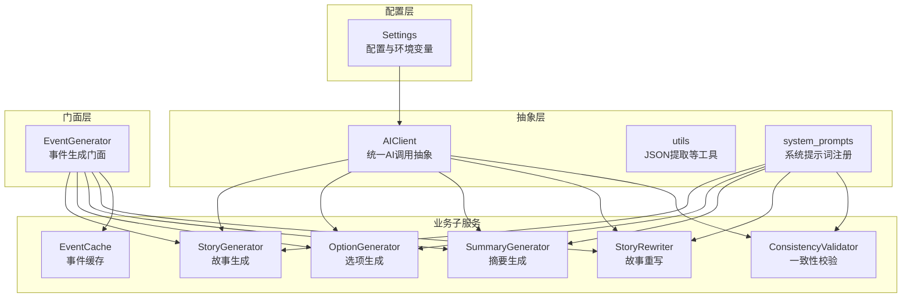
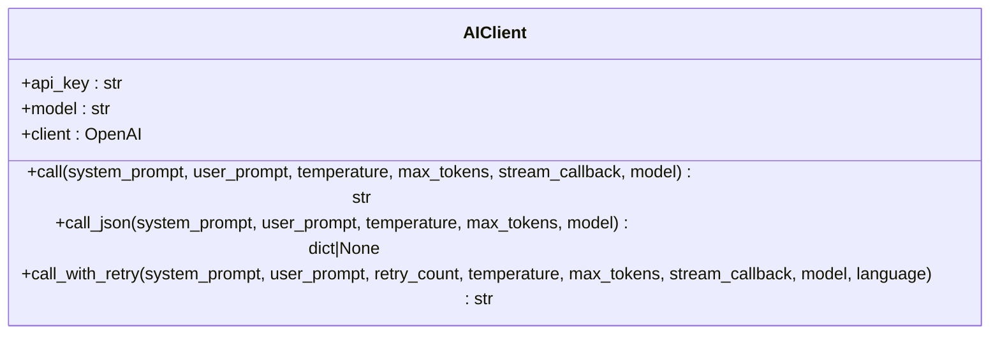
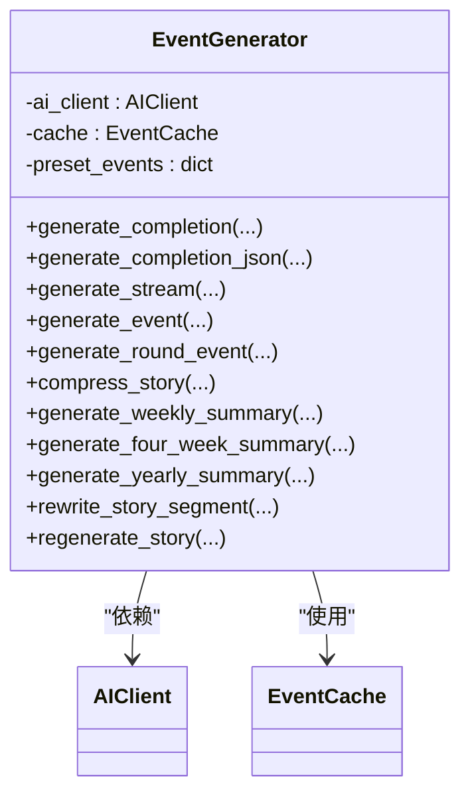
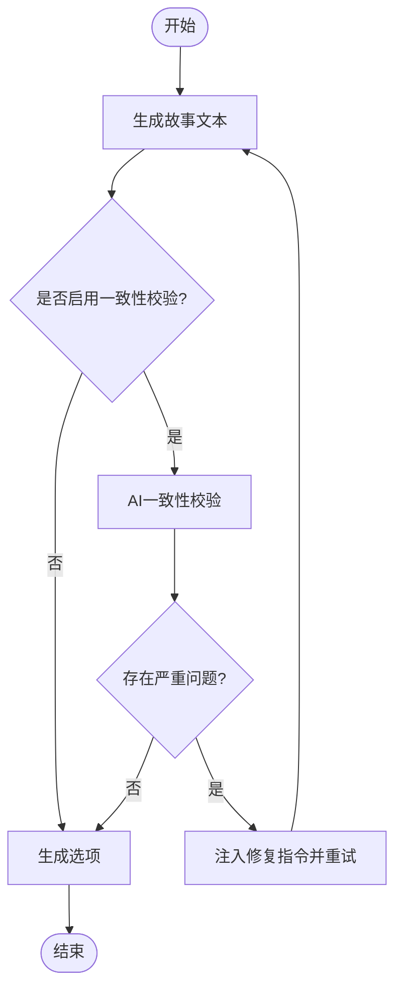
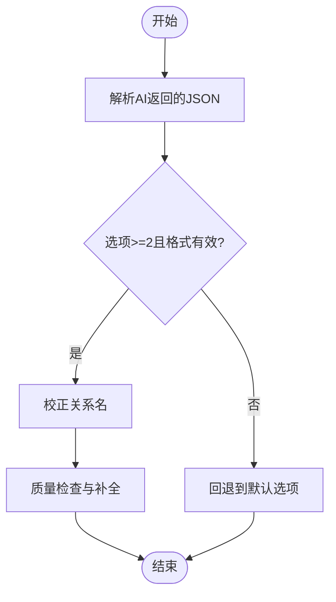
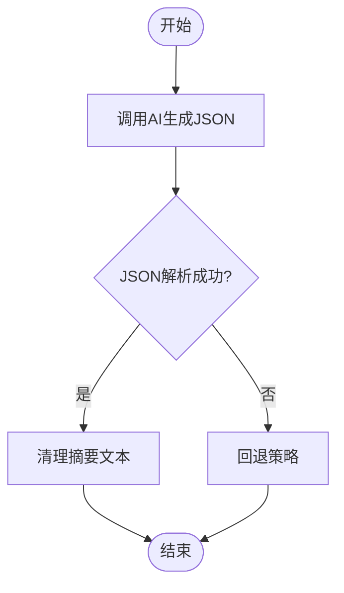
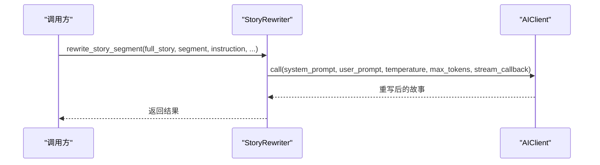
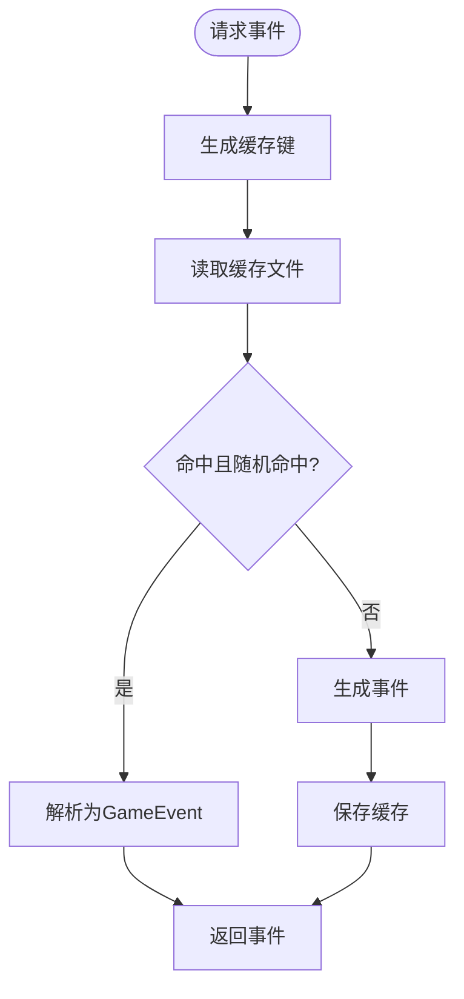
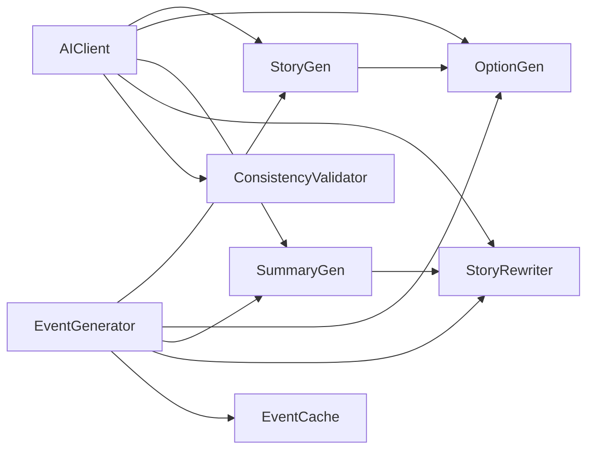

# 模型接口定义

<cite>
**本文档引用的文件**
- [src/ai/client.py](file://src/ai/client.py)
- [src/ai/generator.py](file://src/ai/generator.py)
- [src/ai/models.py](file://src/ai/models.py)
- [src/ai/utils.py](file://src/ai/utils.py)
- [src/ai/story_generator.py](file://src/ai/story_generator.py)
- [src/ai/option_generator.py](file://src/ai/option_generator.py)
- [src/ai/summary_generator.py](file://src/ai/summary_generator.py)
- [src/ai/story_rewriter.py](file://src/ai/story_rewriter.py)
- [src/ai/cache.py](file://src/ai/cache.py)
- [src/ai/system_prompts.py](file://src/ai/system_prompts.py)
- [src/ai/consistency_validator.py](file://src/ai/consistency_validator.py)
- [src/ai/image_client.py](file://src/ai/image_client.py)
- [config/settings.py](file://config/settings.py)
- [tests/test_ai_modules.py](file://tests/test_ai_modules.py)
- [tests/test_ai_extended.py](file://tests/test_ai_extended.py)
</cite>

## 目录
1. [简介](#简介)
2. [项目结构](#项目结构)
3. [核心组件](#核心组件)
4. [架构总览](#架构总览)
5. [详细组件分析](#详细组件分析)
6. [依赖关系分析](#依赖关系分析)
7. [性能考虑](#性能考虑)
8. [故障排查指南](#故障排查指南)
9. [结论](#结论)
10. [附录](#附录)

## 简介
本文件为“AI模型接口定义”的技术文档，聚焦于统一的AI调用抽象层设计与实现，涵盖：
- BaseModelClient 抽象层的接口规范与职责边界
- 模型参数配置与响应处理机制
- 不同AI模型的统一接口实现（OpenAI兼容层、本地模型适配器、第三方服务集成）
- 模型初始化流程、连接管理与错误处理策略
- 模型接口扩展指南（新增自定义模型的步骤、参数校验与性能监控）
- 接口使用示例与最佳实践建议

## 项目结构
AI相关模块采用“抽象层 + 门面层 + 业务子服务”的分层设计：
- 抽象层：统一的AI客户端封装（AIClient），屏蔽底层SDK差异
- 门面层：事件生成门面（EventGenerator），协调多个子服务
- 业务子服务：故事生成、选项生成、摘要生成、故事重写、一致性校验、缓存、工具函数、系统提示词注册等
- 配置层：settings集中管理API密钥、模型名、超时、重试、图像生成配置等



图表来源
- [src/ai/client.py](file://src/ai/client.py#L22-L233)
- [src/ai/generator.py](file://src/ai/generator.py#L30-L497)
- [src/ai/story_generator.py](file://src/ai/story_generator.py#L24-L439)
- [src/ai/option_generator.py](file://src/ai/option_generator.py#L17-L264)
- [src/ai/summary_generator.py](file://src/ai/summary_generator.py#L17-L589)
- [src/ai/story_rewriter.py](file://src/ai/story_rewriter.py#L16-L201)
- [src/ai/consistency_validator.py](file://src/ai/consistency_validator.py#L42-L404)
- [src/ai/cache.py](file://src/ai/cache.py#L13-L139)
- [src/ai/utils.py](file://src/ai/utils.py#L10-L77)
- [src/ai/system_prompts.py](file://src/ai/system_prompts.py#L242-L279)
- [config/settings.py](file://config/settings.py#L27-L168)

章节来源
- [src/ai/client.py](file://src/ai/client.py#L1-L233)
- [src/ai/generator.py](file://src/ai/generator.py#L1-L497)
- [config/settings.py](file://config/settings.py#L1-L168)

## 核心组件
- AIClient（统一AI调用抽象）
  - 职责：封装OpenAI SDK调用，提供统一的同步/异步（流式）调用接口；内置最大令牌数截断告警、JSON解析辅助、带错误反馈的重试机制
  - 关键方法：call、call_json、call_with_retry、生成流对象
  - 参数：api_key、model、base_url（来自配置）、温度、最大令牌数、流回调
- EventGenerator（事件生成门面）
  - 职责：对外暴露统一接口，内部委派给StoryGenerator、OptionGenerator、SummaryGenerator、StoryRewriter，并集成缓存与预设事件
  - 关键方法：generate_completion、generate_completion_json、generate_stream、generate_event、generate_round_event、compress_*、generate_*_summary、rewrite_*、regenerate_story
- 业务子服务
  - StoryGenerator：两阶段流水线第一步，生成故事文本，支持一致性校验与重试
  - OptionGenerator：两阶段流水线第二步，基于故事生成选项并做关系名校正与质量检查
  - SummaryGenerator：故事压缩、周/四周/年总结生成，具备JSON解析与回退策略
  - StoryRewriter：段落重写与整篇重生成
  - ConsistencyValidator：基于世界模型的逻辑一致性校验
  - EventCache：事件缓存，降低API调用成本
  - utils：JSON提取工具
  - system_prompts：系统提示词注册中心
- 配置层（Settings）
  - 职责：集中管理OpenAI与图像生成API密钥、模型名、基础URL、超时、重试、缓存开关、数据库连接等

章节来源
- [src/ai/client.py](file://src/ai/client.py#L22-L233)
- [src/ai/generator.py](file://src/ai/generator.py#L30-L497)
- [src/ai/story_generator.py](file://src/ai/story_generator.py#L24-L439)
- [src/ai/option_generator.py](file://src/ai/option_generator.py#L17-L264)
- [src/ai/summary_generator.py](file://src/ai/summary_generator.py#L17-L589)
- [src/ai/story_rewriter.py](file://src/ai/story_rewriter.py#L16-L201)
- [src/ai/consistency_validator.py](file://src/ai/consistency_validator.py#L42-L404)
- [src/ai/cache.py](file://src/ai/cache.py#L13-L139)
- [src/ai/utils.py](file://src/ai/utils.py#L10-L77)
- [src/ai/system_prompts.py](file://src/ai/system_prompts.py#L242-L279)
- [config/settings.py](file://config/settings.py#L27-L168)

## 架构总览
统一抽象层（AIClient）向上提供一致的调用接口，向下屏蔽OpenAI SDK差异；门面层（EventGenerator）负责编排与缓存；业务子服务各司其职，共同完成“故事生成-选项生成-摘要生成-重写”闭环。

```mermaid
sequenceDiagram
participant Caller as "调用方"
participant Facade as "EventGenerator"
participant Story as "StoryGenerator"
participant Opt as "OptionGenerator"
participant Sum as "SummaryGenerator"
participant Rew as "StoryRewriter"
participant Cache as "EventCache"
participant AI as "AIClient"
Caller->>Facade : generate_event(...)
Facade->>Cache : get(player_state, language)
alt 命中缓存
Cache-->>Facade : GameEvent
Facade-->>Caller : GameEvent
else 未命中缓存
Facade->>Story : generate_event(...)
Story->>AI : call(system_prompt, user_prompt, ...)
AI-->>Story : 文本
Story->>Opt : generate_options_only(story_text, ...)
Opt->>AI : call(system_prompt, user_prompt, ...)
AI-->>Opt : JSON选项
Opt-->>Story : GameEvent
Story-->>Facade : GameEvent
Facade->>Cache : set(player_state, language, event)
Facade-->>Caller : GameEvent
end
```

图表来源
- [src/ai/generator.py](file://src/ai/generator.py#L232-L268)
- [src/ai/story_generator.py](file://src/ai/story_generator.py#L32-L190)
- [src/ai/option_generator.py](file://src/ai/option_generator.py#L25-L132)
- [src/ai/cache.py](file://src/ai/cache.py#L78-L128)
- [src/ai/client.py](file://src/ai/client.py#L51-L123)

## 详细组件分析

### AIClient（统一AI调用抽象）
- 接口规范
  - call：同步调用，支持流式回调；自动处理最大令牌数截断告警
  - call_json：解析AI返回的JSON，支持多种包裹格式
  - call_with_retry：带错误反馈注入的重试机制，支持首字母语言切换
  - 生成流对象：直接返回底层SDK流对象，便于UI实时渲染
- 参数配置
  - api_key/model/base_url：优先使用构造参数，否则回退至配置
  - temperature/max_tokens/stream_callback：按需覆盖
- 错误处理
  - 截断告警：当finish_reason为length时发出警告
  - 重试策略：指数退避，首次调用保留流式回调
- 适用范围
  - OpenAI兼容接口（默认）
  - 可扩展为本地模型适配器或第三方服务（见扩展指南）



图表来源
- [src/ai/client.py](file://src/ai/client.py#L22-L233)

章节来源
- [src/ai/client.py](file://src/ai/client.py#L22-L233)

### EventGenerator（事件生成门面）
- 统一入口
  - generate_completion/generate_completion_json/generate_stream：通用文本/JSON/流式接口
  - generate_event/generate_round_event：完整事件生成（含缓存与预设）
  - compress_*、generate_*_summary：摘要与总结
  - rewrite_*、regenerate_story：重写与重生成
- 缓存与预设
  - EventCache：基于签名的事件缓存，随机命中率控制
  - 预设里程碑事件：按周加载预设JSON
- 子服务委派
  - StoryGenerator：故事生成与一致性校验
  - OptionGenerator：选项生成与关系名修复
  - SummaryGenerator：压缩与总结
  - StoryRewriter：重写与重生成



图表来源
- [src/ai/generator.py](file://src/ai/generator.py#L30-L497)

章节来源
- [src/ai/generator.py](file://src/ai/generator.py#L30-L497)

### StoryGenerator（故事生成）
- 两阶段流水线
  - Step 1：生成纯故事文本（call）
  - Step 2：基于故事生成选项（委派给OptionGenerator）
- 一致性校验与重试
  - 可选世界模型一致性校验（ConsistencyValidator），仅在发现“严重问题”时重试
  - 重试时注入修复指令，温度逐步保守化
- 温度策略
  - 初次生成较高温度，重试时逐步降低，提升准确性



图表来源
- [src/ai/story_generator.py](file://src/ai/story_generator.py#L192-L330)
- [src/ai/consistency_validator.py](file://src/ai/consistency_validator.py#L60-L238)

章节来源
- [src/ai/story_generator.py](file://src/ai/story_generator.py#L32-L330)

### OptionGenerator（选项生成与校验）
- 选项生成
  - 从故事中抽取选项，要求至少2个，JSON格式校验
  - 失败时回退到默认选项
- 关系名校正
  - 基于角色设置中的关键人物与家庭成员名单进行校正
  - 支持大小写不敏感匹配与角色身份匹配
  - 非关键人物的关系名保持原样
- 质量检查
  - 补充action_points默认值
  - 检查数值合理性与选项间权衡



图表来源
- [src/ai/option_generator.py](file://src/ai/option_generator.py#L25-L132)
- [src/ai/option_generator.py](file://src/ai/option_generator.py#L136-L264)

章节来源
- [src/ai/option_generator.py](file://src/ai/option_generator.py#L17-L264)

### SummaryGenerator（摘要与总结）
- 故事压缩
  - JSON解析 + 清理摘要文本（去除代码块、JSON前缀等）
  - 两次重试 + 回退策略（截断、原始文本提取）
- 并行压缩
  - narrative压缩与world提取并行执行，提升吞吐
- 周/四周/年总结
  - JSON解析 + 奖励效果数值裁剪
  - 失败回退到默认文本



图表来源
- [src/ai/summary_generator.py](file://src/ai/summary_generator.py#L25-L140)
- [src/ai/summary_generator.py](file://src/ai/summary_generator.py#L144-L300)

章节来源
- [src/ai/summary_generator.py](file://src/ai/summary_generator.py#L17-L589)

### StoryRewriter（故事重写与重生成）
- 段落重写
  - 输入完整故事、要替换的段落、用户指令，返回重写后完整故事
- 全篇重生成
  - 基于玩家状态与上下文生成全新故事，支持温度与流式回调



图表来源
- [src/ai/story_rewriter.py](file://src/ai/story_rewriter.py#L24-L116)

章节来源
- [src/ai/story_rewriter.py](file://src/ai/story_rewriter.py#L16-L201)

### EventCache（事件缓存）
- 缓存键生成
  - 基于年龄、能量、情绪、知识、财富、周数、决策数等关键状态，进行分箱与哈希
- 命中策略
  - 随机命中（降低缓存命中导致的重复性）
- 持久化
  - 文件系统持久化，异常时安全回退



图表来源
- [src/ai/cache.py](file://src/ai/cache.py#L47-L128)

章节来源
- [src/ai/cache.py](file://src/ai/cache.py#L13-L139)

### utils与system_prompts
- utils.extract_json
  - 支持纯JSON、代码块包裹、单引号包裹、嵌入文本等多种格式
- system_prompts
  - 提供统一的系统提示词注册表，按角色与语言返回对应提示

章节来源
- [src/ai/utils.py](file://src/ai/utils.py#L10-L77)
- [src/ai/system_prompts.py](file://src/ai/system_prompts.py#L242-L279)

### 模型初始化流程与连接管理
- 初始化
  - 从配置读取API密钥、模型名、基础URL；若未显式传参则使用默认值
  - 创建底层OpenAI客户端实例
- 连接管理
  - 单例客户端复用，避免频繁握手
  - 超时与重试：全局超时配置与各模块内部重试策略相结合
- 错误处理
  - 截断告警、重试注入错误反馈、失败回退策略

章节来源
- [src/ai/client.py](file://src/ai/client.py#L25-L47)
- [config/settings.py](file://config/settings.py#L30-L34)
- [config/settings.py](file://config/settings.py#L104-L106)

### 图像生成客户端（OpenAI兼容接口）
- 支持OpenAI兼容的图像生成服务（如DashScope）
- 功能特性
  - 文生图、图生图、模型降级、速率限制检测与退避、内容审核错误分类
  - 自动下载图片、默认反向提示词、多尺寸支持
- 错误处理
  - ImageGenerationError、ContentInspectionError
  - 多模型降级与指数退避重试

章节来源
- [src/ai/image_client.py](file://src/ai/image_client.py#L30-L260)
- [src/ai/image_client.py](file://src/ai/image_client.py#L262-L404)

## 依赖关系分析
- 组件耦合
  - EventGenerator高度内聚，依赖AIClient与各子服务
  - 子服务均依赖AIClient，形成清晰的单向依赖
- 外部依赖
  - OpenAI SDK（默认）
  - requests（图像生成客户端）
  - pydantic（数据模型校验）
- 循环依赖
  - 无循环依赖，结构清晰



图表来源
- [src/ai/generator.py](file://src/ai/generator.py#L62-L65)
- [src/ai/story_generator.py](file://src/ai/story_generator.py#L27-L28)
- [src/ai/option_generator.py](file://src/ai/option_generator.py#L20-L21)
- [src/ai/summary_generator.py](file://src/ai/summary_generator.py#L20-L21)
- [src/ai/story_rewriter.py](file://src/ai/story_rewriter.py#L19-L20)
- [src/ai/consistency_validator.py](file://src/ai/consistency_validator.py#L51-L58)

章节来源
- [src/ai/generator.py](file://src/ai/generator.py#L17-L65)
- [src/ai/story_generator.py](file://src/ai/story_generator.py#L17-L28)
- [src/ai/option_generator.py](file://src/ai/option_generator.py#L9-L21)
- [src/ai/summary_generator.py](file://src/ai/summary_generator.py#L10-L21)
- [src/ai/story_rewriter.py](file://src/ai/story_rewriter.py#L10-L20)
- [src/ai/consistency_validator.py](file://src/ai/consistency_validator.py#L42-L58)

## 性能考虑
- 缓存策略
  - EventCache：降低重复生成成本，随机命中避免过度稳定
- 并行化
  - narrative压缩与world提取并行，提升吞吐
- 温度与令牌
  - 渐进式温度策略与最大令牌数截断告警，平衡创意与稳定性
- I/O与网络
  - 图像生成客户端内置超时与重试，速率限制检测与退避

章节来源
- [src/ai/cache.py](file://src/ai/cache.py#L92-L101)
- [src/ai/summary_generator.py](file://src/ai/summary_generator.py#L144-L226)
- [src/ai/story_generator.py](file://src/ai/story_generator.py#L106-L125)
- [src/ai/image_client.py](file://src/ai/image_client.py#L50-L51)
- [src/ai/image_client.py](file://src/ai/image_client.py#L240-L258)

## 故障排查指南
- 常见问题
  - API密钥缺失：初始化时报错，检查OPENAI_API_KEY
  - 截断告警：max_tokens不足，适当增大
  - JSON解析失败：使用call_json或extract_json工具，检查返回格式
  - 一致性校验失败：查看修复指令并调整输入或提示
  - 图像生成失败：检查图像API密钥与基础URL，关注速率限制与内容审核
- 日志与回退
  - 各模块均提供日志与回退策略，便于定位问题
- 单元测试参考
  - 测试覆盖了JSON提取、模型校验、缓存、AIClient重试等关键路径

章节来源
- [config/settings.py](file://config/settings.py#L143-L149)
- [src/ai/client.py](file://src/ai/client.py#L99-L121)
- [src/ai/utils.py](file://src/ai/utils.py#L10-L77)
- [src/ai/consistency_validator.py](file://src/ai/consistency_validator.py#L118-L121)
- [src/ai/image_client.py](file://src/ai/image_client.py#L18-L28)
- [tests/test_ai_modules.py](file://tests/test_ai_modules.py#L385-L486)
- [tests/test_ai_extended.py](file://tests/test_ai_extended.py#L498-L716)

## 结论
该AI接口定义通过“抽象层 + 门面层 + 业务子服务”的分层设计，实现了：
- 统一的调用接口与参数配置
- 可靠的错误处理与回退策略
- 可扩展的模型适配能力（OpenAI兼容、本地模型、第三方服务）
- 高效的缓存与并行化机制
- 完善的测试覆盖与故障排查手段

## 附录

### 接口使用示例（路径引用）
- 同步文本生成
  - [src/ai/client.py](file://src/ai/client.py#L51-L123)
  - [src/ai/generator.py](file://src/ai/generator.py#L88-L129)
- JSON生成
  - [src/ai/client.py](file://src/ai/client.py#L127-L155)
  - [src/ai/generator.py](file://src/ai/generator.py#L131-L146)
- 流式生成
  - [src/ai/generator.py](file://src/ai/generator.py#L148-L174)
- 事件生成（含缓存与预设）
  - [src/ai/generator.py](file://src/ai/generator.py#L211-L268)
- 一致性校验与重试
  - [src/ai/story_generator.py](file://src/ai/story_generator.py#L278-L290)
  - [src/ai/consistency_validator.py](file://src/ai/consistency_validator.py#L60-L121)
- 图像生成（OpenAI兼容）
  - [src/ai/image_client.py](file://src/ai/image_client.py#L160-L260)

### 最佳实践建议
- 明确职责边界：抽象层只做统一调用，业务逻辑下沉到子服务
- 参数最小化：尽量使用配置层默认值，仅在必要时覆盖
- 重试与回退：对易失败路径使用重试与回退，避免单点失败
- 缓存与并行：利用缓存与并行压缩提升性能
- 日志与可观测：充分利用日志与告警，快速定位问题
- 测试先行：单元测试覆盖关键路径，回归测试保障稳定性